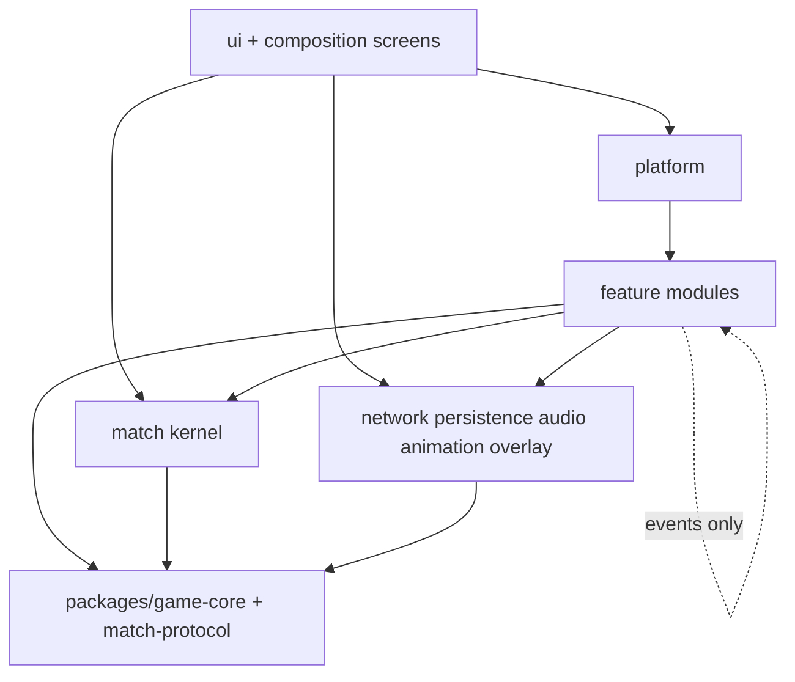
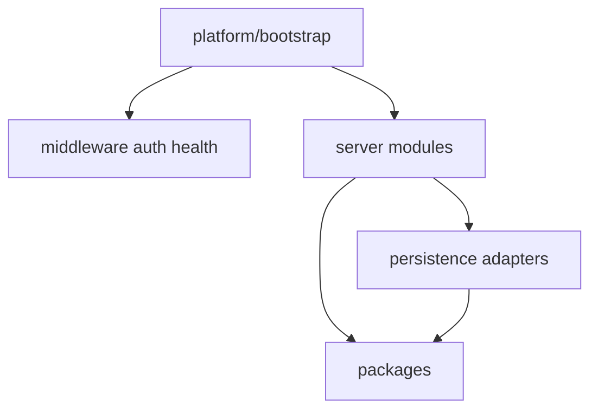
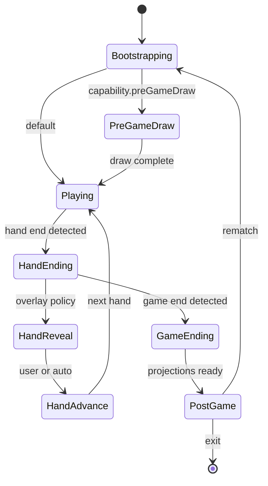
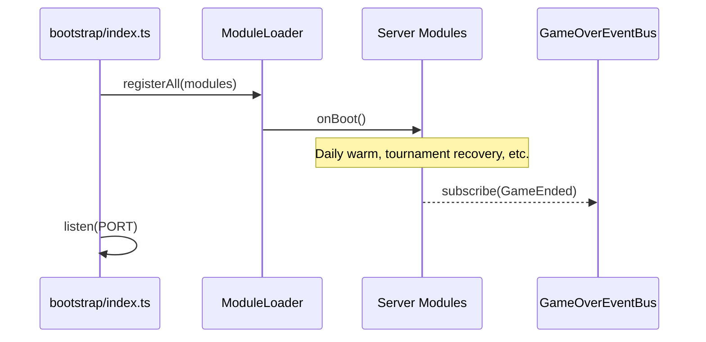
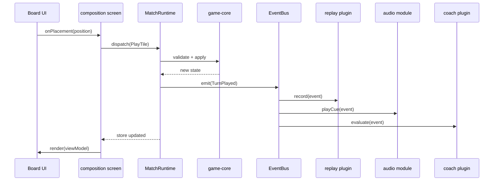
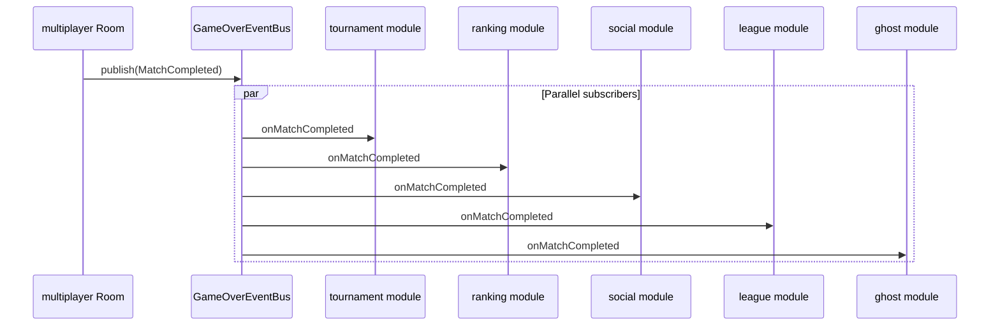

# Racehorse Dominoes — Ten-Year Architecture Blueprint

**Document type:** Engineering design specification (approval gate before implementation)  
**Author role:** CTO / Principal Architect  
**Status:** Draft for approval  
**Supersedes:** Refactor-oriented decomposition in `godfilesAUDIT.md` (audit remains valid; this document defines the *target system*, not a file-move plan)  
**Scope:** Entire product platform — client, server, shared domain, operations

---

## 0. Approval Gate

This blueprint is **not** an extraction checklist. It defines the system we are building toward.

**Implementation must not begin until:**

- [ ] Engineering leadership approves bounded contexts and ownership map
- [ ] Each bounded context has a named DRI (directly responsible individual) or team
- [ ] Import law and module contracts are accepted as CI-enforced rules
- [ ] Challenge gates (Section 15) are explicitly signed off

---

## 1. Mandate

Racehorse Dominoes shipped successfully as a solo-developer product. The company is now scaling to **30+ engineers**, **millions of users**, and a **10-year horizon** spanning esports, spectators, replays, coaching, puzzles, daily challenges, AI, multiplayer, mobile, and future modes.

The existing architecture is **feature-complete but ownership-hostile**. Two god artifacts concentrate the system:

| Artifact | LOC | Problem |
|----------|-----|---------|
| `client/src/bot/BotMatchScreen.tsx` | ~6,450 | Application kernel disguised as a React screen |
| `server/src/index.ts` | ~5,590 | Application kernel disguised as a server entrypoint |

**The objective is not to shrink these files. The objective is to eliminate the *role* they play.**

After this program:

- `BotMatchScreen.tsx` is a **composition root** (200–400 LOC). It assembles modules. It owns no business logic and no authoritative game state.
- `server/src/index.ts` is a **bootstrap shell** (150–300 LOC). It creates infrastructure and registers modules. It owns no business logic.

Everything else lives in **bounded contexts** with clear ownership, test boundaries, and evolution paths.

---

## 2. North Star Principles

### 2.1 Think in systems, not screens

A screen is a view. The **Match Runtime** is the system. Replay, Review, Coach, Ghost, Daily, and Multiplayer are **adjacent systems** that attach to the runtime through contracts — not through 6,000-line React components.

### 2.2 Bounded contexts over folders

Folders organize code. **Bounded contexts** organize *cognition and ownership*. A new engineer should onboard to one context in days, not weeks.

### 2.3 Controllers coordinate; they do not accumulate

A controller has **one reason to change**. Controllers subscribe to events and emit commands. They are not React hooks, not god objects, and not dumping grounds for "related stuff."

### 2.4 Domain never depends on UI or transport

`game/` and `packages/game-core/` have zero imports from React, Express, or Socket.IO.

### 2.5 Cross-context integration is event- or contract-based

Modules do not reach into each other's `internal/` trees. They integrate through:

- **Domain events** (in-process bus)
- **Published commands** (intent API)
- **Read models** (projections / view models)

### 2.6 Optimize for parallel engineering velocity

Twenty engineers should mean twenty **non-overlapping PR surfaces**, not twenty people editing the same screen.

---

## 3. Bounded Contexts

These are the **authoritative module boundaries** for Racehorse. Each is independently understandable, testable, and ownable.

| Context | Owns | Does NOT own |
|---------|------|--------------|
| **game** | Domino rules, legality, scoring math, invariants, pure state transitions | UI, networking, persistence, timers |
| **match** | Session kernel, turn lifecycle, hand/game transitions, input routing, local run guards | Ghost logic, daily scoring, coach copy, board rendering |
| **replay** | Event log schema, recording, playback timeline, seek, export | Match rules, review UI, analytics pipelines |
| **review** | Post-game analysis, pivotal review policy, analyzer orchestration | Live match loop, replay storage format |
| **coach** | Learning coach eval, guided lesson playback, authoring capture | Match state authority, ghost comparison |
| **ghost** | Ghost sessions, suggestion engine, agreement semantics, completion | Fritz AI, board layout, ranking math |
| **daily** | Daily Fritz + Daily Puzzle ladder (challenges, leaderboards, streaks) | In-match domino rules, multiplayer rooms |
| **journey** | Campaign map, trials, progression gates | Coach content, match engine |
| **multiplayer** | Rooms, sockets, sync, reconnect, masking, live persistence | Bot AI, daily challenge generation |
| **tournament** | Brackets, scheduling, dispatch, recovery | Live room engine (consumes multiplayer) |
| **ranking** | Glicko, rated game ingestion, leaderboards | Match completion UI, ghost profiles |
| **league** | Seasons, fixtures, forfeits, rollover | Live gameplay |
| **social** | Friends, presence, invites, activity feed writes | Match state |
| **analytics** | Telemetry, fairness logs, debug rings, product metrics | Gameplay decisions |
| **network** | HTTP/WebSocket clients, auth headers, retry policy | Business validation |
| **persistence** | Storage adapters (Supabase, sessionStorage, IndexedDB) | Domain rules |
| **audio** | Sound registry, cue mapping, mute preference | Game events (subscribes only) |
| **animation** | Motion/timeline effects (draw fly, confetti, pulses) | Game state |
| **overlay** | Modal stack, overlay priority, portal host | Feature copy / business rules |
| **platform** (client) | App shell, routing, auth gate, module registry | Match rules |
| **platform** (server) | Bootstrap, middleware, health, module registration | Daily puzzle validation |

**Shared kernel (packages):** `game-core`, `match-protocol`, `calendar`, `identity` — published npm workspaces consumed by client and server.

---

## 4. Complete Ownership Map

Every responsibility currently trapped in god files is reassigned below.

**Legend:**  
`→` means *new owner module* (not a file rename in place).

### 4.1 Client — `BotMatchScreen.tsx` Responsibilities

| # | Responsibility | Current Location | New Owner | Reason |
|---|----------------|------------------|-----------|--------|
| 1 | Authoritative `BotMatchState` | BotMatchScreen `useState` | **match** → `MatchSessionStore` | State is match runtime concern, not React |
| 2 | Match initialization (8+ paths) | BotMatchScreen lazy init | **match** → `MatchBootstrapService` | Init is session composition, not rendering |
| 3 | Turn loop orchestration | BotMatchScreen effects | **match** → `MatchLifecycleController` | Lifecycle is kernel responsibility |
| 4 | Player move application | BotMatchScreen handlers | **match** → `PlayerActionController` | Input becomes commands via match |
| 5 | Bot turn scheduling | BotMatchScreen `useEffect` | **match** → `BotTurnController` + **game** bot policy | Scheduling is runtime; heuristics stay in game/bot |
| 6 | `applyAndNotify` side-effect hub | BotMatchScreen | **match** → `MatchEventDispatcher` | Single outbound event fan-out point |
| 7 | Pass/draw/play sequencing | BotMatchScreen | **game** engine + **match** controller | Rules vs orchestration split |
| 8 | Legal move enumeration | BotMatchScreen | **game** → `LegalMoveService` | Pure domain |
| 9 | Open ends display projection | BotMatchScreen | **match** → `BoardProjectionService` | Read model for UI |
| 10 | Hand-over detection | BotMatchScreen | **game** rules + **match** lifecycle | Detection pure; transition orchestrated |
| 11 | Hand reveal scheduling | BotMatchScreen timers | **match** → `HandTransitionController` | Timers belong to match runtime |
| 12 | Hand auto-advance / retry / watchdog | BotMatchScreen refs | **match** → `HandTransitionController` | Same |
| 13 | Game-over detection | BotMatchScreen | **game** + **match** | Pure eval + lifecycle hook |
| 14 | Rematch / fresh match | BotMatchScreen | **match** → `MatchBootstrapService` | Session concern |
| 15 | Local run token / race guards | BotMatchScreen refs | **match** → `ConcurrencyGuard` | Runtime infra |
| 16 | Pre-game tile draw flow | BotMatchScreen + hook | **match** → `PreGameDrawController` | Match-phase subsystem |
| 17 | Scripted DF draw readiness | BotMatchScreen | **daily** → `DailyFritzDrawPolicy` | Daily domain policy |
| 18 | Fritz `chooseBotMove` invocation | BotMatchScreen | **game** → `BotDecisionService` | AI/heuristics domain |
| 19 | Fritz fairness logging | BotMatchScreen | **analytics** → `FairnessTelemetry` | Observability, not gameplay |
| 20 | Bot chain pause | BotMatchScreen ref | **match** → `BotTurnController` | Runtime control |
| 21 | Draw step animation (state) | BotMatchScreen | **animation** → `DrawAnimationController` | Presentation system |
| 22 | Flying tile overlays | BotMatchScreen | **animation** → `TileFlightController` | Presentation system |
| 23 | Draw pulse index | BotMatchScreen | **animation** | Visual-only state |
| 24 | Daily Fritz sessionStorage debounce | BotMatchScreen effect | **persistence** → `DailyFritzSessionStore` | Storage adapter |
| 25 | Daily Fritz pagehide flush | BotMatchScreen effect | **persistence** | Browser lifecycle in persistence |
| 26 | Daily Fritz next-hand API | BotMatchScreen `advanceHand` | **daily** → `DailyFritzHandService` | Daily context owns server contract |
| 27 | Daily Fritz next-hand prefetch cache | BotMatchScreen refs | **daily** → `DailyFritzHandCache` | Daily optimization |
| 28 | Daily Fritz completion submit | BotMatchScreen effect | **daily** → `DailyFritzCompletionService` | Daily context |
| 29 | Daily Fritz completion hash | BotMatchScreen | **daily** (+ shared **match-protocol**) | Anti-cheat belongs to daily + protocol |
| 30 | Daily Fritz rank/leaderboard preview | BotMatchScreen | **daily** → read model | Daily read path |
| 31 | Daily Fritz share text | BotMatchScreen | **daily** → `DailyShareService` | Daily product surface |
| 32 | Daily Fritz set overlay props | BotMatchScreen | **daily** view model + **overlay** | Data vs presentation |
| 33 | Daily Fritz debug trace | BotMatchScreen | **analytics** → `DailyFritzTrace` | Telemetry |
| 34 | Ranked PVF session start | BotMatchScreen effect | **ranking** → `VerifiedMatchClient` | Rated play is ranking context |
| 35 | Ranked PVF abandon on pagehide | BotMatchScreen | **ranking** + **network** | Contract + transport |
| 36 | Verified match ID state | BotMatchScreen | **ranking** → `VerifiedMatchSession` | Ranking/session artifact |
| 37 | Glicko prediction display | BotMatchScreen | **ranking** → `RatingProjectionService` | Ranking read model |
| 38 | Post-game rating sync UI state | BotMatchScreen | **ranking** view model | Ranking projection |
| 39 | Ghost session start | BotMatchScreen effect | **ghost** → `GhostSessionController` | Ghost owns ghost lifecycle |
| 40 | Ghost move log | BotMatchScreen | **replay** records + **ghost** annotates | Replay is canonical log; ghost adds semantic layer |
| 41 | Ghost suggestion comparison | BotMatchScreen | **ghost** → `GhostSuggestionService` | Ghost-specific |
| 42 | Ghost agreement UI state | BotMatchScreen | **ghost** view model | Ghost presentation state |
| 43 | Ghost completion API | BotMatchScreen effect | **ghost** → `GhostCompletionService` | Ghost + network |
| 44 | Ghost played tile overlay | BotMatchScreen | **ghost** view model + **animation** | Split data vs motion |
| 45 | Guided v1 frozen lesson load | BotMatchScreen init | **coach** → `GuidedLessonLoader` | Coach/Learn content |
| 46 | Guided v1 transcript replay | BotMatchScreen effects | **coach** → `GuidedTranscriptPlayer` | Coach playback |
| 47 | Guided v2 event playback | BotMatchScreen effects | **coach** → `GuidedTimelinePlayer` | Coach playback |
| 48 | Off-authored-line detection | BotMatchScreen | **coach** → `GuidedLineagePolicy` | Pedagogy rules |
| 49 | Lesson step index | BotMatchScreen | **coach** → `GuidedProgressStore` | Coach state |
| 50 | Authoring v1 step recording | BotMatchScreen | **coach** → `AuthoringCaptureController` | Coach authoring |
| 51 | Authoring v2 event timeline | BotMatchScreen | **coach** → `AuthoringTimelineController` | Coach authoring |
| 52 | Guided match candidate capture | BotMatchScreen | **coach** → `GuidedCandidateController` | Coach tooling |
| 53 | Learning coach eval | BotMatchScreen `useLearningCoach` | **coach** → `CoachEvaluationController` | Coach core |
| 54 | Coach tips / best move UI | BotMatchScreen | **coach** view model | Coach read model |
| 55 | Coached tile highlighting | BotMatchScreen | **coach** + **match** board projection | Coach suggests; match projects |
| 56 | Journey trial exit/complete | BotMatchScreen | **journey** → `JourneyTrialController` | Journey context |
| 57 | Move log for analyzer | BotMatchScreen `appendMove` | **replay** → `ReplayRecorder` | Replay owns canonical timeline |
| 58 | Engine best-move snapshots in log | BotMatchScreen | **replay** + **game** | Replay stores; game computes |
| 59 | GameReviewer open/close | BotMatchScreen | **review** → `ReviewSessionController` | Review system |
| 60 | Pivotal review hooks | BotMatchScreen | **review** → `PivotalReviewController` | Review system |
| 61 | Post-game analysis state | BotMatchScreen | **review** → `PostGameAnalysisService` | Review system |
| 62 | Daily puzzle leaderboard (legacy path) | BotMatchScreen | **daily** → `DailyPuzzleLeaderboardService` | Daily context |
| 63 | All `queueSound` calls | BotMatchScreen scattered | **audio** → `AudioController` | Subscribes to match events |
| 64 | Confetti on win | BotMatchScreen | **animation** → `CelebrationController` | Subscribes to match events |
| 65 | Score toast animation | BotMatchScreen | **overlay** + **animation** | Overlay hosts; animation timing |
| 66 | Ghost board pulse | BotMatchScreen | **animation** | Visual |
| 67 | Hand reveal progress | BotMatchScreen | **overlay** → `HandResultOverlayController` | Overlay subsystem |
| 68 | Mute / fullscreen / score track | BotMatchScreen + hook | **platform** → `MatchChromeController` | Chrome prefs, not gameplay |
| 69 | Leave game modal | BotMatchScreen | **overlay** + **platform** navigation | Overlay + shell |
| 70 | Board shell layout fork | BotMatchScreen JSX | **composition** view only | Layout is assembly |
| 71 | `MatchLiveLayout` wiring | BotMatchScreen | **composition** + **match** view model | Screen composes |
| 72 | Hand tile responsive sizing | BotMatchScreen effect | **platform** → `ResponsiveLayoutService` | Layout utility |
| 73 | Tile selection state | BotMatchScreen | **match** → `SelectionController` | Input subsystem |
| 74 | Placement click handling | BotMatchScreen | **match** → `PlacementController` | Input subsystem |
| 75 | Playable tile keys | BotMatchScreen | **match** board projection | Read model |
| 76 | HUD turn labels / pills | BotMatchScreen JSX | **composition** components | Dumb UI |
| 77 | Modal stack / portals | BotMatchScreen | **overlay** → `OverlayStackController` | Overlay system |
| 78 | `botMatchApi` calls | BotMatchScreen | **network** clients consumed by **ranking** | Transport separation |
| 79 | `dailyFritz/api` calls | BotMatchScreen | **network** consumed by **daily** | Transport separation |
| 80 | `ghost/api` calls | BotMatchScreen | **network** consumed by **ghost** | Transport separation |
| 81 | Supabase access token fetch | BotMatchScreen | **platform** → `AuthTokenProvider` | Platform auth |
| 82 | sessionStorage keys | BotMatchScreen | **persistence** | Storage |
| 83 | Debug localStorage flags | BotMatchScreen | **analytics** / **platform** dev config | Non-prod config |
| 84 | `botMatchDebugLog` | BotMatchScreen | **analytics** | Telemetry |
| 85 | `dailyFritzDebugLog` | BotMatchScreen | **analytics** | Telemetry |
| 86 | Layout debug logging | BotMatchScreen | **analytics** | Telemetry |
| 87 | Navigation callbacks | BotMatchScreen | **platform** → `NavigationController` | App shell |
| 88 | Mode boolean matrix | BotMatchScreen | **match** → `MatchModeRegistry` | Single enum + capability flags |
| 89 | Toast messages | BotMatchScreen | **overlay** → `ToastController` | Ephemeral UI |
| 90 | Opponent label formatting | BotMatchScreen | **match** view model | Presentation derivation |
| 91 | Post-game overlay visibility gating | BotMatchScreen | **overlay** priority policy | Overlay system |
| 92 | Error state for malformed match | BotMatchScreen | **match** invariant guard + **composition** error view | Fail-fast at kernel |

### 4.2 Server — `index.ts` Responsibilities

| # | Responsibility | Current Location | New Owner | Reason |
|---|----------------|------------------|-----------|--------|
| 1 | `loadEnv` | index.ts | **platform** → `bootstrap/env` | Bootstrap only |
| 2 | Sentry init | index.ts | **platform** → `bootstrap/observability` | Bootstrap only |
| 3 | Express app creation | index.ts | **platform** → `bootstrap/http` | Bootstrap only |
| 4 | CORS policy | index.ts | **platform** → `middleware/cors` | Cross-cutting middleware |
| 5 | JSON body parser | index.ts | **platform** | Standard middleware |
| 6 | Rate limiter construction | index.ts | **platform** → `middleware/rateLimit` | Middleware |
| 7 | Per-route rate limit mounts | index.ts | **platform** + module route tables | Modules declare limits |
| 8 | Global error handler | index.ts | **platform** → `middleware/errorHandler` | Middleware |
| 9 | HTTP server timeouts | index.ts | **platform** → `bootstrap/http` | Infra |
| 10 | Socket.IO server creation | index.ts | **platform** → `bootstrap/socket` | Bootstrap |
| 11 | Socket CORS origins | index.ts | **platform** | Bootstrap config |
| 12 | `server.listen` | index.ts | **platform** → `bootstrap/start` | Bootstrap |
| 13 | Graceful shutdown | index.ts | **platform** → `bootstrap/shutdown` | Bootstrap |
| 14 | `/health` `/ping` | index.ts | **platform** → `health` module | Platform module |
| 15 | `/ready` composite readiness | index.ts | **platform** → `health/ReadinessAggregator` | Platform aggregates module health |
| 16 | Env presence reporting | index.ts | **platform** | Ops |
| 17 | Supabase latency probe | index.ts | **persistence** → `SupabaseHealthProbe` | Persistence health |
| 18 | Release version | index.ts | **platform** | Build metadata |
| 19 | JWT auth from header | index.ts | **platform** → `auth/RestAuthenticator` | Shared auth |
| 20 | Auth sync for rate limit key | index.ts | **platform** | Middleware integration |
| 21 | Admin secret validation | index.ts | **platform** → `auth/AdminAuthenticator` | Shared auth |
| 22 | Socket identity resolution | index.ts | **platform** → `auth/SocketAuthenticator` | Shared auth |
| 23 | Auth TTL cache | index.ts | **platform** → `auth/TokenCache` | Auth infra |
| 24 | Ranking REST routes | index.ts | **ranking** module HTTP adapter | Ranking owns API |
| 25 | Ghost profile routes | index.ts | **ghost** module | Ghost owns API |
| 26 | Ghost complete validation | index.ts | **ghost** → `CompleteGhostMatchHandler` | Ghost application service |
| 27 | Verified single-player match types | index.ts | **ranking** + **match-protocol** shared package | Cross-cutting integrity contract |
| 28 | Verified match memory cache | index.ts | **ranking** → `VerifiedMatchCache` | Ranking/session integrity |
| 29 | Verified match Supabase CRUD | index.ts | **persistence** repo consumed by **ranking** | Repository pattern |
| 30 | Verified match start/abandon | index.ts | **ranking** → `VerifiedMatchService` | Ranking owns rated sessions |
| 31 | Completion hash (ghost/fritz) | index.ts | **match-protocol** + **ranking** | Shared anti-tamper contract |
| 32 | Bot match local start/resolve/abandon | index.ts | **ranking** + **ghost** (Fritz path) | Split by mode |
| 33 | Bot match cleanup cron | index.ts | **ranking** → `StaleMatchJanitor` | Ranking hygiene |
| 34 | Pacific timezone utilities | index.ts | **packages/calendar** | Shared domain utility |
| 35 | Daily Fritz row mappers | index.ts | **daily** → `DailyFritzRepository` | Daily persistence |
| 36 | Daily Fritz run cache | index.ts | **daily** → `DailyFritzRunCache` | Daily module |
| 37 | Daily Fritz warmup scheduler | index.ts | **daily** → `DailyFritzWarmupJob` | Daily cron |
| 38 | Daily Fritz REST (12 routes) | index.ts | **daily** HTTP adapter | Daily module |
| 39 | Daily Fritz leaderboard build | index.ts | **daily** → `DailyFritzLeaderboardService` | Daily module |
| 40 | Daily Fritz admin ops | index.ts | **daily** → `DailyFritzAdminService` | Daily module |
| 41 | Daily Puzzle slot/attempt repos | index.ts | **daily** → `DailyPuzzleRepository` | Daily module |
| 42 | Daily Puzzle ladder warm cron | index.ts | **daily** → `DailyPuzzleWarmupJob` | Daily module |
| 43 | Daily Puzzle REST (6 routes) | index.ts | **daily** HTTP adapter | Daily module |
| 44 | Daily Puzzle streak logic | index.ts | **daily** → `DailyPuzzleStreakService` | Daily module |
| 45 | League REST routes | index.ts | **league** HTTP adapter | League module |
| 46 | Home daily summary | index.ts | **daily** + **platform** home aggregator | Cross-module read |
| 47 | Stats record-match | index.ts | **analytics** / **ranking** ingestion | Stats pipeline |
| 48 | Social router mount | index.ts | **social** module registration | Social module |
| 49 | Room events REST | index.ts | **replay** / **multiplayer** archive API | Replay archive access |
| 50 | `createGameOverPersistScheduler` | index.ts | **platform** → `GameOverEventBus` + per-module subscribers | **Eliminate god closure** — see Section 10.2 |
| 51 | Tournament game-over hook | index.ts closure | **tournament** subscriber | Tournament reacts to event |
| 52 | Match log append on game over | index.ts closure | **analytics** subscriber | Analytics reacts |
| 53 | Activity feed write on game over | index.ts closure | **social** subscriber | Social reacts |
| 54 | Ranked insert on game over | index.ts closure | **ranking** subscriber | Ranking reacts |
| 55 | Realtime Glicko update | index.ts closure | **ranking** subscriber | Ranking reacts |
| 56 | Ghost complete from room log | index.ts closure | **ghost** subscriber | Ghost reacts |
| 57 | League fixture auto-finalize | index.ts closure | **league** subscriber | League reacts |
| 58 | Matchmaking record end | index.ts closure | **multiplayer** subscriber | MP reacts |
| 59 | Fritz pending match insert/resolve | index.ts | **ranking** → `PendingFritzMatchService` | Ranking |
| 60 | Fritz forfeit on disconnect | index.ts | **ranking** + **multiplayer** event | Cross-module via bus |
| 61 | Matchmaking room hydration | index.ts | **multiplayer** → `MatchmakingHydrationService` | MP module |
| 62 | Socket-ready wait | index.ts | **multiplayer** | MP module |
| 63 | `initRoomSession` callback bag | index.ts | **multiplayer** module factory | MP owns wiring |
| 64 | `socketsByUserId` map | index.ts | **social** → `PresenceRegistry` | Social/presence |
| 65 | Presence identify/online handlers | index.ts | **social** socket adapter | Social module |
| 66 | Friend invite decline handler | index.ts | **social** socket adapter | Social module |
| 67 | Legacy tournament socket handlers | index.ts | **tournament** legacy adapter | Quarantined |
| 68 | Room chat/emote handlers | index.ts | **social** or **multiplayer** (pick: **social**) | Communication |
| 69 | `stats:weekly` socket | index.ts | **analytics** socket adapter | Analytics |
| 70 | `/api/mp-stats` | index.ts | **multiplayer** ops metrics | MP module |
| 71 | `registerMatchmakingHandlers` call | index.ts | **multiplayer** module `register()` | Module registration |
| 72 | `registerRoomSessionHandlers` call | index.ts | **multiplayer** module `register()` | Module registration |
| 73 | `initScheduledTournaments` call | index.ts | **tournament** module `register()` | Module registration |
| 74 | Daily content startup warm | index.ts | **daily** module `onBoot()` | Module lifecycle hook |

### 4.3 Secondary God Artifacts (Out of Scope but Named)

These are **not** the primary deliverable but are explicitly queued for the same treatment:

| Artifact | LOC | Target |
|----------|-----|--------|
| `client/src/App.tsx` | ~1,590 | **platform** shell + **multiplayer** composition root |
| `server/src/rooms.ts` | ~1,070 | **multiplayer** → `RoomAggregate` + **game** engine delegate |
| `server/src/multiplayer/registerRoomSessionHandlers.ts` | ~1,580 | **multiplayer** socket adapter split by concern |

The blueprint applies the same rules. The program phases them after kernel establishment.

---

## 5. Controller Catalog

Controllers are **application-layer coordinators** inside a bounded context. They are instantiated by the module factory, not by React hooks.

### 5.1 Match Runtime (client kernel)

| Controller | Single Responsibility |
|------------|----------------------|
| `MatchSessionController` | Owns session lifetime (start, pause, teardown) |
| `MatchLifecycleController` | Phases: playing → hand end → game end |
| `PlayerActionController` | Player intents → validated commands |
| `BotTurnController` | Schedules and executes bot turns |
| `HandTransitionController` | Hand reveal, advance, retry, watchdog |
| `PreGameDrawController` | Pre-game draw phase |
| `SelectionController` | Tile selection state machine |
| `PlacementController` | Board placement intents |
| `MatchEventDispatcher` | Publishes domain events to bus |
| `ConcurrencyGuard` | Async run tokens, stale work rejection |
| `MatchModeRegistry` | Resolves mode capabilities from config |

### 5.2 Feature Controllers (attach via plugins)

| Controller | Context | Single Responsibility |
|------------|---------|----------------------|
| `ReplayController` | replay | Record/playback timeline |
| `ReviewSessionController` | review | Analyzer session |
| `PivotalReviewController` | review | Pivotal-turn review policy |
| `CoachEvaluationController` | coach | Live coaching eval |
| `GuidedTimelinePlayer` | coach | V2 scripted playback |
| `GuidedTranscriptPlayer` | coach | V1 transcript playback |
| `AuthoringCaptureController` | coach | Authoring capture |
| `GhostSessionController` | ghost | Ghost session lifecycle |
| `GhostSuggestionService` | ghost | Move comparison semantics |
| `DailyFritzHandService` | daily | Next-hand orchestration |
| `DailyFritzCompletionService` | daily | Completion + hash submit |
| `DailyPuzzleRunService` | daily | Ladder run state |
| `JourneyTrialController` | journey | Trial lifecycle |
| `VerifiedMatchClient` | ranking | Client rated session sync |
| `OverlayStackController` | overlay | Modal priority stack |
| `HandResultOverlayController` | overlay | Hand result presentation |
| `ToastController` | overlay | Ephemeral messages |
| `AudioController` | audio | Event → sound mapping |
| `DrawAnimationController` | animation | Draw visuals |
| `CelebrationController` | animation | Win celebration |
| `TileFlightController` | animation | Tile motion |
| `MatchChromeController` | platform | Mute, fullscreen, score track |

### 5.3 Server Application Services (not in bootstrap)

| Service | Context | Single Responsibility |
|---------|---------|----------------------|
| `CompleteGhostMatchHandler` | ghost | Ghost completion use-case |
| `VerifiedMatchService` | ranking | Verified session integrity |
| `DailyFritzRunService` | daily | Run lifecycle |
| `DailyFritzAttemptService` | daily | Attempt lifecycle |
| `DailyPuzzleLadderService` | daily | Ladder lifecycle |
| `GameOverEventBus` | platform | Publish `MatchCompleted` domain event |
| `RoomSessionFactory` | multiplayer | Creates room session with injected bus |
| `PresenceRegistry` | social | Socket presence index |
| `RankingIngestionService` | ranking | Idempotent rated game insert |
| `TournamentGameOverHandler` | tournament | Bracket advance on event |

---

## 6. Future Repository Structure

This is the architecture we would build **on day one** with 30 engineers — expressed as a monorepo compatible with the existing `client/` + `server/` layout.

```
racehorse-dominoes/
├── packages/                              # SHARED — publishable, versioned
│   ├── game-core/                         # Pure domino engine
│   │   ├── src/
│   │   │   ├── rules/
│   │   │   ├── scoring/
│   │   │   ├── invariants/
│   │   │   └── bot/                       # Heuristics (no React)
│   │   └── tests/
│   ├── match-protocol/                    # Cross-client/server contracts
│   │   ├── src/
│   │   │   ├── events/                    # MatchEvent union
│   │   │   ├── commands/
│   │   │   ├── snapshots/
│   │   │   └── integrity/                 # Completion hashes
│   │   └── tests/
│   ├── calendar/                          # Pacific date, streak keys
│   └── identity/                          # UserId, auth claims types
│
├── apps/
│   ├── client/
│   │   └── src/
│   │       ├── platform/                  # App shell — NOT gameplay
│   │       │   ├── bootstrap/             # React root, providers
│   │       │   ├── routing/
│   │       │   ├── auth/
│   │       │   ├── navigation/
│   │       │   └── module-registry/       # ClientModuleLoader
│   │       │
│   │       ├── modules/                   # BOUNDED CONTEXTS
│   │       │   ├── game/                  # Re-exports @racehorse/game-core wrappers
│   │       │   ├── match/                 # RUNTIME KERNEL
│   │       │   │   ├── controllers/
│   │       │   │   ├── services/
│   │       │   │   ├── store/
│   │       │   │   ├── projections/       # View models for UI
│   │       │   │   ├── plugins/           # Plugin host interface
│   │       │   │   ├── events/
│   │       │   │   ├── internal/          # NEVER imported externally
│   │       │   │   ├── index.ts           # PUBLIC API ONLY
│   │       │   │   └── tests/
│   │       │   ├── replay/
│   │       │   ├── review/
│   │       │   ├── coach/
│   │       │   ├── ghost/
│   │       │   ├── daily/
│   │       │   ├── journey/
│   │       │   ├── ranking/               # Client-side ranking projections
│   │       │   ├── multiplayer/           # MP client (extracted from App)
│   │       │   ├── tournament/
│   │       │   ├── analytics/
│   │       │   ├── network/
│   │       │   ├── persistence/
│   │       │   ├── audio/
│   │       │   ├── animation/
│   │       │   └── overlay/
│   │       │
│   │       ├── composition/               # SCREENS — assembly only
│   │       │   ├── LocalMatchExperience.tsx    # Replaces god BotMatchScreen
│   │       │   ├── MultiplayerMatchExperience.tsx
│   │       │   ├── DailyFritzHub.tsx
│   │       │   └── ...
│   │       │
│   │       └── ui/                        # Design system / dumb components
│   │           ├── board/
│   │           ├── hand/
│   │           ├── hud/
│   │           └── primitives/
│   │
│   └── server/
│       └── src/
│           ├── platform/                  # BOOTSTRAP ONLY
│           │   ├── bootstrap/
│           │   │   ├── index.ts           # 150–300 LOC max
│           │   │   ├── createApp.ts
│           │   │   ├── createSocket.ts
│           │   │   └── start.ts
│           │   ├── middleware/
│           │   ├── health/
│           │   ├── auth/
│           │   └── module-registry/       # ServerModuleLoader
│           │
│           └── modules/                   # BOUNDED CONTEXTS (mirror client)
│               ├── game/
│               ├── match/                 # Room aggregate policies
│               ├── replay/
│               ├── multiplayer/
│               ├── tournament/
│               ├── ranking/
│               ├── ghost/
│               ├── daily/
│               ├── league/
│               ├── social/
│               ├── analytics/
│               ├── persistence/
│               └── network/
│
├── docs/
│   ├── architecture/
│   │   ├── ARCHITECTURE-BLUEPRINT.md      # This document
│   │   └── godfilesAUDIT.md
│   └── ownership/
│       └── CODEOWNERS                     # Per module path
│
└── tooling/
    ├── boundary-enforcer/                 # dependency-cruiser / eslint rules
    └── module-scaffold/                   # `pnpm gen:module ghost`
```

### 6.1 Module Internal Shape (mandatory template)

Every module **must** follow this shape:

```
modules/<context>/
├── index.ts                 # PUBLIC API — only export surface
├── module.ts                # registerClient() / registerServer()
├── controllers/
├── services/
├── models/
├── events/
├── projections/             # Read models (client) or DTOs (server)
├── adapters/                # HTTP, socket, storage implementations
├── internal/                # Private implementation
└── tests/
    ├── unit/
    ├── contract/            # API contract tests
    └── integration/
```

---

## 7. Module Contracts & Public APIs

### 7.1 Match module public API (client kernel)

```typescript
// apps/client/src/modules/match/index.ts — illustrative contract

export type MatchConfig = { mode: MatchMode; capabilities: CapabilityFlags; ... };

export function createMatchRuntime(config: MatchConfig): MatchRuntime;

export interface MatchRuntime {
  readonly store: ReadonlyMatchStore;
  subscribe(listener: MatchListener): Unsubscribe;
  dispatch(command: MatchCommand): void;
  registerPlugin(plugin: MatchPlugin): void;
  destroy(): void;
}

export interface MatchPlugin {
  readonly id: string;
  onAttach(runtime: MatchRuntimeApi): void;
  onDetach(): void;
}

export type MatchViewModel = { ... }; // UI-readonly projection
export function selectMatchViewModel(store: ReadonlyMatchStore): MatchViewModel;
```

**Rules:**
- UI imports **only** `createMatchRuntime`, `selectMatchViewModel`, and typed commands.
- Plugins (ghost, daily, coach) import `MatchPlugin` — never `internal/`.
- No other module imports `MatchSessionStore` directly.

### 7.2 Event bus contract (cross-module integration)

```typescript
// packages/match-protocol/src/events/MatchEvent.ts

export type MatchDomainEvent =
  | { type: 'MatchStarted'; ... }
  | { type: 'TurnPlayed'; ... }
  | { type: 'HandEnded'; ... }
  | { type: 'GameEnded'; ... }
  | { type: 'CommandRejected'; ... };
```

**Subscribers (examples):**
- `replay` subscribes to `TurnPlayed`, `HandEnded` → records timeline
- `audio` subscribes to `TurnPlayed`, `HandEnded`, `GameEnded` → plays cues
- `analytics` subscribes to all → telemetry
- `ghost` subscribes to `TurnPlayed` when ghost plugin active → annotates
- `coach` subscribes when coach plugin active → evaluates

**Match kernel does not call `ghost.complete()` or `queueSound()` directly.**

### 7.3 Server module registration contract

```typescript
// apps/server/src/platform/module-registry/ServerModule.ts

export interface ServerModule {
  readonly name: string;
  registerHttp(router: ModuleRouter): void;
  registerSocket(socketRegistrar: SocketRegistrar): void;
  onBoot(ctx: BootContext): Promise<void>;
  onShutdown(): Promise<void>;
  healthCheck(): Promise<HealthReport>;
}
```

`platform/bootstrap/index.ts`:

```typescript
const modules = [
  HealthModule,
  AuthModule,
  RankingModule,
  GhostModule,
  DailyModule,
  MultiplayerModule,
  TournamentModule,
  SocialModule,
  LeagueModule,
  AnalyticsModule,
];
await ModuleLoader.registerAll(app, io, modules);
```

---

## 8. Dependency Graph

### 8.1 Client — allowed direction



**Forbidden edges:**
- `packages/*` → anything in `apps/`
- `ui/*` → `modules/*/internal`
- `coach` → `ghost/internal`
- `ghost` → `coach/internal`
- `match/internal` → any feature module
- `game-core` → `match-protocol` (protocol may depend on game types, not vice versa)

### 8.2 Server — allowed direction



**Forbidden edges:**
- `bootstrap/index.ts` → `supabaseFetch` (no direct DB)
- `daily` → `multiplayer/internal/rooms`
- Module → module except via **domain events** or **shared packages**

### 8.3 Cross-tier (client ↔ server)

Communication **only** through:
- `modules/network` typed clients
- `packages/match-protocol` DTOs
- No shared React or Express code

---

## 9. Import Law (CI-Enforced)

| Rule ID | Law |
|---------|-----|
| IL-01 | External code may only import a module's `index.ts` |
| IL-02 | `internal/` directories are blocked from outside the module |
| IL-03 | `composition/` may not import `internal/` of any module |
| IL-04 | `game-core` has zero runtime dependencies |
| IL-05 | Feature modules must not import other feature modules' internals |
| IL-06 | Cross-feature coordination goes through `match-protocol` events or platform event bus |
| IL-07 | `persistence` adapters are consumed via interfaces defined in owning module |
| IL-08 | Server bootstrap may not contain SQL, Supabase paths, or business validators |
| IL-09 | React components in `ui/` are dumb; no `fetch`, no `dispatch`, no business rules |
| IL-10 | Plugins must register through `MatchPlugin` — no ad-hoc imports in kernel |

**Enforcement:** `dependency-cruiser` + ESLint `no-restricted-imports` in CI. Violations block merge.

---

## 10. Team Ownership Map

| Team / DRI | Owns Modules | Owns Packages | On-call surface |
|------------|--------------|---------------|-----------------|
| **Core Game** | `game`, `match` | `game-core`, `match-protocol` | Hand stuck, illegal move, bot parity |
| **Replay & Review** | `replay`, `review` | replay schema in `match-protocol` | Analyzer, timeline, export |
| **Learn & Coach** | `coach`, `journey` | lesson content tooling | Guided playback, authoring |
| **Ghost & PVF** | `ghost`, client `ranking` | — | Ghost agreement, rated PVF |
| **Daily** | `daily` | `calendar` | Daily Fritz, Daily Puzzle ladder |
| **Multiplayer** | `multiplayer`, server `match` room policies | — | Rooms, sync, reconnect |
| **Competitive** | `tournament`, `league`, server `ranking` | — | Brackets, fixtures, Glicko |
| **Social** | `social` | — | Friends, presence, feed |
| **Platform** | `platform`, `network`, `persistence`, `overlay`, `audio`, `animation` | `identity` | Auth, boot, chrome, overlays |
| **Data & Observability** | `analytics` | — | Telemetry, fairness, dashboards |

A new engineer joins **one row** and can ignore other rows for their first month.

---

## 11. Lifecycle

### 11.1 Client — local match session lifecycle



**Ownership:**
- State machine: **match** `MatchLifecycleController`
- Pre-game draw: **match** `PreGameDrawController`
- Hand reveal overlay: **overlay** (triggered by event)
- Post-game review: **review** plugin (triggered by `GameEnded`)

### 11.2 Server — request/module lifecycle



### 11.3 Plugin attach lifecycle (client)

1. `composition/LocalMatchExperience` calls `createMatchRuntime(config)`
2. Runtime loads plugins based on `MatchModeRegistry` capabilities
3. Each plugin `onAttach()` registers event subscriptions
4. On unmount: `runtime.destroy()` → plugins `onDetach()` → timers cleared

**BotMatchScreen / LocalMatchExperience does not implement steps 2–4 logic inline.**

---

## 12. Event Flow

### 12.1 Player plays a tile (happy path)



**Note:** Composition screen forwards intent. It does not call `appendMove`, `queueSound`, or `coach.record` itself.

### 12.2 Server game over (replacing god closure)



**No single function knows about all subscribers.** Adding a subscriber does not edit bootstrap.

---

## 13. State Flow

### 13.1 Authoritative vs projected state

| State class | Authority | Consumers |
|-------------|-----------|-----------|
| `MatchState` | **match** `MatchSessionStore` | Kernel only |
| `ReplayTimeline` | **replay** `ReplayStore` | Review, export, ghost annotations |
| `CoachState` | **coach** `CoachStore` | Coach UI |
| `GhostAnnotationState` | **ghost** `GhostStore` | Ghost UI overlays |
| `DailyFritzRunState` | **daily** `DailyFritzStore` | Daily hub + daily plugin |
| `OverlayStackState` | **overlay** `OverlayStore` | All modals |
| `ChromePreferences` | **platform** `ChromeStore` | Mute, fullscreen |
| `ViewModel` | **projections** (derived, ephemeral) | React components |

**React components hold zero authoritative game state.** They receive view models.

### 13.2 State mutation rule

All mutation flows: **Intent → Command → Reducer/Service → Store → Event → Projections**

No `setState` in composition roots except for React-specific chrome (if not yet migrated to platform store).

---

## 14. Composition Root — What `BotMatchScreen` Becomes

`BotMatchScreen.tsx` is **renamed conceptually** to `LocalMatchExperience` (filename can remain for routing compatibility during transition).

### 14.1 Allowed contents (200–400 LOC)

- Parse route props → `MatchConfig`
- `const runtime = useMatchRuntime(config)` — bridge hook, **not** business logic
- Register plugins via `runtime.registerPlugin()` based on mode
- Render `<MatchLayout viewModel={vm} onIntent={runtime.dispatch} />`
- Render `<OverlayHost registry={overlayRegistry} />`
- Wire navigation callbacks to **platform** `NavigationController`

### 14.2 Forbidden contents

- `useEffect` chains that call APIs, schedule bot turns, or persist sessions
- `useState<BotMatchState>`
- Direct `chooseBotMove`, `applyPlayMove`, `completeDailyFritz`, `queueSound`
- Mode-specific `if` blocks longer than a plugin registration table

### 14.3 Plugin registration table (illustrative)

| Mode capability | Plugin module |
|-----------------|---------------|
| `ghost` | `GhostPlugin` |
| `dailyFritz` | `DailyFritzPlugin` |
| `guided` | `CoachPlugin` + `GuidedPlaybackPlugin` |
| `authoring` | `AuthoringPlugin` |
| `rankedPvf` | `RankedPvFPlugin` |
| `journeyTrial` | `JourneyPlugin` |
| always | `ReplayPlugin`, `AudioPlugin`, `AnalyticsPlugin` |

---

## 15. Challenge Gates (Must All Pass)

| Question | Answer after blueprint | How |
|----------|------------------------|-----|
| Can Replay be rewritten without touching Match? | **Yes** | Replay subscribes to `match-protocol` events; owns `ReplayStore`; swap implementation behind `ReplayPlugin` |
| Can Ghost Mode be deleted without affecting Coach? | **Yes** | Ghost is a plugin; remove registration + `ghost/` module; coach has no compile-time dependency |
| Can Daily Challenges become a separate package? | **Yes** | `daily/` is already isolated; can publish as `@racehorse/daily` consuming only `match-protocol` + `calendar` |
| Can Multiplayer evolve independently? | **Yes** | `multiplayer/` server module + client module; communicates via protocol DTOs, not shared god files |
| Can a new engineer own one subsystem without understanding the entire game? | **Yes** | Bounded context + `index.ts` public API + ownership table |

**If any answer becomes "no" during implementation, the design regresses — stop and fix the boundary.**

---

## 16. What Dies

| Concept | Fate |
|---------|------|
| God Screen pattern | Eliminated — composition roots only |
| God Server pattern | Eliminated — bootstrap only |
| 52 `useEffect` chains in one component | Replaced by event-driven controllers |
| Mode boolean spaghetti | Replaced by `MatchModeRegistry` + capability flags |
| `createGameOverPersistScheduler` mega-closure | Replaced by `GameOverEventBus` + subscribers |
| Cross-feature direct imports | Replaced by events + shared packages |
| "Helper hooks" as architecture | Hooks become thin React bridges (`useMatchRuntime`) — not owners |

---

## 17. Program Phases (Approval-Level — Not a Refactor Checklist)

Implementation proceeds as a **program**, not ad-hoc extractions.

| Phase | Program milestone | Exit criterion |
|-------|-------------------|----------------|
| **P0** | Governance | CODEOWNERS, import law in CI, module template, `match-protocol` package |
| **P1** | Server kernel | `index.ts` < 300 LOC; modules self-register; GameOverEventBus live |
| **P2** | Client kernel | `MatchRuntime` + event bus; bot loop in `match` module |
| **P3** | Plugin host | Ghost, Daily, Coach attach as plugins; BMS < 1,000 LOC |
| **P4** | Composition cutover | BMS → `LocalMatchExperience` < 400 LOC |
| **P5** | Secondary gods | `App.tsx`, `rooms.ts`, `registerRoomSessionHandlers.ts` same treatment |
| **P6** | Hardening | E2E per context, load test game-over bus, observability |

**No phase optimizes for "fewer files." Each phase optimizes for clearer ownership.**

---

## 18. Risks & Mitigations

| Risk | Mitigation |
|------|------------|
| Event bus becomes global god object | Typed events only; modules subscribe to explicit subsets; no generic "onAnything" |
| Plugin proliferation without discipline | Plugin registry audited in design review; max 15 plugins, each with DRI |
| Over-engineering early | P0–P2 deliver production value; plugins come P3 after kernel proven |
| Team ignores import law | CI blocks; architectural review for module `index.ts` changes |
| Dual architecture during migration | Feature freeze on god files except sev fixes; new features only in modules |

---

## 19. Approval Checklist

Sign-off required from:

- [ ] **CTO / Architect** — bounded contexts, dependency law, event model
- [ ] **Client lead** — MatchRuntime, composition root, plugin host
- [ ] **Server lead** — ModuleLoader, GameOverEventBus, persistence repos
- [ ] **Gameplay lead** — `game-core` parity with current `botEngine` / server engine
- [ ] **Product** — no user-visible behavior change during P0–P2
- [ ] **QA** — E2E smoke ownership per bounded context

---

## 20. Summary

This blueprint **does not center** `BotMatchScreen` or `server/index.ts`. It centers **bounded contexts** connected by **contracts and events**.

- **Match Runtime** is the client kernel — not a screen.
- **Module Loader + Event Bus** is the server kernel — not an entry file.
- **Controllers** own coordination within one context.
- **Composition roots** assemble and render — nothing more.
- **Thirty engineers** map to **ten ownership rows**, not one file.

The god files are not refactored. They are **retired from their current role** and preserved only as thin shells during cutover.

**Next step after approval:** P0 governance — `match-protocol` package, module template, CI import law, CODEOWNERS.

---

*End of blueprint.*