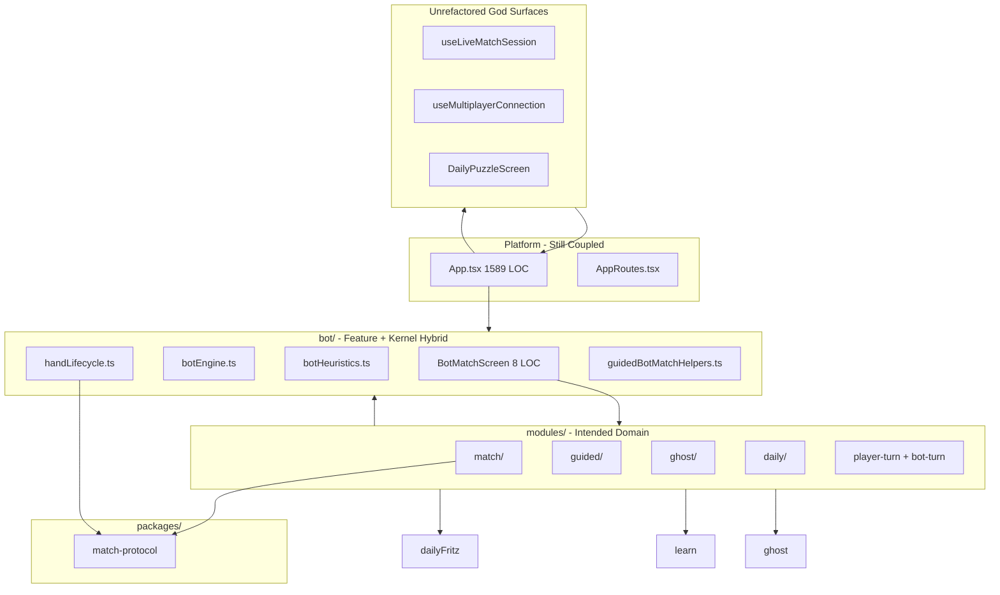

# Client Architecture Review — Principal Engineer Due Diligence

**Document type:** Technical architecture audit (design review only)  
**Reviewer role:** Principal Engineer / technical due diligence (AAA game studio lens)  
**Date:** 2026-07-03  
**Scope:** `client/` — full client, with emphasis on post-refactor bot-match decomposition  
**Status:** Read-only review. No code changes recommended for immediate execution in this document.  
**Companion docs:** `ARCHITECTURE-BLUEPRINT.md` (10-year target), `godfilesAUDIT.md` (pre-refactor audit)

---

## Executive Summary

The **BotMatchScreen decomposition is a meaningful success**: a ~6,450 LOC application kernel was reduced to an 8 LOC composition root, a 170 LOC controller, and a domain-oriented `client/src/modules/` tree. The refactor eliminated the worst single-file ownership hazard and established a repeatable pattern (bootstrap → subsystem runtimes → turn stack → view model → view).

However, this is **not yet a client-wide architecture win**. The decomposition:

- Moved complexity rather than fully resolving it (ref-bridge pattern, prop-bag view model, secondary orchestrators).
- Created **inverted dependencies** (`modules/` importing heavily from `bot/`).
- Left **parallel god architectures** untouched (multiplayer, daily puzzle screens, `App.tsx`).
- Introduced **aspirational infrastructure** (`MatchEventBus`, `MatchSessionStore`) that is only partially wired.
- Produced **thin module shards** (`fritz/`, `review/`, `daily-puzzle/`) that add navigation cost without ownership clarity.

**CTO 5-year verdict:** **Conditional approval** of the bot-match *direction*, but **not** approval of the full client architecture as-is. Approve continued investment only with explicit gates: package extraction, dependency law enforcement, multiplayer parity, ref-bridge elimination, view-layer redesign, and module test coverage.

---

## 1. Review Methodology

This review evaluated the client as if preparing for a AAA studio acquisition or platform scale-up (30+ engineers, multi-year live ops). Criteria:

| Dimension | Question |
|-----------|----------|
| Module boundaries | Do folders reflect bounded contexts with clear ownership? |
| Ownership | Can one DRI own a surface without touching unrelated domains? |
| Coupling | Are integration points explicit and few? |
| Cohesion | Do files change for one reason? |
| Dependency direction | Does domain flow inward (UI → orchestration → pure logic)? |
| Separation of concerns | Are React, runtime, rules, and transport distinct? |
| React responsibilities | Do components render; do hooks coordinate; does domain stay pure? |
| Runtime architecture | Is there one authoritative match runtime pattern? |
| Feature isolation | Can features ship without cross-feature PR conflicts? |
| Testability | Can subsystems be tested without mounting the full screen? |
| Long-term maintainability | Will a new engineer understand one context in days? |
| Developer onboarding | Is there a clear "start here" per feature? |
| Scalability | Can 20 engineers work in parallel without merge collisions? |

Evidence sources: file structure, LOC audit (`wc -l`), import graph sampling, `modules/` inventory, test file inventory, comparison against `ARCHITECTURE-BLUEPRINT.md` bounded contexts.

---

## 2. Post-Refactor Bot-Match Architecture (Current State)

### 2.1 Composition Root — Target Met

```
BotMatchScreen.tsx (8 LOC)
  └─ useBotMatchScreenController.ts (170 LOC)
       ├─ useGuidedLessonBoot
       ├─ useBotMatchBootstrap (+ MatchRuntimeBridge)
       ├─ useBotMatchRefs
       ├─ useMatchUiChrome, useReplayRecorder, useLocalRunSession
       ├─ useAuthoringCapture
       ├─ useMatchPresentation
       ├─ useGhostRuntime
       ├─ useDailyFritzRuntime
       ├─ useReviewRuntime
       ├─ useMatchTurnStack
       ├─ useFritzRatingDisplay
       ├─ useDailyPuzzleLeaderboardSync
       ├─ useMatchNavigation
       └─ createBotMatchViewModel → BotMatchScreenView
```

The controller is **legitimate composition**: it wires subsystems without embedding business rules. This matches the blueprint's "composition root" intent.

### 2.2 New Module Tree (`client/src/modules/`)

| Domain | Key artifacts | Role |
|--------|---------------|------|
| **match** | bootstrap, refs, presentation, navigation, turn stack, hand lifecycle, runtime bridge | Session kernel for bot matches |
| **guided** | runtime, coach presentation, placement handlers, V1/V2 playback effects | Coach/guided lesson playback |
| **ghost** | runtime, completion, session start | Ghost comparison mode |
| **daily** | Fritz runtime, persistence, completion, diagnostics | Daily Fritz in-match |
| **review** | `useReviewRuntime` | Post-game review wrapper |
| **fritz** | `useFritzRatingDisplay` | Glicko display for Play vs Fritz |
| **daily-puzzle** | leaderboard sync | Legacy daily puzzle inside bot shell |
| **player-turn** | `usePlayerTurnOrchestration` | Human input → engine commands |
| **bot-turn** | `useBotTurnOrchestration`, draw sequence, local run | Bot scheduling and execution |
| **replay** | `ReplayRecorder`, hook | Move log recording |

### 2.3 Infrastructure Introduced (Partially Adopted)

- `MatchEventBus`, `MatchSessionStore`, `MatchLifecycleController`, `createMatchRuntime` — wired through `useMatchRuntimeBridge` in bootstrap.
- `match-protocol` package (`@racehorse/match-protocol`) — used for capabilities and lifecycle types.
- **Gap:** Event bus is not the primary integration mechanism; most subsystems still communicate via shared refs, hook return values, and direct callback wiring.

---

## 3. Dimensional Evaluation

### 3.1 Module Boundaries — **Mixed (Bot: Good; Client: Poor)**

**Bot-match:** Boundaries are *directionally correct* but not yet authoritative. `modules/match`, `modules/guided`, `modules/ghost`, `modules/daily` approximate blueprint contexts.

**Client-wide:** Feature folders (`dailyPuzzle/`, `multiplayer/`, `learn/`, `tournament/`) remain screen-centric, not context-centric. No enforced import law between contexts.

### 3.2 Ownership — **Improved for Bot; Fragmented Elsewhere**

| Surface | Owner today | Problem |
|---------|-------------|---------|
| Bot match runtime | `modules/match` + `bot/` kernel | Split across two trees |
| Daily Fritz in-match | `modules/daily` + `bot/handLifecycle.ts` + `useHandLifecycle.ts` | Three owners |
| Guided coach | `modules/guided` + `bot/guidedBotMatchHelpers.ts` | Canonical helpers still in `bot/` |
| Multiplayer live match | `match/session/`, `multiplayer/` | No `modules/` equivalent |
| Platform shell | `App.tsx` | God application host |

### 3.3 Coupling — **High in Integration Layer**

The ref-bridge pattern in `useBotMatchRefs` creates a **dense coupling hub**:

- 15+ mutable refs bridging hooks that cannot call each other due to declaration order.
- `portsRef` and `botTurnPortsRef` hold stub callbacks later overwritten by `useMatchTurnPortWiring`.
- Every turn subsystem depends on the same ref bag.

This is a **pragmatic React workaround**, not an architecture. It couples player turn, bot turn, hand lifecycle, and presentation into one implicit graph.

### 3.4 Cohesion — **Better at File Level for Bot; View Layer Weak**

Pure domain files (`botEngine.ts`, `botHeuristics.ts`, `handLifecycle.ts` pure helpers) remain cohesive.

Orchestration files (`useHandLifecycle.ts`, `usePlayerTurnOrchestration.ts`, `useMatchTurnStack.ts`) mix multiple reasons to change.

### 3.5 Dependency Direction — **Inverted in Critical Paths**

**Expected (blueprint):** `platform → features → modules → packages/game-core`

**Actual:**

```
modules/*  ──imports──►  bot/*  (botEngine, handLifecycle, botMatchScreenTypes, guidedBotMatchHelpers)
modules/*  ──imports──►  dailyFritz/*, ghost/*, learn/*, analyzer/*
bot/*      ──imports──►  modules/*  (only at composition boundary)
```

`bot/` functions as both **feature folder** and **domain kernel**. `modules/` was intended to own match runtime, but the authoritative game engine still lives under `bot/`. This violates the blueprint's "domain never depends on UI" spirit — modules depend on feature-local types and helpers.

### 3.6 Separation of Concerns — **Partial**

| Layer | Status |
|-------|--------|
| Pure rules (`botEngine`, `handLifecycle` helpers) | Good |
| AI heuristics (`botHeuristics`) | Good |
| React orchestration hooks | Mixed — business rules leak into hooks |
| View (`BotMatchScreenView`) | Poor — layout + mode forks + overlay wiring in one component |
| Transport (`dailyFritz/api`, `ghost/api`) | Acceptable but called from hooks directly |

### 3.7 React Responsibilities — **Improved but Not Clean**

- **Screen:** Correctly thin.
- **Controller:** Correctly compositional.
- **Subsystem hooks:** Often own effects, timers, API calls, and domain decisions — blurring "controller" vs "service."
- **View:** Receives ~185 props; renders all mode variants.

### 3.8 Runtime Architecture — **Two Systems**

1. **Bot match:** `createMatchRuntime` + hook orchestration + ref bridges.
2. **Live multiplayer:** `useLiveMatchSession` / `useTournamentMatchSession` monolith hooks — no shared runtime abstraction.

These will diverge further without a shared `match` kernel contract.

### 3.9 Feature Isolation — **Low Client-Wide**

Bot-match refactor enables parallel work *within* bot surfaces. Daily puzzle screens, `App.tsx`, and multiplayer remain single-file conflict zones.

### 3.10 Testability — **Weak for New Modules**

Only **3 test files** exist under `client/src/modules/`:

- `MatchEventBus.test.ts`
- `matchCapabilitiesFromProps.test.ts`
- `ReplayRecorder.test.ts`

`useHandLifecycle`, `usePlayerTurnOrchestration`, `useMatchTurnStack`, and guided runtime hooks have **no unit tests**. Ref-bridge wiring requires integration-style tests or extraction before meaningful coverage.

### 3.11 Long-Term Maintainability — **Directionally Positive**

A new engineer can read `useBotMatchScreenController` and understand subsystem wiring in **under an hour**. They cannot safely change hand lifecycle or player turns without reading 5+ files and tracing refs.

### 3.12 Developer Onboarding — **No Single Map**

`ARCHITECTURE-BLUEPRINT.md` describes the target; the repo has no enforced `modules/README` or import law. Onboarding still requires tribal knowledge of `bot/` vs `modules/`.

### 3.13 Scalability — **Insufficient for 30 Engineers**

Bot-match decomposition is a template, not a platform. Without package extraction, CI import rules, and multiplayer parity, most engineers will still collide on `App.tsx`, daily puzzle screens, and multiplayer session hooks.

---

## 4. Answers to Specific Questions

### Q1. Where do architectural problems still exist?

| # | Problem | Severity | Location |
|---|---------|----------|----------|
| 1 | **Ref-bridge coupling** — hooks communicate through mutable refs instead of contracts | High | `useBotMatchRefs`, `useMatchTurnPortWiring` |
| 2 | **Inverted dependencies** — `modules/` depends on `bot/` feature folder | High | All `modules/*` with `bot/` imports (~40 files) |
| 3 | **Split ownership of hand lifecycle** | High | `bot/handLifecycle.ts` (pure) + `useHandLifecycle.ts` (React) + `modules/daily` |
| 4 | **View god component + prop bag** | High | `BotMatchScreenView.tsx`, `botMatchScreenViewTypes.ts` (~185 props) |
| 5 | **Secondary orchestrator** | Medium | `useMatchTurnStack.ts` — composes guided + turns + diagnostics |
| 6 | **Cross-feature state reuse** | Medium | Daily Fritz completion borrows ghost loading/error setters |
| 7 | **Aspirational runtime underutilized** | Medium | `MatchEventBus` exists; most flows bypass it |
| 8 | **Parallel god architectures** | High | `App.tsx`, `useLiveMatchSession`, `DailyPuzzleScreen`, multiplayer shell |
| 9 | **No `packages/game-core`** | High | `botEngine.ts`, `botHeuristics.ts` still client-local |
| 10 | **Thin module shards** | Low | `fritz/`, `review/`, `daily-puzzle/` — folder overhead without ownership |

### Q2. Which files still violate the Single Responsibility Principle?

**Active SRP violations (not merely large):**

| File | Responsibilities bundled |
|------|--------------------------|
| `useHandLifecycle.ts` | Hand reveal scheduling, Daily Fritz next-hand API, prefetch cache, watchdog timers, guided hand advance, sound cues, toast/score UI side effects |
| `usePlayerTurnOrchestration.ts` | Legal move application, guided placement, ghost agreement, authoring capture, draw animation triggers, fairness logging, Daily Fritz tracing |
| `useMatchTurnStack.ts` | Turn port wiring, guided runtime, hand lifecycle, player/bot orchestration, daily diagnostics — second composition root |
| `BotMatchScreenView.tsx` | Live layout, guided layout, overlays (6+ modals/portals), HUD, board shell, debug panels, mode-conditional rendering |
| `createBotMatchViewModel.ts` + `botMatchScreenViewTypes.ts` | Flatten 10+ subsystem outputs into one mega-contract |
| `useBotMatchRefs.ts` | DOM refs, animation state, timer refs, port bridges, auth token ref, daily sync keys |
| `App.tsx` | Auth gate, routing, socket lifecycle, multiplayer shell, tournament session, mode state, recovery |
| `useLiveMatchSession.ts` | Live match state, sync, persistence, UI derivation, tournament hooks |
| `useMultiplayerConnection.ts` | Socket connection, room state, recovery, presence, challenge flow |
| `DailyPuzzleScreen.tsx` / `DailyPuzzleLadderScreen.tsx` | Full product surface in one screen file |
| `useAuth.ts` | Auth session, profile, Supabase client, preference side effects |

**Resolved SRP violation:**

- `BotMatchScreen.tsx` — **fixed**. Now a pure composition root.

### Q3. Which abstractions feel unnecessary or over-engineered?

| Abstraction | Verdict | Why |
|-------------|---------|-----|
| `modules/fritz/` (standalone folder for one hook) | **Over-engineered** | 139 LOC wrapper; folder tax exceeds benefit |
| `modules/review/` (standalone folder) | **Over-engineered** | Thin delegate over `usePostGamePivotalReview` still in `bot/` |
| `modules/daily-puzzle/` (standalone folder) | **Over-engineered** | 102 LOC sync effect; belongs in `daily` or legacy feature |
| `createBotMatchViewModel` + 185-prop interface | **Over-engineered** | Manual field mapping without semantic grouping; prop drilling at scale |
| `guidedCoachPresentationTypes.ts` + `useGuidedMatchRuntimeTypes.ts` | **Borderline** | Type shards may help readability but increase jump cost |
| `MatchEventBus` + `MatchSessionStore` (current usage) | **Under-realized, feels premature** | Infrastructure exists but ref bridges remain primary; half-adopted pattern is worse than either extreme |
| `matchCapabilitiesFromProps` | **Appropriate** | Small, tested bridge to `@racehorse/match-protocol` |
| `MatchLifecycleController` | **Appropriate but underused** | Good trace hook; hand lifecycle still owns most transition logic |

### Q4. Which modules should be merged because they were split too aggressively?

| Merge candidate | Into | Why |
|-----------------|------|-----|
| `modules/fritz/useFritzRatingDisplay.ts` | `modules/match/hooks/useStandaloneFritzRatingSession.ts` or `modules/daily` | Single hook, no independent team ownership |
| `modules/review/useReviewRuntime.ts` | `bot/usePostGamePivotalReview.ts` (relocate both to `modules/review` properly) or `modules/match` | 80 LOC wrapper importing from `bot/` — folder adds indirection without boundary |
| `modules/daily-puzzle/` | `modules/daily/` | Leaderboard sync is daily-challenge concern; reuses `dailyFritz` state |
| `guidedCoachPresentationTypes.ts` + `useGuidedMatchRuntimeTypes.ts` | `modules/guided/types.ts` (optional) | Reduce type file proliferation |

**Do NOT merge:**

- `player-turn/` and `bot-turn/` — correct separation of human vs bot orchestration.
- `guided/` file splits (runtime, placement, playback effects) — each file has a distinct lifecycle reason to change.

### Q5. Which remaining large files should stay large because they represent one cohesive concept?

| File | Why KEEP |
|------|----------|
| `botEngine.ts` (1,080 LOC) | Single authoritative domino rules engine: state transitions, legality, scoring application. Splitting by rule type would harm invariant reasoning. **Future:** move wholesale to `packages/game-core`, not split. |
| `botHeuristics.ts` (1,930 LOC) | Cohesive Fritz AI policy surface: one module, one team, one tuning workflow. Size reflects domain complexity (tier behavior), not accidental sprawl. |
| `reasonTagging.ts` (1,344 LOC) | Unified coaching taxonomy — splitting would fragment reason ontology |
| `moveAnalysis.ts` (914 LOC) | End-to-end analysis pipeline |
| `moveAnalyzer.ts` (754 LOC) | Analyzer engine |
| `coachMessaging.ts` (806 LOC) | Message template system |
| `lessonV2.ts` (1,160 LOC) | Lesson protocol/schema — one versioned format |
| `guidedAuthoring.ts` (769 LOC) | Authoring domain model |
| `journeyPuzzles.ts` (815 LOC) | Content corpus |
| `learn/data/lessons/level1.ts` (693 LOC) | Lesson content data |
| `openEndsGeometry.ts` (549 LOC) | Pure geometry — tested, cohesive |
| `recoveryMachine.ts` (665 LOC) | Explicit state machine |
| `noBrainerLogic.ts` (599 LOC) | Practice mode rules |
| `statsApi.ts`, `dailyFritz/api.ts`, `dailyPuzzle/api.ts` | API client surfaces — size from endpoint coverage |
| `debugHarness.ts`, `calibrationAudit.ts` | Dev tooling — acceptable monoliths |
| `sound.ts` (547 LOC) | Audio cue registry |
| `useMatchTurnStack.ts` (534 LOC) | **Borderline KEEP** — turn composition root; large because wiring is inherently wide, not because it mixes unrelated domains (though hand lifecycle extraction would shrink it) |

### Q6. Are there any new "God Files", "God Hooks", or "God Services" that emerged during the refactor?

**Eliminated:**

- `BotMatchScreen.tsx` as application kernel — **success**.

**New or remaining god artifacts (role-based, not LOC-based):**

| Artifact | Type | Role | Severity |
|----------|------|------|----------|
| `BotMatchScreenView.tsx` | God component | All mode layouts + overlays | High |
| `botMatchScreenViewTypes.ts` | God contract | 185-field prop interface | High |
| `useHandLifecycle.ts` | God hook | Unmigrated hand transition + Daily Fritz server orchestration | High |
| `useMatchTurnStack.ts` | Secondary god hook | Turn subsystem composer | Medium |
| `useBotMatchRefs.ts` | God ref bag | Cross-hook mutable bridge | Medium |
| `usePlayerTurnOrchestration.ts` | God hook | Player input + guided + ghost + animation | Medium-High |

**Not new but still god-class (unchanged by refactor):**

- `App.tsx`, `useLiveMatchSession.ts`, `useTournamentMatchSession.ts`, `useMultiplayerConnection.ts`, `DailyPuzzleScreen.tsx`

**No new 1,700+ LOC god hook emerged in the controller layer** — the primary refactor objective was met.

### Q7. Is the dependency graph still clean?

**No.** It is **improved locally** around `BotMatchScreen`, but **not clean globally**.



**Clean edges:**

- `match-protocol` adoption for capabilities and lifecycle types.
- Controller → modules direction.

**Dirty edges:**

- `modules → bot` (inverted).
- `daily → ghost` state setter sharing.
- `review → bot/usePostGamePivotalReview` (module depends on feature).
- No shared edge between bot runtime and live multiplayer runtime.

### Q8. If you were the CTO, would you approve this architecture for the next five years?

**Verdict: Conditional approval — Phase 1 only.**

| Approve | Withhold full approval until |
|---------|------------------------------|
| Bot-match decomposition direction | `packages/game-core` extraction (`botEngine`, `botHeuristics`) |
| Controller + subsystem hook pattern | Dependency import law in CI (modules ↛ bot feature types) |
| `match-protocol` package seed | Ref-bridge elimination (command/event ports) |
| Thin composition root | `BotMatchScreenView` decomposed by mode/layout |
| | Multiplayer session refactor OR explicit "two runtime" documentation + convergence plan |
| | Module integration test suite for hand lifecycle and turn orchestration |
| | `App.tsx` platform extraction |

**Risk if proceeding without gates:** Engineers will copy the `modules/` folder pattern while leaving kernels in `bot/`, producing **shallow folders** with **deep coupling** — the worst outcome (appearance of modularity without ownership).

---

## 5. Files >500 LOC — KEEP / SPLIT / MERGE Classification

**Label definitions:**

- **KEEP** — Cohesive concept; size is justified; no structural action required (may still move to `packages/` later as a unit).
- **SPLIT** — Multiple responsibilities or separable concerns; size is a symptom.
- **MERGE** — Over-fragmented relative to adjacent code; recombine to reduce indirection.

*Sorted by LOC descending. Counts from `wc -l` on 2026-07-03.*

| LOC | File | Label | Rationale |
|-----|------|-------|-----------|
| 1,930 | `bot/botHeuristics.ts` | **KEEP** | Single AI policy domain. Size = tier/rule surface area. Splitting by tier would fragment tuning workflows. Extract to `packages/game-core` as one unit later. |
| 1,589 | `App.tsx` | **SPLIT** | Platform shell + socket host + multiplayer bridge + routing + tournament + recovery. Multiple reasons to change; blocks parallel platform work. |
| 1,471 | `dailyPuzzle/DailyPuzzleScreen.tsx` | **SPLIT** | Full product screen: game loop, API, leaderboard, UI, admin hooks. Classic screen god. |
| 1,344 | `learning/reasonTagging.ts` | **KEEP** | Unified coaching reason ontology. Artificial splits would break consistency of tagging rules. |
| 1,336 | `dailyPuzzle/DailyPuzzleLadderScreen.tsx` | **SPLIT** | Same as DailyPuzzleScreen — multi-domain screen monolith. |
| 1,246 | `components/Board.tsx` | **KEEP** | Single rendering engine for domino board layout. Large due to geometry/animation, not accidental scope creep. Optional future: extract layout math, not UX modes. |
| 1,211 | `dailyFritz/DailyFritzScreen.tsx` | **SPLIT** | Hub + navigation + run lifecycle + overlays. Multiple entry paths and UI regions. |
| 1,203 | `multiplayer/PrivateMatchLobbyScreen.tsx` | **SPLIT** | Lobby UI + room actions + social + settings in one screen. |
| 1,160 | `learn/lessonV2.ts` | **KEEP** | Versioned lesson protocol. One schema, one evolution path. |
| 1,133 | `bot/BotMatchScreenView.tsx` | **SPLIT** | Renders bot, guided, ghost, daily Fritz, authoring, and debug layouts plus 6+ overlays. Pure presentation but multiple independent layout systems. |
| 1,110 | `match/session/useTournamentMatchSession.ts` | **SPLIT** | Tournament-specific session + sync + UI state + persistence. God hook parallel to old BotMatchScreen. |
| 1,099 | `match/session/useLiveMatchSession.ts` | **SPLIT** | Live multiplayer session kernel in one hook. Critical path for refactor parity with bot modules. |
| 1,080 | `bot/botEngine.ts` | **KEEP** | Authoritative rules engine. Cohesive domain artifact. Move to `packages/game-core` whole — do not LOC-split. |
| 1,037 | `multiplayer/MultiplayerGameShell.tsx` | **SPLIT** | Shell layout + connection state + game props + overlay routing. |
| 1,028 | `match/LiveMatchScreen.tsx` | **SPLIT** | Live match view + session wiring + mode forks. |
| 978 | `learn/guidedMatch/GuidedMatchRecorderScreen.tsx` | **SPLIT** | Recorder UI + engine + capture + validation. |
| 973 | `AppRoutes.tsx` | **KEEP** | Route table and mode-to-screen mapping. Large but one reason to change: navigation surface. Splitting by feature routes is optional, not required. |
| 957 | `modules/match/hooks/useHandLifecycle.ts` | **SPLIT** | Daily Fritz API, reveal timers, watchdog, guided advance, audio, toasts. Highest-priority remaining bot-match debt. |
| 914 | `learning/moveAnalysis.ts` | **KEEP** | Analysis pipeline cohesion. |
| 912 | `tournament/TournamentBracketScreen.tsx` | **SPLIT** | Bracket UI + data fetch + match dispatch + overlays. |
| 840 | `multiplayer/useMultiplayerConnection.ts` | **SPLIT** | Connection + room + recovery + challenges. Foundational god hook. |
| 815 | `journey/journeyPuzzles.ts` | **KEEP** | Content corpus. Data file. |
| 806 | `learning/coachMessaging.ts` | **KEEP** | Coach copy system. |
| 785 | `auth/useAuth.ts` | **SPLIT** | Auth + profile + client + preferences. Multiple lifecycle concerns. |
| 769 | `learn/guidedAuthoring.ts` | **KEEP** | Authoring domain. |
| 754 | `analyzer/moveAnalyzer.ts` | **KEEP** | Analyzer engine. |
| 735 | `devtools/debugHarness.ts` | **KEEP** | Dev-only tooling monolith — acceptable. |
| 723 | `multiplayer/useRoomSocketSync.ts` | **SPLIT** | Socket sync + state merge + sequence handling + recovery interactions. |
| 715 | `dailyFritz/DailyFritzLeaderboardScreen.tsx` | **SPLIT** | Leaderboard + sharing + navigation + data loading. |
| 709 | `stats/statsApi.ts` | **KEEP** | API client — endpoint coverage drives size. |
| 694 | `dailyPuzzle/api.ts` | **KEEP** | API client. |
| 693 | `learn/data/lessons/level1.ts` | **KEEP** | Lesson content. |
| 689 | `learn/LearnPlayer.tsx` | **SPLIT** | Player UI + lesson state + coach integration. |
| 678 | `dailyPuzzle/DailyPuzzleAdminScreen.tsx` | **SPLIT** | Admin tooling + puzzle CRUD + validation UI. |
| 671 | `modules/player-turn/usePlayerTurnOrchestration.ts` | **SPLIT** | Player moves + guided + ghost + authoring + draw animation. Should delegate more to focused controllers. |
| 671 | `dailyPuzzle/DailyPuzzleLadderLeaderboardScreen.tsx` | **SPLIT** | Screen god pattern. |
| 665 | `multiplayer/recoveryMachine.ts` | **KEEP** | Explicit recovery state machine — size matches state count. |
| 657 | `friends/FriendsScreen.tsx` | **SPLIT** | Social list + invites + presence UI. |
| 641 | `devtools/calibrationAudit.ts` | **KEEP** | Dev audit tool. |
| 623 | `journey/RacehorseJourneyScreen.tsx` | **SPLIT** | Map UI + progression + trial launch. |
| 618 | `matchmaking/MatchmakingScreen.tsx` | **SPLIT** | Queue UI + socket + rating display. |
| 617 | `learn/LearnHome.tsx` | **SPLIT** | Hub + progress + navigation + feature flags. |
| 614 | `dailyFritz/api.ts` | **KEEP** | API client. |
| 599 | `practice/noBrainerLogic.ts` | **KEEP** | Practice mode rules. |
| 586 | `social/ActivityFeedScreen.tsx` | **SPLIT** | Feed rendering + fetch + pagination + interactions. |
| 562 | `multiplayer/MultiplayerModeController.tsx` | **SPLIT** | Mode routing + lobby state + shell props. |
| 550 | `journey/journeyContentValidation.ts` | **KEEP** | Validation rules for content corpus. |
| 549 | `game/openEndsGeometry.ts` | **KEEP** | Pure geometry — tested, single algorithm domain. |
| 547 | `utils/sound.ts` | **KEEP** | Audio registry — many cues, one system. |
| 539 | `ghost/GhostSetupScreen.tsx` | **SPLIT** | Setup UI + profile fetch + match config. |
| 534 | `multiplayer/useMultiplayerRoomActions.ts` | **SPLIT** | Room CRUD + game start + settings — separable commands. |
| 534 | `modules/match/hooks/useMatchTurnStack.ts` | **KEEP** | Turn composition root. Wide but single purpose: wire turn subsystems. Will shrink naturally when `useHandLifecycle` splits. |
| 504 | `tournament/TournamentHubScreen.tsx` | **SPLIT** | Hub navigation + tournament list + entry actions. |

### Summary Counts

| Label | Count | % of 53 files |
|-------|-------|---------------|
| KEEP | 22 | 42% |
| SPLIT | 31 | 58% |
| MERGE | 0 | 0% |

*No file >500 LOC earns MERGE — over-fragmentation appears in sub-500 module shards (`fritz/`, `review/`, `daily-puzzle/`), documented in Q4.*

---

## 6. Bot-Match Refactor — Scorecard

| Criterion | Before | After | Grade |
|-----------|--------|-------|-------|
| Composition root size | ~6,450 LOC | 8 LOC | A |
| Controller clarity | N/A | 170 LOC, readable wiring | A |
| Business logic in screen | Entire kernel | None in screen | A |
| God hook elimination | One mega-screen | `useHandLifecycle` remains | B- |
| Module boundaries | None | Partial `modules/` tree | B |
| Dependency direction | Screen → everything | modules → bot (inverted) | C+ |
| View layer | Inline in screen | Separated but 1,133 LOC + 185 props | C |
| Test coverage of extraction | Low | Still low (3 module tests) | D+ |
| Blueprint alignment | None | Directional | B- |

---

## 7. Prioritized Recommendations (Design Only — No Implementation)

Ordered by risk reduction per engineering week. **Do not execute without explicit approval gate.**

### P0 — Structural Integrity

1. **Publish import law** — `modules/` may not import from `client/src/bot/` except through a `bot-kernel` or `packages/game-core` public API.
2. **Extract `packages/game-core`** — Move `botEngine.ts` + `botHeuristics.ts` + pure `handLifecycle.ts` as a unit.
3. **Split `useHandLifecycle.ts`** — Separate Daily Fritz hand service, reveal scheduler, and guided hand advance.
4. **Eliminate ref bridges** — Replace `*Ref` callback wiring with explicit command ports or event subscriptions on `MatchEventBus`.

### P1 — View & Contract Hygiene

5. **Decompose `BotMatchScreenView`** — `BotLiveMatchLayout`, `BotGuidedMatchLayout`, `BotMatchOverlayStack` (presentation only).
6. **Replace 185-prop bag** — Semantic view models per subsystem (`MatchHudModel`, `CoachPanelModel`, etc.) composed at render boundary.
7. **Merge thin module shards** — `fritz/`, `review/`, `daily-puzzle/` into parent domains.

### P2 — Platform Parity

8. **Multiplayer convergence plan** — Either extract `useLiveMatchSession` into `modules/match/live/` using same runtime pattern, or document permanent dual-runtime with shared `match-protocol` only.
9. **Split `App.tsx`** — `AppShell`, `AppSocketHost`, `AppRoutingProvider`.
10. **Daily puzzle screen decomposition** — Apply bot-match pattern to `DailyPuzzleScreen`.

### P3 — Quality Gates

11. **Module integration tests** — Hand lifecycle, player turn, bot turn, guided playback.
12. **CI: LOC is not enforced; import law is** — Enforce dependency direction, not file size.

---

## 8. Conclusion

The bot-match refactor **successfully retired the most dangerous artifact** in the client codebase and proved that a composition-root + domain-module pattern works for Racehorse. That is real engineering progress worth preserving.

The client as a whole **is not yet a five-year architecture**. Inverted dependencies, ref-bridge coupling, an untouched multiplayer stack, and a mega view layer remain. The path forward is not more aggressive file splitting — it is **ownership enforcement**, **package extraction**, and **contract-based integration** as defined in `ARCHITECTURE-BLUEPRINT.md`.

**Stop implementing new decompositions until P0 gates are agreed.** Further splits without dependency law will increase folder count without reducing cognitive load.

---

## Appendix A — Key Artifacts Reference

| Path | LOC | Role |
|------|-----|------|
| `client/src/bot/BotMatchScreen.tsx` | 8 | Composition root |
| `client/src/bot/useBotMatchScreenController.ts` | 170 | Subsystem wiring |
| `client/src/bot/BotMatchScreenView.tsx` | 1,133 | View god component |
| `client/src/bot/botMatchScreenViewTypes.ts` | 242 | 185-prop contract |
| `client/src/bot/createBotMatchViewModel.ts` | 268 | View model mapper |
| `client/src/modules/match/hooks/useHandLifecycle.ts` | 957 | Unmigrated god hook |
| `client/src/modules/match/hooks/useMatchTurnStack.ts` | 534 | Turn composition |
| `client/src/modules/match/hooks/useBotMatchRefs.ts` | ~138 | Ref bridge hub |
| `packages/match-protocol/` | small | Shared protocol seed |

## Appendix B — Module Test Coverage Gap

| Module area | Test files |
|-------------|------------|
| match (events, capabilities) | 2 |
| replay | 1 |
| guided, ghost, daily, player-turn, bot-turn | **0** |
| integration / E2E for bot match | Relies on manual + engine-level tests |

---

*End of review. No code was modified in producing this document.*