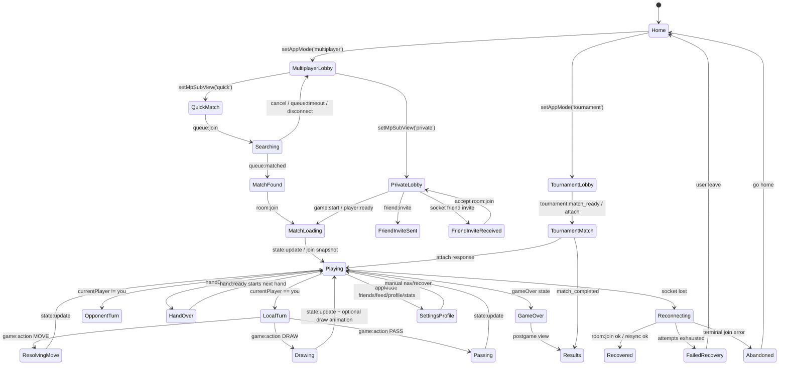

# Multiplayer Chess-Level Certification Audit

Date: 2026-07-09

Verdict: **Beta-ready**

This is a harsher certification audit than the prior readiness review. The codebase has real reliability work in place, but it is not hardened to a chess.com-level standard. The largest gaps are not ordinary bugs. They are certification gaps: missing deterministic recovery proofs, best-effort persistence, split client authority, and incomplete chaos coverage for adversarial timing.

## Evidence Base

Primary files inspected:

- App routing: `client/src/AppRoutes.tsx`, `client/src/App.tsx`, `client/src/useAppRoutesProps.tsx`
- Multiplayer UI and routing: `client/src/multiplayer/MultiplayerModeController.tsx`
- Socket connection and recovery: `client/src/multiplayer/useMultiplayerConnection.ts`, `client/src/multiplayer/recoveryMachine.ts`, `client/src/multiplayer/useMultiplayerResync.ts`
- Socket event projection: `client/src/multiplayer/useRoomSocketSync.ts`, `client/src/multiplayer/socketEventBus.ts`
- Client actions: `client/src/match/session/actions/useLiveMatchActions.ts`, `client/src/multiplayer/roomTransport.ts`
- Lobby/friend flows: `client/src/multiplayer/useMultiplayerRoomActions.ts`, `client/src/matchmaking/useMatchmaking.ts`
- Tournament flow: `client/src/tournament/useTournament.ts`, `client/src/match/session/tournament/useTournamentAttachFlow.ts`, `client/src/match/session/tournament/useTournamentSessionNavigation.ts`
- Server rooms: `server/src/rooms.ts`, `server/src/multiplayer/roomSession.ts`, `server/src/multiplayer/roomSocketAttach.ts`
- Server handlers: `server/src/multiplayer/registerGameplayActionHandlers.ts`, `server/src/multiplayer/registerMatchStartHandlers.ts`, `server/src/multiplayer/registerRoomAbandonHandlers.ts`
- Recovery/persistence: `server/src/multiplayer/disconnectGrace.ts`, `server/src/multiplayer/roomLivePersistence.ts`, `server/src/multiplayer/roomMatchLogPersistence.ts`, `server/src/matchmaking/persistence.ts`, `server/src/matchmaking/roomShellHydration.ts`
- DB schema: `supabase/room_live_sessions.sql`, `supabase/room_match_logs.sql`, `supabase/migrations/2026-05-13_matchmaking.sql`, `supabase/migrations/2026-05-14_scheduled_tournaments.sql`
- Tests: `client/e2e/multiplayer-in-match-reconnect.spec.ts`, `client/e2e/multiplayer-chaos.spec.ts`, `server/src/multiplayer/*test.ts`, `server/src/scheduledTournament/*test.ts`

## 1. Complete Failure-Matrix Audit

Legend:

- Pass: code inspection or existing test shows a safe path.
- Fail: code inspection shows a concrete unsafe path.
- Unknown: plausible but not proven without fault injection or instrumentation.

| Failure scenario | Surface/state | Expected safe result | Actual observed or inferred behavior | Status | Severity | Files/functions | Missing coverage | Recommended fix |
|---|---|---|---|---|---|---|---|---|
| Browser refresh on Home | Home | Home reloads without multiplayer side effects | Home is appMode-driven. No route-level multiplayer recovery unless saved room autojoin occurs after multiplayer connection. | Pass | Low | `client/src/AppRoutes.tsx:922-958` | Basic smoke only | Keep Home free of room state side effects. |
| Browser Back from active match | Active match | User either stays in match or intentional leave/forfeit is explicit | App uses internal `appMode`; browser history is hash/path-light. Browser Back behavior is not modeled as a multiplayer transition. | Unknown | High | `client/src/AppRoutes.tsx:797-823`, `client/src/multiplayer/useMultiplayerConnection.ts:462-518` | Back/Forward during match E2E | Add route/history guards or explicit leave confirmation. |
| Browser Forward into stale multiplayer state | Multiplayer lobby/live match | Rehydrate from DB snapshot or fall back safely | Depends on saved room + socket autojoin; route itself does not carry match ID. | Unknown | Medium | `client/src/multiplayer/useMultiplayerConnection.ts:280-321` | Back/Forward recovery E2E | Add deterministic route recovery contract. |
| Direct deep link with `?room=` | Private match lobby | Join linked room or show join failure with escape | Autojoin effect attempts `room:join`; no AbortController, no stale route guard. | Unknown | Medium | `client/src/multiplayer/useMultiplayerRoomActions.ts:408-458` | Deep-link bad room / slow ack E2E | Add generation guard and cleanup for autojoin effect. |
| Duplicate tab in active match | Active match | New tab owns seat; old tab becomes passive/terminal | Server supersedes old socket, but old client dispatches recovery and reconnects. | Fail | Critical | `server/src/multiplayer/roomSocketAttach.ts:240-245`, `client/src/multiplayer/registerMultiplayerConnectionSocketHandlers.ts:191-200`, `client/src/multiplayer/recoveryMachine.ts:695-715` | Duplicate-tab ownership chaos | Make superseded client disable recovery and clear local room authority. |
| Offline transition while searching | Quick match queue | Search cancels or resumes deterministically | Hook clears search on disconnect and increments generation. | Pass | Medium | `client/src/matchmaking/useMatchmaking.ts:94-105` | E2E only covers hub offline | Add queue offline/online E2E. |
| Online transition after queue disconnect | Quick match queue | No stale `queue:matched` from old search | Join generation guards ack/timeout, but pushed `queue:matched` has no generation correlation. | Unknown | High | `client/src/matchmaking/useMatchmaking.ts:82-87`, `client/src/matchmaking/useMatchmaking.ts:141-175` | Dropped/stale pushed match event test | Include queue request ID in `queue:matched`. |
| Match found overlay refresh | Match found overlay | Rejoin match or safe lobby fallback | Overlay is local state from pushed event. Refresh depends on room persistence/local storage after join, not overlay state. | Unknown | High | `client/src/matchmaking/MatchFoundOverlay.tsx:78`, `client/src/multiplayer/useMultiplayerConnection.ts:280-321` | Refresh during countdown E2E | Persist pending matched room before countdown/autojoin. |
| Server restart during match found countdown | Match found overlay | Room recreated with full state or queue re-enters | Matchmaking shell hydration explicitly restores only shell for MM rows if live snapshot missing. | Fail | High | `server/src/matchmaking/roomShellHydration.ts:5-9`, `server/src/multiplayer/roomLivePersistence.ts:689-707` | Server restart during countdown | Require live session before match-found success or requeue players. |
| Refresh while quick match is `Starting match...` | Live match loading | State snapshot fetched, no permanent loading | Client has 4s stall resync. Server may have started before both sockets were room-ready. | Unknown | High | `client/src/multiplayer/MultiplayerModeController.tsx:329-344`, `client/src/multiplayer/useMultiplayerResync.ts:157-166`, `server/src/matchmaking/roomShellHydration.ts:39-50` | Refresh during starting screen | Make readiness wait return boolean and gate start. |
| Dropped first `state:update` after quick start | Live match loading | Client resyncs by authoritative DB/server snapshot | 4s stall resync exists, but only after UI is already in `joinedRoom && !state`. | Unknown | High | `client/src/multiplayer/useMultiplayerResync.ts:157-166` | Dropped first state update E2E | Add explicit server ack/snapshot on match start. |
| Private match create spam-click | Private match lobby | One room created | `createInFlightRef` blocks repeats. | Pass | Medium | `client/src/multiplayer/useMultiplayerRoomActions.ts:149-158` | Component/integration test | Keep guard and test it. |
| Private join spam-click | Private match lobby | One join attempt applies | `joinInFlightRef` blocks repeats. | Pass | Medium | `client/src/multiplayer/useMultiplayerRoomActions.ts:170-201` | Integration test | Keep guard and test stale ack. |
| Friend invite create-room succeeds but invite delivery fails | Friend invite flow | Room either remains visible or is cleaned | If `emitCreateRoom` succeeds and invite delivery fails, room can remain created and user gets only unreachable error. | Unknown | Medium | `client/src/multiplayer/useMultiplayerRoomActions.ts:260-307` | Invite partial failure E2E | Add cleanup or explicit "room created" fallback UI. |
| Friend invite accept then route changes | Friend invite received | Join result cannot overwrite newer navigation | No generation/abort guard around accept invite promise. | Fail | Medium | `client/src/multiplayer/useMultiplayerRoomActions.ts:351-405` | Route-change during invite accept | Add generation token tied to route/session. |
| Websocket disconnect during active turn | Local turn | Disable input, recover, preserve authority | Input blocks when socket/recovery not idle. | Pass | Medium | `client/src/match/session/actions/useLiveMatchActions.ts:337-367` | Active turn disconnect E2E with attempted action | Add test that spam during reconnect does not mutate. |
| Websocket reconnect after active turn disconnect | Local turn | Rejoin same seat and receive authoritative state | Recovery join path applies room join response. | Pass/Unknown | Medium | `client/src/multiplayer/useMultiplayerConnection.ts:89-150` | Ack-loss + reconnect test | Add state checksum assertion after reconnect. |
| Websocket disconnect after move commit before ack | Move submission | Retry is idempotent and UI reconciles | Server emits state before ack, but MOVE/PASS lack request IDs; only DRAW has client requestId. | Fail | Critical | `client/src/multiplayer/roomTransport.ts:57-63`, `client/src/match/session/actions/useLiveMatchActions.ts:647-650`, `server/src/multiplayer/registerGameplayActionHandlers.ts:49-55` | Ack-loss for MOVE/PASS | Add requestId to every gameplay action. |
| Duplicate draw submit during reconnect | Drawing/boneyard | One authoritative draw chain | Client pending guard + DRAW requestId + server idempotency protect repeats. | Pass | Medium | `client/src/match/session/actions/useLiveMatchActions.ts:430-453`, `server/src/multiplayer/gameActionIdempotency.ts` | Reconnect duplicate draw E2E | Add chaos test. |
| Duplicate move submit by double click | Move submission | One tile placement | Client pending guard helps, but server idempotency cannot identify duplicate MOVE without requestId. | Fail | High | `client/src/match/session/actions/useLiveMatchActions.ts:584-696`, `client/src/multiplayer/roomTransport.ts:57-63` | Double-click MOVE integration | Add requestId and server idempotency for MOVE/PASS. |
| Refresh during forced draw animation | Drawing/boneyard | Reload snapshot should land in final authoritative state | Server broadcasts authoritative state before animation, and live snapshot stores full state; client timers clear on unmount. | Pass/Unknown | Medium | `server/src/multiplayer/registerGameplayActionHandlers.ts:64-68`, `client/src/multiplayer/useRoomSocketSync.ts:668-679`, `server/src/multiplayer/roomLivePersistence.ts:1-8` | Refresh-during-animation E2E | Add E2E around draw chain. |
| Dropped `game:draw_animation` event | Drawing/boneyard | Gameplay should remain usable from authoritative state | State update arrives first, but UI may still depend on animation cleanup flags; code has diagnostic watchdog only. | Unknown | High | `client/src/multiplayer/useRoomSocketSync.ts:140-172`, `client/src/multiplayer/useRoomSocketSync.ts:384-610` | Drop animation event test | Add fallback that clears draw animation state based on authoritative sequence. |
| Reordered state updates | Active match | Drop stale projection | Projection gates check episode/sequence and request resync on regression. | Pass | Medium | `client/src/multiplayer/useRoomSocketSync.ts:232-321` | Reordered socket event test | Add transport-level reordering harness. |
| Duplicated state update | Active match | Dedup or harmless reapply | Transport replay and projection gates exist. | Pass/Unknown | Medium | `client/src/multiplayer/socketEventBus.ts`, `client/src/multiplayer/useRoomSocketSync.ts:259-265` | Duplicate state update E2E | Add duplicate packet harness. |
| Opponent disconnect while it is their turn | Opponent turn | Timer then auto-action/forfeit | Server grace can auto-pass/draw and forfeit after repeated expiries. | Pass/Fail | High | `server/src/multiplayer/disconnectGrace.ts:94-165` | Dual-disconnect coverage missing | Fix per-seat grace map. |
| Both players disconnect in same room | Active match | Each seat tracked independently | Disconnect grace is keyed by room only, so timers overwrite. | Fail | Critical | `server/src/multiplayer/disconnectGrace.ts:12-13`, `server/src/multiplayer/disconnectGrace.ts:66-77` | Dual disconnect chaos | Track grace by room+seat. |
| Opponent reconnects after grace timeout | Opponent turn | Either valid rejoin or terminal result | Server clears grace and emits reconnect; repeated expiry count resets on rejoin. | Unknown | Medium | `server/src/multiplayer/disconnectGrace.ts:80-91` | Reconnect exactly at timeout test | Add race test around timer boundary. |
| Player leaves during async move | Move submission | Server mutation either commits or rejects, client cleans pending | Client finally clears local pending; route leave emits abandon/leave asynchronously. Old ack can still call setters if component mounted elsewhere. | Unknown | High | `client/src/match/session/actions/useLiveMatchActions.ts:646-696`, `client/src/multiplayer/useMultiplayerConnection.ts:483-506` | Leave-while-move-pending E2E | Add operation generation/cancellation. |
| Hand over refresh | Hand over | Restore handOver and hand-ended payload | Server emits hand-ended payload on rejoin if handOver and not gameOver. | Pass | Medium | `server/src/multiplayer/roomSocketAttach.ts:365-374`, `server/src/multiplayer/roomSession.ts:444-490` | Refresh at hand-over E2E | Add coverage. |
| Game over while client offline | Game over/results | Client sees final result on reload | Terminal live row is archived/deleted; autojoin sees no room and shows generic unavailable message. | Fail | High | `server/src/multiplayer/roomLivePersistence.ts:498-514`, `client/src/multiplayer/useMultiplayerConnection.ts:304-313` | Offline game-over recovery E2E | Add archived-result recovery endpoint/UI. |
| Supabase outage during match start | Match loading | Ranked/quick match either fails closed or records recoverable durable row | Matchmaking persistence errors are swallowed; match plays anyway. | Fail | High | `server/src/matchmaking/persistence.ts:39-56` | Supabase outage during start | Fail closed for ranked/quick match or mark unranked degraded. |
| Supabase outage during match end | Game over/results | Result retries or durable outbox preserves finality | Multiple persist paths warn/swallow errors; downstream ranking can be skipped. | Fail | High | `server/src/realtime/gameOverPersistence.ts`, `server/src/multiplayer/roomMatchLogPersistence.ts` | Supabase outage during end | Add durable outbox/retry and health gate. |
| Vercel/Node restart during active game | Active match | Hydrate full state from live session | Live room hydration exists if persistence is current; persistence failures are logged and skipped. | Unknown/Fail | High | `server/src/multiplayer/roomLivePersistence.ts:414-446`, `server/src/multiplayer/roomLivePersistence.ts:689-707` | Restart active match with DB fault | Require persistence health. |
| Mobile background >45s | Active match | Resync on foreground | Lifecycle recovery triggers after hidden threshold when socket connected. | Pass/Unknown | Medium | `client/src/multiplayer/useMultiplayerConnection.ts:220-278`, `client/src/multiplayer/multiplayerLifecycleRecovery.ts` | Mobile background E2E | Add Playwright visibility + network fault test. |
| Low-memory reload | Any live state | Same as refresh: recover from DB/local storage | Depends on last room code and room_live_sessions. | Unknown | High | `client/src/match/recovery/matchRecovery.ts`, `server/src/multiplayer/roomLivePersistence.ts` | Browser context kill/reopen E2E | Treat as refresh certification case. |
| Expired auth during active match | Active match | Seat identity preserved or explicit re-auth path | Auth changes re-identify presence, but room identity may keep stale token/user identity. | Unknown | High | `client/src/multiplayer/useMultiplayerConnection.ts:558-604`, `client/src/multiplayer/useMultiplayerConnection.ts:98-112` | Auth expiry mid-match | Add auth refresh room-identity test. |
| Token refresh during active match | Active match | Presence and future reconnect use new token | Presence re-identify exists; room identity update depends on refs. | Unknown | Medium | `client/src/multiplayer/useMultiplayerConnection.ts:558-604` | Token refresh E2E | Assert reconnect after token refresh keeps user seat. |
| Clock skew | Tournament countdown / timeout | Server truth wins | Client uses `Date.now()` for countdown refresh and recovery cooldowns; skew can early/late refresh. | Unknown | Medium | `client/src/tournament/useTournament.ts:272-299`, `client/src/multiplayer/recoveryMachine.ts:121-124` | Clock skew unit tests | Use server time for tournament boundaries. |
| Settings/profile route mid-match | Settings/Profile entered mid-session | Match state remains recoverable or leave is explicit | AppMode navigation can leave multiplayer surface without necessarily abandoning; route state can coexist with live socket. | Unknown | High | `client/src/AppRoutes.tsx:514-620`, `client/src/useAppRoutesProps.tsx` | Navigate profile/settings mid-match | Add mid-match social route transition tests. |

## 2. Transition Graph Certification

### Edge Certification

| Edge | Trigger | Authority | Success path | Failure path | Timeout | Cancel/retry/rollback/cleanup | Can strand user? |
|---|---|---|---|---|---|---|---|
| Home -> MultiplayerLobby | `setAppMode('multiplayer')` | Client appMode | Socket autoconnect effect starts | server unavailable -> disconnected lobby | Socket timeout 20s | Manual connect | Low |
| MultiplayerLobby -> Searching | `queue:join` | Server queue | Ack ok, state searching | Ack fail or 22s watchdog | 22s client watchdog | Cancel emits `queue:leave` | Medium if pushed match stale |
| Searching -> MatchFound | `queue:matched` push | Server queue | Overlay and autojoin | dropped push: user stays searching until timeout | Server queue timeout | Cancel only before matched | Medium |
| MatchFound -> MatchLoading | `room:join` | Server room | `joinedRoom && !state` or immediate state | join fails -> toast/error | 8s ack timeout | No overlay cancel | High |
| MatchLoading -> Playing | `state:update` or join snapshot | Server room | LiveMatchScreen renders | dropped state -> 4s resync | 4s client stall | No direct escape in loading view | High |
| PrivateLobby -> MatchLoading | `game:start` / `player:ready` | Server room | state broadcast | `waiting_for_ready` path reschedules ready | 8s ack timeout | retry by host/start, room request ready | Medium |
| LocalTurn -> ResolvingMove | `game:action MOVE` | Server `act` | state broadcast then ack | lost ack -> client timeout | 8s ack timeout | no requestId for MOVE | Critical |
| LocalTurn -> Drawing | `game:action DRAW` | Server `act` | state + animation + ack | lost animation -> uncertain UI | 8s ack timeout | requestId/idempotency exists | Medium |
| LocalTurn -> Passing | `game:action PASS` | Server `act` | state + ack | lost ack can retry as non-idempotent | 8s ack timeout | no requestId | High |
| Playing -> Reconnecting | socket disconnect | Client recovery machine | rejoin/resync | failed after 5 attempts | bounded attempts | manual retry/leave | Medium |
| Reconnecting -> Recovered | `room:join` ok | Server room/live snapshot | apply snapshot | terminal errors clear storage | 8s ack timeout | retry/backoff | Medium |
| Playing -> GameOver | `state.gameOver` | Server engine | postgame screen | dropped terminal state -> stale active UI until resync | lifecycle/resync only | no archived result recovery | High |
| GameOver -> Results | postgame/tournament finalize | Server + client nav | tournament result/bracket | persistence fail may lose durable finality | none | no durable outbox | High |
| TournamentLobby -> TournamentMatch | attach assigned match | Tournament API + socket | `setAppMode('multiplayer')` | failed attach with backoff | 8s ack timeout | manual retry/backoff | Medium |
| Playing -> Settings/Profile | app navigation | Client appMode | route changes | live room state may remain hidden | none | unclear cleanup unless explicit disconnect | High |

Edges lacking deterministic certification:

- `MatchFound -> MatchLoading`: no overlay cancel and no persisted pending matched-state proof.
- `MatchLoading -> Playing`: depends on dropped-event recovery.
- `MOVE/PASS -> Playing`: no server idempotency key for MOVE/PASS retries.
- `Playing -> GameOver`: no final-result recovery after terminal live row deletion.
- `Duplicate tab -> old tab`: old tab recovers instead of becoming terminal/passive.
- `Settings/Profile mid-session`: no explicit multiplayer route contract.

## 3. Lifetime Ownership Audit

| Object | Created by | Owner | Mutators | Cleanup | If cleanup skipped | Test proof |
|---|---|---|---|---|---|---|
| Room | `createRoom`/`createReservedRoom` in `server/src/rooms.ts` | Server memory | room handlers, engine actions | `deleteRoom`, `clearRoomMetadata`, cleanup timer | ghost room, stale reconnect, stale idempotency cache | partial: room lifecycle tests |
| Match | `startGame`/`initiatePregameDrawOrStart`, matchmaking/tournament dispatch | Server engine + DB rows | gameplay handlers, tournament finalizers | game over persist, room cleanup | stuck active match or lost result | partial |
| Matchmaking queue entry | `QueueService.join` | Server `QueueService` | queue leave/tick/disconnect | `queue:leave` or socket disconnect | user can be paired after cancel/disconnect | queue unit tests, no stale push E2E |
| Socket connection | `io(...)` in `useMultiplayerConnection` | Client connection runtime | socket.io and event registrars | removeAllListeners/disconnect on unmount | duplicate listeners, ghost events | partial registry tests |
| Socket.IO room membership | `socket.join`, `socket.leave` | Server room session | room attach/leave/session handlers | leaveTrackedRoom/evaluate lifecycle | stale broadcasts/spectators | partial private path tests |
| Player seat | `allocatePlayerSeatId` | Server room roster | reconnect/migrate/join/leave | roster delete/reconnect expiry | duplicate seat, impossible turns | partial |
| Friend invite | `friend:invite` and local state | Client + server social sockets | invite accept/decline | local null on decline/accept | stale modal or orphan room | insufficient |
| Private invite code | room code + URL | Server room/client URL | lobby actions | none until room cleanup | invite to stale/deleted room | insufficient |
| Recovery attempt | `createRecoveryMachine` | Client recovery machine | recovery dispatch/effects | dispose/cancel schedule | reconnect loops, stale state application | behavior tests |
| Reconnect timer | recovery scheduler/ref | Client recovery runtime | machine effects | dispose/clear reconnect timer | retry after route leave | partial |
| Disconnect grace timer | `disconnectGrace.ts` | Server disconnect module | one room-scoped map | `clearDisconnectGrace` | overwritten timers on dual disconnect | missing dual-seat test |
| Game action/request id | Client action creator | Client+server idempotency | DRAW only currently has requestId | TTL/cache clear per room | duplicate MOVE/PASS possible | duplicate DRAW/server idempotency tests only |
| Pending move | client refs/state | Client action hook | action hook | finally block | stale input block | unit tests partial |
| Boneyard/draw state | Server `GameState`; client animation state | Server authoritative, client visual | act + animation handler | timers/unmount clear | stuck draw UI/input block | forced draw tests partial |
| Turn state | Server `GameState.currentPlayerIndex` | Server | engine `act` | match cleanup | wrong local input if stale | engine tests |
| Hand state | Server `GameState.handOver` | Server | `readyForNextHand` | next hand/game end | stuck handover | handReady tests |
| Game result | Server game over persistence | Server/DB | gameOver persistence, tournament engine | match log / terminal row delete | lost result on offline reload | partial, no offline reload |
| Tournament session | tournament hooks + server scheduled tables | Mixed | tournament API/socket attach | terminal match storage/session reset | stale recovery match | good unit coverage, limited chaos |
| Supabase live row | `schedulePersistLiveRoomSession` | Server service role | server persist only | finalize delete | restart recovery loss | hydration tests |
| Supabase match log row | `persistRoomMatchLog` | Server service role | terminal persist | retained | no result recovery if not exposed | persistence tests |
| LocalStorage room code | App persistence effect | Client | save/clear helpers | terminal clear/user leave | rejoin stale room | joinedRoom policy tests |
| React refs | runtime composition | Client runtime | many hooks | reset functions/manual cleanup | hidden stale authority | limited behavior tests |
| Event listeners | socket/event bus/effects | Client registrars | registrars | unregister functions | duplicate event application | registry tests |
| Timers/intervals | socket ping, draw animation, tournament countdown | Client/server | owner hook/module | clear on unmount/reset | leaks/retry after exit | partial |
| Toasts/banners/modals | UI state | Client | screen hooks | manual state reset | stale guidance | not systematically tested |

Ghost-state risks:

- Room-scoped disconnect grace: `server/src/multiplayer/disconnectGrace.ts:12-13`.
- Runtime refs as hidden authority: `client/src/multiplayer/runtime/runtimeTypes.ts`, `client/src/multiplayer/useMultiplayerConnection.ts`.
- Pending invite/join effects without cancellation: `client/src/multiplayer/useMultiplayerRoomActions.ts:351-405`, `client/src/multiplayer/useMultiplayerRoomActions.ts:408-458`.
- Tournament async refreshes with no global request generation: `client/src/tournament/useTournament.ts:202-265`, `client/src/tournament/useTournament.ts:307-341`.

## 4. Async Cancellation Audit

| Async operation | Start | Current identifier | Cancellation/stale guard | Risk |
|---|---|---|---|---|
| Generic socket ack | `emitWithAck` | timeout only | 8s timeout, no AbortController | callback can resolve after route changes if caller lacks generation guard |
| Queue join | `findMatch` | `joinGenerationRef` | generation + timeout | pushed `queue:matched` not correlated with generation |
| Queue leave | `cancel` | none | fire-and-forget | server may still emit stale pushed event |
| Create room | `createRoom` | `createInFlightRef` | in-flight ref | no stale response guard after route change |
| Join room | `joinRoom` | `joinInFlightRef` | in-flight ref | no operation generation tied to current roomCode |
| Deep-link autojoin | effect IIFE | `autoJoinAttemptedRef` | none after start | can apply join after route changes |
| Accept invite | `acceptFriendInvite` | `inviteJoinInFlightRef` | in-flight ref | can apply stale join after invite state changes |
| Spectate room | `spectateRoom` | none | no generation | stale response can switch appMode |
| Recovery room join | recovery effect | recovery machine episode | partial episode/event gates | `executeRecoveryRoomJoin` response itself not explicitly stamped |
| Resync | `fetchGameState` | in-flight refs | resync refs and machine | no AbortController |
| Gameplay DRAW | user/auto action | requestId | server idempotency + pending ref | strongest action path |
| Gameplay MOVE | user action | none | pending ref only | retry/ack-loss not idempotent |
| Gameplay PASS | user/auto action | none | pending ref only | retry/ack-loss not idempotent |
| Draw animation timers | `game:draw_animation` | chainId | timers cleared/dedup chain | dropped animation fallback not certified |
| Presence re-identify | auth change effect | auth fingerprint | no cancel; caught errors | stale token result ignored only by server behavior |
| Tournament refresh | mount/socket/timer | none | local `boundaryRefreshInFlightRef` for boundary only | older response can overwrite newer tournament view |
| Tournament attach | matchId + attach ref | `attachInFlightRef`, pending match refs | guard/backoff | no AbortController; response can navigate after user route exit |
| Server room cleanup | room lifecycle | room code | timer cancel on active players | persistence failure still deletes? current code logs then deletes after catch |
| Supabase live persist | room code in-flight map | room code | coalesced in-flight | failures return false and live match continues |

Async operations lacking strong cancellation/stale-result protection:

- `client/src/multiplayer/useMultiplayerRoomActions.ts:408-458` deep-link autojoin.
- `client/src/multiplayer/useMultiplayerRoomActions.ts:351-405` invite accept.
- `client/src/multiplayer/useMultiplayerRoomActions.ts:460-497` spectate.
- `client/src/tournament/useTournament.ts:202-265` refresh.
- `client/src/tournament/useTournament.ts:307-341` recover.
- `client/src/match/session/actions/useLiveMatchActions.ts:584-696` MOVE action lacks requestId.
- `client/src/match/session/actions/useLiveMatchActions.ts:517-567` PASS action lacks requestId.

## 5. React Rendering Audit

### Issue: Multiplayer controller is a high-risk routing god component

- File: `client/src/multiplayer/MultiplayerModeController.tsx`
- Risk: render state is derived from `isConnected`, `isRecoveringConnection`, `joinedRoom`, `state`, `mpSubView`, tournament passthrough, postgame, abandoned notice, and auth. This makes impossible UI combinations hard to rule out.
- Reproduction: quick match has `mpSubView === 'quick' && joinedRoom && !state`; screen renders `Starting match...` with no direct escape.
- Severity: High
- Suggested test: render matrix test for all `mpSubView/joinedRoom/state/recovery` combinations.
- Recommendation: split route selection into a pure `deriveMultiplayerScreenState` function and table-test it.

### Issue: Hidden mutable refs are acting as authority

- Files: `client/src/multiplayer/useMultiplayerConnection.ts`, `client/src/multiplayer/runtime/runtimeTypes.ts`, `client/src/multiplayer/useMultiplayerRoomActions.ts`
- Risk: refs such as `preventAutoRejoinRef`, `autoJoinAttemptedRef`, `roomIdentityRef`, `joinedRoomResponseRef`, and tournament attach refs can survive route transitions.
- Reproduction: accept invite or tournament attach resolves after appMode changed.
- Severity: High
- Suggested test: async resolution after route exit should not navigate.
- Recommendation: central operation generation keyed by route/session.

### Issue: Diagnostic logic remains in gameplay-critical hooks

- File: `client/src/match/session/actions/useLiveMatchActions.ts:159-270`
- Risk: temporal diagnostic refs are useful but increase complexity in the input gate.
- Reproduction: hard to reason about stale block reasons during animation/recovery.
- Severity: Low
- Suggested test: action gating pure function tests.
- Recommendation: extract diagnostics from the action blocker.

### Issue: Tournament hook has broad async side effects

- File: `client/src/tournament/useTournament.ts:202-341`
- Risk: refresh/recover calls can overlap and update shared tournament state without request ordering.
- Reproduction: socket match update, visibility recover, and manual refresh overlap under slow network.
- Severity: Medium
- Suggested test: delayed refresh responses return out of order.
- Recommendation: request sequence guard around tournament view state.

## 6. Navigation Audit

| Route/surface | Direct arrival | Refresh | Back/Forward | Auth expiry | Reconnect | Escape | Fallback | Risk |
|---|---|---|---|---|---|---|---|---|
| Home | yes | yes | yes | low | optional saved room only after connect | n/a | Home | low |
| Multiplayer lobby | appMode only | yes if user returns | unknown | medium | socket autoconnect | Back Home | Home | medium |
| Quick match queue | appMode+mpSubView only | loses queue | unknown | high | disconnect resets queue | cancel | lobby | medium |
| Match found overlay | volatile local state | loses overlay | unknown | high | depends on autojoin | no direct cancel | none | high |
| Private match lobby | appMode+mpSubView/room code | saved room/deep link | unknown | medium | room:join recovery | leave/back home | Home | medium |
| Live match | volatile appMode + room state | saved room recovery | unknown | high | recovery machine | leave/abandon | Home/lobby | high |
| Game over/results | volatile state | terminal live row deleted | unknown | medium | no archived result UI | postgame nav | Home/tournament | high |
| Profile/Friends/Feed | appMode only | yes | yes | medium | socket may remain | close/back | origin/home | high mid-match |
| Tournament hub | appMode only | API refresh | partial hash use | high | tournament recover | Back Home | Home | medium |
| Tournament match | appMode multiplayer + tournament context | attach/recovery if assigned | unknown | high | attach flow | tournament exit | tournament hub | high |

Navigation-specific failures:

- Browser Back/Forward is not a certified transition.
- Match found overlay is not refresh-safe as a state.
- Game over/result is not recoverable after terminal live row deletion unless tournament-specific logic handles it.
- Social/profile routes can be reached mid-session without a clearly documented live-match contract.

## 7. Production Chaos Certification Plan

| Test | Purpose | Fault injection | Expected invariant | Harness location | Pass/fail signal |
|---|---|---|---|---|---|
| Kill Socket.IO every 5s | Prove reconnect loops | server/proxy kills transport | no lost seat; state converges | client E2E chaos | both clients same sequence/score |
| Drop 30% websocket packets | Prove realtime is notification only | socket proxy packet filter | DB/server snapshot recovers | chaos harness | no stuck loading/action block |
| Delay every RPC by 10s | Prove timeouts and stale guards | monkeypatch `emitWithAck`/HTTP | old response cannot navigate | client E2E/unit | route/session generation holds |
| Reorder socket events | Projection hardening | event bus shim | stale updates dropped/resync | client unit/integration | monotonic sequence |
| Duplicate socket events | Idempotent projection | event bus duplicate | no duplicate animation/action | client unit/E2E | no duplicate move rows/UI |
| Randomly disconnect one player | Opponent grace | socket close | auto-action/forfeit deterministic | server integration/E2E | no stuck opponent turn |
| Randomly disconnect both players | Per-seat grace | close both sockets | independent timers | server integration | no overwritten timer |
| Restart Node during active match | DB hydration | kill/restart server | full state restored | e2e script | same hands/scores/turn |
| Restart Node during match start | start race | kill after match_found | requeue or restore match | e2e script | no permanent `Starting match...` |
| Supabase fail intermittently | persistence requiredness | mock `supabaseFetch` failures | degraded/fail-closed mode | server integration | no silent ranked match |
| Supabase fail during start | matchmaking durability | fail `recordMatchStart` | no ranked match starts silently | server integration | ack failure/degraded flag |
| Supabase fail during end | finality | fail result writes | outbox retries | server integration | final row eventually written |
| Vercel redeploy during match | process death | restart production-like server | rehydrate or clear safely | staging chaos | no unrecoverable active game |
| Expire auth token mid-match | identity stability | auth mock/token rotation | reconnect same user seat | E2E/auth harness | seat unchanged |
| Refresh both clients simultaneously | live snapshot | reload both pages | both rejoin same state | E2E | equal score/turn |
| Open duplicate tabs repeatedly | ownership | repeated new tabs | newest owns, old passive | E2E | no ownership thrash |
| Spam draw/pass/place | idempotency | rapid clicks | one server mutation per turn | E2E/server | sequence increments once |
| Spam lobby join/leave/ready | lobby resilience | rapid clicks | no orphan room/start | E2E/server | room roster valid |
| Mobile background/foreground | lifecycle resync | visibility/pagehide/pageshow | resync after threshold | client E2E | state catches up |
| Browser back/forward during reconnect | route recovery | history navigation | no stale recovery apply | client E2E | expected route + clean room state |

Required harness changes:

- Socket.IO proxy/shim that can drop, delay, duplicate, and reorder events.
- Server lifecycle controller for kill/restart inside E2E.
- Supabase fault shim around `supabaseFetch`.
- Client-side test hook to inspect room sequence, current turn, joined room, recovery state.
- Auth test fixture supporting token expiry/refresh.

## 8. Architecture Smell Audit

| File/module | Smell | Why it matters | Recommendation | Risk | Fix now? |
|---|---|---|---|---|---|
| `client/src/multiplayer/MultiplayerModeController.tsx` | route/render god component | hard to prove no impossible screens | extract pure screen-state reducer | medium | yes |
| `client/src/multiplayer/useMultiplayerConnection.ts` | connection, recovery, lifecycle, presence, navigation in one hook | hidden coupling causes stale refs | split transport/recovery/presence/lifecycle | high | after critical fixes |
| `client/src/match/session/actions/useLiveMatchActions.ts` | action logic + diagnostics + auto-action | action safety hard to certify | extract pure action guards and request builders | medium | yes |
| `server/src/multiplayer/roomSession.ts` | roster, cleanup, masking, bot timers, broadcast, persistence hooks | broad authority surface | split room membership, broadcast, cleanup, bot scheduling | high | later |
| `server/src/multiplayer/disconnectGrace.ts` | room-scoped timer model | cannot handle dual disconnects | per-seat grace manager | medium | yes |
| `server/src/matchmaking/persistence.ts` | best-effort writes | ranked match durability not guaranteed | required persistence or degraded mode | medium | yes |
| `supabase/room_live_sessions.sql` | JSONB invariants | DB cannot reject impossible states | add relational guard columns/checks where possible | medium | phased |
| `client/src/tournament/useTournament.ts` | overlapping async refreshes | stale tournament state | request sequencing | low | later |

## 9. Chess-Level Invariant List

| Invariant | Enforcement point | Currently enforced | Evidence | Missing tests | Recommendation |
|---|---|---|---|---|---|
| Realtime is never sole source of truth | server snapshot + DB hydration | partially | `room_live_sessions` and `ensureRoomHydrated` | dropped-event chaos | require live persistence health |
| Every gameplay action has idempotency key | client action + server handler | no | DRAW only has requestId | MOVE/PASS ack-loss | add requestId to MOVE/PASS |
| One active socket owns one authenticated seat | server attach + client supersede | no | old tab recovers after supersede | duplicate-tab chaos | terminalize displaced client |
| Disconnect grace is per seat | server disconnect grace | no | room-scoped map | dual disconnect | key by room+seat |
| Terminal match result recoverable after reload | result persistence/API | no | terminal live row deleted | offline game-over | archived result endpoint |
| Ranked quick match requires durable start row | matchmaking persistence | no | errors swallowed | Supabase outage | fail closed/degraded flag |
| Match end writes are eventually durable | server outbox | no | warnings swallowed in game-over paths | Supabase end outage | durable outbox/retry |
| Browser Back/Forward cannot strand a match | route layer | no/unknown | appMode state only | history chaos | explicit route transition contract |
| Recovery cannot apply after user leaves | recovery generation | partial | recovery machine episodes | leave during async recovery | route/session generation |
| Tournament attach cannot overwrite newer route | attach generation | partial | attach refs/backoff | delayed attach response | add request generation |
| DB rejects impossible matchmaking rows | DB constraints | no | missing checks/unique | migration tests | add constraints |
| All listeners/timers cleanup on unmount | hooks/modules | partial | socket/draw timer cleanup exists | leak tests | add cleanup tests |
| User always has safe escape from loading/reconnect | UI route | partial | `Starting match...` lacks direct escape | loading stuck E2E | add escape/fallback controls |

## 10. Severity-Ranked Findings and Roadmap

### Critical

1. Duplicate-tab ownership can thrash because displaced client attempts recovery.
   - Files: `server/src/multiplayer/roomSocketAttach.ts:240-245`, `client/src/multiplayer/registerMultiplayerConnectionSocketHandlers.ts:191-200`, `client/src/multiplayer/recoveryMachine.ts:695-715`.
   - Reproduction: open same account in second tab during active match.
   - Fix: superseded client disables recovery, clears joined room/local storage, shows passive "session moved" state.
   - Test: duplicate-tab repeated takeover E2E.
   - Scope: architecture-level.

2. Disconnect grace is room-scoped, not seat-scoped.
   - Files: `server/src/multiplayer/disconnectGrace.ts:12-13`, `server/src/multiplayer/disconnectGrace.ts:66-77`.
   - Reproduction: both players disconnect inside same grace window.
   - Fix: map timers by `${roomCode}:${seatId}`.
   - Test: server integration dual-disconnect race.
   - Scope: localized with architecture implications.

3. MOVE/PASS are not server-idempotent under ack loss.
   - Files: `client/src/multiplayer/roomTransport.ts:57-63`, `client/src/match/session/actions/useLiveMatchActions.ts:535`, `client/src/match/session/actions/useLiveMatchActions.ts:647-650`, `server/src/multiplayer/registerGameplayActionHandlers.ts:49-55`.
   - Reproduction: server commits MOVE, ack is lost, client retries after reconnect.
   - Fix: requestId on every `game:action`; cache successful acks for all action types.
   - Test: ack-loss retry for MOVE/PASS.
   - Scope: architecture-level.

4. Terminal result recovery is absent for non-tournament completed/abandoned matches.
   - Files: `server/src/multiplayer/roomLivePersistence.ts:498-514`, `client/src/multiplayer/useMultiplayerConnection.ts:304-313`, `supabase/room_match_logs.sql:1-15`.
   - Reproduction: client offline at game over, reload later.
   - Fix: archived result recovery endpoint keyed by match/room/user and client result screen fallback.
   - Test: offline game-over reload.
   - Scope: architecture-level.

### High

5. Quick-match startup can proceed after socket-readiness wait times out.
   - Files: `server/src/matchmaking/roomShellHydration.ts:39-50`, `server/src/multiplayer/roomSocketAttach.ts:341-349`.
   - Fix: return readiness boolean and do not start without confirmed membership.
   - Test: delayed socket room join during quick match.

6. Live persistence and matchmaking persistence are best-effort in places that should be production gates.
   - Files: `server/src/multiplayer/roomLivePersistence.ts:414-446`, `server/src/matchmaking/persistence.ts:39-56`, `server/src/matchmaking/persistence.ts:75-91`.
   - Fix: health gate and fail-closed/degraded ranked mode.
   - Test: Supabase outage at match start/end.

7. Room cleanup can delete the last in-memory match source after archive failure.
   - Files: `server/src/multiplayer/roomSession.ts:261-290`, `server/src/multiplayer/roomMatchLogPersistence.ts`.
   - Reproduction: Supabase/archive write fails during room cleanup after a completed or abandoned match.
   - Risk: cleanup logs the archive failure path and still proceeds toward room deletion/metadata cleanup, so a terminal match can lose the only recoverable source of truth.
   - Fix: durable outbox or fail-retained cleanup state; never delete unrecoverable terminal room state until archival is confirmed or queued.
   - Test: forced `persistRoomMatchLog` failure during cleanup must preserve recoverable state or enqueue retry.
   - Scope: architecture-level.

8. Browser Back/Forward and mid-match social/profile navigation are not certified transitions.
   - Files: `client/src/AppRoutes.tsx:514-620`, `client/src/AppRoutes.tsx:797-823`.
   - Fix: explicit route transition policy for live matches.
   - Test: history navigation during active/reconnecting match.

9. Async join/attach/invite flows can apply after route/user intent changes.
   - Files: `client/src/multiplayer/useMultiplayerRoomActions.ts:351-405`, `client/src/multiplayer/useMultiplayerRoomActions.ts:408-458`, `client/src/match/session/tournament/useTournamentAttachFlow.ts:151-377`.
   - Fix: operation generation and stale-response discard.
   - Test: route change while delayed ack resolves.

### Medium

10. Tournament refresh/recover lacks global request ordering.
   - File: `client/src/tournament/useTournament.ts:202-341`.
   - Fix: request sequence guard.
   - Test: out-of-order API responses.

11. Matchmaking pushed events lack queue generation correlation.
    - File: `client/src/matchmaking/useMatchmaking.ts:82-87`.
    - Fix: queue request/session ID included in server `queue:matched`.
    - Test: stale `queue:matched` after cancel.

12. DB constraints are too weak for chess-level multiplayer.
    - File: `supabase/migrations/2026-05-13_matchmaking.sql:4-19`.
    - Fix: `player_a_id <> player_b_id`, winner participant check, terminal ended_at check, partial unique active room code.
    - Test: migration invariant tests.

13. Draw animation fallback is not certified under dropped animation packet.
    - Files: `client/src/multiplayer/useRoomSocketSync.ts:384-610`.
    - Fix: authoritative sequence watchdog that clears animation state.
    - Test: drop `game:draw_animation`.

### Low

14. Diagnostic code increases action-hook complexity.
    - File: `client/src/match/session/actions/useLiveMatchActions.ts:159-270`.
    - Fix: extract diagnostics.
    - Test: pure action blocker tests.

15. Hydration resets event log version to 1.
    - File: `server/src/multiplayer/applyLiveSessionRoom.ts`.
    - Fix: restore row version.
    - Test: hydrate non-v1 log version.

### Suggested Implementation Order

1. Superseded client terminal/passive behavior.
2. Per-seat disconnect grace.
3. Request IDs for MOVE/PASS and ack-loss tests.
4. Quick-match readiness boolean gate.
5. Terminal result recovery.
6. Persistence health gate/degraded mode.
7. Route/session generation guard for async joins and attach.
8. Browser history/mid-match navigation policy.
9. DB invariant migrations.
10. Chaos harness.

## Roadmap

### Phase 1: Critical stuck-state and authority fixes

- Superseded-session ownership.
- Per-seat disconnect grace.
- Idempotency keys for all gameplay actions.
- Terminal result recovery.

### Phase 2: High-risk recovery and persistence fixes

- Quick-match readiness gating.
- Live persistence health gate.
- Archive-confirmed cleanup or durable room-match-log outbox.
- Ranked/quick-match persistence fail-closed or degraded mode.
- Async operation generation guard.

### Phase 3: Failure-matrix test coverage

- Ack-loss MOVE/PASS.
- Refresh during draw animation.
- Refresh during `Starting match...`.
- Offline game-over reload.
- Back/Forward during reconnect.

### Phase 4: Chaos harness

- Socket packet drop/delay/reorder/duplicate proxy.
- Node restart controller.
- Supabase fault injection.
- Auth expiry fixture.

### Phase 5: Architecture cleanup

- Extract pure multiplayer screen-state reducer.
- Split connection/recovery/presence/lifecycle hooks.
- Split server room membership/broadcast/cleanup concerns.

### Phase 6: Final certification rerun

- Re-run full matrix.
- Mark Unknown rows as Pass/Fail based on automated fault injection.
- Require invariant checklist pass before claiming hardened.

## 11. Final Verdict

Current tier: **Beta-ready**

After fixing Critical only: **Production-ready with risks**, assuming tests prove no regressions.

After fixing Critical + High: **Hardened candidate**, but not chess.com-level until chaos coverage repeatedly proves recovery under packet loss, server restarts, Supabase outage, auth expiry, mobile backgrounding, and browser history abuse.

Remaining before chess.com-level confidence:

- deterministic recovery from every route and terminal state
- full idempotency for every gameplay action
- required durable persistence or explicit degraded mode
- archived result recovery
- chaos harness with packet loss/reorder/duplicate and server/Supabase restarts
- DB constraints for impossible multiplayer states
- split authority so route state, recovery state, and render state cannot disagree silently
