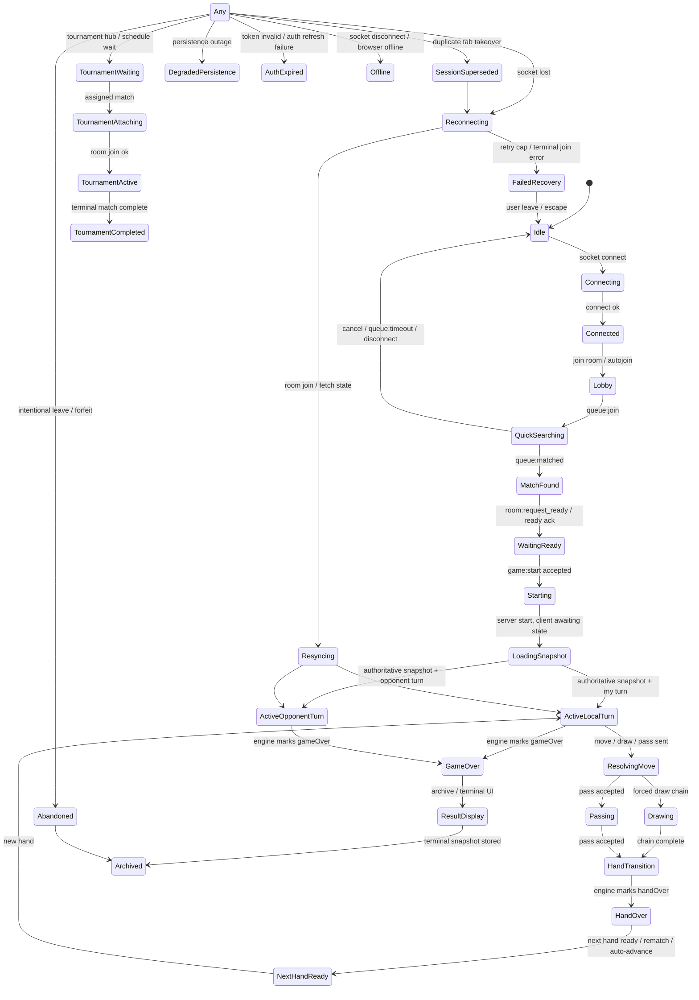

# Multiplayer State Invariant Certification

Date: 2026-07-09

Current invariant confidence score: **61 / 100**

Current tier: **Beta-ready**

This is a state-space audit, not a feature audit. The question is whether the multiplayer system can enter impossible, contradictory, dead, orphaned, duplicated, or unrecoverable states under adversarial timing. The answer is: not yet proven. The codebase has real recovery and idempotency machinery, but there are still split authorities, best-effort persistence paths, and recovery behaviors that are only partially certified.

Evidence base:

- Client multiplayer state and recovery: `client/src/multiplayer/recoveryMachine.ts`, `client/src/multiplayer/session/sessionReducer.ts`, `client/src/multiplayer/session/sessionTypes.ts`, `client/src/multiplayer/useMultiplayerConnection.ts`, `client/src/multiplayer/useRoomSocketSync.ts`, `client/src/multiplayer/useMultiplayerResync.ts`, `client/src/multiplayer/useMultiplayerRoomActions.ts`, `client/src/matchmaking/useMatchmaking.ts`
- Client action transport: `client/src/multiplayer/roomTransport.ts`, `client/src/match/session/actions/useLiveMatchActions.ts`
- Server room and lifecycle authority: `server/src/rooms.ts`, `server/src/multiplayer/roomSession.ts`, `server/src/multiplayer/roomSocketAttach.ts`, `server/src/multiplayer/registerMatchStartHandlers.ts`, `server/src/multiplayer/registerGameplayActionHandlers.ts`, `server/src/multiplayer/disconnectGrace.ts`
- Persistence and recovery: `server/src/multiplayer/roomLivePersistence.ts`, `server/src/multiplayer/roomMatchLogPersistence.ts`, `server/src/matchmaking/persistence.ts`, `server/src/matchmaking/roomShellHydration.ts`
- Tournament flows: `client/src/tournament/useTournament.ts`, `client/src/match/session/tournament/useTournamentAttachFlow.ts`, `client/src/match/session/tournament/useTournamentSessionNavigation.ts`, `server/src/scheduledTournament/*`
- Database schema: `supabase/room_live_sessions.sql`, `supabase/room_match_logs.sql`, `supabase/migrations/2026-05-13_matchmaking.sql`, `supabase/migrations/2026-05-14_scheduled_tournaments.sql`
- Tests and invariant coverage: `server/src/game/__tests__/invariants.test.ts`, `server/src/game/__tests__/engine.test.ts`, `server/src/multiplayer/*test.ts`, `client/e2e/multiplayer-in-match-reconnect.spec.ts`, `client/e2e/multiplayer-chaos.spec.ts`

## 1. State Inventory

### Primary state sources

| State source | File/function | Owner | Writers | Readers | Lifetime | Cleanup path | Authority |
|---|---|---|---|---|---|---|---|
| Session reducer snapshot | `client/src/multiplayer/session/sessionReducer.ts`, `createSessionStateMachine()` | Client session machine | `reduceSession()` via dispatched events | UI selectors in `sessionStateMachine.ts`, socket handlers, recovery, connection UI | Per app session / room lifecycle | `ROOM_LEFT`, `SOCKET_DISCONNECTED`, `INTENTIONAL_DISCONNECT`, `ROOM_SESSION_SUPERSEDED` handling | Derived client authority only |
| Session phase/context | `client/src/multiplayer/session/sessionTypes.ts` | Client session machine | Reducer events | Route/layout selectors | Same as above | Same as above | Derived client authority only |
| Recovery machine snapshot | `client/src/multiplayer/recoveryMachine.ts`, `createRecoveryMachine()` | Recovery machine | Recovery events and internal scheduler | `useMultiplayerConnection`, legacy UI refs, toast/banner behavior | Per reconnect episode | `closeRecoveryEpisode()`, `USER_LEAVE`, `RESYNC_OK`, `ROOM_JOIN_TERMINAL`, `dispose()` | Client recovery authority only |
| Recovery legacy refs | `client/src/multiplayer/useMultiplayerConnection.ts` via `syncRecoveryLegacyRefs()` | UI bridge | Recovery machine sync | Old UI code and banners | Ephemeral per render | `clearTerminalRoom`, `clearReconnectAttemptTimer`, `dispose()` | Derived from recovery machine |
| Socket connection | `client/src/multiplayer/useMultiplayerConnection.ts` | Socket lifecycle hook | Socket.IO connect/disconnect handlers | Session, recovery, UI | Per tab + auth session | Effect cleanup / socket disconnect / unmount | Transport authority only |
| Socket room membership | `server/src/multiplayer/roomSession.ts` (`roomPlayersByCode`), `server/src/multiplayer/roomSocketAttach.ts` | Server runtime | Join/reconnect/migrate/leave/abandon handlers | Server lifecycle, room state, persistence | In-memory room lifecycle | `deleteRoomRoster()`, `clearRoomMetadata()`, room deletion | Server authority |
| Server room state | `server/src/rooms.ts` (`rooms` map) | Server room engine | `createRoom`, `createReservedRoom`, `joinRoom`, `act`, `readyForNextHand`, forfeit/abandon handlers | Broadcast projection, persistence, disconnect grace | Until deleteRoom or process restart | `deleteRoom()`, `clearRoomMetadata()`, terminal lifecycle cleanup | Authoritative gameplay authority |
| Engine game state | `server/src/rooms.ts` (`room.state`) and `server/src/game/engine.ts` | Server engine | `act`, `startNewHand`, `drawOne`, `applyMove`, `finalizeMandatoryAutoPasses` | Broadcast state, live persistence, logs | Per match / hand | Terminal archive/delete / rematch reset / room deletion | Highest gameplay authority |
| Matchmaking queue state | `client/src/matchmaking/useMatchmaking.ts`, server matchmaking services | Client UI + server queue | `findMatch`, `cancel`, server queue handlers | Queue overlay, start flow | Search episode | `cancel()`, `handleDisconnect()`, `queue:leave` | Shared, server-led |
| Match found payload | `client/src/matchmaking/useMatchmaking.ts` | Client UI | `queue:matched` handler | MatchFoundOverlay, route transition | Until consumed or reset | `reset()`, `cancel()`, disconnect handling | Derived notification only |
| Tournament state | `client/src/tournament/useTournament.ts`, `server/src/scheduledTournament/*` | Mixed: server schedules, client caches | HTTP refresh, socket delegates, recovery hooks | Tournament hub, attach flow, navigation | Per tournament / season | Completion, recovery reset, navigation cleanup | Server-led, client-derived presentation |
| Supabase live row | `supabase/room_live_sessions.sql`, `server/src/multiplayer/roomLivePersistence.ts` | Server persistence | Server live persistence only | Restart/rejoin recovery | Per active room until terminal archive/delete | `finalizeAndDeleteLiveRoomSession()`, delete row, terminal archive flow | Durable recovery source |
| Supabase match log row | `supabase/room_match_logs.sql`, `server/src/multiplayer/roomMatchLogPersistence.ts` | Server archive | Terminal archive path only | Offline result recovery and audit | Terminal only | Archived result retention, no client writes | Durable terminal record |
| localStorage room code | `client/src/multiplayer/useMultiplayerConnection.ts` | Client tab | Recovery / leave / session-superseded / cleanup logic | Autojoin recovery | Persisted across refresh | `clear_terminal_room`, leave, terminal join rejection, unmount cleanup | Derived client hint, not authority |
| URL/query params | `client/src/AppRoutes.tsx`, `client/src/useAppRoutesProps.tsx` and route helpers | Client router | Navigation events | App mode / deep-link flows | Per navigation | Route transition handling | Derived client navigation hint |
| Timers | Many hooks: `recoveryMachine.ts`, `useMultiplayerConnection.ts`, `useRoomSocketSync.ts`, `useMatchmaking.ts`, `useTournament.ts`, `roomSession.ts`, `disconnectGrace.ts` | Mixed | Effects and server handlers | State machines, UI, recovery | Ephemeral | Cleanup functions, timeout resets, unmount cleanup | Derived control flow |
| Pending actions | `useLiveMatchActions.ts`, `roomTransport.ts`, `useMultiplayerRoomActions.ts` | Client action layer | UI actions, async acks, optimistic submits | Buttons, loaders, block reasons | Until ack/timeout/reset | `finally`, state reset, recovery/route cleanup | Derived client control state |
| Animations | `useRoomSocketSync.ts`, player-turn hooks, hand lifecycle hooks | Client presentation | Socket events and timers | UI render gating | Ephemeral visual state | Timer cleanup and state reset | Derived presentation only |
| Modals/toasts/banners | `useMultiplayerConnection.ts`, `registerMultiplayerConnectionSocketHandlers.ts`, multiple UI shells | Client UI | Errors, recovery, invite/match events | User feedback and escape routing | Ephemeral | Unmount cleanup, dismissal, state reset | Derived UI only |

### Ownership summary

- Server owns gameplay truth: room state, turn state, hand state, match completion, forfeit, abandon, and live snapshots.
- Client owns ephemeral presentation and recovery orchestration: banners, toasts, loaders, retry controls, and local reconnect policy.
- Supabase owns durable snapshots and archives, but only through server service-role writes.
- Realtime is notification and transport, not authority. That is mostly enforced, but not everywhere equally.

## 2. Complete Invariant Checklist

### Server authority invariants

| Invariant | Status | Enforcement location | Evidence | Failure scenario | Recommended enforcement point | Required test |
|---|---|---|---|---|---|---|
| Exactly one authoritative room per active room code | Enforced | `server/src/rooms.ts`, `server/src/multiplayer/roomSession.ts` | In-memory `rooms` map and room-code-based session management | Duplicate room object after restart or bad hydration | Server room creation / hydration | Room-creation uniqueness model test |
| Active room must have valid participants | Partially enforced | `server/src/multiplayer/roomSocketAttach.ts`, `server/src/rooms.ts` | Join logic and roster fallback exist | Missing roster after restart or partial recovery | Join, hydration, and start gates | Recovery after restart with roster validation |
| Completed room cannot accept gameplay actions | Enforced | `server/src/rooms.ts`, `registerGameplayActionHandlers.ts` | Handlers reject `room.state.gameOver` / `room.abandonedAt` | Stale client emits move after terminal | Action handler entry | Terminal-action rejection tests |
| Abandoned room cannot accept gameplay actions | Enforced | `server/src/rooms.ts` | `abandonedAt` checks in action paths | Abort/forfeit state still receiving commands | Action handler entry | Abandon rejection tests |
| Exactly one current player during active play | Enforced by engine, not DB | `server/src/game/engine.ts`, `server/src/game/invariants.ts` | Engine invariant tests check current player / turn legality | Corrupt state or dual turn authority | Engine transition assertions | Model tests for turn uniqueness |
| No player can occupy both seats | Partially enforced | `server/src/multiplayer/roomSocketAttach.ts`, `server/src/rooms.ts` | Roster migration and seat IDs are separate from socket IDs | Bad migration or duplicated userId in room | Join/migrate handlers | Duplicate-seat model test |
| Server turn state is the only gameplay authority | Mostly enforced | `server/src/rooms.ts`, `server/src/multiplayer/registerGameplayActionHandlers.ts` | State update is broadcast from server after mutation | Client optimistic state diverges | Server mutation path | Client/server divergence replay test |
| Realtime is notification only, never authority | Partially enforced | `useRoomSocketSync.ts`, `roomSocketAttach.ts` | Projection gates drop stale events, but some UI still depends on event timing | Lost event strands loader/animation | Server snapshot and client resync gates | Dropped-event recovery tests |
| Ranked/quick match start requires live server authority | Partially enforced | `server/src/matchmaking/roomShellHydration.ts`, `roomSocketAttach.ts` | Shell hydration and start readiness wait exist | Match starts before both seats are truly ready | Match start gate | Server-start readiness race test |
| Room cleanup must not destroy the only recoverable terminal state | Partially enforced | `roomSession.ts`, `roomMatchLogPersistence.ts`, `roomLivePersistence.ts` | Archive and live-session finalization are split | Terminal result missing after archival/persistence failure | Terminal archive path | Result-recovery failure injection test |

### Client state invariants

| Invariant | Status | Enforcement location | Evidence | Failure scenario | Recommended enforcement point | Required test |
|---|---|---|---|---|---|---|
| `joinedRoom` implies a valid room code | Partially enforced | `useMultiplayerConnection.ts`, session reducer | Autojoin and leave flows normalize room code | Stale localStorage room code | Session reducer and connect effect | Corrupt-storage rejoin test |
| `state.gameOver` implies no local gameplay input can submit moves | Enforced in action blocking | `useLiveMatchActions.ts` | `isGameplayActionBlocked()` checks `handOver`, `gameOver`, pending, recovery | Move button active on terminal screen | Action guard and render guard | Terminal-input disabled test |
| Reconnecting state must have timeout or escape | Partially enforced | `recoveryMachine.ts`, `useMultiplayerConnection.ts` | Max attempts and recovery states exist | Recovery loop without exit | Recovery machine and route fallback | Recovery timeout loop test |
| Loading state must have timeout or escape | Partially enforced | `useMultiplayerResync.ts`, `MultiplayerModeController.tsx` | 4s stall resync exists for quick start | Stuck `Starting match...` | Loading fallback and resync | Loading timeout E2E |
| No pending move after recovery completes | Partially enforced | `useLiveMatchActions.ts`, `useRoomSocketSync.ts` | Pending refs reset on success paths | Local pending action blocks forever | Recovery completion cleanup | Ack-loss + recovery test |
| No animation may block gameplay indefinitely | Partially enforced | `useRoomSocketSync.ts`, player-turn hooks | Animation timers exist; watchdog is diagnostic only in some paths | Dropped draw animation leaves blocked UI | Animation sequence gate | Dropped-animation test |
| No UI may show both lobby and active match authority | Partially enforced | `sessionReducer.ts`, `AppRoutes.tsx`, multiplayer mode controller | Phase and app mode both drive screens | Lobby shell rendered over live match state | Single render authority selector | Route/render consistency test |
| No stale localStorage room after terminal match | Partially enforced | `useMultiplayerConnection.ts` | terminal room clears localStorage on some paths | Old room rehydrates after match ended | Terminal archive and leave cleanup | Reload after completed match test |
| Session superseded must disable old tab recovery | Not enforced | `roomSocketAttach.ts`, `registerMultiplayerConnectionSocketHandlers.ts`, `recoveryMachine.ts` | Server emits superseded event, client currently tries to recover | Old tab fights takeover | Superseded event and recovery dispatch | Duplicate-tab takeover test |

### Socket/realtime invariants

| Invariant | Status | Enforcement location | Evidence | Failure scenario | Recommended enforcement point | Required test |
|---|---|---|---|---|---|---|
| Every registered listener has deterministic cleanup | Partially enforced | `useRoomSocketSync.ts`, `useMultiplayerConnection.ts`, `registerMultiplayerConnectionSocketHandlers.ts` | Effects return cleanup for some handlers | Duplicate listeners after rerender | Hook mount/unmount boundaries | Listener leak test |
| Duplicate socket events are idempotent | Partially enforced | `useRoomSocketSync.ts`, `socketEventBus.ts` | Sequence gates and projection commit guards exist | Duplicate event replays move state | Projection gate and event bus | Duplicate-event fuzz test |
| Reordered stale events cannot overwrite newer state | Partially enforced | `useRoomSocketSync.ts` | Closed episode / stale projection drop logic exists | Late state update reverts UI | Projection gate | Reorder-event test |
| Dropped realtime events must be recoverable by snapshot | Partially enforced | `useMultiplayerResync.ts`, `roomLivePersistence.ts` | Quick-match stall resync fetches state, but only on certain stalls | Silent dropped state update | Snapshot/fetch fallback on every critical event | Dropped-state-update test |
| Socket disconnect during active match must not mutate terminal state twice | Partially enforced | `registerMultiplayerConnectionSocketHandlers.ts`, `disconnectGrace.ts` | Recoverable-session branch vs terminal branch | Disconnect/reconnect loop duplicates actions | Disconnect handling path | Disconnect/reconnect chaos test |
| Room-session supersede must be single-writer | Not enforced | `roomSocketAttach.ts`, `recoveryMachine.ts` | Old socket is disconnected, old client still attempts recovery | Two tabs race to own one seat | Supersede event handling and recovery policy | Duplicate-tab model test |

### Persistence invariants

| Invariant | Status | Enforcement location | Evidence | Failure scenario | Recommended enforcement point | Required test |
|---|---|---|---|---|---|---|
| Active ranked/quick match must have durable recovery snapshot | Partially enforced | `roomLivePersistence.ts`, `room_live_sessions.sql` | Live row schema and persistence hooks exist | Restart loses current match | Live-persist health gate | Restart-mid-match test |
| Terminal match must have durable result | Partially enforced | `roomMatchLogPersistence.ts`, `room_match_logs.sql` | Archive row exists | Offline reload after game over sees no result | Terminal archive result API/UI | Offline-result reload test |
| Persistence failure must enter explicit degraded/fail-closed mode | Not enforced | `matchmaking/persistence.ts`, `roomMatchLogPersistence.ts` | Best-effort warnings swallow failures | Match plays but cannot be recovered or rated | Health gate at server boundaries | Supabase outage test |
| Archived result must be recoverable after offline reload | Not enforced | `roomMatchLogPersistence.ts`, `useMultiplayerConnection.ts` | Archive rows are written, but client recovery path is not result-aware | Completed match disappears on reload | Recovery endpoint and result route | Reload archived-match test |
| Live session deletion must only happen after durable archive or queued retry | Partially enforced | `roomLivePersistence.ts`, `roomMatchLogPersistence.ts`, `roomSession.ts` | Finalization awaits live snapshot persist and archive path | Recovery source lost on finalization failure | Archive-finalize boundary | Finalization-failure injection test |

### Navigation invariants

| Invariant | Status | Enforcement location | Evidence | Failure scenario | Recommended enforcement point | Required test |
|---|---|---|---|---|---|---|
| Every multiplayer route can be refreshed safely | Partially enforced | `useMultiplayerConnection.ts`, `useMultiplayerResync.ts` | Saved room autojoin and resync exist | Refresh during loading or draw animation strands UI | Route recovery contract | Refresh-mid-match tests |
| Browser Back/Forward cannot strand active match | Not enforced | `AppRoutes.tsx`, multiplayer mode controller | History transitions are not modeled as a multiplayer state source | Back navigates away while match remains live | Route guard policy | Back/Forward chaos E2E |
| Direct deep link must either recover or fail safely | Partially enforced | `useMultiplayerRoomActions.ts`, `useMultiplayerConnection.ts` | Deep-link join attempts exist | Join response arrives after route moved on | Route-generation guard | Deep-link slow-ack test |
| Leaving mid-action cannot let old async responses mutate current UI | Not enforced | `useMultiplayerRoomActions.ts`, `useTournamentAttachFlow.ts` | Async joins/attaches lack route generation guard | Old promise resolves onto different screen | Generation token per operation | Route-change-while-join test |

### Lifetime / cleanup invariants

| Invariant | Status | Enforcement location | Evidence | Failure scenario | Recommended enforcement point | Required test |
|---|---|---|---|---|---|---|
| No orphan rooms | Partially enforced | `server/src/rooms.ts`, `roomSession.ts` | Room deletion paths exist | Room survives after all players leave unexpectedly | Room cleanup timer and terminal path | Orphan-room scan test |
| No orphan seats | Partially enforced | `roomSession.ts`, `roomSocketAttach.ts` | Roster migration and disconnect tracking exist | Seat remains bound to dead socket | Leave/disconnect cleanup | Seat cleanup model test |
| No orphan timers | Partially enforced | `disconnectGrace.ts`, `recoveryMachine.ts`, `useMultiplayerConnection.ts`, `useMatchmaking.ts` | Cleanup functions exist | Hidden timer mutates after unmount | Effect cleanup and `dispose()` | Timer leak test |
| No orphan listeners | Partially enforced | `useRoomSocketSync.ts`, `useMultiplayerConnection.ts` | Unregister paths exist | Duplicate state application from stale listener | Unmount cleanup | Listener leak test |
| No orphan subscriptions | Partially enforced | socket handlers and connection hooks | Most subscriptions are tied to effects | Multiplying handlers after reconnect | Subscription registry reset | Duplicate-subscription test |
| No orphan friend invites | Unknown | `useMultiplayerRoomActions.ts`, friends socket handlers | Invite flows create/outbound challenge state | Invite remains pending after navigation | Invite state cleanup on route exit | Invite cancel/unmount test |
| No orphan tournament sessions | Partially enforced | `useTournament.ts`, attach/session nav hooks | Recovery, attach, and finalize flows exist | Tournament session remains active after match completion | Finalize and recover paths | Tournament completion cleanup test |
| No hidden recovery loops | Partially enforced | `recoveryMachine.ts`, `useMultiplayerConnection.ts` | Attempt caps and policies exist | Recovery loops indefinitely via two tabs | Supersede + policy contract | Recovery loop model test |

## 3. Impossible-State Audit

| Impossible state candidate | Is it impossible today? | Proof or counterexample | Severity | Fix | Test |
|---|---|---|---|---|---|
| `connected = false` and `joinedRoom = true` and `state != null` | Possible | `registerMultiplayerConnectionSocketHandlers.ts` keeps recoverable session state on disconnect; `useRoomSocketSync.ts` can still retain derived state until cleanup | High | Define explicit disconnected-live-session UI state and cap it | Disconnect/refresh recovery test |
| `gameOver = true` and `currentTurn != null` | Should be impossible in engine, but not fully proven at every client projection point | `server/src/game/invariants.ts` checks `gameOver` implies `handOver` and valid winner; client projection may lag briefly | Medium | Assert on projection commit | Terminal state projection assertion |
| `matchStarted = true` and fewer than 2 valid seats | Not proven impossible | `registerMatchStartHandlers.ts` checks liveCount and rosterCount before starting, but hydration and reconnect can race | High | Start gate and invariant assert after start | Start-race model test |
| `playerReady = false` after match start | Possible transiently, should not persist | Session reducer clears/sets ready flags on lifecycle events | Medium | Reduce to derived state or assert post-start | Ready lifecycle test |
| `recoveryState = reconnecting` and `recoveryPolicy = disabled` | Should not be reachable after proper event flow | `deriveReconnectShouldJoin()` and `derivePreventAutoRejoin()` make disabled policy block joins | Low | Assert impossible combination in dev | Recovery state invariant test |
| `socketConnected = true` and `recoveryState = connecting` | Possible temporarily | Connect event can arrive while recovery still has an in-flight join | Medium | Guard connect/recover with episode state | Connect/recovery race test |
| `joinedRoom = true` but no room code in localStorage or server | Possible | LocalStorage is only a hint, server room can be recovered from live row or room shell | Medium | Differentiate hint vs authority | Refresh-after-localStorage-clear test |
| `pendingMove = true` after game over | Possible only if cleanup is incomplete | `useLiveMatchActions.ts` clears pending state in normal path, but stale async responses remain a risk | High | Clear pending on terminal session event | Ack-loss during terminal transition test |
| `drawAnimationActive = true` after authoritative state has advanced | Possible | `useRoomSocketSync.ts` has diagnostic watchdog, not a hard cancellation contract | Medium | Sequence-gated animation invalidation | Dropped animation packet test |
| `handOver = true` and local player can still submit move | Mostly impossible in action blocker, not yet formally proven on all entry points | `useLiveMatchActions.ts` blocks when `handOver` is true and server handlers reject terminal state | High | Assert at action and server entry | Hand-over input blocking test |
| `room archived = true` and client still routes to active match | Possible if stale route or old tab persists | `roomMatchLogPersistence.ts` archives, client recovery may not map archive to result UI | High | Route terminal archive to result screen | Archived-result reload test |
| `session superseded = true` and old tab attempts auto-recovery | Possible, and this is a known gap | `roomSocketAttach.ts` emits superseded, but `recoveryMachine.ts` still has a `SESSION_SUPERSEDED` path that can reconnect | Critical | Disable recovery and clear authority on supersede | Duplicate-tab takeover test |
| `tournament match completed = true` and tournament still expects active attach | Possible transiently | `useTournament.ts` filters terminal recovery matches, but attach flow can race with delayed fetches | Medium | Generation guard on attach/recover | Tournament attach race test |

## 4. Dead-State Audit

| Dead-state candidate | Entry | Exit | If exit never arrives | Timeout | Retry | Manual escape | Deterministic cleanup | Can block forever? |
|---|---|---|---|---|---|---|---|---|
| `loading` / `Starting match...` | Quick match waiting for authoritative state | `state:update`, `fetchGameState('quick_match_stall')` | User can sit on a loading shell until the stall timer fires | 4s client stall resync | Yes, indirect via resync | Not directly in the loading shell | Partial | Yes, if the server never becomes ready and resync cannot recover |
| `searching` | `findMatch()` | `queue:matched`, `queue:timeout`, cancel, disconnect | Search can appear stuck if pushed match event is lost | 22s join watchdog | Yes | `cancel()` | Partial | No, but it can degrade to idle with an error |
| `matched` overlay | `queue:matched` | `onMatchReady`, route transition, reset, disconnect | Overlay can survive if route transition stalls | No explicit overlay timeout | Indirect only | Cancel / back out not explicit at overlay layer | Partial | Potentially, if match-ready navigation stalls |
| `joining` / `reconnecting` | Recovery machine | `ROOM_JOIN_OK`, `ROOM_JOIN_TERMINAL`, `RESYNC_OK`, `RESYNC_FAIL`, `USER_LEAVE` | Recovery can loop if server keeps timing out | Max 5 attempts per episode | Yes | `USER_LEAVE` / manual retry policy | Yes for machine, not for all UI surfaces | Yes if UI remains coupled to stale state |
| `syncing` / `resyncing` | Resync machine or room join recovery | `RESYNC_OK`, `RESYNC_FAIL` | Can stall if socket is connected but room snapshot never arrives | 1.2s cooldown / machine attempts | Yes | User can leave or retry | Partial | Possible in UI if loading surfaces do not surface a fallback |
| `resolving` / animation | Draw chain / hand transition | state sequence advance, timer completion, cleanup | If animation event is dropped, visual state may outlive real state | Diagnostic watchdog only in some paths | Not guaranteed | No direct escape | Partial | Yes, visually |
| `handOver` | Engine resolved blocked hand | next hand / game over / rematch / terminal archive | Can be a waiting room if next-hand readiness is not met | Hand lifecycle timers exist | Yes | Some match screens expose navigation | Partial | Yes, if ready signals never converge |
| `gameOver` | Engine terminal state | result display, archive, rematch, leave | If archive/result recovery is missing, terminal state can disappear on reload | No universal terminal result timeout | No durable global retry path | Sometimes via back/home | Partial | Yes, for offline reload |
| `abandoned` | Intentional leave or forfeit | terminal archive, exit to lobby, cleanup | Abandoned room may still live in memory until cleanup completes | Cleanup timers vary | Some server retries | Yes in UI | Partial | Yes if archive/cleanup fails repeatedly |
| `stale` | Projection gate drops old event | resync fetch, new event | Stale can persist in derived refs if not invalidated | No universal timeout | Yes, via resync | No | Partial | Yes, in view state if not snapshotted |

Flag: any state described as “eventually,” “probably,” or “depends on socket event” is not chess-level proven. Those are reliability gaps until model- or chaos-tested.

## 5. Ownership and Mutation Proof

| Object | Authoritative owner | Legal writers | Illegal writers currently possible? | Legal readers | Cleanup owner | Can ownership split? | Can mutation race? | Enforcement location | Missing enforcement |
|---|---|---|---|---|---|---|---|---|---|
| Room | Server memory | Room lifecycle handlers | Yes, via stale async room actions if session is reused | Broadcast, recovery, persistence | `deleteRoom()` / room session cleanup | No | Yes | `server/src/rooms.ts`, `roomSession.ts` | Room identity generation guard |
| Match | Server engine / room state | Engine actions only | No direct client write, but stale client action can request mutation | UI, persistence, logs | Terminal archive / room deletion | No | Yes, via concurrent actions | `server/src/rooms.ts`, `server/src/game/engine.ts` | Strong per-action idempotency for all action types |
| Seat | Server roster / session | Join/reconnect/migrate handlers | Yes if duplicate-tab takeover is not handled deterministically | Engine, client session bridge | Reconnect/leave/room cleanup | No | Yes | `roomSession.ts`, `roomSocketAttach.ts` | Superseded-seat passive mode |
| Player | Server room roster + client identity | Join, migrate, presence identify | Yes via reconnect or auth refresh races | UI, engine, persistence | Leave/disconnect cleanup | Partially | Yes | `useMultiplayerConnection.ts`, `roomSession.ts` | Auth/session generation guard |
| Turn | Server engine state | `act()`, disconnect grace auto-actions | No direct client write, but client requests can race | UI rendering | Engine next-state mutation | No | Yes | `server/src/game/engine.ts`, `disconnectGrace.ts` | Runtime assert on turn mutation order |
| Hand | Server engine state | Engine and hand lifecycle helpers | No direct client write | UI, recovery, persistence | Next-hand progression / game over | No | Yes | `server/src/game/engine.ts`, hand lifecycle hooks | Hand-advance snapshot assertion |
| Boneyard | Server engine state | Draw logic only | No | UI and persistence snapshot | Game terminal / hand transition | No | Low | `server/src/game/engine.ts`, live persistence | Deep persistence invariant check |
| Pending action | Client ref/state only | UI action handlers and async acks | Yes, stale async callbacks can clear/overwrite | Button disable logic, banners | `finally`, recovery cleanup | Yes, across hooks | Yes | `useLiveMatchActions.ts`, `useMultiplayerRoomActions.ts` | Generation token per action |
| Request id | Client transport / action payload | Client action builders | Yes for actions that do not currently include requestId | Server idempotency | Ack completion/cache | No | Yes | `roomTransport.ts`, `registerGameplayActionHandlers.ts` | RequestId for MOVE/PASS |
| Recovery attempt | Client recovery machine | Recovery reducer only | No if machine is single-writer, but old tab can still issue parallel attempts | UI banners, connect flow | Episode close / leave / dispose | No | Yes | `recoveryMachine.ts`, `useMultiplayerConnection.ts` | Superseded-tab recovery suppression |
| Socket connection | Socket.IO client/runtime | connect/disconnect handlers | Yes via reconnect and duplicate tabs | UI, recovery, matchmaking | Unmount/disconnect/intentional leave | No | Yes | `useMultiplayerConnection.ts` | Socket session generation id |
| Room membership | Server room adapter + roster map | Join/reconnect/leave handlers | Yes under racey joins, takeover, or cleanup timing | Broadcast, engine sync | Disconnect/leave/cleanup | No | Yes | `roomSocketAttach.ts`, `roomSession.ts` | Member-set invariants after reconnect |
| localStorage room code | Client storage hint | Recovery cleanup / join / leave handlers | Yes, stale values can survive terminal failure | Autojoin logic | `clear_terminal_room` and unmount cleanup | No | Yes | `useMultiplayerConnection.ts` | Terminal archive-to-clear contract |
| Tournament match | Server tournament scheduler + client session | Tournament dispatch / attach | Yes via delayed attach or stale recover | Tournament hub and in-game UI | Tournament finalize / recovery reset | Partially | Yes | `useTournament.ts`, `useTournamentAttachFlow.ts`, `useTournamentSessionNavigation.ts` | Attach generation guard |
| Friend invite | Client invite state + server room | Invite send/accept flow | Yes, invite can outlive route transition or room creation error | Social UI, room join | Accept/reject/expiry | Partially | Yes | `useMultiplayerRoomActions.ts` | Invite cleanup on failed send |
| Result archive | Server persistence row | Terminal archive path only | No client write, but result recovery is incomplete | Offline result UI, audit | Retained in DB | No | Low | `roomMatchLogPersistence.ts`, `room_match_logs.sql` | Result recovery endpoint |

## 6. State Graph Proof

### Node proof table

| Node | Entry condition | Authority | Allowed exits | Disallowed exits | Timeout | Cleanup | Fallback | Invariant checks |
|---|---|---|---|---|---|---|---|---|
| Idle | No room, no live session | Client shell | Connecting, TournamentWaiting | Direct gameplay | None | Clear transient UI | Home / lobby | Session snapshot reset |
| Connecting | Socket open in progress | Transport | Connected, FailedRecovery | Active match without session | Transport-level only | Socket cleanup on unmount | Retry / reconnect | Socket session stable |
| Connected | Socket connected, no room yet | Transport + session | Lobby, QuickSearching, TournamentWaiting | Active match without room | None | Clear loading flags | Autojoin or manual join | `SOCKET_CONNECTED` |
| Lobby | Joined room, not started | Server room + session | QuickSearching, WaitingReady, Active match, Idle | Move submission when not in match | None | Leave / disconnect cleanup | Return to home / multiplayer hub | `joinedRoom` valid |
| QuickSearching | Queue active | Queue service | MatchFound, Idle, FailedRecovery | Active match without join response | 22s join watchdog | `queue:leave` / disconnect | Retry search | Generation token valid |
| MatchFound | Queue emitted match payload | Notification only | WaitingReady, Starting, Idle | Already-active match without join | No explicit overlay timeout | Reset overlay state | Cancel/search again | Payload consumed once |
| WaitingReady | Waiting for match-start readiness | Server readiness | Starting, Idle, FailedRecovery | Gameplay before both seats ready | Server wait window only | Clear ready flags | Re-send ready / request state | Both seats present |
| Starting | Server accepted start but client may not yet have state | Server authority | LoadingSnapshot, FailedRecovery | Local move input | No direct UI timeout on some paths | Clear loading refs | Resync / fetchGameState | Start ready + live room |
| LoadingSnapshot | Waiting for authoritative state | Server snapshot / resync | ActiveLocalTurn, ActiveOpponentTurn, FailedRecovery | Gameplay input without state | Stall resync on quick match | Clear loading / resync refs | Fetch state | Snapshot current |
| ActiveLocalTurn | My turn and legal actions available | Server state + client projection | ResolvingMove, Drawing, Passing, GameOver, HandOver | Acting while gameOver/handOver | Action-level ack timeout | Pending action cleanup | Recovery / resync | `pendingAction=false` after ack |
| ActiveOpponentTurn | Opponent turn | Server state + client projection | ResolvingMove, GameOver, HandOver, Reconnecting | Local move submission | None | Disable input | Wait / reconnect | No local action allowed |
| ResolvingMove | Awaiting ack / state update | Server ack + broadcast | Drawing, Passing, ActiveLocalTurn, ActiveOpponentTurn, GameOver | Duplicate submission without idempotency | 8s ack timeout | Clear pending action | Retry only if idempotent | Request id monotonic/idempotent |
| Drawing | Draw animation chain active | Client presentation only | HandTransition, ActiveLocalTurn, Reconnecting | Gameplay blocked forever | Some watchdogs exist | Clear animation timers | Resync snapshot | Animation cannot outlive sequence |
| Passing | Pass mutation in flight | Server ack | HandTransition, ActiveOpponentTurn, HandOver | Another pass/move from stale UI | 8s ack timeout | Clear pending pass state | Resync snapshot | Pass idempotency |
| HandTransition | Between hands | Server lifecycle | HandOver, ActiveLocalTurn, GameOver | Stale turn input | Hand lifecycle timers | Clear hand transition refs | Next hand recovery | Hand sequence monotonic |
| HandOver | Hand finished, next hand pending | Server lifecycle | NextHandReady, GameOver, Abandoned | Move submission from old hand | Hand lifecycle timers | Clear hand-specific timers | Next-hand recovery | No local gameplay input |
| NextHandReady | Reset for next hand | Server lifecycle | ActiveLocalTurn, ActiveOpponentTurn, GameOver | Old hand input | No universal timeout | Clear old hand refs | Recovery / rematch | Ready flags reset |
| GameOver | Match terminal | Server engine | ResultDisplay, Archived, Idle | New gameplay actions | No universal timeout | Clear pending action / timers | Archive recovery | Terminal state must be monotonic |
| ResultDisplay | Terminal UI | Client presentation | Archived, Idle | Return to active gameplay without recovery | None | Clear transient banners | Route to hub | Result screen must match archive |
| Reconnecting | Recovery in progress | Recovery machine | Resyncing, FailedRecovery, Idle | Normal input | Max 5 attempts per episode | Clear transient room UI | Manual leave / retry | Recovery policy valid |
| Resyncing | Snapshot fetch in flight | Recovery + transport | Active match states, FailedRecovery | Old snapshot overwriting newer | Recovery backoff | Cancel pending fetch state | Retry/resync | Episode sequence gate |
| FailedRecovery | Recovery exhausted or terminal | Recovery machine | Idle, Reconnecting (manual retry) | Silent infinite loop | Attempt cap | Clear retry timers | Manual escape | No hidden retry storm |
| Abandoned | Terminal intentional leave | Server terminal state | Archived, Idle | Further gameplay | Cleanup timer / archive path | Clear room metadata | None | Abandon is terminal |
| Archived | Result persisted | Server persistence | ResultDisplay, Idle | Gameplay routing | None | Delete live session / clear room | Result recovery | Archive must be retrievable |
| SessionSuperseded | Another tab took the seat | Server + client session | Reconnecting, Idle | Old tab continuing as authoritative | No explicit client timeout | Supersede cleanup | Passive state only | Old tab must not auto-recover |
| TournamentWaiting | Scheduled tournament not attached yet | Server schedule | TournamentAttaching, Idle | Active room without attach | Registration / ready deadline | Reset attach state | Recover via scheduler | Tournament schedule valid |
| TournamentAttaching | Assigned room being joined | Server + client | TournamentActive, FailedRecovery | Tournament result without room | Attach timeout/backoff | Clear attach refs | Retry attach or recover | Operation generation valid |
| TournamentActive | Tournament match live | Server gameplay | TournamentCompleted, Reconnecting, FailedRecovery | Direct client override | Match timers only | Finalize tournament match | Recover via room/live row | Attach and room consistency |
| TournamentCompleted | Terminal tournament state | Server + client finalize | Archived, Idle | New active attach to same result | None | Clear tournament refs | Hub navigation | Completed match not reattached |
| DegradedPersistence | Persistence failure detected | Server mode flag | Active match in degraded mode, FailedRecovery | Pretend durable recovery exists | Health-check dependent | Surface degraded mode | Fail-closed or explicit degraded UX | Persistence health required |
| AuthExpired | Auth token invalid or refreshed away | Auth/session layer | Re-auth, Connecting, FailedRecovery | Silent identity drift | Token refresh lifetime | Clear stale presence identity | Re-auth prompt | Seat identity remains stable |
| Offline | Browser or transport offline | Transport | Reconnecting, FailedRecovery, Idle | Gameplay commits | Browser/network dependent | Clear blockers and timers | Reconnect / manual leave | No authoritative mutation offline |

## 7. Runtime Assertion Plan

| Assertion | Put it where | Dev/prod behavior | Catches | False positive risk |
|---|---|---|---|---|
| Active room has exactly two valid participants before start | `registerMatchStartHandlers.ts`, engine start path | Dev throw, prod log + abort start | Start with missing seat | Low |
| Local player cannot act when `gameOver` or `handOver` | `useLiveMatchActions.ts`, server action handlers | Dev throw, prod block + report | Stale input and UI divergence | Low |
| No duplicate socket listeners for the same session | socket registration hooks | Dev assert, prod warn | Listener leaks after rerender | Medium |
| No active draw animation after state sequence advances | `useRoomSocketSync.ts`, player-turn animation hooks | Dev assert, prod clear state | Dropped or delayed animation cleanup | Medium |
| Recovery cannot run after session superseded | `recoveryMachine.ts`, `useMultiplayerConnection.ts` | Dev assert, prod disable | Old-tab recovery loop | Low |
| Terminal match clears local pending action state | `useLiveMatchActions.ts`, `useMultiplayerConnection.ts` | Dev assert, prod cleanup | Pending move survives game over | Low |
| No room has two active grace timers for the same seat | `disconnectGrace.ts` | Dev assert, prod warn + replace | Dual-disconnect overwrite bugs | Low |
| Every socket event that mutates gameplay is sequenced or explicitly idempotent | `socketEventBus.ts`, `registerGameplayActionHandlers.ts` | Dev assert, prod reject stale event | Duplicate or reordered gameplay messages | Medium |
| Live snapshot and archive row agree on terminal status | `roomMatchLogPersistence.ts`, `roomLivePersistence.ts` | Dev assert, prod warn | Split-brain terminal persistence | Low |
| Result display must map to archived result or active recoverable session | client terminal screens | Dev assert, prod show fallback | Blank or contradictory result screen | Medium |

## 8. Property-Based / Model-Based Testing Plan

| Test family | Invariant proved | Harness required | Suggested files | Sample test names | Highest-priority cases |
|---|---|---|---|---|---|
| State-machine unit tests | Session/recovery phases cannot reach illegal combinations | Pure reducer tests | `client/src/multiplayer/session/sessionReducer.test.ts`, `client/src/multiplayer/recoveryMachine.production.invariantTests.ts` | `rejects superseded auto-recovery`, `clamps recovery attempts`, `resets on leave` | Superseded tab, manual leave, retry cap |
| Reducer property tests | Event order does not create contradictory session states | Randomized event sequences | `client/src/multiplayer/session/*`, `recoveryMachine.ts` | `never in_match without roomCode`, `no reconnect after disabled policy` | Event reordering and duplicate dispatch |
| Server room model tests | Room state mutations remain legal under arbitrary command order | In-memory room model harness | `server/src/rooms.ts`, `server/src/game/__tests__/invariants.test.ts` | `gameOver implies winner`, `no duplicate seat`, `terminal rejects action` | Duplicate move, stale ack, forced draw chain |
| Socket ordering tests | Reordered/dropped events do not overwrite authoritative state | Socket event bus fuzz | `client/src/multiplayer/socketEventBus.behaviorTests.ts`, `useRoomSocketSync.ts` | `drops stale episode`, `ignores duplicate update` | Duplicate state updates, stale projection replay |
| Duplicate action idempotency tests | MOVE/PASS/DRAW cannot double-apply | Ack-loss harness | `server/src/multiplayer/registerGameplayActionHandlers.test.ts`, client action tests | `move retry is idempotent`, `pass retry is idempotent` | Ack loss after server commit |
| Chaos E2E tests | Refresh, disconnect, Back/Forward, duplicate tabs do not strand users | Playwright + fault injection proxy | `client/e2e/multiplayer-in-match-reconnect.spec.ts`, `client/e2e/multiplayer-chaos.spec.ts` | `refresh during draw`, `back during reconnect`, `duplicate tab takeover` | Highest-risk navigation/recovery paths |
| Persistence failure tests | Outage produces explicit degraded or fail-closed behavior | Mock Supabase / server fault injector | `roomLivePersistence.test.ts`, `roomMatchLogPersistence.test.ts`, `matchmaking/persistence.test.ts` | `supabase outage at start`, `archive write fails`, `result recovery missing` | Start/end outage, archive failure |
| Navigation/recovery model tests | Route transitions cannot mutate current state after intent changes | Router/session generation harness | `useMultiplayerRoomActions.test.ts`, `useTournamentAttachFlow.test.ts` | `route change while join pending`, `accept invite after leave` | Async join/attach stale response |

## 9. Observability Requirements

### Correlation IDs and fields

- `roomCode`
- `matchId`
- `playerSeatId`
- `userId`
- `socketId`
- `socketSessionId`
- `recoveryEpisodeId`
- `recoveryAttempt`
- `requestId`
- `eventSequence`
- `episodeSequence`
- `persistenceStatus`
- `degradedMode`
- `transportReason`

### Metrics

- reconnect success rate
- failed recovery rate
- duplicate action rate
- stale event drop rate
- resync count per match
- persistence failure rate
- terminal result recovery rate
- stuck loading timeout count
- abandoned match rate
- superseded session count
- reconnect loop count

### Alerts

- invariant violation
- persistence degraded
- repeated recovery failures
- duplicate active rooms
- ghost seats
- terminal result missing
- excessive resyncs
- stuck `Starting match...`
- repeated session supersede events for one account

### Logging requirements

- Log all room join/leave/reconnect paths with room and seat identifiers.
- Log every recovery episode boundary with attempt count and policy.
- Log every dropped stale event with the sequence value that was rejected.
- Log every terminal archive decision and whether live row deletion proceeded.
- Log all persistence failures distinctly from transport failures.

## 10. Final Certification Verdict

Current invariant confidence score: **61 / 100**

Current tier: **Beta-ready**

What that means:

- The system is not brittle everywhere.
- It already has meaningful server authority, room recovery, snapshot persistence, and several idempotent paths.
- It is not yet proven to prevent all contradictory states under adversarial timing.

What remains unproven before the app can be called hardened:

1. Superseded-tab recovery suppression.
2. Per-seat disconnect grace.
3. MOVE/PASS idempotency under ack loss.
4. Terminal result recovery for offline reloads.
5. Quick-match readiness races after delayed socket readiness.
6. Full degraded-mode behavior when Supabase is unavailable.
7. Browser Back/Forward safety during reconnect and active match.
8. No stale async join/attach/invite overwrites after route changes.
9. Result/archive recovery after terminal state.
10. Deterministic cleanup of all listeners, timers, and session-scoped refs.

Top 10 invariants currently not proven:

1. A superseded tab cannot re-enter recovery.
2. Two disconnecting players in the same room cannot overwrite each other's grace timer.
3. MOVE and PASS retry exactly once or are idempotent under ack loss.
4. A game-over reload always lands on a result or archive-aware screen.
5. Quick match never starts before both seats are actually ready.
6. Browser Back/Forward cannot strand a live room in a hidden state.
7. A delayed invite/join/attach response cannot mutate a newer route/session.
8. Dropped draw-animation events cannot leave the UI blocked.
9. Persistence failure cannot silently degrade ranked/terminal correctness.
10. Every terminal room cleanup preserves recoverability until archive is confirmed or retried.

Top 10 tests required before calling it hardened:

1. Duplicate-tab takeover with old tab forced passive.
2. Dual-disconnect race in one room.
3. Ack-loss retry for MOVE and PASS.
4. Offline game-over reload with archive recovery.
5. Refresh during `Starting match...`.
6. Back/Forward during reconnect.
7. Delay/reorder/drop of `state:update` and draw animation events.
8. Supabase outage during match start and match end.
9. Route change while invite/join/attach is pending.
10. Server restart during match start and during active match.

Top 10 runtime assertions required before calling it hardened:

1. Active room has exactly two valid participants before start.
2. Local player cannot act when `gameOver` or `handOver`.
3. No duplicate socket listeners per session.
4. No active draw animation after authoritative sequence advances.
5. Recovery cannot run after session superseded.
6. Terminal match clears local pending action state.
7. No two active grace timers exist for the same seat.
8. Every gameplay-mutating socket event is sequenced or idempotent.
9. Live snapshot and archive row agree on terminal status.
10. Result display must match archived result or a valid recoverable session.

Recommended order of implementation:

1. Superseded-tab recovery suppression.
2. Per-seat disconnect grace.
3. Request IDs and idempotency for all gameplay actions.
4. Terminal result recovery path.
5. Quick-match start readiness boolean gate.
6. Route-generation guard for async joins/attaches/invites.
7. Explicit degraded-mode handling for persistence failures.
8. Browser history / mid-match navigation policy.
9. Chaos harness for packet loss, delay, duplicate events, and server restart.
10. Model-based invariant tests and runtime assertions.

