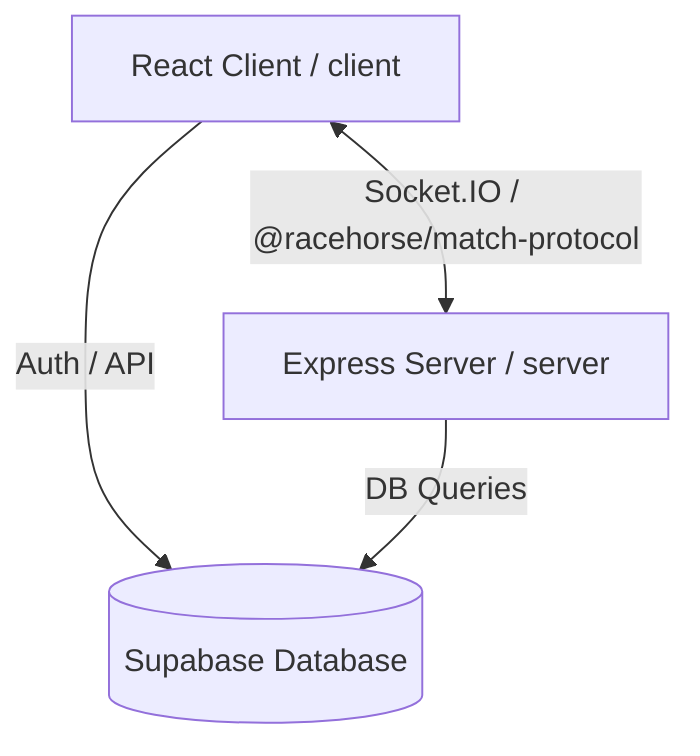

# Racehorse Dominoes

A premium web-based daily dominoes strategy platform featuring real-time multiplayer, advanced bot AI, and correct Racehorse rule systems.

---

## Current Production Status

The repository is frozen at the **v1.0 Production-Ready Engineering Baseline**. All validation suites, unit/behavior tests, and Playwright integration tests pass. The codebase has undergone comprehensive architecture hardening, Monorepo workspace migration, and security enhancements.

---

## Project & Architecture Overview

Racehorse Dominoes is structured as an npm workspaces monorepo containing three core packages:
1. **`client`**: A high-fidelity React client built using Vite, CSS, and Socket.IO.
2. **`server`**: A Node.js + Express + Socket.IO + TypeScript backend engine.
3. **`packages/match-protocol`**: A shared protocol package containing the message structures, events, and validation payloads shared between client and server.



---

## Key Modules & Subsystems

### 1. Core Gameplay Engine (`server/src/game/`)
Implements strict, server-authoritative Racehorse Dominoes rules:
- **Opening Conditions**: Opening play must be a double OR a scoring play.
- **Turn Chaining**: Extra turns are awarded on doubles and scoring plays, allowing players to chain plays.
- **Crossed-Double Branching**: Hubs can spawn up to 2 branch arms. All branch ends contribute to the open-ends sum for scoring.
- **Scoring**: sum of all open ends (including branches) divisible by 5 (Sum / 5).
- **Hand Termination**: Last-tile scoring/double rules, blocked hand resolution, and pip penalty calculations.

### 2. Multiplayer Architecture & Recovery Machine (`client/src/multiplayer/`)
State-sync model designed for Lichenss/Chess.com-quality resilience:
- **Event Bus Deduplication**: Eliminates duplicate network events or race conditions.
- **Recovery Machine**: A finite state machine coordinating client connection lifecycle, rejoining active rooms, and resyncing state.
- **Disconnect Grace Period**: Keeps rooms alive temporarily on client disconnection to allow rejoining.

### 3. Production Hardening
- **Server-Authoritative Daily Puzzle Timing**: Computes solve times purely using server-side database timestamps (`attempt.startedAt` and previous slots' `completedAt`), preventing clients from forging solving times.
- **Socket Rate Limiting**: Centralized `InMemoryRateLimiter` middleware protecting critical paths (`room:join`, `room:spectate`, `room:create`) and limiting brute-force scans of room codes by rate-limiting failed lookups (max 5 failures per 60 seconds).
- **Centralized Config Validation**: A single config module (`server/src/config.ts`) that validates environment variables (`SUPABASE_URL` schema check, missing secrets) at startup in production and fails fast with descriptive errors.

---

## Repository Structure

```
racehorse-dominoes/
├── .github/workflows/    # Unified CI pipeline configuration
├── client/               # React client workspace (Vite, Playwright, Vitest)
├── server/               # Node.js Express server workspace (Vitest, Express, Socket.IO)
├── packages/
│   └── match-protocol/   # Shared TypeScript types and protocols
├── package.json          # Root workspaces package definition
└── package-lock.json     # Unified workspace lockfile
```

---

## Development Setup

The repository utilizes **npm workspaces**. Dependencies must be installed at the root.

### Prerequisites
- Node.js (v20+)
- npm (v10+)

### Setup
```bash
# Install all dependencies across all workspaces
npm install
```

### Running Locally

To run the client and server concurrently:

#### Terminal 1: Backend Server (Port 3001)
```bash
npm run dev --prefix server
```

#### Terminal 2: Web Client (Port 5173)
```bash
npm run dev --prefix client
```

Open `http://localhost:5173` in multiple browser windows to test the game interface.

---

## Build & Validation Commands

Validate client and server codebases:

```bash
# Typecheck client
npm run typecheck --prefix client

# Run client tests and behavior tests
npm run test:all --prefix client

# Run server tests
npm run test --prefix server

# Build client for production
npm run build --prefix client

# Build server for production
npm run build --prefix server
```

---

## CI Pipeline & Validation Gates

The unified CI pipeline is configured in **`.github/workflows/ci.yml`** and runs automatically on every Push and Pull Request targeting `main`. The pipeline enforces the following validation checks:

- **Typecheck**: Compilation verification across TypeScript targets.
- **Lint**: ESLint for JS/TS code patterns, Stylelint for CSS stylesheet rules.
- **Client Tests**: Unit tests and behavior simulation runs.
- **Server Tests**: Engine invariants, room lifecycle, and rate-limiting tests.
- **Dependency Boundaries & Cycles**: Restricts dependency imports and prevents architectural cycle drift.
- **Playwright E2E**: End-to-end headless browser testing.
- **Build verification**: Builds production bundles to prevent minification or packaging failures.

---

## Engineering Principles

1. **Server Authority**: The game server is the single source of truth for game rules, move validations, and timelines. The client displays UI states and forwards user inputs.
2. **Deterministic Gameplay**: The engine must yield identical board states and score calculations for any given sequence of tiles and positions.
3. **Resilience**: The client connection lifecycle is designed to recover from unexpected disconnects without discarding the user's active session.
4. **Frozen Architecture**: Large structural refactors must be avoided. New features must build on top of frozen boundaries.
