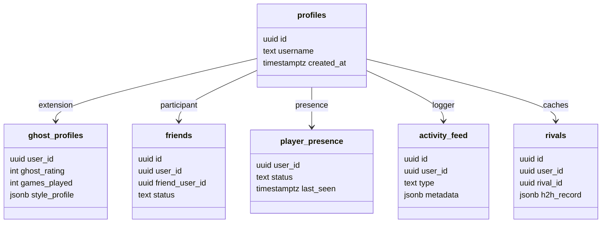

# Tier 3 Audit: Player Retention, Progression, Social, and Competitive Identity

## 1. Executive Summary

This audit assesses the player ecosystem of the Racehorse Dominoes platform, examining the transition from v1.0 (stabilized gameplay and core multiplayer transport) to Tier 3 (player retention, progression loops, social engagement, and competitive structures).

While the system contains robust schemas for profiles, friends, daily puzzles, and rivalries, it lacks the explicit progression mechanics, achievement systems, and structured season divisions necessary to drive long-term player retention. This document details the existing database infrastructure, identifies structural gaps, proposes architecture updates, and maps out a high-ROI engineering roadmap for Tier 3 development.

---

## 2. Current System Inventory & Quality Audit

The platform currently leverages a Postgres/Supabase database schema with Row Level Security (RLS) policies. The systems break down as follows:



### 1. Player Identity
*   **Infrastructure**: Handled via Supabase `auth.users` mapping to `public.profiles`. The database trigger `public.handle_new_user()` auto-bootstraps a default username (`user_` + first 8 characters of UUID) on signup.
*   **Competitive Profile**: `public.ghost_profiles` tracks single-player ghost matchmaking ratings (starting at 800 ELO equivalent), total `games_played`, style analysis payloads (`style_profile`), and move histories.
*   **Quality Level**: **Production-Grade**. The auto-bootstrap trigger prevents orphan profiles, and RLS policies restrict profile edits while leaving profile visibility open to authenticated users for social lookups.

### 2. Friends & Social Presence
*   **Infrastructure**:
    *   `public.friends`: Tracks bidirectional relationships. A custom unique index (`friends_pair_unique_idx`) prevents duplicate rows regardless of who sent the request (`least(user_id, friend_user_id), greatest(user_id, friend_user_id)`).
    *   `public.player_presence`: Tracks status (`online`, `in_game`, `offline`), `current_mode`, and `last_seen` timestamps.
    *   `public.activity_feed`: Logs events (`win`, `loss`, `streak`, `tournament`, `puzzle`, `daily_fritz`) with JSON metadata, accessible only to the player and their accepted friends.
    *   `public.rivals`: A cached table that stores computed head-to-head records (`h2h_record`) generated from player match histories.
*   **Quality Level**: **High**. The bidirectional index layout prevents database duplication bugs, and the presence tracker keeps connection data cleanly separated from long-term social data.

### 3. Statistics & Match History
*   **Infrastructure**:
    *   `public.matches`: Logs all competitive matches, storing participants, scores, winner/loser user IDs, move counts, and metadata.
    *   `public.verified_single_player_matches`: Validates single-player runs against Fritz/Ghost bots. Utilizes a completion hash to verify client runs.
    *   `public.daily_puzzle_attempts` & `public.daily_puzzle_slot_results`: Tracks three-slot puzzle sets, recording raw scores, points, moves, and completion times.
    *   `public.daily_fritz_attempts`: Tracks daily multiplayer challenges.
*   **Quality Level**: **Medium-High**. The verification hashes on single-player runs prevent basic client spoofing. However, there is no automatic roll-up or aggregation layer; queries must scan and sum rows directly from the table, which will not scale under heavy load.

### 4. Leaderboards
*   **Infrastructure**: Curated via indexes on attempts: `daily_puzzle_attempts_leaderboard_idx` on `(puzzle_date, puzzles_completed desc, total_score desc, master_chain_score desc, completed_at asc)`.
*   **Quality Level**: **Medium**. The index allows fast queries for a single date, but the schema has no native concept of seasons, divisions, global ELO rankings, or regional leaderboards.
*   **Scalability Projections**:
    *   *100K Players*: **Pass**. Indexing by date allows fast retrieval of the daily top 100.
    *   *1M Players*: **Fail**. Heavy concurrent inserts into `daily_puzzle_slot_results` will cause lock contention on the leaderboard index during peak hours. Writes must be decoupled from read aggregates (e.g. via scheduled materialized views or Redis caching).
    *   *Seasons*: **Fail**. No database tables exist to track season boundaries or snapshot historical leaderboards.
    *   *Categories*: **Partial**. Restricted to Daily Puzzles and rating orders; no support exists for win-rate, total-points, or tournament leaderboards.

---

## 3. Retention & Progression System Gaps

A comparison of Racehorse against major competitive gaming and habit-forming platforms (Chess.com, Duolingo, Clash Royale) reveals the following gaps:

| Feature Dimension | Modern Competitive Benchmark (e.g., Chess.com) | Racehorse Current State | Strategic Gap |
| :--- | :--- | :--- | :--- |
| **Progression Loop** | XP, levels, and level-unlockable icons or cosmetic frames. | Total games played count only. | No progression loop or player levels. |
| **Achievement System** | Multi-tier achievements (Bronze/Silver/Gold) and badges. | None. | No achievement engine or collection screen. |
| **Daily Engagement** | Streaks, streak freezes, and daily/weekly challenges. | Daily Puzzle slots exist, but lack streak tracking or return rewards. | No streak counter or rewards to drive daily retention. |
| **Competitive Identity** | Tiered divisions (Bronze to Grandmaster) and seasons. | Raw ELO number (`ghost_rating`) starting at 800. | ELO is not mapped to visual leagues; lacks seasonal resets. |

---

## 4. Proposed Database Schema Changes

To support Tier 3 features, the following schemas are designed to integrate with the existing Supabase environment:

```sql
-- 1. Season Boundaries
CREATE TABLE IF NOT EXISTS public.seasons (
  id          UUID        PRIMARY KEY DEFAULT gen_random_uuid(),
  name        TEXT        NOT NULL,
  started_at  TIMESTAMPTZ NOT NULL,
  ended_at    TIMESTAMPTZ NOT NULL,
  is_active   BOOLEAN     NOT NULL DEFAULT false
);

-- 2. Player Statistics Roll-Ups (avoids expensive table scans)
CREATE TABLE IF NOT EXISTS public.player_stats (
  user_id           UUID        PRIMARY KEY REFERENCES auth.users(id) ON DELETE CASCADE,
  xp                INT         NOT NULL DEFAULT 0,
  player_level      INT         NOT NULL DEFAULT 1,
  wins              INT         NOT NULL DEFAULT 0,
  losses            INT         NOT NULL DEFAULT 0,
  draws             INT         NOT NULL DEFAULT 0,
  perfect_puzzles   INT         NOT NULL DEFAULT 0,
  current_streak    INT         NOT NULL DEFAULT 0,
  max_streak        INT         NOT NULL DEFAULT 0,
  last_played_date  DATE        NULL
);

-- 3. Achievements Definition Catalog
CREATE TABLE IF NOT EXISTS public.achievements (
  id           TEXT        PRIMARY KEY, -- e.g. 'first_win', 'streak_10'
  title        TEXT        NOT NULL,
  description  TEXT        NOT NULL,
  tier         TEXT        NOT NULL CHECK (tier IN ('bronze', 'silver', 'gold', 'elite')),
  xp_reward    INT         NOT NULL DEFAULT 100
);

-- 4. Player Achievements Progress (RLS Enabled)
CREATE TABLE IF NOT EXISTS public.player_achievements (
  user_id        UUID        NOT NULL REFERENCES auth.users(id) ON DELETE CASCADE,
  achievement_id TEXT        NOT NULL REFERENCES public.achievements(id) ON DELETE CASCADE,
  unlocked_at    TIMESTAMPTZ NOT NULL DEFAULT now(),
  progress_meta  JSONB       NOT NULL DEFAULT '{}'::jsonb,
  PRIMARY KEY (user_id, achievement_id)
);

-- 5. Season Leaderboard Snapshots (captures final standings)
CREATE TABLE IF NOT EXISTS public.season_leaderboard_snapshots (
  season_id     UUID        NOT NULL REFERENCES public.seasons(id) ON DELETE CASCADE,
  user_id       UUID        NOT NULL REFERENCES auth.users(id) ON DELETE CASCADE,
  username      TEXT        NOT NULL,
  final_rating  INT         NOT NULL,
  final_rank    INT         NOT NULL,
  PRIMARY KEY (season_id, user_id)
);
```

---

## 5. Strategic Product & UX Review

### Retention Driver Analysis
1.  **The First 5 Minutes**: A player completes a match or a puzzle. Currently, they see a raw score. There is no feedback loop (e.g. level up, badge progress, XP gains) to validate their play.
2.  **Long-Term Mastery**: The "practice mode" and puzzles show skill, but without seasonal ratings or visual leagues (e.g. "Diamond League"), players lack a long-term goal.
3.  **Social/Status Collection**: The profile contains only a username. There are no showcase badges, unlockable avatars, or title cards to show status in the lobby.

### UX Recommendations
*   **Post-Match Summary**: Add a progression summary screen showing ELO change, XP gains, level progress, and active achievement steps.
*   **The Hub Header**: Show the player's level, competitive tier icon, and active streak fire emoji in the main navigation.
*   **The Social Drawer**: Show friend statuses and active match indicators next to their ELO ratings.

---

## 6. Tier 3 Roadmap

### Tier 3A: Social & Identity Foundation (Q3 - P0)
Establish the core status and profile indicators.
*   **XP & Level System**: Add an XP calculator to the game server. Track level milestones and store XP updates in `player_stats`.
*   **Profile Customization**: Add unlockable profile titles and badge showcases.
*   **Friend Presence Optimization**: Add socket-driven online notifications in the lobby drawer.
*   *Business Impact*: Drives immediate session value and boosts friend referrals.
*   *Complexity*: Low-Medium.

### Tier 3B: Engagement Loop (Q3 - P1)
Incentivize daily logins and consecutive play.
*   **Daily Streaks**: Add streak tracking to the Daily Puzzle. Track streaks in `player_stats` and display fire emojis on the home screen.
*   **Achievement System**: Implement the achievement engine (validating achievements like "Perfect Chain" or "Rival Crusher").
*   **Activity Feed Enhancements**: Display friend level-ups and achievement unlocks in the lobby feed.
*   *Business Impact*: Increases Daily Active Users (DAU) and average session frequency.
*   *Complexity*: Medium.

### Tier 3C: Competitive Identity (Q4 - P1)
Establish the competitive rankings.
*   **ELO Tiering**: Map raw ELO numbers into visual divisions (e.g. Bronze, Silver, Gold, Master).
*   **Structured Seasons**: Add support for 30-day competitive seasons, including rating normalization and snapshot saves.
*   **Leaderboard Aggregation**: Replace raw table scans with cached leaderboard snapshots updated via cron jobs.
*   *Business Impact*: Increases monthly active users (MAU) and competitive retention.
*   *Complexity*: Medium-High.

---

## 7. Recommended Implementation Order

To minimize deployment risks and deliver immediate product value, the recommended implementation path is structured as follows:

```
Step 1: XP & Level Tracking ──> Step 2: Achievements Engine ──> Step 3: Daily Streaks ──> Step 4: Seasons & Leagues
```

1.  **Step 1: Database Migration**: Deploy `player_stats` and profile tables. Initialize XP tracking on match end.
2.  **Step 2: Social Presence Polish**: Connect Socket.IO to the `player_presence` table to show live friend list status updates in the UI.
3.  **Step 3: Achievement Catalog**: Seed achievements and display unlocked badges in user profiles.
4.  **Step 4: Daily Puzzle Streak Integration**: Add daily puzzle completion streak counters and rewards.
5.  **Step 5: Seasonal Rollover & Leagues**: Introduce competitive season divisions and seasonal leaderboard snapshots.
