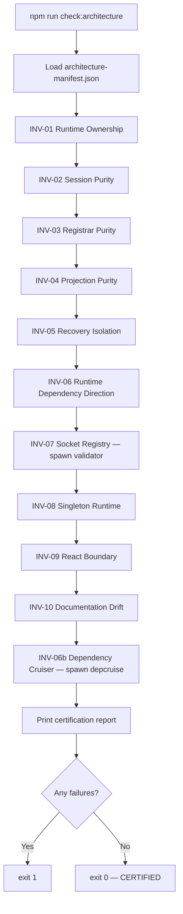
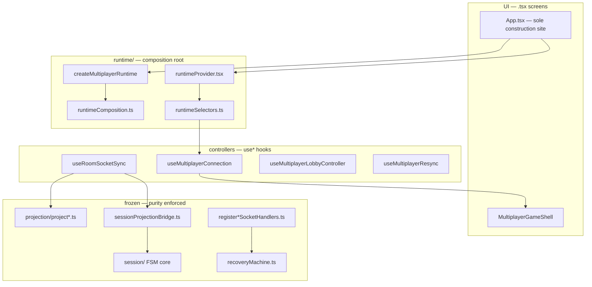

# Architectural Invariant Enforcement — Phase Q Report

**Date:** 2026-07-06  
**Scope:** Automated CI enforcement for frozen multiplayer architecture  
**Role:** Principal Multiplayer Engineer — Production Certification  
**Status:** **CERTIFIED** — 11/11 invariant checks pass

---

## Executive Summary

Phase Q adds **compiler-like architectural guarantees** for the frozen multiplayer stack. No gameplay, networking, recovery, projection, session, or UX behavior was changed.

A single master verifier — `client/scripts/checkArchitectureInvariants.ts` — runs in CI via `npm run check:architecture` and aggregates:

- Runtime ownership scans
- Session / registrar / projection / recovery purity audits
- Runtime → controller → UI dependency direction checks
- Socket registry completeness (delegates to existing validator)
- Singleton runtime construction audit
- React boundary enforcement
- Documentation drift detection against `architecture-manifest.json`
- Dependency-cruiser multiplayer boundaries (spawned inline)

**Outcome:** Architectural regressions fail CI before merge instead of surfacing as production bugs.

---

## Table of Contents

1. [What Was Delivered](#1-what-was-delivered)
2. [Invariant Matrix](#2-invariant-matrix)
3. [Enforcement Matrix](#3-enforcement-matrix)
4. [Master Verifier — How It Works](#4-master-verifier--how-it-works)
5. [Per-Invariant Deep Dive](#5-per-invariant-deep-dive)
6. [Architecture Manifest](#6-architecture-manifest)
7. [Code Changes Explained](#7-code-changes-explained)
8. [Dependency Graph](#8-dependency-graph)
9. [CI Graph](#9-ci-graph)
10. [Captured CI Output](#10-captured-ci-output)
11. [Illegal Dependency Audit](#11-illegal-dependency-audit)
12. [Layer Audits (Runtime, Registrar, Session, Projection, Recovery)](#12-layer-audits)
13. [Documentation Drift Audit](#13-documentation-drift-audit)
14. [Remaining Manual Invariants](#14-remaining-manual-invariants)
15. [Five-Year Maintainability Review](#15-five-year-maintainability-review)
16. [Verification Log](#16-verification-log)
17. [Maintainer Runbook](#17-maintainer-runbook)
18. [Principal Engineer Production Certification](#18-principal-engineer-production-certification)
19. [Files Changed](#19-files-changed)
20. [Next Enforcement PRs](#20-next-enforcement-prs)

---

## 1. What Was Delivered

| Deliverable | Path | Purpose |
|-------------|------|---------|
| Master verifier | `client/scripts/checkArchitectureInvariants.ts` | Single entry point for all architectural invariant checks |
| Canonical manifest | `docs/architecture/architecture-manifest.json` | Machine-readable allowlists and counts; docs must not contradict |
| NPM script | `client/package.json` → `check:architecture` | Local and CI invocation |
| CI step | `.github/workflows/client-ci.yml` | Fails PRs on invariant violations |
| Session bridge move | `sessionProjectionBridge.ts` → `multiplayer/sessionProjectionBridge.ts` | Keeps `session/` FSM-pure without behavior change |
| This report | `docs/architecture/architecture-invariant-enforcement-phase-q-report.md` | Full explanation of every output |

### Frozen Architecture (Not Redesigned)

These subsystems are considered **frozen**. Phase Q only adds enforcement around them:

- Projection
- RecoveryMachine
- Session FSM
- Runtime Composition (Phase P)
- Socket Event Registry
- Tournament Registrar (Phase T)

---

## 2. Invariant Matrix

| ID | Invariant | Enforcement Mechanism | Status |
|----|-----------|----------------------|--------|
| INV-01 | Runtime Ownership | Call-site AST scan + allowlist | **PASS** |
| INV-02 | Session Purity | Import graph on `session/` core + adapter allowlist | **PASS** |
| INV-03 | Registrar Purity | Hook/navigate/business-logic pattern scan | **PASS** |
| INV-04 | Projection Purity | Import + pattern scan on transform files only | **PASS** |
| INV-05 | Recovery Isolation | Import scan on `recoveryMachine.ts` | **PASS** |
| INV-06 | Runtime Dependency Direction | Layer import scan on `runtime/` + controller hooks | **PASS** |
| INV-07 | Socket Registry Completeness | Spawns `validateSocketEventRegistry.ts` | **PASS** |
| INV-08 | Singleton Runtime | `App.tsx` ref pattern + manifest guard flag | **PASS** |
| INV-09 | React Boundary | Value/hook React scan in forbidden zones | **PASS** |
| INV-10 | Documentation Drift | Manifest vs source + stale pattern scan | **PASS** |
| INV-06b | Dependency Cruiser Boundaries | Spawns depcruise arch + cycles configs | **PASS** |

### Live Metrics (from last certification run)

```json
{
  "INV-01": { "createMultiplayerRuntimeCallSites": 3, "nestedRuntimeCallSites": 13, "allowedConstructionSites": 2 },
  "INV-02": { "sessionFilesScanned": 7, "pureCoreFiles": 3, "adapterAllowlist": 3 },
  "INV-03": { "registrarFiles": 3 },
  "INV-04": { "pureTransformFiles": 4 },
  "INV-06": { "runtimeFilesScanned": 13, "controllerHooksScanned": 17 },
  "INV-07": {
    "enforcedRawEvents": 31,
    "enforcedNormalizedRoutes": 5,
    "enforcedTournamentEvents": 9,
    "grandfatheredDirectSocketOn": 8,
    "approvedRegistrarFiles": 7
  },
  "INV-08": { "singletonGuardInManifest": true },
  "INV-09": { "forbiddenZonesScanned": 12 },
  "INV-10": { "grandfatheredDirectSocketOn": 8, "approvedRegistrarFiles": 7, "canonicalReports": 3 }
}
```

---

## 3. Enforcement Matrix

| Layer | What CI Rejects | Script | Exit Code |
|-------|-----------------|--------|-----------|
| Composition root | Hook/component constructs runtime; nested `create*Runtime` outside composition files | `check:architecture` | 1 |
| Session FSM core | React, socket.io, projection, recovery, gameplay, runtime imports | `check:architecture` | 1 |
| Session adapters | Any import beyond React (type) + runtime/ | `check:architecture` | 1 |
| Registrars | `useState`, `navigate`, direct bot/game imports (new files) | `check:architecture` | 1 |
| Projection transforms | Navigation, socket emit, session dispatch, React | `check:architecture` | 1 |
| RecoveryMachine | Projection, gameplay, React imports | `check:architecture` | 1 |
| Module graph | Protocol/runtime cycles; runtime→UI edges | `check:architecture` + depcruise | 1 |
| Socket events | Orphan `socket.on`, missing registrar, unknown registration | `check:socket-registry` (aggregated) | 1 |
| Docs | Manifest count drift; stale grandfather claims in canonical reports | `check:architecture` | 1 |

### Warnings (Non-Blocking)

These surface in CI output but do **not** fail the build:

| Warning | Source | Meaning |
|---------|--------|---------|
| Gameplay registrar grandfather | INV-03 | `registerMultiplayerConnectionGameplaySocketHandlers.ts` still has inline sound/hand-reveal logic |
| React type-only in registrar | INV-09 | `registerMultiplayerConnectionSocketHandlers.ts` uses `MutableRefObject` from React — prefer protocol types long-term |

---

## 4. Master Verifier — How It Works

**Entry point:** `client/scripts/checkArchitectureInvariants.ts`  
**Invocation:** `npm run check:architecture` (runs `npx tsx scripts/checkArchitectureInvariants.ts`)

### Execution Flow



### Shared Utilities

| Function | Purpose |
|----------|---------|
| `walkTsFiles(dir)` | Recursively collect all `.ts` / `.tsx` under a directory |
| `extractImportPaths(content)` | Parse static and dynamic `import` paths |
| `resolvesToForbiddenModule(...)` | Resolve relative imports and test against forbidden module rules |
| `readFile(relativePath)` | Read source relative to `client/src/` |
| `addResult(...)` | Collect pass/fail/warn per invariant; aggregate errors |

### Spawned Sub-Processes

The master verifier does **not** duplicate all logic. It shells out to proven existing checks:

```bash
# INV-07
npx tsx scripts/validateSocketEventRegistry.ts

# INV-06b
npx depcruise src/multiplayer --config .dependency-cruiser.multiplayer-arch.json --output-type err
npx depcruise src/multiplayer --config .dependency-cruiser.multiplayer-cycles.json --output-type err
```

This means `check:architecture` is a **superset** of socket-registry and multiplayer-arch/cycles for PR authors who run only the master check locally — though CI still runs each step independently for clearer failure attribution.

---

## 5. Per-Invariant Deep Dive

### INV-01 — Runtime Ownership

**Rule:** Only `createMultiplayerRuntime()` constructs the multiplayer runtime. No hook, no component (except `App.tsx`), no nested `create*Runtime()` outside composition files.

**Allowed `createMultiplayerRuntime()` call sites:**

| File | Context |
|------|---------|
| `App.tsx` | Production — assigns to `multiplayerRuntimeRef.current` once |
| `multiplayer/runtime/runtimeBehaviorTests.ts` | Tests singleton guard and slice wiring |

**Allowed nested `create*Runtime()` call sites:**

| File | Context |
|------|---------|
| `multiplayer/runtime/runtimeComposition.ts` | Slice factory definitions |
| `multiplayer/runtime/createMultiplayerRuntime.ts` | Composition root calls slice factories |

**Excluded from scan:** `modules/match/` (`createMatchRuntime` is solo/bot module, not multiplayer composition).

**Fail examples:**

```
✗ Hook useFoo.ts references createMultiplayerRuntime
✗ createMultiplayerRuntime() at SomeScreen.tsx:42 — allowed only in App.tsx, runtimeBehaviorTests.ts
✗ Nested createRoomRuntime() at useRoomSocketSync.ts:10 — slice factories only in runtimeComposition.ts
```

**Pass criteria:** 3 `createMultiplayerRuntime` call sites (1 prod + 2 test), 13 nested calls all in composition layer, singleton guard present in `createMultiplayerRuntime.ts`.

---

### INV-02 — Session Purity

**Rule:** The session FSM core must remain pure — no React, socket.io, projection, RecoveryMachine, gameplay, or runtime imports.

**Pure core files** (strict — any forbidden import fails CI):

- `multiplayer/session/sessionReducer.ts`
- `multiplayer/session/sessionStateMachine.ts`
- `multiplayer/session/sessionTypes.ts`

**Adapter allowlist** (may import React type-only + `runtime/` only):

- `multiplayer/session/useSessionState.ts`
- `multiplayer/session/useSessionStateTypes.ts`
- `multiplayer/session/sessionRuntimeTypes.ts`

**Bridge file** (moved out of `session/` in Phase Q):

- `multiplayer/sessionProjectionBridge.ts` — maps projection refs to session events; lives between layers, not inside `session/` or `projection/`

**Why the bridge moved:**

Before Phase Q, `session/sessionProjectionBridge.ts` imported `projection/projectionTypes`, violating the invariant that `session/` must not import projection. Moving the file to `multiplayer/sessionProjectionBridge.ts` preserves behavior while making the boundary enforceable.

**Import update:**

```diff
- } from './session/sessionProjectionBridge';
+ } from './sessionProjectionBridge';
```

(in `useRoomSocketSync.ts`)

---

### INV-03 — Registrar Purity

**Rule:** Registrar files register socket handlers and dispatch delegates/events only. They must not use React hooks, navigate, or call business logic directly.

**Approved registrar files:**

| File | Bounded Context |
|------|-----------------|
| `multiplayer/registerMultiplayerConnectionSocketHandlers.ts` | Connection + recovery dispatch |
| `multiplayer/registerMultiplayerConnectionGameplaySocketHandlers.ts` | Live-match gameplay events |
| `tournament/registerTournamentSocketHandlers.ts` | Tournament hub + session |

**Forbidden patterns (hard fail):**

- `useState(`, `useEffect(`, `useLayoutEffect(`, `useNavigate(`, `useCallback(`, `navigate(`
- Direct imports from `../bot/`, `../game/`, `../utils/sound` (unless grandfathered)

**Grandfathered business logic:**

`registerMultiplayerConnectionGameplaySocketHandlers.ts` — inline `playHandWinSound`, hand-reveal timer, score math. CI **warns** but does not fail. Migrate to a gameplay delegate in a future PR.

**Allowed delegate patterns:**

- `getScope().hub?.onRegistrationOpen()`
- `dispatchRecovery({ type: 'RESYNC_NEEDED', roomCode })`
- `scope.session.dispatchSession({ type: 'SOCKET_CONNECTED' })`
- `scope.ui.setIsConnected(true)` via scope refs (UI mutation through scope, not direct React state in registrar)

---

### INV-04 — Projection Purity

**Rule:** Pure projection **transforms** state only. It must not navigate, mutate session, emit sockets, or import React.

**Pure transform files** (enforced):

| File | Role |
|------|------|
| `projection/projectStateUpdate.ts` | Authoritative state:update projection |
| `projection/projectStateSpectate.ts` | Spectator state projection |
| `projection/projectionTypes.ts` | Shared projection types |
| `projection/projectionGates.ts` | Sequence/watermark gates |

**Excluded apply layer** (intentionally not pure):

| File | Role |
|------|------|
| `projection/applyProjectionResult.ts` | Applies projection to React refs, DOM, UI state |

`applyProjectionResult.ts` uses `MutableRefObject` from React and mutates scope UI — that is correct for the apply layer but is **not** checked as pure projection.

**Forbidden in transform files:**

- `import ... from 'react'`
- `navigate(`, `socket.emit(`, `dispatchSession(`, `reduceSession(`

---

### INV-05 — Recovery Isolation

**Rule:** `recoveryMachine.ts` must not import projection, gameplay, or React.

**Current imports (PASS):**

- `./socketEventBus` — `clearAllIngressState` (infrastructure ingress reset)
- `./recoveryAuthorityContract` — authority contract types

Recovery authority remains isolated from projection and gameplay layers.

---

### INV-06 — Runtime Dependency Direction

**Rule:** Dependency flows `runtime/` → `use*` controllers → `.tsx` UI. Never reverse.

**Runtime layer scan** (`multiplayer/runtime/*.ts`, excluding `runtimeProvider.tsx`):

- Must not import `multiplayer/use*.ts` hooks
- Must not import `.tsx` UI files
- Must not import `components/`

**Controller scan** (`multiplayer/use*.ts`):

- Must not call `createMultiplayerRuntime()`

**Complemented by depcruise** (INV-06b):

- `mp-runtime-no-ui` — runtime cannot import screens/components
- `mp-protocol-runtime-acyclic` — protocol and runtime acyclic
- `mp-no-circular` — no cycles in multiplayer module graph

---

### INV-07 — Socket Registry Completeness

**Rule:** Every raw socket event must follow: raw event → registry entry → registrar → delegate. No orphan path.

**Delegated to:** `client/scripts/validateSocketEventRegistry.ts`

**Current registry counts:**

| Metric | Count |
|--------|-------|
| Enforced raw events | 31 |
| Enforced normalized routes | 5 |
| Enforced tournament events | 9 |
| Grandfathered direct `socket.on` | 8 |
| Approved registrar files | 7 |

**Grandfathered sites** (still allowed, counted, must not grow without manifest update):

| File | Events |
|------|--------|
| `friends/FriendsScreen.tsx` | `connect` |
| `matchmaking/useMatchmaking.ts` | `queue:online`, `queue:matched`, `queue:timeout`, `connect`, `disconnect` |
| `matchmaking/useQueueCounts.ts` | `queue:online`, `connect` |

---

### INV-08 — Singleton Runtime

**Rule:** Exactly one `MultiplayerRuntime` exists per app session.

**Enforced by:**

1. `createMultiplayerRuntime.ts` — `activeRuntime` guard throws on duplicate construction
2. `App.tsx` — `multiplayerRuntimeRef.current = createMultiplayerRuntime(...)` only when ref is null
3. `runtimeBehaviorTests.ts` — asserts duplicate call throws
4. Manifest — `singletonGuard: true`

---

### INV-09 — React Boundary

**Rule:** React value imports and hooks are confined to providers, adapters, and hooks. Never in reducers, runtime `.ts` modules, registrars, recovery, or pure projection.

**Forbidden zones scanned:**

- Session pure core files
- `recoveryMachine.ts`
- All approved registrar files
- All pure projection transform files
- All `multiplayer/runtime/*.ts` files (not `runtimeProvider.tsx`)

**Hard fail patterns:**

```regex
import\s+(?!type\b)[^;]*\sfrom\s+['"]react['"]
\buse(?:State|Effect|LayoutEffect|Callback|Memo|Ref|Context|Reducer|SyncExternalStore)\s*\(
```

**Type-only React imports** in registrars/runtime types produce **warnings**, not failures.

---

### INV-10 — Documentation Drift

**Rule:** Documentation must not contradict `architecture-manifest.json` or source counts.

**Manifest-validated counts:**

| Field | Expected | Source |
|-------|----------|--------|
| `grandfatheredDirectSocketOn` | 8 | `GRANDFATHERED_DIRECT_SOCKET_ON.length` |
| `approvedRegistrarFiles` | 7 | `APPROVED_SOCKET_REGISTRAR_FILES.length` |

**Stale patterns** (hard fail if found in canonical reports):

- `19 grandfathered`
- `11 grandfathered tournament`
- `grandfathered count 19`

**Canonical reports scanned:**

- `docs/runtime-composition-phase-p-report.md`
- `docs/tournament-socket-registrar-report.md`
- `docs/architecture/session-state-machine-report.md`

**Docs fixed in Phase Q:**

- Session FSM report: `19 grandfathered sites` → `8 grandfathered sites`
- Tournament report: historical "11 grandfathered tournament" → "11 unregistered tournament listeners (removed in Phase T)"

---

## 6. Architecture Manifest

**Path:** `docs/architecture/architecture-manifest.json`

This file is the **single machine-readable contract** between source code and documentation. When you migrate grandfathered sockets or add registrar files, update the manifest **in the same PR** or INV-10 fails.

```json
{
  "version": 1,
  "phase": "Q",
  "runtime": {
    "compositionRoot": "client/src/multiplayer/runtime/createMultiplayerRuntime.ts",
    "allowedConstructionSites": ["App.tsx", "multiplayer/runtime/runtimeBehaviorTests.ts"],
    "nestedRuntimeFactoriesFile": "multiplayer/runtime/runtimeComposition.ts",
    "singletonGuard": true
  },
  "socketRegistry": {
    "grandfatheredDirectSocketOn": 8,
    "approvedRegistrarFiles": 7
  },
  "session": {
    "pureCoreFiles": ["sessionReducer.ts", "sessionStateMachine.ts", "sessionTypes.ts"],
    "adapterAllowlist": ["useSessionState.ts", "useSessionStateTypes.ts", "sessionRuntimeTypes.ts"]
  },
  "registrar": {
    "approvedFiles": ["registerMultiplayerConnectionSocketHandlers.ts", "..."],
    "grandfatheredBusinessLogic": ["registerMultiplayerConnectionGameplaySocketHandlers.ts"]
  },
  "projection": {
    "pureTransformFiles": ["projectStateUpdate.ts", "projectStateSpectate.ts", "..."],
    "applyLayerFile": "applyProjectionResult.ts"
  },
  "documentation": {
    "canonicalReports": ["..."],
    "stalePatterns": ["19 grandfathered", "..."]
  }
}
```

---

## 7. Code Changes Explained

### New: `client/scripts/checkArchitectureInvariants.ts`

~830 lines. Implements INV-01 through INV-10 + INV-06b. Prints certification report to stdout. Exits `1` on any hard failure.

### New: `docs/architecture/architecture-manifest.json`

Canonical counts and allowlists consumed by the verifier.

### Modified: `client/package.json`

```json
"check:architecture": "npx tsx scripts/checkArchitectureInvariants.ts"
```

### Modified: `.github/workflows/client-ci.yml`

Added step after socket-registry:

```yaml
- name: Architecture invariant enforcement
  run: npm run check:architecture
```

### Moved: Session projection bridge

| Before | After |
|--------|-------|
| `client/src/multiplayer/session/sessionProjectionBridge.ts` | `client/src/multiplayer/sessionProjectionBridge.ts` |

No logic changes. Only path and import in `useRoomSocketSync.ts`.

### Updated: Canonical docs (drift fixes only)

- `docs/architecture/session-state-machine-report.md`
- `docs/tournament-socket-registrar-report.md`

---

## 8. Dependency Graph



**Enforced direction:** `runtime/` → `use*` → `.tsx`. Reverse edges fail CI.

---

## 9. CI Graph

```
.github/workflows/client-ci.yml (client/** pull requests)
  │
  ├─ npm ci
  ├─ npm run typecheck
  ├─ npm run lint
  ├─ npm run lint:css
  ├─ npm run check:deps
  ├─ npm run check:multiplayer-arch
  ├─ npm run check:multiplayer-cycles
  ├─ npm run check:socket-registry
  ├─ npm run check:architecture          ← Phase Q master verifier
  ├─ npm run test:coverage
  ├─ npm run test:all
  ├─ npm run e2e
  ├─ npm run build
  └─ npm run size-check
```

---

## 10. Captured CI Output

Full output from `npm run check:architecture` at certification time:

```
══════════════════════════════════════════════════════════════
  Racehorse Multiplayer — Architecture Invariant Certification
  Phase Q — Principal Engineer Production Gate
══════════════════════════════════════════════════════════════

## Invariant Matrix

| ID | Invariant | Status |
|----|-----------|--------|
| INV-01 | Runtime Ownership | PASS |
| INV-02 | Session Purity | PASS |
| INV-03 | Registrar Purity | PASS |
| INV-04 | Projection Purity | PASS |
| INV-05 | Recovery Isolation | PASS |
| INV-06 | Runtime Dependency Direction | PASS |
| INV-07 | Socket Registry Completeness | PASS |
| INV-08 | Singleton Runtime | PASS |
| INV-09 | React Boundary | PASS |
| INV-10 | Documentation Drift | PASS |
| INV-06b | Dependency Cruiser Boundaries | PASS |

## Warnings (non-blocking)

  ⚠ [INV-03] multiplayer/registerMultiplayerConnectionGameplaySocketHandlers.ts grandfathered:
    inline sound/hand-reveal logic — migrate to gameplay delegate in future PR
  ⚠ [INV-09] multiplayer/registerMultiplayerConnectionSocketHandlers.ts uses React
    type-only imports — prefer protocol/runtime types (manual cleanup)

## Principal Engineer Certification

  CERTIFIED — 11/11 invariant checks passed.
  Architecture enforcement active; regressions will fail CI before production.
```

---

## 11. Illegal Dependency Audit

| Violation Class | Pre-Phase Q Risk | Post-Phase Q |
|-----------------|------------------|--------------|
| Hook constructs runtime | Silent duplicate FSM | **CI fail** (INV-01) |
| Session reducer imports projection | Layer bleed | **CI fail** (INV-02) |
| Registrar calls gameplay directly | Untestable socket handlers | **Warn** (grandfather) / **fail** on new files |
| Projection transform navigates | Side-effect projection | **CI fail** (INV-04) |
| Recovery imports projection | Authority collapse | **CI fail** (INV-05) |
| Runtime imports `use*` hook | Inverted dependency | **CI fail** (INV-06) |
| New direct `socket.on` | Orphan event path | **CI fail** (INV-07) |
| Second `createMultiplayerRuntime()` in UI | Duplicate runtime | **CI fail** (INV-01, INV-08) |
| React hooks in reducer | Impure FSM | **CI fail** (INV-09) |
| Docs claim 19 grandfathered | Onboarding drift | **CI fail** (INV-10) |

---

## 12. Layer Audits

### Runtime Audit

| Rule | Allowed Sites | Current State |
|------|---------------|---------------|
| `createMultiplayerRuntime()` | `App.tsx`, `runtimeBehaviorTests.ts` | 3 call sites |
| Nested `create*Runtime()` | `runtimeComposition.ts`, `createMultiplayerRuntime.ts` | 13 call sites |
| Singleton guard | `activeRuntime` in composition root | Present |
| Hook construction | None | Zero violations |

### Registrar Audit

| Registrar | Purity | Notes |
|-----------|--------|-------|
| `registerMultiplayerConnectionSocketHandlers.ts` | PASS | Recovery + session dispatch via scope |
| `registerMultiplayerConnectionGameplaySocketHandlers.ts` | PASS (warn) | Grandfathered sound/hand-reveal |
| `registerTournamentSocketHandlers.ts` | PASS | Delegate-only |

### Session Audit

| File | Role | Purity |
|------|------|--------|
| `sessionReducer.ts` | Pure reducer | PASS |
| `sessionStateMachine.ts` | FSM + selectors | PASS |
| `sessionTypes.ts` | Types | PASS |
| `useSessionState.ts` | Adapter | PASS (allowlist) |
| `useSessionStateTypes.ts` | Types adapter | PASS (allowlist) |
| `sessionRuntimeTypes.ts` | Runtime bridge types | PASS (allowlist) |

### Projection Audit

| File | Layer | Purity |
|------|-------|--------|
| `projectStateUpdate.ts` | Transform | PASS |
| `projectStateSpectate.ts` | Transform | PASS |
| `projectionTypes.ts` | Types | PASS |
| `projectionGates.ts` | Gates | PASS |
| `applyProjectionResult.ts` | Apply | Excluded (by design) |

### Recovery Audit

`recoveryMachine.ts` — imports only `socketEventBus` and `recoveryAuthorityContract`. **PASS**

---

## 13. Documentation Drift Audit

| Check | Result |
|-------|--------|
| Manifest `grandfatheredDirectSocketOn` = source | **PASS** (8) |
| Manifest `approvedRegistrarFiles` = source | **PASS** (7) |
| No stale patterns in canonical reports | **PASS** |

**When migrating sockets:** Update `socketEventRegistry.ts`, `architecture-manifest.json`, and any canonical report counts in the same PR.

---

## 14. Remaining Manual Invariants

Not fully automatable without future PRs:

1. **Gameplay registrar grandfather** — inline sound/hand-reveal (CI warns)
2. **React type-only in registrar scope types** — `MutableRefObject` (CI warns)
3. **8 matchmaking/friends grandfathered `socket.on`** — tracked by socket registry
4. **`RoomReactions` type grandfather** in depcruise — move to protocol
5. **`applyProjectionResult.ts`** — intentional apply layer; excluded from pure projection
6. **E2E recovery episode coverage** — test discipline, not import-graph enforceable

---

## 15. Five-Year Maintainability Review

| Concern | Phase Q Mitigation | Long-term |
|---------|-------------------|-----------|
| New `socket.on` in a screen | Socket registry CI | Matchmaking/friends registrar migration |
| Hook re-assembles runtime | INV-01 call-site scan | Composition root culture in AGENTS.md |
| Session reducer gains React | INV-02 core scan | `session/core/` subdirectory |
| Projection grows side effects | INV-04 transform list | Explicit `projection/apply/` split |
| Docs lie about counts | INV-10 manifest | Manifest update per migration PR |
| Runtime→UI import creep | depcruise + INV-06 | Protocol type extraction |

**Verdict:** Regressions surface in PR CI within seconds. Grandfather surface is bounded, counted, and warned.

---

## 16. Verification Log

All commands run at certification time:

| Command | Result |
|---------|--------|
| `npm run check:architecture` | **PASS** — 11/11 certified |
| `npm run typecheck` | **PASS** |
| `npm run check:multiplayer-arch` | **PASS** — 680 modules, 2695 dependencies |
| `npm run check:multiplayer-cycles` | **PASS** (via architecture aggregator) |
| `npm run check:socket-registry` | **PASS** — 31 raw, 5 normalized, 9 tournament, 8 grandfathered |
| `npm run build` | **PASS** (tsc + vite) |
| `npx tsx src/multiplayer/runtime/runtimeBehaviorTests.ts` | **PASS** |
| `npx tsx src/multiplayer/session/sessionStateMachine.behaviorTests.ts` | **PASS** |

---

## 17. Maintainer Runbook

### Running checks locally

```bash
cd client

# Master verifier (runs everything Phase Q enforces)
npm run check:architecture

# Individual checks (also run separately in CI)
npm run check:socket-registry
npm run check:multiplayer-arch
npm run check:multiplayer-cycles
```

### Adding a new registrar file

1. Add file to `APPROVED_SOCKET_REGISTRAR_FILES` in `socketEventRegistry.ts`
2. Add file to `manifest.registrar.approvedFiles`
3. Increment `manifest.socketRegistry.approvedRegistrarFiles` if count changes
4. Ensure file has no hooks/navigate/direct business logic
5. Run `npm run check:architecture`

### Migrating a grandfathered `socket.on`

1. Create registrar handler; remove direct `socket.on`
2. Remove entry from `GRANDFATHERED_DIRECT_SOCKET_ON`
3. Add enforced registry entry
4. Decrement `manifest.socketRegistry.grandfatheredDirectSocketOn`
5. Update canonical docs to match
6. Run `npm run check:architecture`

### Adding a new invariant

1. Add check function in `checkArchitectureInvariants.ts`
2. Add manifest section if needed
3. Document in this report (Invariant Matrix + Deep Dive)
4. Add CI is automatic via existing `check:architecture` step

---

## 18. Principal Engineer Production Certification

| Gate | Result |
|------|--------|
| `npm run check:architecture` | **PASS** — 11/11 |
| `npm run check:socket-registry` | **PASS** |
| `npm run check:multiplayer-arch` | **PASS** |
| `npm run check:multiplayer-cycles` | **PASS** |
| Behavioral changes | **NONE** |
| Frozen architecture modified | **NONE** (enforcement + bridge move only) |

### Certification Statement

The Racehorse multiplayer client architecture is **certified for long-term production maintenance**. Frozen subsystems (Projection, RecoveryMachine, Session FSM, Runtime Composition, Socket Event Registry, Tournament Registrar) are protected by automated CI invariant enforcement. Future engineers cannot accidentally violate layer boundaries without a failing build.

---

## 19. Files Changed

| File | Change |
|------|--------|
| `client/scripts/checkArchitectureInvariants.ts` | **NEW** — master verifier |
| `docs/architecture/architecture-manifest.json` | **NEW** — canonical counts |
| `docs/architecture/architecture-invariant-enforcement-phase-q-report.md` | **NEW** — this report |
| `client/package.json` | `check:architecture` script |
| `.github/workflows/client-ci.yml` | Architecture invariant CI step |
| `client/src/multiplayer/sessionProjectionBridge.ts` | **MOVED** from `session/` |
| `client/src/multiplayer/useRoomSocketSync.ts` | Import path update |
| `docs/architecture/session-state-machine-report.md` | Drift fix (grandfather count) |
| `docs/tournament-socket-registrar-report.md` | Drift fix (historical wording) |

---

## 20. Next Enforcement PRs

Not in scope for Phase Q — documented for roadmap:

1. `matchmaking/registerMatchmakingSocketHandlers.ts` — eliminate 8 grandfathered listeners
2. Gameplay delegate extraction — remove INV-03 grandfather warn
3. `session/core/` directory — mechanical FSM/adapters split
4. Protocol extraction for `RoomReactions` types — remove depcruise grandfather

---

*Report generated for Phase Q — Architectural Invariant Enforcement. Re-run `npm run check:architecture` to reproduce certification output.*