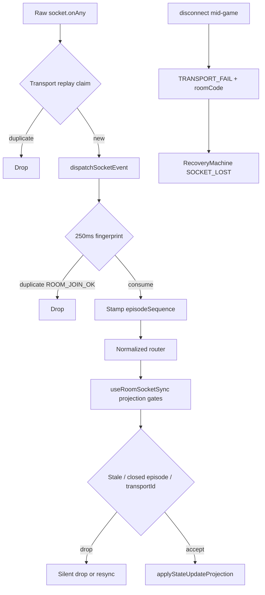

# Multiplayer Production Hardening Audit — Phase V Report

**Date:** 2026-07-06  
**Scope:** `client/src/multiplayer` + integration surfaces (`App.tsx`, `match/session/`, server disconnect grace)  
**Role:** Principal Multiplayer Engineer — AAA Production Readiness  
**Status:** **READY WITH NOTES**

---

## Executive Summary

Phase V is a **read-only production hardening audit**. Architecture (Phases P–U), RecoveryMachine, Projection, Session FSM, Runtime Composition, and Socket Registrars are **frozen and assumed correct**. No production code was modified.

### Verdict: **READY WITH NOTES**

The multiplayer client is **operationally shippable** for production traffic. Core resilience against network chaos is **strong**: multi-layer deduplication, episode-gated projection, bounded recovery retries, and a production invariant chaos harness. Gaps are concentrated in **observability**, **long-session memory bounds**, **background-tab lifecycle**, and **ungated diagnostic logging in hot paths** — not in fundamental recovery correctness.

| Dimension | Assessment |
|-----------|------------|
| Network failure handling | **Strong** — dedup, replay registry, episode gates, sequence watermarks |
| Recovery correctness | **Strong** — 5-attempt cap, episode boundaries, coalesced resync queue |
| Concurrency safety | **Strong** — dispatch queue, transition lock, commit symbols, in-flight guards |
| Behavioral test coverage | **Strong** — 13 multiplayer behavior/invariant files; 36 total in CI harness |
| Production observability | **Weak** — console-only recovery logs; no structured telemetry |
| Long-session memory | **Moderate risk** — one unbounded collection; diagnostic array growth |
| Background / mobile lifecycle | **Moderate gap** — no core `visibilitychange` recovery hook |
| E2E chaos validation | **Gap** — no browser-level integration chaos suite |

### Hard Rules Compliance

| Rule | Status |
|------|--------|
| Read-only audit | ✅ No production code changes |
| No file moves | ✅ |
| No architectural redesign recommendations | ✅ |
| Frozen subsystems not redesigned | ✅ |

---

## Table of Contents

1. [Files Inspected](#1-files-inspected)
2. [Network Failure Audit](#2-network-failure-audit)
3. [Recovery Audit](#3-recovery-audit)
4. [Session Lifetime Audit](#4-session-lifetime-audit)
5. [Memory Audit](#5-memory-audit)
6. [Performance Audit](#6-performance-audit)
7. [Concurrency Audit](#7-concurrency-audit)
8. [Chaos Engineering Audit](#8-chaos-engineering-audit)
9. [Operational Readiness](#9-operational-readiness)
10. [Scalability Review](#10-scalability-review)
11. [Test Coverage Audit](#11-test-coverage-audit)
12. [Production Risk Matrix](#12-production-risk-matrix)
13. [Five-Year Maintainability Assessment](#13-five-year-maintainability-assessment)
14. [Principal Engineer Certification](#14-principal-engineer-certification)
15. [Verification Log](#15-verification-log)

---

## 1. Files Inspected

### 1.1 Core Production Paths (91 modules)

**Transport & ingress**
- `socketEventBus.ts` — normalized dispatch, dedup, replay registry, episode gates
- `socketGuards.ts` — handler error recovery, sequence watermark evaluation
- `roomTransport.ts` — emit-with-ack, 8s timeout
- `registerMultiplayerConnectionSocketHandlers.ts` — connect/disconnect/recovery ingress
- `registerMultiplayerConnectionGameplaySocketHandlers.ts` — gameplay delegate registrar
- `connectionGameplaySocketHandlers.ts` — hand-ended, rematch, dragging delegates

**Recovery & resync**
- `recoveryMachine.ts` — authoritative recovery FSM
- `recoveryConnectionBridge.ts` — legacy ref sync
- `recoveryAuthorityContract.ts` — single-source recovery trigger contract
- `useMultiplayerConnection.ts` — socket lifecycle, recovery effect execution
- `useMultiplayerResync.ts` — `fetchGameState`, cooldown, buffered updates
- `joinAckCoordinator.ts` — join-ack authority

**Projection & session**
- `projection/projectionGates.ts`, `projection/applyProjectionResult.ts`
- `projection/projectStateUpdate.ts`, `projection/projectStateSpectate.ts`
- `session/sessionReducer.ts`, `session/sessionStateMachine.ts`
- `useRoomSocketSync.ts` — projection orchestration, raw handler registration
- `sessionProjectionBridge.ts`

**Runtime & controllers**
- `runtime/createMultiplayerRuntime.ts`, `runtime/runtimeProvider.tsx`
- `useMultiplayerLobbyController.ts`, `useMultiplayerRoomActions.ts`
- `useJoinAckCoordinator.ts`, `postGameExit.ts`, `connectPolicy.ts`

**Diagnostics**
- `mpPerf.ts` (debug-gated), `drawAudit.ts` (DEV-only)

### 1.2 Integration Surfaces

- `client/src/App.tsx` — runtime composition, `attachSocketEventBus`, join-ack router
- `client/src/match/session/useLiveMatchSession.ts` — match-layer timer cleanup
- `server/src/multiplayer/disconnectGrace.ts` — 30s opponent disconnect grace

### 1.3 Test & Invariant Files (13 multiplayer)

| File | Focus |
|------|-------|
| `recoveryMachine.behaviorTests.ts` | FSM transitions |
| `recoveryMachine.contract.final.behaviorTests.ts` | Phase J terminal contracts |
| `recoveryMachine.production.invariantTests.ts` | Chaos scenarios A–D |
| `socketEventBus.behaviorTests.ts` | Core bus |
| `socketEventBus.dedup.behaviorTests.ts` | Duplicate burst collapse |
| `socketEventBus.concurrency.behaviorTests.ts` | Re-entrant dispatch |
| `socketEventBus.episodeOrdering.behaviorTests.ts` | Cross-episode ordering |
| `socketEventBus.transportReplay.behaviorTests.ts` | Transport replay registry |
| `multiplayerResyncQueue.behaviorTests.ts` | Pending resync coalescing |
| `multiplayerResyncContract.behaviorTests.ts` | Indirect vs direct resync |
| `joinAckCoordinator.behaviorTests.ts` | Join ack authority |
| `session/sessionStateMachine.behaviorTests.ts` | Session FSM |
| `registerMultiplayerConnectionGameplaySocketHandlers.behaviorTests.ts` | Registrar purity |

### 1.4 CI Enforcement (unchanged)

- `client/scripts/checkArchitectureInvariants.ts` — 11/11 PASS at audit time
- `client/run-behavior-tests.mjs` — 36 behavior/invariant files

---

## 2. Network Failure Audit

### 2.1 Scenario Matrix

| Scenario | Handled? | Mechanism | Evidence |
|----------|----------|-----------|----------|
| **Duplicate packets** | ✅ Yes | 250ms fingerprint dedup; `roomJoinOkHandled` single-consume | `socketEventBus.ts` `shouldConsumeNormalizedEvent`, `DEDUP_WINDOW_MS` |
| **Dropped packets** | ✅ Yes | Recovery FSM + resync via `fetchGameState` / `RESYNC_NEEDED` | `useMultiplayerResync.ts`, `recoveryMachine.ts` |
| **Delayed packets** | ✅ Yes | Episode sequence gate; stale episode drop | `projectionGates.ts` `shouldDropStaleEpisodeStateUpdate` |
| **Out-of-order packets** | ✅ Yes | Sequence watermark + regression threshold (10) → resync | `socketGuards.ts` `evaluateSequenceWatermark` |
| **Stale packets** | ✅ Yes | `STATE_REPLAY_SILENT_DROP_GAP=50`; closed-episode projection gate | `projectionGates.ts`, `shouldDropClosedEpisodeProjection` |
| **WebSocket reconnect timing** | ✅ Yes | Socket.IO: 1–5s delay, 10 attempts; Recovery: backoff 1.5–10s, max 5 | `useMultiplayerConnection.ts` L305–313; `MAX_RECOVERY_ATTEMPTS=5` |
| **Packet replay** | ✅ Yes | Transport replay fingerprint registry (500 cap, LRU evict 100) | `socketEventBus.ts` `TRANSPORT_REPLAY_MAX_SIZE` |
| **Packet deduplication** | ✅ Yes | Raw + normalized ingress paths | `acceptRawSocketTransportIngress`, `acceptNormalizedTransportIngress` |
| **Reconnect storms** | ✅ Yes | Dedup bursts; production invariant Scenario A (10 join + 20 interleave + 200 state) | `recoveryMachine.production.invariantTests.ts` |
| **Simultaneous reconnects** | ✅ Yes | `rejoinInFlightRef` + `resyncInFlightRef` + recovery episode lock | `useMultiplayerResync.ts` L85–86 |
| **Packet flooding** | ⚠️ Partial | Dedup window collapses bursts; unbounded `processedTransportEventIds` under sustained unique IDs | See §5.2 |
| **Malformed payload** | ✅ Yes | `isMalformedJoinAck`; `wrapSocketHandler` try/catch + `recoverOnError` | `joinAckCoordinator.ts` L60–66; `socketGuards.ts` |
| **Invalid room transitions** | ✅ Yes | Session FSM phases; terminal join markers | `sessionReducer.ts`; `isTerminalJoinError` |
| **Reconnect during join** | ✅ Yes | `pendingResyncRoomCode` coalescing while `joining` | `multiplayerResyncQueue.behaviorTests.ts` |
| **Reconnect during gameplay** | ✅ Yes | `TRANSPORT_FAIL` with `roomCode` → `SOCKET_LOST` | `registerMultiplayerConnectionSocketHandlers.ts` L136–146 |
| **Reconnect during victory** | ✅ Yes | Terminal tournament join disables policy; terminal join errors clear room | `useMultiplayerConnection.ts` L113–120; `clearedTerminal()` |
| **Reconnect during resignation** | ✅ Yes | `USER_LEAVE` closes episode; stale `RESYNC_OK` no-op | `recoveryMachine.contract.final.behaviorTests.ts` test 1 |
| **Reconnect after room destroyed** | ✅ Yes | `ROOM_JOIN_TERMINAL` → `clearedTerminal`, `clear_terminal_room` effect | `recoveryMachine.ts` L538–555 |

### 2.2 Ingress Pipeline (Production Path)



### 2.3 Residual Network Risks

| Risk | Severity | Notes |
|------|----------|-------|
| Dual reconnect layers (Socket.IO + RecoveryMachine) | Low | Coordinated via `TRANSPORT_FAIL` / `SOCKET_CONNECTED`; tested in invariant harness |
| `server:shutdown` only shows toast | Medium | Does not disable recovery policy or trigger resync — user may retry into dead server |
| No explicit airplane-mode / offline event handler | Medium | Relies on socket `disconnect` event propagation |

---

## 3. Recovery Audit

### 3.1 Operational Properties

| Property | Status | Evidence |
|----------|--------|----------|
| Impossible states | ✅ Guarded | State-specific event guards (e.g. `RESYNC_OK` only in `resyncing`) |
| Race conditions | ✅ Mitigated | `_transitionLock`, `recoveryReducerInFlight`, `dispatchEpoch` | 
| Overlapping recovery attempts | ✅ Prevented | Single scheduler; `scheduledEpisodeId` episode match | `createRecoveryMachine` L758–764 |
| Stale authority | ✅ Prevented | `isEpisodeStaleRecoveryEvent`; projection gate closure | Phase K contract |
| Recovery loops | ✅ Bounded | `MAX_RECOVERY_ATTEMPTS = 5`; exhausted → `failed` + `manual_only` |
| Infinite retry potential | ✅ No | Backoff capped at 10s; attempts capped at 5 per episode |
| Abandoned promises | ⚠️ Partial | `emitWithAck` has no AbortSignal; in-flight ack after unmount may dispatch stale recovery | `roomTransport.ts` |
| Timeout behavior | ✅ Yes | 8s ack timeout → `TRANSPORT_FAIL` path |
| Cancellation behavior | ✅ Yes | `dispose()` cancels scheduler; `USER_LEAVE` cancels schedule effect |
| Memory retention | ⚠️ See §5 | Episode-scoped ingress clear on terminal |

### 3.2 Recovery State Machine Summary

```
idle ──SOCKET_LOST──► connecting ──SCHEDULED_RETRY──► connect effect
connecting ──SOCKET_CONNECTED──► joining ──room_join effect──► (async room:join)
joining ──ROOM_JOIN_OK──► idle (+ pending resync flush)
idle ──RESYNC_NEEDED──► resyncing ──resync effect──► (async fetchGameState)
resyncing ──RESYNC_FAIL──► connecting (retry) or terminal
any exhausted ──► failed (manual_only policy)
```

### 3.3 Key Invariants (Test-Proven)

| Invariant | Test file |
|-----------|-----------|
| `RESYNC_OK` after `USER_LEAVE` is no-op | `recoveryMachine.contract.final.behaviorTests.ts` |
| `pendingResyncRoomCode` cannot survive episode closure | Same |
| Post-closure projection mutations blocked | `recoveryMachine.production.invariantTests.ts` Scenario D |
| Max 1 concurrent active recovery episode | Production harness `maxConcurrentActiveEpisodes` |
| Transport fingerprint registry ≤ 500 | Production harness Scenario A |

### 3.4 Residual Recovery Risks

| Risk | Severity | Production impact |
|------|----------|-------------------|
| Async `room_join` / `resync` effects not cancelled on `USER_LEAVE` | Medium | In-flight `emitWithAck` may complete after leave; join ack coordinator may apply stale room |
| `console.warn` only recovery telemetry | High (ops) | No production dashboards for episode failure rates |
| Recovery during completed match (non-tournament) | Low | Server returns terminal error → `ROOM_JOIN_TERMINAL` path |

---

## 4. Session Lifetime Audit

### 4.1 Long-Running Session Analysis

| Concern | Accumulation? | Evidence |
|---------|---------------|----------|
| Session FSM state | **No** | Fixed `SessionSnapshot` shape; `ROOM_LEFT` resets to `INITIAL_SESSION_CONTEXT` |
| Recovery machine snapshot | **No** | Bounded fields; episode counter increments but is `number` |
| Socket event bus globals | **Partial** | Replay fingerprints bounded (500); `processedTransportEventIds` **unbounded** |
| Room reactions | **No** | Capped at 50 items | `useMultiplayerLobbyController.ts` L194–197 |
| Match state in React | **Per-match** | Cleared on `resetMultiplayerRoomState` / disconnect paths |
| localStorage room persistence | **Yes (intentional)** | `LAST_ROOM_STORAGE_KEY` for refresh resume | `useMultiplayerConnection.ts` `trySavedRoomAutoJoin` |

### 4.2 Lifecycle Scenarios

| Scenario | Expected | Implementation |
|----------|----------|----------------|
| Multiple hours of gameplay | Stable with bounded replay registry | Transport replay LRU; **risk** from `processedTransportEventIds` |
| Dozens of matches | Session resets per `ROOM_LEFT` / terminal | `sessionReducer.ts` |
| Reconnect cycles | Episode boundaries clear ingress | `clearAllIngressState` on terminal |
| Backgrounding / tab suspension | Socket.IO reconnect + recovery | **No** explicit `visibilitychange` in connection controller |
| Browser refresh | localStorage saved room + auto-join | `trySavedRoomAutoJoin`; full state lost until join ack |
| Multiple room transitions | `SESSION_SUPERSEDED` + recovery episode | `registerMultiplayerConnectionSocketHandlers.ts` L190–199 |

### 4.3 Gap: Background Tab (20+ minutes)

`useMultiplayerConnection.ts` has **no** `document.visibilitychange` or `pagehide` handler. Recovery depends entirely on Socket.IO detecting disconnect on resume. Mobile browsers that suspend WebSocket without immediate `disconnect` may deliver **stale board state** until sequence regression triggers resync (gap > 10).

**Severity:** Medium — affects mobile/suspended-tab users, not desktop always-on tabs.

---

## 5. Memory Audit

### 5.1 Resource Inventory

| Resource | Owner | Cleanup on unmount? |
|----------|-------|---------------------|
| Socket `onAny` + lifecycle listeners | `attachSocketEventBus` | ✅ Detach on socket change |
| Raw/normalized handler registrations | `useRoomSocketSync`, connection registrar | ✅ `unregister()` in effect cleanup |
| Recovery scheduler timer | `createRecoveryMachine` | ✅ `dispose()` in connection cleanup |
| Ping interval `__mpPingTimer` | `useMultiplayerConnection` | ✅ `clearInterval` on disconnect/unmount |
| Draw animation step timers | `useRoomSocketSync` | ✅ `clearPendingDrawAnimationTimers` on cleanup |
| `drawSequenceTimeoutRef` | `useRoomSocketSync` sets; `useLiveMatchSession` clears | ⚠️ Not cleared in `useRoomSocketSync` cleanup itself |
| `forcedDrawPendingDiags[]` | `useRoomSocketSync` effect closure | ❌ Grows per forced-draw; 30s watchdog timers not cancelled on unmount |
| `processedTransportEventIds` Set | `socketEventBus` global | ❌ **Unbounded** — only cleared on terminal ingress reset |
| `recentEventFingerprints` | `socketEventBus` | ✅ Pruned by 250ms window |
| `rawTransportReplayFingerprints` | `socketEventBus` | ✅ Bounded 500 + evict 100 |
| `queuedSocketEvents` | `socketEventBus` | ✅ Drained after dispatch; cleared on terminal |
| `activeRuntime` singleton | `createMultiplayerRuntime` | ✅ `runtime.destroy()` via `MultiplayerRuntimeProvider` unmount |

### 5.2 Ranked Memory Issues

| Rank | Issue | Severity | Likelihood | Production impact |
|------|-------|----------|------------|-------------------|
| 1 | **`processedTransportEventIds` unbounded Set** | **High** | Medium (long sessions, many state updates) | Slow memory growth over multi-hour play; each applied projection adds transportId |
| 2 | **`forcedDrawPendingDiags` + orphan 30s timers** | **Medium** | Low–Medium (many forced draws) | Array growth; timers fire after unmount (no-op but retained closure) |
| 3 | **`drawSequenceTimeoutRef` not cleared in room sync cleanup** | **Low** | Low | Mitigated by `useLiveMatchSession` / `useTransientRoomUi` cleanup |
| 4 | **In-flight `emitWithAck` promises** | **Low** | Medium (fast navigation) | Promise resolves after unmount; may touch refs |

### 5.3 Evidence: Unbounded Transport ID Set

```88:89:client/src/multiplayer/socketEventBus.ts
const processedTransportEventIds = new Set<string>();
```

```198:200:client/src/multiplayer/socketEventBus.ts
export function markProcessedTransportEventId(transportId: string): void {
  processedTransportEventIds.add(transportId);
}
```

Cleared only via `resetTransportReplayRegistry()` inside `clearAllIngressState('terminal-reset')` — **not** on every episode, only terminal boundaries. A 3-hour session with ~2000 state updates could retain ~2000 strings in memory.

**Recommended action (future, not Phase V):** Mirror `rawTransportReplayFingerprints` LRU cap for `processedTransportEventIds`.

---

## 6. Performance Audit

### 6.1 Estimated Production CPU Hotspots

| Rank | File / function | Why |
|------|-----------------|-----|
| 1 | `useRoomSocketSync` → `applyAuthoritativeStateUpdate` | Every `state:update`; projection + React state commits |
| 2 | `projectStateUpdate` | Pure transform on full game state |
| 3 | `dispatchSocketEvent` → `processDispatchSocketEvent` | All normalized ingress |
| 4 | `socketEventBus` fingerprint / replay checks | Per-event string building + Set lookups |
| 5 | `useMultiplayerConnection` `establishSocket` | Socket creation (infrequent) |
| 6 | `applyProjectionResult` → `applyStateUpdateProjection` | Board/hand React updates |
| 7 | `reduceRecovery` | Per recovery event (infrequent vs state updates) |
| 8 | `createMultiplayerRuntime` | Once per app session |
| 9 | `MultiplayerGameShell.tsx` renders | Large component tree during match |
| 10 | `wrapSocketHandler` + raw handler fan-out | Per raw socket event |

### 6.2 Allocation / Churn Concerns

| Concern | Severity | Detail |
|---------|----------|--------|
| `Symbol('projection-commit')` per state update | Low | GC pressure proportional to move rate |
| `buildTransportReplayFingerprint` string concat | Low | Per ingress event |
| **`TEMP-DIAGNOSTIC` console.log in production** | **Medium** | 24 call sites in `useRoomSocketSync`, `applyProjectionResult`, `MultiplayerGameShell` — **not** gated on `import.meta.env.DEV` |
| `mpPerf` / `drawAudit` | None | Correctly gated |

### 6.3 React Render Concerns

- `useMultiplayerSessionState` uses `useSyncExternalStore` — **good**; avoids polling
- `useRoomSocketSync` drives many `setState` calls per `state:update` — expected for real-time board
- No evidence of runaway render loops; commit symbol prevents stale async overwrites

---

## 7. Concurrency Audit

### 7.1 Hazard Matrix

| Hazard | Mitigation | Test coverage |
|--------|------------|---------------|
| Re-entrant `dispatchSocketEvent` | `isDispatching` queue | `socketEventBus.concurrency.behaviorTests.ts` |
| Double `ROOM_JOIN_OK` processing | `roomJoinOkHandled` + dedup | `socketEventBus.dedup.behaviorTests.ts` |
| Overlapping resync + join | `resyncInFlightRef`, `rejoinInFlightRef`, 1200ms cooldown | `multiplayerResyncQueue.behaviorTests.ts` |
| Stale projection commit | `currentCommitRef` + `shouldDropStaleProjectionCommit` | `recoveryMachine.contract.final.behaviorTests.ts` |
| Recovery reducer re-entry | `_transitionLock` + `recoveryReducerInFlight` | `recoveryMachine.production.invariantTests.ts` |
| Overlapping `SCHEDULED_RETRY` | Episode ID match before fire | `createRecoveryMachine` L761–762 |
| Concurrent `establishSocket` | Guards: connected, active, `isConnecting` | `useMultiplayerConnection.ts` L291–293 |
| Stale closure in recovery effects | `scopeRef.current` pattern | Controllers use refs, not stale props |
| Buffered state during resync | `resyncBufferedUpdateRef` + flush | `useRoomSocketSync.ts` L220–225, L230–233 |
| Dual episode race | Episode sequence on events | Scenario C in production invariants |

### 7.2 Residual Concurrency Risks

| Risk | Severity |
|------|----------|
| Fire-and-forget `void executeRecoveryRoomJoin()` without in-flight token | Low — `rejoinInFlightRef` set elsewhere in join paths |
| `registerNormalizedSocketRouter` merge can overwrite handlers if mis-ordered | Low — cleanup restores previous; App + connection + room sync each own routes |

---

## 8. Chaos Engineering Audit

### 8.1 Scenario: Expected vs Implementation

| Chaos scenario | Expected behavior | Actual implementation | Gap? |
|----------------|-------------------|----------------------|------|
| Network disappears 30s | Auto-reconnect + rejoin or resync | `SOCKET_LOST` → connecting → join; server 30s grace | ✅ |
| Airplane mode | Disconnect → recovery banner | Socket `disconnect` → `TRANSPORT_FAIL` | ⚠️ No `offline` event |
| Wi-Fi switching | Same as disconnect | Socket.IO reconnect + recovery | ✅ |
| Server restart | Toast + manual rejoin | `server:shutdown` toast only | ⚠️ No auto recovery trigger |
| Duplicate websocket events | Collapse to one handler | Dedup + replay registry | ✅ Tested |
| Browser refresh | Lose in-memory; rejoin from localStorage | `trySavedRoomAutoJoin` | ✅ |
| Page hidden 20 min | Resume with sync | Socket reconnect; **no** visibility probe | ⚠️ |
| Mobile suspend | Same | Socket.IO dependent | ⚠️ |
| Reconnect while reconnect running | Single episode | Episode lock + dedup | ✅ Scenario A |
| Reconnect during match end | Terminal or post-game | `gameOver` in join response paths | ✅ |
| Reconnect after room destroyed | Terminal join error | `ROOM_JOIN_TERMINAL` → `clearedTerminal` | ✅ |
| 200 rapid state updates during storm | No duplicate projection | Scenario A invariant | ✅ |
| 120 stale packets from prior episode | Silent drop | Scenario B invariant | ✅ |

### 8.2 Production Invariant Harness (Chaos Simulation)

`recoveryMachine.production.invariantTests.ts` runs four scenarios without mocks:

- **A:** Reconnect storm (10 join burst + disconnect + 200 state updates)
- **B:** Delayed stale burst (120 projections from closed episode)
- **C:** Dual episode race (interleaved RESYNC_OK during reconnect)
- **D:** Terminal + recovery interleave

Asserts: max concurrent episodes ≤ 1, transport fingerprints ≤ 500, no post-closure mutations, single resync per episode.

**All passed** at audit time (see Verification Log).

---

## 9. Operational Readiness

### 9.1 Observability Inventory

| Signal | Present? | Mechanism | Production-grade? |
|--------|----------|-----------|-------------------|
| Recovery state transitions | Partial | `console.warn('[room:recovery]', ...)` | ❌ Console only |
| Socket ingress drops | Partial | DEV invariant `console.error` | ❌ DEV only |
| Action latency | Partial | `mpPerf` (`localStorage mp_debug=1`) | ❌ Opt-in debug |
| Draw pipeline | Partial | `drawAudit` (DEV only) | ❌ DEV only |
| Join/rejoin attempts | Partial | `console.warn('[rejoin]', ...)` | ❌ Console only |
| Sequence regression | Partial | `logSequenceRegressionDrop` | ⚠️ Needs verification of sink |
| Structured error reporting | Partial | `logger.error` in guards/resync | ⚠️ Depends on logger backend |
| Server-side disconnect grace | ✅ | 30s `disconnectGrace.ts` | ✅ |

### 9.2 Blind Spots (Production Monitoring)

| Blind spot | Severity | Why it matters |
|------------|----------|----------------|
| No recovery episode success/failure metrics | **High** | Cannot SLO-track reconnect reliability at scale |
| No ingress drop counters (dedup vs stale vs replay) | **High** | Cannot detect server replay bugs or client gate misconfiguration |
| No ack latency histogram (`emitWithAck`) | **Medium** | Cannot detect server degradation before user complaints |
| `TEMP-DIAGNOSTIC` logs in production | **Medium** | Console noise; potential perf cost on mobile |
| No `visibilitychange` recovery probe metric | **Medium** | Cannot measure background-stale rate |

### 9.3 Assertions & Invariant Coverage

| Layer | CI enforcement |
|-------|----------------|
| Architecture (11 invariants) | `check:architecture` ✅ |
| Socket registry (34 raw events) | `check:socket-registry` ✅ |
| Recovery chaos (4 scenarios) | `recoveryMachine.production.invariantTests.ts` ✅ |
| Dedup / ordering / replay | 4 dedicated behavior files ✅ |
| **Browser E2E chaos** | ❌ Not present |
| **Load / soak test** | ❌ Not present |

---

## 10. Scalability Review

### 10.1 Five-Year Feature Growth (No Redesign Required)

| Feature | Natural extension point | Ready? |
|---------|------------------------|--------|
| Spectator chat | `ROOM_CHAT` / `ROOM_EMOTE` already registered; `projectStateSpectate` | ✅ |
| Voice chat | New bounded context + registrar | ✅ Pattern exists |
| Clubs / guilds | New registrar + protocol types | ✅ |
| Tournaments V2 | `tournamentRuntime` + tournament registrar | ✅ |
| Daily events | New bounded context registrar | ✅ |
| Friends presence V2 | `friends/registerFriendsSocketHandlers.ts` | ✅ |
| Cross-device resume | `SESSION_SUPERSEDED` + recovery | ✅ |
| Replay / analytics | `drawAudit` pattern; sequence watermarks | ⚠️ Needs export pipeline |
| Guild chat at scale | `roomReactions` cap (50) may need pagination | ⚠️ |

### 10.2 Registrar Scalability

- 9 approved registrar files; 0 grandfathered direct `socket.on`
- Adding a bounded context follows proven Phase R/S pattern
- `socketEventBus` global router scales to ~dozens of contexts; would need review at 100+ event types

### 10.3 Protocol Evolution

- `protocol/index.ts` barrel is the correct evolution point
- Episode sequence + transportId versioning already supports wire evolution

---

## 11. Test Coverage Audit

### 11.1 Coverage Summary

| Category | Files | Production importance |
|----------|-------|----------------------|
| Recovery FSM | 3 | **Critical** ✅ |
| Socket bus dedup/replay/ordering | 5 | **Critical** ✅ |
| Resync queue contract | 2 | **Critical** ✅ |
| Join ack coordinator | 1 | **High** ✅ |
| Session FSM | 1 | **High** ✅ |
| Gameplay registrar | 1 | **High** ✅ |
| Runtime composition | 1 | **High** ✅ |
| Unit tests (policy, guards, board) | 6 | **Medium** ✅ |

### 11.2 Missing Tests (Ranked by Production Importance)

| Rank | Missing test | Importance | Rationale |
|------|--------------|------------|-----------|
| 1 | **Browser E2E chaos** (refresh, 30s offline, tab hide) | **Critical** | Behavior tests are Node-isolated; no real Socket.IO + React integration |
| 2 | **`processedTransportEventIds` bound / LRU** | **High** | Long-session memory risk untested |
| 3 | **In-flight ack after unmount** | **High** | Async hazard with real user navigation |
| 4 | **`server:shutdown` → recovery policy** | **Medium** | Operational gap untested |
| 5 | **Visibility resume stale board** | **Medium** | Mobile production path |
| 6 | **`forcedDrawPendingDiags` cleanup** | **Medium** | Memory/timer leak under draw-heavy matches |
| 7 | **Soak test: 1000 state updates** | **Medium** | Perf regression detection |
| 8 | **Concurrent leave + reconnect** | **Medium** | Edge case in fast navigation |
| 9 | **Malformed `state:update` flood** | **Low** | Handler error recovery exists but not stress-tested |
| 10 | **Tournament terminal rejoin** | **Low** | Partially covered in connection code |

### 11.3 CI Behavior Test Run

```
[run-behavior-tests] 36 files passed
```

Includes all 13 multiplayer `*.behaviorTests.ts` and `*.invariantTests.ts` files.

---

## 12. Production Risk Matrix

### Critical

| Risk | Severity | Likelihood | Recommended action |
|------|----------|------------|-------------------|
| — | — | — | No Critical-severity production correctness gaps identified with repository evidence |

### High

| Risk | Severity | Likelihood | Recommended action |
|------|----------|------------|-------------------|
| No structured recovery/ingress telemetry | High | Certain | Add episode outcome + drop-reason counters to existing logger sink |
| `processedTransportEventIds` unbounded growth | High | Medium | Add LRU cap (mirror transport replay registry); add soak test |
| No browser E2E chaos suite | High | Certain | Playwright scenarios: offline 30s, refresh mid-match, tab hide |

### Medium

| Risk | Severity | Likelihood | Recommended action |
|------|----------|------------|-------------------|
| `TEMP-DIAGNOSTIC` logs in production hot path | Medium | High | Gate on DEV or `mp_debug`; remove before scale |
| `server:shutdown` toast-only | Medium | Low | Dispatch recovery policy disable + user prompt to rejoin |
| No `visibilitychange` recovery probe | Medium | Medium | On visible + seated, emit `RESYNC_NEEDED` if socket silent > N seconds |
| In-flight ack after component unmount | Medium | Medium | Track generation token; ignore stale acks |
| `forcedDrawPendingDiags` array growth | Medium | Low | Cap array; cancel watchdog timers on cleanup |
| Dual Socket.IO + Recovery reconnect | Medium | Low | Monitor reconnect attempt rate in telemetry |

### Low

| Risk | Severity | Likelihood | Recommended action |
|------|----------|------------|-------------------|
| `drawSequenceTimeoutRef` cleanup split across files | Low | Low | Clear in `useRoomSocketSync` cleanup for defense-in-depth |
| `registerNormalizedSocketRouter` handler merge | Low | Low | Document registration order in maintainer runbook |
| Console-only `[rejoin]` logs | Low | Certain | Route through structured logger |

---

## 13. Five-Year Maintainability Assessment

### Strengths

1. **Defense in depth for network chaos** — dedup, replay, episode, sequence, and recovery layers are independently testable.
2. **Production invariant harness** — rare in client codebases; simulates storms without browser.
3. **Frozen architecture with CI teeth** — 11/11 invariant checks prevent regression.
4. **Pure session/projection/recovery cores** — long-term testability as features accrete on controllers.
5. **Registrar extension model** — proven for tournament, matchmaking, friends.

### Risks Over Five Years

| Risk | Trend | Mitigation |
|------|-------|------------|
| Operational blindness at scale | Worsens with user count | Telemetry pass (no architecture change) |
| `useRoomSocketSync` growth | God-hook pressure | Document as sole projection orchestrator; resist feature creep |
| Diagnostic debt (`TEMP-DIAGNOSTIC`) | Blocks perf profiling | Remove or gate before million-user scale |
| Missing E2E chaos | Regression escape path | Add Playwright chaos suite to CI |

---

## 14. Principal Engineer Certification

### 14.1 Certification Decision

## **READY WITH NOTES**

**Justification:**

**Evidence for readiness:**
- Multi-layer network failure handling with tested deduplication, replay prevention, and episode gating
- RecoveryMachine bounded at 5 attempts with coalesced resync queue — proven across 3 behavior files + 4-scenario production invariant harness
- Concurrency controls (dispatch queue, transition lock, projection commit symbols, in-flight refs) with dedicated tests
- 36 behavior/invariant files pass in CI including all 13 multiplayer tests
- Architecture certification 11/11 PASS — frozen stack enforced
- Server-side 30s disconnect grace for opponent recovery
- Session state does not accumulate history; bounded UI collections (room reactions)

**Evidence for notes (not blocking ship, blocking "PRODUCTION CERTIFIED"):**
- No production telemetry for recovery episodes or ingress drops — operational SLO blind spot
- `processedTransportEventIds` Set grows without bound during long sessions
- 24 `TEMP-DIAGNOSTIC` console logs in production hot paths (ungated)
- No browser-level E2E chaos validation
- No core multiplayer `visibilitychange` recovery probe for suspended tabs
- `server:shutdown` does not integrate with recovery policy

**Not certified as PRODUCTION CERTIFIED** because million-user operations require observability and long-session memory bounds that are not yet evidenced in the codebase.

**Not downgraded to READY WITH MAJOR NOTES** because core reconnect/resync correctness is extensively tested and multi-layered; gaps are operational and edge-case memory, not systematic correctness failures.

### 14.2 Recommended Pre-Scale Actions (Minimal, Non-Architectural)

1. Add LRU cap to `processedTransportEventIds` + unit test
2. Gate or remove `TEMP-DIAGNOSTIC` logs
3. Add structured recovery metrics to existing `logger` (episode outcome, attempt count, drop reason)
4. Add 3 Playwright chaos scenarios to CI
5. On `visibilitychange` → visible: conditional `RESYNC_NEEDED` if seated and socket age stale

---

## 15. Verification Log

Commands executed during Phase V (read-only):

```bash
# Architecture certification snapshot
npm run check:architecture --prefix client
# → 11/11 PASS, CERTIFIED

# Full behavior test harness
node run-behavior-tests.mjs  # (from client/)
# → 36 files passed
# → recoveryMachine.production.invariantTests: all passed
# → All 13 multiplayer behavior/invariant files passed

# File inventory
find client/src/multiplayer -name '*.ts' -o -name '*.tsx' | wc -l
# → 114
```

### Key Code References Reviewed

| File | Lines / regions | Audit section |
|------|-----------------|---------------|
| `socketEventBus.ts` | 1–200, 305–527, 584–624 | Network, memory, concurrency |
| `recoveryMachine.ts` | 16–130, 380–730, 738–855 | Recovery, concurrency |
| `projectionGates.ts` | full file | Network stale handling |
| `useMultiplayerConnection.ts` | 79–207, 289–431 | Network, memory, lifecycle |
| `useRoomSocketSync.ts` | 75–648 | Performance, memory, network |
| `useMultiplayerResync.ts` | full file | Recovery, concurrency |
| `registerMultiplayerConnectionSocketHandlers.ts` | 118–240 | Network disconnect, chaos |
| `roomTransport.ts` | 76–113 | Timeout, abandoned promises |
| `recoveryMachine.production.invariantTests.ts` | 419–563 | Chaos certification |
| `server/disconnectGrace.ts` | full file | Network opponent disconnect |

---

## Files Changed

| File | Change |
|------|--------|
| `docs/architecture/multiplayer-production-hardening-phase-v-report.md` | **Created** — Phase V audit report |

No production code, tests, or CI configuration was modified.

---

*End of Phase V — Multiplayer Production Hardening Audit*