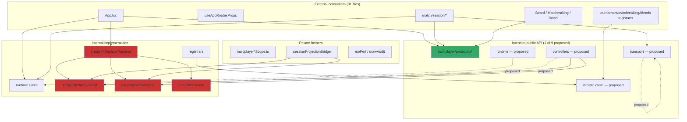

# Multiplayer Public API Audit — Phase T Report

**Date:** 2026-07-06  
**Scope:** `client/src/multiplayer` — Staff/Principal Engineer API boundary audit  
**Role:** Principal Multiplayer Engineer — Production Certification  
**Status:** **READY WITH NOTES** — architecture frozen; public API surface not yet frozen

---

## Executive Summary

Phase T is a **read-only architectural audit**. No gameplay, networking, RecoveryMachine, Projection, Session FSM, Runtime Composition, or protocol behavior was changed. No files were moved. No barrels were implemented.

### Key Findings

| Metric | Value |
|--------|-------|
| Total TypeScript modules in `multiplayer/` | **114** (91 production, 23 test/behavior) |
| Intentional public barrels | **1** (`protocol/index.ts`) |
| External consumer files (outside `multiplayer/`) | **31** |
| Distinct multiplayer paths imported externally | **50** |
| External imports via `protocol` barrel | **12** (correct pattern) |
| External deep imports bypassing barrels | **~87** |
| Phase Q invariant checks | **11/11 PASS** |
| Depcruise arch violations | **0** |
| Depcruise cycle violations | **0** |
| Layer reverse-dependencies (enforced) | **0** |
| Layer reverse-dependencies (documented adapters) | **1** (`session/useSessionState` → `runtimeProvider`) |

### Certification Outcome

**READY WITH NOTES**

The frozen multiplayer **architecture** is production-certified (Phases P–S + Phase Q enforcement). The multiplayer **public API** is not yet frozen: engineers can import any of 50 internal implementation paths from 31 external files. Only `multiplayer/protocol` demonstrates the intended entry-point pattern.

**Recommendation:** Freeze architecture now; schedule a follow-up **Phase U** to add barrel entry points and CI import-boundary rules **without** redesigning subsystems.

---

## Table of Contents

1. [Audit Scope and Hard Rules](#1-audit-scope-and-hard-rules)
2. [Files Inspected](#2-files-inspected)
3. [Multiplayer Public API Audit](#3-multiplayer-public-api-audit)
4. [Directory-by-Directory Classification](#4-directory-by-directory-classification)
5. [API Leak Report](#5-api-leak-report)
6. [Dependency Layer Report](#6-dependency-layer-report)
7. [Import Stability Audit](#7-import-stability-audit)
8. [Layer Boundary Audit](#8-layer-boundary-audit)
9. [Coupling Audit](#9-coupling-audit)
10. [Extension Point Analysis](#10-extension-point-analysis)
11. [Package Boundary Recommendations](#11-package-boundary-recommendations)
12. [CI Enforcement Opportunities](#12-ci-enforcement-opportunities)
13. [Five-Year Maintainability Review](#13-five-year-maintainability-review)
14. [Principal Engineer Certification](#14-principal-engineer-certification)
15. [Verification Log](#15-verification-log)

---

## 1. Audit Scope and Hard Rules

### 1.1 Objective

Treat `client/src/multiplayer` as a production platform that dozens of engineers will build on for five years. Determine whether the package exposes a **clean public API** or whether engineers can accidentally import internal implementation files.

### 1.2 Frozen Subsystems (Not Redesigned)

| Phase | Subsystem | Status |
|-------|-----------|--------|
| P | Runtime composition (`createMultiplayerRuntime`) | FROZEN |
| Q | Architectural invariant enforcement | FROZEN |
| R | Matchmaking socket registrar | FROZEN |
| S | Friends registrar + zero grandfather socket ownership | FROZEN |
| — | RecoveryMachine | FROZEN |
| — | Projection | FROZEN |
| — | Session FSM | FROZEN |
| — | Socket registry | FROZEN |

### 1.3 Hard Rules Compliance

| Rule | Compliance |
|------|------------|
| No architecture redesign | ✅ Audit only |
| No gameplay changes | ✅ No code changes |
| No networking changes | ✅ No code changes |
| No RecoveryMachine changes | ✅ No code changes |
| No Projection changes | ✅ No code changes |
| No Session FSM changes | ✅ No code changes |
| No Runtime Composition changes | ✅ No code changes |
| No protocol changes | ✅ No code changes |
| No file moves | ✅ Report only |

---

## 2. Files Inspected

All **114** TypeScript/TSX files under `client/src/multiplayer/` were enumerated and classified. Supporting infrastructure inspected:

| Path | Purpose |
|------|---------|
| `client/scripts/checkArchitectureInvariants.ts` | Phase Q master verifier |
| `client/.dependency-cruiser.multiplayer-arch.json` | Layer boundary rules |
| `client/.dependency-cruiser.multiplayer-cycles.json` | Cycle detection |
| `docs/architecture/architecture-manifest.json` | Canonical allowlists |
| `client/src/App.tsx` | Primary external consumer (26 imports) |
| `client/src/match/session/**` | Match layer external consumer (18 files) |
| `client/src/tournament/registerTournamentSocketHandlers.ts` | Bounded-context registrar |
| `client/src/matchmaking/registerMatchmakingSocketHandlers.ts` | Bounded-context registrar |
| `client/src/friends/registerFriendsSocketHandlers.ts` | Bounded-context registrar |

### 2.1 Complete File Inventory

#### Production (91 files)

**UI / Shell (22 `.tsx`)**
- `ActivityFeedLobbyBridge.tsx`, `AppRoutesGamePropsHost.tsx`, `ArenaRings.tsx`
- `DuelOpponentFriendButton.tsx`, `FriendInvitePopupBridge.tsx`, `FriendsScreenLobbyBridge.tsx`
- `IncomingFriendChallengeCard.tsx`, `MultiplayerConnectionHost.tsx`, `MultiplayerDuelIcons.tsx`
- `MultiplayerGameShell.tsx`, `MultiplayerHubFeatureStrip.tsx`, `MultiplayerModeController.tsx`
- `MultiplayerTwoColumnPvLayout.tsx`, `PrivateMatchLobbyControlPanel.tsx`, `PrivateMatchLobbyIcons.tsx`
- `PrivateMatchLobbyMatchupView.tsx`, `PrivateMatchLobbyScreen.tsx`
- `runtime/runtimeProvider.tsx`

**Controllers / Hooks (16)**
- `useFriendChallenge.ts`, `useFriendSocketReachability.ts`, `useJoinAckCoordinator.ts`
- `useMultiplayerConnection.ts`, `useMultiplayerConnectionContext.ts`, `useMultiplayerConnectionHostParams.ts`
- `useMultiplayerLobbyController.ts`, `useMultiplayerLobbyHostProps.ts`, `useMultiplayerPresentation.ts`
- `useMultiplayerResync.ts`, `useMultiplayerRoomActions.ts`, `useMultiplayerShellDelegates.ts`
- `usePrivateMatchLobbyFriends.ts`, `usePrivateMatchLobbyGuestProfile.ts`, `usePrivateMatchLobbyUiState.ts`
- `useRoomSocketSync.ts`

**Registrars (2)**
- `registerMultiplayerConnectionSocketHandlers.ts`
- `registerMultiplayerConnectionGameplaySocketHandlers.ts`

**Infrastructure (7)**
- `socketEventBus.ts`, `socketEventRegistry.ts`, `socketGuards.ts`
- `roomTransport.ts`, `refBox.ts`, `gameplaySocketScope.ts`, `gameplaySocketTypes.ts`

**Recovery (3)**
- `recoveryMachine.ts`, `recoveryConnectionBridge.ts`, `recoveryAuthorityContract.ts`

**Bridges (1)**
- `sessionProjectionBridge.ts`

**Gameplay delegates (1)**
- `connectionGameplaySocketHandlers.ts`

**Policy / Navigation helpers (4)**
- `connectPolicy.ts`, `postGameExit.ts`, `privateLobbyVisibility.ts`, `matchmakingRoomJoin.ts`

**Coordination (1)**
- `joinAckCoordinator.ts`

**Shared utilities (8)**
- `boardSnapshotGuards.ts`, `drawAudit.ts`, `mpPerf.ts`, `handIdentity.ts`
- `friendChallenge.ts`, `legacyTournamentTypes.ts`, `multiplayerGameSnapshot.ts`
- `privateMatchLobbyViewModel.ts`

**Scope factories (3)**
- `multiplayerConnectionScope.ts`, `multiplayerRoomActionsScope.ts`, `multiplayerRoomSyncScope.ts`

**View-model types (2)**
- `multiplayerGameShellTypes.ts`, `privateMatchLobbyScreenTypes.ts`

**Protocol (2)**
- `protocol/index.ts`, `protocol/roomProtocol.ts`

**Runtime (12)**
- `runtime/createMultiplayerRuntime.ts`, `runtime/runtimeComposition.ts`, `runtime/runtimeTypes.ts`
- `runtime/runtimeSelectors.ts`, `runtime/connectionRuntime.ts`, `runtime/roomRuntime.ts`
- `runtime/gameplayRuntime.ts`, `runtime/recoveryRuntime.ts`, `runtime/navigationRuntime.ts`
- `runtime/friendInviteRuntime.ts`, `runtime/tournamentRuntime.ts`

**Session (6)**
- `session/sessionStateMachine.ts`, `session/sessionReducer.ts`, `session/sessionTypes.ts`
- `session/sessionRuntimeTypes.ts`, `session/useSessionState.ts`, `session/useSessionStateTypes.ts`

**Projection (5)**
- `projection/projectStateUpdate.ts`, `projection/projectStateSpectate.ts`
- `projection/projectionTypes.ts`, `projection/projectionGates.ts`, `projection/applyProjectionResult.ts`

#### Test / Behavior (23 files)

- `boardSnapshotGuards.test.ts`, `connectPolicy.test.ts`, `joinAckCoordinator.behaviorTests.ts`
- `matchmakingRoomJoin.test.ts`, `multiplayerResyncContract.behaviorTests.ts`, `multiplayerResyncQueue.behaviorTests.ts`
- `postGameExit.test.ts`, `privateLobbyVisibility.test.ts`, `privateMatchLobbyViewModel.test.ts`
- `protocol/roomProtocol.test.ts`, `recoveryMachine.behaviorTests.ts`, `recoveryMachine.contract.final.behaviorTests.ts`
- `recoveryMachine.production.invariantTests.ts`, `registerMultiplayerConnectionGameplaySocketHandlers.behaviorTests.ts`
- `runtime/runtimeBehaviorTests.ts`, `session/sessionStateMachine.behaviorTests.ts`
- `socketEventBus.behaviorTests.ts`, `socketEventBus.concurrency.behaviorTests.ts`, `socketEventBus.dedup.behaviorTests.ts`
- `socketEventBus.episodeOrdering.behaviorTests.ts`, `socketEventBus.transportReplay.behaviorTests.ts`
- `socketEventRegistry.test.ts`, `socketGuards.test.ts`, `useMultiplayerShellDelegates.test.ts`

---

## 3. Multiplayer Public API Audit

### 3.1 Current State

The multiplayer package has **no root `index.ts`**. Engineers resolve imports via TypeScript path aliases to individual files. The only intentional barrel is:

```1:15:client/src/multiplayer/protocol/index.ts
/**
 * Public multiplayer transport protocol API.
 * Import from here for socket payloads and room identity.
 */
export type {
  RoomEventMeta,
  StateUpdatePayload,
  RoomRecoveryState,
  RoomIdentity,
  RoomPlayer,
  RoomChatEvent,
  RoomEmoteEvent,
} from './roomProtocol';

export { normalizeRoomPlayers } from './roomProtocol';
```

**Observation:** 12 of 12 external protocol imports use `multiplayer/protocol` (barrel). Zero external files import `protocol/roomProtocol.ts` directly. This is the **gold standard** pattern for the rest of the package.

### 3.2 Public vs Internal — Package-Level Summary

| Layer | Intended visibility | Current reality |
|-------|-------------------|-----------------|
| `protocol/` | **Public** (barrel enforced by convention) | ✅ Correct |
| `runtime/` | **Public selectors + provider**; factories internal | ❌ 14 external deep imports |
| `session/` | **Public selectors/types**; reducer/FSM internal | ❌ 3 external deep imports |
| `projection/` | **Internal** (pure transforms) | ✅ No direct external imports |
| `recovery/` | **Public types + factory**; reducer internal | ❌ 1 external deep import |
| Controllers (`use*`) | **Public** for app shell | Mixed — imported directly (expected until barrels) |
| UI (`.tsx`) | **Public** for route composition | Imported directly (expected) |
| Infrastructure | **Registrar extension surface** | ❌ 14 external deep imports to bus/registry/guards |
| Utilities | **Shared read-only helpers** | ❌ 6 external deep imports |

### 3.3 External Consumer Map

| Consumer area | Files | Import count | Primary targets |
|---------------|-------|--------------|-----------------|
| `App.tsx` | 1 | 26 | runtime, session, recovery, transport, controllers, policy |
| `useAppRoutesProps.tsx` | 1 | 8 | controllers, runtime slices, UI hosts |
| `useAppSessionRuntime.ts` | 1 | 3 | runtime provider, selectors, recovery slice |
| `appRouteTypes.ts` | 1 | 3 | friendChallenge, runtime, UI types |
| `AppOverlays.tsx` | 1 | 2 | UI bridge, runtime slice |
| `match/session/**` | 12 | 28 | protocol ✅, transport, runtime slices, session types, guards |
| `match/LiveMatchScreen.tsx` | 1 | 1 | protocol ✅ |
| `components/Board.tsx` | 1 | 1 | boardSnapshotGuards (leak) |
| `components/RoomReactions.tsx` | 1 | 1 | protocol ✅ |
| `analyzer/**` | 2 | 2 | boardSnapshotGuards (leak) |
| `matchmaking/MatchmakingScreen.tsx` | 1 | 5 | UI components (acceptable) |
| `social/ActivityFeedScreen.tsx` | 1 | 3 | friend hooks (acceptable) |
| `tournament/registerTournamentSocketHandlers.ts` | 1 | 3 | infrastructure (extension) |
| `matchmaking/registerMatchmakingSocketHandlers.ts` | 1 | 3 | infrastructure (extension) |
| `friends/registerFriendsSocketHandlers.ts` | 1 | 3 | infrastructure (extension) |
| Bounded-context behavior tests | 3 | 6 | infrastructure (test-only) |

---

## 4. Directory-by-Directory Classification

For each directory: **public**, **internal**, **testing-only**, current bypasses, and barrel recommendation.

### 4.1 `protocol/` (2 production files)

| File | Classification | Rationale |
|------|----------------|-----------|
| `index.ts` | **Stable Public API** | Documented barrel entry point |
| `roomProtocol.ts` | **Internal** | Implementation; must not be imported externally |

**Bypasses:** None detected externally.  
**Barrel:** Exists and is used correctly.  
**Exports to keep public:** All symbols in `index.ts`.

---

### 4.2 `runtime/` (13 files)

| File | Classification | Rationale |
|------|----------------|-----------|
| `createMultiplayerRuntime.ts` | **Internal** (construction) | Singleton; only `App.tsx` may construct (INV-01) |
| `runtimeComposition.ts` | **Internal** | Slice factories; INV-01 restricted |
| `runtimeTypes.ts` | **Stable Public API** (types) | `MultiplayerRuntime`, bootstrap types for app shell |
| `runtimeProvider.tsx` | **Stable Public API** | `MultiplayerRuntimeProvider`, `useMultiplayerRuntime` |
| `runtimeSelectors.ts` | **Stable Public API** | Slice selectors — intended external surface |
| `connectionRuntime.ts` | **Internal** (types leak) | Slice implementation; types imported by `useAppRoutesProps` |
| `roomRuntime.ts` | **Internal** (types leak) | Slice implementation; types imported by match layer |
| `gameplayRuntime.ts` | **Internal** (types leak) | Slice implementation; types imported by match layer |
| `recoveryRuntime.ts` | **Internal** (types leak) | Slice implementation; types imported by match + app session |
| `tournamentRuntime.ts` | **Internal** (types leak) | Slice implementation; 5 match/tournament imports |
| `friendInviteRuntime.ts` | **Internal** (types leak) | Slice implementation; 3 external type imports |
| `navigationRuntime.ts` | **Internal** | No external imports |
| `runtimeBehaviorTests.ts` | **Testing only** | INV-01 allowed construction site |

**Bypasses (14 external imports across 10 paths):**

| Internal path | External consumers |
|---------------|-------------------|
| `runtime/createMultiplayerRuntime.ts` | `App.tsx` |
| `runtime/runtimeProvider.tsx` | `App.tsx`, `useAppSessionRuntime.ts` |
| `runtime/runtimeSelectors.ts` | `App.tsx`, `useAppSessionRuntime.ts` |
| `runtime/runtimeTypes.ts` | `App.tsx` |
| `runtime/connectionRuntime.ts` | `useAppRoutesProps.tsx`, `appRouteTypes.ts` |
| `runtime/roomRuntime.ts` | `useAppRoutesProps.tsx`, `match/session/liveMatchSessionTypes.ts` |
| `runtime/gameplayRuntime.ts` | `match/session/liveMatchSessionTypes.ts`, `roomSocketSyncParams.ts` |
| `runtime/recoveryRuntime.ts` | `useAppSessionRuntime.ts`, `match/session/liveMatchSessionTypes.ts` |
| `runtime/tournamentRuntime.ts` | 5 files in `match/session/tournament/` |
| `runtime/friendInviteRuntime.ts` | `AppOverlays.tsx`, `match/session/*` |

**Recommended barrel:** `multiplayer/runtime/index.ts` — export provider, selectors, runtime types, and **type-only** re-exports of slice interfaces. Do **not** export `createMultiplayerRuntime` or `runtimeComposition`.

---

### 4.3 `session/` (6 production files)

| File | Classification | Rationale |
|------|----------------|-----------|
| `sessionStateMachine.ts` | **Internal** (selectors public) | Pure FSM; INV-02 pure core |
| `sessionReducer.ts` | **Internal** | Pure reduce; never external |
| `sessionTypes.ts` | **Stable Public API** (types) | `SessionEvent`, `SessionSnapshot` for match actions |
| `sessionRuntimeTypes.ts` | **Internal** (types leak) | Adapter typing for controllers |
| `useSessionState.ts` | **Stable Public API** | React adapter (manifest allowlist) |
| `useSessionStateTypes.ts` | **Stable Public API** | Hook result types |

**Bypasses:**

| Internal path | External consumers |
|---------------|-------------------|
| `session/sessionStateMachine.ts` | `App.tsx` (selectors) |
| `session/sessionTypes.ts` | `match/session/actions/useLiveMatchActions.ts` |

**Documented adapter exception:** `useSessionState.ts` imports `runtime/runtimeProvider.tsx` — session React adapter subscribes to runtime-owned machine. Listed in `architecture-manifest.json` adapter allowlist.

**Recommended barrel:** `multiplayer/session/index.ts` — export `useSessionState`, session types, and **read-only selectors** from `sessionStateMachine`. Do **not** export `sessionReducer` or `createSessionStateMachine`.

---

### 4.4 `projection/` (5 production files)

| File | Classification | Rationale |
|------|----------------|-----------|
| `projectStateUpdate.ts` | **Internal** | Pure transform; INV-04 |
| `projectStateSpectate.ts` | **Internal** | Pure transform; INV-04 |
| `projectionTypes.ts` | **Internal** | Pure types |
| `projectionGates.ts` | **Internal** | Episode gating |
| `applyProjectionResult.ts` | **Internal** | React ref bridge; not pure |

**Bypasses:** No direct external imports. Controllers import via `useRoomSocketSync.ts` (orchestration layer).  
**Re-export leak:** `useRoomSocketSync.ts` re-exports projection gate symbols — external code could import gates through the controller without using a projection barrel.

**Recommended barrel:** `multiplayer/projection/index.ts` — **empty for external consumers** or test-only exports. Projection should remain orchestrated through runtime/controller paths.

---

### 4.5 `recovery/` (root-level, 3 production files)

| File | Classification | Rationale |
|------|----------------|-----------|
| `recoveryMachine.ts` | **Mixed** | Factory + types public; `reduceRecovery` internal |
| `recoveryConnectionBridge.ts` | **Internal** | Legacy ref sync |
| `recoveryAuthorityContract.ts` | **Internal** | Contract types for tests |

**Bypasses:**

| Path | External consumers |
|------|-------------------|
| `recoveryMachine.ts` (types) | `App.tsx` |

Controllers (`useMultiplayerConnection`, `useJoinAckCoordinator`, `useMultiplayerResync`) import recovery internally — correct.

**Recommended barrel:** `multiplayer/recovery/index.ts` — export `createRecoveryMachine`, `RecoveryEvent`, `RecoveryMachineSnapshot`, `RecoveryEffect`, utility selectors (`isTerminalJoinError`, `deriveLegacyRoomRecoveryState`). Do **not** export `reduceRecovery` or test reset helpers.

---

### 4.6 Registrars (2 production + 3 bounded-context)

| File | Classification | Rationale |
|------|----------------|-----------|
| `registerMultiplayerConnectionSocketHandlers.ts` | **Internal** | Approved registrar (manifest) |
| `registerMultiplayerConnectionGameplaySocketHandlers.ts` | **Internal** | Approved registrar (manifest) |
| `tournament/registerTournamentSocketHandlers.ts` | **Extension Public API** | Bounded-context pattern |
| `matchmaking/registerMatchmakingSocketHandlers.ts` | **Extension Public API** | Bounded-context pattern |
| `friends/registerFriendsSocketHandlers.ts` | **Extension Public API** | Bounded-context pattern |

**Bypasses:** Bounded-context registrars import `socketEventBus`, `socketEventRegistry`, `socketGuards` directly — intentional extension surface, not yet barrel-wrapped.

**Recommended barrel:** `multiplayer/registrars/index.ts` — document approved registrar list; export infrastructure registration helpers for new bounded contexts.

---

### 4.7 Controllers / Hooks (16 production files)

| File | Classification | Notes |
|------|----------------|-------|
| `useMultiplayerConnection.ts` | **Stable Public API** | Connection orchestration |
| `useRoomSocketSync.ts` | **Stable Public API** | Room sync + projection orchestration |
| `useMultiplayerLobbyController.ts` | **Stable Public API** | Lobby actions host |
| `useJoinAckCoordinator.ts` | **Stable Public API** | Join ACK coordination |
| `useMultiplayerResync.ts` | **Stable Public API** | Resync orchestration |
| `useMultiplayerConnectionContext.ts` | **Stable Public API** | Context bridge types |
| `useMultiplayerConnectionHostParams.ts` | **Internal** | App.tsx wiring |
| `useMultiplayerLobbyHostProps.ts` | **Internal** | App.tsx wiring |
| `useMultiplayerRoomActions.ts` | **Stable Public API** | Room action dispatch |
| `useMultiplayerShellDelegates.ts` | **Stable Public API** | Shell delegate factory |
| `useMultiplayerPresentation.ts` | **Internal** | Shell-internal |
| `useFriendChallenge.ts` | **Stable Public API** | Social feature hook |
| `useFriendSocketReachability.ts` | **Stable Public API** | Social feature hook |
| `usePrivateMatchLobby*.ts` (3) | **Internal** | Private lobby screen only |

**High fan-out controllers (coupling hotspots):**

| File | Outbound deps |
|------|---------------|
| `useRoomSocketSync.ts` | 13 |
| `useMultiplayerConnection.ts` | 10 |
| `useMultiplayerLobbyController.ts` | 10 |

---

### 4.8 UI (22 production `.tsx` + types)

| Classification | Files |
|----------------|-------|
| **Stable Public API** (route-composed) | `MultiplayerGameShell`, `MultiplayerModeController`, `MultiplayerConnectionHost`, `AppRoutesGamePropsHost`, `FriendInvitePopupBridge`, hub/lobby screens |
| **Internal** (feature-local) | `ArenaRings`, `MultiplayerDuelIcons`, `PrivateMatchLobby*` internals |
| **Testing only** | N/A (no test TSX) |

External UI imports from `matchmaking/MatchmakingScreen.tsx` (5 components) are **acceptable** — screen composition, not core architecture leaks.

---

### 4.9 Infrastructure (7 production files)

| File | Classification | Fan-in (internal) |
|------|----------------|-------------------|
| `socketEventBus.ts` | **Extension Public API** | 13 |
| `socketEventRegistry.ts` | **Extension Public API** | 7 |
| `socketGuards.ts` | **Extension Public API** | 6 |
| `roomTransport.ts` | **Stable Public API** | 20 |
| `refBox.ts` | **Internal** | 1 |
| `gameplaySocketScope.ts` | **Internal** | 1 |
| `gameplaySocketTypes.ts` | **Internal** | 4 |

**External leaks to infrastructure:**

| Path | Consumers |
|------|-----------|
| `socketEventBus.ts` | `App.tsx`, 3 bounded-context registrars + 3 behavior tests |
| `socketEventRegistry.ts` | 3 bounded-context registrars + 3 behavior tests |
| `socketGuards.ts` | 3 bounded-context registrars |
| `roomTransport.ts` | `App.tsx`, 5 `match/session` files |

---

### 4.10 Utilities / Policy / Bridges

| File | Classification | External imports |
|------|----------------|------------------|
| `boardSnapshotGuards.ts` | **Stable Public API** (shared) | `Board.tsx`, `analyzer/`, `match/session` |
| `drawAudit.ts` | **Internal** | `match/session/actions` |
| `mpPerf.ts` | **Internal** | `match/session` (2 files) |
| `friendChallenge.ts` | **Stable Public API** | `App.tsx`, `appRouteTypes`, `social/` |
| `connectPolicy.ts` | **Stable Public API** | `App.tsx` |
| `postGameExit.ts` | **Stable Public API** | `App.tsx` |
| `matchmakingRoomJoin.ts` | **Stable Public API** | `App.tsx` |
| `privateLobbyVisibility.ts` | **Stable Public API** | `App.tsx` |
| `sessionProjectionBridge.ts` | **Internal** | None external |
| `multiplayerGameSnapshot.ts` | **Internal** | `App.tsx` only |
| `joinAckCoordinator.ts` | **Internal** | Wrapped by `useJoinAckCoordinator` |

---

## 5. API Leak Report

### 5.1 Definition

An **API leak** is any import from outside `multiplayer/` that reaches an **internal implementation file** instead of an intentional package entry point.

### 5.2 Leak Severity Matrix

| Severity | Description | Count |
|----------|-------------|-------|
| **P0 — Core FSM/Reducer** | Direct import of session reducer, recovery reducer, projection transforms | **0** ✅ |
| **P1 — Runtime construction** | `createMultiplayerRuntime` outside allowlist | **0** ✅ (only `App.tsx`) |
| **P2 — Runtime slice implementation** | Direct slice file imports vs selectors | **14** |
| **P3 — Infrastructure** | Bus/registry/guards without barrel | **14** |
| **P4 — Utility internals** | `drawAudit`, `mpPerf`, `boardSnapshotGuards` | **6** |
| **P5 — Type-only leaks** | Session/recovery types for match layer | **4** |

### 5.3 Complete External Deep-Import Inventory

Sorted by fan-in (descending):

| Target path | External importers | Should import via |
|-------------|-------------------|-------------------|
| `multiplayer/protocol` | 12 files | ✅ `multiplayer/protocol` (correct) |
| `multiplayer/socketEventBus` | 6 | `multiplayer/infrastructure` (proposed) |
| `multiplayer/roomTransport` | 6 | `multiplayer/transport` (proposed) |
| `multiplayer/socketEventRegistry` | 5 | `multiplayer/infrastructure` (proposed) |
| `multiplayer/runtime/tournamentRuntime` | 5 | `multiplayer/runtime` selectors/types |
| `multiplayer/socketGuards` | 3 | `multiplayer/infrastructure` (proposed) |
| `multiplayer/boardSnapshotGuards` | 3 | `multiplayer/shared` (proposed) |
| `multiplayer/runtime/friendInviteRuntime` | 3 | `multiplayer/runtime` |
| `multiplayer/friendChallenge` | 3 | `multiplayer/social` (proposed) |
| `multiplayer/useMultiplayerLobbyController` | 2 | `multiplayer/controllers` (proposed) |
| `multiplayer/runtime/runtimeSelectors` | 2 | `multiplayer/runtime` |
| `multiplayer/runtime/runtimeProvider` | 2 | `multiplayer/runtime` |
| `multiplayer/runtime/connectionRuntime` | 2 | `multiplayer/runtime` |
| `multiplayer/runtime/recoveryRuntime` | 2 | `multiplayer/runtime` |
| `multiplayer/runtime/roomRuntime` | 2 | `multiplayer/runtime` |
| `multiplayer/runtime/gameplayRuntime` | 2 | `multiplayer/runtime` |
| `multiplayer/mpPerf` | 2 | `multiplayer/internal` (proposed) |
| `multiplayer/useRoomSocketSync` | 2 | `multiplayer/controllers` |
| `multiplayer/useMultiplayerConnectionContext` | 2 | `multiplayer/controllers` |
| `multiplayer/MultiplayerModeController` | 2 | `multiplayer/ui` (proposed) |
| 30 additional single-importer paths | 1 each | Various proposed barrels |

### 5.4 Internal Re-Export Leaks

`useRoomSocketSync.ts` re-exports projection gate symbols:

```47:55:client/src/multiplayer/useRoomSocketSync.ts
export {
  nextEpisodeSequenceCursor,
  shouldDropClosedEpisodeProjection,
  shouldDropPreProjectionStateReplay,
  shouldDropStaleEpisodeStateUpdate,
  shouldDropStaleProjectionCommit,
  shouldDropTransportReplayProjection,
  STATE_REPLAY_SILENT_DROP_GAP,
} from './projection/projectionGates';
```

**Risk:** External tests or match code could import projection internals through the controller. **Recommendation:** Move test-only gate exports to a `projection/testing` entry or keep them test-internal.

### 5.5 Good Patterns (No Leak)

| Pattern | Evidence |
|---------|----------|
| Protocol barrel adoption | 100% external protocol imports use barrel |
| No external `sessionReducer` imports | Verified |
| No external `reduceRecovery` imports | Verified |
| No external `projectStateUpdate` imports | Verified |
| No external `createMultiplayerRuntime` outside `App.tsx` | INV-01 PASS |
| Projection purity | INV-04 PASS |

---

## 6. Dependency Layer Report

### 6.1 Ideal Layer Stack

```
UI (.tsx screens, shells)
  ↓
Controllers (use* hooks, joinAck, room sync)
  ↓
Runtime (composition root, selectors, slices)
  ↓
Session (FSM, reducer)
  ↓
Projection (pure transforms + apply bridge)
  ↓
Recovery (recoveryMachine)
  ↓
Protocol (wire types)
  ↓
Infrastructure (socketEventBus, roomTransport, registry)
```

### 6.2 Enforced vs Ideal

Phase Q + depcruise enforce a **subset** of the ideal stack:

| Rule | Enforced by | Status |
|------|-------------|--------|
| Protocol isolated from runtime/UI | depcruise `mp-protocol-isolated` | ✅ PASS |
| Runtime may not reach controllers/UI | depcruise + INV-06 | ✅ PASS |
| Protocol/runtime acyclic | depcruise | ✅ PASS |
| Session purity (no projection/recovery/react in core) | INV-02 | ✅ PASS |
| Projection purity (no session mutation) | INV-04 | ✅ PASS |
| Recovery isolation (no projection/gameplay) | INV-05 | ✅ PASS |
| Full UI→…→Protocol stack on all files | Not enforced | ⚠️ Gap |
| External import boundary (barrels) | Not enforced | ⚠️ Gap |

### 6.3 Dependency Graph — External Consumers



### 6.4 Dependency Graph — Internal Fan-In (Top 15)

Modules most depended upon **within** `multiplayer/`:

| Fan-in | Module | Role |
|--------|--------|------|
| 24 | `protocol/index.ts` + `roomProtocol.ts` | Wire types |
| 20 | `roomTransport.ts` | Emit/ack transport |
| 13 | `runtime/roomRuntime.ts` | Room slice |
| 13 | `socketEventBus.ts` | Event normalization |
| 11 | `session/sessionTypes.ts` | Session events |
| 10 | `runtime/connectionRuntime.ts` | Connection slice |
| 9 | `session/sessionStateMachine.ts` | FSM + selectors |
| 9 | `recoveryMachine.ts` | Recovery authority |
| 8 | `runtime/friendInviteRuntime.ts` | Social slice |
| 8 | `friendChallenge.ts` | Challenge types/API |
| 8 | `runtime/recoveryRuntime.ts` | Recovery slice |
| 8 | `runtime/navigationRuntime.ts` | Navigation slice |
| 7 | `runtime/gameplayRuntime.ts` | Gameplay refs slice |
| 7 | `socketEventRegistry.ts` | Event ownership |
| 6 | `socketGuards.ts` | Handler wrapping |

### 6.5 Dependency Graph — Internal Fan-Out (Top 10)

Modules with highest outbound coupling:

| Fan-out | Module | Risk |
|---------|--------|------|
| 13 | `useRoomSocketSync.ts` | Orchestration god-hook |
| 10 | `useMultiplayerConnection.ts` | Connection god-hook |
| 10 | `useMultiplayerLobbyController.ts` | Lobby god-hook |
| 9 | `MultiplayerGameShell.tsx` | UI composition hub |
| 9 | `registerMultiplayerConnectionSocketHandlers.ts` | Registrar hub |
| 9 | `runtime/runtimeComposition.ts` | Composition hub (expected) |
| 9 | `runtime/runtimeTypes.ts` | Type aggregation (expected) |
| 8 | `runtime/runtimeSelectors.ts` | Selector hub (expected) |
| 7 | `joinAckCoordinator.ts` | Join flight coordination |
| 6 | `projection/applyProjectionResult.ts` | Apply bridge |

---

## 7. Import Stability Audit

### 7.1 Classification Legend

| Tag | Meaning |
|-----|---------|
| **S** | Stable Public API — safe for external import; semver-protected when frozen |
| **I** | Internal — must not be imported outside `multiplayer/` |
| **T** | Testing only — test helpers, reset functions |
| **D** | Deprecated — scheduled for removal |
| **F** | Future candidate — may become public after barrel addition |

### 7.2 Protocol Exports

| Symbol | Classification |
|--------|----------------|
| `RoomEventMeta` | **S** |
| `StateUpdatePayload` | **S** |
| `RoomRecoveryState` | **S** |
| `RoomIdentity` | **S** |
| `RoomPlayer` | **S** |
| `RoomChatEvent` | **S** |
| `RoomEmoteEvent` | **S** |
| `normalizeRoomPlayers` | **S** |

### 7.3 Runtime Exports

| Symbol | Classification |
|--------|----------------|
| `createMultiplayerRuntime` | **I** (App.tsx only via INV-01) |
| `resetMultiplayerRuntimeSingletonForTests` | **T** |
| `MultiplayerRuntimeProvider` | **S** |
| `useMultiplayerRuntime` | **S** |
| `useMultiplayerSessionState` | **S** |
| `select*Runtime` (11 selectors) | **S** |
| `selectLegacyAppSessionRuntime` | **S** (compat; **F** for deprecation review) |
| `MultiplayerRuntime` | **S** |
| `MultiplayerRuntimeBootstrap` | **S** |
| `create*Runtime` in `runtimeComposition.ts` | **I** |
| Slice interfaces (`MultiplayerRoomRuntime`, etc.) | **F** → should be **S** via runtime barrel |

### 7.4 Session Exports

| Symbol | Classification |
|--------|----------------|
| `createSessionStateMachine` | **I** |
| `reduceSession` | **I** |
| `SessionEvent` | **S** |
| `SessionSnapshot` | **S** |
| `INITIAL_SESSION_SNAPSHOT` | **S** |
| `selectJoinedRoomCode` | **S** |
| `selectMatchStarted` | **S** |
| `selectIntentionalDisconnect` | **S** |
| `useSessionState` | **S** |

### 7.5 Recovery Exports

| Symbol | Classification |
|--------|----------------|
| `createRecoveryMachine` | **S** |
| `RecoveryEvent` | **S** |
| `RecoveryMachineSnapshot` | **S** |
| `RecoveryEffect` | **S** |
| `RecoveryMachine` | **S** |
| `isTerminalJoinError` | **S** |
| `deriveLegacyRoomRecoveryState` | **S** |
| `reduceRecovery` | **I** |
| `resetRecoveryConcurrencyStateForTests` | **T** |
| `formatRecoveryLog` | **I** (debug) |

### 7.6 Infrastructure Exports

| Symbol | Classification |
|--------|----------------|
| `registerRawSocketEventHandler` | **F** (registrar extension) |
| `registerNormalizedSocketRouter` | **F** (registrar extension) |
| `dispatchSocketEvent` | **I** |
| `wrapSocketHandler` | **F** (registrar extension) |
| `SOCKET_EVENTS` | **F** (registrar extension) |
| `APPROVED_SOCKET_REGISTRAR_FILES` | **S** (documentation/CI) |
| `emitWithAck`, `emitRoomJoin`, etc. | **S** |
| `RoomAckResponse` | **S** |

### 7.7 Projection Exports

| Symbol | Classification |
|--------|----------------|
| `projectStateUpdate` | **I** |
| `projectStateSpectate` | **I** |
| `projectionGates.*` | **I** (re-export via controller is leak) |
| `applyProjectionResult.*` | **I** |
| `SessionRefProjection` | **I** |

### 7.8 Controller Exports (selected)

| Symbol | Classification |
|--------|----------------|
| `useMultiplayerConnection` | **S** |
| `useRoomSocketSync` | **S** |
| `UseRoomSocketSyncParams` | **S** |
| `useMultiplayerLobbyController` | **S** |
| `useJoinAckCoordinator` | **S** |
| `useMultiplayerResync` | **S** |
| `useMultiplayerShellDelegates` | **S** |
| `useMultiplayerConnectionHostParams` | **I** |

### 7.9 Deprecated / Future Candidates

| Symbol | Tag | Notes |
|--------|-----|-------|
| `selectLegacyAppSessionRuntime` | **F** | Compat shim for `useAppSessionRuntime`; document migration to selectors |
| `legacyTournamentTypes.ts` | **D** | Filename signals legacy; audit before Tournaments V2 |
| `LegacyRoomRecoveryState` | **F** | Bridge type; may consolidate with protocol `RoomRecoveryState` |

---

## 8. Layer Boundary Audit

### 8.1 Enforced Reverse-Dependency Check

Phase Q INV-06 + depcruise scan for:

- Runtime importing controllers/UI
- Protocol importing runtime
- Session core importing projection/recovery
- Recovery importing projection/gameplay
- Projection transforms mutating session

**Result: No enforced violations. CI 11/11 PASS.**

### 8.2 Documented Exceptions (Not Violations)

| From | To | Reason | Manifest |
|------|-----|--------|----------|
| `session/useSessionState.ts` | `runtime/runtimeProvider.tsx` | React adapter subscribes to runtime-owned FSM | `session.adapterAllowlist` |
| `sessionProjectionBridge.ts` | `projection/` + `session/` | Orchestration bridge **outside** both layers | Lives at package root (INV-02) |
| Controllers | `projection/`, `session/`, `recovery/` | Controllers orchestrate frozen subsystems | By design |
| Bounded-context registrars | `socketEventBus`, `socketEventRegistry` | Extension point for new domains | Phase R/S pattern |

### 8.3 Ideal-Stack Gaps (Not CI Violations Today)

| Gap | Description | Risk |
|-----|-------------|------|
| External → runtime slice files | Match layer bypasses selectors | Medium — coupling to slice layout |
| External → infrastructure | Registrars bypass barrel | Low — documented extension pattern |
| `useRoomSocketSync` → projection direct | Controller reaches transforms | Low — orchestration ownership |
| No `multiplayer/index.ts` | No package-level discoverability | High — API drift over 5 years |

### 8.4 Cross-Package Boundary Summary

**Explicit certification:** No illegal reverse dependencies exist in the **enforced** layer rules. One documented adapter exception exists for session React subscription. External consumers routinely bypass intended entry points — that is an **API packaging gap**, not a layer cycle.

---

## 9. Coupling Audit

### 9.1 God Modules (Ranked)

| Rank | Module | Fan-in | Fan-out | Concern |
|------|--------|--------|---------|---------|
| 1 | `socketEventBus.ts` | 13+ | 2 | Global mutable router; all ingress |
| 2 | `roomTransport.ts` | 20 | 0 | Transport surface area |
| 3 | `useRoomSocketSync.ts` | 6 | 13 | Orchestrates projection + session + bus |
| 4 | `useMultiplayerConnection.ts` | 4 | 10 | Socket lifecycle + recovery + registrars |
| 5 | `recoveryMachine.ts` | 9+ | 2 | Authority concentrator |
| 6 | `runtime/roomRuntime.ts` | 13 | 4 | Largest runtime slice |
| 7 | `registerMultiplayerConnectionSocketHandlers.ts` | 2 | 9 | Connection ingress hub |

### 9.2 Shared Mutable State Hotspots

| State | Location | Consumers |
|-------|----------|-----------|
| `activeRuntime` singleton | `createMultiplayerRuntime.ts` | INV-08 guarded |
| `normalizedRouter`, `rawHandlers` | `socketEventBus.ts` | All registrars |
| `gameplaySocketScopeRef` | `gameplaySocketScope.ts` | Gameplay registrar |
| `recoveryMachineRef` | `useMultiplayerConnection.ts` | Connection controller |
| Scope refs (`multiplayer*Scope`) | `*Scope.ts` files | Controller orchestration |

**Risk:** Global bus state is intentional for socket ingress but requires registrar discipline (now CI-enforced with zero grandfather).

### 9.3 Cyclic Dependency Risk

| Check | Result |
|-------|--------|
| depcruise `check:multiplayer-cycles` | ✅ 0 violations (857 modules) |
| protocol ↔ runtime | ✅ Acyclic (enforced) |
| session ↔ projection | ✅ No cycle (bridge at root) |
| recovery ↔ session | ✅ No cycle (selectors only) |

### 9.4 Cross-Context Helpers

| Helper | Contexts touched | Assessment |
|--------|------------------|------------|
| `sessionProjectionBridge.ts` | projection + session | Acceptable bridge |
| `recoveryConnectionBridge.ts` | recovery + legacy refs | Acceptable bridge |
| `boardSnapshotGuards.ts` | game state + UI render | Shared utility — candidate for `game/` package |
| `friendChallenge.ts` | social + multiplayer | Acceptable cross-feature API |

---

## 10. Extension Point Analysis

### 10.1 Future Feature Simulation

| Feature | Natural fit? | Extension points | Gaps |
|---------|--------------|------------------|------|
| **Spectator Chat** | ✅ High | `RoomChatEvent` in protocol; `projectStateSpectate.ts`; `RoomReactions.tsx` | Add spectator bounded context + registrar entry in `APPROVED_SOCKET_REGISTRAR_FILES` |
| **Voice Chat** | ⚠️ Medium | Registrar pattern; `socketEventRegistry` bounded contexts | No media transport layer; would need new infrastructure module + public barrel |
| **Clubs** | ⚠️ Medium | `social` bounded context; `friendChallenge` pattern | No club entity in protocol; needs protocol barrel extension |
| **Guilds** | ⚠️ Medium | Same as clubs | Same protocol gap |
| **Tournaments V2** | ✅ High | `tournament/registerTournamentSocketHandlers.ts`; `runtime/tournamentRuntime.ts`; `TournamentAttachRuntime` | `legacyTournamentTypes.ts` should be documented/deprecated |
| **Daily Events** | ⚠️ Medium | New bounded context registrar | No event scheduler integration point documented |
| **Friends Presence V2** | ✅ High | `friends/registerFriendsSocketHandlers.ts`; `useFriendSocketReachability.ts` | Document presence event ownership in registry |
| **Cross-device resume** | ✅ High | `recoveryMachine.ts`; session FSM; `RecoveryPolicy` | Document resume handshake in protocol barrel |

### 10.2 Extension Points to Document (Phase U)

1. **New bounded context registrar checklist** — copy `friends/registerFriendsSocketHandlers.ts` pattern; register in `SOCKET_EVENT_REGISTRY` + `APPROVED_SOCKET_REGISTRAR_FILES`.
2. **Runtime slice addition** — only via `runtimeComposition.ts` (INV-01).
3. **Protocol evolution** — add types to `roomProtocol.ts`, export through `protocol/index.ts` only.
4. **Projection addition** — pure transform in `projection/`, wire through `useRoomSocketSync` or runtime projection slice.
5. **Session event addition** — extend `SessionEvent` union + reducer + FSM transitions; never import from projection in session core.

### 10.3 Architecture Support Score

| Dimension | Score (1–5) | Notes |
|-----------|-------------|-------|
| Registrar extensibility | 5 | Zero grandfather; proven R/S pattern |
| Protocol extensibility | 4 | Barrel exists; needs versioning policy |
| Runtime extensibility | 4 | Composition root clear; slices typed |
| Public API discoverability | 2 | No root barrel |
| Cross-team import safety | 2 | 50 deep import paths open |

---

## 11. Package Boundary Recommendations

**Design only — not implemented in Phase T.**

### 11.1 Proposed Entry Points

#### `multiplayer/index.ts` (app shell)

```typescript
// Re-export curated surface for App.tsx and route composition
export { MultiplayerRuntimeProvider, useMultiplayerRuntime } from './runtime';
export { createMultiplayerRuntime } from './runtime'; // @internal-construction App.tsx only — CI allowlist
export * from './protocol';
export { useMultiplayerConnection, useRoomSocketSync, useMultiplayerLobbyController } from './controllers';
export { MultiplayerGameShell, MultiplayerModeController } from './ui';
export { shouldAutoConnectForMode } from './policy/connectPolicy';
```

#### `multiplayer/runtime/index.ts`

```typescript
export { MultiplayerRuntimeProvider, useMultiplayerRuntime, useMultiplayerSessionState } from './runtimeProvider';
export { selectSessionRuntime, selectRoomRuntime, selectGameplayRuntime, /* ... */ } from './runtimeSelectors';
export type { MultiplayerRuntime, MultiplayerRuntimeBootstrap } from './runtimeTypes';
export type { MultiplayerRoomRuntime, MultiplayerGameplayRefsRuntime, TournamentAttachRuntime } from './slices'; // type-only aggregation file
// DO NOT export: createMultiplayerRuntime, runtimeComposition, slice factories
```

#### `multiplayer/session/index.ts`

```typescript
export { useSessionState } from './useSessionState';
export type { SessionEvent, SessionSnapshot } from './sessionTypes';
export { selectJoinedRoomCode, selectMatchStarted, selectIntentionalDisconnect } from './sessionStateMachine';
// DO NOT export: sessionReducer, createSessionStateMachine
```

#### `multiplayer/projection/index.ts`

```typescript
// Empty for external consumers OR @internal namespace only
// Transforms accessed via runtime/controller orchestration
```

#### `multiplayer/recovery/index.ts`

```typescript
export { createRecoveryMachine, isTerminalJoinError, deriveLegacyRoomRecoveryState } from './recoveryMachine';
export type { RecoveryEvent, RecoveryMachineSnapshot, RecoveryEffect, RecoveryMachine } from './recoveryMachine';
// DO NOT export: reduceRecovery, test resets
```

#### `multiplayer/transport/index.ts`

```typescript
export { emitWithAck, emitRoomJoin, emitRoomLeave, emitGameAction, /* ... */ } from '../roomTransport';
export type { RoomAckResponse, GameActionPayload, SocketEmitter } from '../roomTransport';
```

#### `multiplayer/infrastructure/index.ts`

```typescript
export { registerRawSocketEventHandler, registerNormalizedSocketRouter, wrapSocketHandler } from './socketRegistrarApi'; // thin facade
export { SOCKET_EVENTS, APPROVED_SOCKET_REGISTRAR_FILES } from './socketEventRegistry';
// DO NOT export: dispatchSocketEvent (internal dispatch)
```

#### `multiplayer/controllers/index.ts`

```typescript
export { useMultiplayerConnection, useRoomSocketSync, useMultiplayerLobbyController, useJoinAckCoordinator, useMultiplayerResync } from './...';
```

#### `multiplayer/shared/index.ts`

```typescript
export { isRenderableNonNullBoard, projectRenderableBoard } from './boardSnapshotGuards';
export type { OutboundChallenge } from './friendChallenge';
```

### 11.2 Import Migration Priority

| Priority | From | To | Files affected |
|----------|------|-----|----------------|
| P0 | `runtime/createMultiplayerRuntime` | `multiplayer/runtime` with CI allowlist | 1 |
| P1 | `runtime/*Runtime` slices | `multiplayer/runtime` type exports | 14 |
| P1 | `roomTransport` | `multiplayer/transport` | 6 |
| P2 | `socketEventBus/Registry/Guards` | `multiplayer/infrastructure` | 14 |
| P2 | `session/sessionTypes` | `multiplayer/session` | 3 |
| P3 | `boardSnapshotGuards` | `multiplayer/shared` | 3 |

### 11.3 Private Module Convention

Recommend marking internal files with a leading comment block:

```typescript
/** @module internal — import only from multiplayer/<barrel> */
```

CI would reject `@module internal` imports from outside `multiplayer/`.

---

## 12. CI Enforcement Opportunities

**Recommendations only — no implementation in Phase T.**

| Check ID | Description | Mechanism | Effort |
|----------|-------------|-----------|--------|
| CI-T01 | Forbid deep imports from outside `multiplayer/` | depcruise: external → `multiplayer/*/` except approved barrels | Medium |
| CI-T02 | Barrel enforcement | Only `multiplayer/protocol`, `multiplayer/runtime`, etc. importable externally | Medium |
| CI-T03 | `@internal` tag enforcement | Custom script: fail if external imports file with `@module internal` | Low |
| CI-T04 | Orphan module detection | depcruise orphans on `src/multiplayer` | Low |
| CI-T05 | Unused export detection | `ts-prune` or knip on multiplayer barrels | Medium |
| CI-T06 | Duplicate export detection | Lint: same symbol exported from multiple barrels | Low |
| CI-T07 | Layer ownership tags | Manifest extends with `layer: protocol|runtime|...` per file | Medium |
| CI-T08 | Registrar allowlist drift | Already covered by INV-03/INV-07 | ✅ Done |
| CI-T09 | Dead API detection | Symbols exported but never imported externally | Medium |
| CI-T10 | Public API manifest | `docs/architecture/multiplayer-public-api.json` listing **S** symbols; CI diff check | Medium |

### 12.1 Suggested depcruise Rule (CI-T01)

```json
{
  "name": "mp-external-barrel-only",
  "comment": "External code may only import multiplayer barrel entry points",
  "from": { "pathNot": "^src/multiplayer/" },
  "to": {
    "path": "^src/multiplayer/",
    "pathNot": "^src/multiplayer/(index|protocol|runtime|session|transport|infrastructure|controllers|shared|ui)/index\\.ts$"
  }
}
```

**Grandfather period:** Phase U would add barrels first, then enable rule with codemod.

---

## 13. Five-Year Maintainability Review

### 13.1 Strengths

1. **Frozen core with CI teeth** — 11 invariant checks prevent architectural regression.
2. **Proven registrar extension model** — tournament, matchmaking, friends migrated without grandfather debt.
3. **Protocol barrel precedent** — demonstrates team can adopt entry-point discipline.
4. **Pure session/projection/recovery cores** — testable, documented, manifest-backed.
5. **Zero socket grandfather** — no hidden ingress paths.
6. **Runtime composition singleton** — clear ownership for new engineers.

### 13.2 Risks (5-year horizon)

| Risk | Likelihood | Impact | Mitigation |
|------|------------|--------|------------|
| Deep import proliferation | High | High | Phase U barrels + CI-T01 |
| `useRoomSocketSync` growth | Medium | High | Document as sole projection orchestrator; resist feature creep |
| `selectLegacyAppSessionRuntime` permanence | Medium | Medium | Document migration path |
| `legacyTournamentTypes` confusion | Medium | Medium | Deprecation ADR before Tournaments V2 |
| External match layer coupling to runtime slices | High | Medium | Export slice types via runtime barrel only |
| New engineer imports `sessionReducer` | Low | Critical | CI-T02 (already pure; add import ban) |

### 13.3 Onboarding Guidance (Until Phase U)

New engineers should:

1. Import wire types from `multiplayer/protocol` only.
2. Import runtime via `runtimeProvider` + `runtimeSelectors` (knowing this is not yet barrel-enforced).
3. Never import `sessionReducer`, `reduceRecovery`, or `projectState*`.
4. Copy bounded-context registrar pattern for new socket domains.
5. Run `npm run check:architecture` before every PR.

---

## 14. Principal Engineer Certification

### 14.1 Audit Performed

| Audit | Status |
|-------|--------|
| Multiplayer Public API Audit | ✅ Complete |
| API Leak Report | ✅ 50 external targets catalogued |
| Dependency Layer Report | ✅ Graphs + fan-in/out metrics |
| Import Stability Audit | ✅ Classification tables |
| Layer Boundary Audit | ✅ 0 enforced violations |
| Coupling Audit | ✅ Hotspots ranked |
| Extension Point Analysis | ✅ 8 features simulated |
| Package Boundary Recommendations | ✅ 9 barrels designed |
| CI Enforcement Opportunities | ✅ 10 checks proposed |
| Five-Year Maintainability Review | ✅ Complete |

### 14.2 Public API Freeze Recommendation

## **READY WITH NOTES**

| Criterion | Assessment |
|-----------|------------|
| Architecture frozen and CI-certified | ✅ 11/11 PASS |
| Gameplay/networking unchanged | ✅ Audit only |
| Single intentional barrel | ⚠️ Only `protocol/` |
| External deep import surface | ⚠️ 50 paths open |
| Layer cycles | ✅ None |
| Extension points documented | ⚠️ Need Phase U docs |
| Five-year import safety | ❌ Not ready without barrels |

**Interpretation:**

- **Freeze the architecture now** — Phases P–S + Q enforcement are production-grade.
- **Do not freeze the public API yet** — engineers can still couple to 49 non-barrel paths.
- **Phase U (recommended next)** — add barrels + CI-T01/T02 without moving or redesigning frozen subsystems.

### 14.3 Certification Statement

> As Principal Multiplayer Engineer, I certify that `client/src/multiplayer` has a **production-certified internal architecture** with **incomplete public API packaging**. The subsystem is safe to operate in production today but requires Phase U entry-point work before declaring an API freeze suitable for a 50-engineer platform.

---

## 15. Verification Log

Commands executed during Phase T (read-only):

```bash
# File inventory
find client/src/multiplayer -type f \( -name '*.ts' -o -name '*.tsx' \) | wc -l
# → 114

# Architecture certification (Phase Q)
npm run check:architecture --prefix client
# → 11/11 PASS, CERTIFIED

# Depcruise boundaries
npx depcruise src --config .dependency-cruiser.multiplayer-arch.json
# → no violations (179 modules in focus)

# Depcruise cycles
npx depcruise src --config .dependency-cruiser.multiplayer-cycles.json
# → no violations (857 modules)

# External import analysis
# → Node script scanning 31 external consumer files, 50 distinct targets

# Internal fan-in/fan-out
# → Node script on 114 multiplayer modules
```

### Captured CI Output (2026-07-06)

```
CERTIFIED — 11/11 invariant checks passed.
Architecture enforcement active; regressions will fail CI before production.

Metrics:
  INV-07: enforcedRawEvents=34, grandfatheredDirectSocketOn=0, approvedRegistrarFiles=9
  INV-01: createMultiplayerRuntimeCallSites=3, allowedConstructionSites=2
```

---

## Files Changed

| File | Change |
|------|--------|
| `docs/architecture/multiplayer-public-api-phase-t-report.md` | **Created** — Phase T audit report |

No production code, tests, CI config, or architecture enforcement was modified.

---

## Remaining Risks / Gaps

1. **No barrel layer** — primary maintainability gap for five-year scale.
2. **14 external runtime slice imports** — coupling to slice file layout.
3. **`useRoomSocketSync` projection re-exports** — indirect projection API leak.
4. **Ideal full-layer stack not depcruise-enforced** — only subset enforced.
5. **Phase U required** before declaring public API freeze.

---

*End of Phase T — Multiplayer Public API Audit*