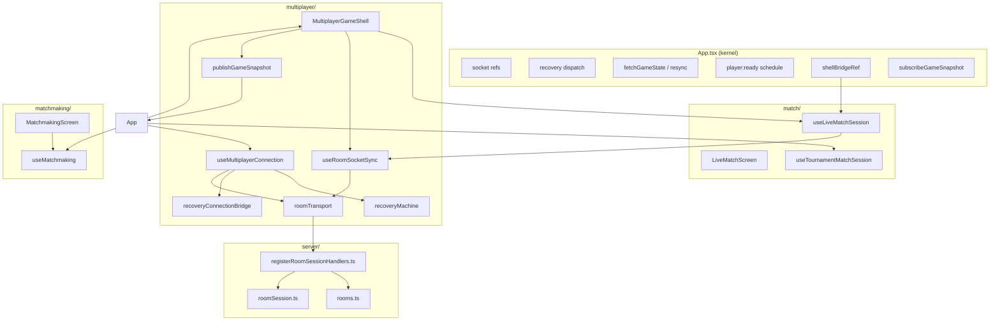

# Player vs Player — Architecture Audit (Phase 1)

**Document type:** Principal engineer architectural audit  
**Date:** 2026-07-04  
**Scope:** Live multiplayer / PvP — client `multiplayer/`, `match/session/`, `matchmaking/`, `match/LiveMatchScreen`, `App.tsx` multiplayer wiring; server `multiplayer/`, `rooms.ts`, `matchmaking/`  
**Stance:** Assume architecture may be wrong; find structural problems before they become expensive  
**Not in scope:** Formatting, naming, cosmetic style, file size alone

---

## Executive Summary

Player vs Player is **production-viable** with **strong server-side authority and test coverage**, but the **client architecture is not complete**. Unlike Bot Match (which achieved a thin composition root), PvP still centers on **`App.tsx` (~1,589 LOC) as an integration kernel** with nine documented `ENTANGLEMENT` coupling points, a **~1,100 LOC session hook** (`useLiveMatchSession`), and a **three-path state read model** (React state → `stateRef` → `multiplayerGameSnapshot`).

**What is genuinely well-designed:**

- Server-authoritative gameplay (`server/src/rooms.ts`, `roomSession.ts`)
- `recoveryMachine.ts` — explicit state machine with behavior tests
- `socketGuards.ts` — sequence watermarking and handler error recovery
- `roomTransport.ts` — centralized ack-based emits
- Extensive **server** multiplayer tests (abandon, private room, forced draw, hand-ready lock, state payload audit, hand masking)
- Documented multiplayer recovery skill (`docs/agent-skills/multiplayer-socket-recovery.md`)
- No client-side optimistic board mutation on play — actions wait for server `state:update`

**What is structurally risky:**

- `App.tsx` owns socket lifecycle, recovery dispatch, resync, `fetchGameState`, player:ready scheduling, tournament attach wiring, and shell bridging
- `useLiveMatchSession` owns gameplay actions, animation staging, rematch, move-log append, and derived UI in one hook
- Thin **client** test surface for socket sync (vs rich server tests)
- Indirect resync path (`fetchGameState` → `RESYNC_NEEDED`) can no-op when recovery machine is not `idle`

**Verdict:** PvP is **not architecturally complete**. Additional phases **may be justified**, but only as **targeted entanglement extractions** (documented E2–E11 in `App.tsx`) — **not** file splitting, new abstraction layers, or event buses.

---

## Architecture Overview

### Layer model (as implemented)

```
┌─────────────────────────────────────────────────────────────────┐
│  App.tsx — integration kernel (socket, recovery, resync,       │
│            tournament attach, shell bridge, route flags)        │
├─────────────────────────────────────────────────────────────────┤
│  MultiplayerModeController / MatchmakingScreen /                │
│  PrivateMatchLobbyScreen — hub & lobby UI                       │
├─────────────────────────────────────────────────────────────────┤
│  MultiplayerGameShell — wires session + socket sync +           │
│                         presentation + move log + analyzer      │
├─────────────────────────────────────────────────────────────────┤
│  useLiveMatchSession — client gameplay session (state, actions) │
│  useRoomSocketSync   — socket event handlers, forced-draw UX    │
│  useMultiplayerConnection — socket connect, recovery machine    │
├─────────────────────────────────────────────────────────────────┤
│  roomTransport.ts — emit/ack API                                │
│  recoveryMachine.ts — reconnect/resync FSM                    │
│  socketGuards.ts — sequence + handler wrap                    │
│  multiplayerGameSnapshot.ts — external store for App routes   │
├─────────────────────────────────────────────────────────────────┤
│  LiveMatchScreen.tsx — board/hand/HUD presentation              │
├─────────────────────────────────────────────────────────────────┤
│  Server: rooms.ts + registerRoomSessionHandlers.ts +          │
│          roomSession.ts — authoritative GameState               │
└─────────────────────────────────────────────────────────────────┘
```

### Composition vs Bot Match

| Dimension | Bot Match (post-refactor) | PvP (current) |
|-----------|---------------------------|---------------|
| Composition root | `BotMatchScreen.tsx` (8 LOC) | `App.tsx` (~1,589 LOC) |
| Session hook | Decomposed `modules/*` | `useLiveMatchSession` (~1,099 LOC) |
| Socket/recovery | N/A | Split across App + connection + machine + legacy ref shim |
| Documented debt | Low | Explicit `ENTANGLEMENT E2–E11` markers |

---

## Current Dependency Graph



**Dependency direction (healthy):**

- `LiveMatchScreen` → types, board utils, presentation only
- `useLiveMatchSession` → `roomTransport`, `multiplayer/drawAudit`, `boardSnapshotGuards` (no direct socket.io in session hook for actions — uses injected `socket`)
- `multiplayer/` does not import `bot/` or `modules/match/` runtime

**Dependency direction (stressed):**

- `App.tsx` imports and coordinates 10+ multiplayer subsystems
- `match/session` imports `multiplayer/*` (session depends on transport layer — acceptable)
- `useTournamentMatchSession` imports tournament + multiplayer transport (cross-feature orchestration)

**No circular imports detected** in client PvP trace (`multiplayer` ↔ `match/session` ↔ `App` is acyclic).

---

## Runtime Ownership Map

| Concern | Owner | Authority |
|---------|-------|-----------|
| **Game rules / legality** | `server/src/rooms.ts` | Server only |
| **GameState truth** | Server → `state:update` payload | Server only |
| **Client GameState display** | `useLiveMatchSession` `useState` + `stateRef` | Mirror of server |
| **Legal moves / canDraw** | Server payload → `useRoomSocketSync` → session setters | Server only |
| **Sequence watermark** | `maxSequenceRef` in App, evaluated in `socketGuards` | Client guard |
| **Socket connection** | `useMultiplayerConnection` + `App` socket refs | Shared |
| **Reconnect/resync FSM** | `recoveryMachine` | Client |
| **Resync execution** | `App.fetchGameState('recovery_machine')` | Client |
| **Player:ready / match start** | `App.schedulePlayerReady` + server `matchStarted` flag | Server gate, client emit |
| **Forced-draw animation** | `useRoomSocketSync` (staging hands, timers) | Cosmetic; server state wins |
| **Draw/pass/play emit** | `useLiveMatchSession` via `roomTransport` | Client intent → server |
| **Rematch** | `useLiveMatchSession` + server rematch handlers | Server |
| **Move log (analyzer)** | `MultiplayerGameShell` local state | Client-side record |
| **Route-level flags** (`hasLiveGameState`, `liveGameOver`) | `multiplayerGameSnapshot` external store | Derived from shell |
| **Tournament attach** | `useTournamentMatchSession` + App wiring | Server + client guards |
| **Matchmaking queue** | `useMatchmaking` + `server/matchmaking/` | Server pairing |
| **Room roster** | Server + `normalizeRoomPlayers` | Server |

### Sources of truth (explicit)

1. **Server `GameState`** — single authority for board, hands (masked), scores, turn, sequence  
2. **Client `useLiveMatchSession` state** — authoritative *for React render*; must be overwritten by every valid `state:update`  
3. **`stateRef`** — synchronous read path for actions/recovery; synced from session state  
4. **`multiplayerGameSnapshot`** — denormalized publish for `App`/`AppRoutes` (flags + route props); **not** a second game engine  
5. **`maxSequenceRef`** — event ordering watermark; not game state  

**Risk:** Three read paths (state, stateRef, snapshot) require bridge sync in `MultiplayerGameShell`. If `gameShellBridgeRef` is null during early mount, `shellSetState` from connection layer is a no-op.

---

## Critical Issues

*None proven to cause data corruption or guaranteed production failure in audit.*

The server authority model and sequence guards are sound. No client optimistic board patching was found on `play`. Critical-class issues would require demonstrated user-facing corruption (e.g. double scoring, rejoin into terminal room after leave) — server tests explicitly guard abandon/terminal paths.

**Closest to Critical (classified High):** indirect resync may silently no-op (H-3).

---

## High Issues

### H-1: `App.tsx` is the multiplayer integration kernel

| Field | Detail |
|-------|--------|
| **Files** | `client/src/App.tsx` (~1,589 LOC) |
| **Why it matters** | Owns socket refs, recovery dispatch, `fetchGameState`, player:ready, tournament session params, shell bridge, localStorage room persistence, quick-match stall watchdog — nine `ENTANGLEMENT E2–E11` comments acknowledge coupling |
| **Production risk** | Any multiplayer change risks unrelated regressions (auth, navigation, tournament, bot match shell). Merge conflicts scale with team size |
| **Recommended fix** | Extract **one concern at a time** into `multiplayer/` (e.g. `useMultiplayerAppHost.ts` or `MultiplayerAppRuntime`) — **not** a big-bang rewrite |
| **Effort** | 2–4 weeks phased (E6 resync, E11 session runtime, E7 matchmaking join first) |
| **Debt vs cosmetic** | **Real engineering debt** — ownership violation |

---

### H-2: `useLiveMatchSession` is a session god hook

| Field | Detail |
|-------|--------|
| **Files** | `client/src/match/session/useLiveMatchSession.ts` (~1,099 LOC) |
| **Why it matters** | Single hook owns: `GameState` state, legal moves, draw/pass/play emits, rematch, hand reveal, draw animation staging refs, move-log append, pending UI action locks, derived board/hand memos, `applyJoinResponseGameState`, resync flush wiring |
| **Production risk** | Turn/action bugs require understanding entire hook; test isolation is hard; animation timer paths intertwined with gameplay guards |
| **Recommended fix** | Extract **only when a bug forces it**: e.g. `useLiveMatchActions` (emit layer), `useLiveMatchDrawPresentation` (animation staging) — keep shared `stateRef` contract |
| **Effort** | 1–2 weeks per extraction; regression test via existing e2e + new integration test |
| **Debt vs cosmetic** | **Real SRP violation** — not merely large domain |

---

### H-3: Indirect `fetchGameState` can no-op while returning success

| Field | Detail |
|-------|--------|
| **Files** | `App.tsx` (`fetchGameState`), `recoveryMachine.ts` (`RESYNC_NEEDED`), `useRoomSocketSync.ts` (callers) |
| **Why it matters** | For `reason !== 'recovery_machine'`, `fetchGameState` dispatches `RESYNC_NEEDED` and returns `true` without joining. `RESYNC_NEEDED` is **ignored** when recovery snapshot `state !== 'idle'` |
| **Production risk** | During reconnect/resync, sequence regression or hand-identity mismatch handlers may believe resync triggered when it was dropped. Partially mitigated by `resyncBufferedUpdateRef` buffering during `resyncInFlight` |
| **Recommended fix** | Queue resync requests when machine busy, or call direct resync path when `resyncInFlight`; add behavior test for “RESYNC_NEEDED while joining” |
| **Effort** | 4–8 hours |
| **Debt vs cosmetic** | **Real correctness hazard** (edge case) |

---

### H-4: Client multiplayer test gap vs server

| Field | Detail |
|-------|--------|
| **Files** | Client: `recoveryMachine.behaviorTests.ts`, `multiplayerRuntime.test.ts` (normalize players only). Server: 15+ multiplayer test files |
| **Why it matters** | Socket handler logic in `useRoomSocketSync` (~723 LOC) has **no** automated client tests. Server `stateUpdatePayloadAudit.test.ts` does not protect client projection/animation |
| **Production risk** | Client-side regressions in forced-draw staging, sequence rejection, spectator guard, pre-game draw apply — ship without CI signal |
| **Recommended fix** | High-value: unit tests for `evaluateSequenceUpdate`, `projectMultiplayerGameState`, forced-draw staging pure functions; one integration test with mocked socket + `useRoomSocketSync` |
| **Effort** | 3–5 days |
| **Debt vs cosmetic** | **Real testing debt** |

---

### H-5: Shell bridge null window

| Field | Detail |
|-------|--------|
| **Files** | `useMultiplayerShellDelegates.ts`, `MultiplayerGameShell.tsx`, `useMultiplayerConnection.ts` |
| **Why it matters** | `shellSetState` forwards to `gameShellBridgeRef.current?.setState` — optional chaining drops updates if shell not mounted |
| **Production risk** | Early-connection state updates before shell mount may be lost; mitigated if connection waits for shell |
| **Recommended fix** | Queue pending state updates until bridge attaches, or document invariant that shell always mounts before join completes |
| **Effort** | 4–8 hours |
| **Debt vs cosmetic** | **Real edge-case risk** |

---

## Medium Issues

### M-1: `MultiplayerGameShell` mixes concerns (~1,037 LOC)

| Field | Detail |
|-------|--------|
| **Files** | `client/src/multiplayer/MultiplayerGameShell.tsx` |
| **Why it matters** | Combines: `useLiveMatchSession`, `useRoomSocketSync`, move log, post-game analyzer, score toasts, hand tile sizing, `publishGameSnapshot`, open-ends assertion |
| **Production risk** | Presentation changes risk analyzer/move-log regressions |
| **Recommended fix** | Extract analyzer + move log to child hook only if touch frequency warrants |
| **Effort** | 2–3 days |
| **Debt vs cosmetic** | Ownership confusion — **not** urgent |

---

### M-2: `useRoomSocketSync` owns socket handlers + forced-draw animation

| Field | Detail |
|-------|--------|
| **Files** | `client/src/multiplayer/useRoomSocketSync.ts` (~723 LOC) |
| **Why it matters** | Network sync and cosmetic draw choreography in one `useEffect` socket subscription block |
| **Production risk** | Animation timer bugs could block or delay authoritative `setState` if ordering wrong — code reviews show careful clearing of `drawSequenceTimeoutRef` |
| **Recommended fix** | Document invariant: “animation never blocks setState”; add test for timeout cleanup on unmount |
| **Effort** | 1 day |
| **Debt vs cosmetic** | **Acceptable domain coupling** unless bugs appear |

---

### M-3: Recovery machine + legacy ref shim

| Field | Detail |
|-------|--------|
| **Files** | `recoveryMachine.ts`, `recoveryConnectionBridge.ts`, `useMultiplayerConnection.ts` |
| **Why it matters** | Two parallel APIs: FSM snapshot + legacy `reconnectShouldJoinRef` / `preventAutoRejoinRef` synced via `syncRecoveryLegacyRefs` |
| **Production risk** | Drift between machine state and refs if shim not updated |
| **Recommended fix** | Migrate consumers off legacy refs incrementally; shim is transitional by design |
| **Effort** | 1 week |
| **Debt vs cosmetic** | **Transitional debt** — machine itself is good |

---

### M-4: `PrivateMatchLobbyScreen` monolith (~1,203 LOC)

| Field | Detail |
|-------|--------|
| **Files** | `client/src/multiplayer/PrivateMatchLobbyScreen.tsx` |
| **Why it matters** | Lobby UI + friends presence + challenge flow + room settings + chat props in one screen |
| **Production risk** | Low for gameplay — UX/maintainability for lobby feature work |
| **Recommended fix** | Split only when lobby feature velocity suffers — **not** architecture phase priority |
| **Effort** | 3–5 days UI decomposition |
| **Debt vs cosmetic** | **UI surface debt**, not runtime |

---

### M-5: Server handler concentration

| Field | Detail |
|-------|--------|
| **Files** | `server/src/multiplayer/registerRoomSessionHandlers.ts` (~1,580 LOC), `server/src/rooms.ts` (~1,068 LOC) |
| **Why it matters** | Large handler registration file; harder parallel ownership |
| **Production risk** | Low — **server tests are strong**; changes are guarded |
| **Recommended fix** | Group handlers by event family into modules **only when server team grows** |
| **Effort** | 1–2 weeks |
| **Debt vs cosmetic** | **Scalability debt**, not correctness |

---

### M-6: Debug `console.log` in production socket path

| Field | Detail |
|-------|--------|
| **Files** | `useRoomSocketSync.ts` (~line 331, `[PREGAME-CLIENT]`) |
| **Why it matters** | Unconditional console log on every `state:update` with pre-game draw |
| **Production risk** | Noise, minor perf in devtools-open sessions |
| **Recommended fix** | Gate behind `isMpDebugEnabled` like other mp logs |
| **Effort** | 15 minutes |
| **Debt vs cosmetic** | **Minor** — hygiene |

---

### M-7: `useTournamentMatchSession` size (~1,110 LOC)

| Field | Detail |
|-------|--------|
| **Files** | `client/src/match/session/useTournamentMatchSession.ts` |
| **Why it matters** | Tournament bracket/attach/terminal state alongside multiplayer room lifecycle |
| **Production risk** | Tournament attach bugs (documented guards in `tournamentAttachGuard.ts`) — partially mitigated |
| **Recommended fix** | Keep; domain is inherently complex. Share types with multiplayer, do not merge with `useLiveMatchSession` |
| **Effort** | N/A unless attach bugs recur |
| **Debt vs cosmetic** | **Domain complexity**, not accidental duplication of gameplay actions |

---

## Low Issues

| ID | Issue | Files | Note |
|----|-------|-------|------|
| L-1 | `legacyTournamentTypes.ts` in multiplayer folder | `multiplayer/legacyTournamentTypes.ts` | Naming artifact; types still used |
| L-2 | `LiveMatchScreen` prop surface (~1,028 LOC) | `match/LiveMatchScreen.tsx` | Large **presentational** component; props mirror view-model pattern |
| L-3 | Duplicate draw audit | `client/multiplayer/drawAudit.ts`, `server/multiplayer/drawAudit.ts` | Intentional cross-tier tracing |
| L-4 | `eslint-disable` in guided/daily modules | N/A for PvP | — |
| L-5 | No client architecture doc for PvP | — | Skill doc exists; no canonical `pvp-architecture.md` |
| L-6 | CI runs vitest twice | `client-ci.yml` | `test:coverage` then `test:all` |

---

## Hidden Technical Debt

1. **Documented but unresolved entanglements** — `App.tsx` E2–E11 with “Phase 3 candidate” notes; debt is **acknowledged**, not hidden  
2. **Indirect resync contract** — callers of `fetchGameState(reason)` must understand recovery machine semantics  
3. **External snapshot store** — `multiplayerGameSnapshot` duplicates a subset of session state for App routing  
4. **Ref proliferation** — 30+ multiplayer refs in App (`multiplayerRuntime.ts` typed bundles help but do not reduce count)  
5. **Pre-game draw** — logic split client display (`match/preGameDraw`) vs server authority (`server/multiplayer/preGameDraw.ts`); coordinated via payload, not shared package  

---

## Runtime Risks

| Risk | Severity | Mitigation present |
|------|----------|-------------------|
| Stale `state:update` | Medium | `evaluateSequenceUpdate`, regression threshold → resync |
| Resync dropped while recovery busy | Medium | Buffered updates during `resyncInFlight` |
| Double room join | Low | `joinInFlightRef`, `rejoinInFlightRef`, recovery machine |
| Terminal room rejoin | Low | `isTerminalJoinError`, localStorage clear, server tests |
| Forced-draw animation stuck | Low | `drawSequenceTimeoutRef` cleared in multiple paths |
| setState after unmount (timers) | Low | Hand reveal timer cleared in connection; draw timers in sync |
| StrictMode double effects | Medium | Recovery machine dispose on unmount; some timers may fire twice in dev |
| Auth identity on reconnect | Medium | `roomIdentityRef` + auth fallbacks in `fetchGameState` (E6) |
| Spectator invalid snapshot | Low | `fetchGameState('invalid_spectator_snapshot')` |

**No optimistic board mutation** on play — client waits for server ack and `state:update`. `pendingUiAction` blocks duplicate emits. **Good.**

---

## Testing Gaps

| Area | Coverage | Gap |
|------|----------|-----|
| Recovery FSM | ✅ `recoveryMachine.behaviorTests.ts` | — |
| Room player normalize | ✅ unit test | — |
| Server abandon/leave | ✅ integration tests | — |
| Server forced draw | ✅ smoke test | — |
| Server hand masking | ✅ security test | — |
| Client `useRoomSocketSync` | ❌ | Handler/animation paths |
| Client `useLiveMatchSession` actions | ❌ | draw/pass/play integration |
| Client `fetchGameState` + machine interaction | ❌ | H-3 edge case |
| E2E PvP | ✅ basic (`e2e/match.spec.ts`) | Daily Fritz in-room, ghost, tournament in-match, reconnect |
| Property-based / replay determinism | Partial | Server engine; client does not replay socket streams |

**High-value additions (not refactor):**

1. Behavior test: `RESYNC_NEEDED` while `state === 'joining'`  
2. Pure function tests for sequence evaluation + board projection guards  
3. E2E: disconnect → reconnect mid-hand (Playwright)

---

## Build / CI Gaps

| Check | Status |
|-------|--------|
| Typecheck strict | ✅ |
| ESLint (600 max warnings) | ⚠️ Loose |
| dependency-cruiser | ✅ Generic rules only — **no PvP-specific boundaries** |
| Vitest | ✅ 347 tests; few multiplayer |
| Behavior tests | ✅ recovery machine |
| Playwright e2e | ✅ PvF path |
| Server multiplayer tests | ✅ Strong |

**Recommended CI guardrails (no redesign):**

```json
{
  "name": "no-match-session-from-screens",
  "from": { "path": "^src/match/LiveMatchScreen" },
  "to": { "path": "^src/multiplayer/roomTransport" }
}
```

(Verify LiveMatchScreen doesn't import transport — presentation should stay prop-driven.)

Add:

- `no-app-from-multiplayer-internals` — `multiplayer/*` must not import `App.tsx`  
- Circular check on `src/multiplayer` + `src/match/session`  
- Require `recoveryMachine.behaviorTests` in CI (already via `test:all`)

---

## Production Readiness

### Verdict: **Conditionally production-ready**

| Criterion | Assessment |
|-----------|------------|
| Server authority | ✅ Strong |
| Server test coverage | ✅ Strong |
| Client recovery design | ✅ Sound FSM |
| Client test coverage | ⚠️ Thin |
| Known entanglements | ⚠️ Documented, unresolved |
| E2E happy path | ✅ Play vs Fritz / quick match |
| Reconnect edge cases | ⚠️ Partially tested |

**Shippable** for live PvP if operations accept:

- Manual QA on reconnect/rematch  
- Sentry for client errors (enabled in prod)  
- Server tests as primary regression net  

**Not exemplary** for a 30-engineer live team without client test expansion and App entanglement reduction.

---

## Whether Additional Architecture Phases Are Justified

**Yes — but narrowly scoped.** Unlike Bot Match (complete), PvP has **objective, documented entanglement debt** in `App.tsx`.

| Phase candidate | Objective evidence | Refactor-for-its-own-sake? |
|-----------------|-------------------|---------------------------|
| Extract `fetchGameState` + resync from App (E6) | Documented; dual-path resync hazard (H-3) | **No** — fixes ownership + testability |
| Extract multiplayer app host from App (E11) | 1,589 LOC kernel | **No** — enables parallel work |
| Split `useLiveMatchSession` by concern | 1,099 LOC; SRP violation (H-2) | **Only after** test harness exists |
| Event bus / DI / package extraction | No production bug | **Yes — reject** |
| Split `PrivateMatchLobbyScreen` by LOC | UI only | **Yes — reject** unless lobby velocity blocked |
| Split `registerRoomSessionHandlers` by LOC | Server tests pass | **Yes — reject** for now |

**Recommended Phase 2 scope (if approved):**

1. `useMultiplayerResync` — owns `fetchGameState`, resync refs, recovery dispatch (E6)  
2. Client tests for resync + sequence guards  
3. CI boundary rules for PvP folders  

**Do not** start Phase 2 until product prioritizes multiplayer maintainability over feature velocity.

---

## What Is Already Well-Designed (Explicit Praise)

1. **`recoveryMachine.ts`** — Single scheduler, max attempts, explicit effects, behavior-tested  
2. **`socketGuards.evaluateSequenceUpdate`** — Stale vs regression with resync trigger  
3. **`roomTransport.ts`** — Typed ack emits, timeout constant  
4. **Server `assertValidGameState` / hand masking tests** — Security-conscious  
5. **`shouldPersistLastRoomCode`** — Terminal room localStorage guards  
6. **`useMatchmaking` join generation** — Stale ack protection  
7. **`drawAudit` mirrored client/server** — Production debugging  
8. **Multiplayer skill doc** — Operational runbook exists  
9. **Server-authoritative actions** — No client-side cheat surface on play  

---

## Issue Index

| ID | Severity | Summary |
|----|----------|---------|
| H-1 | High | App.tsx integration kernel |
| H-2 | High | useLiveMatchSession god hook |
| H-3 | High | fetchGameState indirect resync no-op |
| H-4 | High | Client test gap |
| H-5 | High | Shell bridge null window |
| M-1 | Medium | MultiplayerGameShell mixed concerns |
| M-2 | Medium | useRoomSocketSync handler + animation |
| M-3 | Medium | Recovery legacy ref shim |
| M-4 | Medium | PrivateMatchLobbyScreen UI monolith |
| M-5 | Medium | Server handler file concentration |
| M-6 | Medium | Ungated pregame console.log |
| M-7 | Medium | useTournamentMatchSession complexity |

---

## Related Documents

- [multiplayer-socket-recovery.md](../agent-skills/multiplayer-socket-recovery.md) — operational skill  
- [bot-match-architecture.md](./bot-match-architecture.md) — contrast reference for successful decomposition  
- [bot-match-engineering-excellence-audit.md](./bot-match-engineering-excellence-audit.md) — tooling/CI patterns applicable to PvP