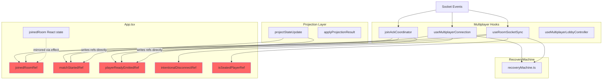
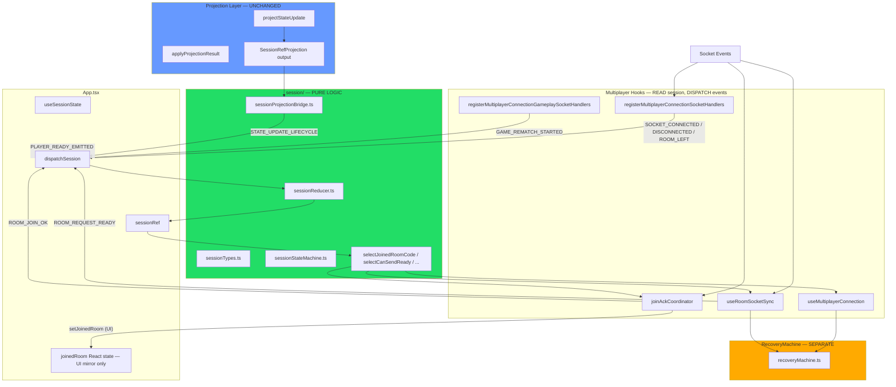
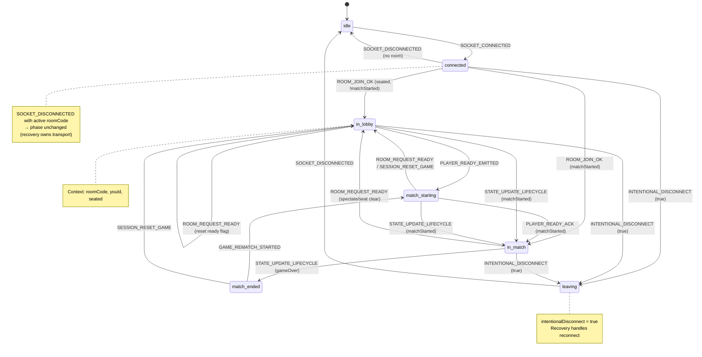
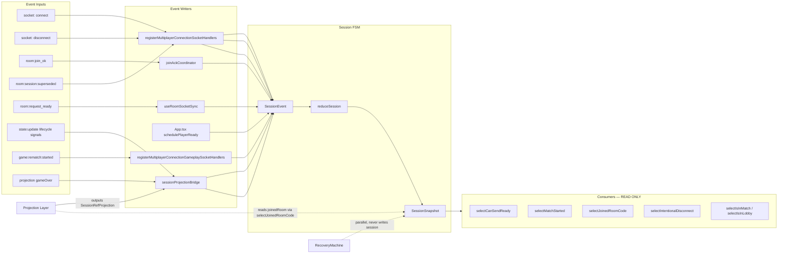

# Session State Machine — Architecture Report

**Date:** 2026-07-06  
**Scope:** Authoritative multiplayer lifecycle layer (`client/src/multiplayer/session/`)

## Executive Summary

An authoritative **Session State Machine** now owns multiplayer lifecycle state: joined, lobby, match start, in-match, match end, leaving, and reconnect transitions (recovery logic stays separate). It sits alongside the existing **Projection Layer**, **Socket Event Registry**, and **RecoveryMachine**.

All scattered lifecycle refs (`joinedRoomRef`, `matchStartedRef`, `playerReadyEmittedRef`, `intentionalDisconnectRef`, `isSeatedPlayerRef`) are **removed from client source**. Guards and socket handlers read `sessionRef.current` via selectors. `joinedRoom` React state remains as a **UI mirror** for re-renders (synced on join/disconnect); lifecycle **decisions** use the FSM.

---

## 1. Architecture

### 1.1 Before (Scattered Ref Soup)

**Problems:**

- No single lifecycle truth — refs updated in 6+ places
- Projection wrote lifecycle refs directly
- Match/lobby inference mixed gameplay state (`stateRef.gameOver`) with lifecycle refs
- Recovery and session lifecycle intertwined in disconnect handlers

---

### 1.2 After (Authoritative Session FSM)

---

### 1.3 Session State Machine Diagram

**Phases:** `idle` → `connected` → `in_lobby` → `match_starting` → `in_match` → `match_ended` → `leaving`

---

### 1.4 Integration Graph

---

## 2. File-by-File Breakdown

### 2.1 New Files (`client/src/multiplayer/session/`)

| File | Purpose |
|------|---------|
| `sessionTypes.ts` | `SessionPhase`, `SessionContext`, `SessionSnapshot`, `SessionEvent` union, initial constants |
| `sessionReducer.ts` | Pure `reduceSession()` — no sockets, React, projection, or recovery |
| `sessionStateMachine.ts` | `createSessionStateMachine()` factory + lifecycle selectors |
| `useSessionState.ts` | React adapter: `useSyncExternalStore` + `sessionRef` + `dispatchSession` |
| `sessionProjectionBridge.ts` | Maps projection `SessionRefProjection` → `STATE_UPDATE_LIFECYCLE` events (lives **outside** projection) |
| `sessionRuntimeTypes.ts` | `MultiplayerSessionStateRuntime` type for scope wiring |
| `sessionStateMachine.behaviorTests.ts` | Isolated FSM behavior tests (full lifecycle path) |

### 2.2 Modified Files (Integration)

| File | Change |
|------|--------|
| `App.tsx` | `useSessionState()` provider; `schedulePlayerReady` uses `selectCanSendReady` / `selectMatchStarted`; `resetClientGameSession` dispatches `SESSION_RESET_GAME`; matchmaking uses `selectJoinedRoomCode` |
| `joinAckCoordinator.ts` | Dispatches `ROOM_JOIN_OK` on join ack; reads `selectJoinedRoomCode` for resync |
| `useJoinAckCoordinator.ts` | Passes `sessionRef` + `dispatchSession` |
| `registerMultiplayerConnectionSocketHandlers.ts` | `SOCKET_CONNECTED`, `SOCKET_DISCONNECTED`, `ROOM_LEFT`, `ROOM_SESSION_SUPERSEDED`; uses `selectIntentionalDisconnect` / `selectJoinedRoomCode` |
| `registerMultiplayerConnectionGameplaySocketHandlers.ts` | `GAME_REMATCH_STARTED` → session |
| `useRoomSocketSync.ts` | `ROOM_REQUEST_READY`; projection bridge on `state:update` / `state:spectate`; reads session for `joinedRoom` in projection context |
| `useMultiplayerConnection.ts` | All room guards via session selectors; `INTENTIONAL_DISCONNECT` dispatch |
| `useMultiplayerRoomActions.ts` | Room code from `selectJoinedRoomCode` |
| `useMultiplayerLobbyController.ts` | Leave flow uses session |
| `useMultiplayerResync.ts` | `fetchGameState` room from session; quick-match stall uses `selectMatchStarted` + `selectIsSeated` |
| `MultiplayerGameShell.tsx` | `SESSION_RESET_GAME` on shell reset; passes `sessionRuntime` to live match |
| `useAppSessionRuntime.ts` | `sessionRuntime` slice in runtime bundles |
| `applyProjectionResult.ts` | Reads `scope.session.sessionRef` for draw audit (read-only) |
| `runtime/roomRuntime.ts` | **Removed** `joinedRoomRef` from `MultiplayerRoomRuntime` |
| `runtime/gameplayRuntime.ts` | `MultiplayerSessionRefsRuntime` with `sessionRef` + `dispatchSession` |
| `match/session/*` | Live match session passes `sessionRefsRuntime` through scope |

### 2.3 Deleted Refs / Lifecycle Flags

| Removed | Replacement |
|---------|-------------|
| `joinedRoomRef` | `selectJoinedRoomCode(sessionRef.current)` |
| `matchStartedRef` | `selectMatchStarted(sessionRef.current)` |
| `playerReadyEmittedRef` | `session.context.playerReadyEmitted` / `selectPlayerReadyEmitted()` |
| `intentionalDisconnectRef` | `selectIntentionalDisconnect(sessionRef.current)` |
| `isSeatedPlayerRef` | `selectIsSeated(sessionRef.current)` |
| Manual `isInMatch` inference in hooks | `selectIsInMatch()` / phase checks |

**Verified:** `grep` over `client/src/**/*.ts(x)` returns **zero** matches for all five `*Ref` names.

### 2.4 Unchanged (Per Hard Rules)

- Projection layer (`projectStateUpdate.ts`, `projectStateSpectate.ts`, `projectionGates.ts`) — unchanged
- Socket Event Registry (`socketEventRegistry.ts`) — unchanged, no new listeners
- RecoveryMachine (`recoveryMachine.ts`) — separate, parallel dispatch only

---

## 3. Migration Map

| Old Ref / Pattern | New Session State | Selector / Event |
|-------------------|-------------------|------------------|
| `joinedRoomRef.current` | `context.roomCode` | `selectJoinedRoomCode(session)` |
| `matchStartedRef.current = true` | `phase: 'in_match'` | `selectMatchStarted(session)` |
| `matchStartedRef.current = false` | `phase: 'in_lobby'` or `'match_starting'` | phase + context |
| `playerReadyEmittedRef.current = true` | `context.playerReadyEmitted: true` | `selectPlayerReadyEmitted(session)` |
| `playerReadyEmittedRef.current = false` | `ROOM_REQUEST_READY` event | reducer clears flag |
| `intentionalDisconnectRef.current = true` | `phase: 'leaving'`, `context.intentionalDisconnect: true` | `selectIntentionalDisconnect(session)` |
| `isSeatedPlayerRef.current` | `context.seated` | `selectIsSeated(session)` |
| `!matchStartedRef && seated` → can ready | `selectCanSendReady(session)` | composite selector |
| `state?.gameOver` for match end | `phase: 'match_ended'` | `STATE_UPDATE_LIFECYCLE { gameOver: true }` via bridge |
| `payload.matchStarted` in socket sync | projection → bridge → session | `STATE_UPDATE_LIFECYCLE { matchStarted: true }` |
| `resetMultiplayerRoomState` clears refs | `SESSION_RESET_GAME` + `ROOM_LEFT` + `SOCKET_DISCONNECTED` | reducer transitions |
| `game:rematch:started` handler | `GAME_REMATCH_STARTED` | `phase: 'match_starting'` |

### Event Input Mapping

| Socket / Source | SessionEvent |
|-----------------|--------------|
| `socket: connect` | `SOCKET_CONNECTED` |
| `socket: disconnect` | `SOCKET_DISCONNECTED` (+ `ROOM_LEFT` when non-recoverable) |
| `room:join_ok` | `ROOM_JOIN_OK` |
| `room:session:superseded` | `ROOM_SESSION_SUPERSEDED` (no-op on phase; recovery handles) |
| `room:request_ready` | `ROOM_REQUEST_READY` |
| `state:update` lifecycle | `STATE_UPDATE_LIFECYCLE` via `sessionProjectionBridge` |
| `game:rematch:started` | `GAME_REMATCH_STARTED` |
| Match end (projection) | `STATE_UPDATE_LIFECYCLE { gameOver: true }` |
| `player:ready` emit | `PLAYER_READY_EMITTED` |
| `player:ready` ack | `PLAYER_READY_ACK` |
| Intentional leave | `INTENTIONAL_DISCONNECT { value: true }` |
| Shell game reset | `SESSION_RESET_GAME` |

---

## 4. Risk Analysis

| Risk | Severity | Mitigation |
|------|----------|------------|
| **`joinedRoom` React state diverges from session** | Medium | Both updated in same handlers (`joinAckCoordinator`, disconnect handler). Guards use session, not React state. Future: derive `joinedRoom` from `sessionSnapshot`. |
| **UI match visibility still uses `joinedRoom + state`** | Low | `selectShouldShowMatchScreen` exists but not wired to `MultiplayerModeController`. Gameplay `state` null check is intentional (no board = no match UI). |
| **`ROOM_SESSION_SUPERSEDED` is no-op in reducer** | Low | RecoveryMachine owns resync; session preserves room context during supersede. |
| **Disconnect with active room preserves session phase** | Low | By design — recovery owns transport reconnect; session doesn't reset mid-game disconnect. |
| **`tournament:match:assigned` sets UI `joinedRoom` without `ROOM_JOIN_OK`** | Low | Tournament attach flow completes via `room:join` ack shortly after. |
| **Projection still outputs `sessionRefs` struct** | None | Bridge converts to session events; projection layer untouched per rules. |
| **Quick-match stall timer uses React `joinedRoom` dep** | Low | Internal guard uses session selectors; React dep is for effect scheduling only. |

---

## 5. CI / Test Results

| Command | Result |
|---------|--------|
| `npm run build --prefix client` | **PASS** (tsc + vite) |
| `npx tsx src/multiplayer/session/sessionStateMachine.behaviorTests.ts` | **PASS** |
| `npm run test` (vitest) | **PASS** — 72 files, 564 tests |
| `node run-behavior-tests.mjs` | **PASS** — 32 behavior test files |
| `npm run check:multiplayer-arch` | **PASS** — no dependency violations |
| `npm run check:multiplayer-cycles` | **PASS** — no cycles |
| `npm run check:socket-registry` | **PASS** — 34 enforced raw events, 5 normalized routes, 0 grandfathered sites |

---

## 6. Future Recommendations

1. **Derive `joinedRoom` from `sessionSnapshot`** — Remove parallel React state; use `useSessionState().sessionSnapshot` + `selectJoinedRoomCode` for UI re-renders.
2. **Wire `selectShouldShowMatchScreen` to `MultiplayerModeController`** — Replace `joinedRoom && state` with session phase for lobby/match routing.
3. **Add `MATCH_ENDED` explicit event** — Optional typed event instead of `STATE_UPDATE_LIFECYCLE.gameOver` for clearer semantics.
4. **Expand behavior tests** — Cover `ROOM_SESSION_SUPERSEDED`, recoverable disconnect (phase preserved), tournament join paths.
5. **Session devtools panel** — Log `dispatchSession` events in DEV for lifecycle debugging (similar to recovery machine logging).
6. **Dependency-cruiser rule for session purity** — Enforce `session/` cannot import `projection/`, `recoveryMachine`, or `socket.io`.

---

## Hard Rules Compliance Checklist

| Rule | Status |
|------|--------|
| Session is pure logic (no sockets in reducer) | ✅ |
| No React inside state machine | ✅ |
| No projection logic inside session | ✅ |
| Driven only by specified events | ✅ |
| Never computes board/legal moves/recovery | ✅ |
| All lifecycle refs replaced | ✅ |
| Projection reads session, never writes | ✅ |
| RecoveryMachine separate | ✅ |
| No projection/registry/recovery changes | ✅ |
| No new socket listeners | ✅ |
| Session testable in isolation | ✅ |
| Gameplay behavior preserved | ✅ (all tests pass) |

---

## Key Selectors

Defined in `client/src/multiplayer/session/sessionStateMachine.ts`:

- `selectJoinedRoomCode` — room membership
- `selectIsSeated` — seated in room roster
- `selectPlayerReadyEmitted` — ready signal sent
- `selectIntentionalDisconnect` — user-initiated leave
- `selectMatchStarted` — match has started (includes match_starting with ready emitted)
- `selectIsInMatch` — `in_match` or `match_ended`
- `selectIsInLobby` — `in_lobby` or `match_starting`
- `selectCanSendReady` — seated, in lobby/starting, not yet ready
- `selectShouldShowMatchScreen` — in match, ended, or starting