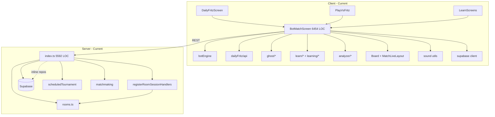

# Architectural Audit & Target Design

**Scope:** `client/src/bot/BotMatchScreen.tsx` (6,454 LOC) and `server/src/index.ts` (5,592 LOC). You referred to `server.ts`; the monolith is `index.ts`.

**Verdict:** The product works, but two files own 15+ product surfaces each. That is not a scaling architecture—it is accumulated feature debt. The path forward is **domain extraction + session controllers + thin composition roots**, not cosmetic splits.

---

## 1. Responsibility Analysis

### 1.1 `BotMatchScreen.tsx` — Everything It Owns

| Domain | Responsibilities |
|--------|------------------|
| **Session orchestration** | Match init (8+ code paths), `BotMatchState` ownership, rematch, exit/navigation, local run token invalidation, lifecycle version guards |
| **Game loop** | Player turns, bot turn scheduling (`useEffect` + 1.5s delay), `applyAndNotify`, pass/draw/play, legal move derivation, open-ends display |
| **Hand lifecycle** | Hand-over detection, reveal scheduling, auto-advance timers, manual advance fallback, retry/watchdog, phase refs (`handLifecyclePhaseRef`) |
| **Pre-game draw** | Scripted Daily Fritz draw, `usePreGameDraw` integration, starter selection, draw-complete handler |
| **Bot AI integration** | `chooseBotMove`, fairness logging, bot chain pause, draw sequence during bot turns |
| **Draw animation** | Flying tiles, draw pulse, `triggerDrawStepAnimation`, `runDrawSequenceLocal`, boneyard→hand animation |
| **Daily Fritz (in-match)** | SessionStorage debounce persistence, pagehide flush, next-hand API (`nextDailyFritzHand`), prefetch cache, completion hash + submit, rank/leaderboard preview, share text, set overlay props, watchdog advance, debug trace |
| **Play vs Fritz** | Standalone ranked session (`startLocalBotMatch` / `abandon`), verified match ID, Glicko prediction, post-game rating display |
| **Ghost mode** | Ghost session start, move log, suggested move comparison, agreement UI, completion API, rating delta, ghost played tile overlay |
| **Guided Learn (v1)** | Frozen lesson load, transcript replay, step index, off-authored-line detection, Fritz reply replay from `fritzReplyEvents` |
| **Guided Learn (v2)** | Frozen lesson playback, event index, scripted state application, off-line fallback |
| **Authoring (v1/v2)** | Step recording, note capture, V2 event timeline, candidate capture/validation/save |
| **Learning coach** | `useLearningCoach`, coach tips, best-move highlighting, coached placement moves, lesson coach VM |
| **Journey trials** | Trial exit/complete, scoped navigation |
| **Move analysis / replay** | `moveLog` append, `GameReviewer` open/close, pivotal review hooks, post-game analysis, engine best-move snapshots |
| **Daily Puzzle (legacy)** | Leaderboard fetch inside bot shell when `dailyPuzzleDate` set |
| **Audio** | All `queueSound` calls (tile, draw, score, hand win/lose, match win/lose, blocked, your turn) |
| **Visual effects** | Confetti on win, score toast animation, ghost board pulse, hand reveal progress |
| **UI chrome** | Partially extracted to `useMatchUiChrome`; still wires mute/fullscreen/leave/score track |
| **Board shell** | `MatchLiveLayout` vs `BotGuidedMatchPanel` fork, `MatchNblBoardFrame`, board meta bar, controls tray, responsive hand tile sizing |
| **Overlays / modals** | `BotHandOverModal`, `BotGameOverModal`, `BotPostGameCard`, `BotDailyFritzSetOverlay`, `BotReviewSummaryPortal`, `BotPivotalReviewPortal`, leave modal |
| **HUD** | Turn labels, opponent/you pills, Daily Fritz game pill, pre-game draw HUD |
| **Selection** | Tile selection, placement target clicks, playable tile keys |
| **Networking** | `botMatchApi`, `dailyFritz/api`, `ghost/api`, Supabase session token |
| **Persistence** | sessionStorage (Daily Fritz), localStorage (debug flags), no unified persistence layer |
| **Debug / telemetry** | `botMatchDebugLog`, `dailyFritzDebugLog`, `fairnessLog`, layout debug, DEV panels |
| **Navigation** | `onBack`, `onNavigate` to home/botSetup/learn |
| **Mode matrix** | 12+ boolean mode flags derived from props + `mode` prop |

**Quantified sprawl:** ~49 `useState`, ~52 `useEffect`, ~43 `useCallback`, ~25 timer refs, ~80 import statements.

**Partial extractions already done (good, insufficient):**
- `botEngine.ts` — rules engine
- `handLifecycle.ts` — pure transition helpers
- `useMatchUiChrome`, `useAuthoringCapture`, `usePostGamePivotalReview`, `useBotMatchWindowEvents`
- Presentational children: `BotHandTray`, `BotGameOverModal`, etc.

---

### 1.2 `server/src/index.ts` — Everything It Owns

| Domain | Responsibilities |
|--------|------------------|
| **Process bootstrap** | `loadEnv`, Sentry init, Express + HTTP + Socket.IO creation, listen, graceful shutdown |
| **CORS** | Origin allowlists, reflect callback, Socket.IO origin config |
| **Rate limiting** | REST + socket limiters, per-route limit mounts (cron, admin, daily submit) |
| **Health / readiness** | `/health`, `/ping`, `/ready`, env presence, Supabase latency probe, release version |
| **Auth** | JWT from Authorization header, sync auth for rate limit key, admin secret, socket identity resolution, auth TTL cache |
| **Error handling** | Global Express error middleware |
| **Ranking REST** | Profile, leaderboard, history, manual process endpoint |
| **Ghost REST** | Profile by user/username (thin delegate), **massive** `/api/ghost/complete` with validation + verified match gate |
| **Verified single-player matches** | Full inline subsystem: types, in-memory cache, Supabase CRUD, start/abandon, completion hash (~400 LOC) |
| **Bot match REST** | `/api/bot-matches/local/start|resolve|abandon`, cleanup-stale cron |
| **Daily Fritz** | **~1,800 LOC inline**: Pacific TZ utils, row↔record mappers, run/attempt repositories, cache, warmup schedulers, 12 REST routes, leaderboard, admin generate/invalidate/reset |
| **Daily Puzzle Ladder** | **~1,200 LOC inline**: slot/attempt repositories, auto-seed, streaks, 6 REST routes, cron warm handler |
| **League** | 7 REST routes (thin delegate to `league/*` but handlers inline) |
| **Home / stats** | `/api/home/daily-summary`, `/api/stats/record-match` |
| **Social** | Mount `socialRouter`; not inline but coupled at root |
| **Room events** | `/api/room-events/:matchId` |
| **Game-over orchestration** | `createGameOverPersistScheduler` (~250 LOC): tournament finalize, match log, activity feed, ranked insert, realtime Glicko, ghost complete, league fixture auto-finalize, matchmaking record end |
| **Fritz pending matches** | Insert/resolve pending rows, forfeit on disconnect, activity labels |
| **Matchmaking integration** | Room shell hydration, socket-ready wait, handler registration |
| **Room session wiring** | `initRoomSession` with 10+ injected callbacks |
| **Presence** | `socketsByUserId` map, identify/online handlers, friend presence emit |
| **Socket handlers (inline)** | Legacy tournament create/join/start/add_bot, friend invite decline, room chat/emote, stats:weekly |
| **Cron / warmup** | Startup Daily Fritz + Daily Puzzle ladder warmup, scheduled timers |
| **In-memory caches** | `verifiedSinglePlayerMatches`, `dailyFritzRunCache`, `authenticatedUserIdCache` |
| **MP stats** | `/api/mp-stats` runtime counters |

**Quantified sprawl:** ~44 REST routes, ~114 local functions, repositories + route handlers + orchestration in one file.

**Already extracted (good, buried under index):** `rooms.ts` (1,068 LOC), `registerRoomSessionHandlers.ts` (1,580 LOC), `scheduledTournament/*`, `matchmaking/*`, `league/*`, `ranking/*`, `ghost/service.ts`.

---

## 2. Coupling Analysis

### 2.1 Dependency Graph (Current — Problematic)



### 2.2 Tight Couplings

| Coupling | Parties | Why It's Problematic |
|----------|---------|----------------------|
| **Mode flag explosion** | `BotMatchScreen` ↔ 8 product modes | Every new mode adds booleans + effect guards; bot effect alone has 6 mode exclusions |
| **Daily Fritz split brain** | `DailyFritzScreen` + `BotMatchScreen` | Set loop in parent, hand loop + API + persistence in child; duplicate completion paths (`onDailyFritzGameComplete` vs inline submit) |
| **Guided + live bot dual mutation** | Guided V2 playback vs bot `useEffect` | Explicit guard: "dual state mutations" — architectural smell |
| **UI ↔ game loop** | React state drives bot scheduling | 52 effects create stale-closure/race class; `matchRef` patches symptoms |
| **Review ↔ match shell** | Analyzer state inside BMS | Post-game review competes with game-over overlays in same component |
| **index.ts ↔ Supabase** | Raw `supabaseFetch` in route handlers | No repository boundary; schema changes touch god file |
| **Game-over god function** | `createGameOverPersistScheduler` | Ranking + league + ghost + tournament + activity in one async closure |
| **Verified matches inline** | Ghost + Fritz + Daily Fritz | Three features share one ad-hoc cache Map in index.ts |
| **Pacific TZ in index** | Daily Fritz + Puzzle + Home | Calendar logic not reusable/testable in isolation |
| **Socket + REST auth duplicate** | `getAuthenticatedUserId` vs `resolveSocketIdentity` | Two identity paths, one file |

### 2.3 Hidden Dependencies

- `handLifecycle.ts` is pure but **phase truth lives in refs** inside BMS, not in a single session store.
- `fairnessLog` and `moveLog` are write side-effects scattered across play/draw/bot paths.
- Daily Fritz `sessionStorage` key format is duplicated between BMS and `DailyFritzScreen`.
- Server `dailyFritzRunCache` invalidation is implicit; no cache module owns TTL policy.
- `createGameOverPersistScheduler` closes over `io` — untestable without full server boot.

### 2.4 Circular Responsibilities

- **BMS orchestrates AND renders AND persists AND animates** — no inward dependency rule.
- **index.ts defines repositories AND validates HTTP AND schedules cron AND wires sockets** — classic "main becomes framework" anti-pattern.

### 2.5 Bottlenecks

1. `BotMatchScreen.tsx` — any Fritz/Learn/DF change
2. `server/src/index.ts` — any daily content or auth change
3. `createGameOverPersistScheduler` — any post-game persistence change
4. `App.tsx` (1,589 LOC) — multiplayer/tournament (out of scope but coupled)

---

## 3. Risk Analysis — 20 Engineers Tomorrow

| Pain Point | Severity | Manifestation |
|------------|----------|---------------|
| **Merge conflicts** | Critical | BMS and index.ts are default conflict magnets; 3+ engineers cannot work same week without rebasing hell |
| **Feature ownership** | Critical | No team can own "Daily Fritz" or "Ghost" — code is interleaved with unrelated `if (isGhostMode)` |
| **Testing** | Critical | BMS untestable without React mount harness; server routes untestable without booting full index |
| **Onboarding** | High | "Where does next-hand live?" → read 6,000 lines |
| **Release cadence** | High | Single deploy unit; DF API change risks breaking ghost complete handler in same file |
| **Debugging** | High | 52 effects; logs from 4 debug systems; hand-stuck bugs require full mental model |
| **Performance** | Medium | Any state tick re-renders entire shell; bot timer + DF persistence on every move |
| **Mobile/desktop parity** | Medium | Responsive tile sizing embedded in BMS, not layout module |
| **Esports/replay future** | Blocked | `moveLog` append is inline; no event-sourced session; server room events separate from bot log |
| **Horizontal scale** | Blocked (server) | In-memory caches + rooms Map in process; index.ts reinforces single-node assumption |
| **Code review quality** | High | PRs routinely too large to review; behavior regressions slip through |
| **CI flake risk** | Medium | Few integration tests for inline route handlers |

---

## 4. File Ownership Analysis — Where Things Actually Belong

### 4.1 `BotMatchScreen` — Current → Target

| Current Location | Symbol / Concern | Belongs In |
|------------------|------------------|------------|
| BMS `useState(match)` | Core match state | `game/session/BotSessionStore` (non-React) |
| BMS bot `useEffect` | Bot turn scheduler | `session/bot/BotTurnScheduler` |
| BMS `advanceHand` | Hand transitions | `session/hand/HandAdvanceController` |
| BMS `applyAndNotify` | Action side-effects | `session/bot/BotActionDispatcher` |
| BMS draw animations | Visual only | `animation/DrawAnimationController` |
| BMS `queueSound` calls | Audio | `audio/MatchSoundController` |
| BMS Daily Fritz effects | DF persistence/submit | `features/daily-fritz/DailyFritzMatchController` |
| BMS ghost effects | Ghost completion | `features/ghost/GhostMatchController` |
| BMS guided effects | Lesson playback | `features/guided/GuidedPlaybackController` |
| BMS authoring callbacks | Content authoring | `features/guided/AuthoringCaptureController` |
| BMS `useLearningCoach` | Coach eval | `features/coach/CoachController` |
| BMS `appendMove` | Analysis log | `features/review/MoveLogWriter` |
| BMS `GameReviewer` wiring | Review UI | `features/review/ReviewController` + thin portal |
| BMS tile click handlers | Input | `interaction/BoardInteractionController` |
| BMS `MatchLiveLayout` JSX | Layout | `ui/match/BotMatchShell.tsx` |
| BMS modals composition | Overlays | `ui/overlays/*` (already partial) |
| BMS mode booleans | Mode detection | `session/MatchModeContext.ts` |
| BMS `startLocalBotMatch` | Network | `infrastructure/network/BotMatchApiClient` |
| BMS sessionStorage | Persistence | `infrastructure/persistence/DailyFritzSessionStore` |
| BMS confetti | FX | `animation/CelebrationController` |
| BMS `useMatchUiChrome` | Chrome | Stays; already correct |

### 4.2 `server/index.ts` — Current → Target

| Current Location | Concern | Belongs In |
|------------------|---------|------------|
| Sentry + listen | Bootstrap | `bootstrap/createServer.ts` |
| CORS + rate limit | HTTP middleware | `http/middleware/*` |
| `getAuthenticatedUserId` | Auth | `auth/RestAuthService.ts` |
| `resolveSocketIdentity` | Auth | `auth/SocketAuthService.ts` |
| `/ready` payload | Health | `health/ReadinessService.ts` |
| Daily Fritz repos | Persistence | `infrastructure/persistence/daily-fritz/*Repository.ts` |
| Daily Fritz routes | HTTP | `http/routes/dailyFritzRoutes.ts` |
| Daily Puzzle repos | Persistence | `infrastructure/persistence/daily-puzzle/*` |
| Daily Puzzle routes | HTTP | `http/routes/dailyPuzzleRoutes.ts` |
| Verified match cache | Domain + infra | `domain/verified-match/VerifiedMatchService.ts` |
| Ghost complete handler | Application | `application/ghost/CompleteGhostMatchHandler.ts` |
| `createGameOverPersistScheduler` | Application | `application/match/GameOverPersistencePipeline.ts` |
| Pacific TZ helpers | Domain | `domain/calendar/PacificDateService.ts` |
| Warmup schedulers | Cron | `cron/DailyContentWarmupScheduler.ts` |
| `socketsByUserId` | Socket infra | `socket/presence/SocketPresenceRegistry.ts` |
| Inline tournament sockets | Socket | `socket/handlers/legacyTournamentHandlers.ts` |
| `initRoomSession` wiring | Composition | `bootstrap/wireRoomSession.ts` |
| index.ts final | **~80 lines** | `index.ts` — import bootstrap, start |

---

## 5. Target Architecture — AAA Studio Shape

### Design Principles Applied

- **Domain core has zero React / zero Express imports**
- **Controllers** coordinate; **services** execute; **repositories** persist
- **UI reads state, emits intents** — no `applyPlayMove` in JSX handlers
- **One file, one reason to change** — accept 120–180 new files

### 5.1 Client Folder Structure

```
client/src/
├── game/                          # PURE — no React
│   ├── engine/                    # move application, legality (split botEngine)
│   ├── rules/                     # scoring, hand end, game end
│   ├── commands/                  # PlayTile, Draw, Pass, StartHand
│   ├── events/                    # MatchEvent union + serializers
│   ├── state/                     # BotMatchState reducers
│   └── types/
│
├── session/                       # Match runtime — no JSX
│   ├── core/
│   │   ├── MatchSession.ts
│   │   ├── MatchSessionStore.ts
│   │   └── LocalRunGuard.ts
│   ├── bot/
│   │   ├── BotSessionController.ts
│   │   ├── BotTurnScheduler.ts
│   │   └── BotActionDispatcher.ts
│   ├── hand/
│   │   ├── HandLifecycleController.ts
│   │   └── HandRevealScheduler.ts
│   └── mode/
│       └── MatchModeContext.ts
│
├── features/
│   ├── daily-fritz/match/         # in-game DF only (hub stays in dailyFritz/)
│   ├── ghost/match/
│   ├── guided/{playback,authoring,capture}/
│   ├── coach/
│   ├── review/
│   ├── journey/match/
│   └── pvf-ranked/
│
├── interaction/                   # Input → commands
│   ├── TileSelectionController.ts
│   └── PlacementController.ts
│
├── infrastructure/
│   ├── network/                   # API clients
│   ├── persistence/               # sessionStorage, etc.
│   ├── audio/
│   ├── animation/
│   └── timers/                    # TimerRegistry
│
├── ui/
│   ├── match/                     # BotMatchShell, layout slots
│   ├── overlays/                  # modal composition only
│   └── bot-match/
│       └── BotMatchScreen.tsx     # ~150 LOC composition root
│
└── app/                           # routing shell (future App.tsx shrink)
```

### 5.2 Server Folder Structure

```
server/src/
├── index.ts                       # ~60–100 LOC entry
├── bootstrap/
│   ├── createApp.ts
│   ├── createHttpServer.ts
│   ├── createSocketServer.ts
│   ├── wireMiddleware.ts
│   ├── wireRoutes.ts
│   ├── wireSocketHandlers.ts
│   └── wireRoomSession.ts
│
├── http/
│   ├── middleware/{cors,rateLimit,errorHandler,auth}.ts
│   └── routes/
│       ├── healthRoutes.ts
│       ├── rankingRoutes.ts
│       ├── ghostRoutes.ts
│       ├── botMatchRoutes.ts
│       ├── dailyFritzRoutes.ts
│       ├── dailyPuzzleRoutes.ts
│       ├── leagueRoutes.ts
│       ├── homeRoutes.ts
│       └── roomEventsRoutes.ts
│
├── socket/
│   ├── presence/
│   ├── handlers/
│   └── registerConnection.ts
│
├── application/                   # Use-cases
│   ├── daily-fritz/
│   ├── daily-puzzle/
│   ├── ghost/
│   ├── bot-match/
│   ├── match/GameOverPersistencePipeline.ts
│   └── ranking/
│
├── domain/                        # Business rules, no I/O
│   ├── calendar/
│   ├── verified-match/
│   ├── daily-fritz/
│   └── daily-puzzle/
│
├── infrastructure/
│   ├── persistence/               # Supabase repositories
│   ├── cache/
│   └── supabase/
│
└── cron/
    └── DailyContentWarmupScheduler.ts
```

---

## 6. Decomposition Trees

### 6.1 `BotMatchScreen` → Composition Root

```
BotMatchScreen.tsx (~120 LOC)
├── <BotMatchProviders>           # wires controllers once
│   ├── useBotMatchSession()      # subscribes store → React snapshot
│   └── useMatchUiChrome()        # existing
│
├── <BotMatchShell>               # layout only
│   ├── HudRegion
│   ├── BoardRegion
│   │   └── <BotBoardStage>       # Board + meta + controls
│   ├── HandRegion
│   │   └── <BotHandTray>         # existing
│   └── OverlaySlot
│
└── <BotMatchOverlayStack>        # portals only
    ├── HandOverOverlayController
    ├── GameOverOverlayController
    ├── DailyFritzSetOverlay       # existing component
    ├── ReviewOverlayController
    ├── CoachOverlayController
    └── LeaveGameModal
```

**Controller layer (non-React):**

```
MatchSessionController
├── BotSessionController
│   ├── BotTurnScheduler
│   ├── BotActionDispatcher
│   └── FritzFairnessLogger
├── HandLifecycleController
│   ├── HandRevealScheduler
│   └── HandAdvanceController
├── PreGameDrawController
├── BoardInteractionController
│   └── TileSelectionController
├── DailyFritzMatchController
├── GhostMatchController
├── GuidedPlaybackController
├── AuthoringCaptureController
├── CoachController
├── ReviewController
├── RankedPvFController
├── JourneyTrialController
├── MoveLogWriter
├── MatchSoundController
├── DrawAnimationController
├── CelebrationController
├── DailyFritzSessionStore
└── BotMatchApiClient
```

### 6.2 `server/index.ts` → Bootstrap Only

```
index.ts
├── bootstrap/createApp()
├── bootstrap/createHttpServer()
├── bootstrap/createSocketServer()
├── bootstrap/wireMiddleware(app)
├── bootstrap/wireRoutes(app)
├── bootstrap/wireSocketHandlers(io)
├── bootstrap/wireRoomSession(io, deps)
├── cron/DailyContentWarmupScheduler.start()
├── ranking/cron.startRankingCron()      # existing
└── server.listen()
```

---

## 7. Proposed File Catalog

Below: **every proposed file** with Purpose / Responsibilities / Public API / Dependencies / Import rules / Size / Complexity.

*Complexity: S (<80 LOC), M (80–150), L (150–250).*

### 7.1 Client — `game/` (Pure Domain)

| File | Purpose | Responsibilities | Public API | Dependencies | Who imports | Never imports | Size | Cx |
|------|---------|------------------|------------|--------------|-------------|---------------|------|-----|
| `game/state/botMatchReducer.ts` | State transitions | Apply command → new state | `reduceBotMatch(state, event)` | `game/commands`, `game/rules` | session/* | React, fetch | M | M |
| `game/commands/PlayTileCommand.ts` | Play intent | Validate + build play cmd | `createPlayTileCommand(...)` | `game/types` | session, interaction | UI | S | S |
| `game/commands/DrawCommand.ts` | Draw intent | Draw cmd factory | `createDrawCommand(...)` | types | session | UI | S | S |
| `game/commands/PassCommand.ts` | Pass intent | Pass cmd factory | `createPassCommand(...)` | types | session | UI | S | S |
| `game/commands/StartHandCommand.ts` | Hand deal | Next hand cmd | `createStartHandCommand(...)` | engine | HandAdvanceController | UI | S | S |
| `game/events/MatchEvent.ts` | Event union | All session events | `type MatchEvent = ...` | types | session, review | React | S | S |
| `game/events/serializeMatchEvent.ts` | Replay wire format | JSON ↔ event | `serialize/deserialize` | MatchEvent | review, network | UI | M | S |
| `game/rules/handEnd.ts` | Hand end rules | Domino/blocked detection | `evaluateHandEnd(state)` | engine | reducer | React | M | M |
| `game/rules/gameEnd.ts` | Game end rules | Score target | `evaluateGameEnd(state)` | types | reducer | React | S | S |
| `game/rules/legalMoves.ts` | Move enumeration | Wrapper over engine | `getLegalMovesForPlayer(...)` | botEngine split | interaction | UI | M | S |
| `game/engine/applyPlayMove.ts` | Move application | Extract from botEngine | `applyPlayMove` | types, rules | reducer | React | M | M |
| `game/engine/applyDraw.ts` | Draw application | Extract | `drawOne`, sequences | types | reducer | React | M | M |
| `game/engine/createMatch.ts` | Match factories | Fixed/scripted deals | `createBotMatch*` | types | session | React | M | M |

### 7.2 Client — `session/`

| File | Purpose | Responsibilities | Public API | Dependencies | Who imports | Never imports | Size | Cx |
|------|---------|------------------|------------|--------------|-------------|---------------|------|-----|
| `session/core/MatchSessionStore.ts` | Observable store | Hold state, emit events | `getState`, `subscribe`, `dispatch` | game/* | all controllers, hooks | React | M | M |
| `session/core/MatchSession.ts` | Session facade | Orchestrate controllers | `MatchSession.create(cfg)` | controllers | hook layer | JSX | M | M |
| `session/core/LocalRunGuard.ts` | Async race guard | Token invalidation | `beginRun`, `isCurrent`, `finish` | — | schedulers | UI | S | S |
| `session/core/MatchModeContext.ts` | Mode resolution | Single mode enum | `resolveMatchMode(props)` | types | all feature controllers | React | S | S |
| `session/bot/BotSessionController.ts` | Bot loop owner | Wire scheduler+dispatcher | `start()`, `stop()`, `onState` | scheduler, dispatcher | MatchSession | JSX | M | M |
| `session/bot/BotTurnScheduler.ts` | Bot timing | Schedule think delay | `scheduleTurn()`, `cancel()` | LocalRunGuard, engine | BotSessionController | React | M | M |
| `session/bot/BotActionDispatcher.ts` | Apply bot action | chooseBotMove→dispatch | `executeBotTurn()` | botHeuristics, store | BotSessionController | UI | M | M |
| `session/hand/HandLifecycleController.ts` | Hand phases | Phase machine | `onHandEnded()`, `getPhase()` | handLifecycle.ts | MatchSession | React | M | M |
| `session/hand/HandRevealScheduler.ts` | Reveal timing | Delay + progress | `scheduleReveal()`, `cancel()` | timers | HandLifecycle | UI | M | S |
| `session/hand/HandAdvanceController.ts` | Next hand | Local + DF API path | `advance()`, `retry()` | DF controller, engine | HandLifecycle | JSX | L | L |
| `session/bot/FritzFairnessLogger.ts` | Fairness telemetry | Log bot decisions | `logDecision(...)` | fairnessLog | BotActionDispatcher | UI | S | S |

### 7.3 Client — `features/` (Feature Controllers)

| File | Purpose | Responsibilities | Public API | Dependencies | Who imports | Never imports | Size | Cx |
|------|---------|------------------|------------|--------------|-------------|---------------|------|-----|
| `features/daily-fritz/match/DailyFritzMatchController.ts` | DF in-match | Persist, submit, next-hand | `onMove()`, `onGameOver()`, `advanceHand()` | api, persistence | MatchSession | Board.tsx | L | L |
| `features/daily-fritz/match/DailyFritzNextHandClient.ts` | API client | next-hand fetch | `fetchNextHand()` | network | DF controller | React | M | S |
| `features/daily-fritz/match/DailyFritzCompletionClient.ts` | API client | complete + hash | `submitCompletion()` | network | DF controller | React | M | M |
| `features/ghost/match/GhostMatchController.ts` | Ghost play | Session, move log, complete | `start()`, `onPlayerMove()`, `complete()` | ghost/api | MatchSession | UI | M | M |
| `features/ghost/match/GhostSuggestionService.ts` | Ghost hints | Compare moves | `evaluateAgreement(...)` | ghost/logic | interaction | React | M | S |
| `features/guided/playback/GuidedPlaybackController.ts` | V1/V2 playback | Scripted advances | `onPlayerIntent()`, `tick()` | learn loaders | MatchSession | bot scheduler | L | L |
| `features/guided/playback/GuidedV2EventPlayer.ts` | V2 events | Apply event timeline | `applyEvent(n)` | types | playback ctrl | UI | M | M |
| `features/guided/playback/GuidedTranscriptPlayer.ts` | V1 transcript | Reply replay | `playReply()` | helpers | playback ctrl | UI | M | M |
| `features/guided/authoring/AuthoringCaptureController.ts` | Authoring | Record steps/events | `captureAction()` | useAuthoringCapture logic | MatchSession | Board | M | M |
| `features/guided/capture/GuidedMatchCandidateController.ts` | Candidate save | Validate + upsert | `save()`, `copy()` | learn storage | MatchSession | UI | M | M |
| `features/coach/CoachController.ts` | Coach eval | Wrap useLearningCoach | `onPlayerMove()`, `getTip()` | learning engine | MatchSession | JSX | M | M |
| `features/review/MoveLogWriter.ts` | Analysis log | Append entries | `appendPlayerMove()`, `appendBotMove()` | moveLogger | MatchSession | UI | M | S |
| `features/review/ReviewController.ts` | Post-game review | Open analyzer, scope | `openReview()`, `close()` | analyzer | overlay | Board | M | M |
| `features/pvf-ranked/RankedPvFController.ts` | Ranked PVF | Start/abandon/resolve | `register()`, `abandon()`, `resolve()` | botMatchApi | MatchSession | UI | M | M |
| `features/journey/match/JourneyTrialController.ts` | Journey | Exit/complete | `complete(won)` | — | MatchSession | UI | S | S |
| `features/pregame/PreGameDrawController.ts` | Tile draw | Scripted draw | `onComplete(payload)` | preGameDraw | MatchSession | UI | M | M |

### 7.4 Client — `interaction/`, `infrastructure/`, `ui/`

| File | Purpose | Responsibilities | Public API | Dependencies | Who imports | Never imports | Size | Cx |
|------|---------|------------------|------------|--------------|-------------|---------------|------|-----|
| `interaction/TileSelectionController.ts` | Tile pick | Select/deselect | `selectTile()`, `clear()` | store | BoardInteraction | JSX | S | S |
| `interaction/PlacementController.ts` | Board click | Position→command | `onPlacement(pos)` | commands | BoardInteraction | engine direct | M | S |
| `interaction/BoardInteractionController.ts` | Input facade | Route to placement | `handleTileClick`, `handlePosition` | above | hook | features | M | S |
| `infrastructure/timers/TimerRegistry.ts` | Central timers | Track/clear timeouts | `set()`, `clearAll()` | — | all schedulers | React | M | S |
| `infrastructure/audio/MatchSoundController.ts` | Match SFX | Map events→sounds | `onEvent(event, muted)` | sound utils | MatchSession | UI | M | S |
| `infrastructure/animation/DrawAnimationController.ts` | Draw FX | Flying tiles | `playDrawStep()` | — | dispatcher | store | M | M |
| `infrastructure/animation/CelebrationController.ts` | Win FX | Confetti | `onMatchWin()` | confetti | MatchSession | UI | S | S |
| `infrastructure/persistence/DailyFritzSessionStore.ts` | DF snapshot | sessionStorage | `save()`, `load()`, `flush()` | — | DF controller | React | M | S |
| `infrastructure/network/BotMatchApiClient.ts` | PVF API | start/abandon/resolve | typed methods | gameServerUrl | RankedPvF | UI | S | S |
| `ui/match/BotMatchShell.tsx` | Layout | Slots for HUD/board/hand | shell props | MatchLiveLayout | BotMatchScreen | controllers | M | S |
| `ui/match/BotBoardStage.tsx` | Board region | Board+meta+controls | props | Board, components | shell | API calls | M | S |
| `ui/match/BotMatchHud.tsx` | HUD | Pills, turn status | props | — | shell | store | M | S |
| `ui/overlays/BotMatchOverlayStack.tsx` | Overlay compose | Portal stack | children | existing modals | BotMatchScreen | game logic | S | S |
| `ui/bot-match/BotMatchScreen.tsx` | **Composition root** | Wire hook+shell+overlays | `BotMatchScreen(props)` | all above | App routes | engine | S | S |
| `ui/bot-match/useBotMatchSession.ts` | React bridge | store→React | hook return snapshot | MatchSession | BotMatchScreen | business logic | M | M |
| `ui/bot-match/BotMatchProviders.tsx` | Context | Session singleton per mount | Provider | MatchSession | screen | — | S | S |
| `ui/bot-match/mapPropsToSessionConfig.ts` | Prop adapter | Props→config | pure fn | types | useBotMatchSession | JSX | S | S |

**Client total: ~52 new files** (+ splits from `botEngine.ts`). Existing child components (`BotHandTray`, modals) remain.

### 7.5 Server — Bootstrap & HTTP

| File | Purpose | Responsibilities | Public API | Dependencies | Who imports | Never imports | Size | Cx |
|------|---------|------------------|------------|--------------|-------------|---------------|------|-----|
| `bootstrap/createApp.ts` | Express factory | Create bare app | `createApp()` | express | index | routes inline | S | S |
| `bootstrap/createHttpServer.ts` | HTTP server | Timeouts | `createHttpServer(app)` | http | index | handlers | S | S |
| `bootstrap/createSocketServer.ts` | Socket.IO | CORS origins | `createSocketServer(http)` | socket.io | index | routes | M | S |
| `bootstrap/wireMiddleware.ts` | Middleware stack | cors, json, limits | `wireMiddleware(app)` | middleware/* | index | repos | M | S |
| `bootstrap/wireRoutes.ts` | Route mount | Register all routers | `wireRoutes(app)` | http/routes/* | index | supabase | S | S |
| `bootstrap/wireSocketHandlers.ts` | Socket mount | Connection handlers | `wireSocketHandlers(io, deps)` | socket/* | index | SQL | M | M |
| `bootstrap/wireRoomSession.ts` | Room DI | inject game-over pipeline | `wireRoomSession(io, deps)` | application/match | index | route defs | M | M |
| `http/middleware/cors.ts` | CORS | Origin policy | `corsOptions` | — | wireMiddleware | routes | M | S |
| `http/middleware/rateLimit.ts` | Rate limits | REST limits | `createRateLimits()` | rateLimit.ts | wireMiddleware | handlers | M | S |
| `http/middleware/errorHandler.ts` | Errors | Express error MW | `errorHandler` | — | wireMiddleware | — | S | S |
| `http/middleware/authMiddleware.ts` | Auth helpers | attach user | `requireAuth` | auth/* | routes | repos | M | S |
| `http/routes/healthRoutes.ts` | Health | /health /ping /ready | Router | health/* | wireRoutes | socket | M | S |
| `http/routes/rankingRoutes.ts` | Ranking REST | profile, LB | Router | application/ranking | wireRoutes | socket | M | S |
| `http/routes/ghostRoutes.ts` | Ghost REST | profiles, complete | Router | application/ghost | wireRoutes | — | M | S |
| `http/routes/botMatchRoutes.ts` | Bot REST | local start/resolve | Router | application/bot-match | wireRoutes | — | M | S |
| `http/routes/dailyFritzRoutes.ts` | DF REST | 12 endpoints | Router | application/daily-fritz | wireRoutes | — | L | M |
| `http/routes/dailyPuzzleRoutes.ts` | Puzzle REST | ladder endpoints | Router | application/daily-puzzle | wireRoutes | — | L | M |
| `http/routes/leagueRoutes.ts` | League REST | 7 endpoints | Router | league/* | wireRoutes | — | M | S |
| `http/routes/homeRoutes.ts` | Home | daily summary | Router | homeDailySummary | wireRoutes | — | S | S |
| `http/routes/roomEventsRoutes.ts` | Replays | room event log | Router | persistence | wireRoutes | — | S | S |

### 7.6 Server — Application, Domain, Infrastructure

| File | Purpose | Responsibilities | Public API | Dependencies | Who imports | Never imports | Size | Cx |
|------|---------|------------------|------------|--------------|-------------|---------------|------|-----|
| `auth/RestAuthService.ts` | REST auth | get user from req | `getAuthenticatedUserId` | supabase | routes, middleware | socket | M | M |
| `auth/SocketAuthService.ts` | Socket auth | resolve identity | `resolveSocketIdentity` | supabase | socket | express | M | M |
| `auth/AdminAuthService.ts` | Admin | secret validation | `isAdminSecret` | — | routes | — | S | S |
| `auth/AuthTokenCache.ts` | Token cache | TTL cache | get/set | — | RestAuth | — | S | S |
| `health/ReadinessService.ts` | Readiness | env + supabase | `getReadiness()` | supabase | healthRoutes | routes | M | S |
| `domain/calendar/PacificDateService.ts` | TZ | Pacific date keys | `getPacificDateKey()` | — | daily-* | express | M | S |
| `domain/verified-match/types.ts` | Types | Verified match | interfaces | — | all verified | — | S | S |
| `domain/verified-match/CompletionHash.ts` | Hash | completion hash | `buildHash()` | crypto | handlers | HTTP | S | S |
| `domain/verified-match/VerifiedMatchPolicy.ts` | Rules | status transitions | `canComplete()` | types | service | supabase | M | S |
| `application/verified-match/VerifiedMatchService.ts` | Use-case | start/get/abandon | service methods | repo | ghost, bot, DF | express | M | M |
| `infrastructure/persistence/verified-match/VerifiedMatchRepository.ts` | Supabase | CRUD | repo methods | supabaseUtils | service | routes | M | M |
| `infrastructure/cache/VerifiedMatchCache.ts` | Memory cache | Map cache | get/set/invalidate | types | service | routes | S | S |
| `application/ghost/CompleteGhostMatchHandler.ts` | Ghost complete | validation+orchestration | `handle(req)` | ghost/service, verified | ghostRoutes | socket | L | L |
| `application/ghost/StartGhostSessionHandler.ts` | Ghost start | start session | `handle(req)` | verified | ghostRoutes | — | M | S |
| `application/bot-match/LocalBotMatchHandlers.ts` | PVF local | start/resolve/abandon | handlers | verified, pending | botMatchRoutes | — | M | M |
| `application/bot-match/PendingFritzMatchService.ts` | Pending rows | insert/resolve | service | supabase | game-over, handlers | — | M | M |
| `application/match/GameOverPersistencePipeline.ts` | Post-game | ranking+league+ghost+... | `createPipeline(deps)` | many services | wireRoomSession | routes | L | L |
| `application/match/GameOverContext.ts` | DTO | room scores roster | types | rooms | pipeline | — | S | S |
| `application/daily-fritz/GetTodayDailyFritzHandler.ts` | DF today | orchestrate today | `handle(req)` | repos | routes | — | M | M |
| `application/daily-fritz/StartDailyFritzHandler.ts` | DF start | start attempt | `handle` | repos, verified | routes | — | M | M |
| `application/daily-fritz/NextHandDailyFritzHandler.ts` | DF next hand | deal next | `handle` | domain DF | routes | — | M | M |
| `application/daily-fritz/CompleteDailyFritzHandler.ts` | DF complete | finalize | `handle` | repos, activity | routes | — | L | L |
| `application/daily-fritz/RecordGameDailyFritzHandler.ts` | DF record game | set game | `handle` | skunk | routes | — | M | M |
| `application/daily-fritz/BuildDailyFritzLeaderboard.ts` | LB | sort+rank | fn | repos | handlers | HTTP | M | S |
| `infrastructure/persistence/daily-fritz/DailyFritzRunRepository.ts` | Runs | CRUD | repo | supabase | handlers | routes | M | M |
| `infrastructure/persistence/daily-fritz/DailyFritzAttemptRepository.ts` | Attempts | CRUD | repo | supabase | handlers | routes | M | M |
| `infrastructure/cache/DailyFritzRunCache.ts` | Run cache | per-date cache | cache API | types | repos | routes | S | S |
| `application/daily-puzzle/*Handler.ts` (×6) | Puzzle use-cases | start/submit/complete/... | handlers | repos | routes | — | M each | M |
| `infrastructure/persistence/daily-puzzle/DailyPuzzleAttemptRepository.ts` | Attempts | CRUD | repo | supabase | handlers | — | M | M |
| `infrastructure/persistence/daily-puzzle/DailyPuzzleSlotRepository.ts` | Slots | CRUD | repo | supabase | handlers | — | M | M |
| `cron/DailyContentWarmupScheduler.ts` | Warmup | DF+puzzle warmup | `start()` | application | index | routes | M | M |
| `socket/presence/SocketPresenceRegistry.ts` | Presence map | socketsByUserId | registry API | — | socket handlers | routes | M | S |
| `socket/presence/PresenceHandlers.ts` | identify/online | socket events | register(io) | registry | wireSocket | — | M | S |
| `socket/handlers/legacyTournamentHandlers.ts` | Legacy | tournament sockets | register | tournament | wireSocket | — | M | M |
| `socket/handlers/RoomSocialHandlers.ts` | Chat/emote | room social | register | rooms | wireSocket | — | M | S |
| `socket/registerConnection.ts` | Connection | compose handlers | `onConnection` | all handlers | wireSocket | repos | M | S |

**Server total: ~58 new files** (+ 6 daily-puzzle handler files enumerated as group).

**Combined: ~110 focused files** replacing ~12,000 LOC in 2 god files.

---

## 8. Ideal Dependency Direction

```
┌─────────────────────────────────────────┐
│  UI (React) — render + emit intents     │
└──────────────────┬──────────────────────┘
                   │ reads snapshot, dispatches intents
┌──────────────────▼──────────────────────┐
│  React Bridge Hooks (useBotMatchSession)  │
└──────────────────┬──────────────────────┘
                   │
┌──────────────────▼──────────────────────┐
│  Controllers / Session Orchestrators    │
└──────────────────┬──────────────────────┘
                   │
┌──────────────────▼──────────────────────┐
│  Application Services (server)          │
│  Feature Controllers (client)           │
└──────────────────┬──────────────────────┘
                   │
┌──────────────────▼──────────────────────┐
│  Domain (rules, policies, pure logic)   │
└──────────────────┬──────────────────────┘
                   │
┌──────────────────▼──────────────────────┐
│  Infrastructure (network, DB, audio, FX)  │
└─────────────────────────────────────────┘

NEVER: Domain → React
NEVER: Domain → Express
NEVER: Repository → UI
NEVER: Board.tsx → Supabase
```

---

## 9. Incremental Migration Plan

**Rules:** Each phase compiles, tests pass, behavior preserved, god file shrinks measurably.

### Phase 0 — Baseline (1 week)

| Extract | Difficulty | Risk | Testing |
|---------|------------|------|---------|
| Playwright smoke: PVF hand, DF next-hand, ghost complete | Medium | Low | New E2E suite |
| Characterization tests for `handLifecycle`, bot engine parity | Low | Low | Existing Vitest + snapshots |

**Exit:** CI green with 3 smoke paths documented.

---

### Phase 1 — Server: Extract leaf domains (2 weeks)

| Extract | Difficulty | Risk | Testing |
|---------|------------|------|---------|
| `PacificDateService` | Low | Low | Unit: date boundaries |
| `RestAuthService` + `AdminAuthService` | Low | Medium | Auth header tests |
| `healthRoutes` + `ReadinessService` | Low | Low | Supertest /health /ready |
| `cors.ts` + `rateLimit` wire | Low | Low | Existing rateLimit.test |

**Exit:** index.ts −300 LOC. No route path changes.

---

### Phase 2 — Server: Verified match + ghost (2 weeks)

| Extract | Difficulty | Risk | Testing |
|---------|------------|------|---------|
| `VerifiedMatchRepository` + `VerifiedMatchService` + cache | Medium | Medium | Port ghost complete tests |
| `CompleteGhostMatchHandler` | Medium | High | Existing ghost service tests + HTTP contract |
| `botMatchRoutes` + `LocalBotMatchHandlers` | Medium | Medium | Fritz ranked flow integration test |

**Exit:** index.ts −800 LOC. Ghost/Fritz routes thin.

---

### Phase 3 — Server: Daily Fritz + Daily Puzzle repos (3 weeks)

| Extract | Difficulty | Risk | Testing |
|---------|------------|------|---------|
| DF repositories + mappers | Medium | Medium | Repository tests against fixtures |
| `dailyFritzRoutes` + handlers (one endpoint per PR) | High | High | Handler tests per route; DF behavior tests |
| DP repositories + `dailyPuzzleRoutes` | High | Medium | Ladder readiness tests exist — extend |
| `DailyContentWarmupScheduler` | Low | Low | Cron auth tests |

**Exit:** index.ts −2,000 LOC. Daily content owned by `application/daily-*`.

---

### Phase 4 — Server: Game-over pipeline + socket cleanup (2 weeks)

| Extract | Difficulty | Risk | Testing |
|---------|------------|------|---------|
| `GameOverPersistencePipeline` | High | **Critical** | Decompose with injected mocks; room game-over tests |
| `SocketPresenceRegistry` + handlers | Medium | Medium | presence.test.ts extend |
| `wireRoomSession.ts` | Medium | Medium | MP integration tests |
| Legacy tournament handlers | Low | Low | Existing tournament tests |

**Exit:** index.ts **<150 LOC**. Server god file eliminated.

---

### Phase 5 — Client: Session store + bot loop (3 weeks)

| Extract | Difficulty | Risk | Testing |
|---------|------------|------|---------|
| `MatchSessionStore` + `botMatchReducer` | High | High | Reducer tests from engine tests |
| `BotTurnScheduler` + `BotActionDispatcher` | High | **Critical** | botEngine.behaviorTests + new scheduler tests |
| `MatchSoundController` + `DrawAnimationController` | Medium | Low | Event→sound unit tests |
| `useBotMatchSession` hook (read-only bind) | Medium | Medium | Hook test with fake store |

**Exit:** BMS −1,500 LOC. PVF still works; no feature changes.

---

### Phase 6 — Client: Hand lifecycle + interaction (2 weeks)

| Extract | Difficulty | Risk | Testing |
|---------|------------|------|---------|
| `HandLifecycleController` + `HandAdvanceController` | High | **Critical** | handLifecycle.behaviorTests (existing) |
| `BoardInteractionController` | Medium | Medium | Interaction unit tests |
| `TimerRegistry` | Low | Low | Leak/cancel tests |

**Exit:** BMS −1,000 LOC. Hand-stuck class of bugs easier to trace.

---

### Phase 7 — Client: Feature controllers (4 weeks, parallelizable)

| Extract | Difficulty | Risk | Testing |
|---------|------------|------|---------|
| `DailyFritzMatchController` + session store | High | High | DF debug trace parity; parent/child contract test |
| `GhostMatchController` | Medium | Medium | Ghost agreement tests |
| `GuidedPlaybackController` + authoring | High | High | Guided lesson smoke |
| `ReviewController` + `MoveLogWriter` | Medium | Low | Analyzer tests exist |
| `RankedPvFController` | Medium | Medium | PVF ranked API mock tests |

**Exit:** BMS −2,500 LOC.

---

### Phase 8 — Client: Composition root (1 week)

| Extract | Difficulty | Risk | Testing |
|---------|------------|------|---------|
| `BotMatchShell`, `BotBoardStage`, `BotMatchOverlayStack` | Medium | Low | Visual smoke |
| `BotMatchScreen.tsx` → ~120 LOC | Low | Low | Bundle size check (existing script) |

**Exit:** BMS **<200 LOC**. God component eliminated.

---

### Phase 9 — Hardening (ongoing)

- Enforce dependency-cruiser boundaries (`game` ↛ `ui`)
- CODEOWNERS per `features/*` and `application/*`
- Load test game-over pipeline
- Plan `App.tsx` decomposition (same playbook)

---

## 10. Quality Bar Check

Would Riot/Valve/Chess.com own this for 5 years?

| Current | Target |
|---------|--------|
| ❌ 6k-line React component | ✅ Composition root + session store |
| ❌ 5k-line server entry | ✅ Bootstrap + handlers + repos |
| ❌ 52 useEffects | ✅ ≤5 effects in bridge hook (subscribe/snapshot) |
| ❌ Mode `if` chains | ✅ `MatchModeContext` + strategy controllers |
| ⚠️ botEngine extracted | ✅ Full command/event domain |
| ❌ Game-over 250-line closure | ✅ Pipeline with typed stages |
| ❌ No E2E on core loops | ✅ Phase 0 smoke required |

---

## Summary

| Metric | Today | After migration |
|--------|-------|-----------------|
| `BotMatchScreen.tsx` | 6,454 LOC | ~120 LOC composition |
| `server/index.ts` | 5,592 LOC | ~80 LOC bootstrap |
| Focused files | 2 god files | ~110 modules @ 50–150 LOC |
| Testability | React/integration only | Domain unit + handler + E2E |
| Team parallelism | ~2 engineers max | 6+ feature teams |

**Recommended first move:** Phase 0 (E2E baseline) + Phase 1 (server auth/health/calendar) — highest safety, immediate index.ts shrink, zero gameplay risk.

---

## Remaining Risks / Gaps

- `App.tsx` (1,589 LOC) is the next god file; `rooms.ts` and `registerRoomSessionHandlers.ts` need the same treatment in Phase 10.
- Dependency-cruiser rules should be added when Phase 5 starts.