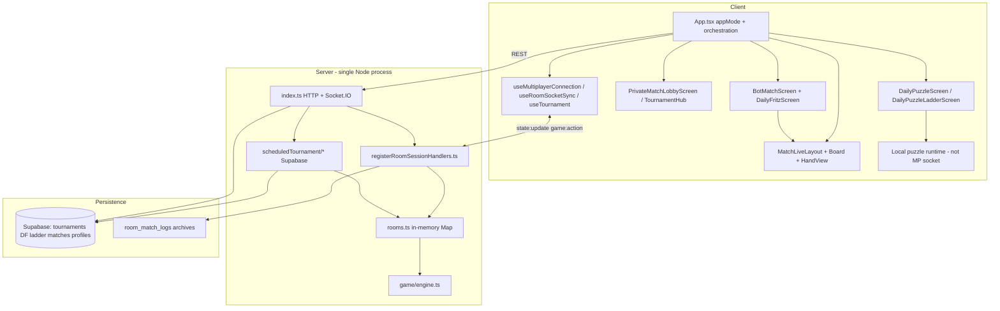

# Core Gameplay Architecture Migration Plan

**Date:** 2026-05-31  
**Status:** Planning only — no implementation in this document  
**Audience:** Engineers doing structural refactors after P0 stabilization  
**Prerequisite audits:**  
`docs/multiplayer-private-games-source-of-truth-audit.md`,  
`docs/tournament-mode-source-of-truth-audit.md`,  
`docs/fritz-bot-modes-source-of-truth-audit.md`,  
`docs/daily-puzzle-ladder-source-of-truth-audit.md`,  
plus P0 stabilization reports for each mode.

---

## Executive summary

Racehorse’s core gameplay is **functionally stabilized** (P0 passes on private multiplayer, Daily Puzzle Ladder, Daily Fritz / Play vs Fritz, skunk rules, tournament auth/bracket safeguards) but **structurally concentrated** in two monoliths:

| Monolith | ~Lines | Owns |
|----------|--------|------|
| `client/src/App.tsx` | ~5,000 | Routing (`appMode`), socket lifecycle, private MP, quick match bridge, tournament attach/recovery, in-game MP shell wiring; live session in `useLiveMatchSession` |
| `client/src/bot/BotMatchScreen.tsx` | ~8,000 | All Fritz/bot modes, timers, hand/set transitions, board shell, ghost/learn overlays |

Server authority lives in **`server/src/rooms.ts`** (in-memory rooms) + **`registerRoomSessionHandlers.ts`**, with scheduled tournaments in **`server/src/scheduledTournament/`** (Supabase-backed bracket, rooms on the same Node process).

**Safest migration order:** establish behavior baselines → extract **multiplayer + tournament session orchestration from `App.tsx`** (behavior-preserving) → extract **bot/Fritz lifecycle from `BotMatchScreen`** → performance passes → durable room/tournament infrastructure → legacy cleanup.

**Do not start with:** Redis, UI redesign, gameplay rule changes, socket protocol rewrites, or deleting legacy tournament code.

---

## 1. Current architecture summary

### 1.1 High-level diagram



### 1.2 `App.tsx` — routing and orchestration

`App.tsx` is the **application shell**, not a thin router:

- **`appMode`** (`client/src/types.ts`) drives which screen tree renders: `home`, `multiplayer`, `tournament`, `bot`, `daily`, `dailyFritz`, etc.
- **Hash routing** syncs `appMode` ↔ URL (`MODE_TO_PATH` / `PATH_TO_MODE`); `appMode` remains source of truth.
- **Socket ownership:** creates `socket`, `connect`/`disconnect`, passes into hooks only when `SOCKET_MODES` includes current mode.
- **Multiplayer in-game:** holds authoritative `GameState`, `legalMoves`, `canDraw`, pending UI action, rematch/hand-ready, draw animations (via `useRoomSocketSync`), move handlers (`play`, `draw`, `pass`), `HandView`, `Board`, `MatchLiveLayout`, game-over overlays.
- **Tournament bridge:** `useTournament` + `attemptTournamentAttach` + effects that flip `appMode` to `multiplayer` mid-bracket; `tournamentMatch` context for HUD/overlays; game-over → bracket advance callbacks.
- **Recovery:** `racehorse_last_room_code` localStorage, `retryRoomRecovery`, tournament `recoveryMatch` auto-attach, sequence watermarks (`socketGuards.ts`).

Existing hooks **already partially extracted** but still fed/callback-wired from `App.tsx`:

- `useMultiplayerConnection.ts` — connect, reconnect, global listeners  
- `useMultiplayerRoomActions.ts` — create/join/leave/invite  
- `useRoomSocketSync.ts` — `state:update`, draw animations, disconnect grace UI  
- `useTournament.ts` — REST refresh, pending match, recovery payload  

### 1.3 Private multiplayer

**Intended loop:** Hub → create/join room → waiting → both ready → `game:start` → `game:action` → `state:update` → hand/game over → rematch or abandon.

| Layer | Location |
|-------|----------|
| Lobby UI | `client/src/multiplayer/PrivateMatchLobbyScreen.tsx` (cosmetic settings not on server) |
| Orchestration | **`App.tsx`** (majority of in-game logic) |
| Server rooms | `server/src/rooms.ts`, `server/src/multiplayer/roomSession.ts` |
| Socket API | `server/src/multiplayer/registerRoomSessionHandlers.ts` |
| P0 hardening | `roomGameplayLock.ts`, tile invariants, hand masking tests |

**Transport:** Socket.IO only for live play; no REST for moves. Supabase stores archives/ratings/presence, not live board sync.

### 1.4 Tournament match attach

**Production path:** scheduled 8-player bracket (`server/src/scheduledTournament/`).

1. User registers via REST (`tournamentApi.ts`, Bearer auth after P0).  
2. Scheduler dispatches match → reserves in-memory room, sets `scheduledTournamentMatchId` on room.  
3. Client `useTournament` surfaces `pending` / `recoveryMatch`.  
4. **`App.tsx`** `attemptTournamentAttach` → `tournament:attach_assigned_match` → joins room → **`setAppMode('multiplayer')`** with `tournamentMatch` context.  
5. Game-over on server → `applyTournamentGameOverFromRoom` → bracket advance (Supabase).

**Fragility:** attach/recovery timers live across `App.tsx`, `useTournament`, `tournamentAttachGuard.ts`, `recoverySignals.ts`; mode switch to multiplayer is implicit coupling.

**Legacy:** `TournamentScreen.tsx` + socket round-robin (`ENABLE_LEGACY_TOURNAMENTS=1`) — not mounted in current `App.tsx` but code remains.

### 1.5 Play vs Fritz

- Setup: `PlayVsFritz.tsx` → `appMode: botSetup` → start → `bot` + lazy `BotMatchScreen`.  
- **Fully client-local** rules (`botEngine.ts`) and AI (`botHeuristics.ts`).  
- Optional ranked persistence: `/api/bot-matches/local/*`.  
- P0: hand/bot guards in `handLifecycle.ts`.

### 1.6 Daily Fritz

- Hub/set loop: `DailyFritzScreen.tsx` embeds `BotMatchScreen` with `dailyFritzPackage` props.  
- Server: `/api/daily-fritz/*`, `dailyFritzSkunk.ts` (canonical skunk).  
- Set advance: parent coordinates `record` / `complete` with in-flight dedupe refs (P0).  
- **Coupling:** DF business logic split between parent screen and god-shell `BotMatchScreen`.

### 1.7 Daily Puzzle Ladder

- Entry: `DailyPuzzleScreen.tsx` routes via `GET /api/daily-puzzle/today`.  
- Ladder: `DailyPuzzleLadderScreen.tsx` — **self-contained** HTTP state machine (start → submit-slot → complete).  
- Server: `dailyPuzzle.ts` + endpoints in `index.ts`; P0 `setVersion` binding + finalize recovery.  
- **Not on multiplayer socket stack** — lowest coupling to `App.tsx` (routing only).

### 1.8 Shared board / live match shell

| Component | Role |
|-----------|------|
| `MatchLiveLayout.tsx` | HUD + board frame + hand dock (shared MP + bot) |
| `Board.tsx` (~1,250 lines) | Layout (`computeLayout`), tile rendering, placement zones |
| `InGameBoardShell/Hud/Frame` | Structural pieces |
| `HandView` in `App.tsx` | Memoized hand for MP; bot has parallel hand UI inside `BotMatchScreen` |

Multiplayer projects server state via `boardSnapshotGuards.ts` / `projectMultiplayerGameState` before `Board`.

### 1.9 Server rooms

- **`rooms.ts`:** `Map<roomCode, Room>` — live `GameState`, roster, sequence, tournament metadata fields.  
- **Mutations:** `act()`, `startGame()`, `nextHand()` — serialized per room (P0 lock).  
- **Broadcast:** `roomSession.maskStateForRecipient` → `state:update`.  
- **Lifecycle:** disconnect grace, ghost logs, archive on game-over.

### 1.10 Scheduled tournaments

- **DB:** Supabase tables (migrations under `supabase/migrations/2026-05-14_*` … `2026-05-17_*`).  
- **Engine:** `engine.ts`, `bracket.ts`, `matchDispatch.ts`, `scheduler.ts` (30s tick).  
- **Recovery:** `recovery.ts` on boot — re-dispatch, recreate missing rooms.  
- **Constraint:** rooms tied to **owning server process**; multi-instance needs sticky sessions or external room store (Phase 4, not now).

### 1.11 Persistence / stats / leaderboards

| Domain | Mechanism |
|--------|-----------|
| Online H2H | `recordPublicMatch`, `matches` rows |
| Daily Fritz | `daily_fritz` tables, leaderboard endpoints, `activityWriter` |
| Daily Puzzle Ladder | `daily_puzzle_*` tables, ladder leaderboard |
| Ranked PVF | `/api/bot-matches/local/*`, Glicko (`fritzRating.test.ts`) |
| Tournament | Supabase bracket tables only (not live state) |
| Room archives | `room_match_logs` |
| Presence | `player_presence`, friend invites |

---

## 2. Main architectural problems (ranked)

| Rank | Issue | Impact | Evidence |
|------|-------|--------|----------|
| **1** | **Giant `App.tsx`** | Any MP/tournament/recovery change risks unrelated modes; full-tree re-renders on every `state:update` | ~5,800 lines; owns socket + game state + UI |
| **2** | **Duplicated recovery paths** | Reconnect/supersede/resync/tournament attach/localStorage room code overlap; hard to reason about ordering | MP: `retryRoomRecovery`, sequence regression; tournament: `recoveryMatch`, attach guard, 30s backoff |
| **3** | **Tournament ↔ multiplayer coupling** | Bracket UX in `tournament` mode but play in `multiplayer` mode; attach logic in App | `setAppMode('multiplayer')` during assigned match |
| **4** | **Single-process in-memory rooms** | Deploy/restart loses rooms; horizontal scale breaks tournament attach + game-over | `TOURNAMENT_README.md`, `rooms.ts` Map |
| **5** | **`BotMatchScreen` timer/effect sprawl** | Fritz/DF/ghost/learn flags in one component; stale closure class of bugs (mitigated P0, not removed) | ~8,000 lines, many `useEffect` chains |
| **6** | **Daily Fritz ↔ Play vs Fritz coupling** | Shared shell; DF set logic split parent/child | `DailyFritzScreen` + `BotMatchScreen` props |
| **7** | **Board rendering / reprojection cost** | `computeLayout` 2–3× per update; MP projects full state in App | P1 performance audit |
| **8** | **Socket/session lifecycle complexity** | Global listeners in connection hook + mode-gated connect + ack timeouts | `useMultiplayerConnection`, `emitWithAck` in App |
| **9** | **Legacy tournament code drift** | Two stacks, docs/env flags, dead `TournamentScreen` mount | `ENABLE_LEGACY_TOURNAMENTS`, unmounted screen |
| **10** | **Mode-specific smoke gaps** | DF/ladder/PVF lack socket-smoke parity; tournament manual-heavy | See §8 |

---

## 3. Target architecture

### 3.1 Principles

1. **Route-level screens stay thin** — render UI, read session context, dispatch intents.  
2. **Session controllers own lifecycle** — connect, join, play, recover, rematch, tear down.  
3. **Game engine stays pure** — `server/src/game/engine.ts`, `client/src/bot/botEngine.ts`; no React in engine.  
4. **Realtime transport is a boundary** — socket emit/ack/listen behind `roomTransport` (name TBD), not scattered `socket.emit` in screens.  
5. **One live-match shell** — `MatchLiveLayout` + memoized `Board` props; MP and tournament share `LiveMatchProvider`.  
6. **One bot-match shell** — `BotMatchProvider` / `useBotMatchSession` owns Fritz loop; mode-specific screens pass config.  
7. **Durable state is explicit** — Phase 4 introduces room/tournament ownership model; until then, document single-process assumption.

### 3.2 Layer model

```
┌─────────────────────────────────────────────────────────┐
│  Screens (TournamentHub, PrivateLobby, DailyFritz, …)   │
├─────────────────────────────────────────────────────────┤
│  Session controllers (hooks + optional Providers)        │
│  useLiveMatchSession / useBotMatchSession / …            │
├─────────────────────────────────────────────────────────┤
│  UI shell (MatchLiveLayout, Board, modals)               │
├─────────────────────────────────────────────────────────┤
│  Transport (roomTransport, tournamentApi, daily APIs)    │
├─────────────────────────────────────────────────────────┤
│  Engine (server game/engine, client botEngine)           │
├─────────────────────────────────────────────────────────┤
│  Persistence (Supabase, archives, leaderboards)          │
└─────────────────────────────────────────────────────────┘
```

### 3.3 Desired future shape

| Concern | Target owner |
|---------|----------------|
| `appMode` / top-level nav | Slim `App.tsx` or `AppShell.tsx` |
| Private lobby | `PrivateMatchLobbyScreen` + `usePrivateMatchSession` |
| In-game MP + tournament play | `LiveMatchScreen` + `useLiveMatchSession` |
| Tournament bracket/registration | `useTournament` (existing) + `useTournamentMatchSession` for attach |
| Fritz PVF / ghost / learn | `useBotMatchSession` inside `BotMatchScreen` (shrunk) |
| Daily Fritz set | `useDailyFritzSetSession` in `DailyFritzScreen` |
| Daily Puzzle Ladder | Keep in `DailyPuzzleLadderScreen` (already isolated) |
| Recovery | Shared `matchRecovery` module consumed by MP + tournament |
| Server rooms | `RoomService` facade over `rooms.ts` (Phase 4 precursor) |

### 3.4 Durable room strategy (Phase 4 target — design only)

- **Short term:** keep in-memory rooms; enforce single-process deployment; sticky sessions if multiple instances.  
- **Medium term:** room **lease/owner** in DB or Redis; replay state from `room_match_logs` + snapshot on attach.  
- **Tournament:** match row remains source of truth; room is ephemeral executor keyed by `scheduledTournamentMatchId`.  
- **Not in scope until session boundaries exist:** full Redis migration.

---

## 4. Proposed module boundaries

Names align with existing code where possible. New modules should live under `client/src/match/session/` and `client/src/multiplayer/` unless noted.

### 4.1 Live multiplayer + tournament

| Module | Responsibility | Exists today? |
|--------|----------------|---------------|
| `useMultiplayerConnection` | Socket connect, backoff, global events | **Yes** — extend, don’t rewrite |
| `useRoomSocketSync` | `state:update`, animations, sequence | **Yes** |
| `useMultiplayerRoomActions` | create/join/leave/invite | **Yes** |
| `useTournament` | REST bracket, pending/recovery | **Yes** |
| **`useLiveMatchSession`** | Unified in-game state: `gameState`, `legalMoves`, pending action, play/draw/pass, rematch | **New** — extract from App |
| **`usePrivateMatchSession`** | Lobby + room code + waiting room + start guards | **New** — compose room actions + lobby |
| **`useTournamentMatchSession`** | Attach, `tournamentMatch` context, game-over → bracket, mode handoff | **New** — extract `attemptTournamentAttach` |
| **`LiveMatchProvider`** | React context for live match session (optional if hook-only suffices) | **New** |
| **`matchSessionReducer`** | Pure reducer for MP session phases: `idle \| lobby \| playing \| handOver \| gameOver \| recovering` | **New** |
| **`tournamentSessionReducer`** | Bracket UI phase + attach state machine | **New** — may wrap `hubState.ts` patterns |
| **`roomTransport`** | Typed `emitWithAck`, event names, timeouts | **New** — centralize from App |
| **`matchRecovery`** | last room code, retry, visibility, tournament backoff | **New** — merge `recoverySignals`, attach guard |

### 4.2 Bot / Fritz

| Module | Responsibility | Exists today? |
|--------|----------------|---------------|
| `handLifecycle.ts` | Phase guards, advance lock | **Yes** — keep as pure helpers |
| **`useBotMatchSession`** | Local match loop, Fritz turn scheduling, hand advance | **New** — extract from BotMatchScreen |
| **`useDailyFritzSetSession`** | attempt_id, record/complete, skunk overlay VM | **New** — lift from DailyFritzScreen |
| **`BotMatchProvider`** | Context for bot session + mode config | **New** |
| `botEngine.ts` / `botHeuristics.ts` | Rules + AI | **Yes** — unchanged |

### 4.3 Server (Phase 4 precursors)

| Module | Responsibility |
|--------|----------------|
| `roomGameplayLock.ts` | Per-room serialization | **Yes** |
| **`RoomSessionFacade`** (name TBD) | Single entry for handlers → rooms → broadcast |
| **`TournamentRoomBinding`** | Dispatch, attach validation, game-over bridge |

### 4.4 Daily Puzzle Ladder

No new session controller required for Phase 1–2. Optional later: `useDailyPuzzleLadderSession` if hub/runtime split for testing.

---

## 5. Migration phases

### Phase 0 — Freeze behavior with baselines

**Goal:** Any refactor diff that changes gameplay is immediately detectable.

| Item | Detail |
|------|--------|
| **Files touched** | `docs/core-gameplay-architecture-migration-plan.md` (this doc); optional `scripts/architecture-baseline.sh` |
| **Must not change** | All gameplay, protocols, UI |
| **Tests / smoke** | Full baseline in §8 — run once, record pass/fail + commit SHA in team notes |
| **Rollback** | N/A (docs only) |
| **Risks** | Baseline not run → false confidence |
| **Definition of done** | Baseline checklist green; CI/local commands documented; P0 audit docs linked |

---

### Phase 1 — Extract multiplayer + tournament orchestration from `App.tsx`

**Goal:** `App.tsx` becomes routing + providers; in-game MP/tournament logic lives in `useLiveMatchSession` + `useTournamentMatchSession` (+ optional `LiveMatchScreen.tsx`).

| Item | Detail |
|------|--------|
| **Files touched (expected)** | `client/src/App.tsx` (shrink), **new** `client/src/match/session/useLiveMatchSession.ts`, `useTournamentMatchSession.ts`, `roomTransport.ts`, `matchRecovery.ts`, `LiveMatchScreen.tsx` (or `multiplayer/LiveMatchScreen.tsx`); minor exports from `useRoomSocketSync` / `useMultiplayerConnection` if needed |
| **Must not change** | Socket event names/payloads; masking; sequence watermarks; tournament attach semantics; private create/join/start order; game-over → bracket; `appMode` values visible to user |
| **Tests / smoke** | §8 Phase 1 gate |
| **Rollback** | Revert extraction PR; App regains inline logic (single revert) |
| **Risks** | Stale closures when moving handlers; tournament `appMode` flip timing; rematch/hand-ready regression |
| **Definition of done** | `App.tsx` reduced materially (target: **<3,500 lines** interim); MP + tournament E2E unchanged; all Phase 1 tests green; no new UI |

**Extraction order within phase:**

1. `roomTransport` + `emitWithAck` move  
2. `matchRecovery` (localStorage room + shared visibility helpers)  
3. `useLiveMatchSession` (state + `useRoomSocketSync` wiring + move handlers)  
4. `useTournamentMatchSession` (attach, pending, game-over bridge)  
5. `LiveMatchScreen` presentational shell  
6. App wires providers only  

---

### Phase 2 — Extract bot / Fritz lifecycle from `BotMatchScreen`

**Goal:** `BotMatchScreen` becomes layout + composition; `useBotMatchSession` owns effects/timers; Daily Fritz set in `useDailyFritzSetSession`.

| Item | Detail |
|------|--------|
| **Files touched** | `client/src/bot/BotMatchScreen.tsx`, **new** `useBotMatchSession.ts`, `useDailyFritzSetSession.ts`, `BotMatchProvider.tsx`; `DailyFritzScreen.tsx` (thin coordinator); `handLifecycle.ts` (unchanged API) |
| **Must not change** | Bot rules, skunk, DF API contract, PVF ranked flow, ghost/learn behavior |
| **Tests / smoke** | §8 Phase 2 gate |
| **Rollback** | Revert bot extraction; P0 guards in `handLifecycle` remain |
| **Risks** | Fritz timer races reintroduced; DF record/complete dedupe broken if refs moved incorrectly |
| **Definition of done** | `BotMatchScreen` **<4,000 lines** interim; `handLifecycle.behaviorTests` green; manual DF + PVF smoke (§8) |

---

### Phase 3 — Performance cleanup (after boundaries exist)

**Goal:** Measure and fix hot paths without mixing lifecycle refactors.

| Item | Detail |
|------|--------|
| **Files touched** | `Board.tsx`, `useLiveMatchSession` (pending release on `state:update`), `useRoomSocketSync`, optional `mpPerf.ts`; memo boundaries on `LiveMatchScreen` |
| **Must not change** | Server authority, masking, sequence semantics |
| **Tests / smoke** | §8 Phase 3 gate + before/after timing notes |
| **Rollback** | Per-optimization revert |
| **Risks** | Optimistic UI without invariant checks; breaking ack/sequence ordering |
| **Definition of done** | Documented latency improvement on private MOVE path; no correctness regressions |

**Prioritized wins (from P1 audit):**

- Clear `pendingUiAction` when `state:update` sequence ≥ ack sequence  
- Stabilize `Board` callback props (`useCallback` / refs)  
- Single board projection per update  
- Split `Board` layout memo from tile DOM  

---

### Phase 4 — Tournament reliability + durable room architecture

**Goal:** Survive restart/multi-instance **without** silent bracket corruption.

| Item | Detail |
|------|--------|
| **Files touched** | `scheduledTournament/recovery.ts`, `matchDispatch.ts`, `rooms.ts`, `index.ts` game-over; infra docs; optional Redis/DB lease **after** session API stable |
| **Must not change** | Bracket math, auth model (P0), client attach protocol until versioned migration |
| **Tests / smoke** | §8 Phase 4 gate + `recovery.test.ts`, `tournamentHumanBotFlow.test.ts`, manual `TOURNAMENT_SMOKE_TEST.md` |
| **Rollback** | Feature flag `ROOM_DURABILITY_MODE=memory\|sticky\|external` |
| **Risks** | Split-brain bracket advance; duplicate `applyMatchResult` |
| **Definition of done** | Documented deployment model; recovery recreates playable room from DB; load test on 2 instances with sticky **or** external room store |

---

### Phase 5 — Legacy cleanup

**Goal:** One tournament stack, accurate docs, delete dead paths.

| Item | Detail |
|------|--------|
| **Files touched** | `TournamentScreen.tsx`, `server/src/tournament/tournament.ts`, `index.ts` legacy handlers, `TOURNAMENT_README.md`, env flags |
| **Must not change** | Scheduled tournament production path until parity proven |
| **Tests / smoke** | Full §8 baseline |
| **Rollback** | Keep `ENABLE_LEGACY_TOURNAMENTS` until removal PR baked 2+ weeks |
| **Risks** | Hidden dependency on legacy socket events |
| **Definition of done** | Legacy behind flag default-off; scheduled path only in docs; no unmounted dead screens in bundle (optional lazy removal) |

---

## 6. Phase detail matrix (quick reference)

| Phase | Files (primary) | Behavior frozen | Rollback |
|-------|-----------------|-----------------|----------|
| 0 | docs, scripts | everything | n/a |
| 1 | App, match/session/*, multiplayer hooks | MP + tournament socket + attach | revert PR |
| 2 | bot/*, dailyFritz/* | Fritz + DF + ghost | revert PR |
| 3 | Board, live session, mpPerf | authority + masking | per-commit |
| 4 | server rooms + scheduledTournament | bracket + auth | feature flag |
| 5 | legacy tournament | scheduled only | env flag |

---

## 7. What to do first (recommendation)

### **First big architecture pass: extract multiplayer + tournament from `App.tsx` (Phase 1)**

**Why not the others first:**

| Alternative | Why later |
|-------------|-----------|
| Extract bot/Fritz from `BotMatchScreen` | Isolated client-local stack; failures don’t break MP/tournament; can run **after** Phase 1 in parallel only if staffing allows |
| Tournament durable rooms | Requires clean attach/session API; Redis before boundaries repeats today’s spaghetti |
| Board/render performance | Premature without stable props boundaries from `LiveMatchScreen` |
| Legacy tournament cleanup | Risky while attach still lives in App; Phase 5 |

**Why Phase 1 first:**

1. **Highest cross-mode coupling** — tournament explicitly hijacks `multiplayer` mode.  
2. **P0 investment protection** — server MP hardened; client orchestration is now the main regression surface.  
3. **Enables shared `matchRecovery`** — tournament and private room recovery unify here.  
4. **Unblocks Phase 3** — live match session owns pending state + board inputs.  
5. **Unblocks Phase 4** — `useTournamentMatchSession` becomes the single attach client for durable room work.

---

## 8. Test and smoke baseline

Run from repo root. Server must be built for socket smoke (`npm run build --prefix server`).

### 8.1 Global baseline (before any phase)

```bash
# Server unit tests (full suite)
npm test --prefix server

# Client bot/hand pure tests
npm run test:hand-lifecycle --prefix client
npm run test:bot --prefix client

# Socket E2E (server running on :3001)
npm run build --prefix server
npm run test:smoke:sockets --prefix client
# Optional stress:
# npm run test:smoke:sockets:stress --prefix client

# Client + server compile
npm run build --prefix client
npm run build --prefix server
```

### 8.2 Mode-focused subsets (P0 regression)

| Mode | Command |
|------|---------|
| Multiplayer private + masking + concurrency | `npm test --prefix server -- registerRoomSessionHandlers.private handMasking roomGameplayLock` |
| Multiplayer abandon | `npm test --prefix server -- registerRoomSessionHandlers.abandon` |
| Tournament auth + game-over | `npm test --prefix server -- routes.test socketHandlers.auth engine.gameOver` |
| Tournament engine/bracket | `npm test --prefix server -- scheduledTournament/engine scheduledTournament/bracket scheduledTournament/matchDispatch` |
| Tournament attach guard (client logic in server tests) | `npm test --prefix server -- tournamentAttachGuard` |
| Daily Fritz skunk | `npm test --prefix server -- dailyFritzSkunk` |
| Daily Puzzle Ladder | `npm test --prefix server -- dailyPuzzleLadderStabilization` |
| Game engine invariants | `npm test --prefix server -- engine invariants` |

### 8.3 Manual smokes (not fully automated)

| Doc | When |
|-----|------|
| `TOURNAMENT_SMOKE_TEST.md` | After Phase 1, 4, 5 tournament touches |
| `docs/daily-puzzle-ladder-stabilization-report.md` § Manual QA | After ladder API changes |
| `docs/fritz-bot-modes-p0-stabilization-report.md` | PVF hand transition + DF set complete manual |

### 8.4 Phase gates

| Phase | Required green |
|-------|----------------|
| **0** | §8.1 entire |
| **1** | §8.1 + multiplayer/tournament server subsets + socket smoke (16 scenarios) |
| **2** | §8.1 + `test:hand-lifecycle` + `dailyFritzSkunk` + manual PVF/DF checklist |
| **3** | §8.1 + socket smoke + documented perf checklist |
| **4** | Phase 1 gate + `recovery.test` + `tournamentHumanBotFlow` + `TOURNAMENT_SMOKE_TEST.md` |
| **5** | Full §8.1 + tournament manual smoke |

### 8.5 Socket smoke scenarios (current)

`client/scripts/socketSmoke.mjs` — **16 scenarios:**

`private-create-join-start-move`, `hand-masking-after-move`, `concurrent-action-serialization`, `lifecycle-reconnect`, `room-switch-cleanup`, `seat-migration-and-spectator-rejection`, `mid-hand-action-reliability`, `manual-draw-action-guards`, `forced-draw-atomic-behavior`, `post-move-stability`, `start-and-hand-ready-guards`, `guest-seat-reconnect`, `tokenless-uuid-claim-rejected`, `hand-ended-replay`, `identity-freeze`, `same-user-active-seat-takeover`

---

## 9. Anti-goals (do not do yet)

| Anti-goal | Reason |
|-----------|--------|
| **Redis / external room store migration** | Without `useLiveMatchSession` + server facade, state will duplicate |
| **UI redesign during architecture work** | Violates AGENTS.md; confounds perf testing |
| **Gameplay rule changes** | Invalidates P0 baselines and audits |
| **Socket protocol rewrite** | High risk; use typed `roomTransport` wrapper first |
| **Deleting legacy tournament code** | Until scheduled path proven and Phase 5 flag-off period elapsed |
| **Merging Daily Puzzle into live match session** | Different transport (HTTP); keep isolated |
| **Big-bang rewrite of `Board.tsx`** | Phase 3 only, with profiling |
| **Moving `server/src/multiplayer/` without plan** | CLAUDE.md warns socket lifecycle; coordinate with Phase 4 |
| **Optimistic MP moves without server invariant tests** | Tile accounting regressions |

---

## 10. First implementation prompt

Copy-paste this to start **Phase 1, Pass 1** (safest extraction):

---

**Prompt: Phase 1 Pass 1 — `roomTransport` + `matchRecovery` extraction (no behavior change)**

You are working in the Racehorse Dominoes repo. Read `docs/core-gameplay-architecture-migration-plan.md` and `docs/multiplayer-private-games-source-of-truth-audit.md` first.

**Goal:** Begin Phase 1 by extracting socket emit/ack helpers and shared recovery utilities from `client/src/App.tsx` into new modules **without changing any runtime behavior**.

**Create:**
- `client/src/multiplayer/roomTransport.ts` — move `emitWithAck` and typed wrappers for events App already uses (`game:action`, `game:start`, `room:*`, `tournament:attach_assigned_match`, etc.). Preserve timeouts, error shapes, and `mp_debug` logging.
- `client/src/match/recovery/matchRecovery.ts` — consolidate last-room localStorage (`racehorse_last_room_code`), guest id key usage, and shared helpers used by MP reconnect and tournament recovery signals (import from existing `tournament/recoverySignals.ts` / `tournamentAttachGuard.ts` where appropriate; do not duplicate logic).

**Constraints:**
- Do NOT change socket event names, payloads, or sequencing.
- Do NOT change `appMode` transitions or tournament attach flow yet.
- Do NOT touch `BotMatchScreen`, Daily Puzzle, or server code.
- Do NOT remove or alter P0 guards (`socketGuards`, `handLifecycle`, server lock).
- No UI/CSS changes.

**Verification (must run and report):**
```bash
npm run build --prefix client
npm run build --prefix server
npm test --prefix server -- registerRoomSessionHandlers.private handMasking roomGameplayLock
npm run test:smoke:sockets --prefix client
```
(Server on :3001; build server first.)

**Definition of done:** App imports transport/recovery from new modules; diff is mostly moves; all commands above pass; line count of `App.tsx` drops slightly; write a 5-bullet summary of what moved and what Phase 1 Pass 2 should extract next (`useLiveMatchSession`).

---

## References

| Document | Purpose |
|----------|---------|
| `docs/multiplayer-private-games-p0-stabilization-report.md` | MP P0 fixes |
| `docs/tournament-mode-p0-stabilization-report.md` | Tournament auth + game-over |
| `docs/fritz-bot-modes-p0-stabilization-report.md` | Bot/DF P0 guards |
| `docs/daily-puzzle-ladder-stabilization-report.md` | Ladder setVersion/finalize |
| `docs/multiplayer-private-games-p1-performance-audit.md` | Phase 3 backlog |
| `AGENTS.md` | Product/engineering constraints |
| `TOURNAMENT_README.md` | Ops (align with code before Phase 4) |

---

## Document maintenance

Update this plan when:

- `App.tsx` or `BotMatchScreen.tsx` line counts change materially after a phase completes  
- New smoke scenarios are added to `socketSmoke.mjs`  
- Tournament durability ship criteria change  
- A phase completes — mark completed date and actual file list in a short changelog section below  

### Changelog

| Date | Change |
|------|--------|
| 2026-05-31 | Initial plan after P0 stabilization passes |
| 2026-06-01 | Phase 1 Pass 2 complete — `useLiveMatchSession` extracted; verification: `docs/phase-1-pass-2-live-match-session-extraction-report.md` |
| 2026-06-01 | Phase 1 Pass 3 complete — `useTournamentMatchSession` extracted (attach, recovery, game-over bridge, bracket routing) |
| 2026-06-01 | Phase 1 Pass 4 complete — `LiveMatchScreen` presentational shell; `App.tsx` ~3,509 lines; verification: `docs/phase-1-pass-4-live-match-screen-extraction-report.md` |
