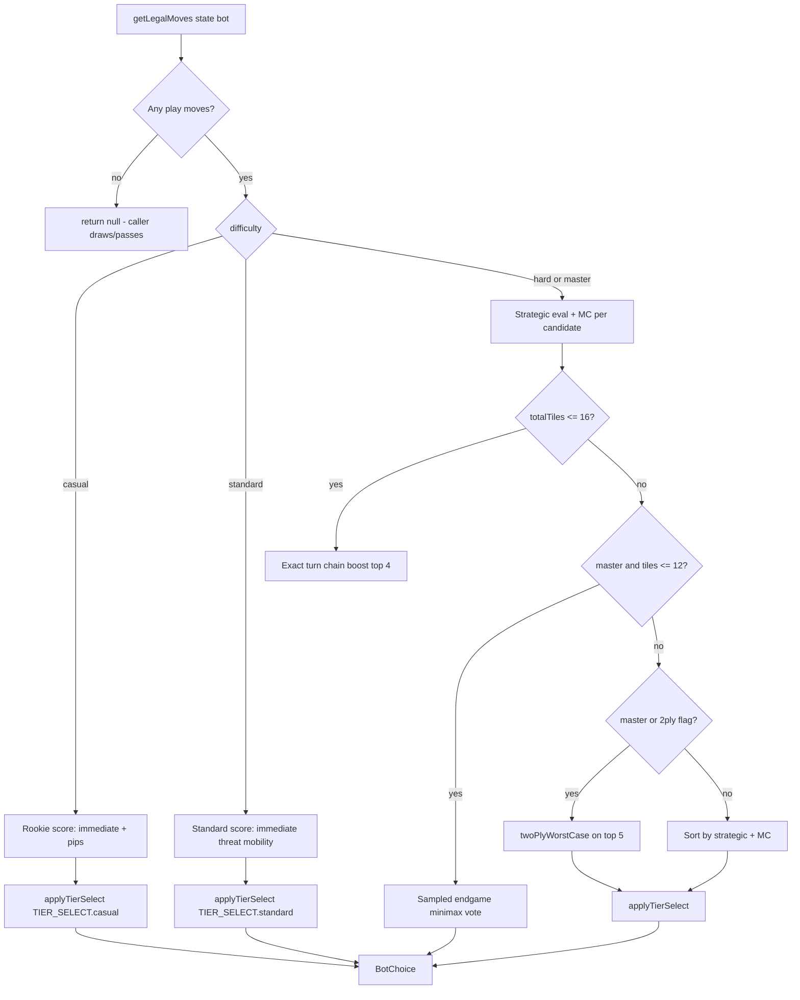

# Fritz Difficulty Tiers — Source-of-Truth Audit

**Audit date:** 2026-06-01  
**Scope:** How Fritz difficulty tiers are defined, selected, and expressed in gameplay across Play vs Fritz, Daily Fritz, tournament bot fill, Ghost/Learn paths, and ranked persistence.  
**Mode:** Read-only — no code, rules, or tuning changes in this pass.

**Related docs (shell/transport, not tier depth):**

- `docs/fritz-bot-modes-source-of-truth-audit.md` — shared `BotMatchScreen` architecture, hand lifecycle, APIs
- `docs/daily-fritz-skunk-source-of-truth.md` — skunk rules (separate from AI tier but affects Daily Fritz feel)
- `docs/fritz-bot-modes-p0-stabilization-report.md` — recent hand/bot async guards

---

## Executive summary

Fritz difficulty is **real for Play vs Fritz**: four UI tiers map to four distinct `BotDifficulty` engines in `botHeuristics.ts` (`casual` / `standard` / `hard` / `master`). Lower tiers use **simpler evaluation**, **weaker move selection** (rank-decayed pools + occasional random legal moves on Rookie), and **no Master-only endgame search**. Elite and Master are both strong; Master adds sampled endgame minimax and always-on two-ply worst-case among top candidates.

**Daily Fritz is not player-adjustable:** each day’s run stores a `fritz_tier` on the server (default **`elite`** at generation). In match, `BotMatchScreen` maps that tier → `FRITZ_TIERS[*].difficulty` → `chooseBotMove`. Deals are **deterministic and symmetric** (same shuffle gives player and Fritz tiles); difficulty pressure comes from **AI strength + best-of-3 + skunk rules**, not rigged hands.

**Tournament bots use a separate server AI** (`serverBot.ts`) with only **standard / elite / master**, scaling by bracket round. **Ghost** does not use Fritz tiers for play—it replays/style-blends the player’s ghost and only calls `chooseBotMove(..., 'hard')` as a threat reference.

**Cosmetic-only for all modes:** 1500ms Fritz “thinking” delay, tier colors/copy, Glicko rating labels.

**Gap:** No automated win-rate-by-tier metrics, no behavior tests for Rookie/Standard/Master, and **no proof that Rookie feels ~600 Elo** to humans.

---

## 1. Main files involved

### Client — AI & config

| File | Role |
|------|------|
| `client/src/bot/fritzConfig.ts` | Tier IDs, labels, **UI → `BotDifficulty` map** (`rookie`→`casual`, `standard`→`standard`, `elite`→`hard`, `master`→`master`) |
| `client/src/bot/botHeuristics.ts` | **`chooseBotMove`**, tier selection (`TIER_SELECT`), strategic/MC eval, Master endgame search |
| `client/src/bot/botEngine.ts` | Rules engine (legal moves, play/draw/pass, scoring); **no tier logic** |
| `client/src/bot/BotMatchScreen.tsx` | Wires `fritzTier` → `FRITZ_TIERS[fritzTier].difficulty`; bot effect; 1500ms think delay |
| `client/src/bot/PlayVsFritz.tsx` | Tier picker UI; default selection **elite** |
| `client/src/bot/benchmark.ts` | Headless paired bot-vs-bot sim (`runSeededMatch`); **not in CI** |
| `client/src/bot/botHeuristics.behaviorTests.ts` | Position tests; **all use `hard` only** |
| `client/src/bot/handLifecycle.ts` | Hand advance guards (not tier-specific) |

### Client — Daily Fritz

| File | Role |
|------|------|
| `client/src/dailyFritz/DailyFritzScreen.tsx` | Hub; passes `fritzTier={activeRun.fritz_tier}` into match |
| `client/src/dailyFritz/api.ts` | `/api/daily-fritz/*` client |
| `client/src/dailyFritz/skunk.ts` | Skunk display helpers (threshold 30) |
| `server/src/dailyFritz.ts` | Deterministic deal generation per date/game/hand index |
| `server/src/dailyFritzSkunk.ts` | Set assembly, instant skunk, leaderboard rank tiers |
| `supabase/daily_fritz.sql` | `daily_fritz_runs.fritz_tier` column |

### Client — Ghost / Learn

| File | Role |
|------|------|
| `client/src/ghost/logic.ts` | Ghost move picker; **`chooseBotMove(state, 'hard')`** for Fritz-threat estimate only |
| `client/src/ghost/GhostSetupScreen.tsx` | Ghost training/unlock UX (not Fritz tier) |
| `client/src/learn/LearnScenarioScreen.tsx` | Coach “best move” via **`chooseBotMove(..., 'hard')`** |
| `client/src/learn/guidedMatch/guidedMatchRecorderEngine.ts` | Recording Fritz moves at **`standard`** |
| `client/src/learn/guidedMatch/*` | Guided lessons: **scripted Fritz** in match; live AI often disabled |

### Server — tournament / MP / ranked

| File | Role |
|------|------|
| `server/src/bot/serverBot.ts` | **`chooseBotMoveServer`** — MP/tournament; tiers **standard \| elite \| master** only |
| `server/src/scheduledTournament/engine.ts` | **`botTierForRound`**: R1 standard, R2 elite, R3 master |
| `server/src/scheduledTournament/matchDispatch.ts` | Sets `room.scheduledTournamentBotTier` from `match.bot_tier` |
| `server/src/multiplayer/botSeating.ts` | Seats synthetic Fritz bot in room |
| `server/src/ranking/glicko2.ts` | Fritz opponent IDs + ratings per tier; includes **Grandmaster** id (not in client PVF picker) |
| `server/src/index.ts` | Daily run ensure (`fritzTier ?? 'elite'`), local ranked PVF `fritzTier` on verify |

### Tests & docs

| File | Covers |
|------|--------|
| `client/src/bot/botHeuristics.behaviorTests.ts` | Strategic behavior at **`hard`** |
| `server/src/dailyFritzSkunk.test.ts` | Skunk/set rules |
| `server/src/ranking/fritzRating.test.ts` | Glicko vs Master id |
| `server/src/scheduledTournament/engine.test.ts` | QF bots **standard**, later rounds tiered |
| `server/src/scheduledTournament/tournamentHumanBotFlow.test.ts` | Human vs **elite** bot flow |
| `docs/fritz-bot-modes-source-of-truth-audit.md` | Mode shell (complement to this doc) |

---

## 2. Current Fritz tiers

### Product tiers (Play vs Fritz + Daily Fritz DB)

| UI / DB tier | Fritz UUID (ranked) | Rating label | `BotDifficulty` | Where selected |
|--------------|---------------------|--------------|-----------------|---------------|
| **Rookie** | `…0002` | 600 | `casual` | PVF picker only |
| **Standard** | `…0003` | 1000 | `standard` | PVF; Learn guided capture/recorder |
| **Elite** | `…0001` | 1800 | `hard` | **PVF default**; **Daily Fritz default**; Ghost threat baseline |
| **Master** | `…0004` | 2400 | `master` | PVF picker; tournament finals |

**Grandmaster** (`…0005`, 2400 Glicko) exists in `glicko2.ts` for ranked identity but **not** in `fritzConfig.ts` or `chooseBotMove` — treat as legacy/ranked-only unless wired later.

### Selection & defaults per mode

| Mode | Who picks tier | Default | Persisted |
|------|----------------|---------|-----------|
| **Play vs Fritz** | Player on setup screen | UI state **`elite`** (`PlayVsFritz.tsx`); `App.tsx` `botFritzTier` also defaults **`elite`** | Optional ranked: `fritz_tier` on `verified_single_player_matches` + `bot_match_pending`; stats `tierRecords` in `statsApi.ts` |
| **Daily Fritz** | **Nobody** (per-run field) | **`elite`** when server creates run (`ensureDailyFritzRunForDate`) | `daily_fritz_runs.fritz_tier` for that calendar date; admin generate can pass tier |
| **Tournament bot** | Bracket engine | R1 **standard**, R2 **elite**, R3 **master** | `scheduled_tournament_matches.bot_tier` |
| **Casual MP Fritz room** | Room config / bot id heuristic | **`elite`** if unset (`getFritzTierForRoom`) | Room + pending bot match rows |
| **Ghost** | N/A (plays ghost model) | Threat eval uses **`hard`** | Ghost profile rating, not Fritz tier |
| **Learn / Guided** | Lesson authoring | Recorder **standard**; scripted steps | Candidate metadata `fritzTier: 'standard'` |

Daily Fritz tier is **the same for every player on that date** (one run row per `run_date`). It can differ day-to-day only if ops change `fritz_tier` when generating/invalidating runs—not a player setting.

---

## 3. What difficulty actually changes

Legend: **Gameplay** = move choice; **Cosmetic** = labels/timing only.

### By `BotDifficulty` (via `fritzConfig` mapping)

| Behavior | Rookie (`casual`) | Standard (`standard`) | Elite (`hard`) | Master (`master`) |
|----------|-------------------|----------------------|----------------|-------------------|
| **Move evaluation model** | Immediate score + pip unload only | Immediate + threat + mobility + self-opportunity (no MC/strategic stack) | Full `evaluateStrategicMove` + `mcEvaluateMove` (35% MC blend) | Same as Elite + **Master endgame path** |
| **Move selection randomness** | ~4% uniform random legal; ~31% non-best from pool | ~14% non-best (rank-decayed) | ~3% non-best | **Deterministic** best (pool 1, pBest 1.0) |
| **MC samples** | N/A (branch not used) | N/A | 8 | **20** |
| **Chain / turn-order search** | N/A | N/A | `searchChainTree` + exact turn chain top-4 when ≤16 tiles | Wider dynamic chain params (`master` strength) |
| **Endgame search (≤12 tiles total)** | N/A | N/A | Minimax only via shared MC path thresholds | **Sampled-hand IS-MCTS-style** (16 samples, depth 6–12) |
| **Two-ply worst-case wrapper** | No | No | Off (`ENABLE_TWO_PLY_WORST_CASE = false`) | **Always on** for top 5 candidates |
| **Doubles / blocking / draw strategy** | Weak (ignores most strategic penalties) | Partial (threat/mobility only) | Full strategic + refill-risk, golden finish, orphan penalties | Full + stronger endgame minimax |
| **Lookahead depth** | None | None | MC + chain depth 5–7 (tile-count scaled) | + endgame minimax + 2-ply |
| **“Human mistakes”** | Yes — intentional suboptimal picks | Mild suboptimal picks | Rare suboptimal | None |
| **Thinking delay** | 1500ms | 1500ms | 1500ms | 1500ms |
| **Fair mode (hidden hand)** | Yes (`toBotVisibleState`) | Yes | Yes | Yes |

### Tier selection parameters (`TIER_SELECT` in `botHeuristics.ts`)

```text
casual:   poolSize 5, pBest 0.69, pRandom 0.04  → ~34% non-best overall
standard: poolSize 4, pBest 0.86, pRandom 0.00  → ~14% non-best
hard:     poolSize 3, pBest 0.97, pRandom 0.00  → ~3% non-best
master:   poolSize 1, pBest 1.00               → 0% suboptimal selection
```

PRNG for tier selection is **seeded from board/hand state** (`createStatePrng(state, 'tier-select')`) → **deterministic per position** on client Fritz.

### Server tournament bot (`serverBot.ts`) — not identical to client

| Tier | Evaluation | Selection | Notes |
|------|------------|-----------|-------|
| **standard** | Same simplified formula as client Standard | `tierSelect` with **Math.random()** | No rookie tier |
| **elite** | MC + chain (mirrors hard) | Randomized tier select | Default `chooseBotMoveServer` tier |
| **master** | Deeper `TIER_SEARCH`, stronger endgame minimax | Randomized tier select | Stronger than client in some endgame depths |

**Parity risk:** Server bot uses **non-seeded** `Math.random()` for suboptimal picks; client uses seeded PRNG. Tournament bots may feel slightly different from PVF Elite at same label.

### What does **not** change by tier

- Racehorse rules, 60-point race, draw/pass, boneyard lock (2 tiles), doubles turn continuation (`botEngine.ts`)
- Daily Fritz deal contents (tier does not alter shuffle)
- Hand reveal / auto-advance timings (1400ms + 5000ms in DF)
- Skunk threshold (30) or set format

---

## 4. Bot decision flow

High-level pipeline for **client Fritz** (`chooseBotMove`):



### Step detail

1. **Legal moves** — `getLegalMoves` / `getPlayMoves` in `botEngine.ts`: opening filter (doubles or scoring starters), then all open ends + branch arms.
2. **Candidate scoring** — tier-specific (see §3).
3. **Hard/Master extras**
   - `buildUnseenPool` + `opponentHoldWeights` from pass/missing-pip inference
   - `evaluateStrategicMove`: immediate ×34, end control, danger, orphans, doubles discipline, refill/golden/safe-finish bonuses
   - `mcEvaluateMove`: chain tree total points, threat delta, aggression near 60
   - `searchExactTurnChain` (45ms budget) on top strategic candidates when ≤16 tiles remain
4. **Tie-breaking** — `compareMoveStable` (tile numeric, then position string).
5. **Forced draw/pass** — Not chosen by `chooseBotMove`; `BotMatchScreen` runs `runDrawSequenceLocal` → `drawUntilPlayableOrEmpty` when no plays.
6. **Greedy fallback** — If timed out / edge cases: max immediate score (`greedyFallback`).

**Ghost path:** `pickStyleWeightedMove` scores legal moves from **player style profile**, optionally biased by `chooseBotMove(..., 'hard')` threat estimate—not by user-selected Fritz tier.

**Guided path:** Fritz moves often come from **lesson script**; bot effect returns early when `isGuidedTranscriptMode`, `isGuidedV2Mode`, etc.

---

## 5. Daily Fritz difficulty audit

### Tier used

- Stored on `daily_fritz_runs.fritz_tier` for each `run_date`.
- New runs: **`options?.fritzTier ?? 'elite'`** in `ensureDailyFritzRunForDate` (`server/src/index.ts`).
- Match: `DailyFritzScreen` → `BotMatchScreen` `fritzTier={activeRun.fritz_tier}` → **`hard`** AI for default production behavior.

### Same every day?

- **Per calendar day:** one tier per run row (typically elite unless ops regenerate with another tier).
- **Not adaptive** to player skill, completion history, or streak.

### Deal generation fairness

- `generateSingleDailyFritzHand(seed, handIndex, dealSize)` — deterministic shuffle; **player and Fritz get symmetric deal slices** (tiles 0–6 vs 7–13 for 7-tile).
- No engine bias giving Fritz hotter tiles on a given day.
- **Still feels brutal** because:
  - Same deals for everyone do not guarantee equal *skill-adjusted* win chance
  - Fritz plays near-optimal **`hard`** with rare 3% slips
  - Race-to-60 within each game rewards efficient chaining

### Expert / deterministic play

- Fritz uses full heuristic + MC with fair hidden-hand mode (no peeking at player tiles).
- Reproducible: same date + game + hand index → same starting tiles; same board state → same Fritz move (seeded tier-select).

### Can weaker players win sometimes?

- **Yes, but infrequently** against Elite: no intentional mistake model at hard tier; player needs tactical errors from Fritz’s 3% pool or superior domino luck + race timing.
- No “casual Daily Fritz” product surface today.

### Skunk interaction (amplifies harshness)

From `docs/daily-fritz-skunk-source-of-truth.md`:

| Rule | Casual impact |
|------|----------------|
| Lose game with **&lt; 30** points = skunk | One bad game can feel humiliating on leaderboard (“skunked”) |
| **Game 1 skunk** ends entire daily set **0–2 / 2–0** | Single dominant Fritz game ends the whole daily attempt instantly |
| **Game 2 skunk at 1–1** ends set immediately | Comeback window tiny |
| Game 3 skunk | Badge only (set already 1–1) |

Skunk is **independent of AI tier** but multiplies how punishing Daily Fritz feels for players who fall behind early in a game.

### Should there be a casual / standard daily variant later?

**Product question (see §11):** Technically trivial to store `fritz_tier: 'standard' | 'rookie'` on run generation; would require separate leaderboard buckets or labeled “Casual Daily” so Elite LB integrity stays intact.

---

## 6. Play vs Fritz difficulty audit

### Setup options

- **4 tiers** + **7 vs 14** tile deal (`PlayVsFritz.tsx`).
- Copy positions Elite as “Maximum strength” / “The original Fritz.”

### UX clarity

- Tier cards are visible on setup; default highlight is **Elite** (third tier psychologically easy to miss-change).
- Rookie is available but not the default—**weaker players must actively downgrade**.

### Easiest tier actually easier?

- **Yes, materially:** different code path (`casual`), not just label.
- Rookie does **not** use strategic/MC stack; ~34% non-best/rando moves.
- **Not validated** by win-rate tests vs humans or vs Standard.

### Ranked / persistence

- Logged-in PVF can start verified match with selected `fritzTier` → Glicko opponent id from `getFritzIdentityForTier`.
- `statsApi` aggregates wins/losses per `FritzTierKey` for profile stats.
- Losing to Elite updates rating vs 1800-strength opponent; beating Rookie has lower competitive signal.

---

## 7. Tournament Fritz bot audit

### Tier by round (`engine.ts`)

| Round | `bot_tier` |
|-------|------------|
| 1 (QF) | `standard` |
| 2 (SF) | `elite` |
| 3 (F) | `master` |

Bots fill empty seats in 8-player brackets (`buildBotEntrants`); humans seeded by rating.

### vs client Fritz

- **Different codebase** (`serverBot.ts` vs `botHeuristics.ts`).
- **No rookie** tournament tier.
- **Randomized** suboptimal move selection on server vs seeded on client.

### Fairness to casual players

- Early round bots are **Standard** (weaker than Daily Fritz’s Elite).
- Later rounds ramp; a casual who reaches finals faces **Master** server bot—appropriate for competition but sharp difficulty cliff.

### Product intent check

- Current design: **escalating challenge through bracket**, not uniform “Daily Fritz difficulty.”
- If goal is inclusive tournaments, consider capping fill bots at **standard** for whole event or split divisions.

---

## 8. Player experience / retention audit

| Persona | Likely experience today | Drivers |
|---------|-------------------------|---------|
| **Strong / experienced** | Daily Fritz & Elite PVF feel like “real” competition | `hard`/`master`, chain + MC, rare mistakes |
| **Average** | PVF Standard viable; Daily Fritz often too strong | DF fixed Elite; no practice daily |
| **Older / casual** | Daily Fritz frustrating; may not find Rookie | DF no tier choice; PVF defaults Elite; skunk ends run fast |
| **First-time** | Learn uses scripted/hard coach; PVF default Elite punishing | Defaults + daily spotlight on hardest routine |
| **Learning Racehorse rules** | Coach shows `hard` best move; Fritz in lessons scripted | Gap between lesson advice and live Elite Fritz |

### Observed design patterns (from code, not telemetry)

| Pattern | Present? |
|---------|----------|
| Many near-perfect scoring lines | **Yes** at hard/master |
| Human-like mistakes | **Rookie/Standard only**; rare at Elite |
| Punish every missed score | Strong threat/opportunity modeling at hard+ |
| End hands efficiently | Chain tree + exact turn chain + endgame search |
| Repeated skunks (DF) | Possible G1/G2 instant set end |
| Comeback moments | Possible in dominoes, not aided by AI rubber-banding |
| Perceived fairness | Deals fair; **skill gap unfair** for casual vs Elite |
| Explain why Fritz won | `explainStrategicMove` exists in dev/coach paths; **not prominent post-game for casual DF** |

---

## 9. Data / testing audit

### Existing automated tests

| Suite | Tier coverage |
|-------|----------------|
| `npm run test:bot` (`botHeuristics.behaviorTests.ts`) | **hard only** (11 strategic scenarios) |
| `npm run test:hand-lifecycle` | No tier |
| `server` `dailyFritzSkunk.test.ts` | Skunk only |
| `fritzRating.test.ts` | Master Glicko identity |
| Tournament engine tests | `bot_tier` assignment by round |

### Metrics in product today

| Metric | Available? |
|--------|------------|
| Fritz win rate by tier | **Partial** — player stats `tierRecords` (PVF); not aggregated server-side for tuning |
| Player win rate vs Fritz (DF) | Leaderboard win/loss per attempt; **no public completion-rate dashboard in repo** |
| Daily Fritz completion rate | Would need SQL on `daily_fritz_attempts` — **not wired to analytics in code** |
| Skunk rate | Stored in set `games[].skunk`; **no built-in reporting** |
| Average score margin | Possible from attempt payloads; **not pre-aggregated** |
| Average games per set | Derivable from set results |
| Casual tier performance | **No** |
| Deterministic sims | `benchmark.ts` only |

### Recommended logging (if tuning pass comes later)

- `chooseBotMove` exit: `{ difficulty, tierSelectBranch, ms, totalTiles, immediateScore }` (sampled, dev-only flag)
- Daily Fritz complete: `{ runDate, fritz_tier, won, skunkBy, gamesPlayed, playerGamesWon, margin }`
- PVF game over: `{ fritzTier, won, margin, dealSize }`

---

## 10. Simulation recommendation

**Smallest useful harness** (extend existing `client/src/bot/benchmark.ts`, do not new subsystem):

1. **Tier ladder sanity** — 500 seeds × paired matches: `casual` vs `hard`, `standard` vs `hard`, `hard` vs `master`; report win% and average margin. Expect monotonic strength.
2. **Rookie humanity check** — Measure **blunder rate** (immediate points left on table) vs `hard` on same seeds.
3. **Daily Fritz replay** — Load N historical `run_date` seeds from DB or fixture JSON; play `hard` bot vs itself with player seat swapped; distribution of game length / skunk rate.
4. **Skunk frequency by tier** — Run race-to-60 games per tier; count losses with opponent &lt; 30 (PVF has no skunk flag today—add metric in sim only).
5. **Server/client parity sample** — Export 100 positions; compare `chooseBotMove` vs `chooseBotMoveServer` move equality rate for elite.

**Invocation sketch:** `npx ts-node --esm src/bot/benchmark.ts --seeds 200 --tier-a casual --tier-b hard` (CLI args would be a small follow-up; script already has `runPairedBenchmark`).

**CI:** Optional nightly job, not PR gate—runtime can be minutes at 500+ seeds with Master.

---

## 11. Product recommendation

Based on code audit (not player research):

| Option | Assessment |
|--------|------------|
| **Keep Daily Fritz hard; easier practice elsewhere** | Aligns with current architecture; **ensure PVF Rookie/Standard are discoverable** (default tier, hub copy, post-loss nudge). Lowest risk. |
| **Daily Fritz difficulty variants** | Technically easy (`fritz_tier` on run); needs **separate leaderboards** or labeled tracks. |
| **Adaptive Daily Fritz** | **Not implemented**; would need skill model + anti-exploit design—large scope. |
| **“Daily Fritz Classic” vs “Casual”** | Good brand split: Classic = elite + main LB; Casual = standard/rookie + no skunk or softer skunk. |
| **Tune Rookie** | Code already distinct; may need **stronger mistake rate** if win% vs casual humans still &lt;35%. |
| **Add randomness to lower tiers only** | Already present; Elite could add **1%** slip only if data shows stomps—risky for “daily integrity.” |
| **Reduce skunk harshness for casual mode only** | Product lever independent of AI; e.g. disable G1 instant set-end for Casual track. |
| **Better explanations vs weaker Fritz** | Coach/`explainStrategicMove` exists; **post-game “why Fritz scored”** helps retention without weakening Elite daily. |

**Recommended default stance:** **Do not weaken global Daily Fritz Elite** until metrics show completion collapse; **do** surface **Rookie/Standard PVF** as the on-ramp and consider a **second daily track** if DF completion is low among new accounts.

---

## 12. P0 / P1 / P2 / P3 plan

### P0 — Correctness (tiers fake/broken)

| Item | Finding |
|------|---------|
| Tiers are real on client | **Pass** — separate code paths |
| Daily tier wired to AI | **Pass** — `fritz_tier` → `FRITZ_TIERS` → `chooseBotMove` |
| Daily default = Elite | **Pass** — intentional but harsh for casuals |
| Tournament tier scaling | **Pass** — round-based |
| Grandmaster in Glicko but not PVF | **Minor inconsistency** — document or remove from ranked-only |
| Server vs client Elite parity | **Risk** — different RNG/subtleties; not P0 broken but worth a spot-check |

No P0 “tier is cosmetic only” bug found for PVF/Daily.

### P1 — Fairness / difficulty tuning

- Lower **PVF default** to **standard** for new accounts (feature flag or first-N-games)—product decision.
- Daily Fritz: ops playbook to spawn `standard` runs for test weeks; measure completion.
- Review **G1 skunk instant end** for casual track only.
- Validate **Rookie** win rate via simulation (§10) before marketing “beginners.”

### P2 — Metrics / simulations

- Run benchmark ladder; publish internal table.
- SQL dashboard: DF completion %, skunk rate, avg `fritzGamesWon`, margin.
- Add tier-differentiation tests (Rookie picks lower immediate than hard on fixture boards).

### P3 — UX / teaching

- Post-hand Fritz rationale snippet on DF loss.
- Hub copy: “Daily Fritz uses Elite Fritz” + link to Rookie PVF.
- Learn mode: align coach tier with recommended practice tier.

---

## 13. Recommended next prompt

Use this as the smallest safe follow-up implementation/tuning pass:

> **Run the tier ladder simulation in `client/src/bot/benchmark.ts` (200 seeds): Rookie vs Standard vs Elite vs Master, reporting win rate and average margin. Add 3 behavior tests proving Rookie/Standard sometimes deviate from hard on fixed boards. If Rookie beats hard &lt;15% or &gt;45%, stop. Then propose only: (a) PVF default tier change, and/or (b) a separate `daily_fritz_runs` casual track spec—no AI rewrite, no skunk changes, until sim results are reviewed.**

---

## Definition of done (this audit)

After reading this doc you should know:

1. **Where** tiers are defined (`fritzConfig` → `botHeuristics` `BotDifficulty`).
2. **That tiers matter** for PVF (real algorithms + mistake rates); Daily Fritz uses run-stored tier (default Elite → `hard`).
3. **Why Daily Fritz feels hard:** fixed Elite AI + symmetric but unforgiving race play + skunk set endings + no player difficulty choice.
4. **Safest next step:** simulate tier strength, then adjust defaults or add a casual daily **track**—not blind Elite nerfs.

---

*End of audit — read-only, 2026-06-01.*
