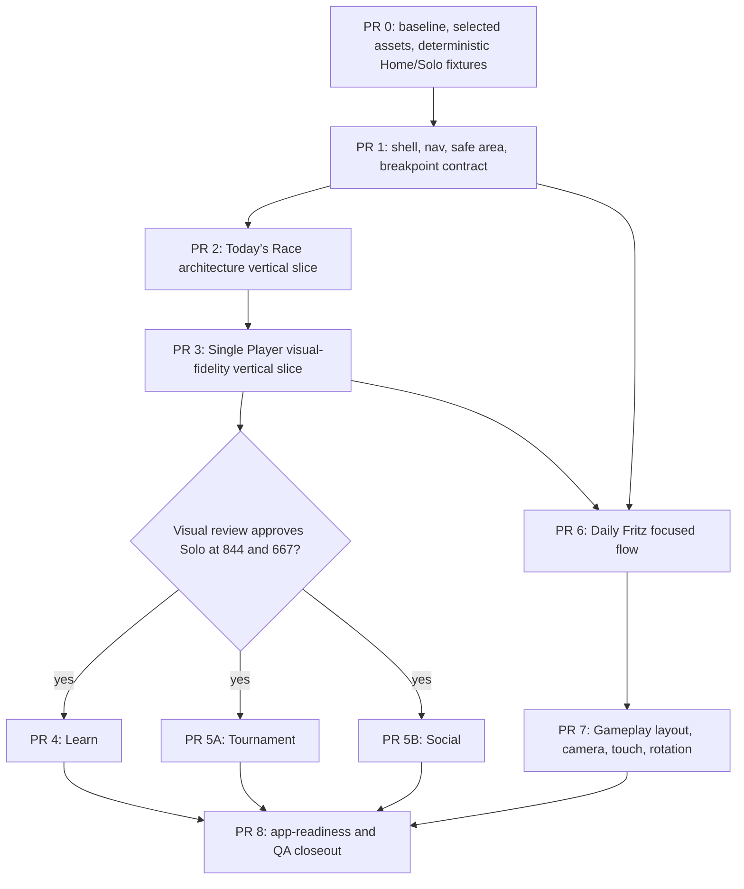

# Implementation roadmap and risk register

This is the ratified delivery order. No production UI implementation is included in this planning package. PR 3 is a hard visual-fidelity gate before broad hub migration.

## Dependency graph

PR 2 proves shell architecture with Home. PR 3 proves that architecture can reproduce the approved Solo art/composition quality. Learn, Tournament and Social **do not begin** until PR 3's 844×390 and 667×375 visual review passes. PR 5 is split into 5A/5B because tournament realtime/registration and social feed/presence have independent risks and rollback boundaries. Daily Fritz can be prepared after shell but does not merge ahead of the PR 3 gate. Gameplay is a separate domain presentation workstream after focused-flow chrome and fixtures are stable.

## PR phases

| Phase | Purpose/scope | Files likely touched | Acceptance / automated checks | Non-goals and rollback |
|---|---|---|---|---|
| 0. Baseline/assets/fixtures | commit fixture adapters and schema, approved Home/Solo asset derivatives if needed, pre-change screenshots/budgets | `client/e2e/fixtures/mobile/*`, guarded E2E auth/friends seams, `docs/mobile-redesign/*`, asset-only files | deterministic signed-in Home/Solo states, no production-value defaults, six-size baseline retained | no production page CSS or shell; revert fixture/art commit |
| 1. Shell contract | one route presentation descriptor, safe-area owner, existing five-area phone/desktop nav, identity collapse, unified breakpoint | `App.tsx`, route composition/metadata, `GlobalNav`, `AppBottomTabBar`, nav CSS, tokens/config, shell tests | phone one nav; Multiplayer first tab, Home no selected tab; account always; desktop unchanged; portrait hubs; no dual nav | no page visual overhaul or domain state move; revert shell commit |
| 2. Today’s Race architecture slice | bounded Home two-card/streak composition, selected art and Home fixture states | `HomeScreen.tsx`, `RacehorseHomeArt.css`, `home-hub.css`, Home-owned small primitives | conformance T1 at 844, geometry at six sizes, desktop screenshots, CTAs/streak reachable | no Solo/Learn work; revert Home-only commit |
| 3. Single Player fidelity slice | three-card Solo layout with approved art, stats, CTA, small-width rail; human visual gate | `SinglePlayerHubScreen.tsx`, `SinglePlayerModes.css`, validated shared card/art/CTA parts | Solo T1 at 844 and 667 human-reviewed, fixture states, desktop parity, tap/focus | no Learn or game logic; revert Solo-only commit |
| 4. Learn | 2×2 education grid and focused lesson shell; isolate four art crops | `LearnHome.tsx`, `learn.css`, Learn assets | four card/lock/action states, 844/667, lesson back; desktop parity | no authoring logic; revert Learn route |
| 5A. Tournament | event/countdown/schedule hub then bracket/result detail fit | tournament hub/bracket/result presentation | register/registered fixtures, realtime behavior parity, 844/667 | no tournament engine/socket changes; route rollback |
| 5B. Social | feed/sidebar hub and focused profile/detail | social hub/feed/detail CSS/components | populated/online fixtures, filter/challenge/accessibility, 844/667 | no feed backend/socket protocol changes; route rollback |
| 6. Daily Fritz | focused setup, set progress, leaderboard/results | Daily Fritz view/CSS and route presentation | fresh/in-progress/completed fixtures; verifier and resume tests | no score/write/session logic; route rollback |
| 7. Gameplay | region allocation, touch path, measured rotate recommendation and camera fit | match layout/HUD/board/hand view CSS/components, camera presentation measurement | legal move/draw/pass/reconnect/result fixtures, six sizes, exact action parity, portrait recovery | no game rules/bot/transport; presentation rollback |
| 8. App-readiness/QA | close safe areas, history, lifecycle, accessibility, performance and visual CI | targeted frontend/test/docs only | seven screens accepted, device/browser matrix, budgets or trace-backed waiver | no native package/store release; isolated fix rollback |

Each PR runs relevant unit/behavior tests, `npm run check:architecture --prefix client`, builds when source changes, desktop screenshot comparison, mobile screenshot/touch checks, and a summary of changed screens. This project is UI behavior work: add tests alongside intended behavior changes. The repository handoff instruction requiring lint/typecheck/architecture/relevant tests before push applies to review-engine work; follow it if a future PR touches those deliverables.

## Release acceptance criteria

1. All seven surfaces have an approved 844×390 screenshot, with state fixtures and screenshots reviewed against target hierarchy/crop and branded matte/navy surfaces.
2. All six landscape widths work with no horizontal document overflow; no required title/action/control is clipped, under header, behind tabs, or unreachable without a named scroll region.
3. Desktop reference screenshots (at least 1440×900 and 1280×720) show no unintended regression in shell, typography, card grid, board geometry, or nav.
4. Primary control targets are ≥44×44px where practical; any smaller dense control satisfies spacing exemption or has a deliberate alternative. Tap-only flows complete without hover, right-click or drag requirement.
5. One primary nav location per phone screen; tab selected state, contextual back, modal back, active match escape and browser history follow documented behavior.
6. Safe-area tests pass on representative notched iPhone landscape/portrait, Android cutout and browser/PWA display mode; content and hitboxes stay inside usable insets.
7. Accessibility: semantic landmarks/buttons, keyboard/focus return, readable contrast, screen-reader labels, reduced-motion behavior and 44px target audits pass.
8. Gameplay: representative match flows retain exact action results and server/domain invariants; board, hand, legal placements, draw/pass, reconnect and result flow remain operable at target sizes.
9. Screenshot suite is deterministic; no unstable rating/date/timer/socket content outside approved masks; CI reports visual artifacts and does not silently regenerate baselines.
10. Performance budgets in `APP_READINESS_AND_VISUAL_QA.md` are met or explicitly waived with trace evidence; no avoidable image-induced layout shift.

## Risk register

| Risk | Likelihood / impact | Mitigation / evidence |
|---|---|---|
| Width-only breakpoint classifies 844–932 landscape phone as desktop | High / High | Add viewport matrix and short-height/available-space policy; retain specific web platform device QA. |
| Shell refactor duplicates auth/profile/friend work or changes routing behavior | Medium / High | One surface descriptor and single nav owner, keep `App` runtime/state owners, test direct URL/popstate/modal/match escape before migrating pages. |
| Gameplay CSS/camera is coupled across bot, Ghost, Daily Fritz, tournament and multiplayer | High / Critical | Isolate presentation adapter/regions; no game core changes; fixed game fixtures; compare action state and camera behavior. |
| New artwork missing, wrong crop, or too heavy | High / Medium | Asset manifest before commissioning; test crops at 667 width; 180/350KB art target; lazy load and responsive derivatives. |
| Safe-area/dvh differs across Safari, standalone/PWA, WebView or Android cutouts | Medium / High | Root ownership, `viewport-fit=cover`, actual-device matrix; no per-screen padding; include visual inset probe. |
| Desktop regression from global token or nav changes | Medium / High | Keep semantic mobile token layer; desktop reference screenshots per PR; scope route changes; rollback independently. |
| Visible shell changes leave product half-migrated between PRs | Medium / Medium | First shell PR establishes common header/nav, then each migrated route remains visually coherent; avoid flag unless rollout truly needs cohort. |
| Component over-abstraction or seven duplicative implementations | Medium / Medium | Extract only proven repeatable patterns; page owns content hierarchy; use small feature card/panel primitives, not universal page renderer. |
| Dual top and bottom navigation persists on some pages | High / Medium | Route presentation owns nav visibility; one automated “no dual nav on phone” assertion. |
| Visual screenshot brittleness from live data/timers | High / Medium | Fixture API/socket/time, fixed fonts/browser, tiny explicit masks and stable state capture. |
| Body-level clipping hides inaccessible content while h-overflow test passes | High / High | Assert CTA visibility/reachability, scroll ownership, viewport intersections and bottom-bar collision; don't trust document dimensions alone. |
| Deep-link/history cannot restore transient active match for native app | Medium / High | Define match session restoration/history during app-readiness phase before packaging; avoid route-state fork. |
| Touch-only accessibility regressions in canvas/drag board | Medium / Critical | Tap-tap primary placement, accessible legal action path, screenreader test and target audit; gesture tested on device. |
| More image layers/glows cause jank or memory growth | Medium / High | Measure decoded peak and real-device frame time; lazy load, fixed aspect and limited compositor effects. |
| Existing initial JS is already above proposed target and Home art preloads on every route | High / Medium | Pre-change trace records 414–461 KB route JS gzip and 96.5 KB Home art on non-Home routes; PR 0/2 verifies route-aware preload, PR 8 closes bundle gap or records trace-backed waiver. |
| Generated reference contains fake device UI/text/data | High / Low | Use it for layout/visual language only; product data and controls remain real and semantic. |

## Rollout strategy

Default to CSS/layout behavior selected by responsive size and existing routes. A feature flag is not justified for pure responsive CSS and doubles maintenance. Route isolation already exists as normal route/domain components. Introduce a server/remote flag only if shell ownership change cannot be safely shipped as one user-visible coherent shell release; the owner must specify cohort rollback objective first.
