# Multiplayer Architecture Boundary Enforcement — Engineering Report

**Date:** 2026-07-05  
**Scope:** Automated dependency boundary enforcement for multiplayer protocol/runtime layers  
**PR objective:** Convert architectural conventions into self-enforcing CI rules  
**Stance:** Principal Engineer refinement — no behavior changes

---

## Implemented: Architectural Boundary Enforcement

**Added dependency-cruiser rules** with a dedicated CI gate (`check:multiplayer-arch`) that fails on any violation within `src/multiplayer/` protocol and runtime layers.

Tooling choice: **dependency-cruiser** (already installed, already in CI for general dependency checks). Minimum addition — no new packages, no ESLint plugin, no file moves.

---

## Architecture Rules Enforced

| Rule ID | Layer | Enforcement |
|---------|-------|-------------|
| `mp-protocol-isolated` | Protocol | `src/multiplayer/protocol/` may not import anything else under `src/multiplayer/` |
| `mp-protocol-no-ui` | Protocol | Protocol may not import any `.tsx` file |
| `mp-runtime-no-multiplayer-internals` | Runtime | Runtime may only import `protocol/`, peer `runtime/`, `roomTransport.ts`, `friendChallenge.ts` within multiplayer |
| `mp-runtime-no-ui` | Runtime | Runtime may not import `.tsx` screens or `src/components/` (grandfather: `RoomReactions` type-only import) |
| `mp-protocol-runtime-acyclic` | Protocol + Runtime | No circular dependencies between protocol and runtime modules |

### Mapping to architectural intent

| Intent | How enforced |
|--------|--------------|
| Protocol never imports runtime | `mp-protocol-isolated` |
| Protocol never imports UI/controllers | `mp-protocol-isolated` + `mp-protocol-no-ui` |
| Runtime may import protocol | Allowed (not forbidden) |
| Runtime may not import UI | `mp-runtime-no-ui` |
| Runtime may not import controllers/hooks/transport | `mp-runtime-no-multiplayer-internals` |
| Controllers may not be imported by runtime | `mp-runtime-no-multiplayer-internals` |
| Protocol/runtime remain acyclic | `mp-protocol-runtime-acyclic` |
| No behavior changes | Rules are import-only analysis |

### Deliberately not enforced in this PR

| Area | Reason |
|------|--------|
| `App.tsx` cross-imports | Explicit out-of-scope; would require App session host extraction first |
| Full `multiplayer/` acyclic graph | Pre-existing cycle: `registerMultiplayerConnectionSocketHandlers` ↔ `useMultiplayerConnection` |
| Cross-feature imports (`match/` → `useRoomSocketSync`) | Requires separate approved-surface design; would break CI today |
| ESLint `import/no-restricted-paths` | Redundant with dependency-cruiser; avoids new plugin |

---

## Files changed

| File | Action |
|------|--------|
| `client/.dependency-cruiser.multiplayer-arch.json` | **Created** — multiplayer layer boundary rules |
| `client/package.json` | **Added** `check:multiplayer-arch` script |
| `.github/workflows/client-ci.yml` | **Added** CI step: `Multiplayer architecture boundaries` |

**No production TypeScript files modified.**

---

## Tooling configuration

### New script

```json
"check:multiplayer-arch": "depcruise src/multiplayer --config .dependency-cruiser.multiplayer-arch.json --output-type err"
```

- **`--output-type err`**: exits non-zero on violations (unlike existing `check:deps` text reporter)
- **Scope**: `src/multiplayer/` only — validates protocol/runtime layers without blocking unrelated pre-existing dep violations

### CI integration

```yaml
- name: Multiplayer architecture boundaries
  run: npm run check:multiplayer-arch
```

Runs after general `check:deps`, before tests, on every client PR.

---

## Architectural diagrams

### Enforced layer model

```mermaid
flowchart TD
  subgraph Allowed["Allowed dependency direction"]
    PROTO["protocol/<br/>wire contracts"]
    RT["runtime/<br/>ref bag types"]
    TRANS["roomTransport.ts<br/>friendChallenge.ts<br/>(grandfathered ack/challenge types)"]
    CTRL["controllers / hooks<br/>use*, recoveryMachine, socketEventBus"]
    UI["UI .tsx screens"]
  end

  PROTO -->|"shared domain types only"| DOMAIN["types/, match/preGameDraw/"]
  RT --> PROTO
  RT --> TRANS
  RT -->|"grandfather"| REACT_TYPES["RoomReactions types"]
  CTRL --> RT
  CTRL --> PROTO
  UI --> CTRL
  UI --> RT
  UI --> PROTO

  PROTO -.-x RT
  PROTO -.-x CTRL
  PROTO -.-x UI
  RT -.-x CTRL
  RT -.-x UI

  style PROTO fill:#1a3a5c,stroke:#4da3ff
  style RT fill:#2a3a4a,stroke:#4da3ff
```



### CI enforcement flow

```mermaid
flowchart LR
  PR["Pull Request"] --> CI["Client CI"]
  CI --> ARCH["npm run check:multiplayer-arch"]
  ARCH --> DC["dependency-cruiser"]
  DC -->|"0 violations"| PASS["✔ merge allowed"]
  DC -->|"≥1 violation"| FAIL["✘ CI fails"]

  style FAIL fill:#4a1a1a,stroke:#ff4d4d
  style PASS fill:#1a4a2a,stroke:#4dff88
```



---

## Dependency graph changes

| Metric | Before | After |
|--------|--------|-------|
| Automated multiplayer layer rules | 0 | **5 enforced rules** |
| CI gate for protocol/runtime boundaries | None | **`check:multiplayer-arch`** |
| Violations in protocol/runtime layers | Unmonitored | **0 (verified)** |
| Architecture enforcement mechanism | Convention | **Self-enforcing CI** |

---

## Import graph metrics

**`check:multiplayer-arch` result:**

```
✔ no dependency violations found (654 modules, 2578 dependencies cruised)
```

**Current violations:** **0** within enforced scope.

**Grandfathered exception (documented, not a violation):**

- `roomRuntime.ts` → `components/RoomReactions.tsx` (type-only event types) — excluded via `pathNot: "RoomReactions"` until `roomSocialProtocol` extraction

**Known debt outside enforced scope:**

- `registerMultiplayerConnectionSocketHandlers.ts` ↔ `useMultiplayerConnection.ts` circular import (transport/controller layer — not in protocol/runtime scope)

---

## Public API changes

None. No TypeScript exports changed.

**New developer contract:**

- Run `npm run check:multiplayer-arch` before pushing multiplayer protocol/runtime changes
- CI will reject PRs that violate layer boundaries

---

## Coupling improvements

- **Regressions require explicit rule change:** Adding `import ... from '../useMultiplayerConnection'` inside `runtime/` will fail CI immediately
- **Protocol purity guaranteed:** Protocol cannot accidentally depend on hooks, transport, or UI as the codebase evolves
- **Runtime isolation guaranteed:** Runtime modules cannot reach controller/hook internals without updating `.dependency-cruiser.multiplayer-arch.json` deliberately
- **Acyclic protocol/runtime:** Circular type dependencies between bounded runtime modules are caught before merge

---

## Verification

| Check | Result |
|-------|--------|
| `npm run check:multiplayer-arch` | **✔ 0 violations** |
| Client tests | **71 files / 562 tests PASS** |
| Server tests | **77 files / 513 tests PASS** |
| Typecheck + build | **PASS** |
| Lint | **115 pre-existing errors** (unchanged baseline) |
| Behavior | **No changes** |

---

## Future guarantees

After this PR merges, the following become **impossible without an explicit rule change**:

1. Protocol importing runtime, transport, hooks, or UI
2. Runtime importing multiplayer hooks (`use*`), transport orchestration, or UI screens
3. Runtime importing components (except documented `RoomReactions` grandfather)
4. Circular dependencies between `protocol/` and `runtime/` modules

---

## Remaining technical debt

1. **`RoomReactions` grandfather** — move `RoomChatEvent`/`RoomEmoteEvent` to protocol; remove `pathNot` exception
2. **Controller/transport cycle** — `registerMultiplayerConnectionSocketHandlers` ↔ `useMultiplayerConnection`; extend acyclic rule when broken
3. **Cross-feature approved surface** — `match/session` imports `useRoomSocketSync`, `drawAudit`, `mpPerf` directly; needs explicit allowlist rule after session host extraction
4. **`App.tsx` imports 20+ multiplayer internals** — out of scope; blocks full external-surface enforcement
5. **`check:deps` text reporter does not fail CI** on general violations (pre-existing devtools imports); separate cleanup
6. **No ESLint import restrictions** as secondary defense (optional future addition)
7. **App.tsx integration kernel** — dominant scaling risk
8. **Placement-blocking bug** — diagnostics only

---

## If Chess.com Were Reviewing This PR, What Criticisms Would Remain?

1. **"Good start — but enforcement scope is too narrow."** Only protocol/runtime layers are gated. Controllers, transport, and UI layers have no automated boundaries yet. Chess.com would want a phased rollout to cover the full multiplayer DAG.

2. **"Grandfather clause weakens the runtime rule."** `RoomReactions` exception is pragmatic but should have a ticket and deadline. They'd want it tracked as blocking debt.

3. **`App.tsx` still imports everything.** Correctly out of scope, but Chess.com would say architecture enforcement is incomplete until the session host exists.

4. **"Why two depcruise configs?"** Fair question. The split avoids breaking CI on legacy `check:deps` violations while making new rules strict. They'd eventually want one config with `--output-type err` and all legacy violations fixed.

5. **"No ownership documentation."** Rules exist in JSON but not in an ADR or `OWNERS` file explaining who can modify `.dependency-cruiser.multiplayer-arch.json`.

6. **"Transport cycle is a landmine."** `registerMultiplayerConnectionSocketHandlers` ↔ `useMultiplayerConnection` should be on a tracked enforcement backlog.

7. **"Approved — this is how you prevent architectural rot."** The core protocol/runtime rules are exactly what a platform team would ship as PR 1 of boundary enforcement.

---

## Status

Stopped after one improvement per instructions. Architecture boundary enforcement is live in CI. Ready for Principal Engineer review before expanding scope to controllers/transport/UI layers or cross-feature surfaces.