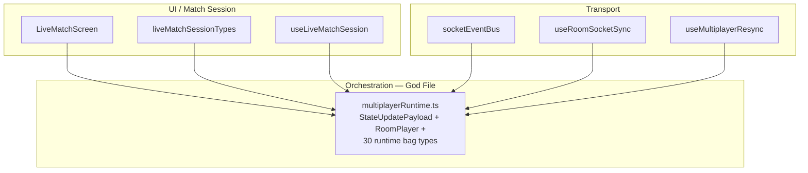
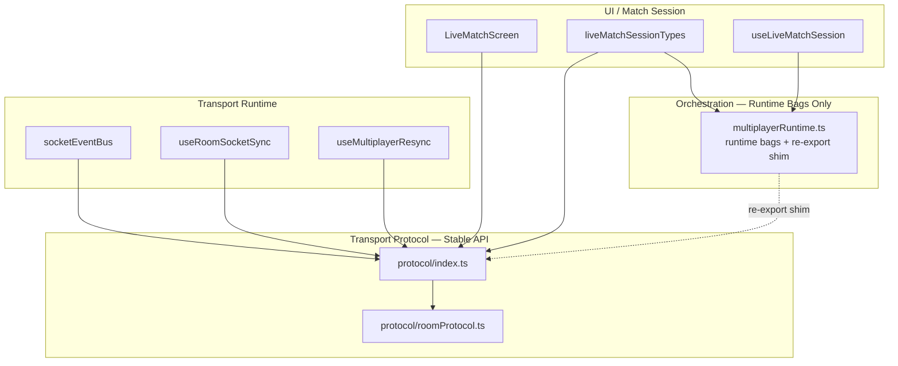
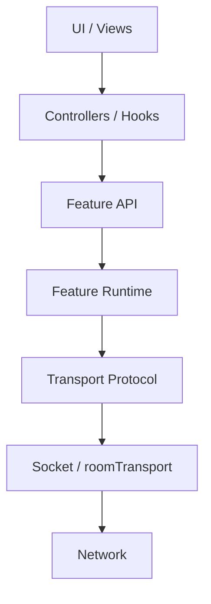

# Multiplayer Architecture Refinement — Engineering Report

**Date:** 2026-07-05  
**Scope:** Client multiplayer transport protocol extraction (highest-impact improvement #1)  
**Stance:** Principal Engineer architecture refinement — Chess.com-scale durability

---

## Implemented: Highest-Impact Improvement (#1)

**Extract a stable multiplayer transport protocol layer** (`client/src/multiplayer/protocol/`)

Socket payload contracts and roster normalization now live in Transport, not inside the runtime orchestration type bag (`multiplayerRuntime.ts`).

---

## Architecture Improvement Plan (Ranked by Impact)

### 1. Extract stable transport protocol layer — **IMPLEMENTED**

| Field | Detail |
|-------|--------|
| **WHY** | Protocol types were embedded in `multiplayerRuntime.ts` alongside 30+ runtime bag types. Every layer (socket bus, room sync, recovery, live match) imported the god-file for `StateUpdatePayload` / `RoomPlayer`, inverting dependency direction. |
| **Current** | `StateUpdatePayload`, `RoomPlayer`, `RoomRecoveryState`, `normalizeRoomPlayers` defined inline in runtime types file. |
| **Target** | `protocol/roomProtocol.ts` owns wire contract; `protocol/index.ts` is the stable public API; runtime re-exports temporarily for backward compat. |
| **Risks** | Low — pure type/move + re-exports; tests unchanged in behavior. |
| **Size** | S (~1 day) |
| **Maintenance** | Protocol changes become localized; match/session can depend on Transport without importing runtime bags. |

### 2. Extract `App.tsx` multiplayer integration kernel into a vertical session host

| Field | Detail |
|-------|--------|
| **WHY** | `App.tsx` (~1,554 LOC) still owns socket lifecycle, recovery dispatch, resync, tournament attach, and shell bridging (documented E2–E11 entanglements). This is the #1 scaling bottleneck for dozens of engineers. |
| **Current** | Horizontal orchestrator at app root. |
| **Target** | `MultiplayerSessionHost` (or similar) owns connect → join → play → recover; `App.tsx` only mounts it. |
| **Risks** | High — touches routing, auth, tournament, and recovery entry points. |
| **Size** | L (2–3 weeks) |
| **Maintenance** | Engineers work inside one vertical slice; app shell stops being a merge-conflict magnet. |

### 3. Collapse the three-path state read model

| Field | Detail |
|-------|--------|
| **WHY** | Game truth is read from React state, `stateRef`, and `multiplayerGameSnapshot` external store. Three sources of truth invite desync bugs (e.g. placement-blocking hypothesis). |
| **Current** | `useRoomSocketSync` writes refs + React; `App.tsx` reads snapshot for routes. |
| **Target** | Single authoritative read API (selector layer) with explicit write paths from transport only. |
| **Risks** | Medium — subtle timing bugs if migration is partial. |
| **Size** | L |
| **Maintenance** | Debugging becomes "one place to look"; spectators/reconnect get a stable query surface. |

### 4. Decompose `useLiveMatchSession` into vertical match modules

| Field | Detail |
|-------|--------|
| **WHY** | ~1,100 LOC hook owns gameplay actions, animation staging, rematch, move-log, and derived UI — mirrors pre-refactor bot match debt. |
| **Current** | Monolithic session hook. |
| **Target** | Mirror bot-match pattern: `modules/match/` owns lifecycle, input, view-model; live session is thin composition. |
| **Risks** | Medium — gameplay regressions if boundaries are wrong. |
| **Size** | L |
| **Maintenance** | Parallel ownership: tournaments/spectators extend modules without touching socket sync. |

### 5. Bound recovery machine behind a stable feature API

| Field | Detail |
|-------|--------|
| **WHY** | `recoveryMachine.ts` (870 LOC) is well-tested but wired through App + connection + callbacks spread across 5+ files. |
| **Current** | FSM is good; integration is leaky. |
| **Target** | `RecoveryRuntime` exposes `dispatch`, `selectors`, `subscribe`; connection layer only forwards transport events. |
| **Risks** | Medium — resync no-op paths when machine ≠ `idle`. |
| **Size** | M |
| **Maintenance** | Mobile/desktop reconnect policies evolve without touching UI shells. |

### 6. Split `socketEventBus` transport from side-effect orchestration

| Field | Detail |
|-------|--------|
| **WHY** | 648 LOC bus mixes dedup/ordering (transport) with gameplay side-effects (draw animation, forced-draw chains). |
| **Current** | Single bus handles protocol + UX staging. |
| **Target** | Transport bus emits domain events; `useRoomSocketSync` controller subscribes and applies UX policy. |
| **Risks** | Medium — event ordering regressions. |
| **Size** | M |
| **Maintenance** | Spectator-only subscribers can attach without importing gameplay hooks. |

### 7. Eliminate `MultiplayerShellDelegates` sideways coupling

| Field | Detail |
|-------|--------|
| **WHY** | Connection layer reaches into shell internals via delegate refs — violates downward dependency flow. |
| **Current** | `useMultiplayerConnection` → shell bridge → session internals. |
| **Target** | Connection exposes events upward; shell controller dispatches downward only. |
| **Risks** | Medium — join-ack and lobby visibility timing. |
| **Size** | M |
| **Maintenance** | Lobby and in-match become independently testable bounded contexts. |

### 8. Migrate remaining `multiplayerRuntime` protocol consumers to `protocol/`

| Field | Detail |
|-------|--------|
| **WHY** | ~30 files still import `RoomPlayer` / `StateUpdatePayload` from `multiplayerRuntime` via re-exports, keeping the god-file as transitive dependency. |
| **Current** | Re-export shim in place (intentional migration buffer). |
| **Target** | All protocol consumers import `multiplayer/protocol`; runtime file only exports runtime bags. |
| **Risks** | Low — mechanical import path change. |
| **Size** | S |
| **Maintenance** | Runtime public surface shrinks; import graph becomes honest. |

### 9. Deduplicate `RoomEventMeta` in `liveMatchSessionTypes.ts`

| Field | Detail |
|-------|--------|
| **WHY** | `liveMatchSessionTypes.ts` redefines `RoomEventMeta` locally instead of importing from `protocol/` — type drift risk. |
| **Current** | Duplicate type definition at lines 17–21. |
| **Target** | Import `RoomEventMeta` from `protocol/`. |
| **Risks** | Low. |
| **Size** | S |
| **Maintenance** | Single wire-contract source of truth. |

### 10. Shared server–client protocol package

| Field | Detail |
|-------|--------|
| **WHY** | Client `protocol/` and server payload shapes are tested separately; long-term drift breaks reconnect at scale. |
| **Current** | Parallel definitions + server audit tests. |
| **Target** | `@racehorse/multiplayer-protocol` (like existing `@racehorse/match-protocol`). |
| **Risks** | Low–medium — build pipeline change. |
| **Size** | M |
| **Maintenance** | One schema change updates both ends; enables codegen/validation. |

### 11. Tournament attach as isolated vertical slice

| Field | Detail |
|-------|--------|
| **WHY** | `TournamentAttachRuntime` lives in `multiplayerRuntime.ts`; tournament session hooks import multiplayer god-types. |
| **Current** | Tournament wiring scattered across App + connection + match/session/tournament/*. |
| **Target** | `tournament/` vertical owns attach transport, state, and navigation. |
| **Risks** | Medium — attach race conditions. |
| **Size** | M |
| **Maintenance** | Tournament engineers don't touch private-room or quick-match code. |

### 12. Fix `drawSequenceActive` ordering (gameplay correctness)

| Field | Detail |
|-------|--------|
| **WHY** | Diagnostics suggest `state:update` sets `drawSequenceActive` before `game:draw_animation`, silently blocking `play()`. |
| **Current** | Instrumentation in place; no fix yet. |
| **Risks** | Low for fix; high if ignored at scale. |
| **Size** | S |
| **Maintenance** | Unblocks trust in transport→gameplay pipeline. |

---

## Post-Implementation Report

### Files changed

| File | Action |
|------|--------|
| `client/src/multiplayer/protocol/roomProtocol.ts` | **Created** — canonical wire contract |
| `client/src/multiplayer/protocol/index.ts` | **Created** — public protocol API barrel |
| `client/src/multiplayer/protocol/roomProtocol.test.ts` | **Created** — normalization tests |
| `client/src/multiplayer/multiplayerRuntime.ts` | **Modified** — removed inline protocol; re-exports from `./protocol` |
| `client/src/multiplayer/socketEventBus.ts` | **Modified** — imports `StateUpdatePayload` from `./protocol` |
| `client/src/multiplayer/useRoomSocketSync.ts` | **Modified** — protocol imports; re-exports `StateUpdatePayload` |
| `client/src/multiplayer/useMultiplayerResync.ts` | **Modified** — protocol import |
| `client/src/match/session/roomSocketSyncParams.ts` | **Modified** — protocol imports |
| `client/src/match/session/liveMatchSessionTypes.ts` | **Modified** — protocol imports (partial) |
| `client/src/match/liveMatchScreenTypes.ts` | **Modified** — `RoomPlayer` from protocol |
| `client/src/match/LiveMatchScreen.tsx` | **Modified** — `RoomPlayer` from protocol |

### Architectural diagrams

#### Before — inverted dependency (protocol inside runtime)

#### After — protocol owned by transport layer

#### Target dependency direction (Chess.com model)

### Dependency changes

| Change | Effect |
|--------|--------|
| Transport layers import `protocol/` directly | Socket bus, room sync, resync no longer need runtime god-file for wire types |
| Match session partial migration | `liveMatchSessionTypes`, `roomSocketSyncParams`, `LiveMatchScreen` import protocol for wire types |
| Runtime re-export shim preserved | ~30 legacy consumers still work; no behavior change |
| New test ownership | `normalizeRoomPlayers` tests live beside protocol implementation |

### Coupling improvements

- **Transport ↔ Runtime decoupled** for wire contract types
- **Stable API surface** introduced at `protocol/index.ts` with explicit ownership comment
- **Import graph honesty** — 8 files now depend on `protocol/` directly vs. 0 before
- **Testability** — protocol normalization testable without loading runtime bags

### Responsibilities moved

| Responsibility | From | To |
|----------------|------|-----|
| `StateUpdatePayload` | `multiplayerRuntime.ts` | `protocol/roomProtocol.ts` |
| `RoomPlayer` | `multiplayerRuntime.ts` | `protocol/roomProtocol.ts` |
| `RoomRecoveryState` | `multiplayerRuntime.ts` | `protocol/roomProtocol.ts` |
| `RoomIdentity` | `multiplayerRuntime.ts` | `protocol/roomProtocol.ts` |
| `RoomEventMeta` | `multiplayerRuntime.ts` | `protocol/roomProtocol.ts` |
| `normalizeRoomPlayers()` | `multiplayerRuntime.ts` | `protocol/roomProtocol.ts` |

### Public APIs

- **Added:** `multiplayer/protocol/index.ts` — intentional stable import path
- **Reduced (conceptually):** Runtime file no longer *defines* protocol; only re-exports
- **Not yet reduced:** Re-export shim keeps `multiplayerRuntime` as transitive protocol dependency for ~30 files

### Imports eliminated (direct runtime → protocol)

8 modules now import wire types from `protocol/` instead of defining/consuming them only via runtime.

### LOC before / after

| Artifact | Before | After | Δ |
|----------|--------|-------|---|
| `multiplayerRuntime.ts` | ~459 | 393 | −66 |
| `protocol/roomProtocol.ts` | — | 66 | +66 |
| `protocol/index.ts` | — | 12 | +12 |
| `protocol/roomProtocol.test.ts` | — | 25 | +25 |
| **Net production** | ~459 | ~471 | +12 (barrel + docs) |
| **Net with tests** | ~482 | ~496 | +14 |

### Verification

| Check | Result |
|-------|--------|
| Client tests | **72 files / 565 tests PASS** |
| Server tests | **77 files / 513 tests PASS** |
| Typecheck + build | **PASS** (`tsc -b && vite build`) |
| Lint (changed files) | **0 errors**, 16 pre-existing warnings in touched transport files |
| Lint (full client) | **115 errors / 402 warnings** — pre-existing baseline, not introduced by this change |
| Behavior | **No intentional behavior change** — type moves + re-exports only |

---

## Remaining Technical Debt

1. **`App.tsx` integration kernel** — still the dominant architectural risk
2. **~30 files import protocol types via `multiplayerRuntime` re-exports** — shim should be removed in follow-up #8
3. **Duplicate `RoomEventMeta` in `liveMatchSessionTypes.ts`** — drift risk vs `protocol/`
4. **Duplicate tests** — `multiplayerRuntime.test.ts` and `roomProtocol.test.ts` both test `normalizeRoomPlayers`
5. **`multiplayerRuntime.ts` still exports 25+ runtime bag types** — next split target: connection bags vs room-action bags vs recovery bags
6. **Three-path state read model** — React / refs / external snapshot
7. **`useRoomSocketSync` (1,024 LOC) + `MultiplayerGameShell` (1,042 LOC)** — orchestration hubs
8. **`recoveryMachine.ts` (870 LOC)** — good FSM, leaky integration
9. **Placement-blocking bug** — diagnostic instrumentation present; root cause not fixed
10. **No shared server–client protocol package** — long-term contract drift risk

---

## If Chess.com Were Reviewing This PR, What Criticisms Would Remain?

1. **"Good first slice, but you left the re-export shim — finish the migration."** Half the codebase still transitively depends on `multiplayerRuntime` for types that now live in `protocol/`. Chess.com would require a follow-up PR to eliminate the shim before calling this done.

2. **"App.tsx is still your multiplayer monolith."** Extracting 66 lines of protocol doesn't address the real scaling bottleneck. They'd ask: *Where is the session host? Why is socket lifecycle still in the app root?*

3. **"You have two `RoomEventMeta` definitions."** A principal reviewer would flag `liveMatchSessionTypes.ts` immediately as contract drift.

4. **"Where is the authoritative game state selector?"** Three read paths remain. They'd block any feature work on spectators or reconnect until there's one query API.

5. **"Protocol layer is client-only."** Without a shared package or schema validation against server payloads, this is organizational separation — not true contract enforcement.

6. **"Tests prove normalization, not integration."** Server has rich multiplayer tests; client transport integration tests are still thin relative to `socketEventBus` / `useRoomSocketSync` complexity.

7. **"No ownership doc."** Chess.com teams ship `OWNERS` / ADR for bounded contexts. The code move is right; the team boundary (who owns `protocol/` vs `recovery/` vs `match/session/`) isn't documented in-repo.

---

## Status

Stopped after one improvement per instructions. Ready for review before proceeding to item **#2** (App.tsx session host extraction) or **#8** (complete protocol import migration).