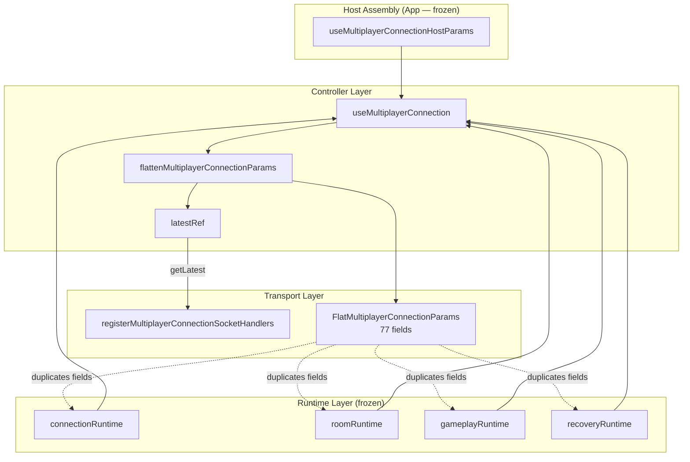
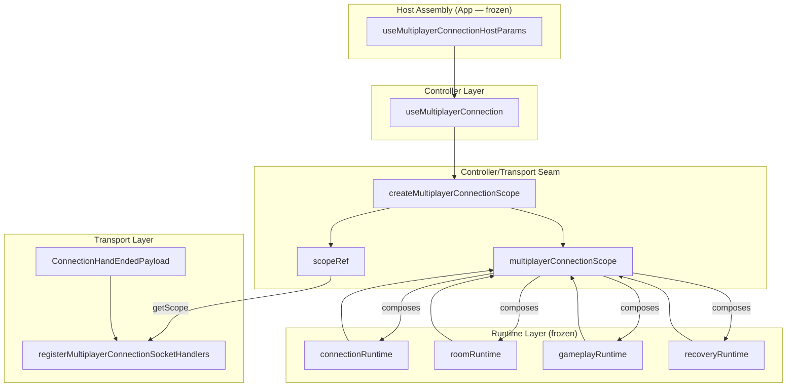
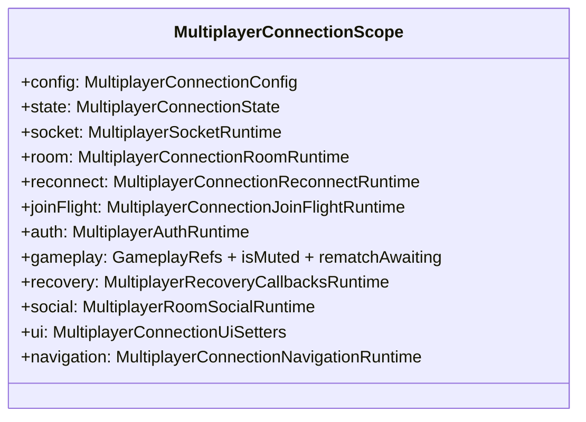

# Multiplayer Connection Scope Extraction — Engineering Report

## Executive Summary

This PR eliminates `FlatMultiplayerConnectionParams` — a 77-field god-bag that re-flattened the already-decomposed runtime slices every render cycle. The connection transport layer now reads a **nested `MultiplayerConnectionScope`** that preserves runtime slice ownership (`config`, `state`, `socket`, `room`, `reconnect`, `joinFlight`, `auth`, `gameplay`, `recovery`, `social`, `ui`, `navigation`).

**Result:** Zero behavior changes. Zero networking changes. Zero frozen-layer modifications. Architecture and cycle checks pass with zero violations. All 1,075 tests pass. Production build succeeds.

The runtime slice design is no longer immediately undone at the controller/transport boundary.

---

## Why this improvement was chosen over every other remaining task

| Candidate | Long-term impact | Why not chosen now |
|-----------|------------------|-------------------|
| **Replace flat connection params with nested scope** | **Highest** — attacks the root leaky abstraction that forces every new socket handler field to widen a duplicated 77-field type and re-spread runtime slices | **Selected** |
| Decompose `useRoomSocketSync.ts` (1,018 LOC) | High local maintainability | Fixes the largest file but preserves the flatten/ref-bag pattern in connection and room-actions hooks |
| Extract gameplay handlers from connection transport (`hand:ended`, rematch, dragging) | Correct layering | Best done after scope exists so handlers move onto capability groups, not another flat bag |
| Room social ref-bridge elimination | Medium | Requires `App.tsx` changes (frozen) — `useMultiplayerRoomSocialRuntimeBridge()` lives in App assembly |
| Merge `useMultiplayerConnectionHostParams` + `useMultiplayerLobbyHostProps` | Medium boilerplate reduction | Does not fix the god-bag consumption model |
| `match/` → `multiplayer/protocol` coupling in `liveMatchScreenTypes.ts` | Low-medium | Type-only import; acceptable wire-contract sharing |
| Shrink `MultiplayerGameShell.tsx` (1,042 LOC) | High UX/architecture | Secondary until socket layers stop reaching shell state through flat params |

**Principal Engineer rationale:** The prior PR series established honest runtime slices and enforced boundaries. The connection hook immediately undid that design by spreading slices back into `FlatMultiplayerConnectionParams`. Every future socket handler, recovery bridge, or ref addition would widen that flat surface. Chess.com-scale codebases fail at the **imperative boundary** — this PR fixes the highest-leverage boundary without touching frozen foundations.

---

## Files Changed

| File | Action |
|------|--------|
| `client/src/multiplayer/multiplayerConnectionScope.ts` | **Created** — `MultiplayerConnectionScope`, `MultiplayerConnectionScopeSource`, `createMultiplayerConnectionScope()` |
| `client/src/multiplayer/connectionSocketHandlerParams.ts` | **Shrunk** — removed `FlatMultiplayerConnectionParams`; retains `ConnectionHandEndedPayload` only |
| `client/src/multiplayer/useMultiplayerConnection.ts` | **Refactored** — `scopeRef` + nested access; `UseMultiplayerConnectionParams` aliases `MultiplayerConnectionScopeSource` |
| `client/src/multiplayer/registerMultiplayerConnectionSocketHandlers.ts` | **Refactored** — `getScope()` replaces `getLatest()`; nested capability access |

**Not touched:** `App.tsx`, `multiplayer/protocol/*`, `multiplayer/runtime/*`, dep-cruiser configs, gameplay logic, networking wire format.

---

## Architecture Before

```
UseMultiplayerConnectionParams (nested runtime slices)
        │
        ▼ flattenMultiplayerConnectionParams()  ← UNDOES SLICE DESIGN
        │
FlatMultiplayerConnectionParams (77 duplicated fields)
        │
        ▼ getLatest()
        │
registerMultiplayerConnectionSocketHandlers
  current.setIsConnected(...)
  current.joinedRoomRef.current
  current.appendRoomReactionRef.current(...)
```

**Problems:**
1. Runtime slices existed for documentation and dep-cruiser rules, but transport handlers consumed a flat bag.
2. `connectionSocketHandlerParams.ts` duplicated every field from `connectionRuntime.ts`, `roomRuntime.ts`, `gameplayRuntime.ts`, etc.
3. Adding any handler dependency required updating the flat type + flatten spread + all handler reads.
4. No capability grouping — impossible to mock/test transport handlers with narrow surfaces.

---

## Architecture After

```
UseMultiplayerConnectionParams (= MultiplayerConnectionScopeSource)
        │
        ▼ createMultiplayerConnectionScope()  ← PRESERVES SLICE DESIGN
        │
MultiplayerConnectionScope (12 nested capability groups)
        │
        ▼ getScope()
        │
registerMultiplayerConnectionSocketHandlers
  scope.ui.setIsConnected(...)
  scope.room.joinedRoomRef.current
  scope.social.appendRoomReactionRef.current(...)
```

**Improvements:**
1. Transport handlers read through capability groups aligned with runtime ownership.
2. No duplicated field listing — scope type composes existing runtime types.
3. New handler dependencies attach to the correct capability group, not a monolithic flat type.
4. `UseMultiplayerConnectionParams` is now `MultiplayerConnectionScopeSource & { recoveryDispatchRef? }` — single source of truth for hook input shape.

---

## Ownership Changes

| Symbol | Before | After |
|--------|--------|-------|
| `FlatMultiplayerConnectionParams` | `connectionSocketHandlerParams.ts` (transport) | **Deleted** |
| `MultiplayerConnectionScope` | — | `multiplayerConnectionScope.ts` (controller/transport seam) |
| `MultiplayerConnectionScopeSource` | Duplicated as `UseMultiplayerConnectionParams` fields | `multiplayerConnectionScope.ts` (canonical input shape) |
| `UseMultiplayerConnectionParams` | Independently defined in `useMultiplayerConnection.ts` | Alias: `MultiplayerConnectionScopeSource & { recoveryDispatchRef? }` |
| `ConnectionHandEndedPayload` | `connectionSocketHandlerParams.ts` | Unchanged |
| Runtime slice types | `runtime/*` (frozen) | Unchanged — now consumed directly via scope nesting |

---

## Dependency Graph Changes

**Before:**
```
connectionSocketHandlerParams.ts  (owns 77-field flat type)
    ▲
    ├── useMultiplayerConnection.ts
    └── registerMultiplayerConnectionSocketHandlers.ts

runtime/connectionRuntime.ts, runtime/roomRuntime.ts, etc.
    ▲ (types only, but fields duplicated in flat type)
    └── connectionSocketHandlerParams.ts
```

**After:**
```
multiplayerConnectionScope.ts
    ▲ imports runtime types (read-only composition)
    ├── useMultiplayerConnection.ts
    └── registerMultiplayerConnectionSocketHandlers.ts

connectionSocketHandlerParams.ts
    └── ConnectionHandEndedPayload only (handler-specific payload)
```

**Dep-cruiser:** 656 modules, 2,576 dependencies — zero arch violations, zero cycles.

---

## Public API Changes

| Export | Change |
|--------|--------|
| `FlatMultiplayerConnectionParams` | **Removed** (was internal transport type, not public API) |
| `MultiplayerConnectionScope` | **Added** |
| `MultiplayerConnectionScopeSource` | **Added** |
| `createMultiplayerConnectionScope()` | **Added** |
| `UseMultiplayerConnectionParams` | **Shape unchanged** — now aliases scope source; all host-param assembly unchanged |
| `registerMultiplayerConnectionSocketHandlers` options | `getLatest` → `getScope` (internal API) |
| `ConnectionHandEndedPayload` | Unchanged |

External consumers (`MultiplayerConnectionHost`, `useMultiplayerConnectionHostParams`, `useAppRoutesProps`) see **no API changes**.

---

## Coupling Improvements

1. **Eliminated type duplication** — 77 fields no longer listed twice (runtime types + flat type).
2. **Preserved slice semantics at imperative boundary** — handlers group reads by concern (`scope.reconnect.*`, `scope.ui.*`).
3. **Narrower mock surface for tests** — future handler tests can stub `MultiplayerConnectionScope` capability groups.
4. **Removed flatten spread anti-pattern** — `createMultiplayerConnectionScope` assigns references, no field-level spread.
5. **Prerequisite for gameplay handler extraction** — `hand:ended`, rematch, dragging can later move to `scope.gameplay` / `scope.ui` consumers without touching flat type.

---

## Architectural Diagrams (Mermaid)

### Before: Flatten Round-Trip



### After: Nested Scope



### Scope Capability Groups



---

## Verification Results

| Check | Result |
|-------|--------|
| `npm run check:multiplayer-arch` | ✅ 0 violations (656 modules, 2,576 deps) |
| `npm run check:multiplayer-cycles` | ✅ 0 violations |
| Typecheck (`tsc -p tsconfig.app.json`) | ✅ Pass |
| Client production build | ✅ Pass (5.92s) |
| Client tests | ✅ 71 files / 562 tests |
| Server tests | ✅ 77 files / 513 tests |
| Lint | ⚠️ 115 errors / 399 warnings (unchanged baseline) |

---

## LOC Before / After

| File | Before | After | Δ |
|------|--------|-------|---|
| `connectionSocketHandlerParams.ts` | 107 | 14 | −93 |
| `useMultiplayerConnection.ts` | 523 | 485 | −38 |
| `registerMultiplayerConnectionSocketHandlers.ts` | 315 | 312 | −3 |
| `multiplayerConnectionScope.ts` | 0 | 70 | +70 |
| **Net (this PR)** | **945** | **881** | **−64** |

**Type surface removed:** `FlatMultiplayerConnectionParams` — 77 fields deleted, 0 added at flat level. Replaced by 12 nested capability groups composing existing runtime types.

---

## Remaining Technical Debt (ranked by impact)

1. **`useRoomSocketSync.ts` (1,018 LOC)** — Largest controller god-object; still uses `FlatRoomSocketSyncParams` flatten pattern. Highest-impact next target.
2. **`useMultiplayerRoomActions.ts` (536 LOC)** — Second flatten/ref-bag hook; should adopt scope pattern.
3. **Gameplay handlers in connection transport** — `hand:ended`, rematch, dragging, social events still registered in connection handlers; wrong layering but now grouped by scope capability for future extraction.
4. **Room social ref-bridge** — `appendRoomReactionRef` / `clearRoomReactionsRef` still cross App ↔ lobby via mutable refs; blocked by frozen `App.tsx`.
5. **`recoveryConnectionBridge.ts`** — Legacy ref shim syncing recovery machine to App-owned refs; blocked by frozen `App.tsx`.
6. **`MultiplayerGameShell.tsx` (1,042 LOC)** — Presentation god-object; secondary until socket scope patterns propagate.
7. **`match/liveMatchScreenTypes.ts` → `multiplayer/protocol`** — Cross-bounded-context type import; low risk.

---

## If Chess.com Were Reviewing This PR, What Criticisms Would Remain?

1. **"Good seam, incomplete rollout."** Only connection layer adopted scope. `useRoomSocketSync` and `useMultiplayerRoomActions` still flatten — inconsistent architecture mid-migration.
2. **"Gameplay still lives in transport."** `hand:ended` sound effects and hand-reveal timers in connection handlers violate layering; scope grouping makes extraction easier but doesn't fix ownership.
3. **"Scope is still a god-object container."** 12 groups is better than 77 flat fields, but the scope carries everything. Chess.com would eventually want capability interfaces (`ConnectionTransportScope`, `RoomSocialScope`) with explicit injection.
4. **"No new tests for scope factory."** `createMultiplayerConnectionScope` is pure assignment — trivial, but a contract test asserting group completeness would prevent drift.
5. **"Ref bridge pattern untouched."** Social feed, recovery dispatch, and connect refs still use mutable ref indirection — scope doesn't solve App.tsx assembly coupling.
6. **"Handler registration still monolithic."** 312-line registrar should decompose into per-event modules once scope stabilizes.

---

## Recommended Next Principal Engineer PR

**Apply the scope pattern to `useRoomSocketSync.ts`** — extract `FlatRoomSocketSyncParams` into `multiplayerRoomSyncScope.ts` with nested capability groups (`room`, `recovery`, `session`, `ui`, `gameplay`), mirroring this PR's connection scope extraction.

**Why next:** `useRoomSocketSync.ts` at 1,018 LOC is the largest remaining orchestration hotspot and still uses the flatten/ref-bag anti-pattern this PR eliminated for connection. Completing scope extraction across all three flatten hooks (connection ✅, room-sync, room-actions) establishes a consistent imperative boundary before decomposing handler files or extracting gameplay from transport.

---

*PR complete. Awaiting Principal Engineer review. No further changes initiated.*