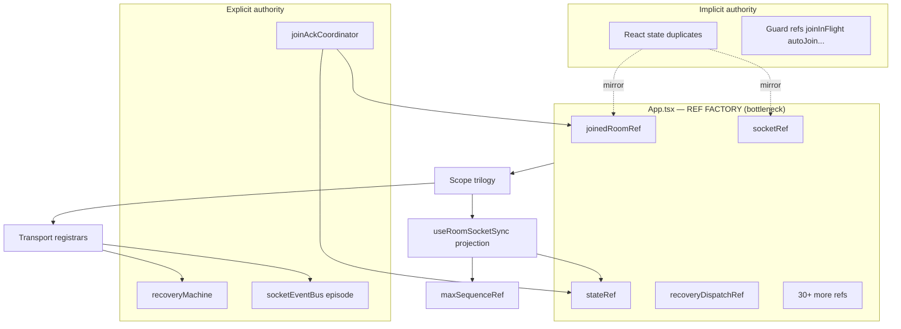
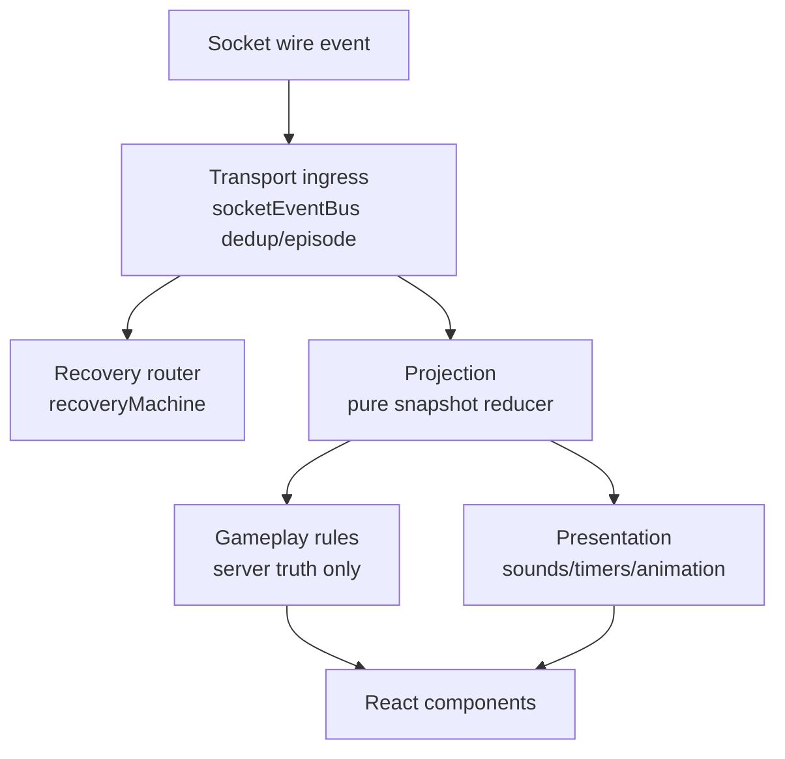
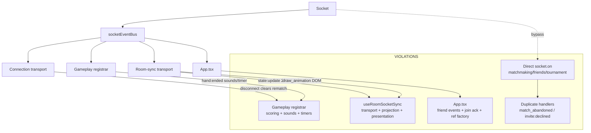

# Principal Engineer Architecture Audit — Multiplayer at Five-Year Scale

This audit treats the codebase as a production multiplayer client **after** the scope trilogy and gameplay transport separation. File length, lint, and naming are intentionally ignored.

---

## 1. Projection Layer Audit

### Verdict: **Projection is NOT separated from transport.**

Pure projection primitives exist (`projectMultiplayerGameState`, `boardSnapshotGuards`, sequence/episode gates), but they are invoked **inside transport handlers**, not behind a projection boundary.

| Concern | Where it lives today | Correct owner | Mixed with transport? |
|---------|---------------------|---------------|------------------------|
| `state:update` hydration | `useRoomSocketSync.applyAuthoritativeStateUpdate` | **Projection** | **Yes** — 200+ LOC: sequence watermark, legal moves, pre-game draw, forced-draw staging, recovery UI hints, opponent disconnect reset |
| Draw animation / forced-draw staging | `useRoomSocketSync` (`game:draw_animation` + inline in `state:update`) | **Projection → Presentation** | **Yes** — DOM rects, flying tiles, timers, sounds in transport effect |
| Hand reveal sequencing | Split: `registerMultiplayerConnectionGameplaySocketHandlers` (timer + `setHandReveal`) + `useHandRevealSequence` (session) | **Projection** | **Yes** — dual writers, no single reveal state machine |
| Domino placement | Derived from projected `GameState` in React | **Projection output** | Partially OK — but projection path is transport-embedded |
| Scoring / game over | In projected state + `hand:ended` score inference in gameplay registrar | **Projection** | **Yes** — `hand:ended` computes match-over from scores in socket handler |
| Rematch | Gameplay registrar + disconnect cleanup in transport | **Session / Lobby** | Split across gameplay + transport |
| Spectator snapshot | `state:spectate` in `useRoomSocketSync` | **Projection** | **Yes** — inline in transport |

### Recommended production architecture (design only — not implemented)

```
Socket payload
    → Transport (ingress, dedup, episode stamp)
    → ProjectionReducer (pure: snapshot + meta → ProjectedMatchState)
    → PresentationAdapter (timers, sounds, flying tiles — subscribes to projection diffs)
    → React (render)
```

**Smallest production-quality correction:** Introduce `multiplayer/projection/` with:

- `projectStateUpdate(payload, context) → ProjectionResult` (pure)
- `applyProjectionResult(result, scope)` (single writer to match state)
- Transport handlers become thin: validate episode → call projector → apply result

Do **not** split `useRoomSocketSync.ts` for LOC. Extract **projection purity** first; transport stays registrar-only.

**Critical smell:** `flattenLiveMatchSessionParams` in `match/session/liveMatchSessionTypes.ts` — a fourth flatten bag outside multiplayer, feeding the same projection pipeline. Long-term, projection input should be scope-shaped, not re-flattened at the match boundary.

---

## 2. Session State Machine Audit

### Verdict: **Recovery is explicit; session/match lifecycle is implicit.**

| Lifecycle phase | Exists? | How implemented |
|-----------------|---------|-----------------|
| Connecting | Partial | `recoveryMachine.connecting` + `isConnecting` React state |
| Connected | Partial | `isConnected` + socket ref |
| Joining | Partial | `recoveryMachine.joining` + `joinInFlightRef` + `rejoinInFlightRef` |
| Joined | **Implicit** | `joinedRoom` + `joinedRoomRef` — no enum |
| Playing | **Implicit** | `matchStartedRef` + `stateRef.gameOver/handOver` inference |
| Recovering | **Explicit** | `recoveryMachine` (`connecting`/`joining`/`resyncing`/`failed`) |
| Reconnecting | Partial | Recovery FSM + legacy ref shim |
| Match End | **Implicit** | `state.gameOver` + `hand:ended` side effects |
| Leaving | **Implicit** | `intentionalDisconnectRef` + `USER_LEAVE` |
| Disconnected | Partial | `disconnect` handler branches on recoverable vs hard reset |

There is **no unified `SessionState` FSM**. Room membership is ref-guard soup: `joinedRoomRef`, `matchStartedRef`, `isSeatedPlayerRef`, `playerReadyEmittedRef`, `autoJoinAttemptedRef`, etc., composed in `App.resetMultiplayerRoomState`.

### Production architecture design

```
SessionStateMachine (explicit, separate from RecoveryMachine)
  Idle → Connected → InLobby → MatchStarting → InMatch → MatchEnded → Leaving → Idle

RecoveryMachine remains transport-scoped (how to reconnect)
SessionMachine remains product-scoped (what phase the user is in)
```

**Join authority** is partially correct (`joinAckCoordinator`), but session transitions after join are not machine-governed — they are scattered across `useRoomSocketSync`, lobby controller, and App resets.

**First collapse under scale:** Spectators, 2v2 lobbies, and tournament-forfeit flows will each add flags to the implicit model until joins and resets race.

---

## 3. Complete Socket Event Ownership Table

| Event | Current owner (actual) | Correct owner | Violation? | Smallest correction |
|-------|------------------------|---------------|------------|---------------------|
| `connect` | Transport + Recovery | Transport + Recovery | No | — |
| `disconnect` | Transport (+ gameplay UI cleanup) | Transport + Session | **Partial** | Move rematch/drag clears to session teardown |
| `connect_error` | Transport + Recovery | Transport + Recovery | No | — |
| `reconnect_failed` | Transport + Recovery | Transport + Recovery | No | — |
| `server:shutdown` | Transport | Transport | No | — |
| `room:session:superseded` | Recovery | Recovery | No | — |
| `state:update` | Room-sync transport (**projection inline**) | **Projection** | **Yes** | Extract projector; thin handler |
| `state:spectate` | Room-sync transport | Projection | **Yes** | Same projector path |
| `game:draw_animation` | Room-sync transport | Projection → Presentation | **Yes** | Presentation adapter |
| `room:update` | Room-sync transport | Lobby / Session | **Partial** | OK in room-sync if lobby registrar split later |
| `room:request_ready` | Room-sync transport | Lobby / Session | **Partial** | — |
| `hand:ended` | Gameplay registrar | Projection → Presentation | **Yes** | Project hand-end; presentation plays sounds |
| `game:rematch:status` | Gameplay registrar | Session / Lobby | **Partial** | Session machine transition |
| `game:rematch:started` | Gameplay registrar + Recovery ref | Session | **Partial** | Session owns `rematchAwaitingStateRef` |
| `player:dragging` | Gameplay registrar | Presentation | **Partial** | Low risk |
| `room:chat` | Connection transport | **Social** | **Yes** | Social registrar (deferred cosmetic move — OK) |
| `room:emote` | Connection transport | **Social** | **Yes** | Same |
| `tournament:match:assigned` | Connection transport | Tournament + Navigation | **Partial** | Tournament registrar |
| `friend:invite:error` | Room-sync transport | Social | **Partial** | — |
| `friend:invite:declined` | **App.tsx + useFriendChallenge** | Social | **Yes — duplicate** | Single owner + remove direct `socket.on` |
| `friend:invited` | App.tsx | Social | **Partial** | Move to social module |
| `player:disconnected` | Room-sync transport | Recovery + Presentation | **Partial** | — |
| `player:reconnected` | Room-sync transport | Recovery + Presentation | **Partial** | — |
| `player:reconnect_timeout` | Room-sync transport | Recovery + Presentation | **Partial** | — |
| `room:match_abandoned` | **Room-sync + TournamentSessionSockets** | Session | **Yes — duplicate** | Single session handler |
| `tournament:completed` | **useTournament + TournamentSessionSockets** | Tournament | **Yes — duplicate** | Registry enforcement |
| `tournament:match_completed` | **useTournament + TournamentSessionSockets** | Tournament | **Yes — duplicate** | Same |
| `queue:*` | Matchmaking hooks | Matchmaking | No (adjacent) | — |
| `RESYNC_NEEDED` (internal) | Recovery router | Recovery | No | — |
| `ROOM_JOIN_OK` (internal) | Join ack coordinator | Session + Recovery | No | — |
| `ROOM_JOIN_TERMINAL` (internal) | Recovery router | Recovery + Session | No | — |
| `TRANSPORT_FAIL` (internal) | Recovery router | Recovery + Transport | No | — |

**Highest-risk violations (production):** duplicate handlers (`friend:invite:declined`, `room:match_abandoned`, tournament completion), not social-in-transport.

### Handler registration map by file

| File | Events registered |
|------|-------------------|
| `client/src/multiplayer/socketEventBus.ts` | Ingress: `onAny` + `connect`, `disconnect`, `connect_error`, `reconnect_failed` |
| `client/src/multiplayer/registerMultiplayerConnectionSocketHandlers.ts` | `connect`, `disconnect`, `connect_error`, `reconnect_failed`, `server:shutdown`, `tournament:match:assigned`, `room:chat`, `room:emote`, `room:session:superseded` + normalized: `resyncNeeded`, `transportFail`, `roomJoinTerminal` |
| `client/src/multiplayer/registerMultiplayerConnectionGameplaySocketHandlers.ts` | `hand:ended`, `game:rematch:status`, `game:rematch:started`, `player:dragging` |
| `client/src/multiplayer/useRoomSocketSync.ts` | `friend:invite:error`, `room:update`, `room:request_ready`, `state:spectate`, `game:draw_animation`, `player:disconnected`, `player:reconnected`, `player:reconnect_timeout`, `room:match_abandoned` + normalized: `stateUpdate` (`state:update`) |
| `client/src/App.tsx` | `attachSocketEventBus` + normalized `roomJoinOk` + raw `friend:invite:declined`, `friend:invited` |
| `client/src/match/session/tournament/useTournamentSessionSockets.ts` | `tournament:completed`, `tournament:match_completed`, `room:match_abandoned` (direct) |

### Notable duplicates

| Issue | Events | Notes |
|-------|--------|-------|
| **Duplicate handlers** | `friend:invite:declined` | `App.tsx` (bus) + `useFriendChallenge.ts` (direct `socket.on`) |
| **Duplicate handlers** | `room:match_abandoned` | `useRoomSocketSync.ts` (in-game notice) + `useTournamentSessionSockets.ts` (session teardown/navigation) |
| **Overlapping tournament** | `tournament:completed`, `tournament:match_completed` | Both `useTournament.ts` and `useTournamentSessionSockets.ts` |
| **Multiple `connect`/`disconnect`** | Lifecycle events | Bus handlers + friend reachability + matchmaking + queue counts + FriendsScreen |

---

## 4. Runtime Ownership — Ref Graph

### Pattern today

```
App.tsx (creates ~40+ refs)
    ↓ mirrors React state (joinedRoom ↔ joinedRoomRef, socket ↔ socketRef)
    ↓ bridges (recoveryDispatchRef, connectRef, disconnectRef, social refs)
    ↓
Scope trilogy (read-only composition)
    ↓
Hooks (multi-writer: transport, projection, lobby, App effects)
    ↓
React state (second copy of truth)
```

### Top refs — single-writer assessment

| Ref | Owner (nominal) | Writers | Readers | Single-writer possible? | Could be derived? |
|-----|-----------------|---------|---------|----------------------|-------------------|
| `joinedRoomRef` | Room | App effect, joinAck, UI setters, handlers | Everywhere | **Yes** — session machine | **Yes** from session snapshot |
| `stateRef` | Gameplay | LiveMatchSession, projection handlers | Connection, room-sync, shell | **Yes** — projection only | **Yes** — projection output |
| `maxSequenceRef` | Room sync | Projection watermark | Projection, resync | **Yes** | **Yes** — part of projection cursor |
| `matchStartedRef` | Session | joinAck, room-sync, resets | Lobby ready, resync | **Yes** — session machine | **Yes** |
| `youRef` | Identity | joinAck, projection, session sync | Gameplay handlers | **Yes** | **Yes** from session |
| `resyncInFlightRef` | Recovery | useMultiplayerResync | room-sync buffer | **Yes** | **Yes** from recovery snapshot |
| `handRevealTimerRef` | Presentation | Gameplay registrar, rematch | Gameplay | **Yes** | No — timer handle |
| `rematchAwaitingStateRef` | Session | Gameplay registrar, recovery | room-sync | **Yes** — session machine | **Yes** |
| `intentionalDisconnectRef` | Transport | Connection, lobby | disconnect branch | **Yes** | **Yes** from session intent |
| `recoveryDispatchRef` | Recovery bridge | useMultiplayerConnection | App, lobby, tournament | **Yes** | Could be context, not ref |

### Ownership graph (simplified)



**Could refs disappear?** ~40% could become derived session/projection snapshot fields. The rest are legitimate imperative handles (timers, in-flight guards) but should be owned by explicit machines, not App.

### Recovery machine states (explicit)

| State | Meaning |
|-------|---------|
| `idle` | No active recovery |
| `connecting` | Backoff/retry loop; waiting for socket or scheduled retry |
| `joining` | Socket up; executing `room:join` rejoin |
| `resyncing` | Fetching authoritative state via `fetchGameState('recovery_machine')` |
| `failed` | Max attempts exhausted; policy → `manual_only` until `USER_RETRY` |

Authority contract: `recoveryMachine + episodeSequence + projectionGate` (`recoveryAuthorityContract.ts`).

---

## 5. Long-Term Scaling Risks (ranked)

| Rank | Risk | Why it collapses first |
|------|------|------------------------|
| **1** | **No projection layer** | 2v2, spectators, replays, bots all need deterministic state derivation — today it's embedded in one transport effect |
| **2** | **App.tsx composition root** | Every feature touches ref creation, socket attach, friend events — serializes all teams |
| **3** | **Implicit session lifecycle** | Spectators/tournaments/forfeit/2v2 each add flags; join/reset races multiply |
| **4** | **Duplicate event ownership** | `room:match_abandoned`, `friend:invite:declined`, tournament events — double handlers = production bugs |
| **5** | **Dual state (React + refs)** | Drift under fast updates; replay/debug impossible |
| **6** | **Presentation in transport** | Draw animation + sounds in `useRoomSocketSync` — UI team cannot ship independently |
| **7** | **Direct `socket.on` bypasses** | Matchmaking, friends, tournament hooks bypass event bus — no dedup/episode contract |
| **8** | **No match timeline / event log** | Replays, analytics, Live Ops require ordered event history |
| **9** | **flattenLiveMatchSessionParams** | Fourth flatten bag at match boundary — undermines scope trilogy |
| **10** | **Cross-mode coupling** | Daily puzzle, bot, ghost, multiplayer share patterns but no bounded context walls |

**First architecture to collapse with doubled complexity:** **Projection + App assembly** together — not file size.

### Imagined feature stress

Adding **2v2, spectators, tournaments, rated ladders, daily events, puzzle rush, bots, replays, voice, guilds, friends, season pass, cross-platform** — the first subsystem to break is the **inline projection pipeline in `useRoomSocketSync`**, because every new mode needs different snapshot semantics but shares one monolithic handler.

---

## 6. Conway's Law Review

| Team | Independent today? | Blocker |
|------|-------------------|---------|
| **Network / Infrastructure** | **Partial** | Good: `socketEventBus`, recovery FSM, scope trilogy. Blocked: App owns `attachSocketEventBus`, duplicate lifecycle listeners |
| **Gameplay** | **No** | Projection in `useRoomSocketSync`; scoring inference in gameplay registrar; rules touch transport |
| **UI / Presentation** | **No** | Draw animation, sounds, hand reveal timers split across transport, gameplay registrar, `useHandRevealSequence`, shell delegates |
| **Tournament** | **No** | Events in 3 places; session sockets duplicate room-sync |
| **Live Ops** | **No** | No feature isolation, no event log, no simulation harness |
| **Social / Friends** | **No** | App + direct `socket.on` + connection transport + friend hooks |

**Parallel development is blocked at App.tsx and the missing projection boundary**, not at individual hook file sizes.

---

## 7. Event Flow Diagram

### Intended flow



### Actual flow (with violations)



---

## 8. Five-Year Architecture — Top 5 Investments Only

| Rank | Investment | Why (not a micro-refactor) |
|------|------------|----------------------------|
| **1** | **Authoritative Projection Layer** | Single pure pipeline for all `state:update` / spectate / hand-end derivation. Unlocks 2v2, spectators, replays, bots, deterministic tests. |
| **2** | **Session State Machine** (product lifecycle, separate from recovery) | Explicit Joined/Playing/MatchEnd/Spectating. Eliminates ref-guard proliferation. |
| **3** | **Socket Event Registry + CI ownership enforcement** | One registrar per owner; forbid duplicate `socket.on`; event → owner map in dep-cruiser. Stops production double-handler bugs. |
| **4** | **Composition root extraction from App.tsx** | `MultiplayerHost` owns ref creation, socket attach, registrar composition. Unblocks Conway's law without changing gameplay. |
| **5** | **Match event timeline (append-only log)** | Foundation for replays, analytics, Live Ops, debugging. Projection becomes `fold(events)`. |

**Explicitly NOT top five:** social registrar move, handler file splits, ref-bridge cosmetic cleanup, lint, naming.

---

## 9. Production Roadmap (exact PR order)

| PR | Scope | Compiles alone | Behavior preserved | Parallel dev unlocked |
|----|-------|----------------|-------------------|----------------------|
| **1** | Extract `projectStateUpdate()` pure function + tests from `useRoomSocketSync` | ✅ | ✅ | Gameplay team owns projection tests |
| **2** | `applyProjectionResult()` single-writer; thin `state:update` handler | ✅ | ✅ | Transport vs projection split |
| **3** | Session state machine types + reducer (read-only shadow; no migration) | ✅ | ✅ | Session team models lifecycle |
| **4** | Migrate `matchStartedRef` / seated / ready guards → session machine | ✅ | ✅ | Lobby + match teams decouple |
| **5** | Socket event registry module + dedupe `friend:invite:declined`, `room:match_abandoned` | ✅ | ✅ | Tournament + social parallel |
| **6** | Presentation adapter for draw animation + hand reveal (subscribe to projection) | ✅ | ✅ | UI team independent |
| **7** | `MultiplayerCompositionHost` — move ref factory + `attachSocketEventBus` out of App | ✅ | ✅ | All teams |
| **8** | Eliminate `flattenLiveMatchSessionParams` → match session scope | ✅ | ✅ | Match module autonomy |
| **9** | Append-only match event log (behind flag) | ✅ | ✅ | Replays / Live Ops |
| **10** | Direct `socket.on` → bus-only policy in CI | ✅ | ✅ | Infrastructure enforcement |

Each PR: arch checks green, 1075+ tests green, no App gameplay changes until PR 7.

---

## CTO Architecture Scorecard

| Dimension | Grade | One-line justification |
|-----------|-------|------------------------|
| **Transport** | **B+** | Strong bus, recovery FSM, scope trilogy; weakened by bypass listeners and social in connection registrar |
| **Gameplay** | **C+** | Rules live on server; client gameplay ownership improving but scoring/sounds still in handlers |
| **Projection** | **D** | Pure functions exist; no layer, no single writer, 200+ LOC inline in transport |
| **Recovery** | **A-** | Best-in-class `recoveryMachine` + authority contract + episode gates |
| **Session** | **D+** | Join ack coordinator good; no explicit match lifecycle FSM |
| **UI / Presentation** | **C** | Shell/view-model emerging; animations/sounds leak into transport |
| **Runtime Ownership** | **C** | Typed runtime slices excellent; App ref factory + multi-writer undermines it |
| **Dependency Direction** | **B** | Protocol/runtime/scope frozen and enforced; match layer + App violate direction |
| **Scalability** | **C-** | Works for 1v1 today; projection + session implicit model won't survive 2v2/spectators/replays |
| **Testability** | **B-** | Strong behavior tests for recovery/bus; projection/presentation hard to unit test |
| **Five-Year Maintainability** | **C+** | Foundation work (scope, recovery) is real; next bottleneck is structural, not cosmetic |

**Overall trajectory:** Strong infrastructure for a indie/small-team PvP client. Not yet Chess.com-scale without projection + session investments.

---

## What Would Chess.com Build Next?

**One thing only:**

> **An authoritative client projection layer** — a pure, testable `ProjectedMatchState` pipeline that owns every server snapshot transformation, with transport handlers reduced to episode validation and a single `applyProjection()` call.

Everything else (session FSM, App decomposition, event registry, replays) depends on knowing **where server truth becomes client truth**. Today that transformation is the hidden center of gravity inside `useRoomSocketSync` — and that is what would break first at scale.

---

*Audit complete. No code changes made. Awaiting direction on PR #1 (projection extraction).*