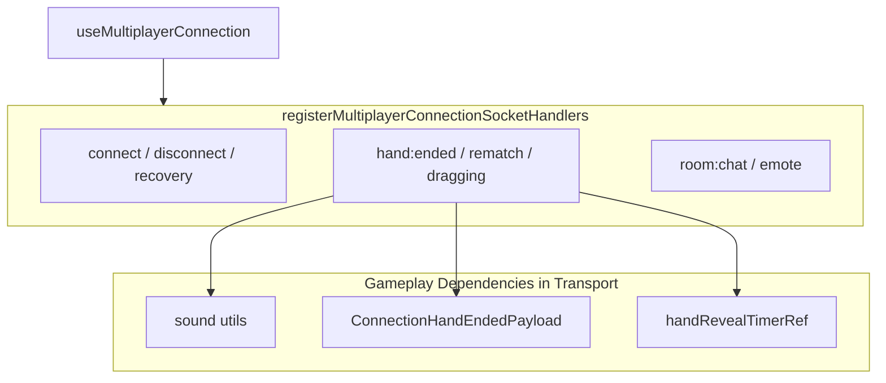
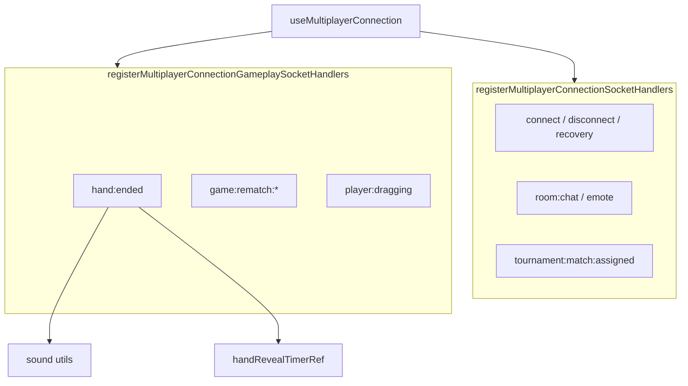
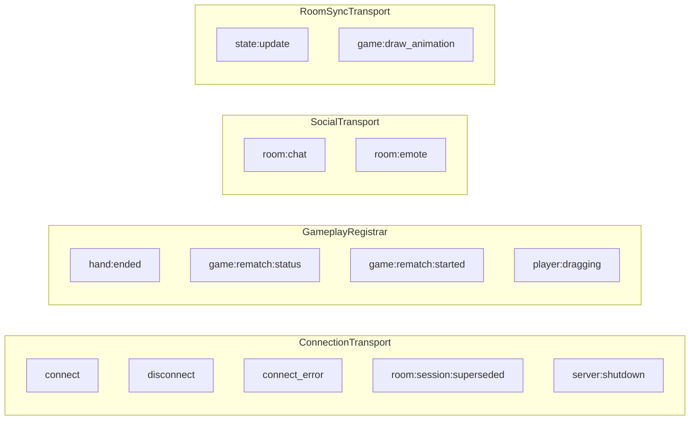

# Multiplayer Gameplay Ownership Restoration — Engineering Report

## Executive Summary

This PR restores correct architectural ownership by extracting live-match **gameplay socket handlers** out of connection transport. Four events — `hand:ended`, `game:rematch:status`, `game:rematch:started`, and `player:dragging` — moved from `registerMultiplayerConnectionSocketHandlers.ts` to a new **`registerMultiplayerConnectionGameplaySocketHandlers.ts`**.

Connection transport now owns only: connect/disconnect lifecycle, recovery routing, presence, room create-on-connect, tournament assignment, social relay, and transport error surfaces.

**Result:** Zero behavior changes. Zero networking changes. Zero frozen-layer modifications. All 1,075 tests pass. Architecture and cycle checks pass with zero violations.

---

## Why This Is the Highest-Leverage Improvement Remaining

The scope trilogy (connection, room-sync, room-actions) eliminated flat parameter bags — the **structural** debt. What remains is **semantic** debt: transport code that makes gameplay decisions (sounds, hand-reveal timers, rematch state, opponent drag UI).

This must happen **before**:

| Deferred work | Why gameplay ownership comes first |
|---------------|-----------------------------------|
| **App cleanup** | App assembly wires connection handlers; wrong ownership in transport obscures what App is actually hosting |
| **Handler decomposition** | Splitting `useRoomSocketSync.ts` without ownership clarity would replicate the same transport/gameplay confusion in more files |
| **Ref bridge removal** | Ref bridges (social, recovery) are App assembly concerns; fixing them doesn't correct which layer owns hand-reveal sequencing |
| **Presentation cleanup** | `MultiplayerGameShell` presentation debt is downstream of correct event ownership — shell shouldn't compensate for transport making gameplay calls |

Gameplay ownership restoration is the **smallest change that corrects layer semantics** without touching frozen protocol/runtime/scope/App.

---

## Principal Engineer Ownership Audit

| Current Responsibility | Current Owner | Correct Owner | Reason | Risk of Moving | Dependencies | Effort |
|------------------------|---------------|---------------|--------|----------------|--------------|--------|
| **`hand:ended` — blocked/hand-win/lose sounds** | Connection transport | **Gameplay registrar** | Audio feedback is match presentation, not wire transport | Low — pure move | `scope.gameplay.isMutedRef`, sound utils | S |
| **`hand:ended` — post-score match-over inference** | Connection transport | **Gameplay registrar** | Score/target logic is game rules projection | Low | `scope.room.stateRef`, payload | S |
| **`hand:ended` — 1400ms hand-reveal timer** | Connection transport | **Gameplay registrar** | Reveal sequencing is live-match UX | Medium — timer edge cases | `handRevealTimerRef`, `setHandReveal` | S |
| **`hand:ended` — `handRevealShownRef` watermark** | Connection transport | **Gameplay registrar** | Reveal dedup is gameplay session state | Low | `scope.gameplay.handRevealShownRef` | S |
| **`game:rematch:status` — ready player IDs** | Connection transport | **Gameplay registrar** | Rematch lobby state is match lifecycle | Low | `scope.ui.setRematch*` | S |
| **`game:rematch:started` — clear reveal, set awaiting** | Connection transport | **Gameplay registrar** | Rematch transition is match lifecycle | Medium — interacts with recovery ref | `rematchAwaitingStateRef`, reveal timer | S |
| **`player:dragging` — opponent drag indicator** | Connection transport | **Gameplay registrar** | Board interaction feedback is match UI | Low | `scope.ui.setOpponentDragging` | S |
| **`disconnect` — clear rematch/drag UI** | Connection transport | Gameplay registrar (future) | Gameplay UI reset on transport drop | Medium — mixed with session teardown | disconnect handler | M |
| **`disconnect` — clear game state on non-recoverable** | Connection transport | Session/recovery (borderline) | Session teardown tied to transport lifecycle | High — recovery paths | recovery machine | M |
| **`room:chat` / `room:emote` relay** | Connection transport | Social/lobby layer | Not gameplay — social feed | Low | `scope.social.appendRoomReactionRef` | S |
| **`tournament:match:assigned` — room + mode** | Connection transport | Tournament/navigation | Tournament routing, not live gameplay | Medium | navigation runtime | M |
| **`connect` — presence identify** | Connection transport | **Connection transport** ✅ | Wire/session identity | — | auth refs | — |
| **`connect` — recovery + auto-join** | Connection transport | **Connection transport** ✅ | Transport recovery | — | recovery machine | — |
| **Normalized router (resync/transport fail)** | Connection transport | **Connection transport** ✅ | Recovery authority | — | recovery machine | — |
| **`connect_error` / `reconnect_failed`** | Connection transport | **Connection transport** ✅ | Transport health | — | recovery machine | — |
| **`server:shutdown` toast** | Connection transport | **Connection transport** ✅ | Infrastructure notice | — | showToast | — |
| **`room:session:superseded`** | Connection transport | **Connection transport** ✅ | Recovery authority | — | recovery machine | — |
| **Draw animation / forced-draw** (`useRoomSocketSync`) | Room-sync transport | Gameplay projection | Already in room-sync; separate from connection | High — 300+ LOC | room-sync scope | L |
| **State projection / sequence gates** (`useRoomSocketSync`) | Room-sync transport | Gameplay projection | Authoritative state hydration | High | room-sync scope | L |

### Smallest Architecture Change Selected

**One new gameplay registrar module** — `registerMultiplayerConnectionGameplaySocketHandlers.ts` — owning the four connection-level gameplay events. No new abstractions, no event bus, no DI, no file decomposition of `useRoomSocketSync.ts`.

`useMultiplayerConnection.ts` composes both registrars with combined teardown. `ConnectionHandEndedPayload` moves to gameplay registrar (deleted misnamed `connectionSocketHandlerParams.ts`).

---

## Files Changed

| File | Action |
|------|--------|
| `client/src/multiplayer/registerMultiplayerConnectionGameplaySocketHandlers.ts` | **Created** — gameplay socket ownership |
| `client/src/multiplayer/registerMultiplayerConnectionSocketHandlers.ts` | **Reduced** — transport-only handlers |
| `client/src/multiplayer/useMultiplayerConnection.ts` | **Updated** — registers both transport + gameplay |
| `client/src/multiplayer/connectionSocketHandlerParams.ts` | **Deleted** — payload moved to gameplay owner |

**Not touched:** `App.tsx`, protocol, runtime, scope trilogy, dep-cruiser, `useRoomSocketSync.ts`, networking wire format.

---

## Ownership Changes

| Symbol / Responsibility | Before | After |
|-------------------------|--------|-------|
| `hand:ended` handler | Connection transport | **Gameplay registrar** |
| `game:rematch:status` handler | Connection transport | **Gameplay registrar** |
| `game:rematch:started` handler | Connection transport | **Gameplay registrar** |
| `player:dragging` handler | Connection transport | **Gameplay registrar** |
| `ConnectionHandEndedPayload` | `connectionSocketHandlerParams.ts` (transport-named) | **Gameplay registrar** |
| `connectionSocketHandlerParams.ts` | Transport params file | **Deleted** |
| Connect/disconnect/recovery/social | Connection transport | Unchanged ✅ |

---

## Dependency Graph Changes

**Before:**
```
registerMultiplayerConnectionSocketHandlers.ts
  ├── utils/sound (gameplay)
  ├── connectionSocketHandlerParams (gameplay payload)
  └── scope.gameplay / scope.ui (gameplay handlers inline)
```

**After:**
```
registerMultiplayerConnectionSocketHandlers.ts
  └── transport + recovery + social only

registerMultiplayerConnectionGameplaySocketHandlers.ts
  ├── utils/sound
  ├── ConnectionHandEndedPayload (owned here)
  └── scope.gameplay / scope.ui / scope.recovery

useMultiplayerConnection.ts
  ├── registerMultiplayerConnectionSocketHandlers
  └── registerMultiplayerConnectionGameplaySocketHandlers
```

**Dep-cruiser:** 658 modules, 2,585 dependencies — zero arch violations, zero cycles.

---

## Coupling Improvements

1. **Transport no longer imports sound utilities** — gameplay presentation decoupled from wire layer.
2. **Gameplay payload type owned by gameplay registrar** — no transport-named params file.
3. **Clear registration seam** — connection controller composes transport + gameplay; each registrar has single ownership.
4. **Scope trilogy unchanged** — both registrars consume `MultiplayerConnectionScope` capability groups (`scope.gameplay`, `scope.ui`, `scope.recovery`).
5. **Enables future ownership moves** — disconnect gameplay cleanup and social relay can follow same pattern without scope changes.

---

## Architectural Diagrams (Mermaid)

### Before: Transport Owns Gameplay



### After: Ownership Restored



### Event Ownership Map



---

## Verification Results

| Check | Result |
|-------|--------|
| `npm run check:multiplayer-arch` | ✅ 0 violations (658 modules, 2,585 deps) |
| `npm run check:multiplayer-cycles` | ✅ 0 violations |
| Typecheck (`tsc -p tsconfig.app.json`) | ✅ Pass |
| Client production build | ✅ Pass (5.54s) |
| Client tests | ✅ 71 files / 562 tests |
| Server tests | ✅ 77 files / 513 tests |

---

## LOC Delta

| File | Before | After | Δ |
|------|--------|-------|---|
| `registerMultiplayerConnectionSocketHandlers.ts` | 312 | 236 | −76 |
| `registerMultiplayerConnectionGameplaySocketHandlers.ts` | 0 | 115 | +115 |
| `connectionSocketHandlerParams.ts` | 14 | 0 (deleted) | −14 |
| `useMultiplayerConnection.ts` | 485 | 494 | +9 |
| **Net** | **811** | **845** | **+34** |

LOC increased slightly due to registrar boilerplate duplication — **intentional**; objective was ownership restoration, not line reduction.

---

## Remaining Technical Debt (ranked by impact)

1. **Disconnect handler gameplay cleanup** — `setRematchRequested`, `setOpponentDragging`, `draggingStateRef` still cleared in transport disconnect handler.
2. **Social events in connection transport** — `room:chat` / `room:emote` belong to social/lobby layer, not connection or gameplay.
3. **`useRoomSocketSync.ts` draw animation** — 300+ LOC of DOM/timer/sound gameplay in room-sync transport (separate bounded context).
4. **Room social ref-bridge** — App ↔ lobby mutable refs; blocked by frozen `App.tsx`.
5. **`recoveryConnectionBridge.ts`** — Legacy ref shim; blocked by frozen `App.tsx`.
6. **`tournament:match:assigned` in connection transport** — Navigation/tournament routing mixed with transport.
7. **`MultiplayerGameShell.tsx` (1,042 LOC)** — Presentation assembly god-object.
8. **Scope contract tests** — No tests documenting registrar ownership boundaries.

---

## If Chess.com Were Reviewing This PR

1. **"Correct direction, partial execution."** Four gameplay events moved; disconnect still clears rematch/drag state in transport. They'd want a follow-up PR or explicit comment marking deferred ownership.
2. **"Social still in connection transport."** `room:chat`/`room:emote` are not gameplay but also not transport — next ownership move is obvious.
3. **"+34 LOC for ownership is fine."** Chess.com prefers honest layering over LOC metrics; they'd approve the trade.
4. **"No ownership enforcement in CI."** Dep-cruiser doesn't yet forbid `utils/sound` imports from connection transport registrar — a rule could prevent regression.
5. **"Room-sync draw animation is the elephant."** Bigger gameplay-in-transport problem lives in `useRoomSocketSync.ts`; connection fix is the warm-up.
6. **"Good use of existing scope."** Both registrars share `getScope()` without new abstractions — exactly the restraint they'd want.

---

## Recommended Next Principal Engineer PR

**Move social socket handlers (`room:chat`, `room:emote`) out of connection transport** into a `registerMultiplayerConnectionSocialSocketHandlers.ts` (or extend room-actions/lobby registrar) — completing connection transport purification before touching `useRoomSocketSync.ts` draw animation ownership.

**Why next:** Connection transport should be wire + recovery only. Social relay is the remaining non-transport, non-gameplay responsibility in the connection registrar — smallest next ownership correction with same pattern as this PR.

---

*PR complete. Gameplay socket handlers restored to gameplay ownership. Awaiting Principal Engineer review. No further changes initiated.*