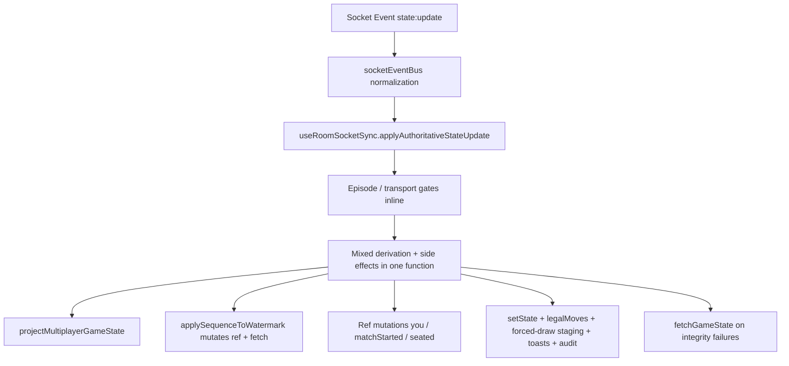
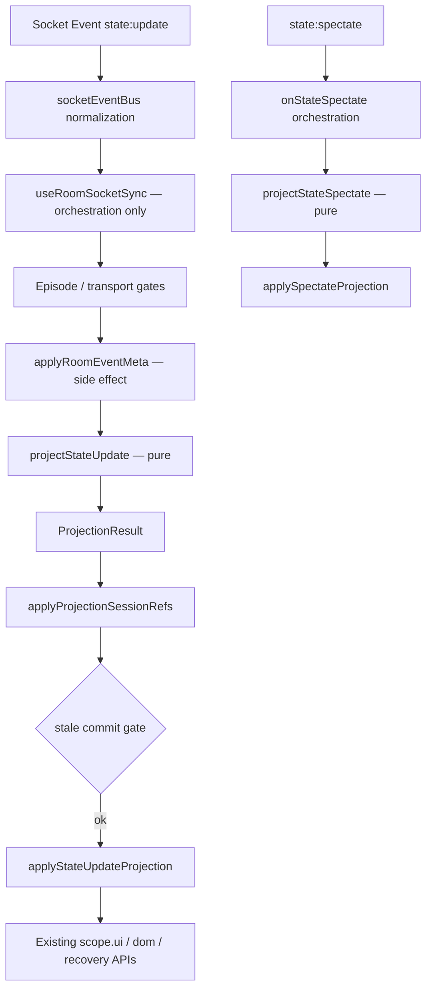

# Multiplayer Projection Layer Extraction Report

**Date:** 2026-07-05  
**Objective:** Introduce the first true Projection Layer by extracting authoritative `state:update` / `state:spectate` derivation out of `useRoomSocketSync.ts` without changing runtime behavior.  
**Status:** Complete — architecture checks, typecheck, client/server build, vitest (562), and multiplayer behavior tests green.

---

## 1. Architecture Diagram — Before / After

### Before



Transport, projection, and application were co-located in `applyAuthoritativeStateUpdate` (~250 lines of business logic inside a React hook effect).

### After



**New module boundary:** `client/src/multiplayer/projection/`

| File | Role |
|------|------|
| `projectionGates.ts` | Pure episode/replay/transport/commit gate helpers (moved from transport) |
| `projectionTypes.ts` | `ProjectionResult` / `ForcedDrawStaging` / context types |
| `projectStateUpdate.ts` | Pure `state:update` projector |
| `projectStateSpectate.ts` | Pure `state:spectate` projector |
| `applyProjectionResult.ts` | Applies projection output via existing `MultiplayerRoomSyncScope` APIs |

---

## 2. Ownership Table

| Concern | Owner (after) | Layer |
|---------|---------------|-------|
| Socket ingestion / normalization | `socketEventBus.ts` | Transport |
| Episode sequence cursor refs | `useRoomSocketSync.ts` | Transport orchestration |
| Closed/stale episode drop | `projection/projectionGates.ts` | Transport gate (pure fn) |
| Transport replay dedup | `projection/projectionGates.ts` | Transport gate (pure fn) |
| Rematch session reset | `useRoomSocketSync.ts` | Transport side effect |
| `applyRoomEventMeta` (watermark reset) | `useRoomSocketSync.ts` → `scope.ui` | Transport side effect (pre-projection) |
| Pre-projection replay drop | `projection/projectStateUpdate.ts` | **Projection** |
| Board snapshot hydration | `boardSnapshotGuards.ts` (called by projector) | **Projection** |
| Sequence watermark decision | `socketGuards.evaluateSequenceWatermark` + projector | **Projection** (pure decision) |
| Sequence watermark ref write | `applyProjectionResult.applyProjectionSessionRefs` | Application |
| `you` / `matchStarted` / seated inference | `projection/projectStateUpdate.ts` | **Projection** |
| Hand identity mismatch signal | `projection/projectStateUpdate.ts` | **Projection** (signal only) |
| Legal moves / canDraw / preGameDraw | `projection/projectStateUpdate.ts` | **Projection** |
| Forced-draw staging **decisions** | `projection/projectStateUpdate.ts` | **Projection** |
| Forced-draw staging **application** | `applyProjectionResult.ts` | Application |
| Recovery idle UI hint | projector decides; applier applies | Projection → Application |
| Opponent disconnect clear | projector decides; applier applies | Projection → Application |
| `fetchGameState` on drop | `useRoomSocketSync.ts` | Transport orchestration |
| `fetchGameState` on hand mismatch | `applyProjectionResult.ts` | Application (preserves continue-after-fetch) |
| Stale projection commit gate | `useRoomSocketSync.ts` + `projectionGates.ts` | Transport orchestration |
| Draw animation / timers / sounds | `useRoomSocketSync.ts` (`game:draw_animation`) | Presentation (unchanged) |
| Recovery authority | `recoveryMachine.ts` (frozen) | Recovery |

---

## 3. Exact List of Logic Moved

### Into `projection/projectionGates.ts` (from `useRoomSocketSync.ts`)

- `STATE_REPLAY_SILENT_DROP_GAP`
- `shouldDropPreProjectionStateReplay`
- `shouldDropStaleEpisodeStateUpdate`
- `nextEpisodeSequenceCursor`
- `shouldDropTransportReplayProjection`
- `shouldDropStaleProjectionCommit`
- `shouldDropClosedEpisodeProjection`

### Into `projection/projectStateUpdate.ts` (pure derivation)

- Pre-projection state replay drop (`shouldDropPreProjectionStateReplay`)
- Authoritative `GameState` projection via `projectMultiplayerGameState`
- Event-meta watermark reset detection (`maxSeqBeforeMeta !== maxSeq && maxSeq === -1`)
- Fresh-match-requires-sequence guard
- Sequence watermark evaluation via `evaluateSequenceWatermark` (new pure helper in `socketGuards.ts`)
- Seated-player inference (`isSeatedPlayerClear` when `youId` ∉ `playerIds`)
- Hand identity mismatch detection (`hasHandIdentityMismatch` → `resyncAfterApply` signal)
- `matchStarted` / `playerReadyEmitted` derivation
- `you` identity derivation
- Legal moves derivation (`payload.legalMoves` normalization)
- `canDraw` derivation
- `preGameDraw` derivation
- Forced-draw staging **decisions** (self / opponent / clear paths with staged hand counts and boneyard values)
- Recovery idle hint flag (`showRecoveryIdleHint` when `joinedRoom`)
- Opponent disconnect projection reset flag
- `waiting_for_ready` error clear flag (`isActiveGameplayState`)
- Auto-pass player ID list derivation

### Into `projection/projectStateSpectate.ts`

- Spectator-in-roster early drop
- Spectator snapshot projection via `projectMultiplayerGameState`
- Spectator sequence watermark evaluation
- Spectator forced-draw clear staging (legalMoves=[], canDraw=false, clear draw preview payload)

### Into `projection/applyProjectionResult.ts` (application only)

- `maxSequenceRef` write from projected watermark
- Session ref writes (`isSeatedPlayer`, `matchStarted`, `playerReadyEmitted`, `youRef`)
- `setState`, `setLegalMoves`, `setCanDraw`, `setPreGameDraw`
- Recovery idle hint application
- Forced-draw UI/ref application (`pendingForcedHandRevealRef`, draw step setters, boneyard display)
- `clearDrawPreview` (timers + flying tiles — presentation, not derivation)
- Auto-pass toast + `drawAudit`
- Room-update `drawAudit`
- Opponent disconnect flag clears
- `mpPerfMarkStateApplied` (debug)
- `onAuthoritativeGameplayStateApplied` callback
- `markProcessedTransportEventId` (post-commit)
- `fetchGameState('hand_identity_mismatch')` (non-blocking, preserves original continue-after-fetch)
- Sequence regression error logging (`logSequenceRegressionDrop`)

### Into `socketGuards.ts`

- `evaluateSequenceWatermark(watermark, incoming)` — pure sequence decision extracted from ref-mutating `evaluateSequenceUpdate`

---

## 4. Exact List Intentionally NOT Moved

| Logic | Location | Reason |
|-------|----------|--------|
| Episode validation + cursor ref updates | `useRoomSocketSync.ts` | Transport orchestration; uses hook-local refs |
| Transport replay dedup invocation | `useRoomSocketSync.ts` | Transport gate timing |
| `commitId` / `currentCommitRef` lifecycle | `useRoomSocketSync.ts` | Concurrency orchestration |
| Rematch `resetClientGameSession` | `useRoomSocketSync.ts` | Recovery side effect |
| `applyRoomEventMeta` | `useRoomSocketSync.ts` (pre-projection) | Mutates watermark via UI callback — not deterministic input |
| `fetchGameState` on projection drop | `useRoomSocketSync.ts` | Network/recovery side effect |
| Resync buffering (`resyncInFlightRef`) | `useRoomSocketSync.ts` | Transport flow control |
| `game:draw_animation` handler | `useRoomSocketSync.ts` | Timers, DOM rects, sounds, flying tiles |
| `recordForcedDrawStateEvent` diagnostic watchdog | `useRoomSocketSync.ts` | `setTimeout` diagnostic only |
| `clearTimeout` on draw sequence | `applyProjectionResult.ts` | Timer side effect (presentation boundary) |
| `room:update`, `player:disconnected`, etc. | `useRoomSocketSync.ts` | Unrelated transport handlers |
| Recovery machine | `recoveryMachine.ts` | Frozen |
| Protocol / runtime layers | frozen paths | Frozen |
| `App.tsx` | unchanged | Frozen |

---

## 5. Dependency Graph Changes

### New edges

```
useRoomSocketSync.ts
  → projection/applyProjectionResult.ts
  → projection/projectionGates.ts
  → projection/projectStateUpdate.ts
  → projection/projectStateSpectate.ts

projection/projectStateUpdate.ts
  → boardSnapshotGuards.ts
  → handIdentity.ts
  → socketGuards.ts (evaluateSequenceWatermark)
  → protocol/ (types only)
  → projectionGates.ts
  → projectionTypes.ts

projection/projectStateSpectate.ts
  → boardSnapshotGuards.ts
  → socketGuards.ts
  → projectionTypes.ts

projection/applyProjectionResult.ts
  → multiplayerRoomSyncScope.ts (types)
  → socketEventBus.ts (markProcessedTransportEventId)
  → drawAudit.ts, mpPerf.ts, logger.ts
  → projectionGates.ts, projectionTypes.ts

projection/projectionGates.ts
  → socketEventBus.ts (hasProcessedTransportEventId — read-only dedup registry)
```

### Removed / simplified

- `useRoomSocketSync.ts` no longer imports `boardSnapshotGuards`, `handIdentity`, `evaluateSequenceUpdate`, `markProcessedTransportEventId`, `hasProcessedTransportEventId`, `mpPerfMarkStateApplied` directly for state projection paths.

### Verification

```
npm run check:multiplayer-arch   ✔ (663 modules, 2607 dependencies)
npm run check:multiplayer-cycles ✔ (acyclic)
```

**Projection layer properties confirmed:**

- No React imports in `projectStateUpdate.ts` / `projectStateSpectate.ts` / `projectionGates.ts` / `projectionTypes.ts`
- No socket access in pure projector files
- `applyProjectionResult.ts` is the sole projection→runtime bridge (uses React ref types only for commit gate)

---

## 6. Remaining Projection Violations

These are **known, intentional** remaining mixes — out of scope for this PR:

| Violation | Location | Notes |
|-----------|----------|-------|
| `applyRoomEventMeta` before projector | `useRoomSocketSync.ts` | Side-effectful metadata application mutates watermark; projector receives post-meta watermark as input. Future PR could make meta derivation pure if `applyRoomEventMeta` is split into derive+apply. |
| Episode gates read `socketEventBus` module state | `projectionGates.ts` | `hasProcessedTransportEventId` is transport dedup registry, not socket I/O. Acceptable gate dependency. |
| `clearDrawPreview` in applier | `applyProjectionResult.ts` | Timer/DOM-adjacent presentation; correctly excluded from pure projector. |
| `game:draw_animation` inline staging | `useRoomSocketSync.ts` | Animation path still computes staged hands during presentation; not authoritative projection. |
| `joinAckCoordinator` / connection handlers | other multiplayer files | May still project or mutate state outside this seam. |
| No dedicated projection unit tests yet | — | Gate helpers retain behavior tests via re-exports from `useRoomSocketSync.ts`; `projectStateUpdate` has no dedicated test file in this PR. |

---

## 7. Risk Analysis

| Risk | Severity | Mitigation |
|------|----------|------------|
| Behavior drift in forced-draw staging | Medium | Staging decisions extracted verbatim; applier preserves branch order (self → opponent → clear). Manual QA on forced-draw chains recommended. |
| Stale-commit + ref mutation ordering | Medium | Preserved: `applyProjectionSessionRefs` runs before commit check; UI apply after commit check — matches pre-extraction order. |
| Hand identity mismatch continues after fetch | Low | Explicitly preserved: `resyncAfterApply` triggers fetch without aborting UI apply. |
| Sequence regression log field drift | Low | `logSequenceRegressionDrop` uses `payload.state.sequence` + current watermark; equivalent when projection accepts sequence. |
| `applyRoomEventMeta` ordering | Low | Still invoked immediately before `projectStateUpdate`; `maxSequenceWatermarkBeforeMeta` captured correctly. |
| Test import stability | Low | Gate exports re-exported from `useRoomSocketSync.ts` — all behavior tests unchanged. |

---

## 8. Five-Year Architectural Impact

1. **Testable contract:** `projectStateUpdate(context) → ProjectionResult` is now the canonical place to add golden-frame tests for reconnect ghosts, fresh-match watermarks, and forced-draw staging — without mounting React or sockets.

2. **Replay / sim foundation:** The pure projector can be fed recorded `StateUpdatePayload` frames for offline regression (Chess.com-style "client state machine from log") without pulling transport.

3. **Thin transport forever:** `useRoomSocketSync` is now defensible as orchestration. Future socket events should follow the same `validate → project → apply` template.

4. **Applier consolidation:** `applyProjectionResult.ts` is the single imperative sink for multiplayer gameplay chrome updates from authoritative state — future UI refactors touch one file.

5. **Meta projection follow-up:** The largest remaining impurity is `applyRoomEventMeta` running pre-projection. A follow-up can return `EventMetaProjection` from a pure function and apply watermark reset in the applier.

6. **No architectural debt added:** No event buses, no new state machines, no flat bags, no protocol/runtime edits — boundary addition only.

---

## 9. Chess.com Principal Engineer Review

**Verdict: Approve with one follow-up recommendation.**

**Strengths**

- Correct seam placement: transport validates episodes, pure function projects, applier mutates. This mirrors how Chess.com separates "apply move to internal board" from "render board."
- Zero behavior ambition: no drive-by refactors, no symbol renames, frozen layers respected.
- Commit gate stays in orchestration, not buried in applier — good for reasoning about concurrent `state:update` races.
- `evaluateSequenceWatermark` extraction removes hidden ref mutation from the derivation path — the right long-term primitive.

**Concerns (non-blocking)**

- `applyProjectionResult.ts` still owns presentation-adjacent work (`clearDrawPreview`, toasts). Acceptable for PR1; document as "application layer includes presentation side effects until draw-presentation scope exists."
- No golden tests for `projectStateUpdate` yet — ship fast, but add before the next multiplayer integrity change.
- `projectionGates.ts` importing `socketEventBus` couples projection folder to transport dedup state. Consider injecting `hasProcessedTransportId` as a predicate in a future PR to make gates fully pure relative to module globals.

**Would not block merge.**

---

## 10. Recommended Next PR

**Title:** `multiplayer: projection golden tests + eventMeta pure derivation`

**Scope:**

1. Add `projectStateUpdate.test.ts` with golden frames for:
   - pre-projection replay silent drop
   - fresh-match watermark reset + missing sequence
   - sequence regression / stale rejection
   - self/opponent/clear forced-draw staging
   - hand identity mismatch signal (apply continues)

2. Split `applyRoomEventMeta` into:
   - `deriveEventMetaWatermarkReset(meta, currentWatermark) → number` (pure, in `projection/`)
   - apply in transport before `projectStateUpdate`

3. Optional: extract `game:draw_animation` staging into `projection/deriveDrawAnimationStaging.ts` (presentation-adjacent but deterministic) — only if draw bugs recur.

**Do not:** touch recovery machine, protocol, connection scope, or App.tsx.

---

## Verification Summary

| Check | Result |
|-------|--------|
| `npm run typecheck --prefix client` | ✔ Pass |
| `npm run check:multiplayer-arch` | ✔ Pass |
| `npm run check:multiplayer-cycles` | ✔ Pass |
| `npm run build --prefix client` | ✔ Pass |
| `npm run build --prefix server` | ✔ Pass |
| `vitest run` | ✔ 562 tests |
| `socketEventBus.dedup.behaviorTests.ts` | ✔ Pass |
| `socketEventBus.episodeOrdering.behaviorTests.ts` | ✔ Pass |
| `recoveryMachine.contract.final.behaviorTests.ts` | ✔ Pass |
| `recoveryMachine.production.invariantTests.ts` | ✔ Pass |

---

## Files Changed

| File | Change |
|------|--------|
| `client/src/multiplayer/projection/projectionGates.ts` | **New** — pure gate helpers |
| `client/src/multiplayer/projection/projectionTypes.ts` | **New** — projection I/O types |
| `client/src/multiplayer/projection/projectStateUpdate.ts` | **New** — pure `state:update` projector |
| `client/src/multiplayer/projection/projectStateSpectate.ts` | **New** — pure `state:spectate` projector |
| `client/src/multiplayer/projection/applyProjectionResult.ts` | **New** — projection applier |
| `client/src/multiplayer/useRoomSocketSync.ts` | Refactored to orchestration; re-exports gates |
| `client/src/multiplayer/socketGuards.ts` | Added `evaluateSequenceWatermark` pure helper |
| `docs/multiplayer-projection-layer-extraction-report.md` | **New** — this report |