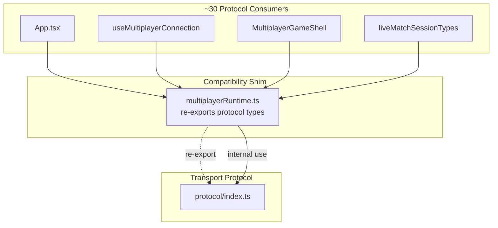

# Multiplayer Protocol Shim Removal — Engineering Report

**Date:** 2026-07-05  
**Scope:** Eliminate temporary `multiplayerRuntime` → `protocol` compatibility re-exports  
**PR objective:** Complete architectural ownership migration for wire contracts  
**Stance:** Principal Engineer refinement — no behavior changes

---

## Implemented: Improvement #8 — Complete Protocol Consumer Migration

**Remove the temporary compatibility layer** introduced in the prior PR.

All socket wire contracts (`StateUpdatePayload`, `RoomPlayer`, `RoomRecoveryState`, `RoomIdentity`, `RoomEventMeta`, `normalizeRoomPlayers`) are now imported exclusively from `multiplayer/protocol`. `multiplayerRuntime` owns runtime bag types only.

---

## Architecture Improvement Plan (Ranked — Updated)

Items **#1** and **#8** from the prior plan are now **complete**. Remaining items unchanged in priority:

| Rank | Item | Status |
|------|------|--------|
| 1 | Extract stable transport protocol layer | ✅ Done (prior PR) |
| 2 | Extract `App.tsx` multiplayer integration kernel | Open |
| 3 | Collapse three-path state read model | Open |
| 4 | Decompose `useLiveMatchSession` | Open |
| 5 | Bound recovery machine behind stable feature API | Open |
| 6 | Split `socketEventBus` transport from side-effects | Open |
| 7 | Eliminate `MultiplayerShellDelegates` sideways coupling | Open |
| **8** | **Migrate all protocol consumers off `multiplayerRuntime`** | **✅ Done (this PR)** |
| 9 | Deduplicate `RoomEventMeta` | **✅ Done (this PR)** |
| 10 | Shared server–client protocol package | Open |
| 11 | Tournament attach as isolated vertical slice | Open |
| 12 | Fix `drawSequenceActive` ordering | Open |

---

## Post-Implementation Report

### Files changed

| File | Action |
|------|--------|
| `client/src/multiplayer/multiplayerRuntime.ts` | Removed all protocol re-exports; internal protocol imports only for runtime bag type definitions |
| `client/src/App.tsx` | Protocol imports; removed local `RoomRecoveryState` duplicate |
| `client/src/multiplayer/useJoinAckCoordinator.ts` | `RoomPlayer`, `RoomEventMeta` from `protocol` |
| `client/src/multiplayer/joinAckCoordinator.ts` | `RoomPlayer`, `RoomEventMeta` from `protocol`; removed local `RoomEventMeta` definition |
| `client/src/multiplayer/multiplayerGameShellTypes.ts` | Protocol types from `protocol`; `FriendInviteState` from runtime |
| `client/src/multiplayer/privateMatchLobbyScreenTypes.ts` | `RoomPlayer`, `RoomRecoveryState` from `protocol`; removed local `RoomRecoveryState` definition |
| `client/src/multiplayer/privateMatchLobbyViewModel.ts` | `RoomPlayer` from `protocol` |
| `client/src/multiplayer/PrivateMatchLobbyControlPanel.tsx` | `RoomPlayer`, `RoomRecoveryState` from `protocol` |
| `client/src/multiplayer/useMultiplayerConnection.ts` | `RoomPlayer`, `RoomRecoveryState` from `protocol` |
| `client/src/multiplayer/useMultiplayerRoomActions.ts` | `RoomPlayer` from `protocol` |
| `client/src/multiplayer/useMultiplayerLobbyController.ts` | `RoomPlayer` from `protocol` |
| `client/src/multiplayer/useMultiplayerLobbyHostProps.ts` | `RoomPlayer` from `protocol` |
| `client/src/multiplayer/useMultiplayerConnectionHostParams.ts` | `RoomPlayer`, `RoomRecoveryState` from `protocol` |
| `client/src/multiplayer/useMultiplayerPresentation.ts` | `RoomPlayer` from `protocol` |
| `client/src/multiplayer/recoveryConnectionBridge.ts` | `RoomRecoveryState` from `protocol` |
| `client/src/multiplayer/recoveryMachine.production.invariantTests.ts` | `StateUpdatePayload` from `protocol` |
| `client/src/multiplayer/MultiplayerGameShell.tsx` | `normalizeRoomPlayers` from `protocol` |
| `client/src/multiplayer/useRoomSocketSync.ts` | Removed local `RoomEventMeta`; imports from `protocol` |
| `client/src/match/session/liveMatchSessionTypes.ts` | Removed duplicate `RoomEventMeta`; imports from `protocol` |
| `client/src/match/session/roomSocketSyncParams.ts` | `RoomEventMeta` from `protocol` |
| `client/src/match/session/actions/useLiveMatchActions.ts` | `RoomRecoveryState` from `protocol` |
| `client/src/match/session/input/useTileSelection.ts` | `RoomRecoveryState` from `protocol` |
| `client/src/match/session/viewModel/useLiveMatchViewModel.ts` | `RoomRecoveryState` from `protocol` |
| `client/src/multiplayer/multiplayerRuntime.test.ts` | **Deleted** — tested protocol function via shim; covered by `roomProtocol.test.ts` |

### Architectural diagrams

#### Before — compatibility shim (prior PR state)

#### After — direct protocol ownership

```mermaid
flowchart TB
  subgraph ProtocolConsumers["26 Direct Protocol Consumers"]
    APP["App.tsx"]
    CONN["useMultiplayerConnection"]
    SHELL["MultiplayerGameShell"]
    MATCH["liveMatchSessionTypes"]
    JAC["joinAckCoordinator"]
    URS["useRoomSocketSync"]
  end

  subgraph RuntimeConsumers["21 Runtime-Only Consumers"]
    LOBBY["useMultiplayerLobbyController"]
    ROUTES["appRouteTypes"]
    TOUR["tournament session hooks"]
  end

  subgraph Protocol["Transport Protocol — Stable API"]
    PI["protocol/index.ts"]
    RP["protocol/roomProtocol.ts"]
  end

  subgraph Runtime["Runtime Bags Only"]
    MR["multiplayerRuntime.ts<br/>25+ runtime bag types<br/>zero protocol exports"]
  end

  PI --> RP
  APP --> PI
  CONN --> PI
  SHELL --> PI
  MATCH --> PI
  JAC --> PI
  URS --> PI

  LOBBY --> MR
  ROUTES --> MR
  TOUR --> MR
  MATCH --> MR
  MR -->|internal types only| PI

  style PI fill:#1a3a5c,stroke:#4da3ff
  style MR fill:#2a2a3a,stroke:#888
```

#### Dependency direction achieved

```mermaid
flowchart TD
  UI["UI / Views"]
  CTRL["Controllers / Hooks"]
  RT["multiplayerRuntime<br/>(runtime bags)"]
  PROTO["multiplayer/protocol<br/>(wire contract)"]
  TRANS["roomTransport / socketEventBus"]
  SOCK["Socket.IO"]

  UI --> CTRL
  CTRL --> RT
  CTRL --> PROTO
  RT --> PROTO
  CTRL --> TRANS --> SOCK

  style PROTO fill:#1a3a5c,stroke:#4da3ff
```

### Dependency graph changes

| Metric | Before (shim PR) | After (this PR) |
|--------|------------------|-----------------|
| Files importing `protocol/` directly | 8 | **26** |
| Files importing protocol types via `multiplayerRuntime` | ~30 | **0** |
| Protocol re-exports from `multiplayerRuntime` | 6 types + `normalizeRoomPlayers` | **0** |
| Duplicate `RoomEventMeta` definitions | 5 | **1** (canonical in `protocol/`) |
| Duplicate `RoomRecoveryState` definitions | 3 | **1** (canonical in `protocol/`) |

### Coupling improvements

- **Shim eliminated:** No consumer can accidentally depend on `multiplayerRuntime` for wire contracts.
- **Honest import graph:** Protocol consumers visibly import from `multiplayer/protocol`.
- **Runtime isolation:** `multiplayerRuntime` is now exclusively a runtime bag type module (internal protocol import for composing bag shapes only).
- **Type drift removed:** `RoomEventMeta` and `RoomRecoveryState` duplicates in `joinAckCoordinator`, `liveMatchSessionTypes`, `useRoomSocketSync`, `privateMatchLobbyScreenTypes`, and `App.tsx` consolidated to single canonical definitions.

### Public API changes

**Removed from `multiplayerRuntime` exports:**

- `RoomEventMeta`
- `StateUpdatePayload`
- `RoomRecoveryState`
- `RoomIdentity`
- `RoomPlayer`
- `normalizeRoomPlayers()`

**Retained in `multiplayerRuntime` exports (runtime ownership):**

- `MultiplayerSocketRuntime`, `MultiplayerRoomRuntime`, `MultiplayerReconnectRuntime`
- `MultiplayerJoinFlightRuntime`, `MultiplayerAuthRuntime`, `MultiplayerNavigationRuntime`
- `MultiplayerRecoveryRuntime`, `MultiplayerSessionRefsRuntime`, `MultiplayerGameplayRefsRuntime`
- `TournamentAttachRuntime`, `FriendInviteState`
- `MultiplayerRoomActionsTransport`, `MultiplayerConnectionConfig`, `MultiplayerConnectionState`
- `MultiplayerControllerConnectionBundle`, `MultiplayerControllerLobbySnapshot`
- All other runtime bag / callback / setter types

### Ownership changes

| Concern | Owner (now) |
|---------|-------------|
| Wire payload types | `multiplayer/protocol/` |
| Roster normalization | `multiplayer/protocol/roomProtocol.ts` |
| Socket ref bags, join flight, reconnect guards | `multiplayer/multiplayerRuntime.ts` |
| Friend invite UI state | `multiplayer/multiplayerRuntime.ts` (`FriendInviteState`) |
| Tournament attach refs | `multiplayer/multiplayerRuntime.ts` (`TournamentAttachRuntime`) |

### LOC before / after

| Artifact | Before | After | Δ |
|----------|--------|-------|---|
| `multiplayerRuntime.ts` | 393 | 380 | −13 (re-exports removed) |
| `multiplayerRuntime.test.ts` | 26 | 0 (deleted) | −26 |
| Duplicate type defs across codebase | ~45 lines | 0 | −45 |
| **Net** | — | — | **~−58 LOC** (no new files) |

### Verification

| Check | Result |
|-------|--------|
| Client tests | **71 files / 562 tests PASS** (−1 file, −3 tests: removed duplicate `multiplayerRuntime.test.ts`) |
| Server tests | **77 files / 513 tests PASS** |
| Typecheck + build | **PASS** (`tsc -b && vite build`) |
| Lint (migrated paths) | **0 errors**, 142 pre-existing warnings |
| Behavior | **No intentional behavior change** |

---

## Remaining Technical Debt

1. **`App.tsx` integration kernel** (~1,554 LOC) — dominant scaling risk
2. **`multiplayerRuntime.ts` still exports 25+ runtime bag types** — next split: connection vs room-actions vs recovery bags
3. **Three-path state read model** — React state / `stateRef` / `multiplayerGameSnapshot`
4. **`useRoomSocketSync` (1,024 LOC) + `MultiplayerGameShell` (1,042 LOC)** — orchestration hubs
5. **`recoveryMachine.ts` (870 LOC)** — good FSM, leaky integration
6. **`useLiveMatchSession` (~1,100 LOC)** — monolithic session hook
7. **`MultiplayerShellDelegates`** — sideways coupling from connection to shell
8. **`useRoomSocketSync` still re-exports `StateUpdatePayload`** — minor; consumers could import from `protocol/` directly
9. **`privateMatchLobbyScreenTypes` re-exports `RoomRecoveryState`** — convenience re-export; could be removed for stricter protocol-only imports
10. **No shared server–client protocol package** — organizational separation only, not contract enforcement
11. **Placement-blocking bug** — diagnostics in place; root cause not fixed

---

## If Chess.com Were Reviewing This PR, What Criticisms Would Remain?

1. **"Good — you finished the migration. Now split the runtime bags."** `multiplayerRuntime.ts` still exports 25+ types in one file. Chess.com would want `connectionRuntime.ts`, `roomActionsRuntime.ts`, `recoveryRuntime.ts` as separate bounded-context type modules.

2. **"App.tsx is still the multiplayer monolith."** Protocol ownership is clean, but socket lifecycle, recovery dispatch, and tournament attach still live at the app root.

3. **"Where is the authoritative game state selector?"** Three read paths remain. Protocol migration doesn't solve state ownership duplication.

4. **"Protocol is still client-only."** Without `@racehorse/multiplayer-protocol` shared with the server, this is a folder move — not contract enforcement.

5. **"useRoomSocketSync is still a god hook."** 1,000+ LOC mixing transport ingestion, draw animation staging, and UI side-effects. Next refactor target.

6. **"Recovery integration is still scattered."** The FSM is solid; wiring through App + connection + bridge callbacks is not.

7. **"Minor: stop re-exporting StateUpdatePayload from useRoomSocketSync."** One more transitive path that obscures the canonical import (`multiplayer/protocol`).

---

## Status

Stopped after one improvement per instructions. Protocol shim fully removed. Ready for Principal Engineer review before proceeding to item **#2** (App.tsx session host extraction) or runtime bag decomposition.