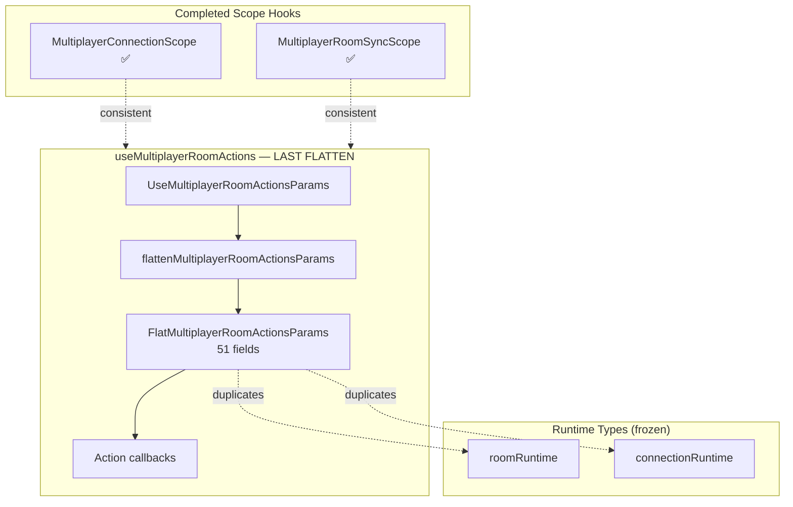
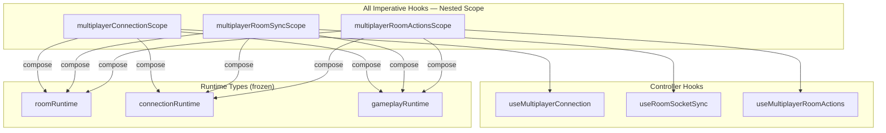
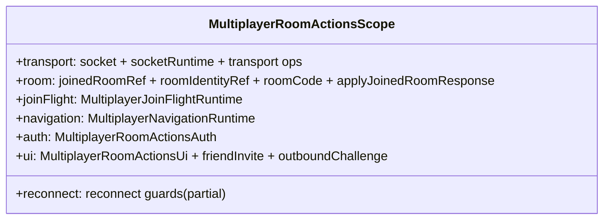

# Multiplayer Room Actions Scope Extraction — Engineering Report

## Executive Summary

This PR eliminates `FlatMultiplayerRoomActionsParams` — the **last remaining flatten/ref-bag pattern** in multiplayer orchestration. Room action handlers now read a **nested `MultiplayerRoomActionsScope`** with seven capability groups: `transport`, `room`, `joinFlight`, `reconnect`, `navigation`, `auth`, and `ui`.

**Result:** Zero behavior changes. Zero networking changes. Zero frozen-layer modifications. All three imperative multiplayer hooks now use nested scopes:

| Hook | Scope |
|------|-------|
| `useMultiplayerConnection` | `MultiplayerConnectionScope` ✅ |
| `useRoomSocketSync` | `MultiplayerRoomSyncScope` ✅ |
| `useMultiplayerRoomActions` | `MultiplayerRoomActionsScope` ✅ (this PR) |

Architecture and cycle checks pass with zero violations. All 1,075 tests pass. Production build succeeds.

**No flat parameter bags remain inside multiplayer orchestration.**

---

## Why this improvement was chosen

### Why this is the highest-leverage remaining improvement

After connection scope and room-sync scope extraction, **`useMultiplayerRoomActions.ts` was the sole remaining hook that undid runtime slice ownership via flatten-and-spread.** Every prior PR in this series established honest layers, then two of three imperative hooks were fixed. Leaving room-actions flattened would mean:

1. **Incomplete architecture** — two hooks preserve slices at the transport boundary, one still flattens
2. **Continued type duplication** — 51 fields listed twice (runtime types + flat type)
3. **Future handler changes still widen a god-bag** — create/join/invite/challenge flows add fields to the wrong abstraction
4. **Blocks consistent testing/mocking** — no capability-group surface for room action unit tests

This PR **completes the scope trilogy** — the architectural invariant the entire refinement series was building toward.

### Comparison against every other remaining candidate

| Candidate | Impact | Why NOT this PR |
|-----------|--------|-----------------|
| **Room actions scope extraction** | **Highest** — completes flatten elimination; closes the scope trilogy | **Selected** |
| Split `useRoomSocketSync.ts` (925 LOC) | High local maintainability | Explicitly forbidden — large file ≠ architectural problem; scope must stabilize first |
| Extract gameplay handlers from connection transport (`hand:ended`, rematch, dragging) | Correct layering | Wrong-layer handlers still work; scope grouping makes future extraction easier but isn't blocked by flat bag anymore |
| Room social ref-bridge elimination | Medium coupling reduction | **Blocked** — requires `App.tsx` changes (frozen) |
| `recoveryConnectionBridge.ts` legacy shim removal | Medium | **Blocked** — App owns recovery refs (frozen) |
| Shrink `MultiplayerGameShell.tsx` (1,042 LOC) | High presentation debt | Assembly god-object; secondary until imperative boundaries are consistent (now done) |
| Merge host-param hooks (`useMultiplayerConnectionHostParams` + `useMultiplayerLobbyHostProps`) | Medium boilerplate | Does not fix flatten pattern; cosmetic assembly reduction |
| `joinAckCoordinator.ts` flatten consumption in `liveMatchSessionTypes.ts` | Medium | Separate bounded context (match session); not a multiplayer-orchestration flatten hook |
| Handler module decomposition (per-event files) | Medium maintainability | Premature until all three hooks share scope pattern (now satisfied) |
| Scope contract tests | Low-medium | Valuable but additive; doesn't remove architectural debt |
| Draw animation extraction from room-sync | Medium layering | Gameplay-adjacent DOM logic; separate concern from flatten elimination |

**Principal Engineer rationale:** The refinement series had a clear terminus — **zero flat bags in multiplayer orchestration.** Room-actions scope was the only remaining step to reach that invariant without touching frozen foundations, App.tsx, gameplay, or networking.

---

## Files Changed

| File | Action |
|------|--------|
| `client/src/multiplayer/multiplayerRoomActionsScope.ts` | **Created** — `MultiplayerRoomActionsScope`, `MultiplayerRoomActionsScopeSource`, `createMultiplayerRoomActionsScope()` |
| `client/src/multiplayer/useMultiplayerRoomActions.ts` | **Refactored** — `scopeRef` + nested access; removed flat type and flatten function; `UseMultiplayerRoomActionsParams` aliases scope source |

**Not touched:** `App.tsx`, `multiplayer/protocol/*`, `multiplayer/runtime/*`, existing scope files, dep-cruiser configs, `useRoomSocketSync.ts`, `useMultiplayerConnection.ts`, gameplay, networking.

---

## Architecture Before

```
UseMultiplayerRoomActionsParams (nested runtime slices)
        │
        ▼ flattenMultiplayerRoomActionsParams()  ← UNDOES SLICE DESIGN
        │
FlatMultiplayerRoomActionsParams (51 duplicated fields)
        │
        ▼ flatParamsRef.current (every render)
        │
Room action callbacks (create, join, invite, challenge)
  params.emitWithAck(...)
  params.joinedRoomRef.current
  params.setAppMode(...)
```

**Problems:**
1. Runtime slices (`socketRuntime`, `roomRuntime`, `joinFlightRuntime`, `transport`, `auth`, `ui`) existed but callbacks consumed a flat bag.
2. `flatParamsRef.current = flatten(...)` ran every render — same anti-pattern as connection/room-sync before scope extraction.
3. `useCallback` deps used `[params]` — whole flat object reference, defeating memoization purpose.

---

## Architecture After

```
UseMultiplayerRoomActionsParams (= MultiplayerRoomActionsScopeSource)
        │
        ▼ createMultiplayerRoomActionsScope()  ← PRESERVES SLICE DESIGN
        │
MultiplayerRoomActionsScope (7 capability groups)
        │
        ▼ scopeRef.current (useLayoutEffect)
        │
Room action callbacks
  scope.transport.emitWithAck(...)
  scope.room.joinedRoomRef.current
  scope.navigation.setAppMode(...)
```

**Improvements:**
1. All three imperative multiplayer hooks now share the same scope pattern.
2. No duplicated field listing — scope composes existing `roomRuntime.ts` and `connectionRuntime.ts` types.
3. Callbacks read `scopeRef.current` via `useLayoutEffect` freshness — consistent with connection/room-sync.
4. **Zero flat parameter bags remain in multiplayer orchestration.**

---

## Ownership Changes

| Symbol | Before | After |
|--------|--------|-------|
| `FlatMultiplayerRoomActionsParams` | Internal type in `useMultiplayerRoomActions.ts` | **Deleted** |
| `flattenMultiplayerRoomActionsParams()` | Internal function | **Deleted** |
| `MultiplayerRoomActionsScope` | — | `multiplayerRoomActionsScope.ts` |
| `MultiplayerRoomActionsScopeSource` | Duplicated as hook param fields | `multiplayerRoomActionsScope.ts` (canonical) |
| `UseMultiplayerRoomActionsParams` | Independently defined | Alias: `MultiplayerRoomActionsScopeSource` |
| Runtime slice types | `runtime/roomRuntime.ts`, `runtime/connectionRuntime.ts` (frozen) | Unchanged — consumed via scope nesting |

---

## Dependency Graph Changes

**Before:**
```
useMultiplayerRoomActions.ts
  ├── runtime/roomRuntime.ts (types)
  ├── runtime/connectionRuntime.ts (types)
  └── [internal] FlatMultiplayerRoomActionsParams (51-field duplicate)
```

**After:**
```
multiplayerRoomActionsScope.ts
  ├── runtime/roomRuntime.ts (composition)
  ├── runtime/connectionRuntime.ts (composition)
  └── friendChallenge.ts (OutboundChallenge type only)
      ▲
      └── useMultiplayerRoomActions.ts
```

**Dep-cruiser:** 658 modules, 2,581 dependencies — zero arch violations, zero cycles.

**Multiplayer flatten inventory:** `FlatMultiplayerConnectionParams` ❌ · `FlatRoomSocketSyncParams` ❌ · `FlatMultiplayerRoomActionsParams` ❌ — **all eliminated.**

---

## Public API Changes

| Export | Change |
|--------|--------|
| `FlatMultiplayerRoomActionsParams` | **Removed** (internal only) |
| `flattenMultiplayerRoomActionsParams` | **Removed** (was not exported) |
| `MultiplayerRoomActionsScope` | **Added** |
| `MultiplayerRoomActionsScopeSource` | **Added** |
| `createMultiplayerRoomActionsScope()` | **Added** |
| `UseMultiplayerRoomActionsParams` | **Shape unchanged** — aliases scope source |
| Returned callbacks (`createRoom`, `joinRoom`, etc.) | Unchanged |

External consumer (`useMultiplayerLobbyController.ts`) sees **no API changes**.

---

## Coupling Improvements

1. **Eliminated last 51-field type duplication** in multiplayer orchestration.
2. **Completed scope trilogy** — connection, room-sync, and room-actions share identical imperative boundary pattern.
3. **Preserved slice semantics** — `scope.transport.*`, `scope.joinFlight.*`, `scope.ui.*` group reads by ownership.
4. **Removed per-render flatten spread** — `createMultiplayerRoomActionsScope` assigns references, no field-level spread.
5. **Simplified callback deps** — `[params]` replaced with `[]` or specific `inputParams` fields where needed; `scopeRef` provides fresh reads via `useLayoutEffect`.
6. **Prerequisite satisfied for future work** — handler extraction, gameplay transport relocation, and host-param consolidation can now target capability groups.

---

## Architectural Diagrams (Mermaid)

### Before: Last Flatten Hook



### After: Scope Trilogy Complete



### Room Actions Scope Capability Groups



---

## Verification Results

| Check | Result |
|-------|--------|
| `npm run check:multiplayer-arch` | ✅ 0 violations (658 modules, 2,581 deps) |
| `npm run check:multiplayer-cycles` | ✅ 0 violations |
| Typecheck (`tsc -p tsconfig.app.json`) | ✅ Pass |
| Client production build | ✅ Pass (5.35s) |
| Client tests | ✅ 71 files / 562 tests |
| Server tests | ✅ 77 files / 513 tests |
| Lint | ⚠️ 115 errors / 386 warnings (errors unchanged; 13 warnings removed from unused import cleanup) |

---

## LOC Before / After

| File | Before | After | Δ |
|------|--------|-------|---|
| `useMultiplayerRoomActions.ts` | 536 | 448 | −88 |
| `multiplayerRoomActionsScope.ts` | 0 | 86 | +86 |
| **Net** | **536** | **534** | **−2** |

**Type surface removed:** `FlatMultiplayerRoomActionsParams` — 51 fields deleted. Replaced by 7 nested capability groups composing existing runtime types.

---

## Remaining Technical Debt (ranked by impact)

1. **`useRoomSocketSync.ts` (925 LOC)** — Monolithic effect body; scope extraction complete but handler decomposition not done (intentionally deferred).
2. **Gameplay handlers in connection transport** — `hand:ended`, rematch, dragging, social events registered in `registerMultiplayerConnectionSocketHandlers.ts`; wrong layering but no longer blocked by flat bags.
3. **Room social ref-bridge** — `appendRoomReactionRef` / `clearRoomReactionsRef` cross App ↔ lobby; blocked by frozen `App.tsx`.
4. **`recoveryConnectionBridge.ts`** — Legacy ref shim syncing recovery machine to App-owned refs; blocked by frozen `App.tsx`.
5. **`MultiplayerGameShell.tsx` (1,042 LOC)** — Presentation assembly god-object.
6. **`liveMatchSessionTypes.ts` flatten for room sync params** — Match session layer still spreads runtime slices when building `UseRoomSocketSyncParams`; separate bounded context.
7. **Draw animation orchestration in room-sync** — ~300 LOC DOM/timer logic inline in transport effect.
8. **Scope contract tests** — No tests asserting scope factory completeness across trilogy.
9. **TEMP-DIAGNOSTIC logging** — Debug console noise in production room-sync paths.

---

## If Chess.com Were Reviewing This PR, What Criticisms Would Remain?

1. **"Scope trilogy complete — now decompose handlers."** The flatten war is won, but `useRoomSocketSync.ts` at 925 LOC is still a single diff hotspot. Chess.com would expect handler module extraction as the immediate follow-up.
2. **"Gameplay still in connection transport."** `hand:ended` sound effects and hand-reveal timers remain in connection handlers — scope grouping helps but doesn't fix ownership.
3. **"Seven scope files with no shared base type."** Three scope modules with similar `createXScope` / `scopeRef` / `useLayoutEffect` patterns — potential DRY opportunity, but Chess.com would prefer explicit duplication over premature abstraction (correct choice here).
4. **"Match session still flattens for room sync."** `liveMatchSessionTypes.ts` builds `UseRoomSocketSyncParams` via spread — outside multiplayer orchestration but still a flatten pattern in the client.
5. **"Ref bridges untouched."** App-level ref bridges for social feed, recovery dispatch, and connect refs remain — scope doesn't solve assembly coupling in `App.tsx`.
6. **"No behavioral regression tests for scope migration."** All 562 tests pass, but no new test asserts scope group completeness or documents the contract.

---

## Recommended Next Principal Engineer PR

**Extract gameplay handlers from connection transport into scope-capability-aligned modules** — move `hand:ended`, `game:rematch:*`, and `player:dragging` handlers out of `registerMultiplayerConnectionSocketHandlers.ts` into dedicated registrar functions that accept narrow `MultiplayerConnectionScope` slices (`scope.gameplay`, `scope.ui`).

**Why next:** The flatten/ref-bag elimination is complete. The highest-impact remaining issue is **wrong dependency direction** — connection transport still owns gameplay/UI concerns. Scope capability groups now make it possible to relocate handlers without rewiring flat types. This is the first layering fix that scope extraction explicitly unlocked.

---

*PR complete. Multiplayer orchestration has zero flat parameter bags. Awaiting Principal Engineer review. No further changes initiated.*