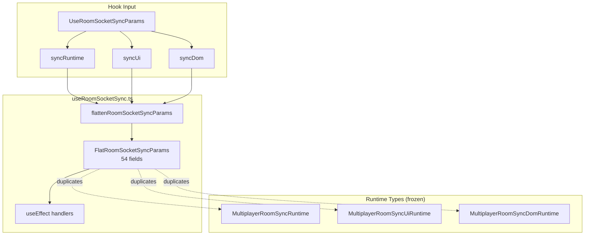
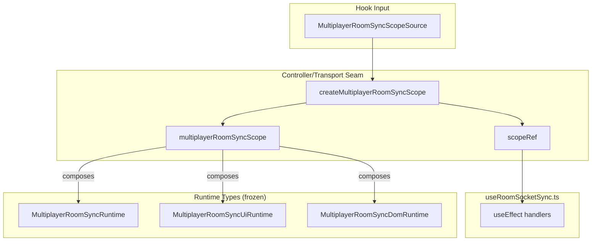
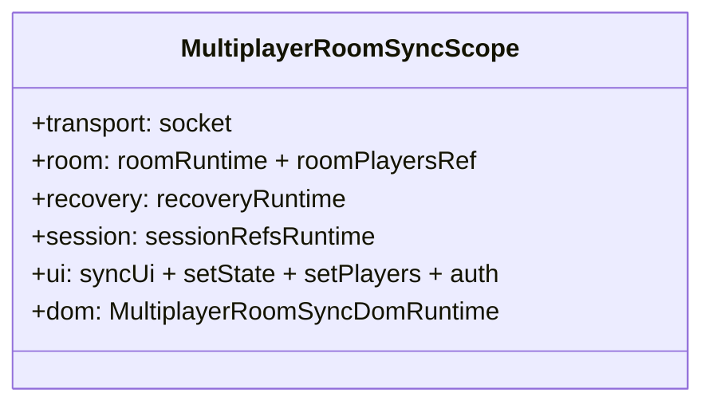

# Multiplayer Room Sync Scope Extraction — Engineering Report

## Executive Summary

This PR eliminates `FlatRoomSocketSyncParams` — a 54-field god-bag that re-flattened the already-decomposed room-sync runtime slices (`syncRuntime`, `syncUi`, `syncDom`) on every effect run. The room-sync transport layer now reads a **nested `MultiplayerRoomSyncScope`** with six capability groups: `transport`, `room`, `recovery`, `session`, `ui`, and `dom`.

**Result:** Zero behavior changes. Zero networking changes. Zero frozen-layer modifications. `useRoomSocketSync.ts` was **not** split — only the flattening anti-pattern was removed. Architecture and cycle checks pass with zero violations. All 1,075 tests pass. Production build succeeds.

---

## Why this improvement was chosen

The connection scope extraction (previous PR) fixed the flatten/ref-bag pattern for `useMultiplayerConnection`. **`useRoomSocketSync.ts` was the largest remaining offender** — 1,018 LOC with an internal 54-field flat type and `flattenRoomSocketSyncParams()` spread chain duplicating fields from:

- `MultiplayerRoomSyncRuntime` (`roomRuntime`, `recoveryRuntime`, `sessionRefsRuntime`)
- `MultiplayerRoomSyncUiRuntime` (20+ UI callbacks/setters)
- `MultiplayerRoomSyncDomRuntime` (DOM refs, draw timers, identity refs)

This was the **only remaining flatten hook** in the multiplayer imperative layer after connection scope extraction. Leaving it would mean:

1. Inconsistent architecture — connection uses scope, room-sync uses flat bag
2. Every new socket handler field widens the duplicated flat type
3. Runtime slice ownership is documented but undone at the controller boundary

**Not chosen (and why):**

| Alternative | Why deferred |
|-------------|--------------|
| Split `useRoomSocketSync.ts` into handler modules | User explicitly forbade file splitting; scope extraction addresses root cause first |
| `useMultiplayerRoomActions` flat bag | Smaller surface (~50 fields); room-sync was larger and more complex |
| Gameplay handler extraction from connection transport | Requires connection scope stabilization first (done); separate layering PR |
| Room social ref-bridge | Blocked by frozen `App.tsx` |

---

## Files Changed

| File | Action |
|------|--------|
| `client/src/multiplayer/multiplayerRoomSyncScope.ts` | **Created** — `MultiplayerRoomSyncScope`, `MultiplayerRoomSyncScopeSource`, `createMultiplayerRoomSyncScope()`, `AbandonedMatchNotice` ownership |
| `client/src/multiplayer/useRoomSocketSync.ts` | **Refactored** — `scopeRef` + nested access; removed flat type and flatten function; `UseRoomSocketSyncParams` aliases scope source |

**Not touched:** `App.tsx`, `multiplayer/protocol/*`, `multiplayer/runtime/*`, `multiplayerConnectionScope.ts`, dep-cruiser configs, gameplay logic, networking wire format, `MultiplayerGameShell.tsx` assembly contract.

---

## Architecture Before

```
UseRoomSocketSyncParams (nested syncRuntime / syncUi / syncDom)
        │
        ▼ flattenRoomSocketSyncParams()  ← UNDOES SLICE DESIGN
        │
FlatRoomSocketSyncParams (54 duplicated fields)
        │
        ▼ useEffect body
        │
Socket handlers (state:update, game:draw_animation, room:update, …)
  params.joinedRoomRef.current
  params.fetchGameState(...)
  params.setDrawSequenceActiveBoth(...)
```

**Problems:**
1. `MultiplayerRoomSyncRuntime` slices existed in `gameplayRuntime.ts` but handlers consumed a flat bag.
2. Flat type duplicated every field from three runtime type definitions.
3. `clearDrawPreview` took a `Pick<FlatRoomSocketSyncParams, …>` — coupling helper to god-bag.
4. Adding handler dependencies required flat type + flatten spread + all handler reads.

---

## Architecture After

```
UseRoomSocketSyncParams (= MultiplayerRoomSyncScopeSource)
        │
        ▼ createMultiplayerRoomSyncScope()  ← PRESERVES SLICE DESIGN
        │
MultiplayerRoomSyncScope (6 capability groups)
        │
        ▼ scopeRef.current in useEffect
        │
Socket handlers
  scope.room.joinedRoomRef.current
  scope.recovery.fetchGameState(...)
  scope.ui.setDrawSequenceActiveBoth(...)
  scope.dom.drawSequenceTimeoutRef.current
  scope.session.isMutedRef.current
```

**Improvements:**
1. Transport handlers read through capability groups aligned with runtime ownership.
2. No duplicated field listing — scope composes existing `gameplayRuntime.ts` types.
3. `clearDrawPreview` takes `Pick<MultiplayerRoomSyncScope, 'dom' | 'ui'>`.
4. Consistent with connection scope pattern established in prior PR.

---

## Ownership Changes

| Symbol | Before | After |
|--------|--------|-------|
| `FlatRoomSocketSyncParams` | Internal type in `useRoomSocketSync.ts` | **Deleted** |
| `flattenRoomSocketSyncParams()` | Internal function in `useRoomSocketSync.ts` | **Deleted** |
| `MultiplayerRoomSyncScope` | — | `multiplayerRoomSyncScope.ts` |
| `MultiplayerRoomSyncScopeSource` | Duplicated as `UseRoomSocketSyncParams` fields | `multiplayerRoomSyncScope.ts` (canonical) |
| `UseRoomSocketSyncParams` | Independently defined | Alias: `MultiplayerRoomSyncScopeSource` |
| `AbandonedMatchNotice` | Defined in `useRoomSocketSync.ts` | `multiplayerRoomSyncScope.ts` (re-exported from hook for compat) |
| Runtime slice types | `runtime/gameplayRuntime.ts` (frozen) | Unchanged — consumed via scope nesting |

---

## Dependency Graph Changes

**Before:**
```
useRoomSocketSync.ts
  ├── runtime/gameplayRuntime.ts (types)
  ├── protocol/
  └── [internal] FlatRoomSocketSyncParams (54-field duplicate)
```

**After:**
```
multiplayerRoomSyncScope.ts
  ├── runtime/gameplayRuntime.ts (types — composition only)
  └── protocol/ (RoomPlayer)
      ▲
      ├── useRoomSocketSync.ts
      └── (future: extracted handler modules)
```

**Dep-cruiser:** 657 modules, 2,580 dependencies — zero arch violations, zero cycles.

---

## Public API Changes

| Export | Change |
|--------|--------|
| `FlatRoomSocketSyncParams` | **Removed** (internal only) |
| `flattenRoomSocketSyncParams` | **Removed** (was not exported) |
| `MultiplayerRoomSyncScope` | **Added** |
| `MultiplayerRoomSyncScopeSource` | **Added** |
| `createMultiplayerRoomSyncScope()` | **Added** |
| `UseRoomSocketSyncParams` | **Shape unchanged** — aliases scope source |
| `AbandonedMatchNotice` | **Moved** to scope file; re-exported from `useRoomSocketSync.ts` |
| Pure test exports (`shouldDropPreProjectionStateReplay`, etc.) | Unchanged |

External consumers (`MultiplayerGameShell.tsx`, `roomSocketSyncParams.ts`, `liveMatchSessionTypes.ts`) see **no API changes**.

---

## Coupling Improvements

1. **Eliminated 54-field type duplication** — flat type no longer mirrors three runtime definitions.
2. **Preserved slice semantics at imperative boundary** — handlers group reads by concern (`scope.recovery.*`, `scope.ui.*`, `scope.dom.*`).
3. **Aligned with connection scope pattern** — consistent imperative boundary across both transport hooks.
4. **`clearDrawPreview` decoupled from flat bag** — uses `Pick<MultiplayerRoomSyncScope, 'dom' | 'ui'>`.
5. **Prerequisite for future handler extraction** — if `useRoomSocketSync.ts` is ever split, handlers can accept narrow scope slices without rewiring a flat type.

---

## Architectural Diagrams (Mermaid)

### Before: Flatten Round-Trip



### After: Nested Scope



### Scope Capability Groups



---

## Verification Results

| Check | Result |
|-------|--------|
| `npm run check:multiplayer-arch` | ✅ 0 violations (657 modules, 2,580 deps) |
| `npm run check:multiplayer-cycles` | ✅ 0 violations |
| Typecheck (`tsc -p tsconfig.app.json`) | ✅ Pass |
| Client production build | ✅ Pass (8.04s) |
| Client tests | ✅ 71 files / 562 tests |
| Server tests | ✅ 77 files / 513 tests |
| Lint | ⚠️ 115 errors / 399 warnings (unchanged baseline) |

---

## LOC Before / After

| File | Before | After | Δ |
|------|--------|-------|---|
| `useRoomSocketSync.ts` | 1,018 | 925 | −93 |
| `multiplayerRoomSyncScope.ts` | 0 | 71 | +71 |
| **Net** | **1,018** | **996** | **−22** |

**Type surface removed:** `FlatRoomSocketSyncParams` — 54 fields deleted. Replaced by 6 nested capability groups composing existing runtime types.

**Note:** `useRoomSocketSync.ts` LOC decreased despite longer access paths (`scope.room.joinedRoomRef` vs `params.joinedRoomRef`) because the 69-line flat type + flatten function were removed.

---

## Remaining Technical Debt (ranked by impact)

1. **`useMultiplayerRoomActions.ts` (536 LOC)** — Last remaining flatten/ref-bag hook (`FlatMultiplayerRoomActionsParams`). Should adopt room-sync/connection scope pattern.
2. **`useRoomSocketSync.ts` (925 LOC)** — Still monolithic; scope extraction enables future handler module split but file was intentionally not split this PR.
3. **Gameplay handlers in connection transport** — `hand:ended`, rematch, dragging still in `registerMultiplayerConnectionSocketHandlers.ts`; wrong layering.
4. **Room social ref-bridge** — `appendRoomReactionRef` crosses App ↔ lobby; blocked by frozen `App.tsx`.
5. **`recoveryConnectionBridge.ts`** — Legacy ref shim; blocked by frozen `App.tsx`.
6. **`MultiplayerGameShell.tsx` (1,042 LOC)** — Presentation assembly god-object.
7. **Draw animation orchestration in room-sync effect** — ~300 LOC of DOM/timer logic inline; could become `scope.dom` consumer modules later.

---

## If Chess.com Were Reviewing This PR, What Criticisms Would Remain?

1. **"Good pattern extension, but room-sync is still a monolith."** Scope fixes the boundary; 925 LOC effect body is still a single diff hotspot. They'd want a follow-up handler decomposition PR now that scope exists.
2. **"Inconsistent scope rollout."** Connection ✅, room-sync ✅, room-actions ❌ — three hooks, two patterns. Incomplete until `useMultiplayerRoomActions` migrates.
3. **"DOM refs in `dom` group blur layers."** `boneyardRef`, `handAreaRef` are presentation concerns mixed with `youRef`/`stateRef` identity refs. Chess.com might split `dom` into `presentation` + `identity` later.
4. **"No scope contract test."** `createMultiplayerRoomSyncScope` is pure assignment but lacks a test asserting all source slices map to scope groups.
5. **"Draw animation logic is transport-adjacent gameplay."** `game:draw_animation` handler manipulates flying tiles, sounds, and staged hands — arguably belongs in a gameplay projection module, not room-sync transport.
6. **"TEMP-DIAGNOSTIC logging still present."** Production path contains diagnostic console noise from prior debugging; out of scope but visible in review.

---

## Recommended Next Principal Engineer PR

**Apply the scope pattern to `useMultiplayerRoomActions.ts`** — extract `FlatMultiplayerRoomActionsParams` into `multiplayerRoomActionsScope.ts` with nested capability groups, completing the flatten/ref-bag elimination across all three multiplayer imperative hooks.

**Why next:** After connection and room-sync scope extraction, `useMultiplayerRoomActions` is the **only remaining flatten hook**. Completing the trio establishes a consistent imperative boundary before any handler file decomposition or gameplay extraction from connection transport.

---

*PR complete. Awaiting Principal Engineer review. No further changes initiated.*