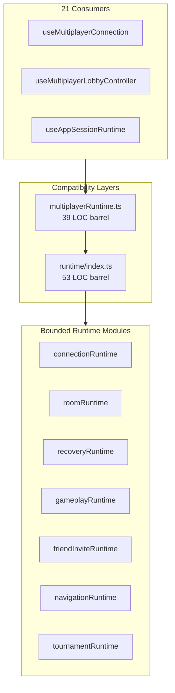

# Multiplayer Runtime Barrel Removal — Engineering Report

**Date:** 2026-07-05  
**Scope:** Eliminate `multiplayerRuntime.ts` compatibility barrel; migrate all consumers to bounded runtime modules  
**PR objective:** Dependency cleanup only — no behavior changes  
**Stance:** Principal Engineer refinement — Chess.com-scale durability

---

## Implemented: Runtime Barrel Elimination

**Deleted `multiplayerRuntime.ts`** and **`runtime/index.ts`**. All 21 consumers now import runtime types directly from their owning bounded module under `client/src/multiplayer/runtime/`.

---

## Post-Implementation Report

### Files changed

| File | Action |
|------|--------|
| `client/src/multiplayer/multiplayerRuntime.ts` | **Deleted** |
| `client/src/multiplayer/runtime/index.ts` | **Deleted** (secondary barrel — no longer needed) |
| `client/src/multiplayer/protocol/index.ts` | Comment updated (removed stale `multiplayerRuntime` reference) |
| `client/src/useAppSessionRuntime.ts` | Imports → `connectionRuntime`, `roomRuntime`, `navigationRuntime`, `tournamentRuntime` |
| `client/src/appRouteTypes.ts` | Import → `connectionRuntime` |
| `client/src/useAppRoutesProps.tsx` | Imports → `connectionRuntime`, `roomRuntime` |
| `client/src/AppOverlays.tsx` | Import → `friendInviteRuntime` |
| `client/src/multiplayer/multiplayerGameShellTypes.ts` | Import → `friendInviteRuntime` |
| `client/src/multiplayer/AppRoutesGamePropsHost.tsx` | Import → `friendInviteRuntime` |
| `client/src/multiplayer/FriendInvitePopupBridge.tsx` | Import → `friendInviteRuntime` |
| `client/src/multiplayer/MultiplayerModeController.tsx` | Imports → `connectionRuntime`, `roomRuntime` |
| `client/src/multiplayer/useMultiplayerConnection.ts` | Imports → `connectionRuntime`, `gameplayRuntime`, `recoveryRuntime`, `roomRuntime` |
| `client/src/multiplayer/useMultiplayerConnectionHostParams.ts` | Imports → `connectionRuntime`, `gameplayRuntime`, `recoveryRuntime`, `roomRuntime` |
| `client/src/multiplayer/useMultiplayerRoomActions.ts` | Imports → `friendInviteRuntime`, `connectionRuntime`, `navigationRuntime`, `roomRuntime` |
| `client/src/multiplayer/useMultiplayerLobbyController.ts` | Imports → `friendInviteRuntime`, `connectionRuntime`, `navigationRuntime`, `roomRuntime` |
| `client/src/multiplayer/useMultiplayerLobbyHostProps.ts` | Imports → `friendInviteRuntime`, `connectionRuntime`, `navigationRuntime`, `roomRuntime` |
| `client/src/multiplayer/MultiplayerGameShell.tsx` | Imports → `recoveryRuntime`, `roomRuntime`, `gameplayRuntime` |
| `client/src/multiplayer/useRoomSocketSync.ts` | Import → `gameplayRuntime` |
| `client/src/match/session/liveMatchSessionTypes.ts` | Imports → `friendInviteRuntime`, `recoveryRuntime`, `roomRuntime`, `gameplayRuntime` |
| `client/src/match/session/roomSocketSyncParams.ts` | Import → `friendInviteRuntime` |
| `client/src/match/session/tournament/*.ts` (5 files) | Import → `tournamentRuntime` |

**Total:** 22 files modified, 2 files deleted.

### Import graph metrics

| Metric | Before | After |
|--------|--------|-------|
| Imports from `multiplayerRuntime.ts` | 21 consumers | **0** |
| `multiplayerRuntime.ts` exists | Yes (39 LOC barrel) | **Deleted** |
| `runtime/index.ts` exists | Yes (53 LOC barrel) | **Deleted** |
| Direct imports from `multiplayer/runtime/*` | 0 | **38 import statements across 21 files** |
| Public access paths per runtime type | 2 (module + barrel) | **1 (owning module only)** |

**Imports per bounded module (consumer count):**

| Runtime module | Consumer files | Import statements |
|----------------|----------------|-------------------|
| `connectionRuntime.ts` | 8 | 12 |
| `roomRuntime.ts` | 9 | 11 |
| `recoveryRuntime.ts` | 3 | 4 |
| `gameplayRuntime.ts` | 4 | 5 |
| `friendInviteRuntime.ts` | 6 | 6 |
| `navigationRuntime.ts` | 4 | 4 |
| `tournamentRuntime.ts` | 5 | 5 |

### Architectural diagrams

#### Before — dual public access paths



#### After — single honest ownership path

```mermaid
flowchart TB
  subgraph Consumers["21 Consumers"]
    CONN["useMultiplayerConnection"]
    LOBBY["useMultiplayerLobbyController"]
    SHELL["MultiplayerGameShell"]
    TOUR["tournament session hooks"]
    APP["useAppSessionRuntime"]
  end

  subgraph Modules["Bounded Runtime Modules — sole public path"]
    CONN_RT["connectionRuntime.ts"]
    ROOM_RT["roomRuntime.ts"]
    REC_RT["recoveryRuntime.ts"]
    GAME_RT["gameplayRuntime.ts"]
    FRIEND_RT["friendInviteRuntime.ts"]
    NAV_RT["navigationRuntime.ts"]
    TOUR_RT["tournamentRuntime.ts"]
  end

  PROTO["multiplayer/protocol"]

  CONN --> CONN_RT
  CONN --> REC_RT
  CONN --> ROOM_RT
  CONN --> GAME_RT
  LOBBY --> ROOM_RT
  LOBBY --> CONN_RT
  LOBBY --> NAV_RT
  LOBBY --> FRIEND_RT
  SHELL --> REC_RT
  SHELL --> ROOM_RT
  SHELL --> GAME_RT
  TOUR --> TOUR_RT
  APP --> CONN_RT
  APP --> ROOM_RT
  APP --> NAV_RT
  APP --> TOUR_RT

  ROOM_RT --> PROTO
  REC_RT --> PROTO
  GAME_RT --> PROTO
  CONN_RT --> PROTO

  style CONN_RT fill:#1a3a5c,stroke:#4da3ff
  style ROOM_RT fill:#1a3a5c,stroke:#4da3ff
```



### Dependency graph changes

- **Barrel layer removed:** No transitive re-export obscures which module owns a type.
- **Import graph is honest:** A file importing `MultiplayerRecoveryCallbacksRuntime` now visibly depends on `recoveryRuntime.ts`.
- **Cross-module imports are explicit:** e.g. `useMultiplayerConnection` imports from 4 runtime modules — accurately reflects its bounded-context span.
- **Protocol boundary preserved:** All wire contracts still flow through `multiplayer/protocol` only.

### Ownership changes

No type ownership moved — only **import paths** changed. Each type remains owned by the same bounded module established in the prior PR:

| Type family | Owner module |
|-------------|--------------|
| Socket, reconnect, auth, connection state/UI | `connectionRuntime.ts` |
| Room refs, join-flight, room actions, lobby surface | `roomRuntime.ts` |
| Recovery refs, callbacks, setters | `recoveryRuntime.ts` |
| Session refs, room sync UI/DOM | `gameplayRuntime.ts` |
| App-mode navigation | `navigationRuntime.ts` |
| Tournament attach bridge | `tournamentRuntime.ts` |
| Friend invite state | `friendInviteRuntime.ts` |

### Public API changes

**Removed public entry points:**

- `multiplayer/multiplayerRuntime.ts` — deleted
- `multiplayer/runtime/index.ts` — deleted

**Canonical import pattern (now required):**

```ts
import type { MultiplayerSocketRuntime } from './runtime/connectionRuntime';
import type { MultiplayerRoomRuntime } from './runtime/roomRuntime';
import type { MultiplayerRecoveryRuntime } from './runtime/recoveryRuntime';
import type { MultiplayerRoomSyncRuntime } from './runtime/gameplayRuntime';
import type { MultiplayerNavigationRuntime } from './runtime/navigationRuntime';
import type { TournamentAttachRuntime } from './runtime/tournamentRuntime';
import type { FriendInviteState } from './runtime/friendInviteRuntime';
```

### Coupling improvements

- **No hidden barrel dependencies:** Build-time dependency analysis now reflects true module coupling.
- **Feature engineers know where to look:** Connection work → `connectionRuntime.ts`; recovery work → `recoveryRuntime.ts`.
- **IDE navigation lands on owner:** "Go to definition" resolves to the bounded module, not a re-export shim.
- **Merge conflict surface reduced:** Changes to room types no longer touch a shared 39-line barrel file imported by everyone.

### Verification

| Check | Result |
|-------|--------|
| Client tests | **71 files / 562 tests PASS** |
| Server tests | **77 files / 513 tests PASS** |
| Typecheck + build | **PASS** |
| Lint (migrated paths) | **0 errors** |
| `multiplayerRuntime` references in `.ts/.tsx` | **0** |
| Behavior | **No intentional behavior change** |

---

## Remaining Technical Debt

1. **`App.tsx` integration kernel** (~1,554 LOC) — not touched per scope; dominant scaling risk
2. **`connectionRuntime.ts` is the most-imported module** (8 consumers) — may warrant future split into socket vs connection-state
3. **Three-path state read model** — React state / `stateRef` / `multiplayerGameSnapshot`
4. **`useRoomSocketSync` (1,024 LOC) + `MultiplayerGameShell` (1,042 LOC)** — orchestration hubs
5. **`recoveryMachine.ts` (870 LOC)** — good FSM, leaky integration
6. **`useLiveMatchSession` (~1,100 LOC)** — monolithic session hook
7. **`MultiplayerShellDelegates`** — sideways coupling
8. **`useRoomSocketSync` re-exports `StateUpdatePayload`** — minor protocol path obscurity
9. **No dependency-cruiser / ESLint import-boundary rules** enforcing runtime module graph
10. **No shared server–client protocol package**
11. **Placement-blocking bug** — diagnostics only

---

## If Chess.com Were Reviewing This PR, What Criticisms Would Remain?

1. **"Approved — dependency graph is finally honest."** This is the correct follow-up to bounded runtime decomposition. Barrels are gone; ownership is one path per type.

2. **`useMultiplayerConnection` imports from 4 runtime modules** — Chess.com would note this hook spans connection + recovery + room + gameplay boundaries. Acceptable for now, but a future `ConnectionController` might narrow the import surface.

3. **`App.tsx` is still the multiplayer monolith.** Correctly out of scope, still blocks scale.

4. **No automated import-boundary enforcement.** Chess.com would add `dependency-cruiser` or ESLint `import/no-restricted-paths` to prevent runtime modules from importing UI, or protocol from importing runtime.

5. **`connectionRuntime.ts` still bundles socket + reconnect + auth + connection UI setters** — largest module (138 LOC); may need a second decomposition pass eventually.

6. **Types-only runtime modules — still no factories.** `createConnectionRuntime()` etc. remain future work.

7. **Documentation references stale `multiplayerRuntime.ts`** in older docs (`CODEBASE-HEALTH.md`, architecture audits) — should be updated in a docs-only pass.

---

## Status

Stopped after one improvement per instructions. Runtime barrel fully eliminated. Ready for Principal Engineer review before `App.tsx` session host extraction or import-boundary tooling.