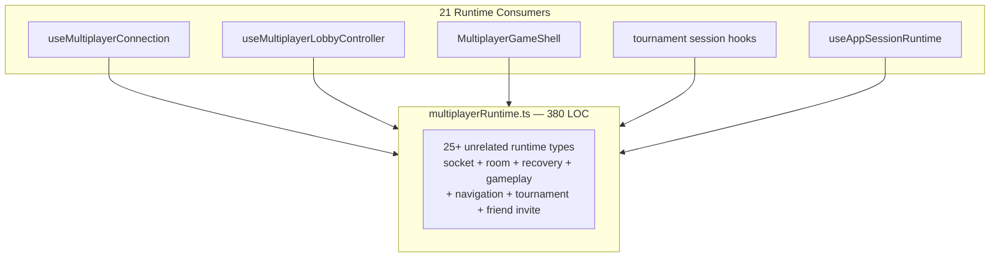
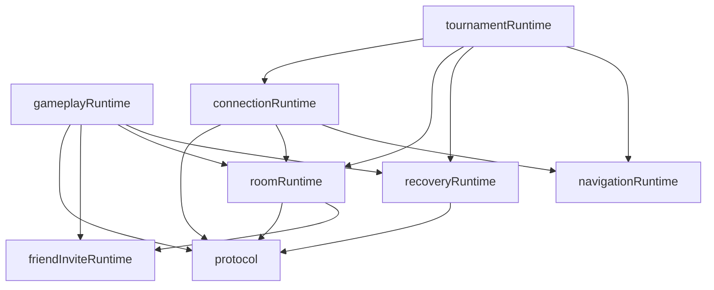

# Multiplayer Runtime Decomposition — Engineering Report

**Date:** 2026-07-05  
**Scope:** Decompose `multiplayerRuntime.ts` into bounded runtime domains  
**PR objective:** Runtime ownership refactor — no behavior changes  
**Stance:** Principal Engineer refinement — Chess.com-scale durability

---

## Implemented: Runtime Bag Decomposition

**Split the monolithic `multiplayerRuntime.ts` (380 LOC, 25+ types) into seven cohesive runtime modules** under `client/src/multiplayer/runtime/`, with a thin compatibility barrel preserving existing import paths.

---

## Runtime Module Breakdown

| Module | LOC | Owns | Public types |
|--------|-----|------|--------------|
| `friendInviteRuntime.ts` | 8 | Friend challenge invite popup state | `FriendInviteState` |
| `navigationRuntime.ts` | 13 | App-mode navigation for multiplayer/tournament | `MultiplayerNavigationRuntime`, `TournamentAttachNavigationRuntime` |
| `roomRuntime.ts` | 103 | Room identity refs, join-flight guards, room actions, lobby controller surface | `MultiplayerRoomRuntime`, `MultiplayerJoinFlightRuntime`, `MultiplayerRoomSocialRuntime`, `MultiplayerRoomActions*`, `MultiplayerLiveMatchRoomRuntime`, `MultiplayerControllerLobby*` |
| `recoveryRuntime.ts` | 37 | Resync/recovery refs and callbacks | `MultiplayerRecoveryRuntime`, `MultiplayerRecoveryCallbacks`, `MultiplayerRoomRecoverySetters`, `MultiplayerRecoveryCallbacksRuntime`, `MultiplayerLiveMatchRecoveryRuntime` |
| `gameplayRuntime.ts` | 75 | Live-match session refs, gameplay UI refs, room socket sync surfaces | `MultiplayerSessionRefsRuntime`, `MultiplayerGameplayRefsRuntime`, `MultiplayerRoomSyncRuntime`, `MultiplayerRoomSyncUiRuntime`, `MultiplayerRoomSyncDomRuntime` |
| `connectionRuntime.ts` | 138 | Socket, reconnect, auth refs; connection config/state/UI; controller connection bundle | `MultiplayerSocketRuntime`, `MultiplayerReconnectRuntime`, `MultiplayerAuthRuntime`, `MultiplayerConnection*Runtime`, `MultiplayerConnectionUiSetters`, `MultiplayerConnectionConfig`, `MultiplayerConnectionState`, `MultiplayerControllerConnectionBundle` |
| `tournamentRuntime.ts` | 20 | Tournament attach bridge across multiplayer runtimes | `TournamentAttachRuntime` |
| `index.ts` | 53 | Public runtime API barrel | Re-exports all bounded modules |
| `multiplayerRuntime.ts` | 39 | **Compatibility barrel only** — no type definitions | Re-exports from `./runtime` |

**Total:** 486 LOC (was 380 in monolith + 53 index + 39 barrel structure; net +106 LOC from module headers/imports/barrel — acceptable for ownership clarity per Principal Engineer mandate).

---

## Post-Implementation Report

### Files changed

| File | Action |
|------|--------|
| `client/src/multiplayer/runtime/friendInviteRuntime.ts` | **Created** |
| `client/src/multiplayer/runtime/navigationRuntime.ts` | **Created** |
| `client/src/multiplayer/runtime/roomRuntime.ts` | **Created** |
| `client/src/multiplayer/runtime/recoveryRuntime.ts` | **Created** |
| `client/src/multiplayer/runtime/gameplayRuntime.ts` | **Created** |
| `client/src/multiplayer/runtime/connectionRuntime.ts` | **Created** |
| `client/src/multiplayer/runtime/tournamentRuntime.ts` | **Created** |
| `client/src/multiplayer/runtime/index.ts` | **Created** — bounded runtime public API |
| `client/src/multiplayer/multiplayerRuntime.ts` | **Replaced** — thin re-export barrel (39 LOC) |

**Consumer files:** Unchanged — existing `from './multiplayerRuntime'` imports continue to work via barrel.

### Architectural diagrams

#### Before — monolithic runtime ownership



#### After — bounded runtime domains

```mermaid
flowchart TB
  subgraph Consumers["Runtime Consumers"]
    CONN["useMultiplayerConnection"]
    LOBBY["useMultiplayerLobbyController"]
    SHELL["useRoomSocketSync"]
    TOUR["useTournamentAttachFlow"]
  end

  subgraph Barrel["Compatibility Barrel"]
    MR["multiplayerRuntime.ts<br/>39 LOC — re-exports only"]
    IDX["runtime/index.ts"]
  end

  subgraph Bounded["Bounded Runtime Modules"]
    CONN_RT["connectionRuntime.ts<br/>socket, reconnect, auth, connection state"]
    ROOM_RT["roomRuntime.ts<br/>room refs, join flight, room actions"]
    REC_RT["recoveryRuntime.ts<br/>resync refs, recovery callbacks"]
    GAME_RT["gameplayRuntime.ts<br/>session refs, room sync UI/DOM"]
    NAV_RT["navigationRuntime.ts<br/>app mode navigation"]
    TOUR_RT["tournamentRuntime.ts<br/>tournament attach bridge"]
    FRIEND_RT["friendInviteRuntime.ts<br/>invite popup state"]
  end

  PROTO["multiplayer/protocol"]

  CONN --> MR
  LOBBY --> MR
  SHELL --> MR
  TOUR --> MR
  MR --> IDX
  IDX --> Bounded
  ROOM_RT --> PROTO
  REC_RT --> PROTO
  GAME_RT --> PROTO
  GAME_RT --> ROOM_RT
  GAME_RT --> REC_RT
  CONN_RT --> ROOM_RT
  CONN_RT --> NAV_RT
  TOUR_RT --> CONN_RT
  TOUR_RT --> ROOM_RT
  TOUR_RT --> REC_RT
  TOUR_RT --> NAV_RT

  style CONN_RT fill:#2a3a4a,stroke:#4da3ff
  style ROOM_RT fill:#2a3a4a,stroke:#4da3ff
  style REC_RT fill:#2a3a4a,stroke:#4da3ff
  style GAME_RT fill:#2a3a4a,stroke:#4da3ff
```



#### Dependency direction (runtime layer)



### Dependency graph changes

| Metric | Before | After |
|--------|--------|-------|
| Runtime type definition files | 1 monolith | **7 bounded modules** + index |
| `multiplayerRuntime.ts` role | Owner of all runtime types | **Compatibility barrel only** |
| Types per module (max) | 25+ in one file | **13 max** (`connectionRuntime`) |
| Obvious ownership lookup | Search 380-line file | **Open module by feature name** |
| Protocol re-exports from runtime | 0 (prior PR) | **0** — no regression |

### Coupling improvements

- **Feature-local ownership:** Engineers working on connection, room lobby, recovery, or tournament attach can open the corresponding `runtime/*.ts` file without navigating unrelated types.
- **Acyclic module graph:** Dependencies flow `friendInvite` / `navigation` → `room` / `recovery` → `gameplay` / `connection` → `tournament`. No circular imports.
- **Reduced blast radius:** Changing room action transport types touches `roomRuntime.ts` only; connection engineers are not reviewing recovery types.
- **Barrel preserves migration path:** Zero consumer import churn in this PR; new code can import from `runtime/connectionRuntime` etc. directly.

### Public API changes

**No breaking changes.** All 34 exported runtime types remain available via `multiplayerRuntime` barrel.

**New direct import paths (recommended for new code):**

```ts
import type { MultiplayerSocketRuntime } from './runtime/connectionRuntime';
import type { MultiplayerRoomRuntime } from './runtime/roomRuntime';
import type { MultiplayerRecoveryRuntime } from './runtime/recoveryRuntime';
import type { MultiplayerRoomSyncRuntime } from './runtime/gameplayRuntime';
import type { TournamentAttachRuntime } from './runtime/tournamentRuntime';
import type { FriendInviteState } from './runtime/friendInviteRuntime';
```

### Ownership changes

| Concern | Previous owner | New owner |
|---------|----------------|-----------|
| Socket + reconnect + auth refs | `multiplayerRuntime.ts` | `runtime/connectionRuntime.ts` |
| Room identity + join-flight + room actions | `multiplayerRuntime.ts` | `runtime/roomRuntime.ts` |
| Recovery/resync refs + callbacks | `multiplayerRuntime.ts` | `runtime/recoveryRuntime.ts` |
| Session refs + room sync UI/DOM | `multiplayerRuntime.ts` | `runtime/gameplayRuntime.ts` |
| App-mode navigation | `multiplayerRuntime.ts` | `runtime/navigationRuntime.ts` |
| Tournament attach bridge | `multiplayerRuntime.ts` | `runtime/tournamentRuntime.ts` |
| Friend invite state | `multiplayerRuntime.ts` | `runtime/friendInviteRuntime.ts` |
| Wire contracts | `multiplayer/protocol` | **Unchanged** |

### LOC before / after

| Artifact | Before | After |
|----------|--------|-------|
| `multiplayerRuntime.ts` (definitions) | 380 | 39 (barrel only) |
| Bounded runtime modules | — | 394 |
| `runtime/index.ts` | — | 53 |
| **Total runtime layer** | 380 | 486 |

### Verification

| Check | Result |
|-------|--------|
| Client tests | **71 files / 562 tests PASS** |
| Server tests | **77 files / 513 tests PASS** |
| Typecheck + build | **PASS** |
| Lint (`runtime/` + barrel) | **0 errors** |
| Behavior | **No intentional behavior change** |
| Protocol ownership | **No regression** — runtime modules import protocol; barrel exports no protocol types |

---

## Remaining Technical Debt

1. **`multiplayerRuntime.ts` barrel still used by 21 consumers** — follow-up: migrate imports to bounded `runtime/*` modules and deprecate barrel
2. **`App.tsx` integration kernel** (~1,554 LOC) — not touched per PR constraints; dominant scaling risk
3. **Three-path state read model** — React state / `stateRef` / `multiplayerGameSnapshot`
4. **`useRoomSocketSync` (1,024 LOC) + `MultiplayerGameShell` (1,042 LOC)** — orchestration hubs
5. **`recoveryMachine.ts` (870 LOC)** — good FSM, leaky integration
6. **`useLiveMatchSession` (~1,100 LOC)** — monolithic session hook
7. **`MultiplayerShellDelegates`** — sideways coupling
8. **`useRoomSocketSync` re-exports `StateUpdatePayload`** — minor protocol path obscurity
9. **No shared server–client protocol package**
10. **Placement-blocking bug** — diagnostics only

---

## If Chess.com Were Reviewing This PR, What Criticisms Would Remain?

1. **"Good decomposition — now kill the barrel."** Chess.com would approve the bounded modules but require a follow-up to migrate consumers off `multiplayerRuntime.ts` so the barrel can be deleted. Keeping two public entry points (`multiplayerRuntime` + `runtime/index`) is transitional, not terminal.

2. **"connectionRuntime is still the largest slice."** At 138 LOC with socket + reconnect + auth + connection UI setters + config + state, it may need a future split into `socketRuntime` vs `connectionStateRuntime` — but that's a second-order refinement.

3. **"App.tsx is still the multiplayer monolith."** Correctly untouched per scope, but still the #1 scaling blocker.

4. **"Where are the OWNERS files?"** Module boundaries exist in code; team ownership boundaries are not documented.

5. **"Runtime modules are types-only — where is the runtime implementation?"** These are ref-bag contracts, not runtimes with behavior. Chess.com would eventually want each module to own its factory/initializer (e.g. `createConnectionRuntime()`) — out of scope for this PR.

6. **"gameplayRuntime depends on room + recovery — is that right?"** `MultiplayerRoomSyncRuntime` composes picks from room and recovery. Chess.com might prefer a thin `syncRuntime.ts` compositor — acceptable for now.

7. **"No tests added for module boundary invariants."** Type-only split doesn't need new tests, but Chess.com might want a lint rule or dependency-cruiser config enforcing `runtime/*` import boundaries.

---

## Status

Stopped after one improvement per instructions. Runtime decomposition complete. Ready for Principal Engineer review before barrel deprecation or `App.tsx` session host extraction.