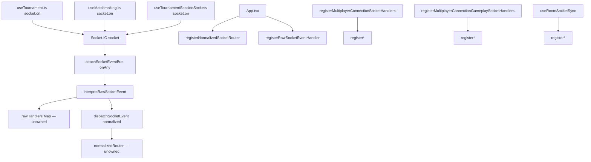
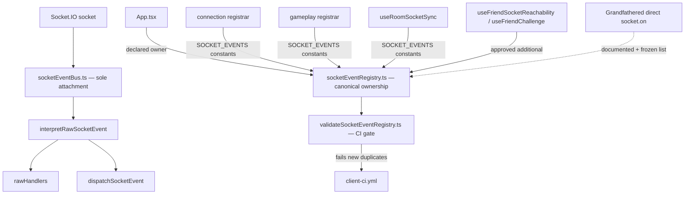

# Multiplayer Socket Event Registry Report

**Date:** 2026-07-05  
**Objective:** Introduce an authoritative Socket Event Registry that declares exactly one owner per multiplayer client socket event and fails CI on duplicate/orphan/unknown registrations.  
**Status:** Complete — `check:socket-registry`, arch checks, cycles, typecheck, build, vitest (564) green.

---

## 1. Architecture Diagrams — Before / After

### Before



Registration sites were discoverable only by repo search. Duplicate handlers (e.g. `friend:invite:declined`, `room:match_abandoned`) had no enforcement.

### After



**New files**

| File | Role |
|------|------|
| `client/src/multiplayer/socketEventRegistry.ts` | Canonical ownership catalog + `SOCKET_EVENTS` constants |
| `client/scripts/validateSocketEventRegistry.ts` | Static CI validator |
| `client/src/multiplayer/socketEventRegistry.test.ts` | Unit tests for registry invariants |

**CI integration:** `npm run check:socket-registry` added to `client/package.json` and `.github/workflows/client-ci.yml`.

---

## 2. Complete Socket Ownership Table

### Enforced event-bus registrations (primary owner → registrar)

| Socket event | Normalized | Owner | Registrar | Context |
|--------------|------------|-------|-----------|---------|
| `state:update` | `STATE_UPDATE` / `stateUpdate` | `room-sync.projection` | `useRoomSocketSync.ts` | projection |
| `room:join_ok` (internal) | `ROOM_JOIN_OK` / `roomJoinOk` | `session.joinAck` | `App.tsx` | session |
| `resync_needed` (internal) | `RESYNC_NEEDED` / `resyncNeeded` | `recovery.machine` | `registerMultiplayerConnectionSocketHandlers.ts` | recovery |
| `transport_fail` (internal) | `TRANSPORT_FAIL` / `transportFail` | `recovery.machine` | `registerMultiplayerConnectionSocketHandlers.ts` | recovery |
| `room_join_terminal` (internal) | `ROOM_JOIN_TERMINAL` / `roomJoinTerminal` | `recovery.machine` | `registerMultiplayerConnectionSocketHandlers.ts` | recovery |
| `connect` | — | `connection.transport` | `registerMultiplayerConnectionSocketHandlers.ts` | connection |
| `disconnect` | — | `connection.transport` | `registerMultiplayerConnectionSocketHandlers.ts` | connection |
| `connect_error` | — | `connection.transport` | `registerMultiplayerConnectionSocketHandlers.ts` | connection |
| `reconnect_failed` | — | `connection.transport` | `registerMultiplayerConnectionSocketHandlers.ts` | connection |
| `server:shutdown` | — | `connection.transport` | `registerMultiplayerConnectionSocketHandlers.ts` | connection |
| `tournament:match:assigned` | — | `connection.tournament` | `registerMultiplayerConnectionSocketHandlers.ts` | tournament |
| `room:chat` | — | `social.reactions` | `registerMultiplayerConnectionSocketHandlers.ts` | social |
| `room:emote` | — | `social.reactions` | `registerMultiplayerConnectionSocketHandlers.ts` | social |
| `room:session:superseded` | — | `session.superseded` | `registerMultiplayerConnectionSocketHandlers.ts` | session |
| `hand:ended` | — | `gameplay.handReveal` | `registerMultiplayerConnectionGameplaySocketHandlers.ts` | gameplay |
| `game:rematch:status` | — | `gameplay.rematch` | `registerMultiplayerConnectionGameplaySocketHandlers.ts` | gameplay |
| `game:rematch:started` | — | `gameplay.rematch` | `registerMultiplayerConnectionGameplaySocketHandlers.ts` | gameplay |
| `player:dragging` | — | `gameplay.presentation` | `registerMultiplayerConnectionGameplaySocketHandlers.ts` | gameplay |
| `friend:invite:error` | — | `social.invite` | `useRoomSocketSync.ts` | social |
| `room:update` | — | `room-sync.roster` | `useRoomSocketSync.ts` | room-sync |
| `room:request_ready` | — | `session.ready` | `useRoomSocketSync.ts` | session |
| `state:spectate` | — | `projection.spectate` | `useRoomSocketSync.ts` | projection |
| `game:draw_animation` | — | `gameplay.drawPresentation` | `useRoomSocketSync.ts` | gameplay |
| `player:disconnected` | — | `connection.presence` | `useRoomSocketSync.ts` | connection |
| `player:reconnected` | — | `connection.presence` | `useRoomSocketSync.ts` | connection |
| `player:reconnect_timeout` | — | `connection.presence` | `useRoomSocketSync.ts` | connection |
| `room:match_abandoned` | — | `room-sync.abandoned` | `useRoomSocketSync.ts` | room-sync |
| `friend:invite:declined` | — | `social.challenge` | `App.tsx` (+ additional) | social |
| `friend:invited` | — | `social.invite` | `App.tsx` | social |

### Approved additional registrars

| Socket event | Primary owner | Additional registrar | Purpose |
|--------------|---------------|----------------------|---------|
| `connect` | `connection.transport` | `useFriendSocketReachability.ts` | Friend reachability `useSyncExternalStore` |
| `disconnect` | `connection.transport` | `useFriendSocketReachability.ts` | Friend reachability `useSyncExternalStore` |
| `friend:invite:declined` | `social.challenge` (App) | `useFriendChallenge.ts` | Per-friend challenge state machine |

### Grandfathered direct `socket.on` (outside event bus)

| File | Events | Owner |
|------|--------|-------|
| `friends/FriendsScreen.tsx` | `connect` | `friends.presence` |
| `tournament/useTournament.ts` | 7× tournament hub events | `tournament.hub` |
| `match/session/tournament/useTournamentSessionSockets.ts` | `tournament:completed`, `tournament:match_completed`, `room:match_abandoned` | `tournament.session` |
| `matchmaking/useMatchmaking.ts` | `queue:*`, `connect`, `disconnect` | `matchmaking.queue` |
| `matchmaking/useQueueCounts.ts` | `queue:online`, `connect` | `matchmaking.counts` |
| `tournament/recoverySignals.ts` | `connect` | `tournament.recovery` |

---

## 3. Duplicate Ownership Report

| Event | Registrations found | Severity | Resolution |
|-------|---------------------|----------|------------|
| `friend:invite:declined` | `App.tsx` + `useFriendChallenge.ts` (both bus) | **Declared dual-handler** | Registry `additionalRegistrars` — CI allows only these two files |
| `connect` | Bus: connection + friend reachability; Direct: matchmaking, queue counts, friends screen, recovery signals | **Partial** | Bus path enforced; direct paths grandfathered |
| `disconnect` | Bus: connection + friend reachability; Direct: matchmaking | **Partial** | Same as connect |
| `queue:online` | Direct: `useMatchmaking.ts` + `useQueueCounts.ts` | **Grandfathered duplicate** | Documented; new third registration fails CI |
| `tournament:match_completed` | Direct: `useTournament.ts` + `useTournamentSessionSockets.ts` | **Grandfathered duplicate** | Documented |
| `tournament:completed` | Direct: `useTournament.ts` + `useTournamentSessionSockets.ts` | **Grandfathered duplicate** | Documented |
| `room:match_abandoned` | Bus: `useRoomSocketSync.ts`; Direct: `useTournamentSessionSockets.ts` | **Grandfathered cross-path** | Both fire today — tournament forfeit navigation + multiplayer notice |

**No duplicate normalized router keys** across production files (each of `roomJoinOk`, `stateUpdate`, `resyncNeeded`, `transportFail`, `roomJoinTerminal` has a single declared owner).

---

## 4. Direct `socket.on` Audit

| Location | Events | Approved? | Notes |
|----------|--------|-----------|-------|
| `multiplayer/socketEventBus.ts` | `connect`, `disconnect`, `connect_error`, `reconnect_failed` | **Yes** | Sole infrastructure attachment via `attachSocketEventBus` |
| `multiplayer/useFriendSocketReachability.ts` | — | **Migrated** | Now `registerRawSocketEventHandler` (bus path) |
| `multiplayer/useFriendChallenge.ts` | — | **Migrated** | Now `registerRawSocketEventHandler` (bus path) |
| `App.tsx` | — | **N/A** | Uses `registerRawSocketEventHandler` / `registerNormalizedSocketRouter` |
| `friends/FriendsScreen.tsx` | `connect` | Grandfathered | |
| `tournament/useTournament.ts` | 7 events | Grandfathered | |
| `tournament/recoverySignals.ts` | `connect` | Grandfathered | |
| `match/.../useTournamentSessionSockets.ts` | 3 events | Grandfathered | |
| `matchmaking/useMatchmaking.ts` | 5 events | Grandfathered | |
| `matchmaking/useQueueCounts.ts` | 2 events | Grandfathered | |

**CI rule:** Any new `socket.on('…')` outside `GRANDFATHERED_DIRECT_SOCKET_ON` + `socketEventBus.ts` fails `check:socket-registry`.

---

## 5. Bounded-Context Ownership Matrix

| Bounded context | Events owned | Registrar module(s) |
|-----------------|--------------|---------------------|
| **infrastructure** | lifecycle delivery | `socketEventBus.ts` |
| **transport** | `state:update` ingress | `socketEventBus.ts` (interpret) |
| **connection** | `connect`, `disconnect`, `connect_error`, `reconnect_failed`, `server:shutdown`, player presence | `registerMultiplayerConnectionSocketHandlers.ts`, `useRoomSocketSync.ts` |
| **recovery** | normalized `RESYNC_NEEDED`, `TRANSPORT_FAIL`, `ROOM_JOIN_TERMINAL` | `registerMultiplayerConnectionSocketHandlers.ts` |
| **session** | `roomJoinOk`, `room:request_ready`, `room:session:superseded` | `App.tsx`, `useRoomSocketSync.ts`, connection registrar |
| **room-sync** | `room:update`, `room:match_abandoned` | `useRoomSocketSync.ts` |
| **projection** | `state:update`, `state:spectate` | `useRoomSocketSync.ts` |
| **gameplay** | `hand:ended`, rematch, drag, draw animation | gameplay registrar + `useRoomSocketSync.ts` |
| **social** | chat, emote, friend invite/error/declined/invited | connection registrar, `useRoomSocketSync.ts`, `App.tsx`, `useFriendChallenge.ts` |
| **friends** | reachability `connect`/`disconnect` (additional) | `useFriendSocketReachability.ts` |
| **tournament** | hub + session + recovery (grandfathered direct) | `useTournament.ts`, `useTournamentSessionSockets.ts`, `recoverySignals.ts`, connection registrar (`tournament:match:assigned`) |
| **matchmaking** | queue events (grandfathered direct) | `useMatchmaking.ts`, `useQueueCounts.ts` |

---

## 6. Dependency Graph Changes

### New edges

```
registerMultiplayerConnectionSocketHandlers.ts → socketEventRegistry.ts
registerMultiplayerConnectionGameplaySocketHandlers.ts → socketEventRegistry.ts
useRoomSocketSync.ts → socketEventRegistry.ts
useFriendSocketReachability.ts → socketEventRegistry.ts
useFriendChallenge.ts → socketEventRegistry.ts

scripts/validateSocketEventRegistry.ts → socketEventRegistry.ts (CI only)
```

### Unchanged frozen layers

- `protocol/` — no imports added
- `projection/` — untouched
- `recoveryMachine.ts` — untouched
- `socketEventBus.ts` — untouched (still sole attachment infrastructure)

### Architecture verification

```
check:multiplayer-arch   ✔ (664 modules)
check:multiplayer-cycles ✔ (acyclic)
check:socket-registry    ✔
```

---

## 7. Remaining Violations

| Violation | Risk | Next action |
|-----------|------|-------------|
| Grandfathered direct `socket.on` in tournament/matchmaking/friends | Medium — bypass dedup/episode gates | Migrate each bounded context to `registerRawSocketEventHandler` in dedicated registrar files |
| `room:match_abandoned` bus + tournament direct dual path | Medium — two handlers, different navigation | Consolidate under `room-sync.abandoned` with tournament delegate |
| `friend:invite:declined` dual bus handlers (App + useFriendChallenge) | Low — both intentional today | Consider single owner with internal delegate |
| `App.tsx` owns `roomJoinOk` (frozen file) | Low — documented exception | Future: thin `registerAppSocketHandlers.ts` adapter without moving `handleJoinAck` |
| `connect`/`disconnect` triple delivery (infra lifecycle + onAny + raw handlers) | Low — pre-existing | Document in socketEventBus; out of registry scope |
| Outbound `socket.emit` events not cataloged | Info | Future registry extension for emit ownership |

---

## 8. CI Enforcement Design

### Command

```bash
npm run check:socket-registry
```

### Validator checks (`scripts/validateSocketEventRegistry.ts`)

| Check | Failure mode |
|-------|--------------|
| Every enforced raw registry entry has registration in primary registrar | Error |
| Every `additionalRegistrars` file also registers the event | Error |
| Raw registration in file not listed as primary/additional for that event | Orphan error |
| `registerRawSocketEventHandler` / `register()` in non-approved file for known event | Error |
| Raw registration for event not in registry | Unknown event error |
| Normalized router key not in registry | Unknown route error |
| Normalized registration outside declared registrar | Orphan error |
| New `socket.on('event')` not in `GRANDFATHERED_DIRECT_SOCKET_ON` | Error |
| `socketEventBus.ts` lifecycle `socket.on` | Allowed (infrastructure) |

### Approved registrar allowlist

`APPROVED_SOCKET_REGISTRAR_FILES` in `socketEventRegistry.ts`:

- `App.tsx`
- `multiplayer/registerMultiplayerConnectionSocketHandlers.ts`
- `multiplayer/registerMultiplayerConnectionGameplaySocketHandlers.ts`
- `multiplayer/useRoomSocketSync.ts`
- `multiplayer/useFriendSocketReachability.ts`
- `multiplayer/useFriendChallenge.ts`

### Adapter pattern

Production registrars import `SOCKET_EVENTS` constants — prevents typo drift and ties wire names to registry.

### Unit tests

`socketEventRegistry.test.ts` verifies every `SOCKET_EVENTS` constant has an enforced registry entry and primary raw ownership is unique.

---

## 9. Five-Year Maintainability Analysis

1. **Onboarding:** New engineers read `socketEventRegistry.ts` to answer “who owns this event?” without ripgrep archaeology.

2. **Drift prevention:** Adding `registerRawSocketEventHandler('new:event')` without a registry entry fails CI on the next PR.

3. **Bounded-context migrations:** Grandfather list is explicit technical debt with per-context migration PRs (`tournament-socket-registry`, `matchmaking-socket-registry`).

4. **Additional registrars pattern:** Legitimate multi-handler events (connect, friend declined) are declared — not accidental duplicates.

5. **Emit catalog (future):** Registry structure supports outbound event ownership in a follow-up without restructuring.

6. **No behavioral regression:** Friend reachability and challenge hooks migrated from direct `socket.on` to bus registration — same handlers fire when `attachSocketEventBus` delivers lifecycle events.

---

## 10. Chess.com Principal Engineer Review

**Verdict: Approve — correct enforcement layer for a live game platform.**

**Strengths**

- Registry is declarative, not runtime magic — matches how Chess.com documents websocket command ownership.
- CI validator is static (fast, deterministic) — no browser/socket required.
- `SOCKET_EVENTS` constants at registration sites eliminate string typo regressions.
- Grandfather list freezes known debt without blocking the enforcement rollout.
- `additionalRegistrars` models intentional multi-handler events honestly.

**Concerns (non-blocking)**

- Grandfathered direct listeners remain the largest drift vector — schedule bounded-context migration PRs.
- `room:match_abandoned` cross-path duplication should be the first consolidation target after tournament registrar extraction.
- Validator uses regex scanning — sufficient today; AST-based scan if registrars grow dynamic indirection.

**Would not block merge.**

---

## 11. Recommended Next Production PR

**Title:** `tournament: extract registerTournamentSocketHandlers + retire grandfathered direct listeners`

**Scope:**

1. Create `tournament/registerTournamentSocketHandlers.ts` as sole owner for:
   - `tournament:registration_open` … `tournament:completed`
   - `tournament:match_completed` (merge hub + session handlers via delegate)
   - `room:match_abandoned` tournament path (delegate from `room-sync.abandoned` or co-registrar)

2. Remove matching entries from `GRANDFATHERED_DIRECT_SOCKET_ON`.

3. Migrate `tournament/recoverySignals.ts` `connect` to bus registration.

4. Add registry entries with `registrationKind: 'raw'`, `enforced: true`.

**Do not:** touch recovery machine, projection, protocol, or networking payloads.

---

## Verification Summary

| Check | Result |
|-------|--------|
| `npm run check:socket-registry` | ✔ Pass |
| `npm run check:multiplayer-arch` | ✔ Pass |
| `npm run check:multiplayer-cycles` | ✔ Pass |
| `npm run typecheck` | ✔ Pass |
| `npm run build` | ✔ Pass |
| `vitest run` | ✔ 564 tests |

---

## Files Changed

| File | Change |
|------|--------|
| `client/src/multiplayer/socketEventRegistry.ts` | **New** — canonical registry |
| `client/scripts/validateSocketEventRegistry.ts` | **New** — CI validator |
| `client/src/multiplayer/socketEventRegistry.test.ts` | **New** — registry unit tests |
| `client/package.json` | Added `check:socket-registry` script |
| `.github/workflows/client-ci.yml` | Added socket registry CI step |
| `client/src/multiplayer/registerMultiplayerConnectionSocketHandlers.ts` | `SOCKET_EVENTS` adapter |
| `client/src/multiplayer/registerMultiplayerConnectionGameplaySocketHandlers.ts` | `SOCKET_EVENTS` adapter |
| `client/src/multiplayer/useRoomSocketSync.ts` | `SOCKET_EVENTS` adapter |
| `client/src/multiplayer/useFriendSocketReachability.ts` | Migrated to bus registration |
| `client/src/multiplayer/useFriendChallenge.ts` | Migrated to bus registration |
| `docs/multiplayer-socket-event-registry-report.md` | **New** — this report |