# Multiplayer Transport ↔ Controller Cycle Removal — Engineering Report

**Date:** 2026-07-05  
**Scope:** Break `registerMultiplayerConnectionSocketHandlers` ↔ `useMultiplayerConnection` circular dependency  
**PR objective:** Restore correct dependency direction (transport ↓ controllers) without behavior changes  
**Stance:** Principal Engineer refinement — ownership moved downward, no new abstractions

---

## Implemented: Controller ↔ Transport Cycle Eliminated

**Root cause:** `registerMultiplayerConnectionSocketHandlers.ts` (transport) imported `FlatMultiplayerConnectionParams` from `useMultiplayerConnection.ts` (controller), while the controller imported the transport registrar — a classic mutual dependency.

**Fix:** Move `FlatMultiplayerConnectionParams` ownership to transport layer in `connectionSocketHandlerParams.ts`. Transport no longer imports any controller module.

---

## Cycle Removed

### Before


**dependency-cruiser error (prior state):**
```
mp-no-circular: registerMultiplayerConnectionSocketHandlers.ts →
  useMultiplayerConnection.ts →
  registerMultiplayerConnectionSocketHandlers.ts
```

### After

```mermaid
flowchart TD
  PARAMS["connectionSocketHandlerParams.ts<br/>(transport contract)"]
  REG["registerMultiplayerConnectionSocketHandlers.ts<br/>(transport)"]
  HOOK["useMultiplayerConnection.ts<br/>(controller)"]
  PROTO["protocol/"]
  RT["runtime/"]

  PARAMS --> PROTO
  PARAMS --> RT
  REG --> PARAMS
  REG -->|"socketEventBus, recoveryMachine"| TRANSPORT_DEPS["transport deps"]
  HOOK --> PARAMS
  HOOK --> REG

  style PARAMS fill:#1a3a5c,stroke:#4da3ff
  style REG fill:#2a4a3a,stroke:#4dff88
```



**dependency-cruiser result (current state):**
```
✔ no dependency violations found (655 modules, 2583 dependencies cruised)
```

---

## Files changed

| File | Action |
|------|--------|
| `client/src/multiplayer/connectionSocketHandlerParams.ts` | **Created** — owns `FlatMultiplayerConnectionParams`, `ConnectionHandEndedPayload` |
| `client/src/multiplayer/registerMultiplayerConnectionSocketHandlers.ts` | Import transport params; removed controller import |
| `client/src/multiplayer/useMultiplayerConnection.ts` | Import flat params from transport; removed 78-line inline type definition |
| `client/.dependency-cruiser.multiplayer-cycles.json` | **Created** — full multiplayer acyclic graph enforcement |
| `client/package.json` | **Added** `check:multiplayer-cycles` script |
| `.github/workflows/client-ci.yml` | **Added** CI step: `Multiplayer dependency cycles` |

**Not modified:** `App.tsx`, protocol, runtime modules, existing `check:multiplayer-arch` rules, gameplay, networking behavior.

---

## Ownership changes

| Artifact | Previous owner | New owner |
|----------|----------------|-----------|
| `FlatMultiplayerConnectionParams` | `useMultiplayerConnection.ts` (controller) | `connectionSocketHandlerParams.ts` (transport) |
| `ConnectionHandEndedPayload` | Duplicated in transport + controller | `connectionSocketHandlerParams.ts` (single source) |
| `flattenMultiplayerConnectionParams()` | `useMultiplayerConnection.ts` | Unchanged — controller composes flat bag for transport |
| `UseMultiplayerConnectionParams` | `useMultiplayerConnection.ts` | Unchanged — controller public API |
| Socket handler registration | `registerMultiplayerConnectionSocketHandlers.ts` | Unchanged — transport behavior preserved |

---

## Dependency graph changes

| Edge | Before | After |
|------|--------|-------|
| `registerMultiplayerConnectionSocketHandlers` → `useMultiplayerConnection` | **Exists (violation)** | **Removed** |
| `registerMultiplayerConnectionSocketHandlers` → `connectionSocketHandlerParams` | — | **Added** |
| `useMultiplayerConnection` → `connectionSocketHandlerParams` | — | **Added** |
| `useMultiplayerConnection` → `registerMultiplayerConnectionSocketHandlers` | Exists | Unchanged (correct direction) |

**Layer direction restored:**

```
Transport (connectionSocketHandlerParams, registerMultiplayerConnectionSocketHandlers)
    ↑ imported by
Controllers (useMultiplayerConnection)
```

Transport never imports controllers.

---

## Coupling improvements

- **Type ownership matches runtime usage:** `getLatest()` surface is defined where socket handlers consume it, not where the React hook lives
- **No shim or re-export:** Controller imports transport types directly; no compatibility layer
- **No new frameworks:** Single new file with moved types — not a service locator, DI container, or event bus
- **CI prevents regression:** `check:multiplayer-cycles` fails if any multiplayer circular dependency is reintroduced

---

## CI integration

```yaml
- name: Multiplayer dependency cycles
  run: npm run check:multiplayer-cycles
```

```json
"check:multiplayer-cycles": "depcruise src/multiplayer --config .dependency-cruiser.multiplayer-cycles.json --output-type err"
```

Runs alongside existing `check:multiplayer-arch` on every client PR.

---

## Verification

| Check | Result |
|-------|--------|
| `npm run check:multiplayer-arch` | **✔ 0 violations** |
| `npm run check:multiplayer-cycles` | **✔ 0 violations (full multiplayer graph acyclic)** |
| Client tests | **71 files / 562 tests PASS** |
| Server tests | **77 files / 513 tests PASS** |
| Typecheck + build | **PASS** |
| Behavior | **No intentional behavior change** |

---

## Remaining cycles

**Within `src/multiplayer/`:** **None** (verified by `check:multiplayer-cycles`).

**Cross-package:** Not in scope; `match/session` → `useRoomSocketSync` couplings remain outside multiplayer internal graph.

---

## Remaining technical debt

1. **`RoomReactions` grandfather** in `mp-runtime-no-ui` — event types should move to protocol
2. **`flattenMultiplayerConnectionParams` still in controller** — could move to transport as pure function if `UseMultiplayerConnectionParams` composition is inverted
3. **`App.tsx` integration kernel** — imports 20+ multiplayer internals
4. **`connectionSocketHandlerParams` is still a large flat type** — structural debt, not cyclic debt
5. **Cross-feature approved surface** not enforced for `match/` consumers
6. **Placement-blocking bug** — diagnostics only

---

## If Chess.com Were Reviewing This PR, What Criticisms Would Remain?

1. **"Approved — you broke the cycle the right way."** Moving the type to transport ownership is exactly downward migration, not a wrapper hack.

2. **`FlatMultiplayerConnectionParams` is still a god-bag.** The cycle is gone, but the flat type has 50+ fields. Chess.com would track flattening/decomposition as separate work — correctly out of scope here.

3. **`ConnectionHandEndedPayload` might belong in protocol.** It's a wire payload shape; transport ownership is acceptable short-term, but protocol would be the long-term home.

4. **Cycle enforcement came after the fix.** They'd prefer the `check:multiplayer-cycles` rule existed before the refactor — but adding it now prevents regression, which is fine.

5. **`registerMultiplayerConnectionSocketHandlers` still does UI side-effects** (sounds, toasts, setState via flat bag). Transport layer is thick; future work might split "transport events" from "connection UX policy."

6. **`App.tsx` still untouched.** Dominant architectural risk remains.

7. **"Good — no new abstractions."** Exactly what they wanted for a cycle-breaking PR.

---

## Status

Stopped after one improvement per instructions. Transport ↔ controller cycle eliminated and CI-enforced. Ready for Principal Engineer review.