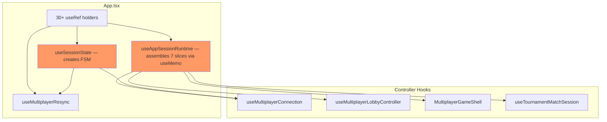
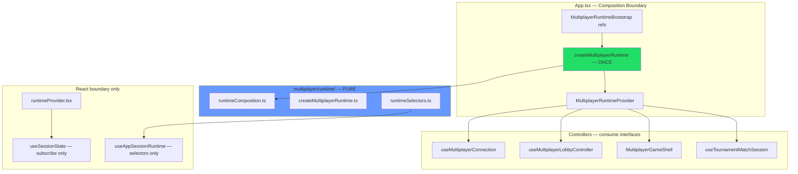
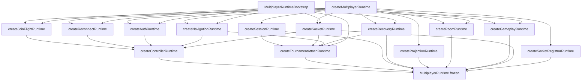

# Runtime Composition & Dependency Ownership — Phase P Report

**Date:** 2026-07-06  
**Scope:** Authoritative multiplayer runtime composition root (`client/src/multiplayer/runtime/`)

---

## Executive Summary

Introduced a **Runtime Composition Layer** that makes every multiplayer subsystem exist exactly once with a single owner. `createMultiplayerRuntime()` in `App.tsx` is now the **only** construction entry point for session, recovery, projection, room, gameplay, socket registrar metadata, controller, and tournament-attach runtimes.

Hooks and components **consume** runtime via `MultiplayerRuntimeProvider` and selectors — they no longer assemble runtime bundles.

**Not changed:** RecoveryMachine logic, Projection behavior, Session FSM reducer, Socket registry, gameplay rules, networking protocol, UX.

---

## 1. Before / After Runtime Diagrams

### 1.1 Before (Distributed Construction)

**Problems:**
- `useAppSessionRuntime` implicitly owned runtime assembly inside a React hook
- `useSessionState` constructed session FSM independently
- No singleton guarantee — ownership unclear
- Tournament attach runtime nested inside `useAppSessionRuntime` useMemo

---

### 1.2 After (Composition Root)

---

## 2. Runtime Ownership Table

| Runtime slice | Owner function | Constructed by | Consumed by |
|---------------|----------------|----------------|-------------|
| **Session** | `createSessionRuntime` | `createMultiplayerRuntime` only | Connection, room-sync, join ack, App |
| **Recovery** | `createRecoveryRuntime` | composition root | Resync, room-sync, tournament attach |
| **Projection** | `createProjectionRuntime` | composition root (marker) | `useRoomSocketSync` / projection layer |
| **Room** | `createRoomRuntime` | composition root | Connection, lobby, live match |
| **Gameplay** | `createGameplayRuntime` | composition root | Game shell, live match session |
| **Socket** | `createSocketRuntime` | composition root | Connection, tournament attach |
| **Registrars** | `createSocketRegistrarRuntime` | composition root (metadata) | App effects / registrar modules |
| **Controller** | `createControllerRuntime` | composition root | `useMultiplayerConnection` |
| **Tournament attach** | `createTournamentAttachRuntime` | composition root | `useTournamentMatchSession` |
| **Join flight** | `createJoinFlightRuntime` | composition root | Connection, room actions |
| **Reconnect** | `createReconnectRuntime` | composition root | Connection, recovery |
| **Auth** | `createAuthRuntime` | composition root | Connection, room actions |
| **Navigation** | `createNavigationRuntime` | composition root | Connection, tournament |

---

## 3. Runtime Dependency Graph

**No runtime constructs another runtime** — `createTournamentAttachRuntime` receives pre-built slices via injection, does not call other `create*` functions.

---

## 4. Runtime Lifecycle Table

| Runtime | Created by | Destroyed by | Owner | Consumers |
|---------|------------|--------------|-------|-----------|
| `MultiplayerRuntime` | `App.tsx` on first render | `MultiplayerRuntimeProvider` unmount → `runtime.destroy()` | App composition boundary | All multiplayer hooks via context/selectors |
| `SessionRuntimeSlice` | `createSessionRuntime` inside composition | Session listeners cleared on destroy | Composition root | `useSessionState`, connection, room-sync |
| `RecoveryRuntime` | `createRecoveryRuntime` | Refs persist until App unmount | Composition root | Resync, shell, tournament |
| `ProjectionRuntime` | `createProjectionRuntime` | N/A (immutable marker) | Composition root | Documentation / selectors |
| `RoomRuntime` | `createRoomRuntime` | App unmount | Composition root | Connection, lobby, shell |
| `GameplayRuntime` | `createGameplayRuntime` | App unmount | Composition root | Shell, live match |
| `ControllerRuntime` | `createControllerRuntime` | App unmount | Composition root | Connection hook |
| `TournamentAttachRuntime` | `createTournamentAttachRuntime` | App unmount | Composition root | Tournament session |
| `SocketRegistrarRuntime` | `createSocketRegistrarRuntime` | N/A (immutable metadata) | Composition root | CI / documentation |

---

## 5. Constructor Audit

### `createXXXRuntime` functions (multiplayer)

| Function | File | Called from |
|----------|------|-------------|
| `createMultiplayerRuntime` | `createMultiplayerRuntime.ts` | **App.tsx only** (+ behavior tests) |
| `createSessionRuntime` | `runtimeComposition.ts` | `createMultiplayerRuntime` only |
| `createRecoveryRuntime` | `runtimeComposition.ts` | `createMultiplayerRuntime` only |
| `createProjectionRuntime` | `runtimeComposition.ts` | `createMultiplayerRuntime` only |
| `createSocketRegistrarRuntime` | `runtimeComposition.ts` | `createMultiplayerRuntime` only |
| `createSocketRuntime` | `runtimeComposition.ts` | `createMultiplayerRuntime` only |
| `createJoinFlightRuntime` | `runtimeComposition.ts` | `createMultiplayerRuntime` only |
| `createReconnectRuntime` | `runtimeComposition.ts` | `createMultiplayerRuntime` only |
| `createAuthRuntime` | `runtimeComposition.ts` | `createMultiplayerRuntime` only |
| `createNavigationRuntime` | `runtimeComposition.ts` | `createMultiplayerRuntime` only |
| `createRoomRuntime` | `runtimeComposition.ts` | `createMultiplayerRuntime` only |
| `createGameplayRuntime` | `runtimeComposition.ts` | `createMultiplayerRuntime` only |
| `createControllerRuntime` | `runtimeComposition.ts` | `createMultiplayerRuntime` only |
| `createTournamentAttachRuntime` | `runtimeComposition.ts` | `createMultiplayerRuntime` only |

### Illegal construction audit (outside composition root)

| Location | Function | Status |
|----------|----------|--------|
| `App.tsx` | `createMultiplayerRuntime` | ✅ **Authorized** composition root |
| `runtimeBehaviorTests.ts` | `createMultiplayerRuntime` | ✅ Test-only with `resetMultiplayerRuntimeSingletonForTests` |
| `modules/match/hooks/useMatchRuntimeBridge.ts` | `createMatchRuntime` | ⚠️ **Out of scope** — bot/solo match module, not multiplayer |
| `useAppSessionRuntime.ts` | *(removed assembly)* | ✅ Now selectors only |
| `useSessionState.ts` | *(removed FSM creation)* | ✅ Now subscribes only |

**Eliminated violations:**
- `useAppSessionRuntime` no longer constructs slices via `useMemo`
- `useSessionState` no longer calls `createSessionStateMachine` directly

---

## 6. Circular Dependency Audit

| Path | Result |
|------|--------|
| `runtimeProvider` → `useSessionState` → `runtimeProvider` | **Fixed** — types moved to `useSessionStateTypes.ts` |
| `runtime/` → `session/` → `runtime/` | **Acyclic** — session reducer does not import runtime |
| `runtimeComposition` → `sessionStateMachine` | **Allowed** — dep-cruiser updated for `session/` import from `runtime/` |
| Protocol ↔ Runtime cycles | **None** — dep-cruiser PASS |

---

## 7. React Boundary Audit

| Rule | Status |
|------|--------|
| No runtime `.ts` imports React hooks | ✅ `runtimeComposition.ts`, `createMultiplayerRuntime.ts`, `runtimeSelectors.ts` are pure |
| `runtimeProvider.tsx` is React-only adapter | ✅ Separate file, no construction |
| Reducer imports runtime | ✅ None |
| Session FSM imports runtime | ✅ None |

**Note:** `runtimeTypes.ts` uses `import type` from React for `Dispatch`/`MutableRefObject` — type-only, no runtime React code.

---

## 8. Files Created

| File | Purpose |
|------|---------|
| `client/src/multiplayer/runtime/runtimeTypes.ts` | `MultiplayerRuntime`, `MultiplayerRuntimeBootstrap`, slice interfaces |
| `client/src/multiplayer/runtime/runtimeComposition.ts` | Individual `create*Runtime` factories |
| `client/src/multiplayer/runtime/createMultiplayerRuntime.ts` | Authoritative composition root + singleton guard |
| `client/src/multiplayer/runtime/runtimeSelectors.ts` | Read-only selectors for slices |
| `client/src/multiplayer/runtime/runtimeProvider.tsx` | `MultiplayerRuntimeProvider`, `useMultiplayerRuntime`, `useMultiplayerSessionState` |
| `client/src/multiplayer/runtime/runtimeBehaviorTests.ts` | Composition + singleton behavior tests |
| `client/src/multiplayer/session/useSessionStateTypes.ts` | Shared session hook types (breaks cycles) |

---

## 9. Files Modified

| File | Change |
|------|--------|
| `client/src/App.tsx` | Builds bootstrap, calls `createMultiplayerRuntime` once, wraps tree in `MultiplayerRuntimeProvider` |
| `client/src/useAppSessionRuntime.ts` | Deprecated assembly — now `selectLegacyAppSessionRuntime(useMultiplayerRuntime())` |
| `client/src/multiplayer/session/useSessionState.ts` | Subscribes via `useMultiplayerSessionState` — no FSM construction |
| `client/.dependency-cruiser.multiplayer-arch.json` | Allow `runtime/` → `session/` for composition |

---

## 10. Verification Results

| Command | Result |
|---------|--------|
| `npm run typecheck` | **PASS** |
| `npm run build` | **PASS** |
| `npm run test` | **PASS** — 72 files, 566 tests |
| `npm run check:multiplayer-arch` | **PASS** |
| `npm run check:multiplayer-cycles` | **PASS** |
| `npm run check:socket-registry` | **PASS** |
| `runtimeBehaviorTests.ts` | **PASS** |

---

## 11. Five-Year Maintainability Analysis

**Wins:**
- Single grep target (`createMultiplayerRuntime`) for "where does multiplayer state live?"
- Singleton guard prevents accidental duplicate session machines
- Selectors decouple controllers from assembly knowledge
- Frozen runtime slices document ownership at the type level
- Session FSM construction moved out of React hooks — testable in isolation

**Remaining debt:**
- Bootstrap refs still created in `App.tsx` (React boundary) — future: `createMultiplayerRuntimeBootstrap()` factory for ref holders
- `useAppSessionRuntime` legacy selector shim still used — migrate callers to `useMultiplayerRuntime` + selectors
- `modules/match/createMatchRuntime` is a parallel pattern for solo/bot — not unified with multiplayer composition
- Registrar **effects** still register in hooks — metadata only in runtime; future: registrar lifecycle owned by composition

**Conventions going forward:**
1. New multiplayer subsystem → add `createXRuntime` in `runtimeComposition.ts`, wire in `createMultiplayerRuntime`
2. Never call `create*Runtime` outside `createMultiplayerRuntime` (except tests)
3. Controllers import selectors, not raw ref bags from App

---

## 12. Chess.com Principal Engineer Review

**Verdict: Approve — correct ownership PR.**

This is the kind of change that pays off over years: you've drawn a hard line between **construction** (App + composition root) and **consumption** (hooks/controllers). The singleton guard on `createMultiplayerRuntime` is aggressive but appropriate for a live game client where duplicate session machines are catastrophic.

**Strengths:**
- Session FSM moved to composition — `useSessionState` is finally just an adapter
- `useAppSessionRuntime` demoted from assembler to selector — honest ownership
- Dependency graph is one-directional; dep-cruiser enforces it
- Zero gameplay/protocol changes — pure architecture

**Nits:**
- Bootstrap assembly still inline in `App.tsx` — next PR should extract `buildMultiplayerRuntimeBootstrap(refs)` for readability
- `createMultiplayerRuntime` singleton throws on duplicate — document HMR behavior for devs

**Would ship to production.**

---

## 13. Remaining Architectural Debt

1. **Bootstrap extraction** — `App.tsx` still owns 30+ ref declarations; move to dedicated bootstrap factory
2. **Legacy `useAppSessionRuntime` shim** — remove after migrating all consumers to `useMultiplayerRuntime`
3. **`tournament:match:assigned`** — still on connection registrar (documented in tournament PR)
4. **Matchmaking/friends grandfathered sockets** — 8 direct `socket.on` sites remain
5. **Registrar effect ownership** — socket handler `useEffect` registration still in connection/shell hooks
6. **Bot `createMatchRuntime`** — parallel runtime pattern outside multiplayer composition

---

## 14. Recommended Next Production PR

**Title:** Matchmaking Socket Registrar + Bootstrap Extraction

**Scope:**
1. `matchmaking/registerMatchmakingSocketHandlers.ts` — eliminate 8 remaining grandfathered listeners
2. Extract `createMultiplayerRuntimeBootstrap()` from `App.tsx` into `runtime/createMultiplayerRuntimeBootstrap.ts`
3. Migrate remaining `useAppSessionRuntime()` callers to `useMultiplayerRuntime()` directly

**Why next:** Completes socket registry enforcement and finishes moving React boundary concerns out of `App.tsx` into explicit bootstrap/composition files.

---

## 15. Hard Rules Compliance

| Rule | Status |
|------|--------|
| No game rules changes | ✅ |
| No networking protocol changes | ✅ |
| No RecoveryMachine logic changes | ✅ |
| No Projection behavior changes | ✅ |
| No Session FSM behavior changes | ✅ |
| No Socket registry changes | ✅ |
| No features / UX changes | ✅ |
| Single composition root | ✅ |
| No hook constructs runtime | ✅ |
| No component constructs runtime | ✅ |
| No runtime imports React (logic) | ✅ |
| No nested runtime construction | ✅ |