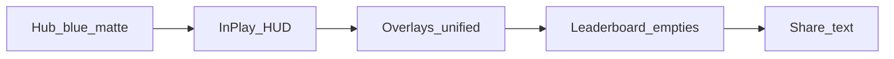

# Daily Ladder Feel Pass

**Date:** 2026-07-23  
**Status:** Approved design — awaiting written-spec review before implementation plan  
**Anchor:** Play vs Fritz matte panels + Daily Puzzle electric blue (`--tier-standard`) identity  
**Sibling reference:** Daily Fritz feel pass (brass/gold arc); same playbook, blue accent

## Goal

Make the Daily Ladder arc feel like one finished premium product: hub → in-play → slot/pending/practice/final overlays → leaderboard → share text. Visual/presentational only.

## Non-goals

- Puzzle rules, scoring, awards, finalize math
- Validator / worker / verification
- API, session storage, submission pipelines
- Architecture refactors / shared DF+Ladder result component extraction
- New graphical share-card UI (text share stays; scrub emoji)
- Legacy single Daily Puzzle entry path
- Daily Puzzle Admin
- Changes to non-Ladder Daily Fritz chrome (except shared `dflb-*` ladder-scoped overrides)

## Scope (full Ladder arc)

### 1. Hub

**Files:** `client/src/dailyPuzzle/DailyPuzzleLadderHubView.tsx`, `client/src/dailyPuzzle/dailyPuzzle.css` (`.dpl-*`, `.dpl-ladder-hub.df-page`), shared hub classes under `df-pvf-*` when Ladder-scoped.

- Restore / tighten electric-blue glow on primary start CTA (matte fill, no gradient); match PVF start-btn energy with `--tier-standard`
- Progress cards: active emphasis; sibling dim via `:has(...)` where safe
- Demote hub Share vs Start (Share = ghost/secondary)
- Retint Elite-gold leaderboard footer link → standard blue under `.dpl-ladder-hub`
- Practice chips: clearer labels / calmer chrome (less “P1” admin tone where copy can improve without changing unlock logic)

### 2. In-play (presentation only)

**Files:** `DailyPuzzleLadderScreen.tsx` (chrome classes only if needed), `dailyPuzzle.css`, match-live theme overrides scoped to daily-puzzle / ladder mode.

- Light HUD/board chrome check so Ladder reads blue (not brass DF bleed or green practice CTA bleed)
- No bot engine, hand dock playability, or move validation changes

### 3. Post-match overlays (one language)

**Files:** `DailyPuzzleLadderOverlays.tsx`, `dailyPuzzle.css` (`.dpl-ladder-*`, `.rh-result*` ladder-scoped).

- Matte navy + thin blue border; kill gold/blue radial gradient fills on result heads where Ladder owns them
- CTA hierarchy: primary (Leaderboard / continue) → secondary → Share last
- Share feedback: `Copied` (not `✓ Shared!`)
- Pending: pulse / soft label instead of `Please wait.`
- Soften trust / finalize / practice soft-sell copy (trim only)
- Practice overlays: drop green `!important` primary; use Ladder blue result chrome (`.dpl-ladder-result`)
- Enter motion: premium ease (no spring bounce); honor `prefers-reduced-motion`

### 4. Leaderboard

**Files:** `DailyPuzzleLadderLeaderboardScreen.tsx`, ladder overrides in `dailyFritzLeaderboardScreen.css` (`.dflb-page--ladder`, `.dflb-eyebrow--ladder`, `.dflb-tier-chip--puzzle`).

- Empty podium: replace `Open spot` / `Awaiting climber` with `—` / `Unclaimed` (match DF feel)
- Remove hardcoded top-10 “Puzzle” tier chip spam
- Cyan eyebrow/chip → `--tier-standard`
- Light row/podium arrival or hover lift; gate with reduced-motion
- You-strip / empty copy: human tone if any backend-ish strings remain

### 5. Share text only

**File:** `client/src/dailyPuzzle/ladderShareCard.ts`

- Scrub emoji from share string (🧩, 🔥, etc.)
- Keep date / score / rank / streak meaning; tone only

## Motion budget (2–3 intentional)

1. Hub active progress-card emphasis (sibling dim)
2. Overlay enter (aligned to DF `df-result-enter` family — no spring)
3. Optional subtle primary CTA blue glow pulse on hub

All honor `prefers-reduced-motion`. Add reduced-motion gates where `dailyPuzzle.css` currently animates without them (`rh-fade` / `rh-pop` / loading shimmer).

## Identity rules

- Mode accent: electric blue / `--tier-standard` (not brass, not Elite gold, not practice green, not cyan drift)
- Surfaces: matte solids, thin borders, subtle shadows — no gradient fills
- Typography: warm ivory; compact uppercase HUD labels; display titles where already used
- Do not invent a new Ladder design system; inherit PVF matte + homepage daily-blue identity

## Verification

- Client build: `npm run build --prefix client` (from repo root) or `npm run build` in `client/`
- Manual spot-check: Ladder hub → start puzzle → mid-play HUD → slot/pending → practice (if available) → final → leaderboard → share
- Confirm Daily Fritz arc unchanged (brass, CTA order, empties)
- Confirm non-Ladder PVF Elite chrome unchanged

## Success bar

One continuous blue/matte Ladder arc; Share never above Leaderboard/Home; no gold/green/cyan fighting the mode; no admin empty podium copy; share text clean; DF feel pass preserved.

## Out of file list (do not touch unless a Ladder-scoped override requires it)

- `validator.ts`, `validator.worker.ts`, submission/session APIs
- `DailyPuzzleAdminScreen.tsx`
- Legacy entry panels / `DailyPuzzleLegacyInPlayView.tsx`
- Gameplay hooks and awarded-points math
