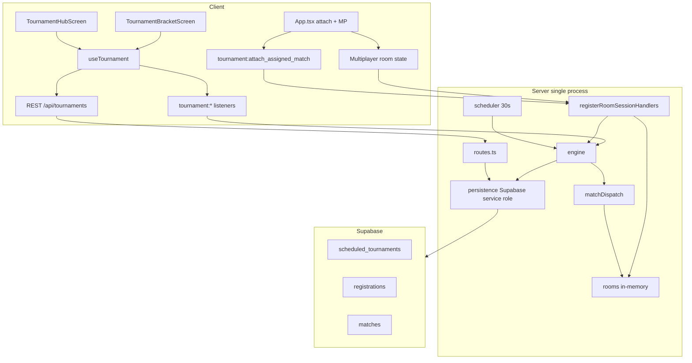

# Tournament Mode — Source-of-Truth Audit

**Audit date:** 2026-05-31  
**Scope:** End-to-end scheduled tournament system (production path), legacy socket tournaments, multiplayer room integration, schema, tests.  
**Mode:** Read-only — no code, schema, or rule changes in this pass.

**Out of scope (mentioned only):** Daily Fritz, private multiplayer (non-tournament), bot match shell.

---

## Executive summary

Production tournament mode is a **scheduled 8-player single-elimination bracket** backed by **Supabase tables** and a **Node scheduler (30s tick)**. Match play reuses the **private multiplayer room pipeline** (`rooms.ts`, `registerRoomSessionHandlers.ts`, `state:update`, game-over). Clients use **REST + Socket.IO** (`useTournament`, `App.tsx` attach flow) — not direct Supabase writes for bracket logic.

**Why it feels fragile:**

1. **Single-process assumption** — in-memory rooms + `scheduledTournamentMatchId` on the owning server process (`TOURNAMENT_README.md` warning). Horizontal scale breaks attach and game-over → bracket advance without sticky routing or Redis.
2. **Dual tournament stacks** — legacy `TournamentScreen` + socket round-robin still in repo (`ENABLE_LEGACY_TOURNAMENTS=1`) alongside scheduled system; shared `App.tsx` state (`tournamentId` vs `activeTournamentId`).
3. **Many async paths** — scheduler, dispatch, attach, game-over, forfeit, no-show reconciliation, recovery on boot — can race without multi-instance DB lease.
4. **Documentation drift** — `TOURNAMENT_README.md` / smoke test describe **2-hour** slots and **5-minute** close + **min 4 players**; code/migrations use **30-minute** slots, **2-minute** close, **`MIN_HUMANS_TO_START = 1`** (bots fill to 8).
5. **Large client orchestration** — `App.tsx` + `useTournament` + timers (5s boundary refresh, 15s bracket auto-kick, 30s attach backoff) + mode switch to `multiplayer` mid-flow.

---

## 1. Main files involved

### Server — scheduled tournaments (production)

| File | Owns |
|------|------|
| `server/src/scheduledTournament/index.ts` | Bootstrap: REST routes, scheduler, per-socket `initScheduledTournaments` |
| `server/src/scheduledTournament/types.ts` | Row types, status unions |
| `server/src/scheduledTournament/engine.ts` | Bracket gen, `applyMatchResult`, advancement, no-show, cancel/complete, bot fill |
| `server/src/scheduledTournament/bracket.ts` | Pure seeding (`seedBracket`) + `advanceSlot` |
| `server/src/scheduledTournament/matchDispatch.ts` | Room reserve, `ready` + 2m deadline, `tournament:match_ready` |
| `server/src/scheduledTournament/persistence.ts` | Supabase REST for all tournament tables |
| `server/src/scheduledTournament/persistenceInterface.ts` | Injectable persistence for tests |
| `server/src/scheduledTournament/routes.ts` | `/api/tournaments/*` HTTP handlers |
| `server/src/scheduledTournament/socketHandlers.ts` | `tournament:register`, `withdraw`, `get_bracket` |
| `server/src/scheduledTournament/scheduler.ts` | 30s tick: open/close/dispatch/no-show/stale cancel; 24h seed RPC |
| `server/src/scheduledTournament/recovery.ts` | Boot recovery: re-dispatch ready matches, recreate missing rooms |
| `server/src/scheduledTournament/meState.ts` | `buildTournamentMeState` — user phase + assigned match |
| `server/src/scheduledTournament/activeWindow.ts` | 2h post-start active window; stale skip/cancel |
| `server/src/index.ts` | Game-over → `applyTournamentMatchResult`; legacy handlers if env flag |

### Server — multiplayer integration

| File | Owns |
|------|------|
| `server/src/multiplayer/registerRoomSessionHandlers.ts` | `tournament:attach_assigned_match`, forfeit via `room:abandon_match`, rematch block |
| `server/src/multiplayer/botSeating.ts` | Fritz bot seats in tournament rooms |
| `server/src/rooms.ts` | `scheduledTournamentMatchId`, `scheduledTournamentId`, `scheduledTournamentBotTier` |
| `server/src/roomEvents.ts` | Event types including `spectator_joined` |
| `server/src/multiplayer/roomSession.ts` | State broadcast, spectator masking |

### Server — legacy (off by default)

| File | Owns |
|------|------|
| `server/src/tournament/tournament.ts` | In-memory round-robin lobby types + pairing |
| `server/src/index.ts` (~4827+) | `tournament:create/join/start` when `ENABLE_LEGACY_TOURNAMENTS=1` |

### Client — scheduled UI

| File | Owns |
|------|------|
| `client/src/tournament/useTournament.ts` | REST refresh, socket listeners, pending/recovery match |
| `client/src/tournament/tournamentApi.ts` | HTTP client for `/api/tournaments/*` |
| `client/src/tournament/types.ts` | API + phase types |
| `client/src/tournament/TournamentHubScreen.tsx` | Registration hub |
| `client/src/tournament/TournamentBracketScreen.tsx` | Bracket lobby + join CTA |
| `client/src/tournament/TournamentResultScreen.tsx` | Final standings |
| `client/src/tournament/TournamentMatchHud.tsx` | In-match round HUD |
| `client/src/tournament/hubState.ts` | Hub UI state machine |
| `client/src/tournament/bracketTerminal.ts` | Terminal bracket / auto-kick timing |
| `client/src/tournament/terminalMatches.ts` | sessionStorage terminal match/tournament IDs |
| `client/src/tournament/tournamentAttachGuard.ts` | Attach debounce, 30s failure backoff |
| `client/src/tournament/recoverySignals.ts` | Visibility + reconnect → `recover()` |
| `client/src/tournament/displayNames.ts` | Labels for humans/bots |
| `client/src/screens/TournamentScreen.tsx` | **Legacy** lobby — **not mounted** in `App.tsx` |
| `client/src/App.tsx` | Routing, `attemptTournamentAttach`, game-over, MP bridge |

### Database

| File | Owns |
|------|------|
| `supabase/migrations/2026-05-14_scheduled_tournaments.sql` | Core 3 tables, indexes, RLS, initial seed |
| `supabase/migrations/2026-05-14_auto_seed_tournaments.sql` | pg_cron + `ensure_tournament_seed_window()` |
| `supabase/migrations/2026-05-16_tournament_cadence_30_minutes.sql` | 30-min slot cadence |
| `supabase/migrations/2026-05-16_tournament_match_dispatch_fields.sql` | ready/joined/no-show/forfeit columns |
| `supabase/migrations/2026-05-16_tournament_registration_placements.sql` | `placement` on registrations |
| `supabase/migrations/2026-05-16_zz_tournament_bot_fill.sql` | Bot-related schema (if any columns) |
| `supabase/migrations/2026-05-17_tournament_registration_close_2_minutes.sql` | Close = start − 2 min |

### Docs / ops

| File | Owns |
|------|------|
| `TOURNAMENT_README.md` | Ops guide (**partially stale** vs code) |
| `TOURNAMENT_SMOKE_TEST.md` | Manual checklist |
| `docs/agent-skills/tournament-flow.md` | Agent skill — flow invariants |
| `docs/superpowers/plans/2026-05-14-scheduled-tournaments.md` | Original implementation plan |

### Tests (server — scheduled)

| File | Covers |
|------|--------|
| `bracket.test.ts` | Seeding, byes, `advanceSlot` |
| `engine.test.ts` | Full lifecycle, bots, no-show/forfeit, idempotency, cancel |
| `matchDispatch.test.ts` | Room creation, idempotent dispatch, `match_ready` |
| `persistence.test.ts` | `fetchActiveAssignedMatchForUser` staleness |
| `recovery.test.ts` | Boot recovery paths |
| `routes.test.ts` | Route ordering, `/me`, register guards |
| `scheduler.test.ts` | Stale tournament cancel |
| `meState.test.ts` | Phase derivation |
| `registrationTiming.test.ts` | 30m open / 2m close / lobby timing |
| `tournamentHumanBotFlow.test.ts` | Dispatch → attach E2E log sequence |

### Tests (server — client logic imported)

| File | Covers |
|------|--------|
| `hubState.test.ts` | `deriveTournamentHubViewModel` |
| `bracketTerminal.test.ts` | Terminal bracket states |
| `tournamentAttachGuard.test.ts` | Attach guard / backoff |
| `tournamentCompletion.test.ts` | Post-match routing |
| `tournamentExit.test.ts` | Exit / non-recoverable finals |
| `clientRecoverySignals.test.ts` | Recovery hooks |

### Tests (multiplayer)

| File | Covers |
|------|--------|
| `registerRoomSessionHandlers.tournament.test.ts` | Attach auth, wrong player, rejoin, completed rejection |
| `registerRoomSessionHandlers.abandon.test.ts` | Forfeit path |

---

## 2. Current intended user loop

**Product intent** (from `docs/agent-skills/tournament-flow.md` + hub copy):

1. Open **Tournament** hub → see upcoming 30-min slots (PST), countdown, register when **registration_open**.
2. **Register** (max 8 humans); withdraw allowed until tournament starts.
3. **Registration closes** 2 minutes before `scheduled_start` → bracket generated → auto-route to **Bracket Lobby**.
4. **Bracket lobby** — view QF/SF/Final shell; countdown to `scheduled_start`.
5. At **scheduled_start**, server **dispatches** human-involving matches → clients get `tournament:match_ready` or `/me` `activeAssignedMatch`.
6. Player taps **Join Match** (or auto-attach) → `tournament:attach_assigned_match` → **multiplayer board** (no manual room codes in UI).
7. Both humans attach → `player:ready` / `tryStartMatchIfReady` → match `in_progress`.
8. Play Racehorse to **win target** (30 in DB default) → game-over → `applyMatchResult` → bracket advances.
9. Loser **eliminated**; winner may get next `match_ready` for SF/Final.
10. **Final** → `tournament:completed` → **Result** screen (placements, share/leaderboard hooks).
11. **Back to Tournament** clears recovery/attach state; terminal sessionStorage prevents re-joining finished matches.

**Bots:** Empty slots filled with `bot:fritz:{tournamentId}:N`; bot-only matches auto-resolve; human vs bot is playable.

---

## 3. Actual runtime state machines

### Tournament row (`scheduled_tournaments.status`)

```
upcoming
  → registration_open     (scheduler: registration_open_at)
  → in_progress           (closeRegistrationAndStart → generateBracket)
  → completed             (final applyMatchResult → completeTournament)
  → cancelled             (too few humans, stale window, scheduler)
```

### Registration (`scheduled_tournament_registrations.status`)

```
registered → active (bracket gen, seed assigned)
          → eliminated (loss)
          → winner (champion)
          → withdrawn (DELETE or status — withdraw uses DELETE in persistence)
```

### Match (`scheduled_tournament_matches.status`)

```
waiting → ready (dispatchTournamentMatch: room + deadline)
       → in_progress (both joined + deal started, or promotion)
       → completed
bye (created at bracket gen for walkover slots)
```

### User phase (`meState.ts` — exposed as `currentTournamentPhase`)

| Phase | Typical conditions |
|-------|-------------------|
| `registered` | `registration_open`, user registered, before bracket lobby window |
| `bracket_lobby` | `in_progress`, before `scheduled_start`, user not in live match |
| `match_ready` | Assigned match `ready`, dispatchable, before attach/in_progress |
| `in_match` | Match `in_progress` or user joined room |
| `eliminated` | Registration `eliminated` |
| `completed` | Registration `winner` or `placement` set |

### Client overlay states (not 1:1 with DB)

| Concept | Where |
|---------|--------|
| `pendingMatch` | Socket `tournament:match_ready` |
| `recoveryMatch` | `/api/tournaments/me` `activeAssignedMatch` |
| `tournamentAttachPhase` | `App.tsx` attach in flight / error |
| `tournamentSubView` | `hub` \| `bracket` \| `result` |
| Hub UI states | `hubState.ts` — `registration_opens_soon`, `full`, `bracket_lobby`, etc. |
| Bracket terminal | `bracketTerminal.ts` — cancelled, expired, complete, suppress join |

### Mapping to requested labels

| Requested label | Maps to |
|-----------------|--------|
| scheduled | `upcoming` |
| open | `registration_open` |
| registered | user `registered` + hub states |
| starting | `in_progress` before/at `scheduled_start` |
| bracket generated | `in_progress` + matches exist; event `tournament:bracket_generated` |
| match assigned | match row with players; may be `waiting` until dispatch |
| match_ready | match `ready` + `room_code` + `ready_deadline_at` |
| attaching | client `tournamentAttachPhase` / attach ack in flight |
| in_match | match `in_progress` + MP `appMode` |
| result_pending | game-over UI before `tournament:match_completed` handled |
| advanced | engine `applyMatchResult` filled next slot |
| eliminated | reg `eliminated` |
| champion | reg `winner` / tournament `completed` |
| cancelled | tournament `cancelled` |
| expired | `isTournamentPastActiveWindow` → skip recovery; scheduler may cancel |
| error | attach failure, API errors, `record-error` overlays |
| reconnecting | MP reconnect + `recoverySignals` + `/me` refresh |

**No dedicated `decline` tournament event** — opponent “decline” is modeled as **forfeit** (`room:abandon_match`) or **no-show** (ready deadline).

---

## 4. Architecture overview



| Mechanism | Used for |
|-----------|----------|
| **REST** | Hub data, bracket, register/withdraw, `/me` recovery, history (unused), result |
| **Socket.IO** | Registration updates, bracket/match events, **attach** (authoritative join) |
| **Supabase tables** | Source of truth for tournament rows (server service role) |
| **In-memory rooms** | Live gameplay state, hands, scores |
| **Polling** | Client: 5s after registration_close boundary; 1s countdown UI; 15s bracket auto-kick check |
| **sessionStorage** | Terminal match/tournament IDs — client-only guard |
| **localStorage** | Generic MP last-room (cleared on tournament game-over) — **not** tournament-specific |
| **Attach guards** | `tournamentAttachGuard.ts` + server participant check |
| **Shared MP logic** | Same `room:join` path, masking, game-over, abandon as private games |

**Authoritative:**

- Bracket structure, match assignment, winners → **server DB + engine**
- Room state, legality, scores → **in-memory room** until game-over
- Tournament match result → **`applyMatchResult`** (game-over / forfeit / no-show)

**UI-only:**

- Hub/bracket copy, countdown displays, attach phase labels
- `pendingMatch` until attach succeeds (should reconcile with `/me`)

---

## 5. Database / schema audit

### Tables

**`scheduled_tournaments`**

| Column | Notes |
|--------|--------|
| `id` | UUID PK |
| `scheduled_start` | Unique; PST slot time |
| `registration_open_at` | start − 30 min |
| `registration_close_at` | start − **2 min** (migration 2026-05-17) |
| `status` | upcoming, registration_open, in_progress, completed, cancelled |
| `format` | default `7-tile` |
| `win_target` | default 30 |
| `max_players` | default 8 |
| `winner_id` | set on complete |

**`scheduled_tournament_registrations`**

| Column | Notes |
|--------|--------|
| `tournament_id`, `user_id` | **UNIQUE** — duplicate register → DB error |
| `seed` | set at bracket gen |
| `status` | registered, withdrawn, eliminated, active, winner |
| `placement` | 1–8 on complete (migration) |

**`scheduled_tournament_matches`**

| Column | Notes |
|--------|--------|
| `round` | 1=QF, 2=SF, 3=Final |
| `match_number` | per round |
| `player1_id`, `player2_id` | nullable; bots use synthetic IDs |
| `winner_id`, scores, `room_code` | |
| `status` | waiting, ready, in_progress, completed, bye |
| `ready_at`, `ready_deadline_at` | dispatch window |
| `player1_joined_at`, `player2_joined_at` | attach tracking |
| `winner_source` | game_over, no_show, forfeit |
| `status_reason`, `forfeit_user_id`, `no_show_user_id` | audit trail |
| `bot_tier` | Fritz tier for bot seats |

### Indexes

- `idx_st_status_start`, `idx_st_start`
- `idx_str_user`, `idx_str_tournament`, `idx_str_user_completed` (placement)
- `idx_stm_tournament_round`, `idx_stm_players`, `idx_stm_ready`, `idx_stm_ready_deadline`

### RLS

| Table | Policy | Effect |
|-------|--------|--------|
| `scheduled_tournaments` | `st_select_all` SELECT true | World-readable schedule |
| `scheduled_tournament_registrations` | SELECT all; INSERT/UPDATE **self** (`auth.uid() = user_id`) | Clients could register self via PostgREST if exposed — **production uses server service role for writes** |
| `scheduled_tournament_matches` | SELECT all | Bracket visible to all |

**Writes** to tournaments/matches: **service-role backend only** (no client INSERT policy on matches).

### Seeding

- `seed_future_tournaments(days)` — 48 slots/day (every 30 min), 30-day horizon
- `ensure_tournament_seed_window()` — maintain ≥360 future rows
- pg_cron daily + server 24h RPC fallback

---

## 6. API endpoint audit

Base: `registerTournamentRoutes` in `server/src/scheduledTournament/routes.ts`. Auth via Bearer → Supabase `/auth/v1/user` where noted.

| Method | Path | Response / errors | Client caller |
|--------|------|-------------------|---------------|
| GET | `/api/tournaments/upcoming` | `{ tournaments[] }` + `registered_count`; 503 `upstream_timeout` | `fetchUpcoming` → `useTournament.refresh` |
| GET | `/api/tournaments/my?userId=` | User registrations | `fetchMyRegistrations` (available, lightly used) |
| GET | `/api/tournaments/me` | Phase, `activeAssignedMatch`, countdown, registrations | `fetchMe` → `useTournament` |
| GET | `/api/tournaments/history` | Completed placements (auth) | **`fetchHistory` — no UI consumer** |
| GET | `/api/tournaments/:id/bracket` | `BracketView` | `fetchBracket` → bracket screen |
| GET | `/api/tournaments/:id` | Tournament row | Available |
| GET | `/api/tournaments/:id/result` | Standings; **409 `not_completed`** | `fetchResult` → result screen |
| POST | `/api/tournaments/:id/register` | body `{ userId }`; **409 `registration_closed`**, **`full`** | `registerForTournament` + socket mirror |
| DELETE | `/api/tournaments/:id/register` | body `{ userId }` | `withdrawFromTournament` |

**Socket mirrors (ack errors, not HTTP 409):** `tournament:register`, `tournament:withdraw`, `tournament:get_bracket` in `socketHandlers.ts`.

---

## 7. Socket / realtime audit

### Inbound (client → server)

| Event | Handler | Authoritative? |
|-------|---------|----------------|
| `tournament:register` | `socketHandlers.ts` | Yes — creates registration |
| `tournament:withdraw` | `socketHandlers.ts` | Yes — deletes registration |
| `tournament:get_bracket` | `socketHandlers.ts` | Read |
| **`tournament:attach_assigned_match`** | `registerRoomSessionHandlers.ts` | **Yes** — join room, record joined_at, may start match |
| `room:join` | MP handlers | Tournament repair path reads DB match by room |
| `room:abandon_match` | MP handlers | Tournament → `applyMatchResult` forfeit |
| `player:ready` | MP handlers | Starts deal when tournament room ready |
| `game:action` / etc. | Standard MP | Gameplay |

### Outbound (server → client)

| Event | When | Authoritative? |
|-------|------|----------------|
| `tournament:registration_open` | Scheduler opens reg | Signal to refresh |
| `tournament:registration_updated` | Register/withdraw | Signal to refresh |
| `tournament:bracket_generated` | After `generateBracket` | Signal + fetch bracket |
| `tournament:match_ready` | `dispatchTournamentMatch` | **Assignment signal** (roomCode, matchId) — UI |
| `tournament:match_updated` | Winner advanced to next slot | Bracket refresh |
| `tournament:match_completed` | Match finished | Clear pending, route UI |
| `tournament:round_completed` | Round fully done | Optional UI |
| `tournament:completed` | Tournament done | Route to result |
| `tournament:cancelled` | Cancel | Terminal |

**Gameplay state:** `state:update`, `hand:ended`, etc. — **room authoritative**, same as private MP.

### Legacy (`ENABLE_LEGACY_TOURNAMENTS=1`)

`tournament:create`, `join`, `start` → `tournament:state`, `tournament:lobby:update`, `tournament:match:assigned` (different from `match_ready`).

---

## 8. Bracket / round logic audit

### Generation (`engine.generateBracket`)

1. Load `registered` humans; require `>= MIN_HUMANS_TO_START` (**1** in code).
2. `buildOrderedEntrants` — rating sort, pad to 8 with **Fritz bots**.
3. `seedBracketFromOrderedEntrants` — QF pairs [1,8],[4,5],[3,6],[2,7].
4. Insert 4 QF + 2 SF + 1 Final rows (SF/Final empty until advance).
5. Mark humans `active` + seed index.
6. Tournament → `in_progress`.
7. Auto `applyMatchResult` for **bye** QFs.
8. Auto-resolve **bot-only** matches via `resolveBotOnlyMatch`.
9. Emit `tournament:bracket_generated`.
10. **Rooms not created for all 7 at once** — dispatch happens at `scheduled_start` or on advance (`matchDispatch.ts`).

### Byes

- Null opponent in QF → status `bye` at insert → immediate walkover.

### Advancement (`applyMatchResult`)

- Idempotent if match already `completed`.
- Loser → `eliminated` (humans only).
- `advanceSlot` → patch SF/Final `player1_id` or `player2_id`.
- When both slots filled → next match `ready` → `dispatchTournamentMatch`.
- Final (round 3) → `completeTournament` (placements, activity feed, `tournament:completed`).

### Duplicate results

- `if (match.status === 'completed') return;` at top of `applyMatchResult`.

### Disconnect / never attach

| Scenario | Behavior |
|----------|----------|
| One human joined before deadline | Other player **no_show** loss |
| Neither joined | **Higher seed** wins (`double_no_show_higher_seed_advanced`) |
| Human vs bot, human no-show | Bot wins (special branches) |
| Room missing at deadline | Re-dispatch + **extend deadline** once before no-show |
| Mid-game disconnect | MP reconnect window (~30s) then **forfeit** via abandon |

### Both fail to attach

- Treated as double no-show → higher seed advances.

### Stuck bracket risks

- Missing `target` match on advance → logged warning, **no advance** (orphan winner).
- Multi-instance: two schedulers could double-dispatch (mitigated partially by idempotent dispatch).
- `in_progress` tournament past **2h active window** → recovery skips, scheduler **cancels**.
- Game-over on wrong server process → **bracket never advances** (scale blocker).

---

## 9. Multiplayer room integration audit

| Question | Answer |
|----------|--------|
| How matches become rooms | `dispatchTournamentMatch` → `createReservedRoom` / repair; code pattern `T{shortId}R{round}M{n}` |
| Ahead of time? | **On dispatch** (scheduled_start or winner_advanced), not at bracket gen |
| Seating | `attachSocketToTrackedRoom`; player1/player2 map to seats; bots via `botSeating.ts` |
| vs private rooms | Same `Room` type + handlers; flags `scheduledTournamentMatchId`; **rematch disabled** |
| Spectators | Generic `room:spectate` exists with masked hands — **not exposed in tournament UI**; tournament skill says no visible room codes |
| Rematch | Blocked: `"Rematch is unavailable in tournament rooms."` |
| Game-over → tournament | `index.ts` game-over scheduler checks `room.scheduledTournamentMatchId` → `applyTournamentMatchResult` |
| Room outlives match | Room may linger in memory until cleanup/leave; DB match `completed`; terminal client sessionStorage blocks re-attach |

**Attach is the only supported entry** for scheduled tournaments (not public `room:join` with a code in UI).

---

## 10. Reconnect / recovery audit

| Scenario | Mechanism |
|----------|-----------|
| Refresh before assignment | `/me` + hub refresh; phase `registered` / `bracket_lobby` |
| Refresh during attach | `recoveryMatch` / `activeAssignedMatch`; `attemptTournamentAttach` with guard |
| Refresh during live match | `tournament:attach_assigned_match` rejoin path; masked state if in progress |
| Socket disconnect | `useMultiplayerConnection` reconnect; `recoverySignals` → `recover()` |
| Server restart | `recovery.ts` + `reconcileExpiredReadyMatches`; re-dispatch; **in-memory room lost** until rehydrate |
| Duplicate tabs | attach guard + terminal sessionStorage; race possible on double attach |
| Stale localStorage | MP `LAST_ROOM` cleared on tournament game-over; terminal keys prevent bad re-attach |
| Return after timeout | Match may be `completed` via no-show; attach returns `match_completed` |
| Match already completed | Server rejects attach; client `isTerminalTournamentMatch` |

**Boot:** `bootstrapScheduledTournamentInfrastructure` → scheduler + delayed `recoverTournamentMatches`.

---

## 11. Performance / lag audit

| Cause | Severity | Notes |
|-------|----------|-------|
| `/upcoming` N+1 registration fetches | Medium | One `fetchRegistrations` per upcoming row |
| `useTournament.refresh` full reload | Medium | Upcoming + `/me` on many socket events |
| 5s interval after reg close | Low–Med | Boundary polling until refresh succeeds |
| 1s hub/bracket countdown timers | Low | Re-renders screens |
| `App.tsx` monolith | High | Tournament + MP shared; mode flips trigger large tree |
| Duplicate socket listeners | Med | `useTournament` + `App.tsx` both listen some events |
| Attach retry / 30s backoff | Low | Intentional |
| Full bracket fetch on each `match_updated` | Med | When bracket view loaded |
| Cold Supabase on `/upcoming` | Med | 503 timeout path |
| In-memory room loss on scale | **Critical** for ops | Not perf — correctness |

---

## 12. Fragility / race-condition audit

| Risk | Likelihood | Notes |
|------|------------|-------|
| Duplicate registration | Low | DB UNIQUE `(tournament_id, user_id)` |
| Tournament starts twice | Low | Status checks in scheduler/engine |
| Bracket generated twice | Med | Guard: tournament should be `in_progress`; re-call would duplicate matches if not guarded — **verify status before generate** |
| Match assigned twice | Low | Idempotent dispatch skips ready/in_progress |
| Player attaches twice | Low–Med | Join tracking + guards; duplicate tabs possible |
| Wrong player attaches | Low | Server checks `player1_id`/`player2_id` |
| Stale room code | Med | Repair dispatch on missing room |
| Different room codes per player | Low | Single `room_code` on match row |
| Result recorded twice | Low | `applyMatchResult` idempotent |
| Winner advances incorrectly | Low | Tests cover seeding; bot edge cases |
| Eliminated player assigned | Low | `findUserMatch` excludes completed |
| Stuck between rounds | Med | Missing target match; dispatch failures |
| Game room done, bracket not updated | Med | **Wrong server process** on scale |
| Attach declined but match starts | N/A | No decline — forfeit/no-show only |
| No-show broken | Low | Tested in `engine.test.ts` |
| Parent 1Hz countdown resetting attach | **Fixed pattern** for DF; tournament uses similar `App` effects — watch `advanceHand`-style churn |
| Legacy + scheduled state collision | Med | Two parallel state vars in `App.tsx` |

---

## 13. Security / fairness audit

| Question | Finding |
|----------|---------|
| Register as someone else? | REST/socket register uses **provided userId** on REST; socket should use authenticated id — **verify REST register doesn't trust body over token** (`routes.ts` uses query/body userId on some routes) |
| Join unassigned match? | **Rejected** — `tournament_not_assigned` |
| Spoof tournament result? | Client cannot call `applyMatchResult` directly; must go through game-over/forfeit on server |
| Spectate hidden hands? | Spectator mask hides hands — generic spectate not in tournament UX |
| Room codes guessable? | Pattern `T…R…M…` — short id; codes **not shown in tournament UI** but exist in API payloads |
| RLS protects rows? | Matches/tournaments world-readable; writes server-only; registrations self-insert |
| Server authoritative results? | **Yes** — engine from game-over / forfeit / no-show |
| Results tied to game-over? | **Yes** for normal path via `scheduledTournamentMatchId` on owning process |

**Action item for P0 security review:** Audit `POST /register` — does it require auth and force `userId === auth.uid()`?

---

## 14. UX audit

| State | User sees | Gap risk |
|-------|-----------|----------|
| Tournament full | Hub `full` | Clear |
| Already registered | Registered chip + withdraw | OK |
| Waiting for start | Countdown + bracket lobby | Doc says 2m lobby; ensure copy matches |
| Bracket pending | Loading / empty bracket | Socket delay before `bracket_generated` |
| Match ready, opponent not attached | Join banner; no opponent attach indicator | May confuse |
| Attach failed | Error + manual retry after backoff | OK |
| Opponent declined | **Forfeit messaging** via abandon flow | Not labeled “decline” |
| No-show | May complete while user still on hub | `/me` refresh critical |
| Reconnecting | MP reconnect UI | Tournament-specific copy thin |
| Eliminated | Bracket muted banner | OK |
| Champion | Result screen | OK |
| Cancelled/expired | Terminal banners + auto-kick (3 min) | OK |
| Return after match | Hub vs bracket vs result routing | `finalizeTournamentMatchSession` complexity |

**Copy drift:** Welcome modal may still say “round robin”; hub says 8-player bracket / 30 min.

---

## 15. Testing audit

### Existing (strong server unit coverage)

- Bracket math, engine lifecycle, dispatch, persistence staleness, recovery, routes, scheduler cancel, meState phases, registration timing, human-bot flow, attach handler tests.

### Client tests (run from server package)

- hubState, bracketTerminal, attachGuard, completion routing, exit, recoverySignals.

### Missing (highest value)

| Test | Why |
|------|-----|
| E2E two-browser attach → play → advance | Catches integration regressions |
| REST register auth binding | Security |
| Multi-instance dispatch simulation | Scale readiness |
| Game-over on non-owning process | Scale blocker documentation |
| Full bracket UI snapshot | Low priority |
| `fetchHistory` UI | Feature unused |
| Spectator in tournament room | Policy |
| Duplicate tab attach | Race |
| `/upcoming` timeout UX | 503 handling |

### Smoke

- `TOURNAMENT_SMOKE_TEST.md` — manual, **partially outdated** (2h slots, 5m close, 60s scheduler tick vs 30s).

**No tournament job in `client/package.json` CI** beyond indirect server vitest.

---

## 16. Prioritized stabilization plan

### P0 — Must-fix correctness / security

1. **Confirm register endpoint auth** — body `userId` must match token (or drop body userId).
2. **Document/enforce single-instance** or implement room→match mapping recovery on game-over for any instance (`findTournamentMatchByRoom` mentioned in README).
3. **Bracket generate idempotency** — refuse if matches already exist for tournament.
4. **Game-over → applyMatchResult** always runs (assert `scheduledTournamentMatchId` or DB lookup by room code).
5. **Align docs with code** — min players, slot cadence, close time (ops confusion causes bad tests).

### P1 — Reliability / reconnect

1. Harden `/me` + attach when `tournament:match_ready` missed (offline dispatch).
2. Reduce duplicate attach from `App.tsx` + auto effects (single attach coordinator).
3. DB lease for `reconcileExpiredReadyMatches` + scheduler tick before multi-instance.
4. Clear MP `LAST_ROOM` + tournament recovery on all terminal paths.
5. Parent re-render stability (memoize tournament callbacks like Daily Fritz fix).

### P2 — Performance / lag

1. Batch registration counts in `/upcoming`.
2. Debounce bracket refetch on `match_updated`.
3. Narrow `App.tsx` tournament subscription surface.
4. Consider dropping 5s boundary poll when socket healthy.

### P3 — UX / polish

1. Unify copy (round robin vs bracket, schedule).
2. Opponent attach status in match_ready banner.
3. Wire `fetchHistory` or remove.
4. Remove dead `TournamentScreen` / `TournamentMatchBanner` or gate behind dev flag.

### P4 — Architecture / future

1. Extract tournament orchestration from `App.tsx` into `useTournamentMatchSession` hook.
2. Redis room state OR sticky sessions.
3. Deprecate legacy tournament entirely.
4. Supabase Realtime for bracket (optional; sockets today).

---

## 17. Recommended next prompt

Use this for the **smallest next stabilization pass**:

---

**Prompt: Tournament P0 — register auth + game-over bracket advance guarantee**

Goal: Close the two highest-risk correctness holes without refactoring tournament UI or multiplayer core.

1. **Audit and fix `POST /api/tournaments/:id/register`** (and `tournament:register` socket): authenticated user only; reject if `body.userId !== auth.uid()`; add route test.
2. **Game-over path:** In `server/src/index.ts` game-over handler, if `room.scheduledTournamentMatchId` is missing but `room.code` is set, resolve match via `findTournamentMatchByRoom` (or equivalent) and call `applyMatchResult` — add unit test with mock room.
3. **`generateBracket` guard:** If tournament already has match rows, no-op or throw cleanly — add engine test.
4. Update `TOURNAMENT_README.md` / smoke test headers only to match **30-min slots**, **2-min close**, **`MIN_HUMANS_TO_START`** — no rule changes.
5. Run: `npm test --prefix server` filtered to `scheduledTournament` + `registerRoomSessionHandlers.tournament`; client build.

Out of scope: App.tsx split, Redis, UI redesign, legacy tournament removal.

---

## Definition of done (this audit)

You can read this document and understand:

- **How** scheduled tournaments flow from seed → register → bracket → dispatch → attach → MP play → result → advance → complete
- **What** is shared with private multiplayer vs tournament-specific
- **Why** the mode feels fragile (single-process, dual stacks, doc drift, App orchestration)
- **Where** it can break (scale, no-show timing, attach races, stuck advance)
- **What** the first stabilization pass should target (register auth + game-over advance guarantee)

---

## Files changed

- `docs/tournament-mode-source-of-truth-audit.md` (new)

## Build/test result

Not run (read-only audit).

## Remaining gaps

- Line-by-line `App.tsx` tournament effect dependency graph not exhaustively mapped
- `POST /register` auth binding stated as review item — confirm in code during P0
- Legacy tournament path not fully traced when `ENABLE_LEGACY_TOURNAMENTS=1`
