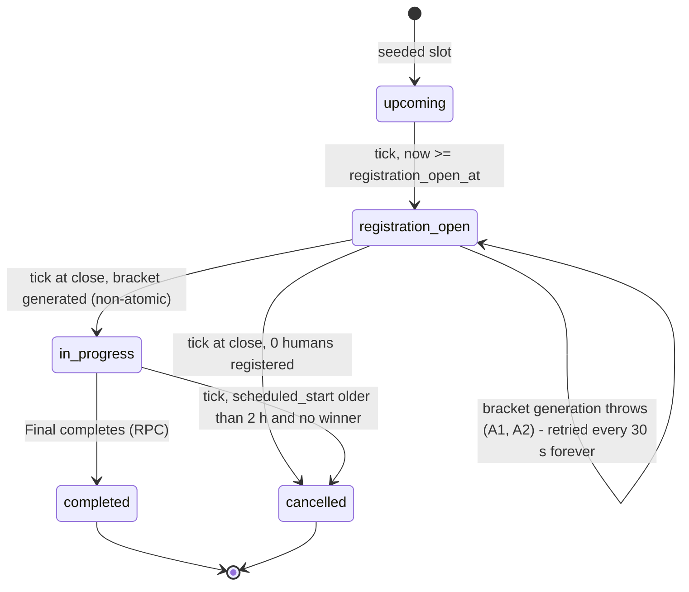
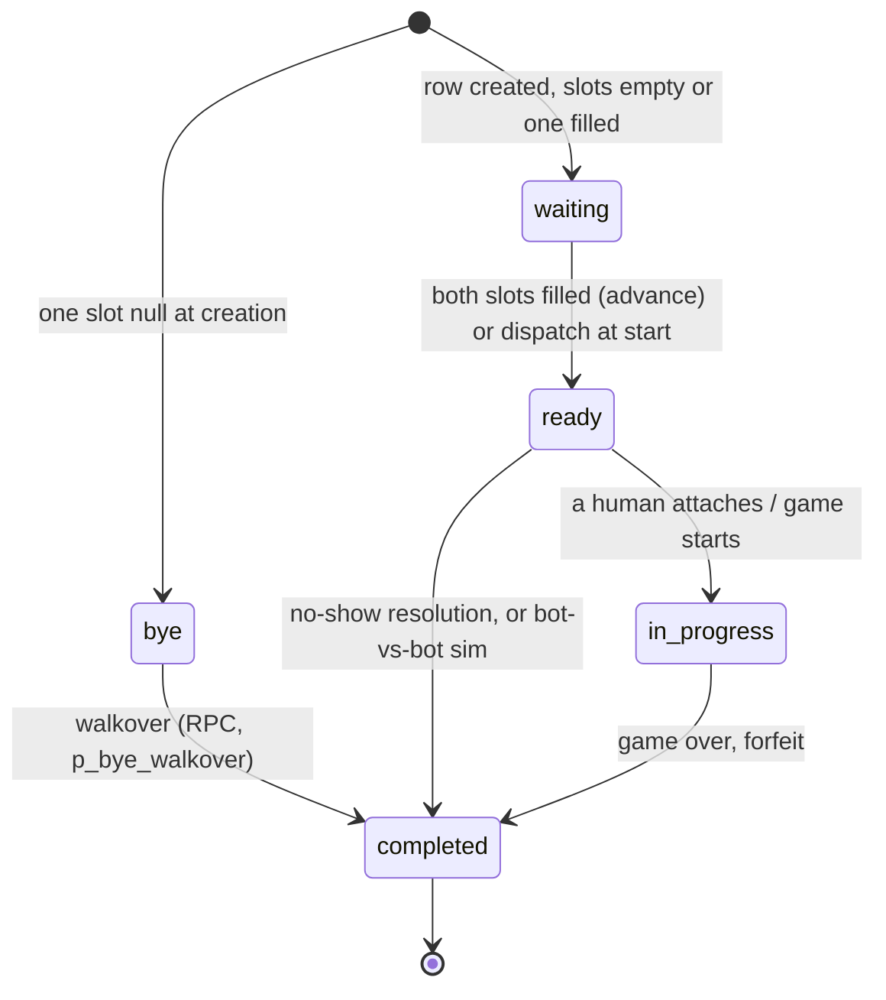

# Tournament System Review

**Branch:** `claude/tournament-review` (docs only, no code changes)
**Base:** `1ea8e41c` (tip of `main` / `claude/magical-ptolemy-hjkfg1` at review time)
**Scope:** the scheduled 8-player bracket tournament system ("Compete" in the app) plus the legacy round-robin lobby system it replaced.

## How to read this report

Every claim is tagged with how it was established:

| Tag | Meaning |
|---|---|
| **[Verified-run]** | I reproduced it with a throwaway test against the real engine code and an in-memory store. The test files were deleted afterwards and are not committed. |
| **[Read]** | Established by reading the code. I cite `file:line`. Not executed. |
| **[Unverified]** | Plausible from what I read, but I could not confirm it. Needs a check before anyone acts on it. |
| **[Web-summary]** | From a search-engine summary of a Miniclip page. I could not open the page itself (see Part 3). |
| **[Recalled]** | From my general knowledge of 8 Ball Pool. Not checked against a source in this session. |

Line numbers refer to the base commit above.

## Status update — Phase 1 ("make events safe"), branch `tournament-health`

**Re-verified 2026-09-29 against `origin/main` = `1ea8e41c`** (the same commit
this review was written against, so the cited line numbers still hold). Each
finding below was re-read in the current code; none had changed.

| Finding | Still reproduces on main? | Phase 1 change |
|---|---|---|
| **A1** non-atomic bracket creation; `generate_tournament_bracket` never called | Yes. `generateBracket` (`engine.ts:294-374`) still inserts row by row, returns early if any row exists, and sets `in_progress` last; `grep` still finds no caller of the RPC. One addition: the RPC as written (v1) *also* only acts when zero rows exist, so calling it alone would not repair the 4-of-7 state from C4. | Fixed. RPC v2 (`2026-09-29_tournament_bracket_rpc_repair.sql`) is the only bracket path; it locks the tournament row, validates the seed list against live registrations, replaces unplayed partial rows, and is a no-op on retry. The duplicate seeding function is gone: `engine.ts` pairs through `bracket.ts`. |
| **A2** racy seat cap; no close-time check | Yes. `routes.ts:319-337` and `socketHandlers.ts` still read, count, then insert, and compare status only. | Fixed. `register_for_tournament` RPC checks status, `registration_close_at` (database clock) and the cap under the tournament row lock; stable codes `registration_closed`, `tournament_full`. |
| **A6** both joined, game not started → treated as double no-show | Yes. `engine.ts:755-808` falls through to the higher-seed branch. | Fixed. Deadline extended once and `match_ready` re-sent; only a second expiry resolves, recorded as `start_failed_after_retry_higher_seed_advanced`, never as a no-show. |
| **A7** REST withdraw has no state guard | Yes. `routes.ts:343-360` still calls `withdrawRegistration` (a hard `DELETE`) unconditionally. | Fixed. `withdraw_from_tournament` RPC refuses (`withdraw_closed`) once registration has closed and never deletes after that. |
| **B8** stored seed ≠ bracket seed | Yes (`engine.ts:350-352`). | Fixed as part of A1: the RPC writes the bracket (rating) seed. |
| **Q9** close-and-start retried forever | Yes (`scheduler.ts:84-86`). | Fixed. After 5 consecutive failed ticks: Sentry alert (`tournament_alert: close_start_failed`), then cancel with `cancel_reason`. One failing event no longer stalls the whole tick. |

Not changed in Phase 1 by decision: **A3** (absent player can be champion) and
**A4** (no human turn clock). The C2 scenario is kept as a `todo` test until
the A3 rule is decided.

Appendix scenarios, re-run against the fixed code (`tournamentHealth.test.ts`,
`scheduler.test.ts`) and, for the database guarantees, against real Postgres 16
(`scripts/tournament-db-verify.sh`, sections 5–7): C1 is now rejected with no
rows written and is alerted-then-cancelled instead of looping; C3 stores
`u3:1 u2:2 u1:3`; C4's partial state is repaired to 7 rows and `in_progress`;
C5 extends once instead of resolving by seed.

---

## Executive summary

The tournament *engine* is in better shape than the tournament *experience*. Match completion and bracket advancement are done atomically in Postgres (`complete_tournament_match`), redundant result producers are tested for idempotency, and recovery-after-restart has real design behind it. The problems are around the edges of that core:

1. **Bracket creation is not atomic, and a database function written for exactly this is never called.** A crash mid-creation, or a 9th registrant, leaves a tournament stuck in `registration_open` with no bracket and no error shown to anyone. Both reproduced. (A1, A2)
2. **A registered player who never shows up can be crowned champion.** Against bot opponents, an absent human wins by "no-show" every round. Reproduced end to end, including the "Champion" activity-feed write. This is intentional and has a test, but the consequence looks unintended. (A3)
3. **Nothing stops a human from stalling a match.** I found no turn timer for connected human players. A stalled match holds the bracket until the 2-hour active window cancels the *whole tournament* for everyone, with no placements. (A4)
4. **The player is never told about the 2-minute join deadline.** `ready_deadline_at` is computed, stored and returned by the API, but no tournament screen renders it. (A5)
5. **Time is client-clock only.** No server-time offset exists anywhere in the client, so countdowns drift by the player's clock error. (B1)
6. **The waiting room does not update live.** The only code that emits `tournament:registration_updated` is a set of socket handlers the client never calls. The client registers over REST, which emits nothing. (B2)
7. **There are no rewards, no notifications and no history UI.** Placement labels and an activity-feed line are all a player gets. The `/history` endpoint exists but no client code calls it. (B6, B7)

Top 3 recommendations are at the end of Part 4. In short: (1) make bracket creation atomic by calling the RPC that already exists, and add registration cap and close-time enforcement; (2) fix the "absent player wins" rule and add a human turn clock; (3) add a server-authoritative clock plus a visible "what happens next and by when" card, with join-deadline countdown and a live roster.

---

# Part 1 — How tournaments work today

## 1.1 File map

### Server: scheduled-tournament core (`server/src/scheduledTournament/`)

| File | Role |
|---|---|
| `engine.ts` (934 lines) | Bracket generation, bot fill, bot-vs-bot auto-resolve, `applyMatchResult`, no-show reconciler, open/close/cancel, placement labels |
| `scheduler.ts` | 30 s polling tick: open registration, close and start, dispatch at start, cancel expired, run no-show reconciler; 6 h seed-window top-up |
| `matchDispatch.ts` | Creates the reserved room, seats bots, marks match `ready`, emits `tournament:match_ready`; 2-minute ready window constant |
| `bracket.ts` | Pure seeding (`QF_SEED_PAIRS`) and advancement mapping. Note: `seedBracket` here is **not** what production uses; `engine.ts` has its own `seedBracketFromOrderedEntrants` (see C2) |
| `persistence.ts`, `persistenceInterface.ts` | PostgREST access plus RPC wrappers; injectable interface for tests |
| `routes.ts` | REST: `upcoming`, `my`, `me`, `history`, `:id`, `:id/bracket`, `:id/result`, `POST/DELETE :id/register` |
| `socketHandlers.ts` | Socket: `tournament:register`, `withdraw`, `get_bracket` (**no client caller**, see B2) |
| `meState.ts` | Derives the per-user phase (`registered`, `bracket_lobby`, `match_ready`, `in_match`, `eliminated`, `completed`) and countdown |
| `recovery.ts` | Boot-time re-dispatch of `ready` matches and recreation of missing rooms |
| `tournamentAuth.ts` | Token/socket identity, and one participant-authorization gate |
| `activeWindow.ts` | 2-hour "past active window" rule |
| `tournamentRoomCode.ts` | `T<6 hex>R<round>M<n>` room-code generator/recognizer |
| `types.ts`, `index.ts` | Types, bootstrap |

### Server: elsewhere

| File | Role |
|---|---|
| `server/src/multiplayer/registerTournamentAttachHandlers.ts` | `tournament:attach_assigned_match`: authz, room rehydrate, mark joined, start game when both attached |
| `server/src/multiplayer/roomForfeit.ts` | `applyActiveMatchForfeit`: manual leave or disconnect timeout → tournament result with retry |
| `server/src/multiplayer/disconnectGrace.ts` | 30 s disconnect grace, auto-pass/draw, forfeit after 2 expiries |
| `server/src/multiplayer/roomSocketAttach.ts` | Shared attach path; tournament ACL for `room:join`; tournament match metadata |
| `server/src/multiplayer/roomKind.ts` | `scheduled_tournament` vs `legacy_league` classification |
| `server/src/realtime/gameOverPersistence.ts` | On game over, calls `applyTournamentGameOverFromRoom` (with retry) |
| `server/src/bot/serverBot.ts`, `server/src/multiplayer/botSeating.ts` | Synthetic Fritz seats (tiers by round) |
| `server/src/social/activityWriter.ts` | Activity-feed "placement" line on completion |
| `server/src/tournament/tournament.ts` | Legacy in-memory round-robin lobby system (behind `ENABLE_LEGACY_TOURNAMENTS`) |
| `server/scripts/multiplayerProcessRestartChaos.ts` | Generic multiplayer restart chaos script (only references tournaments for the scheduler flag) |

### Database (`supabase/migrations/`)

| Migration | What it does |
|---|---|
| `2026-05-14_scheduled_tournaments.sql` | 3 tables, indexes, RLS, 30-day seed of slots |
| `2026-05-14_auto_seed_tournaments.sql` | `seed_future_tournaments`, `ensure_tournament_seed_window`, optional pg_cron |
| `2026-05-16_tournament_cadence_30_minutes.sql` | Cadence to 30 min |
| `2026-05-16_tournament_match_dispatch_fields.sql` | `ready_at`, `ready_deadline_at`, `joined_at`, `winner_source`, forfeit/no-show user, reason |
| `2026-05-16_tournament_registration_placements.sql` | `placement` column |
| `2026-05-16_zz_tournament_bot_fill.sql` | Player id columns to text (bot ids), `bot_tier` |
| `2026-05-17_tournament_registration_close_2_minutes.sql` | Registration closes T-2 min |
| `2026-08-30_tournament_registration_rls_lockdown.sql` | Removes client write access to registrations |
| `2026-08-31_tournament_match_rpcs.sql` | `complete_tournament_match`, `promote_tournament_match`, `generate_tournament_bracket` |
| `scripts/tournament-db-verify.sh` (+ `tournament-db-verify/`) | Manual local Postgres check of the chain and of row-lock serialization. Not run in CI. |

Also: `docs/ops/tournament-*.md` (runbooks), `docs/tournament-mode-runtime-stabilization-audit.md`, `docs/tournament-waiting-room-p1-ux-report.md`, `HARDENING_PLAN.md` (T-INV invariants, D-decisions).

### Client (`client/src/`)

| File | Role |
|---|---|
| `tournament/TournamentHubScreen.tsx` | Hub: next event card, countdown, register/withdraw, recovery banners |
| `tournament/TournamentBracketScreen.tsx` (930 lines) | Waiting room (pre-lock), bracket lobby, live bracket, terminal banner, join banner |
| `tournament/TournamentResultScreen.tsx` | Post-tournament result |
| `tournament/useTournament.ts` | REST + socket-driven state (upcoming, registrations, assignedMatch, countdown, …) |
| `tournament/hubState.ts` | Hub view-model derivation |
| `tournament/registerTournamentSocketHandlers.ts` | Sole client registrar for tournament socket events |
| `tournament/tournamentApi.ts` | REST client |
| `tournament/bracketTerminal.ts`, `terminalMatches.ts`, `tournamentBracketDisplay.ts`, `displayNames.ts`, `tournamentErrorCopy.ts`, `recoverySignals.ts`, `tournamentAttachGuard.ts` | Display/guard helpers |
| `routes/tournamentRoutes.tsx` | Route wiring; register/withdraw handlers |
| `match/session/useTournamentMatchSession.ts` and `match/session/tournament/*` | Attach flow, lifecycle effects (auto-attach on `match_ready` and on recovery), post-match navigation |
| `match/LiveMatchScreen.tsx`, `tournament/TournamentMatchHud.tsx` | In-match UI |
| `home/homeActivityTimeline.ts`, `home/useHomeCommandCenter.ts` | Home "next move" card for a ready tournament match |
| `multiplayer/legacyTournamentTypes.ts` | Legacy types |

### Tests

**Server** (`server/src/scheduledTournament/*.test.ts` and siblings): `engine.test.ts`, `engine.gameOver.test.ts`, `concurrencyRecoveryHarness.test.ts`, `tournamentHumanBotFlow.test.ts`, `routes.test.ts`, `registrationTiming.test.ts`, `scheduler.test.ts`, `recovery.test.ts`, `matchDispatch.test.ts`, `persistence.test.ts`, `meState.test.ts`, `hubState.test.ts`, `bracket.test.ts`, `bracketTerminal.test.ts`, `assertBracketConsistent.testkit.test.ts`, `socketHandlers.auth.test.ts`, `tournamentAttachGuard.test.ts`, `tournamentCompletion.test.ts`, `tournamentExit.test.ts`, `clientRecoverySignals.test.ts`, `persistenceQueries.test.ts`; plus `multiplayer/registerRoomSessionHandlers.tournament.test.ts`, `registerTournamentAttachHandlers.test.ts`, `roomForfeit.test.ts`, `dbIdempotencySchema.test.ts`.

**Client:** `displayNames.behaviorTests.ts`, `tournamentBracketDisplay.behaviorTests.ts`, `registerTournamentSocketHandlers.behaviorTests.ts`, `tournamentPostgamePolicy.behaviorTests.ts`, `tournamentErrorCopy.test.ts`, `useTournamentBracketError.test.ts`, `useTournamentDisplayLabels.test.ts`, `match/session/tournament/tournamentMatchSessionTypes.test.ts`, home timeline/command-center tests, and E2E `client/e2e/{smoke,routing,mobile-*}.spec.ts` (route smoke only).

## 1.2 Lifecycle

**Cadence.** A slot exists every 30 minutes, 24/7, in America/Los_Angeles (48/day), seeded 30 days ahead. Each event: registration opens T-30 min, closes T-2 min, matches begin at T (`scheduled_start`). Format: 8 players, single elimination (QF → SF → Final), first to 30, "7-tile". **[Read: migrations; `engine.ts:840`]**

**Bots are a core mechanic.** Unclaimed seats are filled with synthetic "Fritz" bots at lock. A tournament starts with one human (`MIN_HUMANS_TO_START = 1`, `engine.ts:56`). Bot strength rises by round: standard (R1), elite (R2), master (Final). **[Read: `engine.ts:64-72`]**

| Stage | What happens | Where | Trigger |
|---|---|---|---|
| Creation | Pre-seeded rows, `status='upcoming'` | SQL seed fn; `scheduler.ts` calls `ensure_tournament_seed_window` at boot and every 6 h | cron/timer |
| Open registration | `upcoming → registration_open`; `io.emit('tournament:registration_open')` | `openRegistration` | 30 s scheduler tick, when `now ≥ registration_open_at` |
| Registration | Player POSTs `/api/tournaments/:id/register`; server checks status is `registration_open` and count < max, then inserts | `routes.ts:309-341` | Player |
| Waiting room | Client shows "You're in", countdown to `registration_close_at`, roster, projected bracket. Roster refresh via 20 s poll | `TournamentBracketScreen.tsx` | Client |
| Close + bracket | `closeRegistrationAndStart`: 0 humans → cancel; else seed by rating, pad with bots, insert 4 QF + 2 SF + 1 Final rows, mark registrations `active`, set tournament `in_progress`, walk over byes, `io.emit('tournament:bracket_generated')` | `engine.ts:700`, `generateBracket :294` | 30 s tick, when `now ≥ registration_close_at` |
| Bracket lobby | 2-minute window T-2 → T; pairings visible, "Your quarterfinal starts soon" | `meState.ts` phase `bracket_lobby` | Time |
| Match start (R1) | At `scheduled_start`, tick calls `dispatchScheduledStartMatches`: create reserved room, seat bots, set `ready` with 2-minute `ready_deadline_at`, emit `tournament:match_ready` to connected assigned players. Bot-only QFs auto-resolve instantly | `engine.ts:417`, `matchDispatch.ts` | 30 s tick |
| Join | Client auto-attaches on `match_ready` or on recovery poll (`useTournamentSessionLifecycle.ts`). Server marks `player*_joined_at`; when both seats are in, the game starts and match → `in_progress` | `registerTournamentAttachHandlers.ts` | Player/auto |
| Pairing next rounds | On completion, the same RPC transaction writes the winner into the fed slot; when both slots of a target are filled it becomes `ready`, Node dispatches it (fresh 2-minute deadline). Bot-only targets auto-resolve once both feeders are done | `complete_tournament_match`; `engine.ts:611-650` | Match result |
| No-show | The 30 s reconciler sees `ready` + past deadline: joined player advances; neither joined → see A3/A6 | `engine.ts:727-835` | 30 s tick |
| Disconnect | 30 s grace, auto-pass/draw on the disconnected player's turn; second expiry forfeits (tournament result via retrying `applyMatchResult`) | `disconnectGrace.ts` | Socket drop |
| Manual leave | `applyActiveMatchForfeit` (retries, then `match:result_persist_failed`) | `roomForfeit.ts` | Player |
| Result | Game over → `applyTournamentGameOverFromRoom` → RPC. Client shows an overlay, then routes to bracket/result | `gameOverPersistence.ts`, client session hooks | Game end |
| Finals / completion | Round-3 completion sets placements (winner 1, finalist 2, SF losers 3, QF losers 5), tournament `completed`, champion winner. Node emits `tournament:completed` and writes activity-feed lines | RPC + `finalizeCompletedTournament` | Final result |
| Rewards | None beyond placement label + activity-feed line. **[Read; grep for prize/reward/coins in `scheduledTournament/` and `client/src/tournament/` found only trophy artwork]** | — | — |
| History | `GET /api/tournaments/history` exists; no client caller. **[Read]** | `routes.ts:206` | — |
| Expiry | `in_progress` and older than 2 h with no winner → `cancelled` for everyone | `scheduler.ts:74`, `activeWindow.ts:6` | 30 s tick |

## 1.3 State machines

### Tournament (`scheduled_tournaments.status`)



Notes:

- `upcoming → cancelled` and `registration_open → cancelled` after an outage do not exist as transitions other than via the 0-human path. A tournament whose window passed while the server was down stays `upcoming`/`registration_open` until the next tick fires the open/close logic late. **[Unverified in detail; follows from `scheduler.ts:58-64`, which acts on any past time]**
- There is no `starting`/`bracket_locked` state. "Bracket lobby" is a derived time window (`registration_close_at ≤ now < scheduled_start` with status `in_progress`). **[Read: `meState.ts`, `engine.ts:864`]**

### Match (`scheduled_tournament_matches.status`)



`waiting → ready` occurs in two places with different clocks: the RPC's advance UPDATE (`2026-08-31_tournament_match_rpcs.sql`, target update) and `dispatchTournamentMatch` (`matchDispatch.ts`). **[Read]**

### Registration (`scheduled_tournament_registrations.status`)

`registered → active` (bracket generated) `→ eliminated` (lost) or `→ winner`. `withdrawn` is a type member and a DB check value but no code path ever writes it: withdrawal is a hard `DELETE` (`persistence.ts` `withdrawRegistration`). **[Read]**

### Per-user phase (server `meState.ts`) vs hub UI state (client `hubState.ts`)

Server phases: `registered | bracket_lobby | match_ready | in_match | eliminated | completed | null`.
Client hub states: `loading | api_error | registration_opens_soon | registration_open | registered_waiting | full | registration_closed | bracket_lobby | in_progress | eliminated | completed | cancelled`.

## 1.4 Implicit, inconsistent or missing states

| # | Finding | Evidence |
|---|---|---|
| S1 | `cancelled` is mapped to phase `completed` on the server (`meState.ts`, cancelled branch), so "the event you registered for was cancelled" is indistinguishable from "you finished" unless the client separately holds the bracket status. The hub compensates via `activeBracketStatus`, but only when a bracket was loaded. | [Read] |
| S2 | `eliminated` copy is hardcoded to "you missed your assigned match and were eliminated by no-show" for **every** elimination, including losing a played game. | `client/src/tournament/hubState.ts:131,207` [Read] |
| S3 | No "awaiting other match" state. After winning a QF, the player waits for the sibling QF to finish. Server phase is `bracket_lobby`/`registered`-ish, client shows nothing specific. There is no ETA. | `meState.ts` final fallbacks [Read] |
| S4 | `bracket_lobby` is time-derived on both sides with two copies of the logic (`meState.ts`, `engine.ts:864`, client `hubState.ts`). A skewed client clock produces a different phase than the server. | [Read] |
| S5 | Active window constant is duplicated (`server/.../activeWindow.ts`, `client/.../bracketTerminal.ts:16`), as are placement labels. | [Read] |
| S6 | A "both joined but game never started" state is not modeled. It falls into the no-show branch (C5). | [Verified-run] |
| S7 | Missing: `starting`/locked tournament state, `forfeit_pending` match state (currently a room-local flag `tournamentForfeitApplyStatus`, lost on restart), `abandoned`/`voided` outcome for a tournament cancelled mid-play. | [Read] |
| S8 | Two tournament systems. Legacy league (`server/src/tournament/`, `legacyTournamentTypes.ts`, `ENABLE_LEGACY_TOURNAMENTS`) still shapes room-kind logic. | [Read] |

---

# Part 2 — What's flawed

Ranked: **(a)** breaks or confuses a live tournament, **(b)** feels janky, **(c)** tech debt.

## (a) Breaks or confuses a live tournament

### A1. Bracket generation is not atomic, and a crash leaves the tournament stuck [Verified-run]

`generateBracket` (`engine.ts:294-374`) inserts matches one PostgREST call at a time, and only then sets `in_progress` (`:354`). Its first line returns early if any match row already exists (`:304`).

I simulated a crash on the 5th insert, then retried `closeRegistrationAndStart` (test C4). Result: the retry returns `{started: true}` with only 4 matches (no SF/Final rows) and the tournament stays `registration_open`. Nothing re-attempts the missing rows, nothing sets `in_progress`, and no error is raised.

The atomic replacement already exists: `generate_tournament_bracket` in `2026-08-31_tournament_match_rpcs.sql` takes an advisory lock, inserts all 7 rows idempotently, sets status, activates registrations and walks over byes in one transaction. `grep` finds no caller anywhere in `server/src`. **[Read]**

**Player impact:** everyone registered sees "Bracket lobby" or a waiting room indefinitely; the 2-hour expiry never applies because status is not `in_progress`.

### A2. A 9th registrant breaks bracket creation, and the capacity check is racy [Verified-run for the effect, Read for the race]

The cap is a read-then-insert with no DB constraint (`routes.ts:327-337`; the only table constraint is `unique (tournament_id, user_id)`). Two players taking the last seat concurrently can both pass. Separately, registration is not checked against `registration_close_at`, only against status (`routes.ts:320`), and status flips only on the next 30 s tick, so registration stays open up to ~30 s past the displayed zero.

With 9 registered, `seedBracketFromOrderedEntrants` throws `Tournament caps at 8 players` (`engine.ts:105-107`). Test C1: `closeRegistrationAndStart` throws, status stays `registration_open`, 0 matches. The scheduler catches it and retries every 30 s forever (`scheduler.ts:84-86`).

Related race: a player who registers between `closeRegistrationAndStart` reading registrations and `generateBracket` finishing is registered with no match, in a tournament they are never in. **[Read]**

### A3. An absent player can win the whole tournament [Verified-run]

In `reconcileExpiredReadyMatches`, when neither side joined a human-vs-bot match, the human is chosen as winner (`engine.ts:797-800`). This is deliberate and tested (`engine.test.ts:827`, "advances the human by default when neither side joins a human-vs-bot match"). But it chains: SF and Final are then also human-vs-bot, so the same rule fires again.

Test C2: one registered human who never connects. Outcome: tournament `completed`, `winner_id = u1`, registration `winner`/placement 1, `tournament:completed` emitted, one "Champion" activity write. `joined_at` was never set for anyone.

**Player impact:** fake champions on the activity feed and result screen; and once rewards exist, free rewards. It also makes the field's results meaningless.

### A4. No turn clock for connected human players, and expiry cancels the whole event [Read; Unverified for completeness]

I found timers for bot turns (`roomSession.ts`) and the disconnect grace (`disconnectGrace.ts`), but no turn timer for a connected human. A player who opens the match and stops playing holds their opponent and everyone downstream.

The only backstop is `TOURNAMENT_ACTIVE_WINDOW_MS = 2h` from `scheduled_start`: the scheduler then cancels the **entire** tournament (`scheduler.ts:74`), including finished matches and innocent players, with no placements.

*Caveat:* I grepped for turn/idle/AFK timers; a timer could exist under an unexpected name.

### A5. The join deadline is never shown to the player [Read]

`ready_deadline_at` (2 minutes, `matchDispatch.ts:12`) is stored and returned (`meState.ts`, `/me`), but grep for `readyDeadlineAt` across the client finds it used only in the home timeline card (`homeActivityTimeline.ts:155-165`). The hub banner, bracket join banner and attach button show no countdown. If auto-attach fails (socket not connected, app in background), the player has no idea they have 2 minutes to avoid a forfeit.

### A6. "Both joined but game never started" is treated as a double no-show [Verified-run]

In `reconcileExpiredReadyMatches`, if both players joined but the room has no state at deadline, control falls through (`engine.ts:755-769`), neither single-joined branch matches, and the higher seed wins with reason `double_no_show_higher_seed_advanced` (test C5). Two players who were both present lose the result to a seed lookup because the game start was slow or failed.

### A7. REST withdraw has no state guard [Read]

`DELETE /api/tournaments/:id/register` (`routes.ts:343-360`) calls `withdrawRegistration` unconditionally. The socket version rejects after start (`socketHandlers.ts`), but the client uses REST. A player can delete their registration row mid-tournament. Elimination and placement updates then match no row; their name resolves to null in the bracket (usernames come from registrations).

### A8. Overlapping tournaments and multiple "active" matches [Read]

Events start every 30 min but an event can live 2 h, so up to ~4 overlap. Nothing prevents registering for several. The code itself warns about this anomaly (`persistence.ts`, "multiple active assigned matches for one user") and picks one by heuristic. A player entered in two overlapping events can be dispatched to both and forfeit one.

### A9. Registration or lock event handling depends on a 30 s poll [Read]

Registration close, bracket generation, R1 dispatch and no-show resolution all run on one 30 s `setInterval` in one process (`scheduler.ts:15,90`). Every stage can start up to 30 s late, and a tick that is slow or fails delays everything (the whole tick is one try/catch, `:84-86`). The "Round 1 starts at T" promise is really "T to T+30 s".

## (b) Feels janky

| # | Finding | Evidence |
|---|---|---|
| B1 | **Countdowns use the client clock.** `Date.now()` is used for every countdown; no server-time offset exists in the client (grep for `serverTime`/`serverNow`/`clockOffset`: none). A phone 40 s fast sees "0:00" 40 s early, refreshes, and finds registration still open. The 250 ms boundary refresh in `useTournament.ts` makes this visible. | [Read] |
| B2 | **The roster doesn't update live.** `tournament:registration_updated` is emitted only from `socketHandlers.ts:57,88`, which the client never calls. It registers via REST, which emits nothing. Other players' seat counts move only on the 20 s bracket poll (`TournamentBracketScreen.tsx:599`) or on hub refresh. | [Read] |
| B3 | **Register has no in-flight state and no error UI.** `onClick={() => void onRegister(id)}` (`TournamentHubScreen.tsx:188`) with no try/catch. A `full` or `registration_closed` response becomes an unhandled promise rejection; the user sees nothing, and a double-tap can send two requests. | [Read] |
| B4 | **Raw error codes reach players.** `showToast(errorMessage, 2500)` (`useTournamentAttachFlow.ts:355`) and the attach banner show `match_not_ready`, `room_unavailable`, `tournament_not_assigned` as-is. `tournamentErrorCopy` covers only bracket-load errors. | [Read] |
| B5 | **Waiting-room hero says "You're in / Seat confirmed" to everyone.** `isWaitingRoom` is true whenever status is `registration_open` and there are no matches (`TournamentBracketScreen.tsx:624`), regardless of whether the viewer registered. | [Read] |
| B6 | **Copy contradicts the clock.** Waiting room: "Round 1 begins at lock" (`:469`); reality: bracket locks at T-2 and R1 begins at T (plus up to 30 s). | [Read] |
| B7 | **No rewards, no notifications, no history UI.** Nothing to pull a player back for the next event; a player who backgrounds the app during the 30-minute registration window gets no signal (I found no push/web-push/email path for tournaments). The `/history` endpoint has no client caller. | [Read] |
| B8 | **Seats shown don't match the seeding.** Registration `seed` is written in registration order (`engine.ts:351`), while the bracket is seeded by rating (`:96`). Test C3: with u1,u2,u3 registered, the stored seeds are u1:1 u2:2 u3:3 but the highest-rated u3 is the bracket's seed 1 (QF1 vs a bot). The waiting-room roster shows `seed` as the seat number, and `selectHigherSeedWinner` (used for double no-shows) uses it. | [Verified-run] |
| B9 | **Most of the event is a wait.** Registration is open 28 min before lock, then 2 min of lobby, then matches. A player who registers at T-30 waits 30 minutes before the first tile, and after winning waits for the sibling match with no ETA (S3). | [Read] |
| B10 | **Bot-filled fields are visible and unavoidable.** The UI says "Fritz bots fill unclaimed seats at lock", so most events are mostly bots. Honest, but it undercuts the "tournament" feel. | [Read] |
| B11 | **Auto-attach drops the player into a match without a moment of preparation.** On `match_ready` the client attaches immediately from any screen (`useTournamentSessionLifecycle.ts:103-136`). Good for the 2-minute deadline, but there is no "your match is starting, get ready" interstitial. | [Read] |
| B12 | **Design-system drift.** The trophy SVG uses a gradient (`TournamentHubScreen.tsx:210`) while `AGENTS.md` mandates matte, gradient-free surfaces. Minor. | [Read] |
| B13 | **Hub shows a fixed 3 upcoming events** (`:307`), and the API returns 5. With overlapping events that may hide the one you're in. | [Read] |

## (c) Tech debt

| # | Finding | Evidence |
|---|---|---|
| C1 | Dead RPC `generate_tournament_bracket` (see A1). | [Read] |
| C2 | Two seeding implementations: `bracket.ts:seedBracket` (pure, tested) vs `engine.ts` private `seedBracketFromOrderedEntrants`. Tests of the former do not cover production. | [Read] |
| C3 | Dead server socket handlers `tournament:register`, `withdraw`, `get_bracket` (`socketHandlers.ts`); they carry the only emit of `registration_updated`. Also tested (`socketHandlers.auth.test.ts`), which makes them look live. | [Read] |
| C4 | Bot ids in text columns while `registrations.user_id` is uuid. The RPC casts `v_loser_id::uuid` and `r.user_id::text` around this. Fragile. | [Read: migrations] |
| C5 | Single-process scheduler with in-memory rooms. `reconcileExpiredReadyMatches` documents that it must move behind a lock before multi-instance. `TOURNAMENT_SCHEDULER_ENABLED` is the only guard. | [Read] |
| C6 | Global `io.emit` for registration/bracket/completed events (`engine.ts`, ~L371, L635, L674, L683, L693) sends every tournament event to every connected client. Cheap now; will not scale. | [Read] |
| C7 | Stale comments/docs: `2026-08-30_..._lockdown.sql` references `persistTournamentPlacements()` (doesn't exist); plan docs say 2-hour cadence and T-5 close; `scheduler.ts` says "polls every minute" but the interval is 30 s; duplicate `log.info('accepted')` in the attach handler. | [Read] |
| C8 | Legacy league system still in tree (S8). | [Read] |
| C9 | Constants duplicated client/server (active window, auto-kick, labels). | [Read] |
| C10 | `/api/tournaments/me` fans out many sequential fetches per call (registrations → tournaments → matches per tournament → profiles → active match). It runs on every refresh, visibility change and socket connect. | [Read: `routes.ts:81-204`] |
| C11 | Placement collisions: two SF losers are both 3, four QF losers all 5, so there is no ordering within a tier. Labels ("Semifinalist") paper over it. | [Read: RPC] |

## Test coverage

**What is well covered:** RPC-level idempotency and concurrent producers (`concurrencyRecoveryHarness.test.ts`); full 8-player bracket lifecycle (`engine.test.ts:495`); bot gating rules; no-show reconciliation branches; recovery after boot; attach authz; route auth/ordering; registration timing math; `/me` recovery payloads; the DB row-lock proof (manual script, not CI).

**Untested, with the finding each would have caught:**

| Gap | Would have caught |
|---|---|
| Registration cap under concurrency; > 8 registered; registering after `registration_close_at` | A2 |
| Crash/partial failure inside `generateBracket` | A1 |
| Absent-human-vs-bots chain to champion | A3 (the single step is tested; the chain is not) |
| Both-joined-but-not-started at deadline | A6 |
| REST withdraw after start | A7 |
| Human-vs-human match where one side stalls (any turn-clock behavior) | A4 |
| Overlapping tournaments and dual assignment | A8 |
| Tournament-specific server-restart mid-round (the generic chaos script only toggles the scheduler flag) | S7 |
| Any client screen render: `TournamentHubScreen`, `TournamentBracketScreen`, `useTournament` (hooks tested only for display labels/errors) | B3, B5, B6 |
| Countdown behavior / clock skew | B1 |
| E2E lifecycle (registration through result); current E2E is route smoke only | integration regressions |
| `tournament-db-verify.sh` in CI (needs Postgres; currently manual) | migration/RPC drift |

Also checked and **not** a gap: the disconnect path is only partially visible to me: `disconnectGrace.ts:275` returns without action if the grace expires when it is not the disconnected player's turn. I did not verify whether a fresh timer starts when the turn later arrives. **[Unverified]**; worth a targeted test.

---

# Part 3 — Comparison to 8 Ball Pool (Miniclip)

## 3.1 Research limits, stated plainly

`support.miniclip.com`, `8ballpool.fandom.com` and `blog.miniclip.com` were blocked or unreachable from this environment, so I could not open any 8 Ball Pool page. What I have from the web is the text a search engine returned *about* those pages. Anything beyond that below is **[Recalled]** and should be treated as unconfirmed. The two real-world pool-league results (APA, UPA) that also came back are about physical league play, not the game, and I did not use them.

## 3.2 What I could verify

| Fact | Source |
|---|---|
| "Tournament with Friends": private competitions for up to 8 players, consisting of quarter finals, semi final and final; winner takes the bigger pot, second a smaller one | Miniclip support article via search summary [Web-summary] (support.miniclip.com) |
| The lobby holds up to 8; once at least 4 have joined the host sees a Start Tournament button; pressing it starts the tournament and no new players can join | same [Web-summary] |
| Every tournament has a coin entry fee that depends on the table chosen; combined entry fees form the prize pool | same [Web-summary] |
| You must win 3 games (first round, semi, final) to take the title | same [Web-summary] |
| You create or join a Tournament with Friends from the Friends interface (bottom-left icon) | same [Web-summary] |
| Public tournaments are "a sequence of 3 online matches"; themed tables with fee/prize pairs (e.g. London 50 → 100 coins, up to Shanghai 1M → 2M); winner takes the bigger pot | Wiki/aggregator summaries in search results [Web-summary], second-hand and undated; treat as approximate |
| Tournaments are reached from "Play Special" alongside 9 Ball, No Guidelines, Lucky Shot | Miniclip help result [Web-summary] |
| Connection problems (disconnects, lag) are a documented support category | Miniclip help result title/summary only; no tournament-specific disconnect rule was retrievable |

## 3.3 What I'm recalling, not verified

Use these as hypotheses to check against the live game before designing to them:

- Tournaments are on-demand, not clock-scheduled: you pick a table, pay the fee, and are placed in a bracket that fills with other players; the bracket starts when it fills. **[Recalled]**
- Rounds are played back to back; you are matched into your next round as soon as your bracket sibling finishes, and progress is shown as a bracket screen. **[Recalled]**
- Shot timers exist inside a match. **[Recalled]**
- Leaving or disconnecting mid-match generally forfeits that match, with a short grace to reconnect. **[Recalled; do not rely on the length]**
- Rewards are coins and sometimes cues or other items, tiered by table. **[Recalled]**
- In-app notifications and a lobby entry point drive re-engagement. **[Recalled]**

## 3.4 Design principles that make it feel smooth (and that map to dominoes)

Derived from the verified structure plus recall. The verified parts are marked.

1. **Enter in one tap from a place you already are.** Tournaments sit in the same menu as other modes (verified: Play Special). *Ours:* a separate hub, then register, then a separate waiting room.
2. **Know what happens next and roughly when.** A fixed three-win path with a bracket. *Ours:* stages are labeled, but there are no ETAs after the first match and no visible join deadline (A5, S3).
3. **Entry cost is explicit and pays out.** Fee → pot → winner/runner-up (verified). *Ours:* free entry, no payout, so no stakes and no reason to return.
4. **Start when the field is ready, not when a clock says so.** The friends variant starts on the host's button once 4+ are in (verified). *Ours:* a fixed 30-minute slot with up to 28 minutes of waiting, then bots fill the rest.
5. **Forgiving failure handling.** Games are short and self-contained, so a disconnect costs one match, not a whole event [Recalled]. *Ours:* a match runs to 30 points; disconnect costs the match (reasonable) but a stalled opponent can cost the *event* (A4).
6. **Progress and status are always visible.** A bracket you can open at any time. *Ours:* good bracket screen; weak live updating (B2).
7. **Real opponents make the event matter.** *Ours:* bot fill is disclosed in copy (B10).

**Skipped as not mapping to dominoes:** shot clocks measured in seconds per shot (dominoes turns are fast decisions, so a per-turn clock is needed but tuned very differently), table/cue economy, cosmetic prizes, and real-time physics fairness.

## 3.5 Side by side

| Dimension | 8 Ball Pool | Racehorse today | Gap |
|---|---|---|---|
| Entry | In-app mode, pay coin fee [Web-summary] | Hub → Register (free) | No stakes; extra screens |
| Field | Up to 8 players, bracket QF/SF/F [Web-summary] | 8 seats, 1+ humans, rest Fritz bots | Real-player density |
| Start | Host presses Start with ≥ 4 (friends mode) [Web-summary]; public start rule [Recalled] | Fixed 30-min clock, lock at T-2, start at T (+ ≤30 s) | Long wait; no early start when full |
| Prize | Pot from fees; winner bigger, runner-up smaller [Web-summary] | Placement label + activity line | No reward loop |
| Rounds | 3 wins required [Web-summary]; pacing [Recalled] | Same shape; next round starts when both feeders done | No ETA while waiting |
| Disconnect / no-show | Not retrievable | 30 s grace, auto-move, forfeit on second expiry; no-show forfeits at 2 min; absent-vs-bot advances (A3) | Unfair edge cases; no visible timer |
| Notifications | [Recalled] | None found | Missing entirely |
| Results / progress | Bracket [Recalled] | Bracket, result screen, no history UI | History unused |

---

# Part 4 — Recommendations

## 4.1 Roadmap

Effort key: **S** ≈ ½–1 day, **M** ≈ 2–5 days, **L** ≈ 1–3 weeks. Estimates are rough and assume the current team knows the code.

### Quick wins (≤ 1 day each; mostly independent)

| # | Change | Files | Effort | Player-visible benefit |
|---|---|---|---|---|
| Q1 | Enforce `registration_close_at` (not just status) on register; reject with a stable code. Cap registrations with a DB-level guard (a transactional RPC that counts and inserts, or a partial-unique/slot constraint). | `routes.ts:309`, `socketHandlers.ts`, `persistence.ts`, new migration | S–M | Removes A2, including the stuck-bracket case |
| Q2 | Guard REST withdraw by tournament status and close time, mirroring the socket handler. Never hard-delete after `in_progress`. | `routes.ts:343`, `persistence.ts` | S | Removes A7 |
| Q3 | Render `ready_deadline_at` countdown on the join banner, hub banner and bracket lobby ("Join within 1:42 or you forfeit"). | `TournamentBracketScreen.tsx`, `TournamentHubScreen.tsx` | S | Removes A5; fewer accidental forfeits |
| Q4 | Map server error codes to human copy (`match_not_ready`, `room_unavailable`, `full`, `registration_closed`, …) and show register errors + in-flight state. | `useTournamentAttachFlow.ts:355`, `tournamentErrorCopy.ts`, `TournamentHubScreen.tsx:188` | S | Fixes B3, B4 |
| Q5 | Fix copy: eliminated message by cause (played loss vs no-show), waiting-room hero only when the viewer is registered, "Round 1 begins at start" wording. | `hubState.ts:131,207`, `TournamentBracketScreen.tsx:465-469,624` | S | Fixes S2, B5, B6 |
| Q6 | Write seeds in bracket (rating) order, or stop displaying seed as the seat number. | `engine.ts:349-352`, waiting-room roster | S | Fixes B8 |
| Q7 | Emit `tournament:registration_updated` from the REST register/withdraw routes (or, better, per-tournament rooms, see M3). | `routes.ts` | S | Live roster (B2) |
| Q8 | Make the both-joined-not-started case extend the deadline and re-attempt game start instead of resolving by seed. | `engine.ts:755-769` | S | Removes A6 |
| Q9 | Alert (Sentry) when `closeRegistrationAndStart` throws, and cancel-with-reason after N failed ticks instead of retrying forever. | `scheduler.ts:84`, `engine.ts:700` | S | Turns silent stuck events into visible ones (A1/A2 safety net) |
| Q10 | Add the missing tests listed in Part 2 for A1, A2, A3 (chain), A6, A7. | new tests | S–M | Locks the fixes in |

### Medium projects (≈ 2–5 days)

| # | Change | Files | Effort | Benefit |
|---|---|---|---|---|
| M1 | Use `generate_tournament_bracket` from `generateBracket`; make status change + rows atomic; have retry repair partial state. Delete the duplicate seeding function or make the RPC input come from it. | `engine.ts:294`, `persistence.ts`, tests | M | Removes A1, C1, C2 |
| M2 | Human turn clock for tournament matches only (e.g. per-turn limit with auto-pass/draw, then forfeit after N consecutive timeouts), reusing `disconnectGrace` mechanics. Product decision on the numbers. | `roomSession.ts`, `disconnectGrace.ts`, client HUD | M | Removes A4; predictable pace |
| M3 | Server time source: return `serverNow` on `/upcoming`, `/me`, `/bracket`; client computes an offset and uses it for all countdowns. Use per-tournament socket rooms instead of global `io.emit`. | `routes.ts`, `useTournament.ts`, `useSyncNow`, `engine.ts` emits | M | Fixes B1, C6 |
| M4 | Redefine the absent-player rule. Options for product to pick: (a) a no-show forfeits the player even against a bot, (b) require a human to join at least the first round or be marked `withdrawn`/`no_show`, (c) if all humans are absent, cancel with reason. Award no placement or activity to a player who never joined. | `engine.ts:797-800`, RPC, `engine.test.ts:827` | M | Removes A3 |
| M5 | Tournament-scoped wait feedback: "waiting for QF2 (est. X min)", "your opponent is joining", "opponent disconnected, resolving in 0:20" after a match. | `meState.ts` (new phase/ETA), bracket screen | M | Addresses S3, B9 |
| M6 | Notifications for "registration open", "your match is ready", "you have 2 minutes" (web push and/or native push in the app shell). | new server module + client | M–L | Fixes B7 |
| M7 | History and profile surfacing: wire `/history` into a screen; add tournament results to profile/activity. | client screens | M | Gives the results a place to live |
| M8 | Prevent dual registration in overlapping events, or define how dual assignment resolves. | `routes.ts`, RPC | M | Removes A8 |
| M9 | Run `tournament-db-verify.sh` (or an equivalent Postgres service test) in CI. | CI config | M | Catches migration/RPC drift |

### Larger rebuilds

| # | Change | Effort | Benefit |
|---|---|---|---|
| L1 | **Move the lifecycle into a single DB-driven state machine.** One `advance_tournament(id, now)` RPC owns transitions (upcoming → open → locked → in_progress → completed/cancelled), writes an event log, and is called by the scheduler and by tests. The tick becomes a thin caller. Removes reliance on a 30 s poll's ordering and gives one place to reason about time. | L | Removes A9, S4, S7; simplifies recovery |
| L2 | **Rethink the schedule/bot model.** Options, from smallest to largest: (a) keep the 30-min clock but start early when the field is full; (b) on-demand brackets that start when 8 are gathered or a short timer expires, bot-filling only after a wait threshold; (c) tiered events. This is the biggest lever on "feels like 8 Ball Pool". | L | Removes B9, B10 |
| L3 | **Rewards and stakes.** Define what winning gives (rating bonus, badge, streaks, tiered events). This needs a product decision before engineering. | M–L | Return loop (B7) |
| L4 | **Retire the legacy league system and dead socket handlers;** unify placement/seed/label logic on one source of truth shared by client and server. | M | Removes C3, C8, C9 |
| L5 | **Multi-instance safety:** move the scheduler and room state behind a lease; in-memory rooms already hydrate from snapshots, so this is mostly the scheduler and forfeit-pending flag. | L | C5, S7 |

## 4.2 Patch or redesign?

- **Patch:** the match-completion core (RPC + idempotency), the attach/recovery flow, and the bracket screen. They are well tested and coherent.
- **Redesign:**
  1. **Lifecycle orchestration** (A1, A2, A9): a poll-driven, multi-step, non-transactional pipeline should become one transactional state machine (L1).
  2. **Event format** (B9, B10): fixed 30-minute clocks plus bot fill are the root of the waiting problem, and no amount of UI polish fixes it (L2).
  3. **Time handling** (B1): moving to a server-time model is cheap now and expensive later (M3).

## 4.3 Top 3 recommendations, and what to do first

1. **Make event creation and registration safe (Q1, Q2, Q9, M1).** Enforce the registration cap and close time in the database, guard withdraw, and switch bracket creation to the existing atomic RPC. This removes the only findings that can leave a live event silently stuck. **Do this first:** it is small, mostly done in SQL you already have, and it stops the worst failure.
2. **Fix fairness and pace (M4, M2, Q8).** Decide the absent-player rule and stop crowning no-shows; add a human turn clock; stop resolving two present players as no-shows. This is what makes results trustworthy.
3. **Give the player a clear "what next, and by when" (M3, Q3, Q4, Q5, Q7, M5).** Server-authoritative clock, visible join countdown, human error copy, a live roster, and wait ETAs. This is the largest player-visible improvement for the least engineering risk, and the natural place to start the 8 Ball Pool comparison work.

L2 (the schedule and bot model) is the change most likely to move the product from "scheduled event with bots" to something that feels like a tournament, but it depends on product decisions about player supply, so I'd scope it after these three.

## 4.4 Questions for the product owner

1. Is "absent human advances against bots" intended? (A3) If a player never joined, should they get a placement or an activity-feed "Champion"?
2. What turn limit is acceptable for a 30-point dominoes match? (M2)
3. Should events start early when full, and should bots fill only after a wait threshold? (L2)
4. What, if anything, should winning give? (L3)
5. Should a player be allowed in overlapping events? (A8)

---

## Appendix: verification runs

Five throwaway tests were built from `engine.test.ts`'s in-memory harness, run once with vitest, then deleted. Nothing from them is committed. Output:

```
C1 error = Tournament caps at 8 players | status = registration_open | matches = 0
C2 tournament = completed winner = u1 | u1 reg = winner 1 | joined_at ever set = false | completed event = true | activity calls = 1
C3 stored seeds = u1:1 u2:2 u3:3 | QF1 (seed1 vs seed8) = u3 vs bot:fritz:tour-1:5
C4 first = simulated crash | retry = {"started":true} | matches = 4 | status = registration_open
C5 result = completed u1 no_show double_no_show_higher_seed_advanced
```

These ran against the engine with an in-memory store and mocked dispatch. They prove the engine's behavior, not the behavior of the live Supabase deployment, whose RPCs and constraints I did not exercise.
