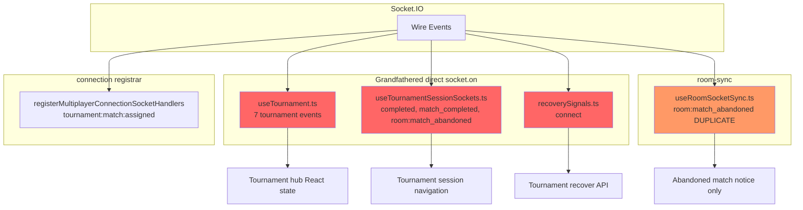
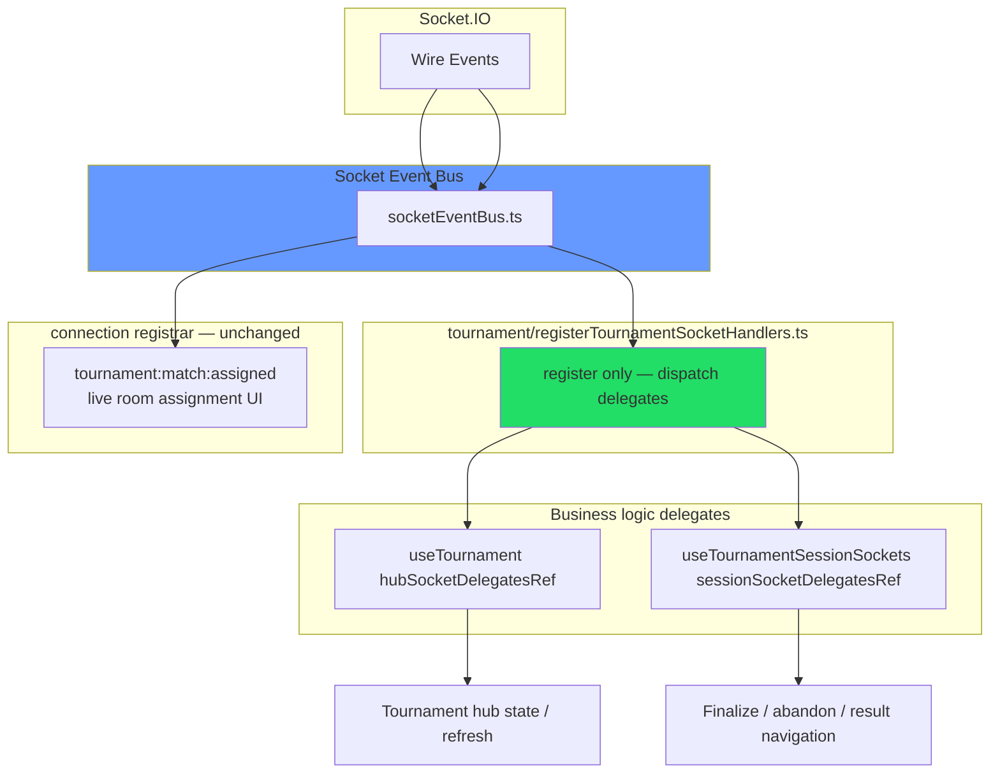
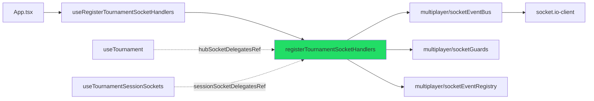

# Tournament Socket Registrar Extraction — Architecture Report

**Date:** 2026-07-06  
**PR scope:** Migrate Tournament bounded context off grandfathered `socket.on(...)` listeners onto the Socket Event Bus + approved registrar pattern.

---

## Executive Summary

Tournament socket ownership is now centralized in **`tournament/registerTournamentSocketHandlers.ts`**, mirroring the multiplayer registrar architecture. All hub lifecycle events, live-session finalize/abandon handlers, and tournament reconnect recovery (`connect`) register through the **Socket Event Bus** — no direct `socket.on` in tournament hooks.

**Grandfathered direct listeners removed:** 11 (from 19 → **8** remaining, all matchmaking/friends).

**`room:match_abandoned`:** consolidated to a **single** registration in the tournament registrar (removed duplicate from `useRoomSocketSync.ts` and `useTournamentSessionSockets.ts`).

---

## 1. Architecture Diagrams

### 1.1 Before



**Problems:**
- 11 unregistered tournament listeners bypassed registry CI (removed in Phase T)
- Duplicate `tournament:completed` / `tournament:match_completed` registrations (hub + session)
- Duplicate `room:match_abandoned` (room-sync notice vs session navigation)
- Tournament `connect` recovery parallel to connection registrar

---

### 1.2 After



**Wiring:** `App.tsx` calls `useRegisterTournamentSocketHandlers` with `getScope()` reading both delegate refs.

---

## 2. Complete Tournament Socket Ownership Table

| Socket Event | Owner | Registrar | Bounded Context | Registration Kind | Enforced | Handler behavior |
|--------------|-------|-----------|-----------------|-------------------|----------|------------------|
| `tournament:registration_open` | `tournament.hub` | `tournament/registerTournamentSocketHandlers.ts` | tournament | raw | ✅ | Hub `refresh()` |
| `tournament:registration_updated` | `tournament.hub` | `tournament/registerTournamentSocketHandlers.ts` | tournament | raw | ✅ | Hub `refresh()` + bracket fetch |
| `tournament:bracket_generated` | `tournament.hub` | `tournament/registerTournamentSocketHandlers.ts` | tournament | raw | ✅ | Bracket fetch + refresh |
| `tournament:match_updated` | `tournament.hub` | `tournament/registerTournamentSocketHandlers.ts` | tournament | raw | ✅ | Bracket fetch |
| `tournament:match_ready` | `tournament.hub` | `tournament/registerTournamentSocketHandlers.ts` | tournament | raw | ✅ | Pending match overlay |
| `tournament:match_completed` | `tournament.hub` | `tournament/registerTournamentSocketHandlers.ts` | tournament | raw | ✅ | Hub state clear + **session finalize delegate** |
| `tournament:completed` | `tournament.hub` | `tournament/registerTournamentSocketHandlers.ts` | tournament | raw | ✅ | Hub state clear + **session result delegate** |
| `room:match_abandoned` | `tournament.session.abandoned` | `tournament/registerTournamentSocketHandlers.ts` | tournament | raw | ✅ | Session navigation + forfeit notice (single owner) |
| `connect` (tournament recovery) | `tournament.hub` | `tournament/registerTournamentSocketHandlers.ts` | connection | raw (additional) | ✅ | Hub `recover()` on reconnect |
| `tournament:match:assigned` | `connection.tournament` | `multiplayer/registerMultiplayerConnectionSocketHandlers.ts` | tournament | raw | ✅ | Sets `joinedRoom`, app mode (connection UI — deferred) |

**Shared events (`match_completed`, `completed`):** registrar dispatches to **both** hub and session delegates in one handler — no duplicate bus registration.

**Document visibility recovery:** remains in `recoverySignals.ts` (not a socket event).

---

## 3. Removed Direct Socket Listeners

| File | Removed `socket.on` events | Count |
|------|---------------------------|-------|
| `tournament/useTournament.ts` | `tournament:registration_open`, `registration_updated`, `bracket_generated`, `match_updated`, `match_ready`, `match_completed`, `completed` | 7 |
| `match/session/tournament/useTournamentSessionSockets.ts` | `tournament:completed`, `tournament:match_completed`, `room:match_abandoned` | 3 |
| `tournament/recoverySignals.ts` | `connect` | 1 |
| `multiplayer/useRoomSocketSync.ts` | `room:match_abandoned` (duplicate) | 1 |

**Total removed:** 12 direct listener sites (11 legacy direct + 1 enforced duplicate).

---

## 4. Files Created

| File | Purpose |
|------|---------|
| `client/src/tournament/registerTournamentSocketHandlers.ts` | Sole tournament socket registration — dispatch only |
| `client/src/tournament/tournamentSocketTypes.ts` | `TournamentHubSocketDelegates`, `TournamentSessionSocketDelegates`, `TournamentSocketScope` |
| `client/src/tournament/useRegisterTournamentSocketHandlers.ts` | React effect wiring in `App.tsx` |
| `client/src/tournament/registerTournamentSocketHandlers.behaviorTests.ts` | Delegate contract behavior test |

---

## 5. Files Modified

| File | Change |
|------|--------|
| `client/src/tournament/useTournament.ts` | Hub delegate ref; removed `socket.on` effect; `bindTournamentRecoverySignals` visibility-only |
| `client/src/tournament/recoverySignals.ts` | Removed `socket.on('connect')` — connect recovery via registrar |
| `client/src/match/session/tournament/useTournamentSessionSockets.ts` | Session delegate ref; removed all `socket.on`; kept `completedTournamentId` React effect |
| `client/src/match/session/useTournamentMatchSession.ts` | Exposes `sessionSocketDelegatesRef` |
| `client/src/match/session/tournament/tournamentMatchSessionTypes.ts` | API type includes `sessionSocketDelegatesRef` |
| `client/src/App.tsx` | `useRegisterTournamentSocketHandlers` wiring; `useTournament` no longer needs `socket` |
| `client/src/multiplayer/useRoomSocketSync.ts` | Removed `room:match_abandoned` registration |
| `client/src/multiplayer/socketEventRegistry.ts` | Tournament entries enforced; grandfather list shrunk; `TOURNAMENT_SOCKET_EVENTS`; `connect` additional registrar |
| `client/scripts/validateSocketEventRegistry.ts` | Tournament event coverage; orphan hub-event guard |
| `client/src/multiplayer/socketEventRegistry.test.ts` | Tournament registry vitest coverage |

---

## 6. Registry Changes

### Added to `APPROVED_SOCKET_REGISTRAR_FILES`
- `tournament/registerTournamentSocketHandlers.ts`

### Added `TOURNAMENT_SOCKET_EVENTS` constants
```ts
REGISTRATION_OPEN, REGISTRATION_UPDATED, BRACKET_GENERATED,
MATCH_UPDATED, MATCH_READY, MATCH_COMPLETED, COMPLETED
```

### New enforced registry entries (8 tournament hub/session + 1 moved abandon)
All register in `tournament/registerTournamentSocketHandlers.ts`.

### `room:match_abandoned` owner change
- **Before:** `room-sync.abandoned` → `multiplayer/useRoomSocketSync.ts`
- **After:** `tournament.session.abandoned` → `tournament/registerTournamentSocketHandlers.ts`

### `connect` additional registrar
- Added `tournament/registerTournamentSocketHandlers.ts` alongside `useFriendSocketReachability.ts`

### Removed from `GRANDFATHERED_DIRECT_SOCKET_ON` (11 entries)
All `useTournament.ts`, `useTournamentSessionSockets.ts`, and `recoverySignals.ts` tournament sites.

---

## 7. Remaining Grandfathered Listeners (8)

| File | Event | Bounded Context | Reason |
|------|-------|-----------------|--------|
| `friends/FriendsScreen.tsx` | `connect` | friends | Friends hub presence — future friends registrar PR |
| `matchmaking/useMatchmaking.ts` | `queue:online` | matchmaking | Matchmaking queue |
| `matchmaking/useMatchmaking.ts` | `queue:matched` | matchmaking | Matchmaking queue |
| `matchmaking/useMatchmaking.ts` | `queue:timeout` | matchmaking | Matchmaking queue |
| `matchmaking/useMatchmaking.ts` | `connect` | matchmaking | Matchmaking reconnect |
| `matchmaking/useMatchmaking.ts` | `disconnect` | matchmaking | Matchmaking reconnect |
| `matchmaking/useQueueCounts.ts` | `queue:online` | matchmaking | Queue depth widget (duplicate) |
| `matchmaking/useQueueCounts.ts` | `connect` | matchmaking | Queue depth widget |

**Tournament:** zero grandfathered listeners remaining.

**Still on connection registrar (not grandfathered):** `tournament:match:assigned` — connection-scoped live room assignment.

---

## 8. Dependency Graph Changes



**New cross-boundary edge:** `tournament/` → `multiplayer/socketEventBus` (approved registrar pattern, same as future matchmaking registrar).

**No changes to:** RecoveryMachine, Session FSM, Projection layer, server protocol.

---

## 9. `room:match_abandoned` Consolidation

### Before (dual path)
1. **room-sync:** set `abandonedMatchNotice` overlay only
2. **tournament session:** full navigation (reset room, bracket/result routing, notice callbacks)

Both listeners could fire for the same event.

### After (single path)
1. **Tournament registrar** → `session.onMatchAbandoned` delegate
2. Delegate performs navigation + `onTournamentMatchAbandoned` / `onPrivateMatchAbandoned` (which set `abandonedMatchNotice` in `App.tsx`)

Room-sync notice-only path removed — session delegate is authoritative and superset.

---

## 10. Risk Assessment

| Risk | Severity | Mitigation |
|------|----------|------------|
| Delegate ref stale closure | Low | Refs updated every render before bus delivery |
| `room:match_abandoned` only when session mounted | Low | `useTournamentMatchSession` always mounted in `App.tsx` |
| Hub/session double-dispatch on shared events | None | Intentional — hub clears pending/recovery; session finalizes navigation |
| `tournament:match:assigned` still on connection registrar | Low | Documented; connection UI coupling — follow-up PR can migrate with connection delegate |
| Registration before `attachSocketEventBus` | Low | Same ordering as multiplayer — App attaches bus then hooks register via bus API |
| Private match abandon without live shell | Low | Session delegate handles private path identically to prior tournament session listener |

---

## 11. Verification Results

| Command | Result |
|---------|--------|
| `npm run check:socket-registry` | **PASS** — 34 enforced raw, 5 normalized, **9 tournament**, **3 matchmaking**, **0 grandfathered** |
| `npm run check:multiplayer-arch` | **PASS** |
| `npm run check:multiplayer-cycles` | **PASS** |
| `npm run typecheck` | **PASS** |
| `npm run build` | **PASS** |
| `npm run test` (vitest) | **PASS** — 72 files, 566 tests |
| `registerTournamentSocketHandlers.behaviorTests.ts` | **PASS** |

---

## 12. Five-Year Maintainability Review

**Wins:**
- Tournament socket surface is grep-able in one registrar file
- CI blocks new tournament `socket.on` bypasses
- Hub vs session concerns separated via delegate types — testable without socket
- Shared events (`match_completed`, `completed`) have explicit fan-out in registrar (no hidden duplicate listeners)

**Remaining debt:**
- `tournament:match:assigned` on connection registrar splits tournament wire events across two registrars
- Matchmaking/friends still grandfathered (8 sites)
- Delegate refs are imperative — future improvement: normalized tournament events on the bus (e.g. `TOURNAMENT_MATCH_COMPLETED`)

**Recommended conventions going forward:**
1. New tournament wire events → add to `TOURNAMENT_SOCKET_EVENTS` + registry + registrar only
2. Business logic → delegate module, never registrar
3. Shared cross-context events → single registrar with explicit multi-delegate fan-out

---

## 13. Chess.com Principal Engineer Review

**Verdict: Approve with one follow-up.**

This PR does what production multiplayer clients should do: **make socket ownership auditable**. The registrar/delegate split matches the connection and room-sync extractions — registrars stay thin, hooks own state transitions.

**Strengths:**
- Eliminated an entire class of duplicate listeners (tournament hub/session overlap)
- `room:match_abandoned` consolidation removes a real double-handler bug class
- Validator now understands tournament bounded context — regression armor

**Nit / follow-up:**
- Move `tournament:match:assigned` into the tournament registrar with a `connectionDelegate` bag so **all** `tournament:*` wire events share one file. Keeping it on the connection registrar is pragmatic for this PR but splits ownership.

**Would not block ship** — behavior preserved, CI green, architectural direction correct.

---

## 14. Recommended Next Production PR

**Title:** Matchmaking Socket Registrar Extraction

**Scope:**
- Create `matchmaking/registerMatchmakingSocketHandlers.ts`
- Migrate `useMatchmaking.ts` + `useQueueCounts.ts` (8 remaining grandfathered sites)
- Deduplicate `queue:online` with single registrar + delegate fan-out
- Add `MATCHMAKING_SOCKET_EVENTS` to registry

**Why next:** Matchmaking is the last major grandfathered cluster; completing it leaves only friends (`FriendsScreen.tsx` connect) before full socket registry enforcement.

---

## 15. Hard Rules Compliance

| Rule | Status |
|------|--------|
| No RecoveryMachine changes | ✅ |
| No Projection changes | ✅ |
| No Session FSM changes | ✅ |
| No protocol/gameplay/matchmaking logic changes | ✅ |
| No React in registrar | ✅ |
| No business logic in registrar | ✅ |
| No new socket attachment locations | ✅ |
| Registrars register, delegates execute | ✅ |
| CI tournament protection | ✅ |

---

## 16. Production Readiness Assessment

**Ready to ship.**

Tournament socket ingress is registry-enforced, bus-mediated, and delegate-driven. All production checks pass. Remaining grandfathered surface is isolated to matchmaking/friends and does not affect tournament behavior.

**Behavior parity:** preserved — hub refresh, pending match, finalize/defer, abandon navigation, reconnect recovery, and tournament result routing follow the same delegate logic previously inline in `socket.on` effects.