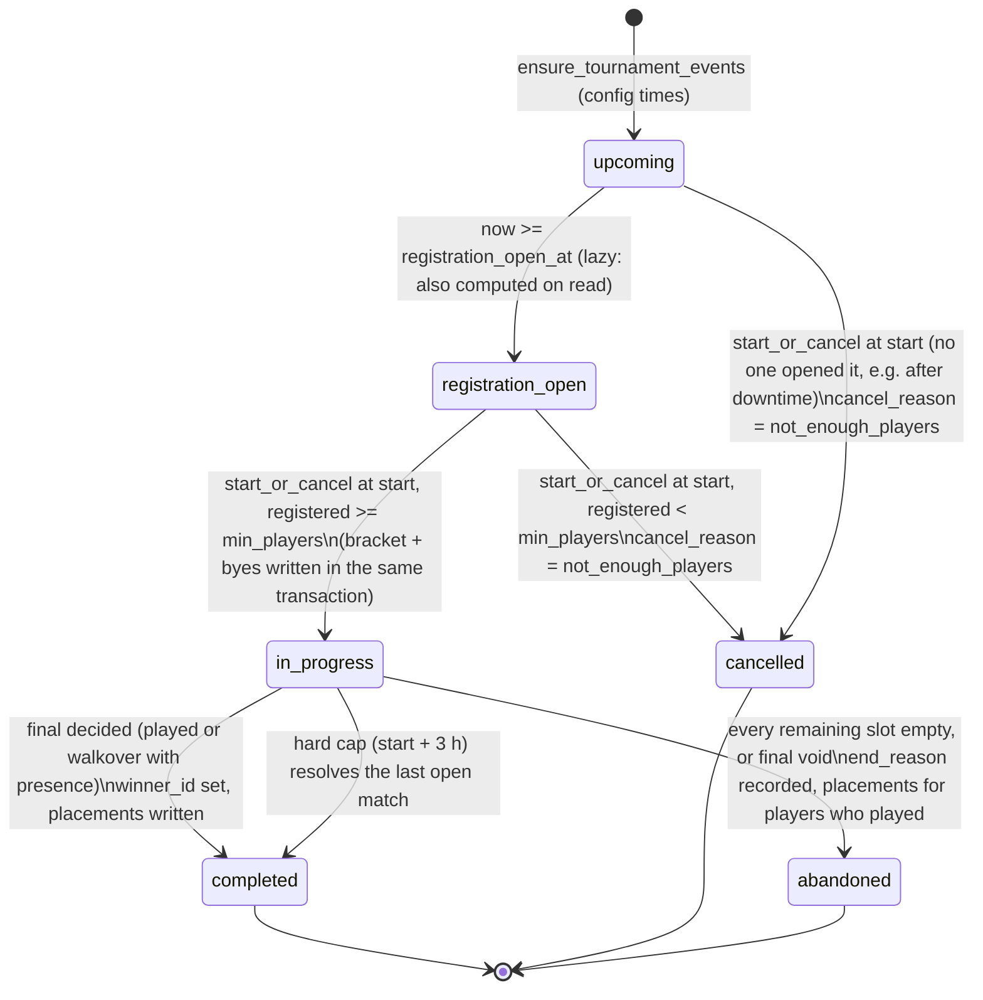
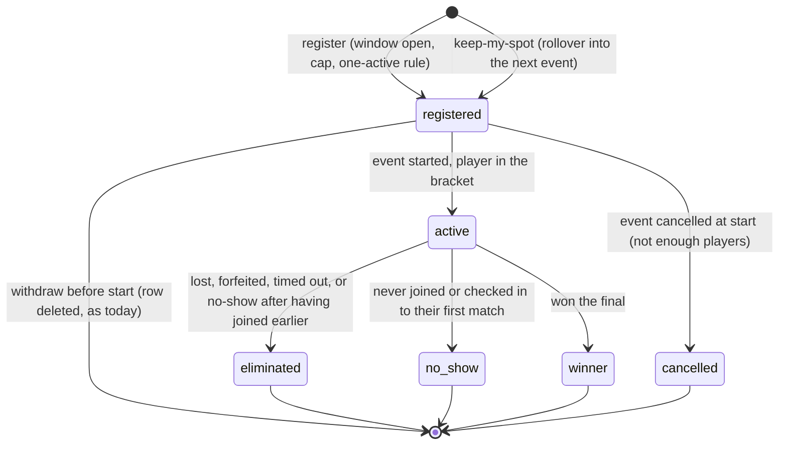

# Tournament v2: design

Status: **Phase 0 draft for approval.** Nothing in this document is built.
Written 2026-10-04 against `origin/main` = `ad20db2e`.

Companion documents:

- `docs/ops/tournament-v2-preflight.md`: production drift audit, the 08-31
  function pieces, retiring v1 rows, pg_cron (Phase 0 items 1 and 2).
- `docs/tournament-v2-capacity.md`: measured server capacity and the hosting
  recommendation (Phase 0 item 3).
- `docs/tournament-review.md`: the review this rebuild answers (A1–A9, B1–B13).

Tournaments stay **off** in production (`TOURNAMENTS_ENABLED` and
`VITE_ENABLE_TOURNAMENTS` unset) through every phase. Turning them on is the
owner's call, after a real playtest.

---

## 0. Decisions this document asks you to make

Defaults are marked. Everything else in the document follows from them.

| # | Question | Default proposed here |
|---|---|---|
| Q1 | Event times and time zone | 3 events a day at **13:00, 18:00, 21:00 America/Los_Angeles** (`TOURNAMENT_EVENT_TIMES`, `TOURNAMENT_TIMEZONE`). Pick from DAU-by-hour data before launch. |
| Q2 | Registration lead | Opens **3 h** before start, closes **at start**. Withdraw allowed until start. |
| Q3 | Field size at launch | min **4**, max **8**; brackets of 4 or 8. Schema and engine support 16 and 32. |
| Q4 | Bye and walkover rule | A bye or walkover still needs a **presence check** within 2 min (automatic if the player has the app open). A player who never showed up anywhere gets no placement. See §4.4. |
| Q5 | Both players absent | Both are eliminated; the slot propagates "empty"; the opponent from the sibling side advances by walkover (with presence check). See §4.5. |
| Q6 | Slow-play cap | In addition to "3 consecutive timeouts forfeits": **6 timeouts in one match forfeits** (stops alternating time-out/play griefing). |
| Q7 | Hard event cap | Events end at **start + 3 h**. Unfinished matches are resolved by score, then seed, never by cancelling the event (fixes A4's "cancel everyone"). |
| Q8 | Hand-to-hand ready stall | In tournament rooms a player not ready for the next hand within **15 s** is readied automatically. |
| Q9 | "Keep my spot" | After a cancel, one tap registers you for the next event, even before its registration opens. No auto-rollover without the tap. |
| Q10 | Rewards and anti-abuse | §9 and §10 are proposals only. Nothing in them is built until you approve. |

---

## 1. Product rules (requirements, numbered for tests)

| Id | Rule |
|---|---|
| R1 | Humans only. No Fritz seats, bot tiers, or bot-vs-bot resolution anywhere in the tournament path. Bot code stays for solo modes. |
| R2 | Public scheduled events only, a small configurable number per day at fixed times in a configurable time zone (default 3). No private or friends tournaments. |
| R3 | Registration opens a configurable lead before start (default 3 h). |
| R4 | At start, the event **runs if at least `min_players` (4) are registered**, otherwise it is cancelled with `cancel_reason = 'not_enough_players'`, a clear message, and a "keep my spot for the next event" offer. |
| R5 | Single elimination, 4–8 players at launch, byes to the top seeds when the field isn't a power of two, seeding by rating. 16 and 32 can be enabled by config without a schema change. |
| R6 | A player who doesn't join their match within 2 minutes forfeits it. |
| R7 | If neither player joins, both are eliminated and the bracket resolves deterministically (§4.5), including in the final. |
| R8 | If every player in an event is gone, the event ends with a recorded reason. |
| R9 | A player who never joined anything gets no placement. |
| R10 | Turn clock: 45 s per turn; on timeout, auto-play (or draw, or pass); forfeit after 3 consecutive timeouts. Constants live in one module. The clock is visible with a warning in the last 10 s. |
| R11 | One active registration per player at a time. |
| R12 | No real money, no purchasable currency. |
| R13 | Funnel counts: viewed, registered, showed up, completed, returned next day. Minimal storage, no per-request logging. |
| R14 | No timers and no queries while no event is in its active window. Supabase traffic stays visible in the hourly by-caller counter. |

---

## 2. What changes from v1, in one table

| Area | v1 (today) | v2 |
|---|---|---|
| Schedule | 48 pre-seeded slots a day, 30 days ahead (1,440 rows), by `seed_future_tournaments` + `ensure_tournament_seed_window` | 3 events a day from config, generated ≤ 48 h ahead by one idempotent RPC called at boot and once a day |
| Start rule | ≥ 1 human, bots fill the rest | ≥ 4 humans registered at start, else cancel + "keep my spot" |
| Bracket | Always 8 (QF/SF/F), bots in empty seats | Size = next power of two ≥ N (4 or 8 now, up to 32 later); byes to top seeds; no empty-vs-empty matches |
| Bracket creation | Node seeds and pairs, RPC writes 7 rows | One RPC `start_or_cancel_tournament` decides, seeds by rating, writes the whole bracket and resolves byes atomically |
| Match completion | `complete_tournament_match` hard-codes 3 rounds and bot ids (not even applied in prod) | v2 of the same RPC: any round count, no bots, void/walkover propagation, abandoned-event end |
| No-show resolution | Node reconciler decides the winner, then calls the RPC | `resolve_expired_tournament_match` RPC decides atomically from `joined_at` on the locked row |
| Scheduler | `setInterval` every 30 s, forever, plus 6-hourly seeding | One timer to the next due instant; a 30 s safety tick **only while an event is live**; zero queries otherwise |
| Turn clock | None for connected humans (A4); disconnect grace passes/draws but **does nothing when the player has a legal tile** | 45 s clock for both players in tournament rooms, auto-play a legal tile, forfeit after 3 consecutive or 6 total timeouts |
| Overlap | Up to ~4 overlapping events, dual registration possible (A8) | One active registration, enforced in the DB under a per-user lock |
| Event expiry | Cancel the whole event after 2 h, no placements | Resolve open matches at start + 3 h; placements stand |
| Analytics | None | Two small tables (§11) |

---

## 3. State machines

### 3.1 Tournament (`scheduled_tournaments.status`)



- `registration_open` is a convenience status. The register RPC trusts the
  timestamps (`registration_open_at <= now() < scheduled_start`), not the
  status, so a late scheduler cannot keep registration shut or open (fixes the
  30 s slip in A2/A9).
- `abandoned` is new. `cancelled` keeps meaning "never started".
- There is no `starting` state: `start_or_cancel_tournament` is one
  transaction, so nobody can observe a half-started event.

### 3.2 Match (`scheduled_tournament_matches.status`)

Slots are `player1_id` / `player2_id`. A slot is **pending** (null and not yet
decided), **filled** (a user id) or **empty** (decided: nobody will come from
the feeder; `playerN_empty = true`).

```mermaid
stateDiagram-v2
    [*] --> waiting: created by start_or_cancel (rounds 2..R, or a round-1 slot pending)
    [*] --> ready: round 1, both slots filled, dispatched at start
    [*] --> walkover_ready: round 1 bye (top seed vs empty)
    waiting --> ready: both slots filled
    waiting --> walkover_ready: one slot filled, other slot empty
    waiting --> void: both slots empty
    ready --> in_progress: both players joined, game started
    ready --> completed: deadline, exactly one joined (no_show)
    ready --> void: deadline, neither joined (double_no_show; both eliminated)
    ready --> ready: deadline, both joined but game not started (one retry, A6)
    ready --> completed: second start failure, higher seed advances (start_failed)
    walkover_ready --> completed: present player checked in (walkover)
    walkover_ready --> void: deadline, player never checked in (no_show; eliminated)
    in_progress --> completed: game over / forfeit / timeout forfeit / hard cap
    completed --> [*]
    void --> [*]
```



- `walkover_ready` is stored as `status = 'ready'` with one slot empty. It is
  named separately here because the client renders it differently (bye
  screen) and the deadline rule differs.
- `void` is new: a match nobody won. Its target slot becomes **empty**.
- Every transition out of `ready` / `in_progress` goes through one RPC that
  locks the match row (the #317 pattern).

### 3.3 Registration (`scheduled_tournament_registrations.status`)



- `no_show` is new and is the only path for R9: **no placement**, no activity
  post, no rewards. A player who joined at least one match and later failed to
  join another is `eliminated`, with the placement of the round they reached.
- "Active registration" for R11 = a row with status `registered` or `active`
  whose event is `upcoming`, `registration_open` or `in_progress`.
  `eliminated`, `no_show`, `winner` and `cancelled` free the player to register
  elsewhere, including for an event still running.

### 3.4 Per-player phase (what the client renders)

Derived on the server (`meState`) from the rows above, never from the client
clock:

`none → registered → lobby (T-10 min..T) → match_ready (join countdown) →
in_match → waiting_for_opponent_match (with ETA) → bye_checkin → … →
eliminated | no_show | champion | event_cancelled | event_abandoned`

---

## 4. The bracket

### 4.1 Size and seeding

- `N` = registered players at start, `min_players ≤ N ≤ max_players`.
- Bracket size `B` = smallest power of two ≥ N, so `B ∈ {4, 8}` now, and 16 or
  32 later by raising `max_players`. Rounds `R = log2(B)`.
- Seeds 1..N by `profiles.glicko_rating` descending, ties by `registered_at`
  ascending, then `user_id` ascending. **Deterministic** and computed **inside**
  the start transaction, so the v1 `registrations_changed` retry dance goes
  away.
- Byes: `B − N`, always to seeds 1..(B − N). Because `B/2 < N ≤ B`, each round-1
  match has at most one empty slot. There is never an empty-vs-empty match in
  round 1 (the v1/v2 RPC creates them today; verified locally, they stay `bye`
  forever).

### 4.2 Pairing order (standard seeding)

Round-1 match `m` (1-based) pairs the seeds at positions `2m−1` and `2m` of the
standard order, built recursively: `order(2) = [1, 2]`,
`order(2k) = interleave(s, 2k + 1 − s for s in order(k))`.

| B | Order | Round-1 pairs |
|---|---|---|
| 4 | 1 4 2 3 | (1,4) (2,3) |
| 8 | 1 8 4 5 2 7 3 6 | (1,8) (4,5) (2,7) (3,6) |
| 16 | 1 16 8 9 4 13 5 12 2 15 7 10 3 14 6 11 | … |

This keeps seeds 1 and 2 apart until the final. For B = 8 it matches today's
`QF_SEED_PAIRS` pairing (the match numbering differs: v1 numbers (3,6) before
(2,7); v2 uses the standard order so the advancement formula below is
uniform).

### 4.3 Advancement (any size)

Match `(r, m)` feeds `(r + 1, ceil(m / 2))`, slot `player1` when `m` is odd,
`player2` when even. The final is `r = R`. This replaces
`_tournament_advance_target`'s hard-coded QF/SF table and the `round between 1
and 3` check.

### 4.4 Byes and walkovers need a presence check

A bye (round 1) or a walkover (a later round whose other slot is empty) is
`ready` with one player and the normal 2-minute deadline. The player clears it
by **checking in**. The server checks the player in itself if they have an
authenticated socket connected at dispatch or before the deadline (the app is
open on any screen); otherwise the bye screen's "I'm here" button, or simply
opening the app, does it. Check-in sets `playerN_joined_at`; the RPC then
completes the match with `winner_source = 'walkover'`.

Why: without it an absent top seed can win a whole event on byes and
walkovers. That is exactly A3 (the absent champion) in a no-bots world.

If only one live player is left in the entire bracket, their remaining
walkovers collapse into one: a single check-in makes them champion.

### 4.5 Deterministic resolution at a deadline

Applied by `resolve_expired_tournament_match(match_id)` on the locked row,
once `ready_deadline_at` has passed:

| State at deadline | Outcome | Players |
|---|---|---|
| Both joined, game started | already `in_progress`, nothing to do | — |
| Both joined, game **not** started, first time | extend deadline 2 min, `status_reason = all_joined_start_retry`, re-send `match_ready` (A6, as today) | — |
| Both joined, still not started | `completed`, lower seed number advances, `winner_source = 'start_failed'` | loser `eliminated` (they did show up) |
| Exactly one joined | `completed`, joined player advances, `winner_source = 'no_show'` | absent player `no_show` if this was their first match, else `eliminated` |
| Neither joined | `void`, `winner_source = 'double_no_show'`, target slot → **empty** | both `no_show` / `eliminated` as above |
| Walkover, checked in | `completed`, `winner_source = 'walkover'` | — |
| Walkover, not checked in | `void`, target slot → empty | `no_show` / `eliminated` |

When a match completes or voids, its target match is re-evaluated in the same
transaction:

| Target slots now | Target becomes |
|---|---|
| filled + filled | `ready`, dispatched (fresh 2-minute deadline) |
| filled + empty | walkover `ready` (presence check) |
| empty + empty | `void`, and **its** target is re-evaluated (propagates upward) |
| filled + pending, or empty + pending | stays `waiting` |

The final follows the same table, so:

- **Final, both finalists absent** → final `void` → event `abandoned`,
  `end_reason = 'final_not_played'`. Placements stand for everyone who played;
  no champion.
- **Final, one finalist absent** → present finalist champion (`no_show`).
- **Every remaining slot empty** at any point → event `abandoned`,
  `end_reason = 'all_players_gone'` immediately, not at the hard cap (R8).

### 4.6 Placements

Placements are written for `active → eliminated | winner` only, never for
`no_show` (R9).

- Champion 1, finalist 2.
- A player eliminated in round `r` gets `2^(R − r) + 1`: B = 8 gives semifinal
  losers 3, quarterfinal losers 5; B = 16 adds 9 for round-1 losers.
- Ties within a tier stay (two "3rd"); labels read "Semifinalist", "Top 4".
- A walkover champion who checked in but never played a game is still
  champion of record; §9 decides whether that earns rewards (proposal: no
  rating points for walkover wins).

---

## 5. Fairness: join window, turn clock, disconnects

### 5.1 One constants module

New `packages/game-core/src/tournamentRules.ts` (shared by server and client,
like the rest of game-core):

```ts
export const TOURNAMENT_RULES = {
  JOIN_WINDOW_MS: 120_000,           // R6
  TURN_MS: 45_000,                   // R10
  TURN_WARNING_MS: 10_000,           // R10, client warning
  MAX_CONSECUTIVE_TIMEOUTS: 3,       // R10
  MAX_TOTAL_TIMEOUTS: 6,             // Q6
  HAND_READY_MS: 15_000,             // Q8
  EVENT_HARD_CAP_MS: 3 * 60 * 60_000,// Q7
  MIN_PLAYERS: 4,                    // R4 (server config can raise, not lower)
  MAX_BRACKET_SIZE: 32,              // schema ceiling
} as const;
```

Server config (`TOURNAMENT_MAX_PLAYERS`, times, time zone, registration lead)
is read once at boot; the constants above are code, because both sides must
agree on them.

### 5.2 Turn clock (tournament rooms only)

- Armed whenever it becomes a seat's turn in a room with a scheduled-tournament
  match, for **both** connected and disconnected players. In tournament rooms
  it replaces the disconnect-grace auto-action (which today does nothing when
  the disconnected player holds a legal tile: `disconnectGrace.ts`, "no legal
  auto-action"). Non-tournament rooms keep today's disconnect grace unchanged.
- Deadline is server-side. `state:update` carries `turnDeadlineAt` and
  `serverNow`; the client counts down from its server offset (§7) and shows the
  10-second warning.
- On expiry: auto-play a legal tile chosen deterministically (highest pip total,
  then the canonical tile order, then the first legal end), else draw, else
  pass, through the same `act()` path as a player action, so persistence, move
  log and verification are unchanged.
- Consecutive-timeout counter per seat resets on any voluntary action. At 3
  consecutive, or 6 in the match, the seat forfeits: `winner_source = 'forfeit'`,
  `status_reason = 'turn_timeouts'`.
- Hand-over: a seat not ready within 15 s is readied automatically (Q8). This
  counts as neither a timeout nor an action.
- One timer per live tournament room at most (the current seat's clock); it is
  cleared on every action, so it adds no idle load.

### 5.3 Disconnects

- A disconnected player keeps their seat; the turn clock decides. Worst case,
  a fully absent player forfeits after 3 × 45 s = 2 min 15 s of their own turns.
- Reconnect (same user) re-attaches as today; the clock keeps running.
- Explicit "leave match" forfeits immediately (existing `applyActiveMatchForfeit`).

### 5.4 Server restart mid-round

| What was running | What happens at boot |
|---|---|
| A `ready` match whose deadline passed while the server was down | Deadline reset to `boot + 2 min`, `status_reason = 'deadline_extended_after_restart'` (nobody could join a dead server), `match_ready` re-sent |
| A `ready` match with time left | Deadline kept; timer re-armed |
| An `in_progress` match with a `room_live_sessions` snapshot | Room hydrates as today when players reconnect; the current turn gets a **fresh** 45 s (counters persist in the room shell) |
| An `in_progress` match with no recoverable snapshot | Room recreated, game restarted from 0–0 with a fresh deal, `status_reason = 'restarted_after_server_failure'`. Rare; announced in-match |
| Event start (`scheduled_start`) passed during downtime | `start_or_cancel` runs on boot. If downtime was < 10 min the event starts late (registrations are still valid); otherwise it is cancelled with `cancel_reason = 'server_unavailable'` and the "keep my spot" offer |
| Hard cap passed during downtime | Resolved on boot as Q7 |

Boot recovery is the same function as the safety tick (§6.3), so there is one
code path for "catch up on everything due".

---

## 6. Scheduler

### 6.1 Event generation

- `ensure_tournament_events(p_from timestamptz, p_to timestamptz, p_times text[],
  p_time_zone text, p_registration_lead interval, p_min_players int, p_max_players int)`
  inserts one row per configured local time per day in the window, keyed by
  `event_key = '<local date>@<HH:MM> <tz>'` (unique), `on conflict do nothing`.
  DST-safe: the local wall time is converted in Postgres with `at time zone`.
- The server calls it at boot and then once a day (one `setTimeout` to the next
  local midnight + 5 min) for the next 48 h. **≈ 1 RPC a day.**
- Changing the config affects only events not yet generated (up to 48 h out).
  To change sooner, delete the not-yet-open `upcoming` rows (statement in the
  ops doc) and restart.
- The v1 seed functions and their 6-hourly server call are deleted (migration
  drops `seed_future_tournaments` and `ensure_tournament_seed_window`).

### 6.2 Lifecycle driver: one timer to the next due instant

The server keeps at most **one** lifecycle timer, set to the earliest of:

- the next `scheduled_start` among `upcoming` / `registration_open` events,
- the earliest `ready_deadline_at` among live matches,
- the hard cap of any `in_progress` event,
- the next daily generation time.

When it fires, the server runs the due work (each step an atomic RPC), re-reads
the next due instant (one small query) and re-arms. With no event live, the
next due instant is the next event's start, hours away: **one timer, zero
queries** until then (R14). Registration in between is request-driven.

Timers are capped at 6 h and re-armed, so clock drift or a missed wakeup costs
at most one extra small query per 6 h.

### 6.3 Safety tick, only while live

While any event is `in_progress`, a 30 s tick runs `catch_up_due()` (deadlines,
hard cap, dispatch of `ready` matches whose room is missing). It is the same
function the boot recovery calls. It stops when no event is `in_progress`.
Expected cost: one indexed read per tick for ~1 h per event, 3 events a day
≈ 360 reads a day, versus 2,880+ a day today.

### 6.4 Wakeups that the server can miss

`setTimeout` doesn't fire while the process is stopped. On Render's free tier
the instance sleeps after 15 min without inbound HTTP traffic, so an event can
miss its start (see `docs/tournament-v2-capacity.md` §4). Two independent
guards:

1. **Boot catch-up** (§5.4): any wake runs everything that came due.
2. **An external wake call at each start time**, so a sleeping instance is woken
   on time: a Supabase `pg_cron` + `pg_net` job, or a GitHub Actions cron,
   hitting `GET /api/tournaments/wake` 1 min before each configured start. The
   endpoint does nothing but return 204 (waking is the point); no auth needed,
   rate-limited like other routes.

On a paid always-on instance (2) is belt-and-braces; on the free tier it is
required.

### 6.5 Singleton

Unchanged stance (HARDENING_PLAN D-7): one process runs the scheduler, gated by
`TOURNAMENT_SCHEDULER_ENABLED`. Every write is an RPC that locks the rows it
changes, so a duplicate scheduler would do redundant work, not wrong work.

---

## 7. Registration, lobby and the clock

- **Register** (`register_for_tournament` v2), in one transaction:
  `pg_advisory_xact_lock(hashtext('tournament_user:' || user_id))` (serializes
  one user's registrations across events: R11), lock the event row, check
  `registration_open_at <= now() < scheduled_start` (database clock), cap,
  no other active registration (§3.3), insert. Errors:
  `registration_not_open`, `registration_closed`, `tournament_full`,
  `already_registered_elsewhere` (with the other event's id and start, so the
  client can say which).
- **Keep my spot**: `register_for_tournament(p_rollover_from := <cancelled id>)`
  skips the "window open" check for the **next** event only, and records
  `source = 'rollover'`.
- **Withdraw**: until `scheduled_start` (database clock).
- **Live lobby**: register and withdraw emit `tournament:roster` to a socket
  room per event (`tournament:<id>`), not `io.emit` to everyone (C6). Lobby
  presence (who has the screen open) is in-memory only, shown as "here now",
  never stored.
- **Server clock**: every tournament REST and socket payload carries
  `serverNow`. The client keeps an offset (median of the last 5 samples) and
  every countdown (registration opens, closes, starts, join deadline, turn
  clock) uses it (B1).

---

## 8. Schema changes (Phase 1 migrations)

New files only; nothing edits an applied migration. Order:

1. `…_tournament_v2_schema.sql`
   - `scheduled_tournaments`: add `format_version int not null default 1`
     (v2 rows = 2), `event_key text unique`, `bracket_size int`,
     `total_rounds int`, `min_players int not null default 4`,
     `registered_at_start int`, `end_reason text`, `ended_at timestamptz`;
     status check adds `abandoned`; **drop `unique (scheduled_start)`** (two
     events could legitimately share a start later; `event_key` is the identity).
   - `scheduled_tournament_matches`: round check `1..5`; status check adds
     `void`; `winner_source` check adds `walkover`, `double_no_show`,
     `start_failed`; add `player1_empty bool not null default false`,
     `player2_empty bool not null default false`, `player1_timeouts int`,
     `player2_timeouts int` (integrity, §10); check that v2 rows hold no
     `bot:` ids.
   - `scheduled_tournament_registrations`: status check adds `cancelled`,
     `no_show`; add `source text not null default 'direct'`
     (`direct | rollover`), `rollover_from uuid`, `eliminated_round int`.
   - Index for R11: `(user_id, status) where status in ('registered','active')`.
   - Backfill for stale v1 children of already-cancelled events, now that
     `void` and `cancelled` exist (28 matches, 19 registrations on 2026-10-04):

     ```sql
     begin;
     update public.scheduled_tournament_matches m
        set status = 'void', status_reason = 'tournament_cancelled'
       from public.scheduled_tournaments t
      where t.id = m.tournament_id
        and t.status = 'cancelled'
        and m.status in ('waiting', 'ready', 'in_progress');
     update public.scheduled_tournament_registrations r
        set status = 'cancelled'
       from public.scheduled_tournaments t
      where t.id = r.tournament_id
        and t.status = 'cancelled'
        and r.status in ('registered', 'active');
     commit;
     ```
2. `…_tournament_v2_rpcs.sql`: `ensure_tournament_events`,
   `register_for_tournament` v2, `withdraw_from_tournament` v2,
   `start_or_cancel_tournament`, `complete_tournament_match` v2,
   `resolve_expired_tournament_match`, `checkin_tournament_match`,
   `catch_up_due_tournaments` (returns the work list; Node acts on rooms).
   All `security definer`, `search_path` pinned, EXECUTE to `service_role` only,
   each locking the rows it changes (#317 pattern).
3. `…_tournament_v2_drop_v1.sql`: drop `seed_future_tournaments`,
   `ensure_tournament_seed_window`, `_tournament_is_bot` and the v1
   `generate_tournament_bracket` (no v2 caller), after the server that no longer
   calls them is deployed.
4. `…_tournament_funnel.sql`: §11 tables.

`scripts/tournament-db-verify.sh` gains sections for each RPC: start-or-cancel
at 3/4/5/8 registrants, byes, void propagation through to the final, the
abandoned event, R11 under two concurrent sessions, rollover, and a 16-player
bracket.

**Not changed:** player id columns stay `text` (v1 history holds bot ids; a
type change buys nothing and risks a long rewrite). `bot_tier` stays as a dead
column for history.

---

## 9. Rewards (proposal only)

No money, nothing purchasable, nothing tradeable (R12). Everything below is
server-authored from match rows.

| Element | Proposal |
|---|---|
| **Tournament Points (TP)** | Placement points by bracket size (8-bracket: champion 100, finalist 60, semifinalist 35, quarterfinalist 15; 4-bracket: 70 / 40 / 20), **plus 10 per game won over a human who was present**. Walkover and bye wins earn 0. A `no_show` earns 0 and does not count as a played event. |
| **Seasons** | Calendar months. Leaderboard by TP; ties by events won, then best placement average. Resets monthly; history kept. |
| **Titles** | Season #1: "<Month> Champion". Top 10: "<Month> Top 10". Shown on the profile and next to the name in tournament screens for the following season. |
| **Trophies** | Permanent counts on the profile: Champion trophies, Finalist medals, events played. |
| **Badges** | First Win; Hat-trick (3 event wins); Perfect Run (won every game, no walkovers); Iron Horse (10 events played); Comeback (won a match after trailing by 15+). |
| **Streaks** | Current and best: consecutive events won; consecutive tournament games won. |
| **Glicko** | Tournament games stay ordinary rated live games, as today. TP is separate and never feeds Glicko. |

Data: `tournament_results` (one row per player per event: placement, games
won/played, TP, season), `tournament_seasons`, `player_badges`. Written by the
final-completion RPC in the same transaction as placements. Built only after
approval, in Phase 2 or 3.

---

## 10. Anti-abuse (proposal, plus what to log now)

**Threats:** one person entering an event on several accounts; two linked
accounts meeting and one throwing the game (to farm TP, badges or rating).

**What we can log now, cheaply (Phase 1):**

| Signal | Where | Notes |
|---|---|---|
| Hashed client IP /24 (IPv4) or /48 (IPv6) | registration row, `ip_prefix_hash` | HMAC with a server secret; never the raw IP |
| Install id | registration row, `install_id_hash` | random id the client keeps in localStorage (and the native shell's storage); hashed |
| Account age at registration | derived from `auth.users.created_at` | no storage |
| Per-match turn timeouts, auto-plays, forfeit reason, final score | match row (`player*_timeouts`, `winner_source`, scores) | already mostly stored |
| Draws taken while holding a legal tile, passes | room move log (already persisted) | derived later, no new writes |

**Detection (proposed, batch SQL, not real-time):**

- *Linked accounts:* two accounts in one event that share an install id hash,
  or an IP-prefix hash on 3+ events, are a **linked pair**.
- *Throwing:* a match between a linked pair where the loser has ≥ 2 timeouts,
  forfeits, or loses by ≥ 25 points; or a pair that meets repeatedly with the
  same winner.
- *Action:* flag only. TP and badges from a flagged match are **held**, and a
  weekly query lists flags for manual review. No automatic bans at launch.

Retention: hashes kept 90 days, then nulled. The privacy policy needs a line
about fraud prevention signals before launch.

---

## 11. Funnel analytics

| Count | Source | Storage |
|---|---|---|
| Event viewed | server, when an authenticated user loads an event (`/api/tournaments/:id` or `/me` with it upcoming/live) | `tournament_daily_viewers (day, event_id, user_id)` primary key; the server dedupes in memory per process-day, so **one insert per user per event per day**, batched every 60 s **only while there is something to flush** |
| Registered | `scheduled_tournament_registrations` | none new |
| Showed up | `player*_joined_at` on the player's first match | none new |
| Completed | registration `eliminated` or `winner` with `placement` set | none new |
| Returned next day | viewer or registration on day D+1 for a user active on day D | SQL join, none new |

No per-request logging. The dashboard queries (Phase 3) read these tables
directly. Writes appear as one caller (`tournament_funnel_flush`) in the hourly
usage counter.

---

## 12. Edge cases (checklist for Phase 1 tests)

| Case | Outcome |
|---|---|
| 3 registered at start | Cancelled `not_enough_players`; all three get the cancel message + keep-my-spot |
| 4 registered | B = 4, no byes, 2 rounds |
| 5 registered | B = 8, seeds 1–3 have byes (presence check), round 1 = (4,5) |
| 7 registered | B = 8, seed 1 bye |
| 8 registered | B = 8, no byes |
| 9th registration attempt | `tournament_full` (cap in the locked RPC) |
| Registration at exactly `scheduled_start` | `registration_closed` (DB clock) |
| Player registered in event A tries event B | `already_registered_elsewhere` |
| Player eliminated from A while A runs, registers for B | Allowed |
| Human leaves (forfeits) in round 1 | Opponent advances (`forfeit`); leaver `eliminated`, placement of round 1 |
| Both players absent in round 1 | Match `void`, both `no_show`; sibling winner later gets a walkover with presence check |
| Both absent in a semifinal | `void`; the other semifinal's winner is champion after one check-in |
| Both finalists absent | Final `void`; event `abandoned`, `final_not_played`; earlier placements stand |
| Every remaining player gone mid-event | Event `abandoned`, `all_players_gone`, immediately |
| Top seed with a bye never opens the app | Bye `void` → `no_show`, no placement; their round-2 opponent gets a walkover |
| Connected player stalls | Turn clock auto-plays; forfeit at 3 consecutive / 6 total timeouts |
| Player disconnects mid-match | Turn clock covers them; reconnecting re-attaches |
| Both joined, game never starts | One 2-min retry, then lower seed number advances (`start_failed`) |
| Server restart mid-round | §5.4 |
| Server asleep at event start | §6.4; catch-up on wake, cancel with `server_unavailable` if > 10 min late |
| Overlapping events | Config validation rejects start times closer than 3 h (the hard cap); R11 makes dual entry impossible anyway |
| Duplicate result producers (game over vs forfeit vs deadline) | Row lock + idempotent completion (unchanged T-INV-1..5) |
| Rating ties at seeding | `registered_at`, then `user_id` |
| A user deletes their account mid-event | Registration row cascades away; their match slot keeps the id; they are treated as absent (`no_show` / forfeit by clock). Placements of others unaffected |

---

## 13. Missing tests carried from `docs/tournament-review.md`

Phase 1 adds, against the v2 engine: registration cap under concurrency and
close-time (A2, already partly covered by `tournament-db-verify.sh` §5),
partial bracket failure (A1, now one transaction), the absent-player chain
(A3, now must **not** produce a champion), both-joined-not-started (A6),
withdraw after start (A7), stalled human with the turn clock (A4), overlapping
events and dual assignment (A8), a tournament-specific restart mid-round (S7),
countdown under clock skew (B1), and render tests for the hub and bracket
screens (B3, B5, B6; Phase 2).

---

## 14. Phase plan (unchanged from the brief)

- **Phase 1** engine + DB: §§3–8, 11; simulated-human harness (scripted clients
  that register, join, play, stall, disconnect or never show); full 4–8 player
  events end to end; a load test with many concurrent simulated events.
- **Phase 2** player experience on top of §7's clock and the new phases.
- **Phase 3** reminders, funnel dashboard SQL, playtest script, launch
  checklist.

Each phase: its own branch and PR, stop with a summary.
